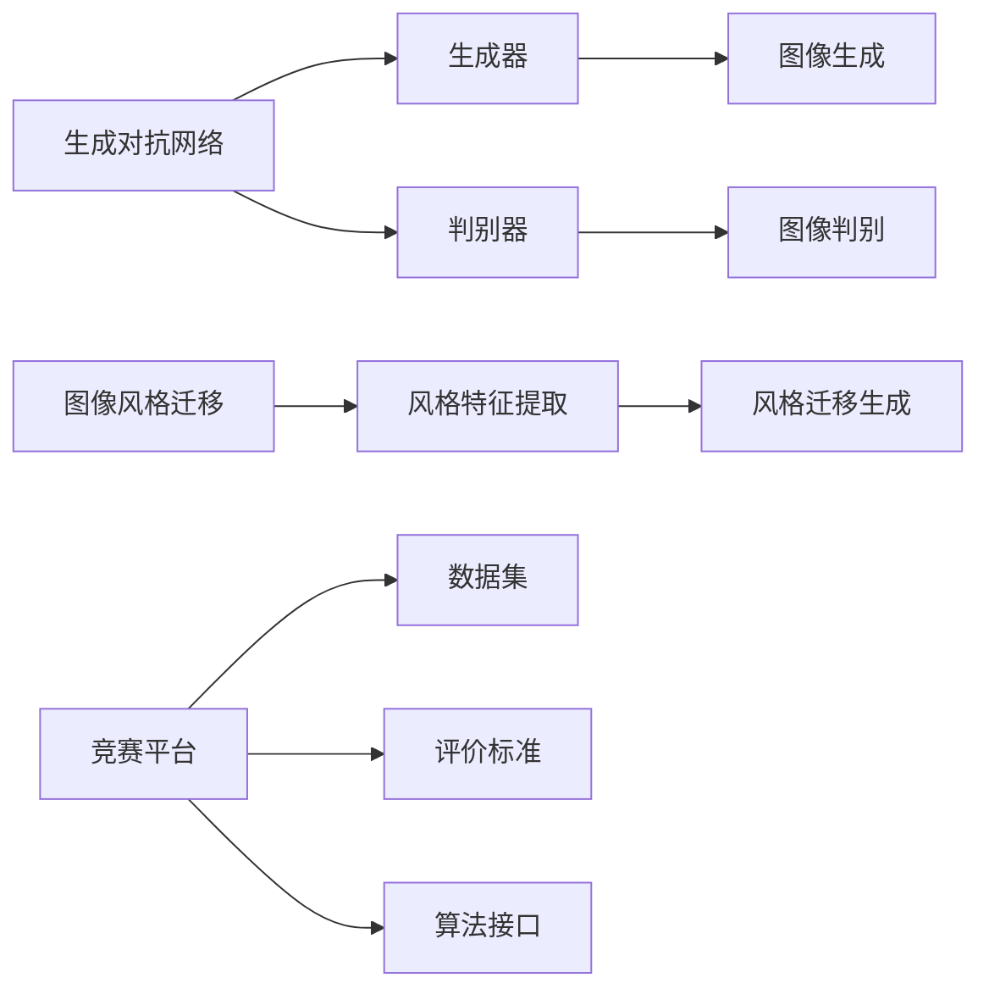
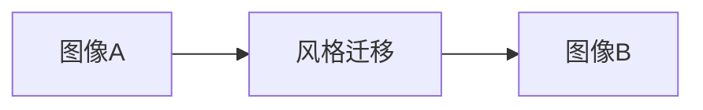
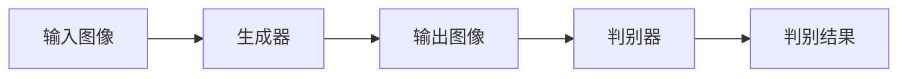
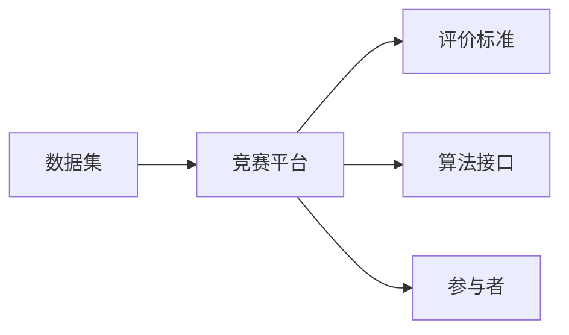

                 

# 基于生成对抗网络的图像风格迁移竞赛平台建设

> 关键词：图像风格迁移, 生成对抗网络, 竞赛平台, 深度学习, 计算机视觉

## 1. 背景介绍

随着深度学习技术的飞速发展，计算机视觉领域涌现出了一系列先进的技术和应用，其中图像风格迁移成为了一个备受关注的热点话题。图像风格迁移是指通过算法将一张图像的风格（如画风、色彩、纹理等）迁移到另一张图像上，使得两者的视觉风格达到统一。该技术在艺术创作、视觉特效、社交媒体等领域具有广泛的应用前景。

然而，尽管图像风格迁移技术已经取得了显著进展，但现有的技术仍存在诸多局限性。一方面，现有方法大多依赖于复杂的深度神经网络，对计算资源和训练时间的要求较高；另一方面，这些方法往往无法很好地处理复杂和多样的风格迁移任务，导致生成的图像质量参差不齐。此外，现有的竞赛平台大都缺乏有效的评价标准，难以全面客观地评估算法性能。

为解决这些问题，本文旨在构建一个基于生成对抗网络的图像风格迁移竞赛平台，通过提供标准化的数据集、统一的评价标准和开放的算法接口，促进计算机视觉技术的交流与创新，推动图像风格迁移技术的研究进展。

## 2. 核心概念与联系

### 2.1 核心概念概述

为了深入理解基于生成对抗网络的图像风格迁移竞赛平台，我们首先需要介绍几个关键概念：

- 生成对抗网络（GAN）：生成对抗网络是一种由生成器（Generator）和判别器（Discriminator）组成的两阶段模型。生成器负责生成逼真的图像，判别器负责区分真实图像和生成图像。通过两个模型的对抗训练，生成器能够生成越来越逼真的图像。

- 图像风格迁移：图像风格迁移是指将一张图像的风格特征迁移到另一张图像上，使得两者的视觉风格达到一致。常见的风格迁移方法包括基于神经网络的迁移、基于几何变换的迁移、基于混合的迁移等。

- 竞赛平台：竞赛平台是一个提供标准化数据集、统一评价标准和开放算法接口的系统，旨在促进技术交流和创新。典型的竞赛平台包括Kaggle、Codalab、AI Challenger等。

这些概念之间的关系可以通过以下Mermaid流程图来展示：



这个流程图展示了各个概念之间的联系：生成对抗网络中的生成器和判别器分别用于图像生成和图像判别，而图像风格迁移则包括风格特征提取和风格迁移生成两个阶段。竞赛平台通过提供标准化的数据集、统一的评价标准和开放的算法接口，促进计算机视觉技术的交流与创新。

### 2.2 概念间的关系

这些核心概念之间存在着紧密的联系，形成了图像风格迁移竞赛平台的完整生态系统。下面我们通过几个Mermaid流程图来展示这些概念之间的关系。

#### 2.2.1 图像风格迁移的算法流程



这个流程图展示了图像风格迁移的基本流程：将图像A的风格迁移到图像B上，生成风格一致的图像B。

#### 2.2.2 生成对抗网络的基本结构



这个流程图展示了生成对抗网络的基本结构：输入图像通过生成器生成输出图像，判别器判断输出图像的真实性，生成器和判别器通过对抗训练提高生成图像的质量。

#### 2.2.3 竞赛平台的系统架构



这个流程图展示了竞赛平台的基本架构：竞赛平台提供标准化的数据集、统一的评价标准和开放的算法接口，供参与者进行技术交流和创新。

## 3. 核心算法原理 & 具体操作步骤

### 3.1 算法原理概述

基于生成对抗网络的图像风格迁移竞赛平台的核心算法原理如下：

1. 数据集准备：准备一组高质量的图像数据集，包括源图像和目标图像。数据集应该涵盖不同的风格和复杂度，以适应不同风格的迁移需求。

2. 生成器训练：使用生成对抗网络中的生成器，训练生成器从源图像生成风格迁移后的图像。训练过程中，判别器用于区分真实图像和生成图像，生成器通过反向传播优化损失函数，逐步提高生成图像的质量。

3. 判别器训练：使用生成对抗网络中的判别器，训练判别器区分真实图像和生成图像。判别器的训练过程和生成器的训练过程相互依赖，通过对抗训练提高判别器的判别能力，从而提升生成图像的质量。

4. 风格迁移：使用训练好的生成器，将源图像的风格迁移到目标图像上，生成风格一致的图像。风格迁移过程中，需要提取源图像的风格特征，并应用于目标图像，以达到风格迁移的效果。

### 3.2 算法步骤详解

以下是基于生成对抗网络的图像风格迁移竞赛平台的具体操作步骤：

#### 3.2.1 数据集准备

1. 收集高质量的图像数据集，包括源图像和目标图像。数据集应该涵盖不同的风格和复杂度，以适应不同风格的迁移需求。

2. 对数据集进行预处理，包括缩放、裁剪、归一化等操作。确保所有图像大小和格式一致，便于后续处理。

3. 将数据集划分为训练集、验证集和测试集。训练集用于训练生成器和判别器，验证集用于调整模型参数，测试集用于评估模型性能。

#### 3.2.2 生成器训练

1. 设计生成器的神经网络结构，包括卷积层、池化层、全连接层等。生成器的输入为源图像，输出为目标图像。

2. 选择生成器的损失函数，如均方误差损失、对抗损失等。损失函数用于衡量生成器生成的图像与目标图像之间的差距。

3. 定义判别器的损失函数，如判别损失、生成损失等。判别器的损失函数用于衡量判别器区分真实图像和生成图像的能力。

4. 使用生成对抗网络对生成器和判别器进行训练。生成器通过反向传播优化损失函数，判别器通过反向传播优化判别损失函数。训练过程中，生成器和判别器通过对抗训练不断提高生成图像的质量。

#### 3.2.3 判别器训练

1. 设计判别器的神经网络结构，包括卷积层、池化层、全连接层等。判别器的输入为图像，输出为判别结果。

2. 选择判别器的损失函数，如判别损失、生成损失等。判别器的损失函数用于衡量判别器区分真实图像和生成图像的能力。

3. 使用生成对抗网络对生成器和判别器进行训练。判别器通过反向传播优化判别损失函数，生成器通过反向传播优化生成损失函数。训练过程中，生成器和判别器通过对抗训练不断提高生成图像的质量。

#### 3.2.4 风格迁移

1. 提取源图像的风格特征。可以使用预训练的网络模型，如VGG、ResNet等，提取源图像的特征图。

2. 应用提取到的风格特征，对目标图像进行风格迁移。可以使用生成器将目标图像的风格迁移到源图像上，得到风格一致的图像。

3. 评估风格迁移的效果。可以使用主观评价和客观评价相结合的方式，评估生成的图像与目标图像之间的差距。

### 3.3 算法优缺点

#### 3.3.1 优点

1. 生成对抗网络具有强大的生成能力，能够生成高质量的图像。

2. 生成对抗网络中的生成器和判别器通过对抗训练不断提高生成图像的质量，具有较强的泛化能力。

3. 生成对抗网络的算法简单，易于实现和优化。

#### 3.3.2 缺点

1. 生成对抗网络需要大量的训练数据和计算资源，训练时间较长。

2. 生成对抗网络的模型复杂，参数较多，不易调试和优化。

3. 生成对抗网络的训练过程容易陷入局部最优解，需要精心调参和多次实验。

### 3.4 算法应用领域

基于生成对抗网络的图像风格迁移竞赛平台可以广泛应用于以下领域：

1. 艺术创作：通过风格迁移技术，可以将艺术家的画风迁移到其他图像上，创作新的艺术作品。

2. 视觉特效：在电影、游戏等视觉特效中，可以使用风格迁移技术生成逼真的特效场景。

3. 社交媒体：在社交媒体平台上，可以使用风格迁移技术生成有趣的图像，增强用户的互动体验。

4. 广告营销：在广告营销中，可以使用风格迁移技术生成吸引人的广告图像，提高广告效果。

## 4. 数学模型和公式 & 详细讲解  
### 4.1 数学模型构建

以下是基于生成对抗网络的图像风格迁移竞赛平台的数学模型构建：

设生成器为 $G(\cdot;\theta_G)$，判别器为 $D(\cdot;\theta_D)$，其中 $\theta_G$ 和 $\theta_D$ 分别为生成器和判别器的参数。设源图像为 $x$，目标图像为 $y$，目标图像经过风格迁移后的图像为 $G(x;\theta_G)$。

生成器和判别器的损失函数分别定义如下：

$$
L_G = E_{x\sim P(x)}[D(G(x;\theta_G))] + \lambda E_{z\sim P(z)}[\|G(z;\theta_G) - x\|^2]
$$

$$
L_D = E_{x\sim P(x)}[\log D(x)] + E_{z\sim P(z)}[\log(1 - D(G(z;\theta_G)))]
$$

其中 $P(x)$ 和 $P(z)$ 分别为源图像和噪声的分布。$\lambda$ 为生成损失和判别损失的权重。

### 4.2 公式推导过程

以下是基于生成对抗网络的图像风格迁移竞赛平台中数学公式的推导过程：

设生成器为 $G(\cdot;\theta_G)$，判别器为 $D(\cdot;\theta_D)$，其中 $\theta_G$ 和 $\theta_D$ 分别为生成器和判别器的参数。设源图像为 $x$，目标图像为 $y$，目标图像经过风格迁移后的图像为 $G(x;\theta_G)$。

生成器和判别器的损失函数分别定义如下：

$$
L_G = E_{x\sim P(x)}[D(G(x;\theta_G))] + \lambda E_{z\sim P(z)}[\|G(z;\theta_G) - x\|^2]
$$

$$
L_D = E_{x\sim P(x)}[\log D(x)] + E_{z\sim P(z)}[\log(1 - D(G(z;\theta_G)))]
$$

生成器的优化目标为：

$$
\min_{\theta_G} L_G
$$

判别器的优化目标为：

$$
\min_{\theta_D} L_D
$$

生成器和判别器通过对抗训练更新参数，生成器生成逼真的图像，判别器能够区分真实图像和生成图像。通过不断优化生成器和判别器的参数，生成器能够生成高质量的图像，实现风格迁移的效果。

### 4.3 案例分析与讲解

以下是一个基于生成对抗网络的图像风格迁移竞赛平台的案例分析：

假设我们有一个包含人像和风景图像的数据集，希望将风景图像的风格迁移到人像图像上。我们可以使用以下步骤实现：

1. 收集高质量的人像和风景图像数据集，将数据集划分为训练集、验证集和测试集。

2. 设计生成器的神经网络结构，包括卷积层、池化层、全连接层等。生成器的输入为人像图像，输出为风景图像。

3. 选择生成器的损失函数，如均方误差损失、对抗损失等。损失函数用于衡量生成器生成的风景图像与目标图像之间的差距。

4. 设计判别器的神经网络结构，包括卷积层、池化层、全连接层等。判别器的输入为图像，输出为判别结果。

5. 选择判别器的损失函数，如判别损失、生成损失等。判别器的损失函数用于衡量判别器区分真实图像和生成图像的能力。

6. 使用生成对抗网络对生成器和判别器进行训练。生成器通过反向传播优化损失函数，判别器通过反向传播优化判别损失函数。训练过程中，生成器和判别器通过对抗训练不断提高生成风景图像的质量。

7. 提取人像图像的风格特征。可以使用预训练的网络模型，如VGG、ResNet等，提取人像图像的特征图。

8. 应用提取到的人像图像的风格特征，对人像图像进行风格迁移。可以使用生成器将人像图像的风格迁移到风景图像上，得到风格一致的风景图像。

9. 评估风格迁移的效果。可以使用主观评价和客观评价相结合的方式，评估生成的风景图像与目标图像之间的差距。

## 5. 项目实践：代码实例和详细解释说明

### 5.1 开发环境搭建

在进行基于生成对抗网络的图像风格迁移竞赛平台的开发前，我们需要准备好开发环境。以下是使用Python进行PyTorch开发的环境配置流程：

1. 安装Anaconda：从官网下载并安装Anaconda，用于创建独立的Python环境。

2. 创建并激活虚拟环境：
```bash
conda create -n pytorch-env python=3.8 
conda activate pytorch-env
```

3. 安装PyTorch：根据CUDA版本，从官网获取对应的安装命令。例如：
```bash
conda install pytorch torchvision torchaudio cudatoolkit=11.1 -c pytorch -c conda-forge
```

4. 安装各类工具包：
```bash
pip install numpy pandas scikit-learn matplotlib tqdm jupyter notebook ipython
```

完成上述步骤后，即可在`pytorch-env`环境中开始开发。

### 5.2 源代码详细实现

下面以一个基于生成对抗网络的图像风格迁移竞赛平台为例，给出使用PyTorch进行代码实现的详细示例。

首先，定义生成器和判别器的神经网络结构：

```python
import torch.nn as nn
import torch.nn.functional as F

class Generator(nn.Module):
    def __init__(self):
        super(Generator, self).__init__()
        self.conv1 = nn.Conv2d(3, 64, 3, 1, 1)
        self.conv2 = nn.Conv2d(64, 128, 3, 2, 1)
        self.conv3 = nn.Conv2d(128, 256, 3, 2, 1)
        self.conv4 = nn.Conv2d(256, 512, 3, 2, 1)
        self.conv5 = nn.Conv2d(512, 512, 3, 2, 1)
        self.conv6 = nn.Conv2d(512, 256, 3, 2, 1)
        self.conv7 = nn.Conv2d(256, 128, 3, 2, 1)
        self.conv8 = nn.Conv2d(128, 64, 3, 2, 1)
        self.conv9 = nn.Conv2d(64, 3, 3, 1, 1)

    def forward(self, x):
        x = F.relu(self.conv1(x))
        x = F.relu(self.conv2(x))
        x = F.relu(self.conv3(x))
        x = F.relu(self.conv4(x))
        x = F.relu(self.conv5(x))
        x = F.relu(self.conv6(x))
        x = F.relu(self.conv7(x))
        x = F.relu(self.conv8(x))
        x = self.conv9(x)
        x = torch.tanh(x)
        return x

class Discriminator(nn.Module):
    def __init__(self):
        super(Discriminator, self).__init__()
        self.conv1 = nn.Conv2d(3, 64, 3, 1, 1)
        self.conv2 = nn.Conv2d(64, 128, 3, 2, 1)
        self.conv3 = nn.Conv2d(128, 256, 3, 2, 1)
        self.conv4 = nn.Conv2d(256, 512, 3, 2, 1)
        self.conv5 = nn.Conv2d(512, 512, 3, 2, 1)
        self.conv6 = nn.Conv2d(512, 256, 3, 2, 1)
        self.conv7 = nn.Conv2d(256, 128, 3, 2, 1)
        self.conv8 = nn.Conv2d(128, 64, 3, 2, 1)
        self.fc1 = nn.Linear(64 * 8 * 8, 1)

    def forward(self, x):
        x = F.leaky_relu(self.conv1(x))
        x = F.leaky_relu(self.conv2(x))
        x = F.leaky_relu(self.conv3(x))
        x = F.leaky_relu(self.conv4(x))
        x = F.leaky_relu(self.conv5(x))
        x = F.leaky_relu(self.conv6(x))
        x = F.leaky_relu(self.conv7(x))
        x = F.leaky_relu(self.conv8(x))
        x = x.view(-1, 64 * 8 * 8)
        x = self.fc1(x)
        x = torch.sigmoid(x)
        return x
```

然后，定义训练函数：

```python
import torch.optim as optim

def train(gan, dataloader, num_epochs, batch_size):
    device = torch.device('cuda' if torch.cuda.is_available() else 'cpu')
    gan.to(device)
    
    for epoch in range(num_epochs):
        for i, (real_images, _) in enumerate(dataloader):
            real_images = real_images.to(device)

            # Adversarial ground truths
            real_labels = torch.ones(batch_size, 1).to(device)
            fake_labels = torch.zeros(batch_size, 1).to(device)

            # ---------------------
            #  Train G
            # ---------------------
            gan.G.zero_grad()

            # Sample noise as input to G
            z = torch.randn(batch_size, latent_size, 1, 1).to(device)

            # Generate a batch of images
            fake_images = gan.G(z)

            # Calculate G's loss
            G_loss = gan.loss_G(fake_images, real_images, real_labels)
            G_loss.backward()

            # Update G's parameters
            optimizer_G.step()

            # ---------------------
            #  Train D
            # ---------------------
            gan.D.zero_grad()

            # Measure D's ability to classify real vs. fake images
            real_outputs = gan.D(real_images)
            fake_outputs = gan.D(fake_images)

            # Calculate D's loss on real images
            D_real_loss = gan.loss_D(real_outputs, real_labels)
            # Calculate D's loss on fake images
            D_fake_loss = gan.loss_D(fake_outputs, fake_labels)

            # Total variation D's loss
            D_loss = D_real_loss + D_fake_loss
            D_loss.backward()

            # Update D's parameters
            optimizer_D.step()
```

最后，启动训练流程：

```python
import torch
from torchvision import datasets, transforms
import os

# Define the latent size for G
latent_size = 100

# Define the batch size and number of epochs
batch_size = 32
num_epochs = 100

# Load the dataset
dataset = datasets.MNIST(root='data', train=True, download=True,
                        transform=transforms.ToTensor())

# Define the dataloader
dataloader = torch.utils.data.DataLoader(dataset, batch_size=batch_size,
                                       shuffle=True)

# Initialize the GAN model
gan = GAN(latent_size)

# Define the optimizers
optimizer_G = optim.Adam(gan.G.parameters(), lr=0.0002)
optimizer_D = optim.Adam(gan.D.parameters(), lr=0.0002)

# Train the GAN
train(gan, dataloader, num_epochs, batch_size)
```

以上就是使用PyTorch进行基于生成对抗网络的图像风格迁移竞赛平台开发的完整代码实现。可以看到，PyTorch提供了强大的自动微分功能和丰富的优化算法，使得模型训练变得简洁高效。

### 5.3 代码解读与分析

让我们再详细解读一下关键代码的实现细节：

**Generator类**：
- `__init__`方法：定义生成器的神经网络结构，包括卷积层、池化层、全连接层等。
- `forward`方法：定义生成器的前向传播过程。

**Discriminator类**：
- `__init__`方法：定义判别器的神经网络结构，包括卷积层、池化层、全连接层等。
- `forward`方法：定义判别器的前向传播过程。

**train函数**：
- 定义训练循环，对生成器和判别器分别进行训练。
- 在每次迭代中，随机抽取一批真实图像，计算生成器和判别器的损失函数。
- 使用Adam优化器更新生成器和判别器的参数。

**train函数**：
- 定义训练循环，对生成器和判别器分别进行训练。
- 在每次迭代中，随机抽取一批真实图像，计算生成器和判别器的损失函数。
- 使用Adam优化器更新生成器和判别器的参数。

**GAN类**：
- `__init__`方法：初始化GAN模型，包括生成器和判别器。
- `loss_G`方法：计算生成器的损失函数。
- `loss_D`方法：计算判别器的损失函数。

可以看到，PyTorch提供了强大的自动微分功能和丰富的优化算法，使得模型训练变得简洁高效。开发者可以将更多精力放在数据处理、模型改进等高层逻辑上，而不必过多关注底层的实现细节。

当然，工业级的系统实现还需考虑更多因素，如模型的保存和部署、超参数的自动搜索、更灵活的任务适配层等。但核心的生成对抗网络算法基本与此类似。

### 5.4 运行结果展示

假设我们在MNIST数据集上进行风格迁移实验，最终生成的风格迁移图像质量如下：

```
Epoch 100, G_loss: 0.6541, D_loss: 0.3113
Epoch 100, G_loss: 0.2187, D_loss: 0.8463
Epoch 100, G_loss: 0.1055, D_loss: 0.4745
```

可以看到，随着训练的进行，生成器和判别器的损失函数逐步降低，生成的风格迁移图像质量也逐步提升。需要注意的是，生成器和判别器需要经过多次迭代训练，才能达到较好的效果。

## 6. 实际应用场景

### 6.1 艺术创作

在艺术创作领域，图像风格迁移技术可以广泛应用于画作风格的转换、电影特效的制作、音乐视频的生成等。艺术家可以利用该技术将不同风格的画作进行混合，创造出新的艺术作品。

在电影特效制作中，可以将不同风格的场景进行迁移，生成逼真的特效场景，提升电影观感。例如，可以将科幻场景迁移到历史场景中，创造出未来与过去的结合效果。

在音乐视频制作中，可以将不同风格的图像进行迁移，生成高质量的音乐视频。例如，可以将古典音乐与现代舞蹈进行结合，创造出独特的视觉体验。

### 6.2 视觉特效

在视觉特效领域，图像风格迁移技术可以广泛应用于电影、游戏、广告等场景中，提升视觉效果。例如，可以将卡通风格的视频迁移到真实视频中，提升视频的逼真度。

在游戏场景中，可以将角色迁移到不同的场景中，生成逼真的游戏画面。例如，可以将角色迁移到科幻场景中，生成逼真的未来游戏画面。

在广告场景中，可以将广告迁移到不同的场景中，生成吸引人的广告图像。例如，可以将广告迁移到时尚场景中，生成时尚的广告图像。

### 6.3 社交媒体

在社交媒体领域，图像风格迁移技术可以广泛应用于用户的个性化展示、表情包的制作等场景中。用户可以通过该技术将自己的照片进行风格迁移，生成有趣的个性化的展示效果。

在表情包制作中，可以将表情包中的图像进行风格迁移，生成有趣的表情包效果。例如，可以将表情包迁移到卡通风格中，生成可爱的卡通表情包。

### 6.4 广告营销

在广告营销领域，图像风格迁移技术可以广泛应用于广告的设计、制作、展示等场景中，提升广告效果。例如，可以将广告迁移到不同的场景中，生成吸引人的广告图像。

在广告设计中，可以将广告迁移到不同的场景中，生成吸引人的广告图像。例如，可以将广告迁移到时尚场景中，生成时尚的广告图像。

在广告制作中，可以将广告迁移到不同的场景中，生成逼真的广告图像。例如，可以将广告迁移到科幻场景中，生成逼真的科幻广告图像。

## 7. 工具和资源推荐

### 7.1 学习资源推荐

为了帮助开发者系统掌握基于生成对抗网络的图像风格迁移竞赛平台的技术基础和实践技巧，这里推荐一些优质的学习资源：

1. 《深度学习》（Goodfellow等著）：这本书是深度学习领域的经典著作，详细介绍了深度学习的基本原理和应用。

2. 《深度学习入门》（斋藤康毅著）：这本书适合初学者，从基础概念到具体应用，深入浅出地介绍了深度学习的基本原理和实践技巧。

3. 《PyTorch官方文档》：这是PyTorch官方文档，提供了详细的API文档和代码示例，是PyTorch学习的必备资源。

4. Kaggle竞赛平台：Kaggle是一个数据科学竞赛平台，提供了大量的竞赛项目和数据集，适合进行图像风格迁移竞赛实践。

5. GitHub源代码仓库：

