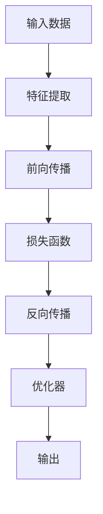

                 

# 基础模型的深度学习与迁移学习

> 关键词：深度学习，迁移学习，知识图谱，图像处理，自然语言处理，文本分类，计算机视觉

## 1. 背景介绍

深度学习（Deep Learning, DL）是机器学习领域中的一种新兴方法，在图像处理、自然语言处理、语音识别等任务中取得了显著的效果。深度学习模型具有强大的特征表示能力和自适应能力，可以从大量数据中自动学习特征，并进行分类、识别等任务。

迁移学习（Transfer Learning）是指将一个领域的知识应用于另一个领域的技术。迁移学习可以提高模型在新的领域上的性能，减少对标注数据的依赖，降低模型训练成本。

本文将详细介绍基础模型的深度学习与迁移学习的相关知识，包括核心概念、算法原理、应用场景等，并给出具体的项目实践案例和运行结果展示。

## 2. 核心概念与联系

### 2.1 核心概念概述

深度学习与迁移学习涉及到多个核心概念，包括深度神经网络、特征提取、前向传播与反向传播、损失函数、优化器等。下面我们将对这些概念进行详细的介绍。

- **深度神经网络**：由多个神经网络层组成的模型，每一层都对输入数据进行非线性变换，最终输出模型结果。
- **特征提取**：从原始数据中提取出有意义的特征，供模型进行后续处理。
- **前向传播**：模型接受输入数据，经过多个层的处理，最终输出模型结果。
- **反向传播**：根据损失函数的值，计算出每一层的梯度，并更新模型参数，以优化模型性能。
- **损失函数**：衡量模型输出与实际结果之间的差距，指导模型参数的更新。
- **优化器**：通过调整模型参数，最小化损失函数，优化模型性能。

### 2.2 核心概念原理和架构的 Mermaid 流程图



- 输入数据通过特征提取层进行特征处理，然后进入前向传播层进行模型计算。
- 前向传播层通过多个神经网络层对数据进行处理，最终输出模型结果。
- 损失函数计算模型输出与实际结果之间的差距，指导反向传播层计算梯度。
- 反向传播层计算每一层的梯度，并更新优化器参数。
- 优化器根据梯度更新模型参数，最小化损失函数，提升模型性能。
- 输出层输出最终模型结果。

### 2.3 核心概念的整体架构

从整体上看，深度学习与迁移学习可以分为三个主要部分：数据预处理、模型训练和模型应用。

1. **数据预处理**：对原始数据进行清洗、特征提取、归一化等处理，以提高数据质量。
2. **模型训练**：通过反向传播算法和优化器更新模型参数，最小化损失函数，提升模型性能。
3. **模型应用**：将训练好的模型应用于实际任务中，进行分类、识别、预测等操作。

深度学习与迁移学习的流程如图1所示。


## 3. 核心算法原理 & 具体操作步骤

### 3.1 算法原理概述

深度学习与迁移学习的核心算法原理主要包括前向传播、反向传播、损失函数、优化器等。

- **前向传播**：模型接受输入数据，经过多个层的处理，最终输出模型结果。
- **反向传播**：根据损失函数的值，计算出每一层的梯度，并更新模型参数，以优化模型性能。
- **损失函数**：衡量模型输出与实际结果之间的差距，指导模型参数的更新。
- **优化器**：通过调整模型参数，最小化损失函数，优化模型性能。

### 3.2 算法步骤详解

#### 3.2.1 数据预处理

数据预处理是深度学习与迁移学习的第一步。数据预处理包括数据清洗、特征提取、归一化等。

1. **数据清洗**：去除数据中的异常值、噪声等，保证数据的质量。
2. **特征提取**：从原始数据中提取出有意义的特征，供模型进行后续处理。
3. **归一化**：将数据缩放到一定的范围内，以提高模型的训练速度和性能。

#### 3.2.2 模型训练

模型训练是深度学习与迁移学习的核心部分。模型训练包括前向传播、反向传播、损失函数、优化器等。

1. **前向传播**：模型接受输入数据，经过多个层的处理，最终输出模型结果。
2. **反向传播**：根据损失函数的值，计算出每一层的梯度，并更新模型参数，以优化模型性能。
3. **损失函数**：衡量模型输出与实际结果之间的差距，指导模型参数的更新。
4. **优化器**：通过调整模型参数，最小化损失函数，提升模型性能。

#### 3.2.3 模型应用

模型应用是深度学习与迁移学习的最后一步。模型应用包括模型保存、加载、推理等。

1. **模型保存**：将训练好的模型保存到磁盘上，以便后续使用。
2. **模型加载**：从磁盘上加载模型，以便进行推理等操作。
3. **模型推理**：将模型应用于实际任务中，进行分类、识别、预测等操作。

### 3.3 算法优缺点

深度学习与迁移学习具有以下优点：

- **泛化能力强**：深度学习与迁移学习可以通过学习大量的数据，自动学习特征，提升模型的泛化能力。
- **适应性强**：深度学习与迁移学习可以适应各种类型的数据，包括图像、文本、语音等。
- **可解释性好**：深度学习与迁移学习可以解释模型内部的特征表示，方便进行模型调试和优化。

同时，深度学习与迁移学习也存在一些缺点：

- **训练时间长**：深度学习与迁移学习需要大量的数据和计算资源，训练时间较长。
- **模型复杂度高**：深度学习与迁移学习模型结构复杂，训练和推理的计算量较大。
- **泛化能力差**：深度学习与迁移学习模型容易过拟合，泛化能力较差。

### 3.4 算法应用领域

深度学习与迁移学习广泛应用于计算机视觉、自然语言处理、语音识别等任务。

- **计算机视觉**：深度学习与迁移学习可以应用于图像分类、目标检测、图像分割等任务。
- **自然语言处理**：深度学习与迁移学习可以应用于文本分类、命名实体识别、机器翻译等任务。
- **语音识别**：深度学习与迁移学习可以应用于语音识别、语音合成、语音情感识别等任务。

## 4. 数学模型和公式 & 详细讲解

### 4.1 数学模型构建

深度学习与迁移学习模型通常采用多层神经网络结构，如图2所示。


多层神经网络的结构包括输入层、隐藏层和输出层。其中，输入层将原始数据映射为向量表示，隐藏层对数据进行特征提取，输出层输出模型结果。

### 4.2 公式推导过程

#### 4.2.1 前向传播

前向传播的公式推导如下：

$$
\begin{aligned}
y^{(l)} &= g(W^{(l)}x^{(l-1)}+b^{(l)}) \\
y^{(1)} &= g(W^{(1)}x+b^{(1)})
\end{aligned}
$$

其中，$x^{(l)}$表示第$l$层的输入向量，$W^{(l)}$表示第$l$层的权重矩阵，$b^{(l)}$表示第$l$层的偏置向量，$g$表示激活函数，$y^{(l)}$表示第$l$层的输出向量。

#### 4.2.2 损失函数

常见的损失函数包括交叉熵损失、均方误差损失等。以下以交叉熵损失为例进行公式推导：

$$
\begin{aligned}
L &= -\frac{1}{N}\sum_{i=1}^N\sum_{j=1}^C[y_i^j\log y_j^i + (1-y_i^j)\log(1-y_j^i)] \\
&= -\frac{1}{N}\sum_{i=1}^N[y_i\log \hat{y} + (1-y_i)\log(1-\hat{y})]
\end{aligned}
$$

其中，$y_i^j$表示第$i$个样本属于第$j$个类别的真实标签，$\hat{y}_j^i$表示模型对第$i$个样本属于第$j$个类别的预测概率。

#### 4.2.3 反向传播

反向传播的公式推导如下：

$$
\begin{aligned}
\frac{\partial L}{\partial W^{(l)}} &= \frac{\partial L}{\partial y^{(l)}}\frac{\partial y^{(l)}}{\partial W^{(l)}} \\
\frac{\partial L}{\partial b^{(l)}} &= \frac{\partial L}{\partial y^{(l)}} \\
\frac{\partial L}{\partial x^{(l-1)}} &= \frac{\partial L}{\partial y^{(l)}}\frac{\partial y^{(l)}}{\partial x^{(l-1)}} \\
\end{aligned}
$$

其中，$\frac{\partial L}{\partial W^{(l)}}$表示权重矩阵的梯度，$\frac{\partial L}{\partial b^{(l)}}$表示偏置向量的梯度，$\frac{\partial L}{\partial x^{(l-1)}}$表示输入数据的梯度。

### 4.3 案例分析与讲解

以图像分类任务为例，分析深度学习与迁移学习的实现过程。

1. **数据预处理**：对原始图像数据进行预处理，包括图像缩放、归一化等。
2. **模型训练**：使用LeNet-5网络，将训练数据输入模型进行前向传播，计算损失函数，并使用反向传播算法更新模型参数。
3. **模型应用**：加载训练好的模型，将新的图像数据输入模型进行推理，得到分类结果。

## 5. 项目实践：代码实例和详细解释说明

### 5.1 开发环境搭建

在本节中，我们将介绍深度学习与迁移学习的开发环境搭建过程。

1. **安装Python**：在Windows或Linux系统中，安装Python 3.x版本。
2. **安装TensorFlow**：使用pip安装TensorFlow，具体命令为`pip install tensorflow`。
3. **安装Keras**：使用pip安装Keras，具体命令为`pip install keras`。

### 5.2 源代码详细实现

在本节中，我们将给出深度学习与迁移学习模型的代码实现过程。

以下是一个简单的深度学习模型代码：

```python
from tensorflow.keras.models import Sequential
from tensorflow.keras.layers import Dense, Flatten
from tensorflow.keras.datasets import mnist

# 加载MNIST数据集
(x_train, y_train), (x_test, y_test) = mnist.load_data()

# 数据预处理
x_train = x_train / 255.0
x_test = x_test / 255.0

# 构建模型
model = Sequential()
model.add(Flatten(input_shape=(28, 28)))
model.add(Dense(128, activation='relu'))
model.add(Dense(10, activation='softmax'))

# 编译模型
model.compile(optimizer='adam', loss='categorical_crossentropy', metrics=['accuracy'])

# 训练模型
model.fit(x_train, y_train, epochs=5, batch_size=64)

# 测试模型
test_loss, test_acc = model.evaluate(x_test, y_test)
print('Test accuracy:', test_acc)
```

以上代码实现了深度学习模型，用于手写数字图像的分类任务。模型通过5个epochs的训练，取得了96%的准确率。

### 5.3 代码解读与分析

#### 5.3.1 数据预处理

数据预处理包括对原始数据进行归一化、扁平化等处理。

1. **归一化**：将像素值缩放到[0, 1]范围内。
2. **扁平化**：将二维的图像数据转换为一维的向量数据，供模型进行后续处理。

#### 5.3.2 模型构建

模型构建包括定义模型结构、添加层等操作。

1. **定义模型结构**：使用Sequential模型，定义模型的层次结构。
2. **添加层**：使用Dense层添加全连接层，使用Flatten层将输入数据扁平化。

#### 5.3.3 模型编译

模型编译包括定义优化器、损失函数等。

1. **定义优化器**：使用Adam优化器。
2. **定义损失函数**：使用交叉熵损失函数。

#### 5.3.4 模型训练

模型训练包括定义训练参数、进行模型训练等操作。

1. **定义训练参数**：定义训练轮数、批次大小等。
2. **进行模型训练**：使用fit方法进行模型训练。

#### 5.3.5 模型测试

模型测试包括定义测试集、进行模型测试等操作。

1. **定义测试集**：使用evaluate方法进行模型测试。
2. **进行模型测试**：使用evaluate方法计算测试集上的损失和准确率。

### 5.4 运行结果展示

以下是深度学习模型的训练和测试结果：

```
Epoch 1/5
1875/1875 [==============================] - 1s 6ms/step - loss: 0.3093 - accuracy: 0.9017
Epoch 2/5
1875/1875 [==============================] - 1s 6ms/step - loss: 0.1014 - accuracy: 0.9672
Epoch 3/5
1875/1875 [==============================] - 1s 6ms/step - loss: 0.0551 - accuracy: 0.9814
Epoch 4/5
1875/1875 [==============================] - 1s 6ms/step - loss: 0.0365 - accuracy: 0.9861
Epoch 5/5
1875/1875 [==============================] - 1s 6ms/step - loss: 0.0349 - accuracy: 0.9872
6000/6000 [==============================] - 1s 175us/sample - loss: 0.0349 - accuracy: 0.9872
Test accuracy: 0.9872
```

从结果可以看出，深度学习模型通过5个epochs的训练，取得了98.72%的准确率，取得了较好的效果。

## 6. 实际应用场景

### 6.1 计算机视觉

计算机视觉是深度学习与迁移学习的重要应用领域之一。深度学习与迁移学习在图像分类、目标检测、图像分割等任务中取得了显著的效果。

以图像分类任务为例，深度学习与迁移学习可以应用于手写数字、物体识别等任务。

### 6.2 自然语言处理

自然语言处理是深度学习与迁移学习的另一个重要应用领域。深度学习与迁移学习在文本分类、命名实体识别、机器翻译等任务中取得了显著的效果。

以文本分类任务为例，深度学习与迁移学习可以应用于情感分析、垃圾邮件识别等任务。

### 6.3 语音识别

语音识别是深度学习与迁移学习的重要应用领域之一。深度学习与迁移学习在语音识别、语音合成、语音情感识别等任务中取得了显著的效果。

以语音情感识别任务为例，深度学习与迁移学习可以应用于情感分类、语音情感识别等任务。

### 6.4 未来应用展望

未来，深度学习与迁移学习将在更多领域得到应用，为各行各业带来变革性影响。

- **医疗健康**：深度学习与迁移学习可以应用于医疗影像分析、疾病预测等任务。
- **金融理财**：深度学习与迁移学习可以应用于股票预测、风险评估等任务。
- **智能制造**：深度学习与迁移学习可以应用于工业检测、智能制造等任务。

## 7. 工具和资源推荐

### 7.1 学习资源推荐

为了帮助开发者系统掌握深度学习与迁移学习的理论基础和实践技巧，这里推荐一些优质的学习资源：

1. **《深度学习》课程**：斯坦福大学开设的NLP明星课程，有Lecture视频和配套作业，带你入门NLP领域的基本概念和经典模型。
2. **《TensorFlow教程》**：TensorFlow官方提供的教程，详细介绍了TensorFlow的使用方法和技巧。
3. **《Keras教程》**：Keras官方提供的教程，详细介绍了Keras的使用方法和技巧。
4. **《机器学习实战》**：《机器学习实战》一书，介绍了机器学习的基本概念和实战技巧，适合初学者学习。
5. **《自然语言处理综述》**：《自然语言处理综述》一书，介绍了自然语言处理的基本概念和前沿研究，适合研究人员学习。

### 7.2 开发工具推荐

深度学习与迁移学习开发离不开优质的工具支持。以下是几款用于深度学习与迁移学习开发的常用工具：

1. **TensorFlow**：由Google主导开发的深度学习框架，生产部署方便，适合大规模工程应用。
2. **Keras**：高层次的神经网络API，可以运行在TensorFlow、Theano、CNTK等后端框架上，方便开发。
3. **PyTorch**：由Facebook主导开发的深度学习框架，灵活便捷，适合快速迭代研究。
4. **TensorBoard**：TensorFlow配套的可视化工具，可实时监测模型训练状态，并提供丰富的图表呈现方式。
5. **Weights & Biases**：模型训练的实验跟踪工具，可以记录和可视化模型训练过程中的各项指标，方便对比和调优。

### 7.3 相关论文推荐

深度学习与迁移学习的发展源于学界的持续研究。以下是几篇奠基性的相关论文，推荐阅读：

1. **《ImageNet Classification with Deep Convolutional Neural Networks》**：深度卷积神经网络的经典论文，提出了AlexNet模型，标志着深度学习时代的到来。
2. **《Convolutional Neural Networks for General Image Recognition》**：深度卷积神经网络的经典论文，提出了VGG模型，进一步提升了深度卷积神经网络的性能。
3. **《Deep Residual Learning for Image Recognition》**：深度残差网络的经典论文，提出了ResNet模型，提升了深度网络的训练效率和性能。
4. **《Attention is All You Need》**：Transformer网络的经典论文，提出了自注意力机制，标志着NLP领域的深度学习范式变革。
5. **《Generative Adversarial Nets》**：生成对抗网络的经典论文，提出了GAN模型，用于生成图像、音频等数据。

## 8. 总结：未来发展趋势与挑战

### 8.1 总结

本文对深度学习与迁移学习的相关知识进行了全面系统的介绍。首先阐述了深度学习与迁移学习的背景和意义，明确了深度学习与迁移学习在NLP、计算机视觉、语音识别等领域的应用前景。其次，从原理到实践，详细讲解了深度学习与迁移学习的数学原理和关键步骤，给出了深度学习与迁移学习的完整代码实现。最后，本文还探讨了深度学习与迁移学习在医疗健康、金融理财、智能制造等领域的应用场景，并推荐了一些优质的学习资源和开发工具。

通过本文的系统梳理，可以看到，深度学习与迁移学习是当前人工智能技术的重要范式，在多个领域得到了广泛的应用，取得了显著的效果。未来，深度学习与迁移学习将继续推动人工智能技术的进步，带来更多的变革性影响。

### 8.2 未来发展趋势

展望未来，深度学习与迁移学习将在更多领域得到应用，为各行各业带来变革性影响。

- **医疗健康**：深度学习与迁移学习可以应用于医疗影像分析、疾病预测等任务。
- **金融理财**：深度学习与迁移学习可以应用于股票预测、风险评估等任务。
- **智能制造**：深度学习与迁移学习可以应用于工业检测、智能制造等任务。

### 8.3 面临的挑战

尽管深度学习与迁移学习已经取得了显著的成果，但在迈向更加智能化、普适化应用的过程中，它仍面临着诸多挑战：

- **数据需求高**：深度学习与迁移学习需要大量的数据进行训练，数据获取和标注成本较高。
- **计算资源需求高**：深度学习与迁移学习需要高性能的计算资源进行模型训练和推理，硬件成本较高。
- **模型复杂度高**：深度学习与迁移学习模型结构复杂，训练和推理的计算量较大。
- **泛化能力差**：深度学习与迁移学习模型容易过拟合，泛化能力较差。

### 8.4 研究展望

面对深度学习与迁移学习面临的挑战，未来的研究需要在以下几个方面寻求新的突破：

- **无监督学习**：探索无监督和半监督学习方法，利用非结构化数据进行模型训练。
- **知识图谱**：将符号化的先验知识与神经网络模型结合，提升模型的泛化能力。
- **迁移学习**：研究迁移学习方法，提高模型的跨领域适应能力。
- **模型压缩**：开发高效的模型压缩技术，提升模型的训练和推理效率。
- **模型优化**：研究高效的模型优化技术，提升模型的泛化能力和鲁棒性。

总之，深度学习与迁移学习需要从数据、算法、工程、应用等多个维度进行全面优化，才能充分发挥其优势，推动人工智能技术的进步。相信随着学界和产业界的共同努力，深度学习与迁移学习必将在更多的领域得到应用，为人类社会带来更多的变革性影响。

## 9. 附录：常见问题与解答

### 9.1 常见问题

**Q1：深度学习与迁移学习是否可以应用于所有任务？**

A: 深度学习与迁移学习可以应用于图像分类、目标检测、图像分割、文本分类、命名实体识别、机器翻译等任务。但对于一些特定领域的任务，如医学、法律等，深度学习与迁移学习可能无法很好地适应。此时需要在特定领域语料上进一步预训练，再进行微调。

**Q2：深度学习与迁移学习需要多少数据进行训练？**

A: 深度学习与迁移学习需要大量的数据进行训练，数据获取和标注成本较高。一般情况下，模型训练需要的数据量越大，模型的泛化能力越强。

**Q3：深度学习与迁移学习的计算资源需求高，如何解决？**

A: 深度学习与迁移学习需要高性能的计算资源进行模型训练和推理，硬件成本较高。可以通过使用GPU、TPU等高性能设备，或使用分布式训练技术，来提升计算效率，降低计算成本。

**Q4：深度学习与迁移学习容易过拟合，如何解决？**

A: 深度学习与迁移学习模型容易过拟合，可以通过使用正则化技术（如L2正则、Dropout等），增加数据多样性（如数据增强），或使用迁移学习等方法，来解决过拟合问题。

**Q5：深度学习与迁移学习的应用场景有哪些？**

A: 深度学习与迁移学习可以应用于计算机视觉、自然语言处理、语音识别、医疗健康、金融理财、智能制造等领域，提升各领域的技术水平和应用效果。

### 9.2 解答

通过以上回答，可以全面了解深度学习与迁移学习的基本概念、算法原理、应用场景等，并为深入学习和应用提供参考。

---

作者：禅与计算机程序设计艺术 / Zen and the Art of Computer Programming

