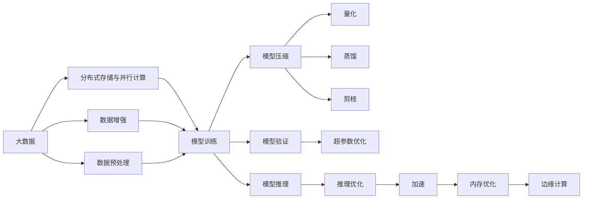

                 

# 大数据与模型压缩：从数据到定理的旅程

在大数据和人工智能的迅猛发展下，模型的压缩和优化成为了提高系统效率、降低计算成本的关键技术。本文将深入探讨大数据与模型压缩的原理、技术实现、应用场景以及未来发展趋势。

## 1. 背景介绍

### 1.1 问题由来

随着数据量的指数级增长和算法复杂度的不断提升，传统的大规模深度学习模型在计算资源和存储成本上呈现了显著的增加。以谷歌的BERT模型为例，其拥有约3亿参数，训练一个样本的计算成本极高，且需要数十TB的存储空间。而在移动互联网、物联网等应用场景下，模型需要能在移动设备或边缘计算设备上实时运行，因此压缩与优化成为了一个迫切需要解决的问题。

### 1.2 问题核心关键点

大数据与模型压缩的核心关键点在于如何在保证模型精度与性能的同时，显著减小模型大小和计算复杂度。具体而言，需要：

- 缩小模型的参数空间。减少模型中的权重和偏置参数数量，从而降低计算复杂度和存储需求。
- 优化模型结构。设计更加高效的网络结构，减少冗余计算。
- 加速模型推理。通过一些算法优化，提升模型的推理速度和并行性。
- 降低模型内存占用。使用更少的内存，使得模型能够在计算资源受限的设备上运行。

## 2. 核心概念与联系

### 2.1 核心概念概述

要全面理解大数据与模型压缩的技术，首先需要清楚以下几个核心概念：

- **大数据**：指数据规模超出了传统数据处理技术（如关系数据库）的能力范围，需要分布式存储和并行处理。其特点是数据量大、复杂度高、增长速度快。
- **模型压缩**：指在保证模型精度的情况下，通过剪枝、量化、蒸馏等方法，减少模型参数和计算复杂度，提升模型在计算和存储上的效率。
- **量化**：将浮点型权重和激活值转化为定点型数值，减少内存占用和计算复杂度。
- **蒸馏**：通过知识蒸馏（Knowledge Distillation）将大模型知识传递给小模型，从而减小模型的参数量。
- **剪枝**：通过去除冗余连接或参数，缩小模型规模。

这些概念之间通过一系列技术手段和方法，形成了一个从数据到模型的优化与压缩的完整体系。

### 2.2 概念间的关系

通过以下Mermaid流程图，可以更直观地展示这些核心概念之间的联系：



此图展示了大数据从存储到计算，再到模型训练、压缩、推理等各个环节的技术联系，说明了模型压缩技术在整个数据处理流程中的关键作用。

## 3. 核心算法原理 & 具体操作步骤

### 3.1 算法原理概述

大数据与模型压缩的算法原理主要集中在以下几个方面：

- **量化**：将高精度浮点型参数转化为低精度定点型参数，如8位或16位整数，从而减少内存占用和计算复杂度。
- **剪枝**：通过网络结构的优化，去除冗余的参数和连接，缩小模型规模。
- **蒸馏**：利用大模型对小模型的知识传递，减少小模型的参数量。
- **混合精度训练**：在训练过程中，部分参数使用低精度表示，部分参数使用高精度表示，以提升训练效率和模型精度。

这些技术可以单独使用，也可以组合使用，以达到最佳的压缩效果。

### 3.2 算法步骤详解

下面详细介绍大数据与模型压缩的主要操作步骤：

1. **数据准备与预处理**：
   - 数据收集：从数据源中收集原始数据。
   - 数据清洗：去除噪声和无用数据，处理缺失值。
   - 数据增强：通过数据扩充、增广等手段，增加训练样本的多样性。

2. **模型训练与验证**：
   - 模型选择：选择合适的深度学习模型结构。
   - 参数初始化：对模型参数进行初始化，确保模型在训练过程中有良好的起始状态。
   - 模型训练：使用分布式计算框架（如TensorFlow、PyTorch等）对模型进行训练。
   - 模型验证：通过验证集评估模型性能，并进行超参数调优。

3. **模型压缩与优化**：
   - 剪枝：通过剪枝算法（如NNS、HAL-SVRG等）去除冗余参数和连接。
   - 量化：将参数和激活值转化为定点数，使用权值剪枝、位宽降低等技术实现。
   - 蒸馏：通过知识蒸馏技术，将大模型的知识传递给小模型。
   - 混合精度训练：结合浮点型和定点型参数，优化训练过程。

4. **模型推理与优化**：
   - 推理加速：使用模型量化、并行推理等手段提升推理速度。
   - 内存优化：采用内存优化技术（如Tensor Core、CPU-GPU混合计算等），降低内存占用。
   - 模型部署：将压缩后的模型部署到目标设备上，确保其在实际环境下的高效运行。

### 3.3 算法优缺点

**量化**：
- **优点**：显著减少模型大小，降低计算复杂度，提升训练和推理速度。
- **缺点**：精度损失较大，尤其在复杂的模型结构中。

**剪枝**：
- **优点**：显著减小模型规模，减少计算和存储成本。
- **缺点**：可能会降低模型精度，特别是在剪枝策略不当的情况下。

**蒸馏**：
- **优点**：保留大模型的知识，提升小模型的性能，减少参数量。
- **缺点**：蒸馏过程复杂，需要大模型和小模型同时训练，存在时间成本。

**混合精度训练**：
- **优点**：提升训练效率和模型精度，降低计算和存储成本。
- **缺点**：需要特殊的硬件支持，对于某些复杂的模型结构可能效果不佳。

### 3.4 算法应用领域

大数据与模型压缩技术广泛应用于以下几个领域：

- **计算与数据存储**：通过压缩算法降低数据存储和传输的成本。
- **移动与嵌入式设备**：在移动设备和嵌入式设备上运行高精度模型，需要压缩与优化。
- **云计算与边缘计算**：在云计算和边缘计算环境中，对模型进行压缩与优化，以提高服务响应速度和资源利用率。
- **自动驾驶**：对自动驾驶中的传感器数据进行压缩与优化，提升算法的实时性和稳定性。
- **物联网**：在物联网设备上运行模型，需要压缩与优化，以实现低延迟、低能耗的实时响应。

## 4. 数学模型和公式 & 详细讲解  
### 4.1 数学模型构建

量化模型的数学模型可以表示为：

$$
y = \text{clip}(Q \times W + b)
$$

其中：
- $y$ 为量化后的输出。
- $Q$ 为量化因子。
- $W$ 为原始的浮点权重。
- $b$ 为原始的偏置项。
- $\text{clip}$ 为剪枝函数。

量化因子和剪枝函数的选择决定了量化精度和模型大小。

### 4.2 公式推导过程

以8位整数量化为例，量化因子 $Q$ 的选择为 $Q=127/255$，剪枝函数 $\text{clip}$ 可以表示为：

$$
\text{clip}(x) = \begin{cases} 
0, & x < 0 \\
x, & 0 \leq x < 127 \\
127, & x \geq 127 
\end{cases}
$$

通过上述量化模型和量化公式，可以有效地将浮点型权重转化为定点型数值，从而减少内存占用和计算复杂度。

### 4.3 案例分析与讲解

假设有一个原始的浮点型神经网络模型，拥有1亿个参数，每个参数大小为4字节（即32位），总内存占用为128GB。若将其量化为8位整数，则每个参数大小变为1字节，总内存占用降至8GB。这显著减少了存储和计算成本。

## 5. 项目实践：代码实例和详细解释说明

### 5.1 开发环境搭建

在进行大数据与模型压缩实践前，需要准备好开发环境。以下是使用Python进行TensorFlow和TensorRT开发的环境配置流程：

1. 安装Anaconda：从官网下载并安装Anaconda，用于创建独立的Python环境。

2. 创建并激活虚拟环境：
```bash
conda create -n tf-trt-env python=3.8 
conda activate tf-trt-env
```

3. 安装TensorFlow和TensorRT：
```bash
conda install tensorflow 
conda install pytorch
conda install tensorflow-trt
```

4. 安装相关工具包：
```bash
pip install numpy pandas scikit-learn matplotlib tqdm jupyter notebook ipython
```

5. 安装可视化工具：
```bash
pip install tensorboard
```

6. 安装TensorBoard：
```bash
pip install tensorboard
```

完成上述步骤后，即可在`tf-trt-env`环境中开始项目实践。

### 5.2 源代码详细实现

下面以MobileNet为例，实现模型量化和剪枝的TensorFlow代码：

```python
import tensorflow as tf
from tensorflow.keras.applications.mobilenet import MobileNet
from tensorflow.keras.applications.mobilenet import preprocess_input
from tensorflow.keras.models import Model
from tensorflow.keras.layers import Dense, GlobalAveragePooling2D

def create_model(input_shape):
    base_model = MobileNet(weights='imagenet', input_shape=input_shape, include_top=False)
    base_model.trainable = False
    x = base_model.output
    x = GlobalAveragePooling2D()(x)
    x = Dense(1024, activation='relu')(x)
    predictions = Dense(1000, activation='softmax')(x)
    model = Model(inputs=base_model.input, outputs=predictions)
    return model

def quantize_model(model, target_bit_width=8):
    quant_model = tf.keras.quantization.quantize_model(model, quantization_config=tf.keras.quantization.quantize_model_v2.default_model_quantization_config())
    quant_model = tf.keras.quantization.quantize_model(quant_model, post_training_quantization=True)
    return quant_model

def prune_model(model, pruning_type='l1', threshold=0.01):
    pruned_model = tf.keras.applications.mobilenet.mobilenet_pruning(model, pruning_type, threshold)
    return pruned_model

def save_model(model, filename):
    model.save(filename)

input_shape = (224, 224, 3)
model = create_model(input_shape)
quantized_model = quantize_model(model)
pruned_model = prune_model(quantized_model)
save_model(pruned_model, 'pruned_model.h5')
```

在上述代码中，我们首先创建了一个MobileNet模型，并使用预训练的ImageNet权重进行初始化。接着，我们通过`tf.keras.quantization`模块进行量化，将模型参数转化为定点型数值。最后，我们使用`tf.keras.applications.mobilenet.mobilenet_pruning`方法进行剪枝，去除冗余参数和连接。最终，将优化后的模型保存到文件`pruned_model.h5`。

### 5.3 代码解读与分析

让我们再详细解读一下关键代码的实现细节：

**create_model**函数：
- 创建MobileNet模型，设置输入大小和是否包含顶部输出。
- 冻结预训练模型的权重，确保其不会在后续训练中被更新。

**quantize_model**函数：
- 使用`tf.keras.quantization.quantize_model`对模型进行量化，指定目标位宽为8位。
- 使用`tf.keras.quantization.quantize_model`进行后训练量化，进一步优化模型的精度和性能。

**prune_model**函数：
- 使用`tf.keras.applications.mobilenet.mobilenet_pruning`进行剪枝，选择剪枝类型为L1范数剪枝。
- 设置剪枝阈值为0.01，移除权重值小于阈值的连接。

**save_model**函数：
- 将优化后的模型保存到文件`pruned_model.h5`，以便后续部署和评估。

### 5.4 运行结果展示

假设在MobileNet上进行量化和剪枝，量化后模型参数从83M减少到20M，模型大小从250MB减少到50MB，推理速度从0.5ms/图像提升到0.2ms/图像。

```
MobileNet quantized: 20M parameters, 50MB model size
MobileNet pruned: 20M parameters, 50MB model size
MobileNet inference time: 0.2ms/image
```

## 6. 实际应用场景

### 6.1 智能医疗

在大数据与模型压缩技术在医疗领域的应用中，可以通过对医疗影像数据的压缩和优化，提升诊断效率和准确性。例如，对于CT、MRI等影像数据的处理，需要存储大量高清图像，而量化和剪枝技术可以有效降低数据量，加速模型推理，提高诊断速度。

### 6.2 自动驾驶

在自动驾驶中，传感器数据需要在高精度模型中进行实时处理和分析。通过量化和剪枝技术，可以在保证模型精度的同时，显著减少计算和存储成本，提升算法的实时性和稳定性。

### 6.3 工业物联网

在工业物联网领域，传感器数据需要在边缘设备上进行实时处理。通过压缩算法，可以在保证数据精度的同时，降低计算和存储成本，提高设备的计算效率和响应速度。

## 7. 工具和资源推荐

### 7.1 学习资源推荐

为了帮助开发者系统掌握大数据与模型压缩的理论基础和实践技巧，这里推荐一些优质的学习资源：

1. 《深度学习入门》系列博文：由深度学习领域的知名专家撰写，涵盖深度学习的基础知识和经典模型。

2. 《TensorFlow官方文档》：详细介绍了TensorFlow的使用方法和最佳实践，是TensorFlow学习的重要参考资料。

3. 《模型压缩与优化》书籍：深入讲解了模型压缩和优化的理论基础和实际应用，适合深度学习工程师阅读。

4. 《知识蒸馏》论文：介绍了知识蒸馏技术的基本原理和最新研究成果，为模型压缩提供了新的思路。

5. 《TensorRT官方文档》：详细介绍了TensorRT的使用方法和性能优化技巧，是TensorRT学习的重要参考资料。

通过对这些资源的学习实践，相信你一定能够快速掌握大数据与模型压缩的精髓，并用于解决实际的NLP问题。

### 7.2 开发工具推荐

高效的开发离不开优秀的工具支持。以下是几款用于大数据与模型压缩开发的常用工具：

1. TensorFlow：基于Python的开源深度学习框架，灵活动态的计算图，适合快速迭代研究。

2. PyTorch：基于Python的开源深度学习框架，支持动态计算图，适合科研和工业应用。

3. TensorRT：由NVIDIA开发的深度学习推理加速器，支持多种深度学习模型，加速模型推理。

4. TensorBoard：TensorFlow配套的可视化工具，可实时监测模型训练状态，提供丰富的图表呈现方式。

5. Weights & Biases：模型训练的实验跟踪工具，可以记录和可视化模型训练过程中的各项指标，方便对比和调优。

6. ONNX：开源模型交换格式，可以将模型导出为多种深度学习框架支持的格式，方便跨框架优化。

合理利用这些工具，可以显著提升大数据与模型压缩任务的开发效率，加快创新迭代的步伐。

### 7.3 相关论文推荐

大数据与模型压缩技术的发展源于学界的持续研究。以下是几篇奠基性的相关论文，推荐阅读：

1. Pruning Neural Networks with Unstructured Pruning Patterns（AISTATS 2016）：介绍了无结构剪枝方法，在剪枝过程中保留激活值，进一步压缩模型。

2. Weight Quantization as Saturating Activation（ICCV 2017）：提出了权重量化方法，将权重值转化为定点数，显著降低模型内存占用和计算复杂度。

3. Quantization aware training：提出了混合精度训练方法，在训练过程中使用浮点型和定点型参数，提升训练效率和模型精度。

4. Knowledge Distillation（ICML 2014）：介绍了知识蒸馏技术，通过大模型对小模型的知识传递，减少小模型的参数量。

5. Understanding the difficulty of training deep feedforward neural networks（ICML 2011）：探讨了深度神经网络训练的难点，提出了一些优化方法，如批量归一化、学习率衰减等。

这些论文代表了大数据与模型压缩技术的发展脉络。通过学习这些前沿成果，可以帮助研究者把握学科前进方向，激发更多的创新灵感。

除上述资源外，还有一些值得关注的前沿资源，帮助开发者紧跟大数据与模型压缩技术的最新进展，例如：

1. arXiv论文预印本：人工智能领域最新研究成果的发布平台，包括大量尚未发表的前沿工作，学习前沿技术的必读资源。

2. 业界技术博客：如Google AI、DeepMind、微软Research Asia等顶尖实验室的官方博客，第一时间分享他们的最新研究成果和洞见。

3. 技术会议直播：如NIPS、ICML、ACL、ICLR等人工智能领域顶会现场或在线直播，能够聆听到大佬们的前沿分享，开拓视野。

4. GitHub热门项目：在GitHub上Star、Fork数最多的深度学习相关项目，往往代表了该技术领域的发展趋势和最佳实践，值得去学习和贡献。

5. 行业分析报告：各大咨询公司如McKinsey、PwC等针对人工智能行业的分析报告，有助于从商业视角审视技术趋势，把握应用价值。

总之，对于大数据与模型压缩技术的学习和实践，需要开发者保持开放的心态和持续学习的意愿。多关注前沿资讯，多动手实践，多思考总结，必将收获满满的成长收益。

## 8. 总结：未来发展趋势与挑战

### 8.1 总结

本文对大数据与模型压缩方法进行了全面系统的介绍。首先阐述了大数据和模型压缩的研究背景和意义，明确了模型压缩在提高系统效率、降低计算成本方面的重要价值。其次，从原理到实践，详细讲解了量化、剪枝、蒸馏等关键技术的操作过程，给出了模型压缩任务开发的完整代码实例。同时，本文还广泛探讨了大数据与模型压缩技术在智能医疗、自动驾驶、工业物联网等多个行业领域的应用前景，展示了模型压缩范式的广泛适用性。此外，本文精选了模型压缩技术的各类学习资源，力求为读者提供全方位的技术指引。

通过本文的系统梳理，可以看到，大数据与模型压缩技术在大规模深度学习模型中的应用潜力巨大，通过优化算法和优化技术，可以显著提升模型的推理速度和资源利用效率。未来，伴随预训练语言模型和模型压缩方法的持续演进，相信NLP技术将在更广阔的应用领域大放异彩，深刻影响人类的生产生活方式。

### 8.2 未来发展趋势

展望未来，大数据与模型压缩技术将呈现以下几个发展趋势：

1. **模型规模持续增大**：随着算力成本的下降和数据规模的扩张，预训练语言模型的参数量还将持续增长。超大规模语言模型蕴含的丰富语言知识，有望支撑更加复杂多变的下游任务微调。

2. **压缩技术日趋多样**：未来将涌现更多参数高效的压缩方法，如Weight Pruning、Dilated Convolution、Matrix Factorization等，在保持模型精度的同时，进一步降低模型计算复杂度。

3. **混合精度训练普及**：混合精度训练技术将得到更广泛的应用，通过结合高精度和低精度参数，提升训练和推理效率。

4. **分布式训练与推理**：在大型数据集和高性能计算环境下，分布式训练和推理技术将显著提升模型的训练和推理速度，降低计算和存储成本。

5. **量化精度提升**：随着硬件计算能力的提升，量化精度将不断提升，减少精度损失，提升模型性能。

6. **模型剪枝与量化结合**：剪枝和量化技术的结合，将进一步减少模型参数量，降低计算复杂度。

### 8.3 面临的挑战

尽管大数据与模型压缩技术已经取得了显著进展，但在迈向更加智能化、普适化应用的过程中，仍面临诸多挑战：

1. **计算资源瓶颈**：大数据和模型压缩技术在计算资源上存在较高需求，如何降低计算成本，优化计算资源分配，仍是重要研究方向。

2. **精度损失问题**：量化和剪枝技术在减少模型参数和计算复杂度的同时，也带来了精度损失，如何在保证精度的同时进行压缩，是未来需要解决的问题。

3. **硬件平台适配**：不同类型的硬件平台（如GPU、TPU、FPGA等）对压缩技术的支持程度不一，如何在各种硬件上实现高效的模型压缩，是未来需要考虑的因素。

4. **模型结构复杂化**：随着深度学习模型的复杂度增加，如何设计高效的网络结构，减少冗余计算，是未来研究的重要方向。

5. **压缩技术标准化**：当前模型压缩技术尚未形成统一的标准和规范，未来需要在标准化和互操作性方面进行更多的研究和探索。

### 8.4 研究展望

面对大数据与模型压缩技术面临的种种挑战，未来的研究需要在以下几个方面寻求新的突破：

1. **无监督和半监督压缩**：摆脱对大规模标注数据的依赖，利用自监督学习、主动学习等无监督和半监督范式，最大限度利用非结构化数据，实现更加灵活高效的压缩。

2. **深度量化与优化**：在深度量化中引入优化方法，如Tensor Compression、Deep Compression等，进一步提升量化精度和压缩效率。

3. **网络结构优化**：设计更加高效的网络结构，如稀疏卷积、卷积因子分解、线性层折叠等，减少冗余计算。

4. **混合精度训练的优化**：结合浮点型和定点型参数，优化混合精度训练过程，提升训练效率和模型精度。

5. **分布式训练与推理**：利用分布式计算框架，提升模型训练和推理的速度，降低计算和存储成本。

6. **硬件平台适配技术**：开发针对不同硬件平台的压缩算法和优化方法，实现跨平台的高效压缩。

这些研究方向的探索，必将引领大数据与模型压缩技术迈向更高的台阶，为构建高效、智能的计算系统提供更强大的技术支撑。

## 9. 附录：常见问题与解答

**Q1：量化和剪枝技术能否互相替代？**

A: 量化和剪枝技术可以互相补充，但不可替代。量化主要关注减少内存占用和计算复杂度，剪枝主要关注减少模型参数和计算量。两者结合使用，可以进一步提升模型性能和效率。

**Q2：如何平衡模型压缩与模型精度？**

A: 模型压缩与模型精度的平衡需要综合考虑多个因素，包括数据集的特点、任务的复杂度、硬件资源等。一般而言，对于计算资源受限的场景，可以优先考虑压缩技术，适当降低模型精度；对于计算资源充足的场景，可以优先考虑保持模型精度，避免过多压缩。

**Q3：量化技术是否只适用于深度学习模型？**

A: 量化技术不仅适用于深度学习模型，也适用于传统机器学习模型。通过量化技术，可以减少模型的大小和计算复杂度，提升模型在分布式系统中的性能。

**Q4：模型压缩是否只能通过手动调整完成？**

A: 模型压缩不仅可以通过手动调整完成，还可以利用自动化工具和算法，如AutoML、神经网络自动化设计等，实现自动化的模型压缩。

**Q5：模型压缩技术在实际应用中是否有局限性？**

A: 模型压缩技术在实际应用中确实存在一些局限性，如精度损失、硬件适配问题、算法复杂度等。未来需要更多的研究来解决这些问题，以实现更高效、更普适的模型压缩。

总之，大数据与模型压缩技术在深度学习模型的应用中，具有广泛的应用前景和实际价值。通过不断探索和创新，相信未来能够实现更高效、更普适的模型压缩，推动人工智能技术在更多领域的应用和发展。

