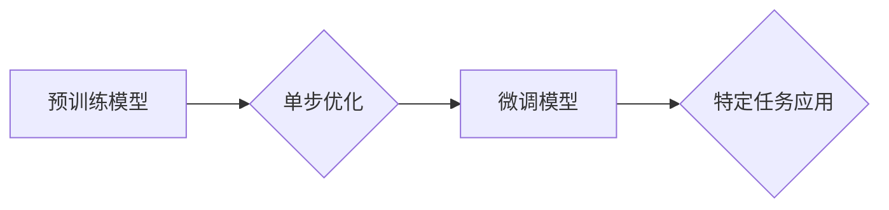

## 大语言模型应用指南：单步优化

> 关键词：大语言模型、单步优化、Transformer、微调、应用场景、实践指南

### 1. 背景介绍

近年来，大语言模型（LLM）在自然语言处理领域取得了令人瞩目的成就。从文本生成、翻译到问答和代码编写，LLM展现出强大的能力，深刻地改变了我们与语言交互的方式。然而，LLM的训练成本高昂，部署和使用也存在一定的挑战。

单步优化作为一种高效的微调方法，为LLM的应用提供了新的思路。它通过一次性更新模型参数，实现对特定任务的快速适应，无需进行复杂的训练过程。这种方法简化了LLM的部署流程，降低了使用门槛，使其更易于在实际应用场景中发挥作用。

### 2. 核心概念与联系

#### 2.1  大语言模型

大语言模型是指在海量文本数据上训练的深度学习模型，能够理解和生成人类语言。它们通常基于Transformer架构，拥有强大的语义理解和文本生成能力。

#### 2.2  微调

微调是指在预训练模型的基础上，针对特定任务进行进一步训练的过程。通过微调，可以将预训练模型的通用知识应用于特定领域，提升模型在该领域的性能。

#### 2.3  单步优化

单步优化是一种高效的微调方法，它通过一次性更新模型参数，实现对特定任务的快速适应。这种方法简化了微调流程，降低了计算成本，提高了效率。

**Mermaid 流程图**



### 3. 核心算法原理 & 具体操作步骤

#### 3.1  算法原理概述

单步优化基于梯度下降算法，通过计算目标任务的损失函数梯度，一次性更新模型参数，使其能够更好地完成特定任务。

#### 3.2  算法步骤详解

1. **准备工作:** 选择预训练模型，定义目标任务的损失函数，并准备训练数据。
2. **计算梯度:** 使用训练数据计算目标任务的损失函数梯度。
3. **更新参数:** 根据梯度信息，一次性更新模型参数。
4. **评估性能:** 使用验证数据评估微调模型的性能。
5. **迭代优化:** 如果性能不满足要求，可以重复上述步骤，进行多次单步优化。

#### 3.3  算法优缺点

**优点:**

* **高效:** 只需一次参数更新，计算成本低。
* **简单:** 操作流程简单，易于实现。
* **快速:** 微调速度快，可以快速适应特定任务。

**缺点:**

* **可能陷入局部最优:** 单次更新可能无法找到全局最优解。
* **参数更新幅度较大:** 可能导致模型性能下降。

#### 3.4  算法应用领域

单步优化适用于各种需要快速适应特定任务的场景，例如：

* **文本分类:** 将预训练模型微调到特定领域的文本分类任务。
* **问答系统:** 将预训练模型微调到特定领域的问答系统。
* **机器翻译:** 将预训练模型微调到特定语言对的机器翻译任务。

### 4. 数学模型和公式 & 详细讲解 & 举例说明

#### 4.1  数学模型构建

假设模型参数为$\theta$, 目标任务的损失函数为$L(\theta, D)$, 其中$D$为训练数据。单步优化的目标是找到最优参数$\theta^*$, 使得损失函数最小化:

$$\theta^* = \arg \min_{\theta} L(\theta, D)$$

#### 4.2  公式推导过程

根据梯度下降算法，模型参数的更新公式为:

$$\theta = \theta - \eta \nabla_{\theta} L(\theta, D)$$

其中$\eta$为学习率，$\nabla_{\theta} L(\theta, D)$为损失函数关于参数$\theta$的梯度。

#### 4.3  案例分析与讲解

假设我们有一个预训练的文本分类模型，需要将其微调到识别垃圾邮件的任务。

1. **损失函数:** 可以使用交叉熵损失函数来衡量模型预测结果与真实标签之间的差异。
2. **梯度计算:** 使用训练数据计算交叉熵损失函数关于模型参数的梯度。
3. **参数更新:** 根据梯度信息，使用学习率$\eta$更新模型参数。
4. **性能评估:** 使用验证数据评估微调模型的性能，例如准确率和召回率。

### 5. 项目实践：代码实例和详细解释说明

#### 5.1  开发环境搭建

* Python 3.7+
* PyTorch 1.7+
* Transformers 4.10+

#### 5.2  源代码详细实现

```python
import torch
from transformers import AutoModelForSequenceClassification, AutoTokenizer

# 加载预训练模型和词典
model_name = "bert-base-uncased"
tokenizer = AutoTokenizer.from_pretrained(model_name)
model = AutoModelForSequenceClassification.from_pretrained(model_name, num_labels=2)

# 定义损失函数和优化器
loss_fn = torch.nn.CrossEntropyLoss()
optimizer = torch.optim.AdamW(model.parameters(), lr=2e-5)

# 加载训练数据
train_data =...

# 单步优化
for epoch in range(3):
    for batch in train_data:
        inputs = tokenizer(batch["text"], padding=True, truncation=True, return_tensors="pt")
        outputs = model(**inputs)
        loss = loss_fn(outputs.logits, batch["label"])

        optimizer.zero_grad()
        loss.backward()
        optimizer.step()

# 保存微调模型
model.save_pretrained("fine_tuned_model")
```

#### 5.3  代码解读与分析

* 代码首先加载预训练模型和词典。
* 然后定义损失函数和优化器。
* 接着加载训练数据，并进行单步优化。
* 最后保存微调模型。

#### 5.4  运行结果展示

运行代码后，可以评估微调模型的性能，例如在测试数据上的准确率和召回率。

### 6. 实际应用场景

单步优化在实际应用场景中具有广泛的应用前景，例如：

* **个性化推荐:** 根据用户的历史行为数据，微调推荐模型，提供个性化的商品推荐。
* **医疗诊断:** 将预训练模型微调到特定疾病的诊断任务，辅助医生进行诊断。
* **法律文本分析:** 将预训练模型微调到法律文本的分析任务，例如识别法律条款和预测案件结果。

#### 6.4  未来应用展望

随着大语言模型的不断发展，单步优化将成为更广泛应用的微调方法。未来，我们可以期待看到更多基于单步优化的创新应用，例如：

* **实时文本生成:** 利用单步优化，实现对实时文本的快速生成和修改。
* **跨语言理解:** 将预训练模型微调到跨语言理解任务，促进不同语言之间的交流。
* **代码自动生成:** 利用单步优化，自动生成代码，提高开发效率。

### 7. 工具和资源推荐

#### 7.1  学习资源推荐

* **论文:**
    * "BERT: Pre-training of Deep Bidirectional Transformers for Language Understanding"
    * "Language Models are Few-Shot Learners"
* **博客:**
    * Hugging Face Blog
    * OpenAI Blog

#### 7.2  开发工具推荐

* **Transformers:** 一个用于处理自然语言处理任务的开源库。
* **PyTorch:** 一个开源的深度学习框架。

#### 7.3  相关论文推荐

* "Adapter Tuning: Efficient Transfer Learning for Large Language Models"
* "Prompt Tuning: Prompt Engineering for Large Language Models"

### 8. 总结：未来发展趋势与挑战

#### 8.1  研究成果总结

单步优化作为一种高效的微调方法，为大语言模型的应用提供了新的思路。它简化了微调流程，降低了计算成本，提高了效率。

#### 8.2  未来发展趋势

未来，单步优化将朝着以下方向发展:

* **更有效的优化算法:** 研究更有效的单步优化算法，提高模型性能和效率。
* **自动化微调:** 开发自动化微调工具，降低用户门槛。
* **多模态应用:** 将单步优化应用于多模态任务，例如文本-图像和文本-音频的联合理解。

#### 8.3  面临的挑战

单步优化也面临一些挑战:

* **局部最优:** 单次更新可能无法找到全局最优解。
* **参数更新幅度:** 过大的参数更新幅度可能导致模型性能下降。
* **数据依赖:** 单步优化效果依赖于训练数据的质量。

#### 8.4  研究展望

未来研究将集中在解决上述挑战，提高单步优化的效率和性能，使其在更多领域得到应用。

### 9. 附录：常见问题与解答

* **Q: 单步优化与传统微调有什么区别？**

A: 传统微调需要进行多次迭代训练，而单步优化只需要一次参数更新。

* **Q: 单步优化适用于哪些场景？**

A: 单步优化适用于需要快速适应特定任务的场景，例如文本分类、问答系统和机器翻译。

* **Q: 如何选择合适的学习率？**

A: 学习率是一个超参数，需要通过实验进行调优。

* **Q: 单步优化是否会影响模型的泛化能力？**

A: 单步优化可能会影响模型的泛化能力，需要根据具体任务进行评估。


作者：禅与计算机程序设计艺术 / Zen and the Art of Computer Programming 
