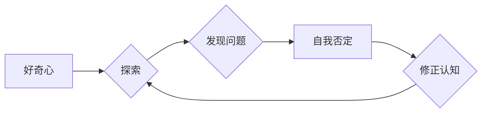

## 好奇心：不断探索与自我否定的动力

> 关键词：好奇心、探索、自我否定、学习、创新、人工智能、算法、深度学习

### 1. 背景介绍

在瞬息万变的科技时代，创新和进步是永恒的主题。而推动这一切的，往往是源于人类内心深处的“好奇心”。好奇心，是一种对未知事物的强烈渴望，它驱使我们不断探索、学习和突破自我。对于人工智能领域而言，好奇心更是至关重要的驱动力。

从最初的符号逻辑到如今的深度学习，人工智能的发展离不开对未知领域的探索和挑战。每一次突破，都源于对现有知识的质疑和对更深层次问题的探究。而自我否定，则是好奇心的一种体现，它让我们不断反思、修正和完善自己的认知，最终走向更深层次的理解。

### 2. 核心概念与联系

好奇心和自我否定并非孤立的概念，它们相互关联，共同推动着人工智能的进步。

**好奇心**是探索的源泉，它让我们渴望了解世界，寻求答案。而**自我否定**则是探索的动力，它让我们不断质疑自己的认知，寻求更准确、更全面的理解。

**Mermaid 流程图：**



**核心概念原理和架构：**

* **好奇心**：源于对未知的渴望，驱使我们探索和学习。
* **探索**：通过观察、实验和思考，获取新的知识和信息。
* **发现问题**：在探索过程中，发现现有知识的局限性或矛盾。
* **自我否定**：对现有认知进行质疑和反思，承认自身的不足。
* **修正认知**：根据新的信息和理解，更新和完善自己的认知模型。

### 3. 核心算法原理 & 具体操作步骤

**3.1 算法原理概述**

深度学习算法，作为人工智能领域的核心技术之一，正是基于好奇心和自我否定的原理进行设计的。

深度学习算法通过多层神经网络结构，模拟人类大脑的学习过程。在训练过程中，算法不断接收数据，并通过调整神经网络权重，不断修正自己的预测结果。

**3.2 算法步骤详解**

1. **数据预处理**: 将原始数据进行清洗、转换和格式化，使其适合深度学习算法的训练。
2. **网络结构设计**: 根据具体任务需求，设计合适的深度神经网络结构，包括神经元数量、层数和激活函数等。
3. **参数初始化**: 为神经网络中的权重和偏置赋予初始值。
4. **前向传播**: 将输入数据通过神经网络层层传递，最终得到预测结果。
5. **损失函数计算**: 计算预测结果与真实值的差异，即损失值。
6. **反向传播**: 根据损失值，反向传播误差信号，调整神经网络权重和偏置。
7. **优化算法**: 使用优化算法，例如梯度下降，不断更新权重和偏置，降低损失值。
8. **模型评估**: 使用测试数据评估模型的性能，并根据评估结果进行模型调优。

**3.3 算法优缺点**

**优点**:

* 表现力强：深度学习算法能够学习到复杂的非线性关系，在图像识别、自然语言处理等领域表现出色。
* 自动特征提取：无需人工提取特征，算法能够自动学习数据中的特征。
* 泛化能力强：经过充分训练的深度学习模型能够对新的数据进行较好的泛化。

**缺点**:

* 数据依赖性强：深度学习算法需要大量的训练数据才能达到较好的性能。
* 计算资源消耗大：训练深度学习模型需要大量的计算资源和时间。
* 可解释性差：深度学习模型的决策过程较为复杂，难以解释其决策依据。

**3.4 算法应用领域**

深度学习算法在各个领域都有广泛的应用，例如：

* **计算机视觉**: 图像识别、目标检测、图像分割、人脸识别等。
* **自然语言处理**: 文本分类、情感分析、机器翻译、对话系统等。
* **语音识别**: 语音转文本、语音合成等。
* **推荐系统**: 商品推荐、内容推荐等。
* **医疗诊断**: 影像分析、疾病预测等。

### 4. 数学模型和公式 & 详细讲解 & 举例说明

**4.1 数学模型构建**

深度学习算法的核心是神经网络模型。神经网络模型由多个层组成，每一层包含多个神经元。神经元之间通过连接权重进行信息传递。

**4.2 公式推导过程**

深度学习算法的训练过程基于梯度下降算法。梯度下降算法的目标是找到一个最优的权重值，使得模型的损失函数最小。

损失函数通常是预测结果与真实值的平方差，即均方误差 (MSE)。

$$MSE = \frac{1}{n} \sum_{i=1}^{n} (y_i - \hat{y}_i)^2$$

其中：

* $n$ 是样本数量
* $y_i$ 是真实值
* $\hat{y}_i$ 是预测值

梯度下降算法通过计算损失函数对权重的梯度，并根据梯度方向更新权重值。

$$\theta = \theta - \alpha \frac{\partial MSE}{\partial \theta}$$

其中：

* $\theta$ 是权重值
* $\alpha$ 是学习率

**4.3 案例分析与讲解**

例如，在图像识别任务中，深度学习模型可以学习到图像中不同特征的表示。

通过多层神经网络，模型可以将图像特征逐层抽象，最终得到图像的类别预测结果。

### 5. 项目实践：代码实例和详细解释说明

**5.1 开发环境搭建**

深度学习算法的开发通常需要使用 Python 语言和相关的深度学习框架，例如 TensorFlow 或 PyTorch。

**5.2 源代码详细实现**

以下是一个使用 TensorFlow 实现图像分类的简单代码示例：

```python
import tensorflow as tf

# 定义模型结构
model = tf.keras.models.Sequential([
  tf.keras.layers.Conv2D(32, (3, 3), activation='relu', input_shape=(28, 28, 1)),
  tf.keras.layers.MaxPooling2D((2, 2)),
  tf.keras.layers.Conv2D(64, (3, 3), activation='relu'),
  tf.keras.layers.MaxPooling2D((2, 2)),
  tf.keras.layers.Flatten(),
  tf.keras.layers.Dense(10, activation='softmax')
])

# 编译模型
model.compile(optimizer='adam',
              loss='sparse_categorical_crossentropy',
              metrics=['accuracy'])

# 训练模型
model.fit(x_train, y_train, epochs=5)

# 评估模型
loss, accuracy = model.evaluate(x_test, y_test)
print('Test loss:', loss)
print('Test accuracy:', accuracy)
```

**5.3 代码解读与分析**

这段代码定义了一个简单的卷积神经网络模型，用于图像分类任务。

模型包含两层卷积层和两层最大池化层，用于提取图像特征。

最后，一层全连接层用于将提取的特征映射到不同的类别。

模型使用 Adam 优化器，损失函数为稀疏类别交叉熵，评价指标为准确率。

**5.4 运行结果展示**

训练完成后，模型可以用来预测新的图像类别。

### 6. 实际应用场景

深度学习算法在各个领域都有广泛的应用，例如：

* **医疗诊断**: 深度学习算法可以用于分析医学图像，辅助医生诊断疾病。
* **金融风险控制**: 深度学习算法可以用于识别欺诈交易和评估风险。
* **智能交通**: 深度学习算法可以用于自动驾驶、交通流量预测等。
* **个性化推荐**: 深度学习算法可以用于推荐个性化的商品、内容和服务。

**6.4 未来应用展望**

随着人工智能技术的不断发展，深度学习算法的应用场景将更加广泛。

例如，深度学习算法将被应用于更复杂的科学研究，例如药物研发和材料科学。

### 7. 工具和资源推荐

**7.1 学习资源推荐**

* **书籍**:
    * 深度学习 (Deep Learning) - Ian Goodfellow, Yoshua Bengio, Aaron Courville
    * 深度学习实战 (Deep Learning with Python) - Francois Chollet
* **在线课程**:
    * Coursera: 深度学习 Specialization
    * Udacity: 深度学习工程师 Nanodegree
* **博客和论坛**:
    * TensorFlow Blog
    * PyTorch Blog
    * Kaggle

**7.2 开发工具推荐**

* **深度学习框架**: TensorFlow, PyTorch, Keras
* **编程语言**: Python
* **数据处理工具**: Pandas, NumPy
* **可视化工具**: Matplotlib, Seaborn

**7.3 相关论文推荐**

* AlexNet: ImageNet Classification with Deep Convolutional Neural Networks
* VGGNet: Very Deep Convolutional Networks for Large-Scale Image Recognition
* ResNet: Deep Residual Learning for Image Recognition
* BERT: Pre-training of Deep Bidirectional Transformers for Language Understanding

### 8. 总结：未来发展趋势与挑战

**8.1 研究成果总结**

深度学习算法取得了显著的成果，在图像识别、自然语言处理等领域取得了突破性的进展。

**8.2 未来发展趋势**

* **模型效率提升**: 研究更轻量级、更高效的深度学习模型，降低计算资源消耗。
* **可解释性增强**: 研究更具可解释性的深度学习模型，提高模型决策的透明度。
* **跨模态学习**: 研究能够处理多种模态数据的深度学习模型，例如图像、文本、音频等。
* **联邦学习**: 研究隐私保护的深度学习方法，例如联邦学习。

**8.3 面临的挑战**

* **数据获取和标注**: 深度学习算法需要大量的训练数据，数据获取和标注成本较高。
* **模型泛化能力**: 深度学习模型在新的数据上表现可能不如预期，泛化能力需要进一步提升。
* **伦理问题**: 深度学习算法的应用可能带来伦理问题，例如算法偏见和隐私泄露。

**8.4 研究展望**

未来，深度学习算法将继续朝着更智能、更安全、更可解释的方向发展。

### 9. 附录：常见问题与解答

**常见问题**:

* 深度学习算法需要多少数据才能训练？
* 如何评估深度学习模型的性能？
* 如何选择合适的深度学习框架？

**解答**:

* 深度学习算法所需的训练数据量取决于具体任务和模型复杂度。一般来说，需要至少几千条数据才能开始训练。
* 深度学习模型的性能可以通过准确率、召回率、F1-score等指标进行评估。
* 选择合适的深度学习框架取决于具体任务和个人喜好。TensorFlow 和 PyTorch 是目前最流行的深度学习框架。


作者：禅与计算机程序设计艺术 / Zen and the Art of Computer Programming 
