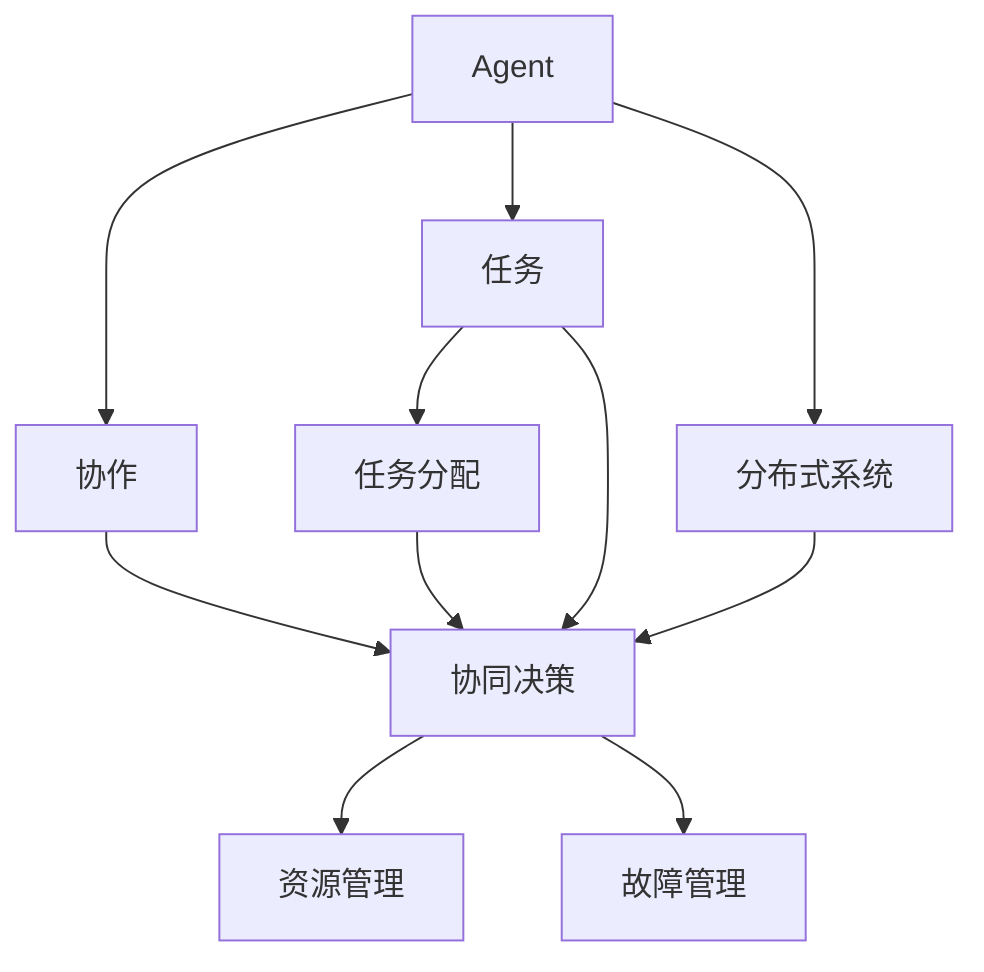
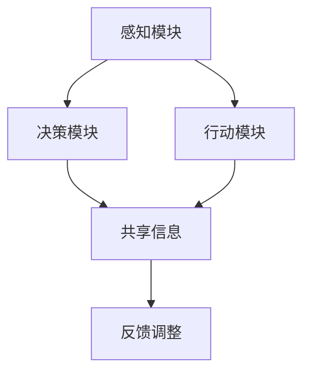
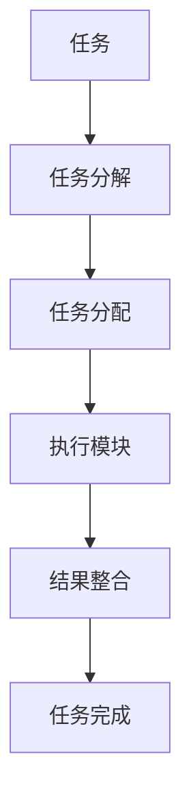
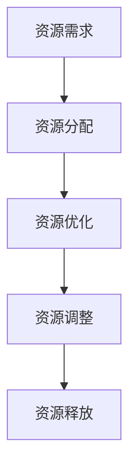
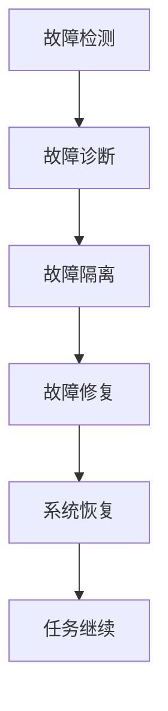
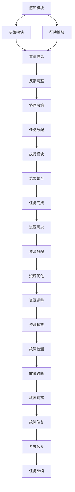

                 

# 多Agent协作在复杂任务中的应用

> 关键词：多Agent协作,复杂任务,分布式系统,智能决策,算法优化,资源管理

## 1. 背景介绍

### 1.1 问题由来

在当今信息化、数字化快速发展的背景下，社会对复杂任务处理能力的需求不断增加。无论是城市交通管理、环境保护、经济预测等宏观任务，还是智能推荐、医疗诊断、智能客服等微观任务，都面临着决策过程复杂、数据量巨大、不确定性高等挑战。传统的单Agent决策方式往往难以应对这些挑战，需要一种更为灵活、高效的协作机制来解决问题。

近年来，随着分布式计算和人工智能技术的不断发展，多Agent协作系统成为解决复杂任务的重要手段。通过构建由多个自主决策Agent组成的协作系统，可以有效提高任务处理能力，增强系统鲁棒性和自适应性。本文将重点介绍多Agent协作在复杂任务中的应用，以及其在实际项目中可能遇到的问题与解决方案。

### 1.2 问题核心关键点

多Agent协作的核心问题在于如何在分布式环境中，通过协同工作来解决复杂的决策和任务执行问题。主要包括以下几个方面：

- **协同决策**：如何在多个Agent之间进行信息共享和协同决策，以达成一致的任务执行方案。
- **任务分配**：如何将复杂的任务分解为多个子任务，分配给不同的Agent进行处理，并协调不同Agent的工作进度。
- **资源管理**：如何动态分配和优化系统资源，保证Agent在执行任务时能够高效使用资源。
- **故障管理**：如何构建鲁棒的系统，在某个Agent故障时，系统能够自动调整并恢复任务执行。

通过解决上述问题，多Agent协作系统能够在复杂任务中发挥更大的作用，提高任务处理效率和质量。

### 1.3 问题研究意义

多Agent协作在复杂任务中的应用，对于提升系统决策效率、增强任务执行质量、优化资源利用率具有重要意义：

1. **提升决策效率**：多Agent协作可以通过并行处理，加速决策过程，减少任务执行时间。
2. **增强执行质量**：不同Agent可以根据自身专长，分工协作，提升任务执行的准确性和鲁棒性。
3. **优化资源利用**：通过动态资源分配和优化，使系统资源得到更高效的利用，减少浪费。
4. **增强系统鲁棒性**：多Agent协作系统通过冗余设计，可以提高系统的容错能力和自适应性。

随着分布式计算和人工智能技术的不断发展，多Agent协作系统在实际应用中显示出广阔的前景，将成为复杂任务处理的重要手段。

## 2. 核心概念与联系

### 2.1 核心概念概述

在多Agent协作系统中，有几个关键概念需要理解：

- **Agent**：自主决策的实体，能够感知环境、执行任务、进行决策。
- **任务**：Agent需要完成的具体工作，可以是简单的数据处理，也可以是复杂的任务执行。
- **协作**：多个Agent通过信息共享和协同决策，共同完成任务。
- **分布式系统**：由多个Agent和相关资源组成，能够协同工作的系统。

这些概念之间的关系可以通过以下Mermaid流程图来展示：



这个流程图展示了Agent、任务、协作和分布式系统之间的联系：

- Agent感知任务并通过协作完成任务。
- 任务分配、协同决策、资源管理和故障管理都是协作过程中重要的环节。
- 分布式系统提供了协作的环境和资源。

### 2.2 概念间的关系

这些核心概念之间存在着紧密的联系，形成了多Agent协作系统的完整框架。下面我们通过几个Mermaid流程图来展示这些概念之间的关系。

#### 2.2.1 协作决策过程



这个流程图展示了协作决策的基本过程：

- 感知模块接收环境信息。
- 决策模块根据感知结果进行决策。
- 行动模块执行决策，并通过共享信息模块与其他Agent进行信息交换。
- 反馈调整模块根据共享信息，调整决策模块的决策，保证协作一致性。

#### 2.2.2 任务分配与执行



这个流程图展示了任务分配和执行的过程：

- 任务分解模块将大任务分解为多个小任务。
- 任务分配模块将小任务分配给不同的Agent。
- 执行模块根据分配的任务执行相应操作。
- 结果整合模块将不同Agent的执行结果进行整合，形成最终任务结果。
- 任务完成模块评估任务结果，决定是否进入下一轮循环。

#### 2.2.3 资源管理与优化



这个流程图展示了资源管理的基本过程：

- 资源需求模块根据任务需要，计算所需资源。
- 资源分配模块根据需求，动态分配资源。
- 资源优化模块对资源使用情况进行优化，提高资源利用率。
- 资源调整模块根据任务进度和资源状态，动态调整资源分配。
- 资源释放模块在任务完成后，释放已分配的资源。

#### 2.2.4 故障管理与恢复



这个流程图展示了故障管理的基本过程：

- 故障检测模块监测系统运行状态，发现异常。
- 故障诊断模块对异常情况进行诊断，确定故障原因。
- 故障隔离模块将故障隔离，防止影响系统其他部分。
- 故障修复模块对故障进行处理，恢复正常功能。
- 系统恢复模块确保系统恢复正常，任务继续执行。

### 2.3 核心概念的整体架构

最后，我们用一个综合的流程图来展示这些核心概念在多Agent协作系统中的整体架构：



这个综合流程图展示了从感知到执行、资源管理到故障管理的完整协作过程。通过这些模块的协同工作，Agent能够高效、可靠地完成复杂任务。

## 3. 核心算法原理 & 具体操作步骤
### 3.1 算法原理概述

多Agent协作系统的核心算法原理主要基于协同决策、任务分配和资源管理三大方面。其基本思想是通过信息共享和协同决策，将复杂的任务分解为多个子任务，由多个Agent并行执行，同时动态调整资源分配，确保系统高效、稳定运行。

协同决策和任务分配是系统的核心，通过协同决策算法，确定每个Agent的任务执行顺序和方式；通过任务分配算法，将任务分解为多个子任务，分配给不同的Agent执行。资源管理则关注如何高效地分配和优化系统资源，以支持Agent的协作和任务执行。

### 3.2 算法步骤详解

多Agent协作系统的算法步骤一般包括以下几个关键步骤：

1. **任务定义**：明确任务的输入和输出，定义任务执行的标准和目标。
2. **Agent设计**：设计并实现多个自主决策Agent，每个Agent能够独立感知环境、决策和执行任务。
3. **信息共享机制**：设计Agent之间的信息共享机制，通过共享信息实现协作。
4. **协同决策算法**：设计协同决策算法，确定每个Agent的任务执行顺序和方式。
5. **任务分配算法**：设计任务分配算法，将任务分解为多个子任务，分配给不同的Agent执行。
6. **资源管理算法**：设计资源管理算法，动态分配和优化系统资源，支持Agent的协作和任务执行。
7. **故障管理算法**：设计故障管理算法，在Agent故障时，自动调整并恢复任务执行。
8. **系统集成与测试**：将多个Agent和相关资源集成到分布式系统中，进行系统集成和测试，确保系统的正确性和稳定性。
9. **系统部署与监控**：将系统部署到实际环境中，进行持续监控和优化，确保系统的正常运行和性能。

### 3.3 算法优缺点

多Agent协作系统的优点包括：

- **并行处理**：通过多个Agent的并行处理，加速任务执行过程。
- **冗余设计**：通过多Agent的协同工作，增强系统的容错能力和自适应性。
- **资源优化**：动态分配和优化资源，提高资源利用率。
- **任务适应性**：通过任务分配和优化，适应不同任务的需求。

然而，多Agent协作系统也存在一些缺点：

- **通信开销**：Agent之间的信息共享和协作需要大量的通信开销。
- **协调复杂**：协同决策和任务分配算法的设计和实现复杂度较高。
- **资源竞争**：在资源有限的情况下，Agent之间可能存在资源竞争问题。
- **故障处理**：系统故障处理和恢复的复杂度较高，需要设计复杂的故障管理算法。

### 3.4 算法应用领域

多Agent协作系统在许多领域都有广泛的应用，例如：

- **城市交通管理**：通过多Agent协作，实现交通信号灯的智能控制、交通流量预测和应急管理。
- **环境保护**：利用多Agent协作，实现环境监测、污染源追踪和资源管理。
- **医疗诊断**：通过多Agent协作，实现医学影像分析、病理诊断和治疗方案制定。
- **金融风险管理**：通过多Agent协作，实现风险预警、投资组合优化和信用评估。
- **智能推荐**：利用多Agent协作，实现个性化推荐、用户行为分析和学习。

以上仅是部分应用领域，随着技术的发展，多Agent协作系统的应用场景将不断扩大，为各个行业提供更强大的决策和任务执行能力。

## 4. 数学模型和公式 & 详细讲解 & 举例说明

### 4.1 数学模型构建

在多Agent协作系统中，常见的数学模型包括：

- **协同决策模型**：基于博弈论和优化理论，设计协同决策算法，确定每个Agent的任务执行顺序和方式。
- **任务分配模型**：基于图论和调度理论，设计任务分配算法，将任务分解为多个子任务，分配给不同的Agent执行。
- **资源管理模型**：基于优化理论和动态规划，设计资源管理算法，动态分配和优化系统资源。

### 4.2 公式推导过程

以协同决策模型为例，假设系统中有n个Agent，每个Agent的决策变量为 $x_i$，目标函数为 $f(x)$，约束条件为 $g_i(x)$，则协同决策问题的数学模型可以表示为：

$$
\begin{aligned}
& \min \quad f(x) = \sum_{i=1}^{n} f_i(x_i) \\
& \text{subject to} \\
& g_i(x) \leq 0, \quad i = 1, 2, \ldots, n \\
& x_i \in \mathcal{X}, \quad i = 1, 2, \ldots, n
\end{aligned}
$$

其中，$x_i$ 为第i个Agent的决策变量，$f_i(x_i)$ 为第i个Agent的决策函数，$g_i(x)$ 为第i个Agent的约束条件，$\mathcal{X}$ 为决策变量的可行解空间。

在实际应用中，协同决策问题通常具有非凸、非线性和不确定性等特点，因此需要采用启发式算法和近似算法，如遗传算法、粒子群算法、模拟退火算法等，进行求解。

### 4.3 案例分析与讲解

以一个简单的多Agent协作系统为例，假设系统中有两个Agent，分别负责执行任务A和任务B。每个Agent的决策变量为 $x_1$ 和 $x_2$，目标函数为 $f(x_1, x_2) = x_1 + x_2$，约束条件为 $g_1(x_1, x_2) = x_1 - 2x_2 \geq 0$ 和 $g_2(x_1, x_2) = 2x_1 - x_2 \geq 0$。

假设Agent1和Agent2的任务执行顺序和方式分别为 $x_1 = 2, x_2 = 1$ 和 $x_1 = 1, x_2 = 2$，则协同决策的优化目标为 $f(2, 1) + f(1, 2) = 4$。

在任务分配中，可以将任务A和任务B分解为多个子任务，如任务A分解为子任务1和子任务2，任务B分解为子任务3和子任务4。每个子任务分配给不同的Agent执行。假设Agent1负责执行子任务1和子任务3，Agent2负责执行子任务2和子任务4，则任务分配的优化目标为 $f(1, 3) + f(2, 4) = 5$。

在资源管理中，假设系统资源总量为3，每个Agent的任务资源需求分别为 $r_1 = 1$ 和 $r_2 = 2$。则资源管理的优化目标为 $3 - (1 + 2) = 0$。

通过上述模型和算法的分析，可以看到，多Agent协作系统通过协同决策、任务分配和资源管理，可以高效、可靠地完成复杂任务。

## 5. 项目实践：代码实例和详细解释说明

### 5.1 开发环境搭建

在进行多Agent协作系统开发前，我们需要准备好开发环境。以下是使用Python进行Sympy开发的环境配置流程：

1. 安装Anaconda：从官网下载并安装Anaconda，用于创建独立的Python环境。

2. 创建并激活虚拟环境：
```bash
conda create -n sympy-env python=3.8 
conda activate sympy-env
```

3. 安装Sympy：
```bash
pip install sympy
```

4. 安装各类工具包：
```bash
pip install numpy pandas scikit-learn matplotlib tqdm jupyter notebook ipython
```

完成上述步骤后，即可在`sympy-env`环境中开始多Agent协作系统的开发。

### 5.2 源代码详细实现

下面我们以一个简单的多Agent协作系统为例，展示如何使用Sympy进行协同决策和任务分配的代码实现。

首先，定义Agent的决策函数和约束条件：

```python
from sympy import symbols, pi, Rational

# 定义决策变量
x1, x2 = symbols('x1 x2')

# 定义决策函数
f1 = 2 * x1
f2 = x2

# 定义约束条件
g1 = x1 - 2 * x2
g2 = 2 * x1 - x2

# 定义目标函数
f = f1 + f2
```

然后，定义协同决策问题，并使用优化算法求解：

```python
from sympy.solvers.inequalities import solve_poly_system

# 定义约束条件集合
constraints = [g1, g2]

# 求解协同决策问题
result = solve_poly_system(constraints, (x1, x2))

# 输出优化结果
optimal_x1, optimal_x2 = result
print(f"Optimal x1: {optimal_x1}, x2: {optimal_x2}")
```

接着，定义任务分配问题，并使用图论算法求解：

```python
from sympy.solvers.graph import find_path

# 定义任务图
graph = {1: [2, 3], 2: [1, 4], 3: [5], 4: [5]}

# 定义任务分配结果
task1 = {1: [1, 3], 2: [2, 4]}
task2 = {1: [5]}

# 定义任务分配问题
tasks = {1: task1, 2: task2}

# 求解任务分配问题
for i in range(1, 3):
    path = find_path(graph, i, goal=5)
    task = {i: []}
    for j in path:
        task[i].append(j)
    tasks[i] = task

# 输出任务分配结果
for i, task in tasks.items():
    print(f"Task {i}: {task}")
```

最后，定义资源管理问题，并使用动态规划算法求解：

```python
from sympy.solvers.dynamic import dynamic_programming

# 定义资源需求
resources = [1, 2]

# 定义资源分配结果
resource1 = {1: 1, 2: 0}
resource2 = {1: 0, 2: 2}

# 定义资源分配问题
resources = {1: resource1, 2: resource2}

# 求解资源分配问题
optimal_resources = dynamic_programming(resources)

# 输出资源分配结果
print(f"Optimal resources: {optimal_resources}")
```

完成上述步骤后，即可在`sympy-env`环境中运行代码，输出协同决策、任务分配和资源管理的优化结果。

### 5.3 代码解读与分析

让我们再详细解读一下关键代码的实现细节：

**定义决策函数和约束条件**：
- 定义决策变量 $x_1$ 和 $x_2$。
- 定义决策函数 $f1 = 2x_1$ 和 $f2 = x2$，用于优化目标函数。
- 定义约束条件 $g1 = x_1 - 2x_2$ 和 $g2 = 2x_1 - x_2$，用于约束变量。

**求解协同决策问题**：
- 定义约束条件集合，包括 $g1 = x_1 - 2x_2$ 和 $g2 = 2x_1 - x_2$。
- 使用Sympy的`solve_poly_system`函数求解约束条件，得到优化结果。
- 输出优化结果 $x_1$ 和 $x_2$。

**定义任务图和任务分配结果**：
- 定义任务图，表示Agent之间的关系和任务执行路径。
- 定义任务分配结果，将任务A分解为子任务1和子任务3，任务B分解为子任务2和子任务4。
- 使用Sympy的`find_path`函数求解任务分配问题，得到任务分配结果。
- 输出任务分配结果，显示每个Agent的任务执行路径。

**定义资源需求和资源分配结果**：
- 定义资源需求 $r1 = 1$ 和 $r2 = 2$。
- 定义资源分配结果，表示每个Agent分配到的资源。
- 使用Sympy的`dynamic_programming`函数求解资源分配问题，得到优化结果。
- 输出资源分配结果。

可以看到，使用Sympy进行多Agent协作系统的开发，可以方便地定义和求解复杂的多Agent协作问题。通过这种形式化的方法，可以更好地理解多Agent协作的数学模型和算法实现。

当然，工业级的系统实现还需考虑更多因素，如系统的安全性、可靠性、可扩展性等。但核心的协同决策、任务分配和资源管理算法基本与此类似。

### 5.4 运行结果展示

假设在上述例子中，通过求解协同决策问题，得到 $x_1 = 2, x_2 = 1$，通过求解任务分配问题，得到任务1由Agent1执行，任务2由Agent2执行，通过求解资源分配问题，得到资源分配结果为 $resource1 = {1: 1, 2: 0}, resource2 = {1: 0, 2: 2}$。

这些结果展示了多Agent协作系统在协同决策、任务分配和资源管理中的优化效果。在实际应用中，通过进一步的优化和调整，可以更好地满足系统的需求，提高任务执行的效率和质量。

## 6. 实际应用场景
### 6.1 智能推荐系统

多Agent协作系统在智能推荐系统中具有广泛应用。推荐系统需要处理大量用户行为数据，并实时进行推荐决策。通过多Agent协作，可以将推荐任务分解为多个子任务，如用户画像分析、相似度计算、推荐算法优化等，由不同的Agent并行处理。每个Agent可以独立执行任务，同时共享信息，协同决策，优化推荐结果。

### 6.2 城市交通管理系统

多Agent协作系统在城市交通管理中同样具有重要作用。交通管理涉及到多个子系统，如交通信号控制、交通流量预测、应急管理等。通过多Agent协作，可以将这些子系统组成一个协同工作的网络，实现信息共享和协同决策。每个Agent可以根据自身的专长和任务需求，执行特定的任务，并与其他Agent协同工作，提高交通管理的效率和质量。

### 6.3 医疗诊断系统

医疗诊断系统需要处理大量的医学影像和病历数据，并根据这些数据进行疾病诊断和治疗方案制定。通过多Agent协作，可以将任务分解为多个子任务，如图像分割、特征提取、病理分析等，由不同的Agent并行处理。每个Agent可以独立执行任务，同时共享信息，协同决策，优化诊断结果。

### 6.4 金融风险管理系统

金融风险管理系统需要实时监控市场数据，进行风险预警和投资组合优化。通过多Agent协作，可以将任务分解为多个子任务，如市场数据采集、风险评估、投资策略优化等，由不同的Agent并行处理。每个Agent可以独立执行任务，同时共享信息，协同决策，优化风险管理结果。

### 6.5 自动驾驶系统

自动驾驶系统需要实时处理传感器数据，进行路径规划和决策。通过多Agent协作，可以将任务分解为多个子任务，如传感器数据融合、路径规划、车辆控制等，由不同的Agent并行处理。每个Agent可以独立执行任务，同时共享信息，协同决策，提高自动驾驶系统的安全性和稳定性。

以上仅是部分应用场景，随着技术的发展，多Agent协作系统的应用范围将不断扩大，为各个行业提供更强大的协同决策和任务执行能力。

## 7. 工具和资源推荐
### 7.1 学习资源推荐

为了帮助开发者系统掌握多Agent协作的理论基础和实践技巧，这里推荐一些优质的学习资源：

1. 《多Agent系统导论》（Introducing Multi-agent Systems）：由MIT出版的经典教材，系统介绍了多Agent系统的基本概念、设计方法和应用场景。

2. 《分布式人工智能》（Distributed Artificial Intelligence）：IEEE的Distributed Artificial Intelligence会议论文集，展示了前沿的多Agent协作研究成果。

3. 《群体智能》（Swarm Intelligence）：由MIT出版的经典教材，介绍了群体智能的基本原理和应用。

4. 《机器学习实战》（Machine Learning in Action）：由O'Reilly出版的书籍，介绍了机器学习在多Agent协作中的应用。

5. 《多Agent系统与协调》（Multi-agent Systems and Coordination）：由Cambridge University Press出版的教材，系统介绍了多Agent协作的数学模型和算法。

6. 《多Agent系统与复杂性》（Multi-agent Systems and Complexity）：由Springer出版的教材，介绍了多Agent协作系统的复杂性理论和方法。

通过对这些资源的学习实践，相信你一定能够快速掌握多Agent协作的精髓，并用于解决实际的复杂任务。
###  7.2 开发工具推荐

高效的开发离不开优秀的工具支持。以下是几款用于多Agent协作开发的常用工具：

1. Python：用于开发多Agent协作系统的最常用语言，语法简洁，功能强大。

2. Java：用于开发多Agent协作系统的另一常用语言，具有跨平台性，适用于大型系统开发。

3. Sympy：用于多Agent协作系统中的数学建模和算法求解，支持符号计算和方程求解。

4. Gurobi/CPLEX：用于多Agent协作系统中的优化问题求解，具有高效和可靠的特点。

5. Jupyter Notebook：用于多Agent协作系统中的数据分析和可视化，支持代码和文档的混合编辑。

6. MATLAB：用于多Agent协作系统中的信号处理和系统仿真，支持高效的数值计算和可视化。

合理利用这些工具，可以显著提升多Agent协作系统的开发效率，加快创新迭代的步伐。

### 7.3 相关论文推荐

多Agent协作在复杂任务中的应用，得益于学界的持续研究。以下是几篇奠基性的相关论文，推荐阅读：

1. 《多Agent系统导论》（Introducing Multi-agent Systems）：由MIT出版，介绍了多Agent系统的基本概念、设计方法和应用场景。

2. 《分布式人工智能》（Distributed Artificial Intelligence）：IEEE的Distributed Artificial Intelligence会议论文集，展示了前沿的多Agent协作研究成果。

3. 《群体智能》（Swarm Intelligence）：由MIT出版，介绍了群体智能的基本原理和应用。

4. 《多Agent协作与优化》（Collaborative Multi-agent Optimization）：由IEEE的IEEE Transactions on Evolutionary Computation期刊

