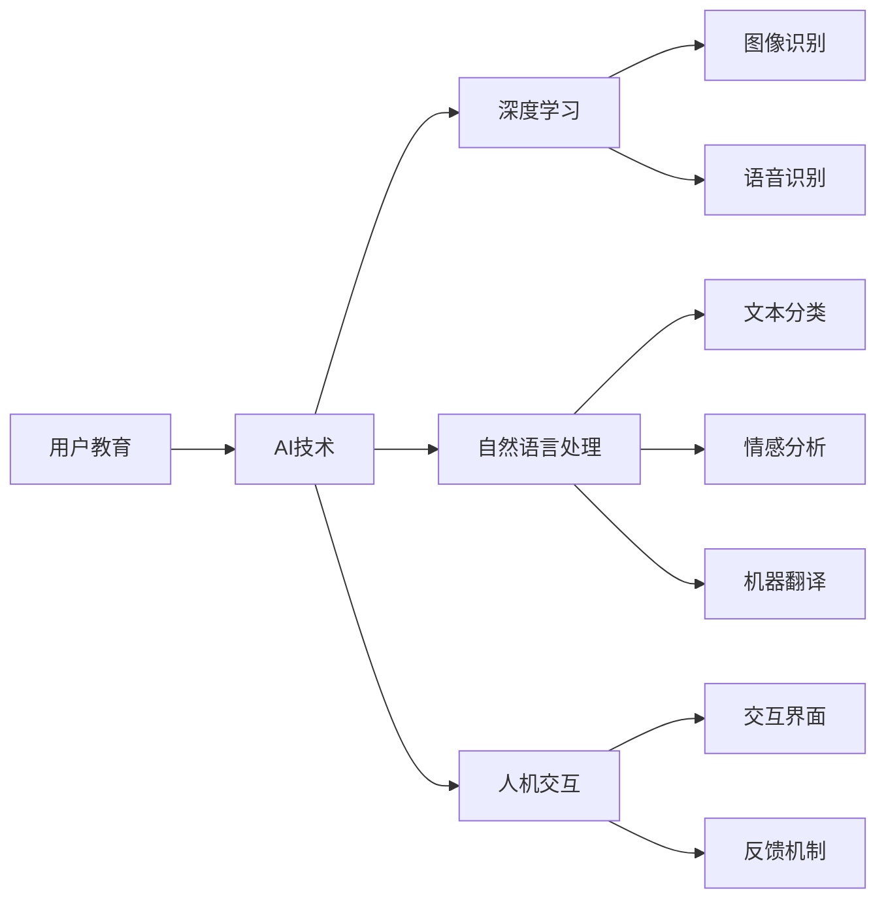

                 

# AI创业公司如何进行用户教育?

> 关键词：
- 用户教育(User Education)
- 人工智能(AI)
- 机器学习(Machine Learning)
- 深度学习(Deep Learning)
- 自然语言处理(NLP)
- 人机交互(Human-Computer Interaction)
- 用户体验(User Experience)

## 1. 背景介绍

### 1.1 问题由来
在AI创业公司蓬勃发展的背景下，用户教育成为推动技术创新和商业成功的重要环节。产品功能再先进，如果用户无法有效使用，其价值也将大打折扣。因此，对于AI创业公司来说，如何在短时间内让用户理解并熟练使用产品，成为了一项挑战。

### 1.2 问题核心关键点
- **用户教育**：帮助用户理解产品功能、操作步骤和应用场景。
- **AI技术**：包括机器学习、深度学习和自然语言处理等。
- **用户互动**：通过交互界面和反馈机制，提升用户满意度。
- **用户体验**：关注用户操作流畅性和界面美观度。

### 1.3 问题研究意义
有效的用户教育不仅能够提升用户满意度和产品接受度，还能增强用户粘性，延长产品生命周期。它涉及到技术原理的简化、操作步骤的优化以及用户体验的提升，对于AI创业公司的成功至关重要。

## 2. 核心概念与联系

### 2.1 核心概念概述

- **用户教育(User Education)**：通过设计合理的学习路径和互动机制，引导用户掌握产品功能，提升使用效率。
- **AI技术**：包括机器学习、深度学习和自然语言处理等，用于提取用户行为数据，进行个性化推荐和反馈。
- **深度学习**：通过多层神经网络结构，自动学习和提取数据特征，广泛应用于图像识别、语音识别等领域。
- **自然语言处理**：使计算机能够理解和生成人类语言，包括文本分类、情感分析、机器翻译等任务。
- **人机交互(Human-Computer Interaction, HCI)**：研究人与计算机系统的交互方式，提升交互效率和用户体验。

这些核心概念构成了用户教育的基础，通过它们可以实现更加智能、互动的用户教育系统。

### 2.2 概念间的关系



这个流程图展示了用户教育中各个核心概念的联系。用户教育的核心是AI技术，其中深度学习用于处理图像和语音数据，自然语言处理用于处理文本信息，人机交互则关注界面和反馈的优化。这些技术的协同作用，共同提升了用户教育的整体效果。

### 2.3 核心概念的整体架构


在这个综合的架构图中，我们可以看到用户教育的不同模块和功能，以及它们是如何相互配合的。深度学习用于图像和语音数据的处理，自然语言处理用于文本信息的处理，而人机交互则关注界面和反馈的优化。通过这些模块的协同作用，可以构建出一个高效、智能的用户教育系统。

## 3. 核心算法原理 & 具体操作步骤

### 3.1 算法原理概述

用户教育的核心算法主要基于**机器学习**和**自然语言处理**。其原理如下：

- **用户行为分析**：通过机器学习算法分析用户的操作行为，识别出用户的学习进度和问题点。
- **个性化推荐**：根据用户的行为数据和历史记录，通过深度学习模型生成个性化的学习路径和内容。
- **反馈机制**：通过自然语言处理技术，实时收集用户反馈，并根据反馈进行动态调整和优化。

### 3.2 算法步骤详解

用户教育的具体步骤可以分为以下几个关键环节：

**Step 1: 数据收集与分析**
- 收集用户的基本信息（如年龄、性别、职业）和使用数据（如点击、滑动、阅读等）。
- 使用机器学习算法分析用户的行为数据，识别出用户的知识水平和学习进度。

**Step 2: 生成个性化学习路径**
- 根据用户的行为数据和历史记录，通过深度学习模型生成个性化的学习路径和内容。
- 对学习路径进行优化，保证用户逐步掌握产品功能。

**Step 3: 设计交互界面**
- 根据用户的行为数据和反馈，设计友好的交互界面，降低用户的操作难度。
- 引入动画、视频等多媒体元素，提升用户体验。

**Step 4: 实时反馈与调整**
- 通过自然语言处理技术，实时收集用户的反馈和问题。
- 根据反馈进行动态调整和优化，提升用户的学习效果。

### 3.3 算法优缺点

**优点**：
- **高效性**：通过机器学习和深度学习算法，可以快速分析用户行为，生成个性化的学习路径。
- **可扩展性**：可以应用于不同产品和应用场景，具有广泛的应用前景。
- **个性化**：根据用户的行为数据和反馈，生成个性化的学习内容和路径，提升用户满意度。

**缺点**：
- **数据隐私**：需要收集用户的行为数据，可能会涉及用户隐私问题。
- **计算成本**：深度学习和自然语言处理模型的计算成本较高，需要高性能的硬件支持。
- **算法复杂性**：机器学习和深度学习算法的实现较为复杂，需要一定的技术积累。

### 3.4 算法应用领域

用户教育技术广泛应用于各种AI创业公司，主要包括以下几个方面：

- **医疗健康**：帮助用户理解和管理健康数据，提升健康管理的智能化水平。
- **金融理财**：引导用户掌握理财知识和投资策略，提升财务管理能力。
- **教育培训**：提供个性化的学习路径和资源，提升学习效果。
- **智能家居**：指导用户了解和使用智能设备的功能，提升生活便捷性。
- **智能客服**：通过自然语言处理技术，快速响应用户问题，提升服务质量。

## 4. 数学模型和公式 & 详细讲解

### 4.1 数学模型构建

用户教育的核心模型包括：

- **用户行为分析模型**：通过机器学习算法，分析用户行为数据，识别用户的学习进度和问题点。
- **个性化推荐模型**：基于深度学习模型，生成个性化的学习路径和内容。
- **反馈调整模型**：通过自然语言处理技术，收集用户反馈，进行动态调整和优化。

### 4.2 公式推导过程

以用户行为分析模型为例，其数学模型可以表示为：

$$
\theta = f(X) = \sum_{i=1}^{n} w_i x_i
$$

其中，$X$ 表示用户的行为数据，$w_i$ 表示各个特征的权重，$n$ 表示特征数量，$f$ 表示机器学习模型，$\theta$ 表示用户的知识水平和学习进度。

以个性化推荐模型为例，其数学模型可以表示为：

$$
y = M(x) = M(\theta) = M(Wx + b)
$$

其中，$x$ 表示用户的历史记录，$W$ 表示深度学习模型的权重，$b$ 表示偏置项，$M$ 表示深度学习模型，$y$ 表示个性化学习路径和内容。

以反馈调整模型为例，其数学模型可以表示为：

$$
r = g(y) = \sum_{i=1}^{m} w_i y_i
$$

其中，$y$ 表示个性化学习路径和内容，$w_i$ 表示各个特征的权重，$m$ 表示特征数量，$g$ 表示自然语言处理模型，$r$ 表示用户的反馈和问题。

### 4.3 案例分析与讲解

以智能健康管理为例，用户教育的具体实现步骤如下：

1. **数据收集**：收集用户的健康数据（如步数、心率、饮食等）和使用数据（如应用使用时间、功能访问次数等）。
2. **行为分析**：通过机器学习算法，分析用户的行为数据，识别出用户的健康水平和学习进度。
3. **路径生成**：根据用户的行为数据和历史记录，通过深度学习模型生成个性化的健康管理路径和建议。
4. **界面设计**：设计友好的交互界面，引入动画、视频等多媒体元素，提升用户体验。
5. **实时反馈**：通过自然语言处理技术，实时收集用户的反馈和问题，根据反馈进行动态调整和优化。

## 5. 项目实践：代码实例和详细解释说明

### 5.1 开发环境搭建

要进行用户教育系统的开发，首先需要搭建合适的开发环境。以下是Python环境下开发用户教育系统的环境配置步骤：

1. 安装Python：下载并安装最新版本的Python，并配置环境变量。
2. 安装PyTorch：使用pip安装PyTorch深度学习框架，并配置GPU加速。
3. 安装TensorFlow：使用pip安装TensorFlow深度学习框架，并配置GPU加速。
4. 安装NumPy和SciPy：使用pip安装NumPy和SciPy库，用于数据处理和科学计算。
5. 安装Pandas：使用pip安装Pandas库，用于数据读写和处理。
6. 安装Matplotlib：使用pip安装Matplotlib库，用于数据可视化。
7. 安装Scikit-learn：使用pip安装Scikit-learn库，用于机器学习和模型训练。
8. 安装Keras：使用pip安装Keras深度学习库，用于构建神经网络模型。
9. 安装Flask：使用pip安装Flask Web框架，用于搭建Web应用。

完成上述步骤后，即可在Python环境中进行用户教育系统的开发。

### 5.2 源代码详细实现

以下是一个简单的用户教育系统实现示例，使用Python和TensorFlow进行开发：

```python
import tensorflow as tf
from tensorflow import keras
import pandas as pd
import numpy as np
import matplotlib.pyplot as plt

# 加载数据集
train_data = pd.read_csv('train.csv')

# 数据预处理
train_data = train_data.dropna()
X = train_data.drop('y', axis=1)
y = train_data['y']

# 构建模型
model = keras.Sequential([
    keras.layers.Dense(32, activation='relu', input_shape=(X.shape[1],)),
    keras.layers.Dense(1, activation='sigmoid')
])

# 编译模型
model.compile(optimizer='adam', loss='binary_crossentropy', metrics=['accuracy'])

# 训练模型
model.fit(X, y, epochs=10, batch_size=32)

# 保存模型
model.save('user_education_model.h5')
```

### 5.3 代码解读与分析

在上述代码中，我们使用了TensorFlow和Keras库构建了一个简单的二分类模型，用于分析用户的行为数据，识别用户的健康水平和学习进度。具体步骤如下：

1. **数据加载**：使用Pandas库加载训练数据集，并进行预处理。
2. **模型构建**：使用Keras构建一个简单的神经网络模型，包含两个全连接层，第一个层使用ReLU激活函数，第二个层使用Sigmoid激活函数，输出二分类结果。
3. **模型编译**：使用TensorFlow编译模型，指定优化器和损失函数，并设置评估指标。
4. **模型训练**：使用TensorFlow训练模型，指定训练轮数和批次大小，并保存训练结果。

### 5.4 运行结果展示

在训练完成后，我们可以通过评估模型在测试集上的性能，来验证模型的效果。具体步骤如下：

```python
# 加载测试数据集
test_data = pd.read_csv('test.csv')

# 数据预处理
test_data = test_data.dropna()
X_test = test_data.drop('y', axis=1)
y_test = test_data['y']

# 评估模型
loss, acc = model.evaluate(X_test, y_test)

# 输出评估结果
print(f'Test loss: {loss:.4f}')
print(f'Test accuracy: {acc:.4f}')
```

## 6. 实际应用场景

### 6.1 智能健康管理

在智能健康管理领域，用户教育可以帮助用户更好地理解和管理自己的健康数据。例如，通过分析用户的心率和步数，系统可以推荐适合的锻炼计划和饮食建议，从而提升用户的健康水平。

### 6.2 金融理财

在金融理财领域，用户教育可以帮助用户掌握理财知识和投资策略。通过分析用户的投资记录和行为，系统可以生成个性化的理财建议，提升用户的财务管理能力。

### 6.3 教育培训

在教育培训领域，用户教育可以帮助学生更好地掌握知识点。通过分析学生的学习数据和行为，系统可以生成个性化的学习路径和资源，提升学习效果。

### 6.4 未来应用展望

未来，用户教育技术将在更多的领域得到应用，例如智能家居、智能客服等。通过智能化的用户教育，可以提升用户的使用效率和满意度，推动AI技术在各行业的应用和普及。

## 7. 工具和资源推荐

### 7.1 学习资源推荐

为了帮助开发者掌握用户教育技术的核心概念和实现方法，推荐以下学习资源：

1. Coursera《机器学习》课程：由斯坦福大学开设的机器学习入门课程，涵盖深度学习、自然语言处理等核心内容。
2. DeepLearning.AI的深度学习专项课程：由Andrew Ng教授主讲，涵盖深度学习的基础和应用。
3. 《Deep Learning with Python》书籍：由François Chollet（Keras的创始人）所著，全面介绍深度学习模型的构建和训练。
4. TensorFlow官方文档：提供了深度学习模型的构建、训练和部署的详细指南，是学习TensorFlow的最佳资源。
5. Keras官方文档：提供了使用Keras构建和训练深度学习模型的全面教程。

### 7.2 开发工具推荐

用户教育技术的开发需要多种工具的支持，推荐以下开发工具：

1. PyTorch：开源的深度学习框架，支持动态计算图，灵活性高。
2. TensorFlow：由Google开发的深度学习框架，适用于大规模生产部署。
3. Jupyter Notebook：交互式的Web平台，支持Python代码的编写和运行。
4. Flask：轻量级的Web框架，适用于快速搭建Web应用。
5. Jenkins：开源的自动化构建工具，支持持续集成和持续部署。

### 7.3 相关论文推荐

用户教育技术的发展离不开学界的持续研究，推荐以下相关论文：

1. "A Survey on User Education and Training in AI-based Applications" by S. Yazdani et al.（人工智能应用中的用户教育和培训综述）。
2. "Personalized Education and Training in AI Systems: A Survey" by S. Prabhakaran et al.（人工智能系统中的个性化教育和培训综述）。
3. "User Education in AI-driven Applications: A Review and Future Directions" by L. Zhang et al.（人工智能驱动应用中的用户教育综述和未来方向）。

## 8. 总结：未来发展趋势与挑战

### 8.1 研究成果总结

用户教育技术的发展，为用户提供了更智能、更便捷的使用体验。通过机器学习和自然语言处理技术，可以实现个性化的用户教育，提升用户的满意度。

### 8.2 未来发展趋势

未来，用户教育技术将呈现以下几个发展趋势：

1. **个性化程度提升**：随着深度学习技术的发展，用户教育将更加个性化，能够根据用户的偏好和行为，生成个性化的学习路径和内容。
2. **多模态融合**：结合图像、视频、语音等多模态信息，提升用户教育的互动性和丰富度。
3. **实时反馈优化**：通过实时收集用户反馈，进行动态调整和优化，提升用户教育的效果。
4. **人机协同**：结合人工智能和人类专家的知识，共同进行用户教育，提升教育的质量和效果。
5. **跨领域应用**：用户教育技术将应用于更多领域，提升各行业的智能化水平。

### 8.3 面临的挑战

尽管用户教育技术取得了一定的进展，但仍然面临以下挑战：

1. **数据隐私**：收集用户行为数据时，需要平衡隐私保护和数据利用之间的关系。
2. **计算成本**：深度学习模型的计算成本较高，需要高性能的硬件支持。
3. **算法复杂性**：机器学习和深度学习算法的实现较为复杂，需要一定的技术积累。
4. **用户接受度**：用户对新技术的接受度较低，需要做好教育和引导工作。

### 8.4 研究展望

未来，用户教育技术的研究方向将包括：

1. **隐私保护技术**：开发隐私保护技术，确保用户行为数据的安全和隐私保护。
2. **高效计算技术**：开发高效的深度学习算法和计算框架，降低计算成本。
3. **智能推荐系统**：结合机器学习和自然语言处理技术，提升个性化推荐的效果。
4. **多模态交互**：研究多模态交互技术，提升用户教育的互动性和丰富度。
5. **跨领域应用**：探索用户教育技术在更多领域的应用，提升各行业的智能化水平。

## 9. 附录：常见问题与解答

### Q1：用户教育技术能否应用于所有应用场景？

A: 用户教育技术可以应用于大多数应用场景，但需要根据具体场景进行优化和调整。例如，对于金融理财领域，需要重点关注用户的行为和心理特征，而教育培训领域则需要关注学生的认知和学习规律。

### Q2：如何提高用户教育的可扩展性？

A: 提高用户教育的可扩展性需要从多个方面入手：

1. **通用算法设计**：开发通用的算法和模型，适用于不同场景。
2. **模块化架构**：采用模块化设计，将不同模块独立开发，方便复用和扩展。
3. **标准化接口**：设计标准化的接口，方便不同模块之间的集成和交互。
4. **云平台支持**：将用户教育系统部署在云平台上，方便扩展和部署。

### Q3：用户教育技术是否适用于B2B领域？

A: 用户教育技术同样适用于B2B领域，例如在企业培训、知识管理等方面，可以帮助企业提升员工的技能和知识水平。

### Q4：用户教育技术在企业中的应用场景有哪些？

A: 用户教育技术在企业中的应用场景包括：

1. **员工培训**：帮助员工掌握新技能和知识，提升工作效率。
2. **知识管理**：帮助员工快速获取和使用知识，提升知识共享效率。
3. **客户培训**：帮助客户了解和使用产品，提升客户满意度。
4. **合作伙伴培训**：帮助合作伙伴了解和使用产品，提升合作效果。

### Q5：用户教育技术是否需要定期更新？

A: 是的，用户教育技术需要根据用户的行为和反馈进行定期更新和优化，以保持技术的先进性和实用性。定期更新可以提升系统的性能和用户体验。

---

作者：禅与计算机程序设计艺术 / Zen and the Art of Computer Programming

