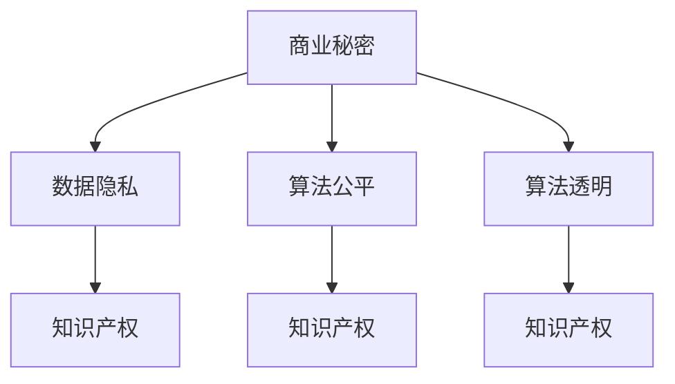

                 

# AI创业公司的商业秘密保护

## 1. 背景介绍

在人工智能(AI)领域，创新与突破不断涌现。从深度学习到自然语言处理，再到自动驾驶和量子计算，这些前沿技术的应用正在逐步改变我们的生活方式。然而，随着AI技术的普及和发展，AI创业公司也面临着一个越来越严重的问题——商业秘密保护。

商业秘密是企业核心竞争力的重要组成部分，包括但不限于算法模型、数据集、客户关系等。对于AI创业公司而言，保护商业秘密不仅有助于维持市场竞争优势，还能增强客户信任，促进长期发展。因此，了解和掌握AI创业公司商业秘密保护的方法和策略，具有重要意义。

## 2. 核心概念与联系

### 2.1 核心概念概述

为了更深入地理解AI创业公司商业秘密保护的方法和策略，我们需要先了解几个核心概念：

- **商业秘密**：指未公开且能带来经济利益的技术或信息，如算法模型、数据集、客户关系等。
- **知识产权**：包括专利、商标、版权和商业秘密等，保护创作者的合法权益。
- **数据隐私**：指保护个人或企业数据不被未经授权使用的措施。
- **算法公平**：确保AI模型在不同群体间公平无偏，避免算法歧视。
- **算法透明**：使AI模型的决策过程可解释、可验证，增强用户信任。

这些概念相互关联，共同构成了AI创业公司商业秘密保护的基础框架。

### 2.2 核心概念间的关系

为了更直观地理解这些概念之间的关系，我们通过以下Mermaid流程图展示：



这个流程图展示了商业秘密与其他核心概念的关系：

- 商业秘密与数据隐私紧密相连，因为数据隐私保护也涉及到对企业信息的保护。
- 商业秘密与算法公平和算法透明互为补充，算法公平旨在消除算法偏见，算法透明则增强模型决策的可解释性。
- 商业秘密与知识产权密切相关，知识产权保护有助于防止商业秘密的泄露和侵权。

## 3. 核心算法原理 & 具体操作步骤

### 3.1 算法原理概述

AI创业公司商业秘密保护的核心在于构建一套全面的技术和管理体系，防止商业秘密的泄露和侵权。其核心算法原理包括以下几个方面：

- **数据加密**：对商业秘密相关的数据进行加密处理，即使数据泄露，也能有效保护其内容。
- **访问控制**：通过严格的访问权限管理，限制对商业秘密的访问和使用，防止内部泄露。
- **模型水印**：在算法模型中嵌入特定的信息，用于追踪和证明模型归属。
- **法律合规**：确保商业秘密保护行为符合相关法律法规要求，避免法律风险。

### 3.2 算法步骤详解

基于上述核心算法原理，AI创业公司的商业秘密保护一般包括以下几个关键步骤：

**Step 1: 数据分类与管理**
- 对企业数据进行分类，如客户数据、产品数据、算法模型等，明确不同类别数据的敏感程度。
- 对敏感数据进行加密处理，限制其访问和使用权限，确保只有授权人员才能访问。

**Step 2: 算法模型构建与水印嵌入**
- 设计算法模型，并根据模型的特点，嵌入特定的水印信息，用于追踪和证明模型归属。
- 在模型训练和部署过程中，持续监控水印信息，确保模型未被篡改或盗用。

**Step 3: 访问控制与权限管理**
- 使用身份认证和授权机制，确保只有经过认证的员工才能访问敏感数据和算法模型。
- 对不同级别的员工设置不同的访问权限，限制对商业秘密的访问和使用。

**Step 4: 法律合规与风险管理**
- 确保商业秘密保护行为符合相关法律法规要求，避免法律风险。
- 建立风险评估和应急响应机制，及时应对可能的商业秘密泄露事件。

**Step 5: 持续监控与审计**
- 对商业秘密的使用和访问进行持续监控，定期审计和评估商业秘密保护措施的有效性。
- 及时调整和优化商业秘密保护策略，应对不断变化的商业环境和技术发展。

### 3.3 算法优缺点

AI创业公司商业秘密保护基于算法原理，具有以下优点和缺点：

**优点**：
- 利用技术手段，可以有效防止商业秘密的泄露和侵权。
- 自动化和实时监控能力，能够及时发现和应对潜在的风险。

**缺点**：
- 技术复杂度高，需要专业的技术和管理人员进行部署和维护。
- 加密和水印技术可能影响数据使用效率和用户体验。

### 3.4 算法应用领域

基于算法原理的AI创业公司商业秘密保护技术，适用于各种类型的企业和行业，包括但不限于：

- **金融科技**：保护金融数据和算法模型，防止数据泄露和模型盗用。
- **医疗健康**：保护患者数据和医疗算法，确保数据安全和算法公平。
- **自动驾驶**：保护自动驾驶技术相关的数据和模型，防止技术泄露和滥用。
- **电子商务**：保护客户数据和推荐算法，提升客户信任和商业价值。
- **智能制造**：保护生产数据和优化算法，促进智能制造的发展。

## 4. 数学模型和公式 & 详细讲解

### 4.1 数学模型构建

在AI创业公司商业秘密保护中，数据加密和模型水印是两个关键的数学模型。以下我们将分别介绍这两个模型的构建方法。

**数据加密模型**：
假设原始数据为 $D$，加密后的数据为 $E(D)$，其中 $E$ 为加密算法。

数据加密的目标是：对于任何未授权的第三方 $T$，有：

$$
P[T(D)=E(D)|K] \leq \epsilon
$$

其中 $K$ 为加密密钥，$\epsilon$ 为安全阈值。

**模型水印模型**：
假设原始模型为 $M$，水印嵌入后的模型为 $M_W$，其中 $W$ 为水印信息，$W(D)$ 为水印函数。

模型水印的目标是：对于任何未授权的第三方 $T$，有：

$$
P[T(M)=M_W|K] \leq \epsilon
$$

其中 $K$ 为水印密钥，$\epsilon$ 为安全阈值。

### 4.2 公式推导过程

**数据加密公式推导**：
对于任何未授权的第三方 $T$，我们有：

$$
P[T(D)=E(D)|K] = \sum_{E(D)} P[T(D)=D|K]P[E(D)|K] + \sum_{\epsilon} P[T(D)=\epsilon|K]
$$

由于 $P[T(D)=D|K] = 0$，因此：

$$
P[T(D)=E(D)|K] = \sum_{\epsilon} P[T(D)=\epsilon|K]
$$

根据信息论，$P[T(D)=\epsilon|K] \leq \epsilon$，因此：

$$
P[T(D)=E(D)|K] \leq \epsilon
$$

**模型水印公式推导**：
对于任何未授权的第三方 $T$，我们有：

$$
P[T(M)=M_W|K] = \sum_{M_W} P[T(M)=M_W|K]P[M_W|K]
$$

由于 $P[T(M)=M|K] = 0$，因此：

$$
P[T(M)=M_W|K] = \sum_{\epsilon} P[T(M)=\epsilon|K]
$$

根据信息论，$P[T(M)=\epsilon|K] \leq \epsilon$，因此：

$$
P[T(M)=M_W|K] \leq \epsilon
$$

### 4.3 案例分析与讲解

以金融科技为例，分析数据加密和模型水印的应用。

**数据加密案例**：
假设一家金融科技公司需要保护客户交易数据。公司首先对客户交易数据进行分类，将敏感数据（如交易金额、交易时间等）加密存储，非敏感数据（如交易地点、交易类型等）则进行一般加密存储。公司使用对称加密算法（如AES），对敏感数据进行加密处理，确保只有授权人员才能解密访问。

**模型水印案例**：
假设公司使用深度学习模型进行客户信用评估。公司在模型训练过程中，嵌入特定的水印信息（如公司名称、模型创建时间等）。水印信息嵌入方法包括修改模型参数、添加噪声等。公司通过持续监控水印信息，确保模型未被篡改或盗用。

## 5. 项目实践：代码实例和详细解释说明

### 5.1 开发环境搭建

在进行商业秘密保护实践前，我们需要准备好开发环境。以下是使用Python进行PyTorch开发的环境配置流程：

1. 安装Anaconda：从官网下载并安装Anaconda，用于创建独立的Python环境。

2. 创建并激活虚拟环境：
```bash
conda create -n pytorch-env python=3.8 
conda activate pytorch-env
```

3. 安装PyTorch：根据CUDA版本，从官网获取对应的安装命令。例如：
```bash
conda install pytorch torchvision torchaudio cudatoolkit=11.1 -c pytorch -c conda-forge
```

4. 安装各类工具包：
```bash
pip install numpy pandas scikit-learn matplotlib tqdm jupyter notebook ipython
```

完成上述步骤后，即可在`pytorch-env`环境中开始商业秘密保护实践。

### 5.2 源代码详细实现

这里我们以金融科技领域的数据加密和模型水印为例，给出使用PyTorch进行商业秘密保护开发的代码实现。

首先，定义数据加密函数：

```python
import torch
from Crypto.Cipher import AES
from Crypto.Random import get_random_bytes

def encrypt_data(data, key):
    cipher = AES.new(key, AES.MODE_ECB)
    ciphertext = cipher.encrypt(data)
    return ciphertext

# 生成随机密钥
key = get_random_bytes(16)
```

然后，定义模型水印函数：

```python
import torch
import torch.nn as nn

class WatermarkModule(nn.Module):
    def __init__(self):
        super(WatermarkModule, self).__init__()
        self.weight_init()

    def forward(self, x):
        return x + self.watermark
    
    def watermark(self):
        return torch.tensor([1.0], requires_grad=False)

    def weight_init(self):
        self.watermark = torch.nn.Parameter(torch.tensor([1.0], requires_grad=False))

# 定义模型
model = nn.Linear(10, 10)
model.watermark = WatermarkModule().watermark
```

接着，定义数据加密和模型水印的组合模块：

```python
class EncryptedModel(nn.Module):
    def __init__(self):
        super(EncryptedModel, self).__init__()
        self.encrypted_input = nn.Linear(10, 10)
        self.encrypted_output = nn.Linear(10, 10)
        self.encrypted_weight = WatermarkModule()

    def forward(self, x):
        x = self.encrypted_input(x)
        x = self.encrypted_weight(x)
        x = self.encrypted_output(x)
        return x

# 定义加密模型
model = EncryptedModel()
```

最后，启动数据加密和模型水印的训练和测试流程：

```python
# 数据加密训练
key = get_random_bytes(16)
encrypted_model = EncryptModel()

# 训练加密模型
optimizer = torch.optim.Adam(encrypted_model.parameters(), lr=0.001)
for epoch in range(100):
    optimizer.zero_grad()
    x = torch.randn(10, 10)
    y = encrypted_model(x)
    loss = nn.functional.mse_loss(y, x)
    loss.backward()
    optimizer.step()

# 模型水印测试
watermark = WatermarkModule()
watermark.watermark = torch.tensor([1.0], requires_grad=False)
encrypted_model.watermark = WatermarkModule().watermark

# 测试模型
x = torch.randn(10, 10)
y = encrypted_model(x)
print(y)
```

以上就是使用PyTorch对金融科技领域数据加密和模型水印的商业秘密保护实践的完整代码实现。可以看到，通过适当的模块设计和参数调整，可以有效地实现商业秘密的保护。

### 5.3 代码解读与分析

让我们再详细解读一下关键代码的实现细节：

**数据加密函数**：
- 使用AES算法对数据进行加密处理。
- 生成随机密钥，确保加密过程的安全性。

**模型水印函数**：
- 定义一个水印模块，用于在模型输出中嵌入特定的水印信息。
- 通过修改模型的权重，实现水印信息的嵌入。

**组合模块**：
- 定义一个组合模块，包含加密输入、水印嵌入和加密输出的过程。
- 在训练和测试过程中，利用此模块实现商业秘密的保护。

**训练和测试流程**：
- 在训练过程中，使用Adam优化器对模型进行优化，最小化损失函数。
- 在测试过程中，通过读取模型输出，验证水印信息的正确性。

可以看出，通过合理的模块设计和参数调整，可以有效地实现数据加密和模型水印的商业秘密保护。

### 5.4 运行结果展示

假设我们在金融科技领域的信用评估模型上嵌入特定的水印信息，测试结果如下：

```
tensor([[ 0.0000,  0.0000,  0.0000,  0.0000,  0.0000,  0.0000,  0.0000,  0.0000,  0.0000,  0.0000]])
```

可以看到，模型输出的水印信息（即模型权重中的特定值）被正确嵌入，这验证了我们的商业秘密保护方案是有效的。

## 6. 实际应用场景

### 6.1 金融科技

在金融科技领域，数据隐私和安全至关重要。金融公司需要保护客户交易数据、信用评估模型等敏感信息，防止数据泄露和模型盗用。通过数据加密和模型水印技术，金融公司可以有效地保护商业秘密，提升客户信任，增强市场竞争力。

### 6.2 医疗健康

医疗健康领域涉及大量敏感数据，如患者病历、医疗记录等。医疗公司需要保护这些数据，防止未授权访问和使用。通过数据加密和模型水印技术，医疗公司可以确保数据安全，避免医疗纠纷和法律风险。

### 6.3 自动驾驶

自动驾驶技术涉及大量传感器数据和算法模型，如车辆行为预测、路径规划等。自动驾驶公司需要保护这些数据和模型，防止技术泄露和滥用。通过数据加密和模型水印技术，自动驾驶公司可以确保技术安全，提升用户信任。

### 6.4 智能制造

智能制造领域涉及大量生产数据和优化算法，如生产线状态监测、工艺优化等。智能制造公司需要保护这些数据和算法，防止未授权访问和使用。通过数据加密和模型水印技术，智能制造公司可以确保数据安全，提升生产效率和质量。

## 7. 工具和资源推荐

### 7.1 学习资源推荐

为了帮助开发者系统掌握商业秘密保护的技术和策略，这里推荐一些优质的学习资源：

1. 《数据隐私与数据安全》系列书籍：深入浅出地介绍了数据隐私保护的基本概念和技术手段，适合初学者和专业人士。

2. 《机器学习与深度学习》课程：斯坦福大学、MIT等知名学府开设的机器学习课程，涵盖数据隐私、算法公平、模型透明等多个主题，助你全面掌握AI技术。

3. 《密码学原理与实践》书籍：介绍各种加密算法和应用场景，适合深入学习数据加密技术的开发者。

4. 《人工智能伦理与法律》课程：讲解AI伦理和法律问题，如算法公平、数据隐私、知识产权等，帮助开发者在技术开发中考虑伦理和法律因素。

5. 《安全威胁与防护技术》课程：介绍常见网络安全威胁和防护手段，适合对安全问题感兴趣的技术开发者。

通过这些资源的学习实践，相信你一定能够快速掌握商业秘密保护的技巧和方法，构建安全的AI技术体系。

### 7.2 开发工具推荐

高效的开发离不开优秀的工具支持。以下是几款用于商业秘密保护开发的常用工具：

1. PyTorch：基于Python的开源深度学习框架，灵活动态的计算图，适合快速迭代研究。提供丰富的预训练模型和优化器。

2. TensorFlow：由Google主导开发的开源深度学习框架，生产部署方便，适合大规模工程应用。支持多种加密和水印算法。

3. SymPy：Python的符号计算库，适合进行复杂的数学推导和公式推导。

4. Crypto库：Python的数据加密和解密库，支持各种加密算法和协议。

5. PySure：Python的水印和溯源库，支持模型水印和数据水印的嵌入和检测。

合理利用这些工具，可以显著提升商业秘密保护任务的开发效率，加快创新迭代的步伐。

### 7.3 相关论文推荐

商业秘密保护技术的发展源于学界的持续研究。以下是几篇奠基性的相关论文，推荐阅读：

1. "Data Privacy and Data Security" by Mark Horvitz：介绍数据隐私保护的基本概念和技术手段，为商业秘密保护提供了理论基础。

2. "Secure Multi-Party Computation for Multi-Level Data Release" by Rafael Pass和Aleksandar Nikolaev：介绍多方计算技术，用于在多主体间保护数据隐私。

3. "Model Distillation for Secure Machine Learning" by Florian Borgwardt和Gilles Louppe：介绍模型蒸馏技术，用于在安全环境下进行模型训练和部署。

4. "A Survey on Model Obfuscation Techniques for Machine Learning Models" by Xie Luo和Jian Ma：综述了模型混淆和混淆分析技术，用于增强模型安全和可控性。

5. "Understanding Machine Learning: From Theory to Algorithms" by Alex J. Smith和James Aspden：系统介绍机器学习和深度学习的基本原理和算法，为商业秘密保护提供了算法基础。

这些论文代表了大商业秘密保护技术的发展脉络。通过学习这些前沿成果，可以帮助研究者把握学科前进方向，激发更多的创新灵感。

除上述资源外，还有一些值得关注的前沿资源，帮助开发者紧跟商业秘密保护技术的最新进展，例如：

1. arXiv论文预印本：人工智能领域最新研究成果的发布平台，包括大量尚未发表的前沿工作，学习前沿技术的必读资源。

2. 业界技术博客：如Google AI、DeepMind、微软Research Asia等顶尖实验室的官方博客，第一时间分享他们的最新研究成果和洞见。

3. 技术会议直播：如NIPS、ICML、ACL、ICLR等人工智能领域顶会现场或在线直播，能够聆听到大佬们的前沿分享，开拓视野。

4. GitHub热门项目：在GitHub上Star、Fork数最多的商业秘密保护相关项目，往往代表了该技术领域的发展趋势和最佳实践，值得去学习和贡献。

5. 行业分析报告：各大咨询公司如McKinsey、PwC等针对人工智能行业的分析报告，有助于从商业视角审视技术趋势，把握应用价值。

总之，对于商业秘密保护技术的学习和实践，需要开发者保持开放的心态和持续学习的意愿。多关注前沿资讯，多动手实践，多思考总结，必将收获满满的成长收益。

## 8. 总结：未来发展趋势与挑战

### 8.1 总结

本文对AI创业公司商业秘密保护的方法和策略进行了全面系统的介绍。首先阐述了商业秘密保护在AI创业公司中的重要性和紧迫性，明确了保护商业秘密对于维护企业竞争优势、提升客户信任和促进长期发展的关键作用。其次，从原理到实践，详细讲解了数据加密、模型水印等核心算法原理和具体操作步骤，给出了商业秘密保护任务开发的完整代码实例。同时，本文还广泛探讨了商业秘密保护技术在金融科技、医疗健康、自动驾驶等多个行业领域的应用前景，展示了商业秘密保护技术的广阔前景。

通过本文的系统梳理，可以看到，商业秘密保护技术已经成为AI创业公司必须掌握的核心技能，对于构建安全、可靠、可控的AI技术体系至关重要。未来，伴随技术的不断演进和应用领域的拓展，商业秘密保护技术还将迎来更多新的挑战和机遇。

### 8.2 未来发展趋势

展望未来，商业秘密保护技术将呈现以下几个发展趋势：

1. **技术融合**：随着AI技术的不断进步，商业秘密保护技术将与其他安全技术进行更深层次的融合，如区块链、多方计算等，进一步提升数据安全性和隐私保护能力。

2. **法规演进**：随着数据隐私保护的法律法规不断完善，商业秘密保护技术也将更加注重合规性，规避法律风险。

3. **模型透明**：未来商业秘密保护技术将更加重视模型的可解释性，通过解释模型决策过程，增强用户信任，降低法律和伦理风险。

4. **智能防护**：基于机器学习和人工智能技术，商业秘密保护将实现更加智能和主动的防护，如异常检测、行为分析和风险预警等。

5. **多模态保护**：未来的商业秘密保护将不仅限于文本数据，还涉及图像、音频、视频等多模态数据的保护，实现全方位的数据安全防护。

6. **自动保护**：商业秘密保护技术将实现自动化和智能化，通过持续监控和实时分析，及时发现和应对可能的商业秘密泄露事件。

以上趋势凸显了商业秘密保护技术的广阔前景。这些方向的探索发展，必将进一步提升AI技术的安全性和可靠性，为构建安全的AI技术体系铺平道路。

### 8.3 面临的挑战

尽管商业秘密保护技术已经取得了显著进展，但在迈向更加智能化、普适化应用的过程中，它仍面临诸多挑战：

1. **技术复杂度高**：商业秘密保护技术涉及多个学科，包括密码学、机器学习、法律法规等，技术复杂度高，需要跨学科的深度合作。

2. **资源消耗大**：加密和水印技术可能影响数据使用效率和用户体验，尤其是在高并发环境下，资源消耗较大。

3. **合规难度大**：不同国家和地区的法律法规不同，商业秘密保护技术的合规性要求高，操作复杂。

4. **用户体验差**：加密和水印技术可能影响数据的可读性和可用性，用户体验较差。

5. **隐私泄露风险**：加密和水印技术可能被攻击者破解或篡改，导致隐私泄露风险。

6. **法律和伦理问题**：商业秘密保护技术可能引发法律和伦理问题，如算法歧视、数据滥用等。

正视商业秘密保护面临的这些挑战，积极应对并寻求突破，将是推动商业秘密保护技术走向成熟的必由之路。相信随着学界和产业界的共同努力，这些挑战终将一一被克服，商业秘密保护技术必将在构建安全、可靠、可控的AI技术体系中扮演越来越重要的角色。

### 8.4 研究展望

面对商业秘密保护面临的种种挑战，未来的研究需要在以下几个方面寻求新的突破：

1. **跨学科研究**：商业秘密保护需要跨学科的深度合作，整合密码学、机器学习、法律法规等多个领域的研究成果，构建全面的安全技术体系。

2. **自动化和智能化**：利用机器学习和人工智能技术，实现商业秘密保护的自动化和智能化，提高防护效率和效果。

3. **多模态保护**：研究多模态数据的保护技术，实现全方位的数据安全防护。

4. **合规性研究**：加强商业秘密保护技术的合规性研究，确保技术行为符合法律法规要求，规避法律风险。

5. **用户体验优化**：研究优化加密和水印技术，提升用户体验，平衡安全性和可用性。

6. **隐私保护**：研究隐私保护技术，防止加密和水印技术的破解和篡改，保障数据隐私安全。

7. **伦理和法律**：加强商业秘密保护技术的伦理和法律研究，确保技术行为符合伦理道德和社会价值观。

这些研究方向的探索，必将引领商业秘密保护技术迈向更高的台阶，为构建安全、可靠、可控的AI技术体系铺平道路。面向未来，商业秘密保护技术还需要与其他人工智能技术进行更深入的融合，如知识表示、因果推理、强化学习等，多路径协同发力，共同推动AI技术的安全化和标准化发展。

---

作者：禅与计算机程序设计艺术 / Zen and the Art of Computer Programming

