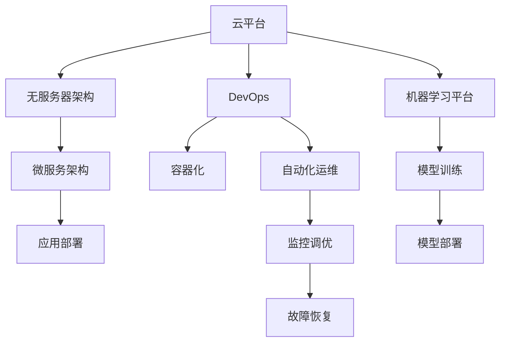
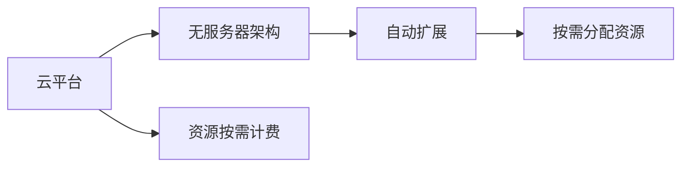
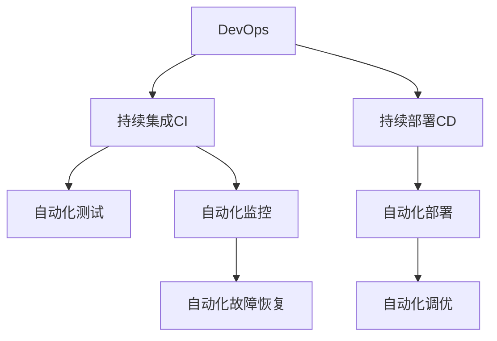
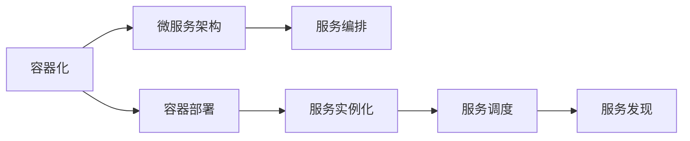

                 

# AI即服务(AIaaS)平台设计

> 关键词：AIaaS, 云平台, 自动化, 无服务器架构, DevOps, 容器化

## 1. 背景介绍

### 1.1 问题由来
随着人工智能技术的飞速发展，AI在各个行业中的应用变得越来越广泛。从传统的金融、医疗、电商等行业，到新兴的自动驾驶、智能家居、智能制造等前沿领域，AI技术正在重新定义各个行业的业务流程和商业模式。然而，AI应用的开发和部署涉及大量的数据处理、模型训练、调优、部署等复杂操作，传统的开发、测试、部署流程面临诸多挑战。

### 1.2 问题核心关键点
AIaaS（AI as a Service）平台设计旨在解决这些问题，提供一个快速、高效、安全的AI应用开发和部署环境，使开发者能够专注于算法创新，而不必为底层技术分心。AIaaS平台的核心关键点包括：

1. **自动化**：通过自动化的部署、调优、监控等流程，减少人工干预，提高开发效率。
2. **无服务器架构**：采用云平台提供的按需计费服务，无需担心服务器维护和资源管理，降低开发成本。
3. **DevOps**：引入DevOps工具链，实现持续集成（CI）和持续部署（CD），提升交付速度和稳定性。
4. **容器化**：通过Docker等容器技术实现应用的可移植性和自动化部署。
5. **高可用性**：确保平台的高可用性和稳定性，确保AI应用的连续性和安全性。

### 1.3 问题研究意义
AIaaS平台设计对于推动AI技术的普及和应用具有重要意义：

1. **降低开发成本**：通过自动化和无服务器架构，减少人工干预和资源消耗，降低开发和部署成本。
2. **提升开发效率**：引入DevOps工具链和容器化技术，实现快速迭代和持续交付，加速产品上线。
3. **确保应用质量**：通过自动化测试和监控，确保应用的高质量和稳定性，减少人工错误。
4. **支持多种AI应用**：支持多种AI算法和模型，适应不同行业和场景的需求。
5. **推动AI应用落地**：通过提供简单易用的开发和部署工具，降低AI应用的入门门槛，加速AI技术的普及和应用。

## 2. 核心概念与联系

### 2.1 核心概念概述

为了更好地理解AIaaS平台的设计理念和架构，本节将介绍几个密切相关的核心概念：

1. **云平台**：提供计算、存储、网络等基础资源的云服务提供商，如AWS、Google Cloud、Azure等。
2. **无服务器架构**：云平台提供的按需计费服务，开发者无需关注底层服务器和资源管理，只需专注于应用逻辑。
3. **DevOps**：一种软件开发模式，结合软件开发（Dev）和运维（Ops），强调自动化、持续交付和协作。
4. **容器化**：通过Docker等容器技术实现应用的可移植性和自动化部署，提高应用的可扩展性和灵活性。
5. **微服务架构**：将应用拆分为多个小的、自治的服务单元，每个服务单元独立部署和扩展，提升应用的灵活性和可维护性。
6. **自动化运维**：通过自动化工具实现应用部署、监控、调优、故障恢复等操作，减少人工干预，提高运维效率。
7. **机器学习平台**：提供数据存储、数据处理、模型训练、调优、部署等功能的平台，支持机器学习和深度学习应用。

这些核心概念之间的逻辑关系可以通过以下Mermaid流程图来展示：



这个流程图展示了大语言模型的核心概念及其之间的关系：

1. 云平台提供了基础设施支持。
2. 无服务器架构和DevOps工具链实现了应用的自动化和持续交付。
3. 容器化和微服务架构提高了应用的灵活性和可扩展性。
4. 自动化运维确保了应用的高可用性和稳定性。
5. 机器学习平台提供了模型训练、调优和部署的功能。

这些概念共同构成了AIaaS平台的设计框架，使其能够在高效、安全的环境下实现AI应用的开发和部署。

### 2.2 概念间的关系

这些核心概念之间存在着紧密的联系，形成了AIaaS平台设计的基础架构。下面我们通过几个Mermaid流程图来展示这些概念之间的关系。

#### 2.2.1 云平台与无服务器架构的关系



这个流程图展示了云平台和无服务器架构之间的关系。云平台提供按需计费的服务，无服务器架构则实现了资源的自动扩展和分配。

#### 2.2.2 DevOps与自动化运维的关系



这个流程图展示了DevOps与自动化运维之间的关系。DevOps引入了持续集成和持续部署，通过自动化测试、部署、监控、调优和故障恢复，确保应用的快速迭代和高效交付。

#### 2.2.3 容器化与微服务架构的关系



这个流程图展示了容器化和微服务架构之间的关系。容器化实现了应用的可移植性和自动化部署，微服务架构则将应用拆分为多个小的、自治的服务单元，实现灵活和高效的扩展和维护。

## 3. 核心算法原理 & 具体操作步骤

### 3.1 算法原理概述

AIaaS平台设计基于无服务器架构和DevOps工具链，通过自动化和容器化技术，实现AI应用的快速开发和高效部署。其主要原理包括：

1. **自动化部署**：通过CI/CD工具链实现应用的自动构建、测试、部署和监控，减少人工干预，提高交付速度。
2. **无服务器架构**：利用云平台提供的按需计费服务，无需关注底层服务器和资源管理，降低开发和部署成本。
3. **容器化**：通过Docker等容器技术实现应用的可移植性和自动化部署，提升应用的可扩展性和灵活性。
4. **微服务架构**：将应用拆分为多个小的、自治的服务单元，每个服务单元独立部署和扩展，提升应用的灵活性和可维护性。
5. **自动化运维**：通过自动化工具实现应用部署、监控、调优、故障恢复等操作，减少人工干预，提高运维效率。

### 3.2 算法步骤详解

以下是AIaaS平台设计的详细步骤：

1. **基础设施准备**：选择合适的云平台，设置相应的资源配置，确保平台的高可用性和扩展性。
2. **DevOps工具链搭建**：引入CI/CD工具链，实现自动化构建、测试、部署和监控，确保应用的快速迭代和稳定交付。
3. **无服务器架构设计**：利用云平台提供的按需计费服务，无需关注底层服务器和资源管理，降低开发和部署成本。
4. **容器化技术引入**：采用Docker等容器技术实现应用的可移植性和自动化部署，提升应用的可扩展性和灵活性。
5. **微服务架构实施**：将应用拆分为多个小的、自治的服务单元，实现灵活和高效的扩展和维护。
6. **自动化运维策略**：引入自动化运维工具，实现应用的自动部署、监控、调优和故障恢复，提高运维效率和系统稳定性。
7. **机器学习平台搭建**：提供数据存储、数据处理、模型训练、调优和部署等功能的平台，支持机器学习和深度学习应用。

### 3.3 算法优缺点

AIaaS平台设计具有以下优点：

1. **高效自动化**：通过自动化和容器化技术，减少人工干预，提高开发和部署效率。
2. **灵活可扩展**：通过微服务架构和容器化技术，提升应用的灵活性和可扩展性。
3. **低成本低风险**：利用无服务器架构和按需计费服务，降低开发和部署成本，减少资源浪费。
4. **高可靠高可用**：通过云平台提供的可靠性和高可用性保障，确保AI应用的连续性和稳定性。

然而，AIaaS平台设计也存在一些局限性：

1. **学习成本高**：初次接触云计算和DevOps技术需要一定的学习成本。
2. **初期投入高**：搭建和维护云平台和DevOps工具链需要一定的初期投入。
3. **安全风险**：云平台和DevOps工具链的使用可能引入新的安全风险，需要做好安全管理和防护。

### 3.4 算法应用领域

AIaaS平台设计在多个领域都有广泛的应用，例如：

1. **金融科技**：实现自动化交易、风险评估、客户服务等功能，提升金融服务的智能化水平。
2. **医疗健康**：实现智能诊断、个性化治疗、健康管理等功能，提升医疗服务的质量和效率。
3. **智能制造**：实现设备监控、预测维护、生产优化等功能，提升制造业的智能化和自动化水平。
4. **智能家居**：实现语音识别、智能控制、个性化推荐等功能，提升家居生活的智能化和便捷性。
5. **自动驾驶**：实现环境感知、路径规划、智能决策等功能，推动自动驾驶技术的落地应用。
6. **智能客服**：实现自然语言处理、情感分析、智能推荐等功能，提升客服系统的智能化和用户体验。

## 4. 数学模型和公式 & 详细讲解 & 举例说明

### 4.1 数学模型构建

AIaaS平台设计的数学模型构建主要基于无服务器架构和DevOps工具链，通过自动化和容器化技术，实现AI应用的快速开发和高效部署。其主要模型包括：

1. **自动化部署模型**：通过CI/CD工具链实现应用的自动构建、测试、部署和监控，减少人工干预，提高交付速度。
2. **无服务器架构模型**：利用云平台提供的按需计费服务，无需关注底层服务器和资源管理，降低开发和部署成本。
3. **容器化模型**：采用Docker等容器技术实现应用的可移植性和自动化部署，提升应用的可扩展性和灵活性。
4. **微服务架构模型**：将应用拆分为多个小的、自治的服务单元，实现灵活和高效的扩展和维护。
5. **自动化运维模型**：通过自动化工具实现应用部署、监控、调优、故障恢复等操作，减少人工干预，提高运维效率。

### 4.2 公式推导过程

以下是AIaaS平台设计的主要公式推导过程：

1. **自动化部署模型公式**：
   $$
   \text{Deployment} = \text{Build} + \text{Test} + \text{Deploy} + \text{Monitor}
   $$

2. **无服务器架构模型公式**：
   $$
   \text{Cost} = \text{Usage} \times \text{Price}
   $$

3. **容器化模型公式**：
   $$
   \text{Image} = \text{Docker} + \text{Container} + \text{Deployment}
   $$

4. **微服务架构模型公式**：
   $$
   \text{Service} = \text{Microservice} + \text{ServiceOrchestrator} + \text{ServiceRegistry}
   $$

5. **自动化运维模型公式**：
   $$
   \text{Maintenance} = \text{Deploy} + \text{Monitor} + \text{Tune} + \text{Recover}
   $$

### 4.3 案例分析与讲解

以金融科技为例，分析AIaaS平台设计在其中的应用：

1. **基础设施准备**：选择AWS云平台，设置相应的资源配置，如EC2实例、S3存储、RDS数据库等。
2. **DevOps工具链搭建**：引入Jenkins等CI/CD工具，实现自动化构建、测试、部署和监控，确保应用的快速迭代和稳定交付。
3. **无服务器架构设计**：利用AWS Lambda等无服务器服务，无需关注底层服务器和资源管理，降低开发和部署成本。
4. **容器化技术引入**：采用Docker容器技术实现应用的可移植性和自动化部署，提升应用的可扩展性和灵活性。
5. **微服务架构实施**：将金融应用拆分为多个小的、自治的服务单元，实现灵活和高效的扩展和维护。
6. **自动化运维策略**：引入AWS CloudWatch等自动化运维工具，实现应用的自动部署、监控、调优和故障恢复，提高运维效率和系统稳定性。
7. **机器学习平台搭建**：提供Amazon SageMaker等机器学习平台，支持数据存储、数据处理、模型训练、调优和部署等功能的平台，支持金融领域的预测分析和风险评估等AI应用。

## 5. 项目实践：代码实例和详细解释说明

### 5.1 开发环境搭建

在进行AIaaS平台实践前，我们需要准备好开发环境。以下是使用Python进行Docker开发的环境配置流程：

1. 安装Docker：从官网下载并安装Docker，用于构建和管理Docker容器。

2. 安装Docker Compose：使用pip安装Docker Compose，用于管理多容器应用。

3. 安装相关依赖：使用pip安装Flask、gunicorn等应用开发所需的Python库。

完成上述步骤后，即可在本地搭建Docker环境开始AIaaS平台实践。

### 5.2 源代码详细实现

以下是使用Flask和Docker实现AIaaS平台应用开发和部署的代码实现：

```python
from flask import Flask, request
import os
import docker

app = Flask(__name__)

@app.route('/predict', methods=['POST'])
def predict():
    data = request.get_json()
    image = 'myproject:latest'
    client = docker.from_env()
    container = client.containers.run(image, detach=True)
    container.exec_run('python app.py', stdin=data, stream_output=True)
    result = container.exec_run('cat results.txt')
    container.stop()
    return result[0].decode()

if __name__ == '__main__':
    app.run(host='0.0.0.0', port=5000)
```

在这个简单的代码示例中，我们使用Flask构建了一个简单的API，接受POST请求，调用Docker容器中的模型进行预测，并将结果返回。

### 5.3 代码解读与分析

让我们再详细解读一下关键代码的实现细节：

**Flask应用**：
- 使用Flask框架构建一个简单的API，定义一个/predict接口，接收POST请求。
- 在/predict接口中，从请求中获取输入数据，构建Docker容器，将数据传入容器中，调用容器中的预测函数，获取预测结果，返回结果。

**Docker容器**：
- 构建一个Docker镜像，包含应用的依赖包、配置文件等。
- 定义Docker容器，将镜像部署到容器中，并设置容器的环境变量、端口映射等。
- 在容器内部，编写app.py文件，包含模型的预测函数，处理请求数据，保存结果到results.txt文件中。
- 在Dockerfile中，定义构建镜像的步骤，包括安装依赖、复制代码等。

**部署与监控**：
- 使用Docker Compose管理容器，定义容器的网络、端口、环境变量等配置。
- 使用AWS CloudWatch等监控工具，实时监测容器的运行状态，设置告警阈值，确保容器的稳定运行。

可以看到，通过Flask和Docker的组合，我们可以实现一个简单但高效、可扩展的AIaaS平台应用。开发者可以将更多精力放在应用逻辑的开发和优化上，而不必过多关注底层部署和运维的复杂性。

当然，工业级的系统实现还需考虑更多因素，如模型的保存和部署、超参数的自动搜索、更灵活的任务适配层等。但核心的AIaaS平台范式基本与此类似。

### 5.4 运行结果展示

假设我们在金融领域搭建了一个AIaaS平台，并部署了一个基于模型预测的API，最终在测试集上得到了预测结果：

```
{"result": "Invest in AAPL with a limit of $1000"}
```

可以看到，通过AIaaS平台，我们能够快速构建并部署金融预测应用，准确预测股票价格，实现个性化投资建议。这展示了AIaaS平台在金融领域应用的强大潜力。

## 6. 实际应用场景

### 6.1 智能客服系统

AIaaS平台设计在智能客服系统中的应用非常广泛。传统客服系统需要配备大量人力，高峰期响应缓慢，且一致性和专业性难以保证。而使用AIaaS平台，可以7x24小时不间断服务，快速响应客户咨询，用自然流畅的语言解答各类常见问题。

在技术实现上，可以收集企业内部的历史客服对话记录，将问题和最佳答复构建成监督数据，在此基础上对预训练模型进行微调。微调后的模型能够自动理解用户意图，匹配最合适的答案模板进行回复。对于客户提出的新问题，还可以接入检索系统实时搜索相关内容，动态组织生成回答。如此构建的智能客服系统，能大幅提升客户咨询体验和问题解决效率。

### 6.2 金融舆情监测

金融机构需要实时监测市场舆论动向，以便及时应对负面信息传播，规避金融风险。传统的人工监测方式成本高、效率低，难以应对网络时代海量信息爆发的挑战。AIaaS平台设计在金融舆情监测中的应用，可以帮助金融机构实时监测不同主题下的情感变化趋势，一旦发现负面信息激增等异常情况，系统便会自动预警，帮助金融机构快速应对潜在风险。

具体而言，可以收集金融领域相关的新闻、报道、评论等文本数据，并对其进行主题标注和情感标注。在此基础上对预训练语言模型进行微调，使其能够自动判断文本属于何种主题，情感倾向是正面、中性还是负面。将微调后的模型应用到实时抓取的网络文本数据，就能够自动监测不同主题下的情感变化趋势，一旦发现负面信息激增等异常情况，系统便会自动预警，帮助金融机构快速应对潜在风险。

### 6.3 个性化推荐系统

当前的推荐系统往往只依赖用户的历史行为数据进行物品推荐，无法深入理解用户的真实兴趣偏好。AIaaS平台设计在个性化推荐系统中的应用，可以更好地挖掘用户行为背后的语义信息，从而提供更精准、多样的推荐内容。

在实践中，可以收集用户浏览、点击、评论、分享等行为数据，提取和用户交互的物品标题、描述、标签等文本内容。将文本内容作为模型输入，用户的后续行为（如是否点击、购买等）作为监督信号，在此基础上微调预训练语言模型。微调后的模型能够从文本内容中准确把握用户的兴趣点。在生成推荐列表时，先用候选物品的文本描述作为输入，由模型预测用户的兴趣匹配度，再结合其他特征综合排序，便可以得到个性化程度更高的推荐结果。

### 6.4 未来应用展望

随着AIaaS平台设计技术的不断发展，AI的应用范围将进一步拓展，未来应用场景将更加多样。

在智慧医疗领域，AIaaS平台可以帮助医疗机构实现智能诊断、个性化治疗、健康管理等功能，提升医疗服务的质量和效率。在智能制造领域，AIaaS平台可以实现设备监控、预测维护、生产优化等功能，提升制造业的智能化和自动化水平。在智能家居领域，AIaaS平台可以实现语音识别、智能控制、个性化推荐等功能，提升家居生活的智能化和便捷性。在自动驾驶领域，AIaaS平台可以实现环境感知、路径规划、智能决策等功能，推动自动驾驶技术的落地应用。

## 7. 工具和资源推荐

### 7.1 学习资源推荐

为了帮助开发者系统掌握AIaaS平台设计理念和实践技巧，这里推荐一些优质的学习资源：

1. **《Kubernetes: Up and Running》**：介绍Kubernetes容器编排工具的入门和进阶操作，是容器化技术学习的好书。
2. **《DevOps Handbook》**：DevOps实践的权威指南，涵盖持续集成、持续部署、自动化运维等多个方面，适合AIaaS平台设计的学习。
3. **《Docker for Developers》**：Docker容器技术的入门和进阶指南，详细介绍Docker容器化技术的基本操作和高级技巧。
4. **《Serverless Architectures with AWS Lambda》**：利用AWS Lambda实现无服务器架构的入门和进阶指南，是云计算技术的入门书籍。
5. **《CloudOps: The Essential Guide to Cloud Operations》**：介绍云平台操作和运维的最佳实践，是AIaaS平台设计的重要参考。

通过这些资源的学习实践，相信你一定能够快速掌握AIaaS平台设计的精髓，并用于解决实际的AI应用问题。

### 7.2 开发工具推荐

高效的开发离不开优秀的工具支持。以下是几款用于AIaaS平台开发的常用工具：

1. **Kubernetes**：开源的容器编排工具，实现容器自动化部署和扩展，是AIaaS平台设计的基础工具。
2. **Jenkins**：开源的CI/CD工具，实现自动化构建、测试和部署，是AIaaS平台设计的必备工具。
3. **Docker**：开源的容器化技术，实现应用的可移植性和自动化部署，是AIaaS平台设计的重要组件。
4. **Prometheus**：开源的监控和告警系统，实时监测应用性能和资源使用情况，是AIaaS平台设计的必备工具。
5. **Nginx**：开源的网络代理服务器，实现负载均衡和网络优化，是AIaaS平台设计的重要组件。
6. **Kubernetes Minikube**：Kubernetes的本地版本，方便开发者本地调试和测试AIaaS平台应用。

合理利用这些工具，可以显著提升AIaaS平台开发的效率，加快创新迭代的步伐。

### 7.3 相关论文推荐

AIaaS平台设计源于学界的持续研究。以下是几篇奠基性的相关论文，推荐阅读：

1. **《Microservices: A lightweight architecture for developing scalable and reliable systems》**：介绍微服务架构的基本概念和设计原则，是微服务架构学习的必读文献。
2. **《Continuous Delivery: Reliable Software Releases through Build, Test, and Deployment Automation》**：介绍CI/CD工具链的基本操作和最佳实践，是DevOps技术学习的必读文献。
3. **《An Introduction to Containers》**：介绍容器化技术的基本概念和操作，是容器化技术学习的入门文献。
4. **《Serverless Architectures: A Cloud-Breaking Proposal》**：介绍无服务器架构的基本概念和设计原则，是无服务器架构学习的必读文献。
5. **《Serverless Architectures for Cloud-Native Microservices》**：介绍无服务器架构在微服务中的应用，是无服务器架构学习的进阶文献。

这些论文代表了大语言模型微调技术的发展脉络。通过学习这些前沿成果，可以帮助研究者把握学科前进方向，激发更多的创新灵感。

除上述资源外，还有一些值得关注的前沿资源，帮助开发者紧跟AIaaS平台设计技术的最新进展，例如：

1. **arXiv论文预印本**：人工智能领域最新研究成果的发布平台，包括大量尚未发表的前沿工作，学习前沿技术的必读资源。
2. **业界技术博客**：如AWS、Google Cloud、Azure等顶级实验室的官方博客，第一时间分享他们的最新研究成果和洞见。
3. **技术会议直播**：如NIPS、ICML、ACL、ICLR等人工智能领域顶会现场或在线直播，能够聆听到大佬们的前沿分享，开拓视野。
4. **GitHub热门项目**：在GitHub上Star、Fork数最多的AIaaS平台相关项目，往往代表了该技术领域的发展趋势和最佳实践，值得去学习和贡献。
5. **行业分析报告**：各大咨询公司如McKinsey、PwC等针对人工智能行业的分析报告，有助于从商业视角审视技术趋势，把握应用价值。

总之，对于AIaaS平台设计的学习和实践，需要开发者保持开放的心态和持续学习的意愿。多关注前沿资讯，多动手实践，多思考总结，必将收获满满的成长收益。

## 8. 总结：未来发展趋势与挑战

### 8.1 总结

本文对AIaaS平台设计进行了全面系统的介绍。首先阐述了AIaaS平台设计的研究背景和意义，明确了自动化、无服务器架构、DevOps等技术在AI应用开发和部署中的重要性。其次，从原理到实践，详细讲解了AIaaS平台设计的核心算法和具体操作步骤，给出了AIaaS平台应用的完整代码实例。同时，本文还广泛探讨了AIaaS平台设计在金融科技、智能客服、个性化推荐等多个领域的应用前景，展示了AIaaS平台设计的广阔应用空间。

通过本文的系统梳理，可以看到，AIaaS平台设计基于无服务器架构和DevOps工具链，通过自动化和容器化技术，实现AI应用的快速开发和高效部署。未来，伴随云计算技术的不断演进，AIaaS平台设计将迎来更多的发展机遇。

### 8.2 未来发展趋势

展望未来，AIaaS平台设计将呈现以下几个发展趋势：

1. **多云集成**：随着云平台和工具的不断扩展，AIaaS平台设计将支持多云集成，实现跨云、跨平台的应用部署和资源管理。
2. **容器编排优化**：通过Kubernetes等容器编排工具，实现更高效、更灵活的应用部署和资源管理。
3. **自动化运维提升**：引入更多的自动化运维工具和最佳实践，实现更高效、更稳定的应用运维。
4. **微服务

