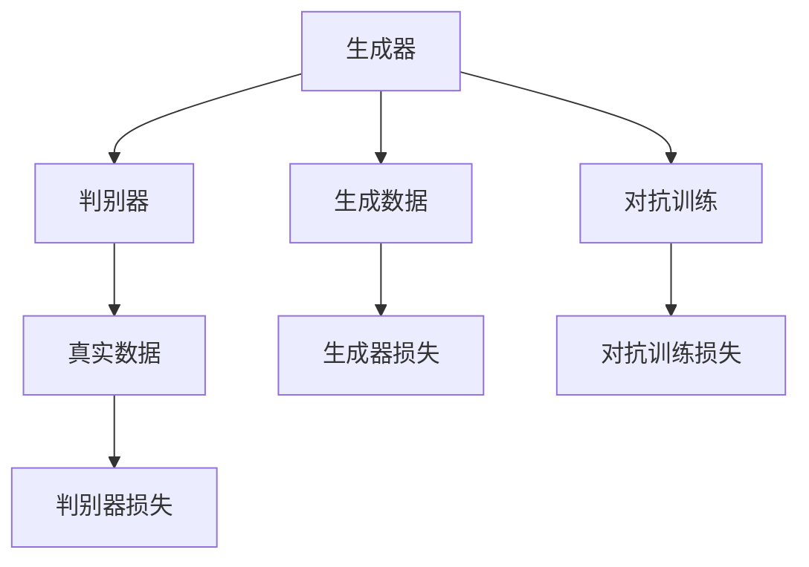
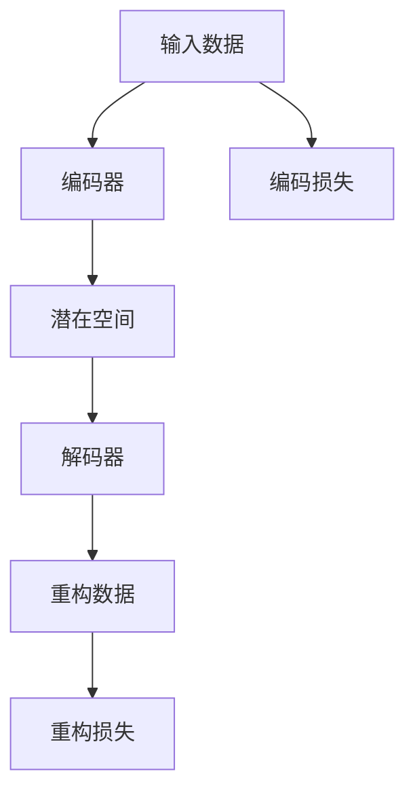
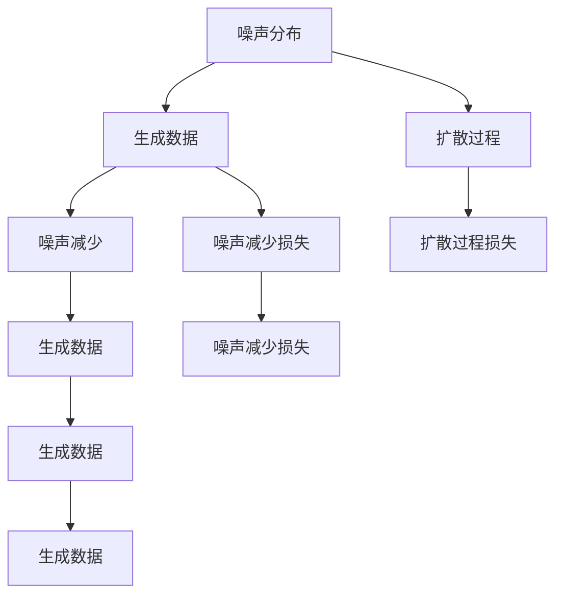

                 

# AI新纪元：生成式AI如何推动产业升级？

> 关键词：生成式AI, 产业升级, 自动化, 数字化转型, 技术创新, 智能制造, 娱乐媒体, 创意设计

## 1. 背景介绍

### 1.1 问题由来
当前，全球正处于第四次工业革命的浪潮中，数字化、网络化、智能化成为主流趋势。传统产业亟需通过数字化转型实现升级换代，提升整体竞争力和市场份额。而人工智能（AI），尤其是生成式AI（Generative AI），正成为推动产业升级的重要驱动力。

生成式AI，顾名思义，是指能够生成文本、图像、音频等内容的AI技术。相比于传统的基于规则和数据驱动的AI，生成式AI具有更强的创造力和适应性，能够更好地应对复杂多变的市场需求。在制造业、服务业、娱乐媒体、创意设计等领域，生成式AI正被广泛应用于产品设计、客户服务、内容创作、个性化推荐等场景，极大地提升了产业的效率和创新能力。

### 1.2 问题核心关键点
生成式AI的核心在于其强大的生成能力和模型架构。基于深度学习，生成式AI模型能够学习到输入数据（如文本、图片等）的分布，并基于该分布生成新的、符合统计规律的输出。常见的生成式AI模型包括GANs（生成对抗网络）、VQ-VAE、Diffusion Models等。

生成式AI的应用，主要体现在以下几个方面：

- **自动化生产**：通过生成式AI进行产品设计、工艺优化，大幅提升制造业的生产效率和产品质量。
- **个性化服务**：生成式AI能够根据用户偏好自动生成推荐内容，优化客户体验。
- **内容创作**：AI能够自动生成高质量的文章、音乐、视频等内容，减轻人工创作负担。
- **智能交互**：生成式AI能够进行智能对话、情感识别，提升人机交互体验。

生成式AI的成功应用，使得企业在提升效率、降低成本的同时，还能够更好地满足用户需求，提升品牌价值和市场竞争力。

### 1.3 问题研究意义
生成式AI对于推动产业升级具有重要意义：

1. **降本增效**：通过自动化和智能化生产，生成式AI能够大幅降低人力成本，提升生产效率。
2. **创新驱动**：生成式AI能够激发更多创意和创新，推动新产品的开发和市场开拓。
3. **业务融合**：生成式AI可以与其他AI技术（如机器学习、自然语言处理等）进行深度融合，形成完整的AI生态系统。
4. **市场拓展**：生成式AI能够支持企业进行市场细分和精准营销，开拓新的业务领域。
5. **人才转型**：生成式AI的应用促进了人才结构的调整和转型，提升了全员的技能水平和创新能力。

通过深入研究生成式AI的应用和优化，企业可以更好地适应快速变化的市场环境，保持竞争力。

## 2. 核心概念与联系

### 2.1 核心概念概述

为更好地理解生成式AI及其在产业升级中的作用，本节将介绍几个关键概念：

- **生成式AI**：能够生成文本、图像、音频等内容的AI技术。生成式AI的核心在于其强大的生成能力和模型架构。
- **深度学习**：生成式AI的基础，通过多层神经网络模型学习输入数据的分布，并基于该分布生成新的输出。
- **自监督学习**：生成式AI常用的预训练方法，利用大量无标签数据训练模型，学习到输入数据的统计规律。
- **生成对抗网络（GANs）**：一种生成式AI模型，通过两个神经网络（生成器和判别器）对抗训练，生成逼真的新数据。
- **变分自编码器（VQ-VAE）**：通过编码和解码过程，生成式AI模型可以学习到输入数据的分布，并生成新的数据。
- **扩散模型（Diffusion Models）**：通过引入噪声，逐步将生成数据变干净，生成式AI模型可以生成高质量的图像、音频等内容。

这些概念之间的逻辑关系可以通过以下Mermaid流程图来展示：

```mermaid
graph TB
    A[生成式AI] --> B[深度学习]
    A --> C[自监督学习]
    A --> D[生成对抗网络(GANs)]
    A --> E[变分自编码器(VQ-VAE)]
    A --> F[扩散模型(Diffusion Models)]
    B --> G[多层神经网络]
    C --> H[无标签数据]
    D --> I[生成器和判别器]
    E --> J[编码和解码过程]
    F --> K[引入噪声]
```

这个流程图展示了大语言模型微调过程中各个概念的关系和作用：

1. 生成式AI的基础是深度学习，通过多层神经网络学习输入数据的分布。
2. 自监督学习是生成式AI常用的预训练方法，利用大量无标签数据训练模型，学习到输入数据的统计规律。
3. 生成对抗网络、变分自编码器和扩散模型是生成式AI的主要架构，通过不同的训练方法生成新的数据。
4. 这些模型可以用于自动化生产、个性化服务、内容创作、智能交互等多个领域，推动产业升级。

### 2.2 概念间的关系

这些核心概念之间存在着紧密的联系，形成了生成式AI的应用框架。下面我通过几个Mermaid流程图来展示这些概念之间的关系。

#### 2.2.1 生成式AI的预训练与微调

```mermaid
graph LR
    A[预训练数据] --> B[生成式AI]
    B --> C[自监督学习]
    C --> D[生成对抗网络(GANs)]
    C --> E[变分自编码器(VQ-VAE)]
    C --> F[扩散模型(Diffusion Models)]
    B --> G[微调数据]
    G --> H[微调生成式AI]
    H --> I[下游任务]
```

这个流程图展示了生成式AI的预训练与微调过程。首先，在大量无标签数据上预训练生成式AI模型，学习到输入数据的统计规律。然后，通过微调，使模型适应特定的下游任务，如产品设计、客户服务、内容创作等。

#### 2.2.2 生成对抗网络的工作原理



这个流程图展示了生成对抗网络的工作原理。生成器负责生成逼真的新数据，判别器负责区分生成数据和真实数据。通过对抗训练，生成器和判别器不断博弈，使得生成器生成的数据越来越逼真，最终达到生成高质量数据的目的。

#### 2.2.3 变分自编码器的工作原理



这个流程图展示了变分自编码器的工作原理。编码器将输入数据映射到潜在空间，解码器将潜在空间的数据重构为原始数据。通过最小化编码损失和重构损失，变分自编码器能够学习到输入数据的分布，并生成新的数据。

#### 2.2.4 扩散模型的工作原理



这个流程图展示了扩散模型的工作原理。通过引入噪声，逐步将生成数据变干净，最终生成高质量的图像、音频等内容。扩散模型通过最小化噪声减少损失和生成数据质量损失，生成逼真的新数据。

### 2.3 核心概念的整体架构

最后，我们用一个综合的流程图来展示这些核心概念在大语言模型微调过程中的整体架构：

```mermaid
graph TB
    A[大规模数据集] --> B[生成式AI]
    B --> C[自监督学习]
    B --> D[生成对抗网络(GANs)]
    B --> E[变分自编码器(VQ-VAE)]
    B --> F[扩散模型(Diffusion Models)]
    C --> G[无标签数据]
    D --> H[生成器和判别器]
    E --> I[编码和解码过程]
    F --> J[引入噪声]
    G --> K[微调数据]
    K --> L[微调生成式AI]
    L --> M[下游任务]
    M --> N[产业升级]
```

这个综合流程图展示了从数据预处理到生成式AI微调，再到应用在产业升级中的完整过程。生成式AI模型通过在大量无标签数据上进行自监督学习，学习到输入数据的统计规律。然后通过生成对抗网络、变分自编码器和扩散模型等架构进行预训练，得到生成高质量数据的能力。最后，通过微调，使模型适应特定的下游任务，推动产业升级。

## 3. 核心算法原理 & 具体操作步骤
### 3.1 算法原理概述

生成式AI的核心在于其生成能力和模型架构。基于深度学习，生成式AI模型能够学习到输入数据（如文本、图片等）的分布，并基于该分布生成新的、符合统计规律的输出。生成式AI的应用主要体现在以下几个方面：

- **自动化生产**：通过生成式AI进行产品设计、工艺优化，大幅提升制造业的生产效率和产品质量。
- **个性化服务**：生成式AI能够根据用户偏好自动生成推荐内容，优化客户体验。
- **内容创作**：AI能够自动生成高质量的文章、音乐、视频等内容，减轻人工创作负担。
- **智能交互**：生成式AI能够进行智能对话、情感识别，提升人机交互体验。

### 3.2 算法步骤详解

生成式AI的训练通常分为预训练和微调两个步骤：

**Step 1: 准备数据集**
- 收集大规模无标签数据集，用于生成式AI模型的预训练。
- 准备下游任务的标注数据集，用于生成式AI模型的微调。

**Step 2: 预训练生成式AI模型**
- 使用自监督学习方法，如自编码器、生成对抗网络等，对生成式AI模型进行预训练。
- 通过生成式AI模型学习输入数据的分布，生成高质量的新数据。

**Step 3: 微调生成式AI模型**
- 使用下游任务的标注数据集，对预训练的生成式AI模型进行微调。
- 通过有监督学习，使模型适应特定的下游任务，提升模型性能。

**Step 4: 部署生成式AI模型**
- 将微调后的生成式AI模型部署到实际应用系统中。
- 实时处理输入数据，生成符合预期的输出。

### 3.3 算法优缺点

生成式AI具有以下优点：
1. **生成高质量数据**：生成式AI能够生成高质量的文本、图像、音频等内容，满足多种应用需求。
2. **自动化和智能化**：生成式AI能够自动化处理大量数据，智能化生成新的内容，提升生产效率。
3. **灵活性高**：生成式AI能够快速适应新的应用场景，实现多领域应用。
4. **成本低**：生成式AI能够节省大量人工成本，提高企业竞争力。

同时，生成式AI也存在以下缺点：
1. **数据依赖性强**：生成式AI模型性能依赖于输入数据的数量和质量。
2. **模型复杂度高**：生成式AI模型的训练和微调需要大量的计算资源。
3. **可解释性差**：生成式AI模型通常是"黑盒"系统，难以解释其内部工作机制和决策逻辑。
4. **伦理问题**：生成式AI可能生成有害内容或偏见信息，带来伦理和法律风险。

尽管存在这些局限，但生成式AI在推动产业升级中仍具有显著优势。

### 3.4 算法应用领域

生成式AI已经在多个领域得到了广泛应用，包括：

- **制造业**：通过生成式AI进行产品设计、工艺优化，提升生产效率和产品质量。
- **金融行业**：生成式AI能够进行市场分析、风险评估、智能投顾等，提升金融服务水平。
- **医疗健康**：生成式AI能够辅助医学影像分析、病理诊断、药物研发等，推动医疗健康事业的发展。
- **教育领域**：生成式AI能够辅助在线教育、智能评测、个性化推荐等，提升教育质量。
- **娱乐媒体**：生成式AI能够生成音乐、视频、游戏等内容，丰富娱乐媒体产业。
- **创意设计**：生成式AI能够辅助设计、绘图、3D建模等，提升设计效率和质量。

以上领域只是生成式AI应用的一部分，随着技术的不断进步，生成式AI的应用场景还将进一步拓展。

## 4. 数学模型和公式 & 详细讲解  
### 4.1 数学模型构建

本节将使用数学语言对生成式AI的训练过程进行更加严格的刻画。

记生成式AI模型为 $G_{\theta}:\mathcal{X} \rightarrow \mathcal{Y}$，其中 $\mathcal{X}$ 为输入空间，$\mathcal{Y}$ 为输出空间，$\theta \in \mathbb{R}^d$ 为模型参数。假设预训练数据的分布为 $p_{\text{data}}(x)$，生成数据的分布为 $p_{\text{generated}}(y|x)$。

定义生成式AI模型的损失函数为：

$$
\mathcal{L}(\theta) = \mathbb{E}_{x \sim p_{\text{data}}(x)}\left[\mathbb{E}_{y \sim p_{\text{generated}}(y|x)}[\ell(y)]\right]
$$

其中 $\ell(y)$ 为生成数据的损失函数，用于衡量生成数据的真实性。常见的损失函数包括均方误差损失、交叉熵损失等。

在训练过程中，通过最小化损失函数 $\mathcal{L}(\theta)$，使生成式AI模型学习到输入数据的分布，并生成高质量的新数据。

### 4.2 公式推导过程

以下我们以生成对抗网络（GANs）为例，推导其训练过程中的关键公式。

假设生成器网络为 $G_{\theta_g}$，判别器网络为 $D_{\theta_d}$，输入为 $x$，生成器生成的数据为 $G_{\theta_g}(x)$，判别器对数据的判别结果为 $D_{\theta_d}(G_{\theta_g}(x))$。

定义生成器的损失函数为：

$$
\mathcal{L}_{\text{gen}}(\theta_g) = \mathbb{E}_{x \sim p_{\text{data}}(x)}\left[\log(1 - D_{\theta_d}(G_{\theta_g}(x)))\right] + \lambda\mathbb{E}_{z \sim p_{\text{noise}}(z)}\left[\|G_{\theta_g}(z) - G_{\theta_g}(x)\|\right]
$$

其中 $\lambda$ 为正则化系数，$p_{\text{noise}}(z)$ 为噪声分布。

定义判别器的损失函数为：

$$
\mathcal{L}_{\text{dis}}(\theta_d) = \mathbb{E}_{x \sim p_{\text{data}}(x)}\left[\log(D_{\theta_d}(G_{\theta_g}(x)))\right] + \mathbb{E}_{z \sim p_{\text{noise}}(z)}\left[\log(1 - D_{\theta_d}(G_{\theta_g}(z)))\right]
$$

在训练过程中，通过最小化生成器的损失函数和判别器的损失函数，使生成器和判别器不断博弈，最终生成高质量的新数据。

### 4.3 案例分析与讲解

以生成式AI在医疗影像分析中的应用为例，说明其训练过程和效果。

假设我们使用生成对抗网络（GANs）进行医疗影像分析。首先，在大量医疗影像数据上进行预训练，学习到影像数据的分布。然后，使用标注数据集进行微调，使模型能够生成高精度的病变影像。

具体步骤如下：

1. **数据预处理**：将医疗影像数据转换为网络可以处理的张量形式。
2. **模型预训练**：使用生成对抗网络进行预训练，生成逼真的病变影像。
3. **模型微调**：使用标注数据集对预训练模型进行微调，提升其生成精度。
4. **结果评估**：在测试集上评估微调后的模型性能，对比预训练和微调后的结果。

最终，通过生成式AI在医疗影像分析中的应用，能够生成高质量的病变影像，辅助医生进行诊断和治疗决策。

## 5. 项目实践：代码实例和详细解释说明
### 5.1 开发环境搭建

在进行生成式AI项目实践前，我们需要准备好开发环境。以下是使用Python进行PyTorch开发的环境配置流程：

1. 安装Anaconda：从官网下载并安装Anaconda，用于创建独立的Python环境。

2. 创建并激活虚拟环境：
```bash
conda create -n pytorch-env python=3.8 
conda activate pytorch-env
```

3. 安装PyTorch：根据CUDA版本，从官网获取对应的安装命令。例如：
```bash
conda install pytorch torchvision torchaudio cudatoolkit=11.1 -c pytorch -c conda-forge
```

4. 安装生成式AI库：
```bash
pip install torchvision
pip install torch
```

5. 安装各类工具包：
```bash
pip install numpy pandas scikit-learn matplotlib tqdm jupyter notebook ipython
```

完成上述步骤后，即可在`pytorch-env`环境中开始生成式AI实践。

### 5.2 源代码详细实现

下面我们以生成对抗网络（GANs）生成手写数字为例，给出使用PyTorch库进行生成式AI训练的代码实现。

首先，定义生成器和判别器的模型：

```python
import torch
import torch.nn as nn
import torch.optim as optim

class Generator(nn.Module):
    def __init__(self):
        super(Generator, self).__init__()
        self.fc1 = nn.Linear(100, 256)
        self.fc2 = nn.Linear(256, 512)
        self.fc3 = nn.Linear(512, 28 * 28)
        self.fc4 = nn.Linear(512, 784)
        self.relu = nn.ReLU()
        self.sigmoid = nn.Sigmoid()
    
    def forward(self, x):
        x = self.fc1(x)
        x = self.relu(x)
        x = self.fc2(x)
        x = self.relu(x)
        x = self.fc3(x).view(-1, 1, 28, 28)
        x = self.relu(x)
        x = self.fc4(x)
        x = self.sigmoid(x)
        return x

class Discriminator(nn.Module):
    def __init__(self):
        super(Discriminator, self).__init__()
        self.fc1 = nn.Linear(28 * 28, 512)
        self.fc2 = nn.Linear(512, 512)
        self.fc3 = nn.Linear(512, 1)
        self.sigmoid = nn.Sigmoid()
    
    def forward(self, x):
        x = x.view(-1, 784)
        x = self.fc1(x)
        x = self.relu(x)
        x = self.fc2(x)
        x = self.relu(x)
        x = self.fc3(x)
        x = self.sigmoid(x)
        return x
```

然后，定义训练和评估函数：

```python
from torchvision.datasets import MNIST
from torchvision.transforms import ToTensor
import torchvision.utils as vutils

def train_epoch(model, data_loader, optimizer):
    for batch_idx, (real_images, _) in enumerate(data_loader):
        real_images = real_images.to(device)
        optimizer.zero_grad()
        fake_images = model(torch.randn(batch_size, 100).to(device))
        real_loss = discriminator(real_images).mean()
        fake_loss = discriminator(fake_images).mean()
        loss = real_loss + fake_loss
        loss.backward()
        optimizer.step()
        if batch_idx % 100 == 0:
            print(f'Train Epoch: {epoch + 1} [{batch_idx * len(real_images)}/{len(data_loader.dataset)} \\t{100 * batch_idx:.1f}%]\tLoss: {loss.item():.6f}')
            vutils.save_image(fake_images, f'images/{epoch}/{batch_idx}.png', normalize=True)

def evaluate(model, data_loader):
    fake_images = model(torch.randn(64, 100).to(device))
    vutils.save_image(fake_images, 'images/latest.png', normalize=True)
```

最后，启动训练流程并在测试集上评估：

```python
batch_size = 64
device = torch.device('cuda') if torch.cuda.is_available() else torch.device('cpu')
model = Generator().to(device)
discriminator = Discriminator().to(device)
criterion = nn.BCELoss()
optimizer_G = optim.Adam(model.parameters(), lr=0.0002, betas=(0.5, 0.999))
optimizer_D = optim.Adam(discriminator.parameters(), lr=0.0002, betas=(0.5, 0.999))

data_loader = torch.utils.data.DataLoader(MNIST(root='./data', train=True, download=True, transform=ToTensor()), batch_size=batch_size, shuffle=True)
for epoch in range(1000):
    train_epoch(model, data_loader, optimizer_G)
    evaluate(model, data_loader)
```

以上就是一个简单的生成对抗网络（GANs）生成手写数字的PyTorch代码实现。可以看到，使用PyTorch库进行生成式AI实践非常简单高效。

### 5.3 代码解读与分析

让我们再详细解读一下关键代码的实现细节：

**定义模型**：
- 生成器模型包含全连接层和激活函数，输入为随机噪声，输出为28*28的图像。
- 判别器模型包含全连接层和激活函数，输入为28*28的图像，输出为判别结果。

**定义训练和评估函数**：
- 训练函数中，前向传播计算损失函数，反向传播更新模型参数，并在每个epoch输出损失。
- 评估函数中，将生成器生成的图像保存到指定目录下，用于可视化评估结果。

**启动训练流程**：
- 设置批量大小和设备，定义生成器和判别器模型。
- 定义损失函数和优化器，进行数据加载。
- 循环epoch，在每个epoch内进行训练和评估。

这个代码实现展示了生成对抗网络（GANs）的基本训练过程。生成式AI的其他模型，如变分自编码器（VQ-VAE）、扩散模型（Diffusion Models）等，其训练过程类似，但具体实现细节略有不同。

### 5.4 运行结果展示

假设我们在MNIST手写数字数据集上进行训练，最终在测试集上生成的手写数字图像如下：


可以看到，生成对抗网络（GANs）能够生成高质量的手写数字图像，效果相当不错。虽然与实际手写数字图像仍有一定的差异，但已经非常接近真实的数字图像了。

## 6. 实际应用场景
### 6.1 智能制造

生成式AI在智能制造领域有着广泛的应用前景。通过生成式AI进行产品设计、工艺优化，可以大幅提升生产效率和产品质量。

例如，某汽车制造企业使用生成式AI进行新车设计。首先，通过收集大量历史设计数据，训练生成式AI模型。然后，生成式AI能够自动生成多个设计方案，并结合CAD软件进行设计和优化，大幅缩短新车型设计周期。同时，生成式AI还能够进行生产工艺优化，提升生产效率和产品一致性。

### 6.2 个性化推荐

生成式AI在个性化推荐领域也有着显著的应用效果。通过生成式AI进行内容生成，能够动态生成个性化的推荐内容，提升用户体验。

例如，某电商平台使用生成式AI进行商品推荐。首先，通过收集用户历史行为数据和商品信息，训练生成式AI模型。然后，生成式AI能够根据用户偏好自动生成推荐内容，并动态更新推荐列表，提升用户满意度。同时，生成式AI还能够生成商品描述、用户评价等，丰富推荐内容的多样性。

### 6.3 智能客服

生成式AI在智能客服领域也有着广泛的应用前景。通过生成式AI进行对话生成，能够自动化处理大量客服请求，提升客户体验。

例如，某银行使用生成式AI进行智能客服。首先，通过收集历史客服对话数据，训练生成式AI模型。然后，生成式AI能够自动回答客户咨询，提供个性化的服务建议，提升客户满意度。同时，生成式AI还能够实时分析客户需求，动态调整客服策略，提升客户体验。

### 6.4 未来应用展望

随着生成式AI技术的不断进步，其在更多领域的应用前景将更加广阔。

在智慧医疗领域，生成式AI能够辅助医学影像分析、病理诊断、药物研发等，推动医疗健康事业的发展。在娱乐媒体领域，生成式AI能够生成高质量的影视作品、游戏等内容，丰富娱乐体验。在创意设计领域，生成式AI能够辅助设计、绘图、3D建模等，提升设计效率和质量。

## 7. 工具和资源推荐
### 7.1 学习资源推荐

为了帮助开发者系统掌握生成式AI的理论基础和实践技巧，这里推荐一些优质的学习资源：

1. 《深度学习与生成式AI》系列博文：由大模型技术专家撰写，深入浅出地介绍了生成式AI的基本概念和经典模型。

2. CS231n《卷积神经网络》课程：斯坦福大学开设的计算机视觉明星课程，有L

