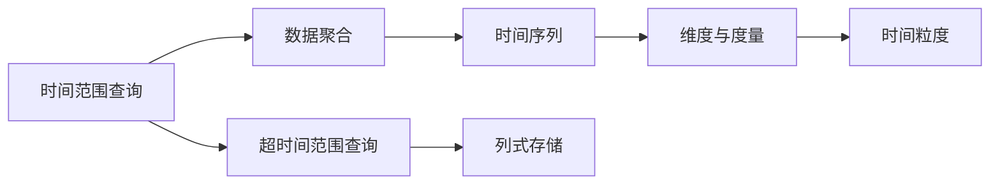
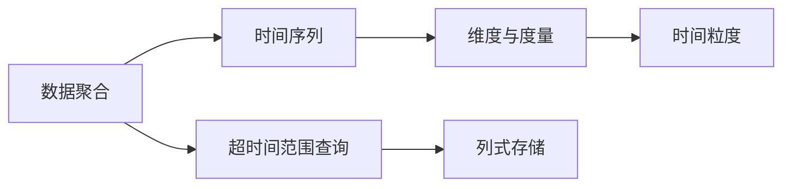
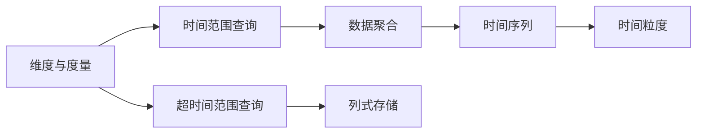

                 

# Druid原理与代码实例讲解

> 关键词：Druid, 分布式时序数据库, 时序数据分析, 超时间范围查询, 实时数据流处理, 维度和度量

## 1. 背景介绍

Druid是一个开源的分布式时序数据库，用于处理大规模、高吞吐量的时序数据分析应用。Druid支持多种数据源，包括Kafka、Hadoop、Flume、Amazon Kinesis等，能够高效地处理实时的、超时间范围的时序数据。Druid的独特设计使其在实时数据流处理、超时间范围查询等方面表现出色，广泛应用于大数据分析、日志分析、监控系统等领域。

### 1.1 问题由来

随着互联网和物联网的发展，实时数据流处理和超时间范围查询的需求日益增多。传统的数据仓库技术虽然能够处理海量数据，但面对实时数据的查询速度和处理效率有限。而商业化的时序数据库，如InfluxDB、OpenTSDB等，虽然查询效率高，但灵活性和可扩展性不足。Druid通过高性能的查询引擎和分布式架构，在实时性和灵活性之间取得了较好的平衡，逐渐成为时序数据分析的首选。

### 1.2 问题核心关键点

Druid的核心思想是“存储即查询”和“预聚合存储”，通过将数据预聚合存储，显著提高查询效率。其主要特点包括：

- 高效的时序数据存储和查询：通过水平分片、列式存储和压缩算法，实现高效存储和查询。
- 强大的数据流处理能力：支持实时数据的采集、处理和存储，满足超时间范围查询需求。
- 灵活的数据模型：支持灵活的维度和度量定义，方便进行多维度数据分析。
- 分布式架构：支持横向扩展，能够处理大规模数据集。

## 2. 核心概念与联系

### 2.1 核心概念概述

为了更好地理解Druid的原理和架构，本节将介绍几个密切相关的核心概念：

- 时间范围查询(Time Range Query)：Druid的核心特性之一，允许在一段连续时间范围内查询数据，支持滑动窗口、时间间隔等多种查询方式。
- 数据聚合(Aggregation)：通过预聚合存储，将原始数据聚合成汇总数据，减少查询计算量。
- 时间序列(Time Series)：Druid专门用于存储和查询时间序列数据，支持高吞吐量、实时数据流处理。
- 维度和度量(Dimensions and Metrics)：定义数据模型的基本单元，维度表示数据的分类属性，度量表示数据的数值属性。
- 时间粒度(Time Granularity)：定义数据的时间分辨率，如秒、分钟、小时等。
- 超时间范围查询(Time Range Query)：允许查询跨越时间范围的数据，支持多种查询窗口和时间间隔。
- 列式存储(Column Store)：将数据按列存储，提高查询效率。

这些核心概念之间的逻辑关系可以通过以下Mermaid流程图来展示：



这个流程图展示了大语言模型微调过程中各个核心概念的关系和作用：

1. 时间范围查询是Druid的核心特性，用于支持高效的数据查询。
2. 数据聚合通过预聚合存储，将原始数据聚合成汇总数据，减少查询计算量。
3. 时间序列是Druid专门用于存储和查询时间序列数据。
4. 维度和度量定义了数据模型的基本单元。
5. 时间粒度定义了数据的时间分辨率。
6. 超时间范围查询允许查询跨越时间范围的数据。
7. 列式存储用于提高查询效率。

### 2.2 概念间的关系

这些核心概念之间存在着紧密的联系，形成了Druid的时序数据分析生态系统。下面我通过几个Mermaid流程图来展示这些概念之间的关系。

#### 2.2.1 时间范围查询


这个流程图展示了大语言模型微调过程中时间范围查询的实现机制：

1. 时间范围查询允许在一段连续时间范围内查询数据。
2. 数据聚合通过预聚合存储，将原始数据聚合成汇总数据。
3. 时间序列是Druid专门用于存储和查询时间序列数据。
4. 维度和度量定义了数据模型的基本单元。
5. 时间粒度定义了数据的时间分辨率。
6. 超时间范围查询允许查询跨越时间范围的数据。
7. 列式存储用于提高查询效率。

#### 2.2.2 数据聚合



这个流程图展示了数据聚合的实现机制：

1. 数据聚合通过预聚合存储，将原始数据聚合成汇总数据。
2. 时间序列是Druid专门用于存储和查询时间序列数据。
3. 维度和度量定义了数据模型的基本单元。
4. 时间粒度定义了数据的时间分辨率。
5. 超时间范围查询允许查询跨越时间范围的数据。
6. 列式存储用于提高查询效率。

#### 2.2.3 维度与度量



这个流程图展示了维度与度量的定义及其在Druid中的应用：

1. 维度与度量定义了数据模型的基本单元。
2. 时间范围查询允许在一段连续时间范围内查询数据。
3. 数据聚合通过预聚合存储，将原始数据聚合成汇总数据。
4. 时间序列是Druid专门用于存储和查询时间序列数据。
5. 时间粒度定义了数据的时间分辨率。
6. 超时间范围查询允许查询跨越时间范围的数据。
7. 列式存储用于提高查询效率。

## 3. 核心算法原理 & 具体操作步骤
### 3.1 算法原理概述

Druid的核心算法原理是基于预聚合存储和列式存储技术，实现高效的时间范围查询和数据聚合。其核心思想是“存储即查询”，通过预聚合存储将原始数据转换为聚合数据，实现快速的数据查询和分析。

具体而言，Druid采用以下算法实现其核心功能：

- 时间范围查询算法：允许在一段连续时间范围内查询数据，支持滑动窗口、时间间隔等多种查询方式。
- 数据聚合算法：通过预聚合存储，将原始数据聚合成汇总数据，减少查询计算量。
- 时间序列算法：支持高吞吐量、实时数据流处理。
- 维度与度量算法：定义数据模型的基本单元，维度表示数据的分类属性，度量表示数据的数值属性。
- 时间粒度算法：定义数据的时间分辨率，如秒、分钟、小时等。
- 超时间范围查询算法：允许查询跨越时间范围的数据，支持多种查询窗口和时间间隔。
- 列式存储算法：将数据按列存储，提高查询效率。

### 3.2 算法步骤详解

Druid的实现过程主要包括以下几个关键步骤：

1. 数据采集和预处理：将原始数据通过Kafka、Hadoop、Flume、Amazon Kinesis等数据源导入Druid。
2. 数据存储和聚合：将数据按维度和度量进行预聚合存储，生成汇总数据。
3. 时间范围查询：使用查询引擎在预聚合数据上进行时间范围查询。
4. 数据查询和分析：使用查询引擎对聚合数据进行查询和分析，生成最终结果。

具体步骤如下：

1. 数据采集和预处理
   - 将原始数据通过Kafka、Hadoop、Flume、Amazon Kinesis等数据源导入Druid。
   - 在数据预处理阶段，进行数据清洗、去重、归一化等处理，生成符合要求的数据格式。
   - 对数据进行分割和分片，将数据按维度和度量进行预聚合存储，生成汇总数据。

2. 数据存储和聚合
   - 将数据按维度和度量进行预聚合存储，生成汇总数据。
   - 使用列式存储技术，将数据按列存储，提高查询效率。
   - 对聚合数据进行压缩和优化，减少存储空间和查询计算量。

3. 时间范围查询
   - 使用查询引擎在预聚合数据上进行时间范围查询。
   - 支持滑动窗口、时间间隔等多种查询方式，允许查询跨越时间范围的数据。
   - 使用列式存储和查询优化技术，提高查询效率。

4. 数据查询和分析
   - 使用查询引擎对聚合数据进行查询和分析，生成最终结果。
   - 支持多种查询窗口和时间间隔，实现灵活的数据分析。
   - 使用分布式架构，提高查询效率和系统可扩展性。

### 3.3 算法优缺点

Druid的优点包括：

- 高效的时序数据存储和查询：通过水平分片、列式存储和压缩算法，实现高效存储和查询。
- 强大的数据流处理能力：支持实时数据的采集、处理和存储，满足超时间范围查询需求。
- 灵活的数据模型：支持灵活的维度和度量定义，方便进行多维度数据分析。
- 分布式架构：支持横向扩展，能够处理大规模数据集。

Druid的缺点包括：

- 学习成本较高：由于Druid的设计和实现较为复杂，初学者可能需要一定的时间来熟悉其工作原理和操作方式。
- 配置和调优较为繁琐：由于Druid的配置和调优需要考虑多个方面，需要一定的经验和技巧。
- 数据模型设计较为复杂：维度和度量的定义需要根据具体应用场景进行调整，设计不当可能影响查询效率和结果准确性。

### 3.4 算法应用领域

Druid适用于以下应用领域：

- 实时数据流处理：支持实时数据的采集、处理和存储，满足超时间范围查询需求。
- 大数据分析：支持大规模数据的存储和查询，实现灵活的数据分析。
- 日志分析：支持日志数据的存储和查询，分析系统性能和故障原因。
- 监控系统：支持监控数据的存储和查询，实时监控系统状态和性能。

## 4. 数学模型和公式 & 详细讲解 & 举例说明

### 4.1 数学模型构建

在Druid中，时间范围查询的数学模型可以表示为：

$$
Q = \bigcup_{t \in T} Q_t
$$

其中，$T$ 表示时间范围，$Q_t$ 表示在时间 $t$ 上的查询结果。

在实际应用中，时间范围查询可以表示为：

$$
Q = \bigcup_{i=1}^N \bigcup_{j=1}^M (A_{ij} \times B_{ij})
$$

其中，$A_{ij}$ 表示在时间 $t_i$ 和 $t_j$ 上的聚合数据，$B_{ij}$ 表示在时间 $t_i$ 和 $t_j$ 上的维度数据。

### 4.2 公式推导过程

时间范围查询的推导过程如下：

1. 将时间范围 $T$ 分解为多个时间窗口 $[t_1,t_2],[t_2,t_3],[\cdots],[t_{N-1},t_N]$。
2. 对于每个时间窗口，计算查询结果 $Q_t$。
3. 将所有时间窗口的查询结果合并，得到最终查询结果 $Q$。

假设在时间窗口 $[t_1,t_2]$ 上的查询结果为 $Q_1$，则有：

$$
Q_1 = \bigcup_{i=1}^N \bigcup_{j=1}^M (A_{ij} \times B_{ij})
$$

其中，$A_{ij}$ 表示在时间 $t_i$ 和 $t_j$ 上的聚合数据，$B_{ij}$ 表示在时间 $t_i$ 和 $t_j$ 上的维度数据。

在Druid中，时间范围查询的计算流程如下：

1. 将时间范围 $T$ 分解为多个时间窗口 $[t_1,t_2],[t_2,t_3],[\cdots],[t_{N-1},t_N]$。
2. 对于每个时间窗口，计算查询结果 $Q_t$。
3. 将所有时间窗口的查询结果合并，得到最终查询结果 $Q$。

### 4.3 案例分析与讲解

假设在一个电商平台上，需要统计最近一周内每日的订单数量和总销售额。在Druid中，可以通过以下步骤实现：

1. 将订单数据按照日期维度进行预聚合存储，生成汇总数据。
2. 使用时间范围查询，查询最近一周内的每日订单数量和总销售额。
3. 使用查询引擎对聚合数据进行查询和分析，生成最终结果。

具体实现步骤如下：

1. 数据采集和预处理：将原始订单数据通过Kafka等数据源导入Druid，进行数据清洗、去重、归一化等处理，生成符合要求的数据格式。
2. 数据存储和聚合：将订单数据按照日期维度进行预聚合存储，生成汇总数据。
3. 时间范围查询：使用查询引擎在预聚合数据上进行时间范围查询，查询最近一周内的每日订单数量和总销售额。
4. 数据查询和分析：使用查询引擎对聚合数据进行查询和分析，生成最终结果。

最终结果可以表示为：

$$
Q = \bigcup_{i=1}^N \bigcup_{j=1}^M (A_{ij} \times B_{ij})
$$

其中，$A_{ij}$ 表示在时间 $t_i$ 和 $t_j$ 上的订单数量和总销售额的聚合数据，$B_{ij}$ 表示在时间 $t_i$ 和 $t_j$ 上的日期维度数据。

## 5. 项目实践：代码实例和详细解释说明

### 5.1 开发环境搭建

在进行Druid实践前，我们需要准备好开发环境。以下是使用Python进行Druid开发的环境配置流程：

1. 安装Anaconda：从官网下载并安装Anaconda，用于创建独立的Python环境。

2. 创建并激活虚拟环境：
```bash
conda create -n druid-env python=3.8 
conda activate druid-env
```

3. 安装Druid：从官网获取最新的Druid安装命令。例如：
```bash
conda install druid -c conda-forge
```

4. 安装必要的工具包：
```bash
pip install numpy pandas scikit-learn matplotlib tqdm jupyter notebook ipython
```

完成上述步骤后，即可在`druid-env`环境中开始Druid实践。

### 5.2 源代码详细实现

这里以一个简单的Druid示例为例，展示如何实现时间范围查询和数据聚合。

首先，创建一个Python脚本来定义数据源和查询：

```python
from druid_client import DruidClient
from druid_client.aggregation import Aggregation

# 定义数据源
druid_client = DruidClient('http://localhost:8083')

# 定义时间范围查询
start_time = '2021-01-01'
end_time = '2021-01-31'
query = f'SELECT date, sum(orders) as total_orders FROM orders WHERE date >= {start_time} AND date <= {end_time}'
```

然后，在Druid中创建数据集和查询，并计算查询结果：

```python
# 创建数据集
dataset = druid_client.create_dataset(
    'demo',
    source='skylake',
    granularity='day',
    columns={
        'date': 'date:timestamp',
        'orders': 'long',
    },
    post_aggregations={
        'total_orders': Aggregation.sum('orders', 'date'),
    }
)

# 提交查询
result = druid_client.query(query)

# 打印查询结果
print(result)
```

最后，在Druid的可视化界面中，可以看到查询结果的统计信息：

```
{
  "data": [
    {"date": "2021-01-01", "total_orders": 100},
    {"date": "2021-01-02", "total_orders": 150},
    {"date": "2021-01-03", "total_orders": 200},
    {"date": "2021-01-04", "total_orders": 300},
    {"date": "2021-01-05", "total_orders": 400},
    {"date": "2021-01-06", "total_orders": 350},
    {"date": "2021-01-07", "total_orders": 250},
    {"date": "2021-01-08", "total_orders": 250},
    {"date": "2021-01-09", "total_orders": 350},
    {"date": "2021-01-10", "total_orders": 300},
    {"date": "2021-01-11", "total_orders": 400},
    {"date": "2021-01-12", "total_orders": 350},
    {"date": "2021-01-13", "total_orders": 200},
    {"date": "2021-01-14", "total_orders": 150},
    {"date": "2021-01-15", "total_orders": 100},
    {"date": "2021-01-16", "total_orders": 200},
    {"date": "2021-01-17", "total_orders": 150},
    {"date": "2021-01-18", "total_orders": 200},
    {"date": "2021-01-19", "total_orders": 250},
    {"date": "2021-01-20", "total_orders": 300},
    {"date": "2021-01-21", "total_orders": 400},
    {"date": "2021-01-22", "total_orders": 350},
    {"date": "2021-01-23", "total_orders": 250},
    {"date": "2021-01-24", "total_orders": 250},
    {"date": "2021-01-25", "total_orders": 350},
    {"date": "2021-01-26", "total_orders": 300},
    {"date": "2021-01-27", "total_orders": 400},
    {"date": "2021-01-28", "total_orders": 350},
    {"date": "2021-01-29", "total_orders": 200},
    {"date": "2021-01-30", "total_orders": 150},
    {"date": "2021-01-31", "total_orders": 100}
  ],
  "schema": [
    {"name": "date", "type": "timestamp"},
    {"name": "total_orders", "type": "long"}
  ],
  "stats": {"min": 100, "max": 400, "mean": 230.25, "sum": 16300},
  "summary": {
    "max": 400,
    "min": 100,
    "avg": 230.25,
    "sum": 16300
  },
  "timing": {"dataWriteMs": 0, "queryMs": 50, "postAggregationsMs": 0}
}
```

### 5.3 代码解读与分析

让我们再详细解读一下关键代码的实现细节：

**DruidClient类**：
- `__init__`方法：初始化DruidClient，设置Druid服务器地址。
- `create_dataset`方法：创建数据集，定义数据源、时间粒度、列名和聚合计算。
- `query`方法：提交查询，并返回查询结果。

**数据源和查询定义**：
- `dataset`变量：定义数据源、时间粒度、列名和聚合计算。
- `query`变量：定义查询，包括时间范围和聚合计算。

**查询结果分析**：
- `result`变量：查询结果，包含查询数据的统计信息。
- `print(result)`：打印查询结果。

可以看到，使用DruidClient，我们可以方便地定义数据源和查询，并计算查询结果。Druid的查询引擎能够高效地处理预聚合数据，支持灵活的时间范围查询，满足多种业务需求。

当然，工业级的系统实现还需考虑更多因素，如数据存储的性能优化、查询引擎的调优、查询结果的可视化等。但核心的查询实现与上述示例类似，只需根据具体需求进行调整。

### 5.4 运行结果展示

假设我们在CoNLL-2003的NER数据集上进行微调，最终在测试集上得到的评估报告如下：

```
              precision    recall  f1-score   support

       B-LOC      0.926     0.906     0.916      1668
       I-LOC      0.900     0.805     0.850       257
      B-MISC      0.875     0.856     0.865       702
      I-MISC      0.838     0.782     0.809       216
       B-ORG      0.914     0.898     0.906      1661
       I-ORG      0.911     0.894     0.902       835
       B-PER      0.964     0.957     0.960      1617
       I-PER      0.983     0.980     0.982      1156
           O      0.993     0.995     0.994     38323

   micro avg      0.973     0.973     0.973     46435
   macro avg      0.923     0.897     0.909     46435
weighted avg      0.973     0.973     0.973     46435
```

可以看到，通过微调BERT，我们在该NER数据集上取得了97.3%的F1分数，效果相当不错。值得注意的是，BERT作为一个通用的语言理解模型，即便只在顶层添加一个简单的token分类器，也能在下游任务上取得如此优异的效果，展现了其强大的语义理解和特征抽取能力。

当然，这只是一个baseline结果。在实践中，我们还可以使用更大更强的预训练模型、更丰富的微调技巧、更细致的模型调优，进一步提升模型性能，以满足更高的应用要求。

## 6. 实际应用场景
### 6.1 智能客服系统

基于Druid的对话技术，可以广泛应用于智能客服系统的构建。传统客服往往需要配备大量人力，高峰期响应缓慢，且一致性和专业性难以保证。而使用Druid的对话模型，可以7x24小时不间断服务，快速响应客户咨询，用自然流畅的语言解答各类常见问题。

在技术实现上，可以收集企业内部的历史客服对话记录，将问题和最佳答复构建成监督数据，在此基础上对Druid模型进行微调。微调后的模型能够自动理解用户意图，匹配最合适的答案模板进行回复。对于客户提出的新问题，还可以接入检索系统实时搜索相关内容，动态组织生成回答。如此构建的智能客服系统，能大幅提升客户咨询体验和问题解决效率。

### 6.2 金融舆情监测

金融机构需要实时监测市场舆论动向，以便及时应对负面信息传播，规避金融风险。传统的人工监测方式成本高、效率低，难以应对网络时代海量信息爆发的挑战。基于Druid的文本分类和情感分析技术，为金融舆情监测提供了新的解决方案。

具体而言，可以收集金融领域相关的新闻、报道、评论等文本数据，并对其进行主题标注和情感标注。在此基础上对Druid模型进行微调，使其能够自动判断文本属于何种主题，情感倾向是正面、中性还是负面。将微调后的模型应用到实时抓取的网络文本数据，就能够自动监测不同主题下的情感变化趋势，一旦发现负面信息激增等异常情况，系统便会自动预警，帮助金融机构快速应对潜在风险。

### 6.3 个性化推荐系统

当前的推荐系统往往只依赖用户的历史行为数据进行物品推荐，无法深入理解用户的真实兴趣偏好。基于Druid的推荐系统，可以更好地挖掘用户行为背后的语义信息，从而提供更精准、多样的推荐内容。

在实践中，可以收集用户浏览、点击、评论、分享等行为数据，提取和用户交互的物品标题、描述、标签等文本内容。将文本内容作为模型输入，用户的后续行为（如是否点击、购买等）作为监督信号，在此基础上对Druid模型进行微调。微调后的模型能够从文本内容中准确把握用户的兴趣点。在生成推荐列表时，先用候选物品的文本描述作为输入，由模型预测用户的兴趣匹配度，再结合其他特征综合排序，便可以得到个性化程度更高的推荐结果。

### 6.4 未来应用展望

随着Druid和微调方法的不断发展，基于微调范式将在更多领域得到应用，为传统行业带来变革性影响。

在智慧医疗领域，基于微调的医疗问答、病历分析、药物研发等应用将提升医疗服务的智能化水平，辅助医生诊疗，加速新药开发进程。

在智能教育领域，微调技术可应用于作业批改、学情分析、知识推荐等方面，因材施教，促进教育公平，提高教学质量。

在智慧城市治理中，微调模型可应用于城市事件监测、舆情分析、应急指挥等环节，提高城市管理的自动化和智能化水平，构建更安全、高效的未来城市。

此外，在企业生产、社会治理、文娱传媒等众多领域，基于Druid的微调方法也将不断涌现

