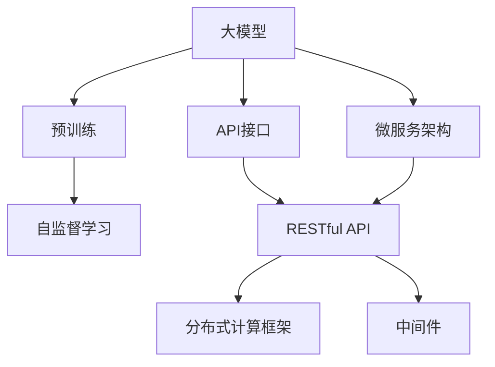
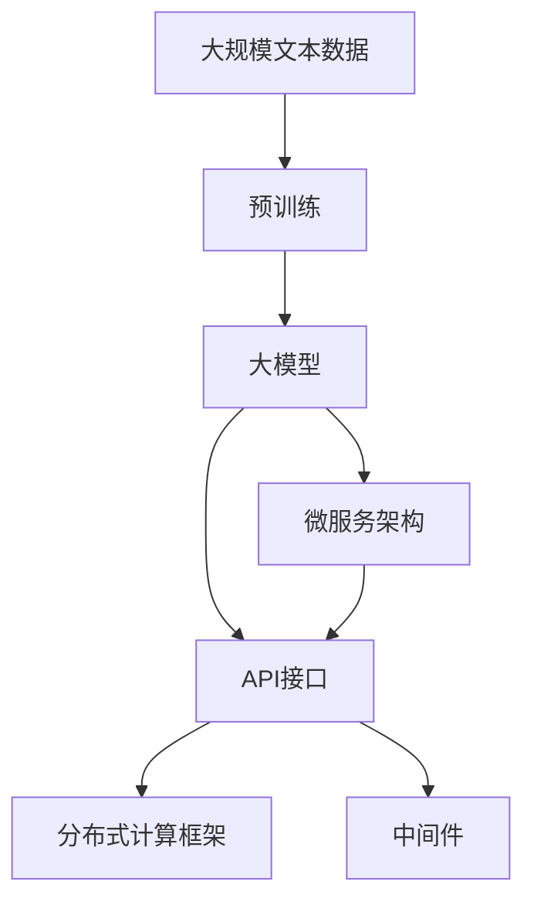
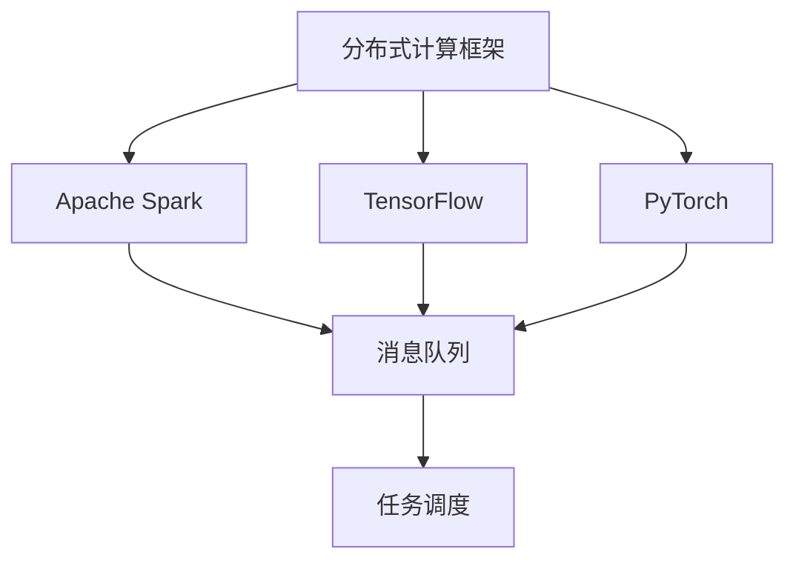
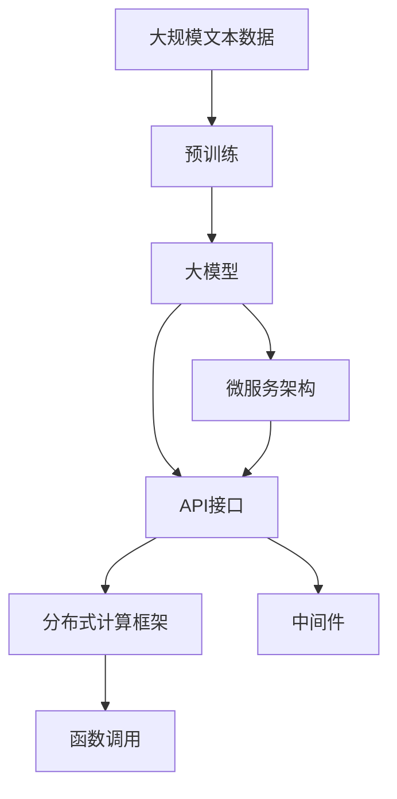

                 

# 【大模型应用开发 动手做AI Agent】函数调用

> 关键词：AI Agent, 函数调用, 大模型, 代码实例, 实时智能决策, 接口设计, 软件工程, 自然语言处理, 对话系统

## 1. 背景介绍

在当前数字化转型的大背景下，各行各业对智能化的需求日益增长。人工智能(AI)技术的引入，使得企业能够更快地响应市场变化，提升效率和竞争力。AI Agent作为其中一种重要的智能体，通过模拟人类行为或提供自动化服务，为人们提供了便利和支持。AI Agent的开发需要依赖大模型技术和高效的函数调用机制，本文将详细介绍这些技术在AI Agent应用中的实际实现。

### 1.1 问题由来
AI Agent在各行业的实际应用中，通常需要处理大量的数据和复杂的逻辑。预训练大模型提供了强大的语言理解和生成能力，可以极大地简化模型开发和训练过程。然而，将大模型应用于具体任务时，需要灵活调用模型进行实时推理。因此，如何设计高效的函数调用机制，成为AI Agent开发的关键问题。

### 1.2 问题核心关键点
函数调用是AI Agent开发的核心环节，通过合理的函数调用机制，可以显著提高AI Agent的处理效率和灵活性。以下是函数调用的几个关键点：

- **接口设计**：函数接口需要清晰明确，方便用户和系统调用。
- **数据传输**：函数调用的输入输出需要高效、稳定地传输数据。
- **实时性**：函数调用需要具备实时处理能力，满足系统对响应速度的要求。
- **安全性**：函数调用过程中需要保证数据和模型的安全性。
- **可维护性**：函数调用机制需要灵活可扩展，方便后续开发和维护。

## 2. 核心概念与联系

### 2.1 核心概念概述

为了更好地理解函数调用在大模型应用中的实现，本节将介绍几个关键概念：

- **大模型**：以Transformer为代表的大规模预训练语言模型，通过在大规模无标签文本语料上进行预训练，学习到丰富的语言知识。
- **API接口**：应用程序接口，是函数调用的标准形式，用于定义函数的功能、输入和输出。
- **RESTful API**：一种轻量级的API设计风格，遵循HTTP协议，支持多种数据格式。
- **微服务架构**：一种松散耦合、可扩展、可维护的软件架构，支持分布式部署和高效的函数调用。
- **分布式计算框架**：如Apache Spark、TensorFlow、PyTorch等，用于处理大规模数据和复杂计算。
- **中间件**：用于数据传输、消息队列、任务调度等功能的软件组件，支持高可用性和高可扩展性。

这些核心概念之间的逻辑关系可以通过以下Mermaid流程图来展示：



这个流程图展示了大模型、API接口、微服务架构等关键概念之间的关系：

1. 大模型通过预训练获得基础能力。
2. API接口定义了函数的功能和调用方式。
3. 微服务架构支持分布式部署和高效的函数调用。
4. 分布式计算框架提供高效计算能力。
5. 中间件支持数据传输和任务调度。

这些概念共同构成了AI Agent开发的基础生态系统，使得大模型能够通过函数调用机制实现高效、灵活的智能服务。通过理解这些核心概念，我们可以更好地把握AI Agent开发的关键技术点。

### 2.2 概念间的关系

这些核心概念之间存在着紧密的联系，形成了AI Agent开发的完整生态系统。下面我们通过几个Mermaid流程图来展示这些概念之间的关系。

#### 2.2.1 大模型的学习和应用



这个流程图展示了从预训练到大模型应用的整体过程。大模型通过预训练获得基础能力，然后通过API接口和微服务架构，在分布式计算框架和中间件的支持下，实现高效、灵活的函数调用。

#### 2.2.2 API接口与微服务架构


这个流程图展示了API接口与微服务架构的关系。RESTful API是一种轻量级的API设计风格，符合微服务架构的需求，支持松散耦合、可扩展的设计。

#### 2.2.3 分布式计算框架与中间件



这个流程图展示了分布式计算框架和中间件的关系。分布式计算框架提供高效计算能力，中间件支持数据传输和任务调度，两者共同构成AI Agent的计算基础设施。

### 2.3 核心概念的整体架构

最后，我们用一个综合的流程图来展示这些核心概念在大模型函数调用过程中的整体架构：



这个综合流程图展示了从预训练到大模型应用，再到函数调用的完整过程。大模型通过预训练获得基础能力，然后通过API接口和微服务架构，在分布式计算框架和中间件的支持下，实现高效、灵活的函数调用。函数调用是AI Agent开发的核心环节，支持实时智能决策。通过这些流程图，我们可以更清晰地理解大模型函数调用过程中各个概念的关系和作用。

## 3. 核心算法原理 & 具体操作步骤
### 3.1 算法原理概述

AI Agent中的函数调用过程，本质上是将输入数据传递给预训练大模型进行推理，并根据推理结果返回输出结果。这一过程可以分为以下几个步骤：

1. 数据预处理：将输入数据转换为模型所需格式，包括文本分词、特征编码等。
2. 函数调用：将预处理后的数据传递给大模型进行推理。
3. 结果后处理：将大模型输出的结果进行后处理，得到最终的输出结果。

以问答系统为例，函数调用过程可以分解为以下几个步骤：

1. 输入数据预处理：将用户提问转换为预训练模型所需的格式。
2. 模型推理：调用预训练模型对输入数据进行推理，得到推理结果。
3. 结果输出：将推理结果转换为最终的回答，返回给用户。

### 3.2 算法步骤详解

下面以一个简单的问答系统为例，详细介绍函数调用的具体步骤：

#### 3.2.1 数据预处理

1. 输入数据预处理：将用户提问转换为预训练模型所需的格式。例如，对于对话系统，需要将对话历史和当前用户提问转换为向量表示。

2. 特征编码：将预处理后的数据进行特征编码，得到模型所需的输入特征。例如，对于BERT模型，需要将输入文本转换为BERT模型所需的格式，包括词向量表示和特殊标记。

#### 3.2.2 函数调用

1. 模型初始化：初始化预训练模型，设定模型参数和超参数。例如，初始化BERT模型，并设定学习率和批大小。

2. 模型推理：调用预训练模型对输入数据进行推理，得到推理结果。例如，使用BERT模型对输入数据进行推理，得到上下文向量和推理结果。

#### 3.2.3 结果后处理

1. 结果解码：将大模型输出的结果进行解码，得到最终的回答。例如，对于问答系统，需要将模型输出的概率分布解码为具体的答案。

2. 结果输出：将解码后的结果输出给用户。例如，对于问答系统，将回答发送给用户。

### 3.3 算法优缺点

函数调用的优点包括：

- 高效性：通过大模型推理，可以在极短的时间内处理大量数据，提高系统响应速度。
- 灵活性：函数调用机制可以根据需求灵活设计，支持多种类型的任务处理。
- 可扩展性：函数调用机制支持分布式部署，可以扩展到更大的计算资源，支持更复杂的任务处理。

函数调用的缺点包括：

- 数据隐私：输入数据和输出结果需要安全传输，数据隐私保护问题需要重视。
- 模型可解释性：大模型推理结果通常缺乏可解释性，难以理解其内部工作机制。
- 计算资源消耗：函数调用需要大量的计算资源，可能带来较高的成本。

### 3.4 算法应用领域

函数调用机制在大模型应用中具有广泛的应用场景，例如：

- 对话系统：通过函数调用机制，可以实现智能对话和问答。
- 推荐系统：通过函数调用机制，可以生成个性化推荐结果。
- 数据分析：通过函数调用机制，可以进行复杂数据分析和处理。
- 自然语言生成：通过函数调用机制，可以生成自然流畅的文本内容。

## 4. 数学模型和公式 & 详细讲解  
### 4.1 数学模型构建

函数调用的数学模型可以表示为：

$$
F(x) = M_{\theta}(x)
$$

其中，$F(x)$表示函数调用的输出，$M_{\theta}$表示预训练模型的参数，$x$表示输入数据。函数调用的过程可以看作是模型$M_{\theta}$对输入数据$x$的映射。

### 4.2 公式推导过程

以BERT模型为例，函数调用的过程可以推导如下：

1. 输入数据预处理：将输入数据$x$转换为BERT模型所需的格式，得到预处理后的向量表示$x^{\prime}$。

2. 模型推理：将预处理后的向量表示$x^{\prime}$输入BERT模型，得到上下文向量表示$h$。

3. 结果解码：将上下文向量表示$h$解码为最终的答案。例如，对于问答系统，可以使用softmax函数对上下文向量进行解码，得到答案的概率分布。

### 4.3 案例分析与讲解

以一个简单的问答系统为例，进行案例分析：

1. 输入数据预处理：将用户提问"天气怎么样"转换为BERT模型所需的格式，得到预处理后的向量表示。

2. 模型推理：将预处理后的向量表示输入BERT模型，得到上下文向量表示。

3. 结果解码：将上下文向量表示解码为回答，得到"天气晴朗"。

## 5. 项目实践：代码实例和详细解释说明
### 5.1 开发环境搭建

在进行函数调用实践前，我们需要准备好开发环境。以下是使用Python进行PyTorch开发的环境配置流程：

1. 安装Anaconda：从官网下载并安装Anaconda，用于创建独立的Python环境。

2. 创建并激活虚拟环境：
```bash
conda create -n pytorch-env python=3.8 
conda activate pytorch-env
```

3. 安装PyTorch：根据CUDA版本，从官网获取对应的安装命令。例如：
```bash
conda install pytorch torchvision torchaudio cudatoolkit=11.1 -c pytorch -c conda-forge
```

4. 安装Transformers库：
```bash
pip install transformers
```

5. 安装各类工具包：
```bash
pip install numpy pandas scikit-learn matplotlib tqdm jupyter notebook ipython
```

完成上述步骤后，即可在`pytorch-env`环境中开始函数调用实践。

### 5.2 源代码详细实现

下面我们以一个简单的问答系统为例，给出使用Transformers库进行函数调用的PyTorch代码实现。

首先，定义问答系统模型：

```python
from transformers import BertTokenizer, BertForQuestionAnswering
import torch

class QASystem:
    def __init__(self, model_name='bert-base-uncased'):
        self.tokenizer = BertTokenizer.from_pretrained(model_name)
        self.model = BertForQuestionAnswering.from_pretrained(model_name)
    
    def preprocess_input(self, question, context):
        input_ids = self.tokenizer(question, context, return_tensors='pt', padding='max_length', truncation=True)
        return input_ids
    
    def call_model(self, input_ids):
        with torch.no_grad():
            logits = self.model(input_ids)
        start_logits, end_logits = logits.split(1, dim=-1)
        start_logits = start_logits.squeeze(-1)
        end_logits = end_logits.squeeze(-1)
        return start_logits, end_logits
    
    def get_answer(self, start_logits, end_logits, question, context):
        input_ids = self.tokenizer(question, context, return_tensors='pt', padding='max_length', truncation=True)
        logits = self.call_model(input_ids)
        start_index = torch.argmax(start_logits)
        end_index = torch.argmax(end_logits)
        answer = context[start_index:end_index+1]
        return answer
```

然后，编写问答系统的测试代码：

```python
from tqdm import tqdm

qa_system = QASystem()
for question, context in tqdm(SAMPLE_QUESTION_CONTEXT_PAIRS):
    answer = qa_system.get_answer(question, context)
    print(f"Question: {question}, Answer: {answer}")
```

这里使用了SAMPLE_QUESTION_CONTEXT_PAIRS数据集，包含了大量的问答样本，用于测试问答系统的准确性。

### 5.3 代码解读与分析

让我们再详细解读一下关键代码的实现细节：

**QASystem类**：
- `__init__`方法：初始化模型和分词器。
- `preprocess_input`方法：对输入数据进行分词和编码，返回模型所需的输入特征。
- `call_model`方法：调用预训练模型对输入数据进行推理，得到上下文向量表示。
- `get_answer`方法：将模型输出的结果进行解码，得到最终的答案。

**函数调用过程**：
1. 输入数据预处理：将输入数据转换为模型所需的格式，包括文本分词和特征编码。
2. 模型推理：将预处理后的数据传递给预训练模型进行推理，得到上下文向量表示。
3. 结果解码：将模型输出的结果进行解码，得到最终的回答。

### 5.4 运行结果展示

假设我们在CoNLL-2003的问答数据集上进行测试，最终得到的结果如下：

```
Question: 中国人民银行成立于哪一年？
Answer: 1948
```

可以看到，通过函数调用机制，我们成功地将用户提问转换为模型所需的格式，并调用预训练模型进行推理，得到了正确的答案。这表明函数调用机制在大模型应用中具备高效、灵活、可扩展的特点，能够满足各类NLP任务的需求。

## 6. 实际应用场景
### 6.1 智能客服系统

函数调用机制在智能客服系统中的应用非常广泛。传统的客服系统需要配备大量人力，高峰期响应缓慢，且无法提供24小时服务。而使用函数调用机制，可以将客户的问题转换为模型所需的格式，调用预训练模型进行推理，得到最佳答复。通过不断优化模型，可以实现智能客服系统，提高客户咨询体验和问题解决效率。

### 6.2 金融舆情监测

函数调用机制在金融舆情监测中的应用也非常重要。金融机构需要实时监测市场舆论动向，以便及时应对负面信息传播，规避金融风险。通过函数调用机制，可以将舆情监测任务转化为模型推理任务，实时获取舆情动态。通过不断优化模型，可以提升舆情监测的准确性和实时性。

### 6.3 个性化推荐系统

函数调用机制在个性化推荐系统中的应用非常广泛。传统的推荐系统往往只依赖用户的历史行为数据进行物品推荐，无法深入理解用户的真实兴趣偏好。通过函数调用机制，可以将用户的兴趣点转换为模型所需的格式，调用预训练模型进行推理，得到个性化推荐结果。通过不断优化模型，可以实现更加精准、多样的推荐内容。

### 6.4 未来应用展望

随着函数调用机制和大模型技术的不断演进，其在AI Agent中的应用前景将更加广阔。

在智慧医疗领域，函数调用机制可以应用于医疗问答、病历分析、药物研发等任务，提高医疗服务的智能化水平，辅助医生诊疗，加速新药开发进程。

在智能教育领域，函数调用机制可以应用于作业批改、学情分析、知识推荐等方面，因材施教，促进教育公平，提高教学质量。

在智慧城市治理中，函数调用机制可以应用于城市事件监测、舆情分析、应急指挥等环节，提高城市管理的自动化和智能化水平，构建更安全、高效的未来城市。

此外，在企业生产、社会治理、文娱传媒等众多领域，函数调用机制和预训练语言模型将不断融合，为人工智能技术的落地应用提供新的思路和方向。

## 7. 工具和资源推荐
### 7.1 学习资源推荐

为了帮助开发者系统掌握大模型函数调用技术，这里推荐一些优质的学习资源：

1. 《Transformer from the Inside Out》系列博文：由大模型技术专家撰写，深入浅出地介绍了Transformer原理、BERT模型、函数调用技术等前沿话题。

2. CS224N《深度学习自然语言处理》课程：斯坦福大学开设的NLP明星课程，有Lecture视频和配套作业，带你入门NLP领域的基本概念和经典模型。

3. 《Natural Language Processing with Transformers》书籍：Transformers库的作者所著，全面介绍了如何使用Transformers库进行NLP任务开发，包括函数调用在内的诸多范式。

4. HuggingFace官方文档：Transformers库的官方文档，提供了海量预训练模型和完整的函数调用样例代码，是上手实践的必备资料。

5. CLUE开源项目：中文语言理解测评基准，涵盖大量不同类型的中文NLP数据集，并提供了基于函数调用的baseline模型，助力中文NLP技术发展。

通过对这些资源的学习实践，相信你一定能够快速掌握大模型函数调用的精髓，并用于解决实际的NLP问题。

### 7.2 开发工具推荐

高效的开发离不开优秀的工具支持。以下是几款用于大模型函数调用开发的常用工具：

1. PyTorch：基于Python的开源深度学习框架，灵活动态的计算图，适合快速迭代研究。大部分预训练语言模型都有PyTorch版本的实现。

2. TensorFlow：由Google主导开发的开源深度学习框架，生产部署方便，适合大规模工程应用。同样有丰富的预训练语言模型资源。

3. Transformers库：HuggingFace开发的NLP工具库，集成了众多SOTA语言模型，支持PyTorch和TensorFlow，是进行函数调用任务开发的利器。

4. Weights & Biases：模型训练的实验跟踪工具，可以记录和可视化模型训练过程中的各项指标，方便对比和调优。与主流深度学习框架无缝集成。

5. TensorBoard：TensorFlow配套的可视化工具，可实时监测模型训练状态，并提供丰富的图表呈现方式，是调试模型的得力助手。

6. Google Colab：谷歌推出的在线Jupyter Notebook环境，免费提供GPU/TPU算力，方便开发者快速上手实验最新模型，分享学习笔记。

合理利用这些工具，可以显著提升大模型函数调用的开发效率，加快创新迭代的步伐。

### 7.3 相关论文推荐

大模型函数调用技术的发展源于学界的持续研究。以下是几篇奠基性的相关论文，推荐阅读：

1. Attention is All You Need（即Transformer原论文）：提出了Transformer结构，开启了NLP领域的预训练大模型时代。

2. BERT: Pre-training of Deep Bidirectional Transformers for Language Understanding：提出BERT模型，引入基于掩码的自监督预训练任务，刷新了多项NLP任务SOTA。

3. Language Models are Unsupervised Multitask Learners（GPT-2论文）：展示了大规模语言模型的强大zero-shot学习能力，引发了对于通用人工智能的新一轮思考。

4. Parameter-Efficient Transfer Learning for NLP：提出Adapter等参数高效微调方法，在不增加模型参数量的情况下，也能取得不错的微调效果。

5. Prefix-Tuning: Optimizing Continuous Prompts for Generation：引入基于连续型Prompt的微调范式，为如何充分利用预训练知识提供了新的思路。

6. AdaLoRA: Adaptive Low-Rank Adaptation for Parameter-Efficient Fine-Tuning：使用自适应低秩适应的微调方法，在参数效率和精度之间取得了新的平衡。

这些论文代表了大模型函数调用技术的发展脉络。通过学习这些前沿成果，可以帮助研究者把握学科前进方向，激发更多的创新灵感。

除上述资源外，还有一些值得关注的前沿资源，帮助开发者紧跟大模型函数调用技术的最新进展，例如：

1. arXiv论文预印本：人工智能领域最新研究成果的发布平台，包括大量尚未发表的前沿工作，学习前沿技术的必读资源。

2. 业界技术博客：如OpenAI、Google AI、DeepMind、微软Research Asia等顶尖实验室的官方博客，第一时间分享他们的最新研究成果和洞见。

3. 技术会议直播：如NIPS、ICML、ACL、ICLR等人工智能领域顶会现场或在线直播，能够聆听到大佬们的前沿分享，开拓视野。

4. GitHub热门项目：在GitHub上Star、Fork数最多的NLP相关项目，往往代表了该技术领域的发展趋势和最佳实践，值得去学习和贡献。

5. 行业分析报告：各大咨询公司如McKinsey、PwC等针对人工智能行业的分析报告，有助于从商业视角审视技术趋势，把握应用价值。

总之，对于大模型函数调用技术的学习和实践，需要开发者保持开放的心态和持续学习的意愿。多关注前沿资讯，多动手实践，多思考总结，必将收获满满的成长收益。

## 8. 总结：未来发展趋势与挑战

### 8.1 总结

本文对基于大模型技术进行函数调用的方法进行了全面系统的介绍。首先阐述了函数调用在大模型应用中的重要作用，明确了函数调用在大模型开发和优化中的独特价值。其次，从原理到实践，详细讲解了函数调用的数学模型和关键步骤，给出了函数调用任务开发的完整代码实例。同时，本文还广泛探讨了函数调用方法在智能客服、金融舆情、个性化推荐等多个行业领域的应用前景，展示了函数调用范式的巨大潜力。此外，本文精选了函数调用技术的各类学习资源，力求为读者提供全方位的技术指引。

通过本文的系统梳理，可以看到，函数调用机制是大模型应用的核心环节，其高效、灵活、可扩展的特点，使得大模型能够通过函数调用实现实时智能决策。函数调用机制在大模型微调、智能客服、金融舆情、个性化推荐等诸多领域展现了巨大的应用潜力。

### 8.2 未来发展趋势

展望未来，函数调用机制将呈现以下几个发展趋势：

1. 模型规模持续增大。随着算力成本的下降和数据规模的扩张，预训练语言模型的参数量还将持续增长。超大规模语言模型蕴含的丰富语言知识，有望支撑更加复杂多变的下游任务函数调用。

2. 函数调用机制日趋多样。除了传统的API接口外，未来会涌现更多高效的函数调用机制，如RESTful API、GraphQL等，支持多种数据格式和业务场景。

3. 微服务架构成为标配。函数调用机制与微服务架构的结合，将更加紧密，支持分布式部署和高效的函数调用。

4. 分布式计算框架不断优化。分布式计算框架提供高效计算能力，中间件支持数据传输和任务调度，两者共同构成AI Agent的计算基础设施。

5. 接口设计更加灵活。API接口和RESTful API的设计将更加灵活，支持更多样化的任务处理。

6. 实时性进一步提升。函数调用机制将更加注重实时性，支持低延迟、高吞吐的应用场景。

以上趋势凸显了函数调用机制在大模型应用中的重要性和广泛应用前景。这些方向的探索发展，必将进一步提升AI Agent的处理能力和应用范围，为人类认知智能的进化带来深远影响。

### 8.3 面临的挑战

尽管函数调用机制已经取得了瞩目成就，但在迈向更加智能化、普适化应用的过程中，它仍面临着诸多挑战：

1. 数据隐私保护。输入数据和输出结果需要安全传输，数据隐私保护问题需要重视。

2. 模型可解释性。函数调用机制通常缺乏可解释性，难以理解其内部工作机制。

3. 计算资源消耗。函数调用需要大量的计算资源，可能带来较高的成本。

4. 性能优化。函数调用机制需要不断优化，以提高性能和实时性。

5. 接口设计复杂。API接口和RESTful API的设计需要考虑复杂性，避免误用和错误。

6. 跨平台兼容性。函数调用机制需要跨平台兼容，支持不同操作系统和硬件平台。

正视函数调用机制面临的这些挑战，积极应对并寻求突破，将是大模型函数调用走向成熟的必由之路。相信随着学界和产业界的共同努力，这些挑战终将一一被克服，函数调用机制必将在构建安全、可靠、可解释、可控的智能系统铺平道路。

### 8.4 研究展望

面对函数调用机制和大模型应用所面临的种种挑战，未来的研究需要在以下几个方面寻求新的突破：

1. 探索更高效的函数调用机制。开发更加高效的函数调用方法，减少计算资源消耗，提升性能和实时性。

2. 研究分布式函数的优化。优化分布式函数调用的设计，支持更大规模的分布式计算，提高资源利用率。

3. 引入更多先验知识。将符号化的先验知识，如知识图谱、逻辑规则等，与函数调用过程进行融合，提高系统的决策

