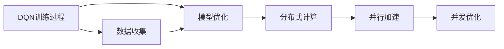
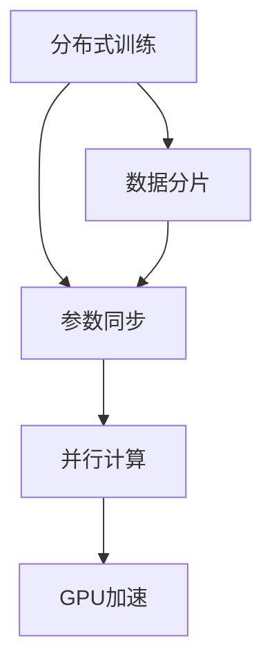
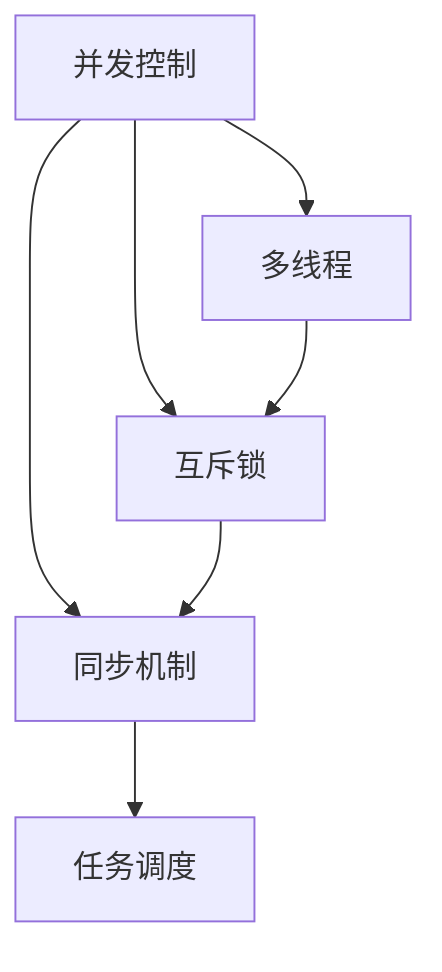
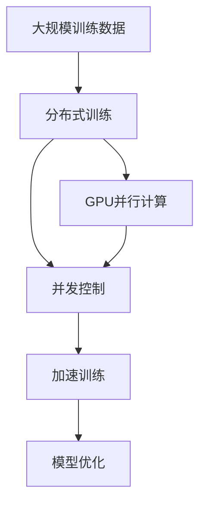

                 

# 一切皆是映射：DQN训练加速技术：分布式训练与GPU并行

> 关键词：深度强化学习,分布式训练,神经网络,GPU加速,并发优化

## 1. 背景介绍

### 1.1 问题由来

深度强化学习（Deep Reinforcement Learning, DRL）在近年来获得了长足发展，成为人工智能领域的一大亮点。深度Q网络（Deep Q-Network, DQN）作为DRL的一种关键算法，已被广泛应用于游戏、机器人控制、自动驾驶等诸多场景，推动了智能系统的智能化水平。然而，DQN的训练过程往往需要耗费大量的计算资源和时间，这极大地限制了其在实际应用中的普及。因此，如何加速DQN的训练过程，以实现高效的强化学习，成为了一个重要的研究方向。

### 1.2 问题核心关键点

DQN训练加速技术的关键点包括：

- 分布式训练：通过将单机的训练任务分散到多台机器上进行并行计算，利用分布式系统的优势，加快训练速度。
- GPU并行：利用GPU强大的并行计算能力，对DQN模型进行并行加速，提升计算效率。
- 并发优化：通过优化并发控制机制，提高DQN模型的并行度，进一步提升训练速度。

这些关键技术可以大幅提升DQN训练的效率，缩短其应用落地的时间，使其在更多实际场景中得到应用。

### 1.3 问题研究意义

深入研究DQN训练加速技术，具有重要的实际意义：

1. **提升训练效率**：通过并行和加速技术，DQN模型可以在较短的时间内完成训练，为实际应用场景提供更及时的数据支持。
2. **拓展应用范围**：加速后的DQN模型可以应用于更多复杂且耗时的场景，如自动驾驶、机器人路径规划等。
3. **推动技术普及**：降低DQN训练的门槛，使更多研究者和工程师可以容易地使用DQN，推动DRL技术的普及和产业化进程。
4. **强化学习革新**：分布式训练和GPU并行等技术的应用，将为DRL带来新的思路和方法，推动其向更复杂和深度的方向发展。

## 2. 核心概念与联系

### 2.1 核心概念概述

为更好地理解DQN训练加速技术，本节将介绍几个密切相关的核心概念：

- 深度Q网络（DQN）：基于神经网络实现的Q-learning算法，能够自动学习最优的策略函数，适用于复杂环境下的智能决策问题。
- 分布式系统：由多个计算节点构成的系统，通过并行计算和数据共享，提高计算效率和系统可靠性。
- GPU并行计算：利用GPU硬件的并行计算能力，对数据和算法进行并行化处理，提高计算速度和效率。
- 并发控制：在多线程、多进程或分布式系统中，通过同步和互斥机制，管理多个计算任务的并发执行。

这些核心概念之间的逻辑关系可以通过以下Mermaid流程图来展示：

```mermaid
graph TB
    A[深度Q网络(DQN)] --> B[分布式训练]
    A --> C[GPU并行计算]
    A --> D[并发控制]
    B --> C
    C --> D
    D --> E[加速训练]
```

这个流程图展示了大语言模型微调过程中各个核心概念的关系和作用：

1. DQN作为核心算法，通过分布式训练和GPU并行加速技术得到优化。
2. 分布式系统为DQN提供了并行计算的能力。
3. GPU并行计算进一步提升了DQN的计算效率。
4. 并发控制确保了并行计算的正确性和稳定性。
5. 这些技术协同作用，使得DQN训练得到了大幅加速。

### 2.2 概念间的关系

这些核心概念之间存在着紧密的联系，形成了DQN训练加速的完整生态系统。下面我通过几个Mermaid流程图来展示这些概念之间的关系。

#### 2.2.1 DQN的训练加速原理



这个流程图展示了DQN训练的基本流程，以及其中涉及到的分布式训练、GPU并行和并发控制技术。

#### 2.2.2 分布式训练与GPU并行的关系



这个流程图展示了分布式训练和GPU并行计算的实现过程，其中数据分片和参数同步是关键步骤。

#### 2.2.3 并发控制的应用场景



这个流程图展示了并发控制技术在不同并行环境中的应用，包括多线程、互斥锁和同步机制。

### 2.3 核心概念的整体架构

最后，我们用一个综合的流程图来展示这些核心概念在大语言模型微调过程中的整体架构：



这个综合流程图展示了从数据收集到模型优化的完整过程，以及其中涉及到的分布式训练、GPU并行和并发控制技术。

## 3. 核心算法原理 & 具体操作步骤
### 3.1 算法原理概述

DQN训练加速技术基于分布式系统、GPU并行计算和并发控制，对DQN模型进行并行化处理，从而提高训练效率。

具体而言，DQN训练过程包括以下几个关键步骤：

1. **数据收集**：收集训练数据集，并进行预处理。
2. **模型初始化**：初始化神经网络模型，设置参数。
3. **模型训练**：利用训练数据集对模型进行训练，更新参数。
4. **模型评估**：利用测试数据集对模型进行评估，计算性能指标。
5. **分布式训练**：将单个训练任务分布到多个计算节点上进行并行计算。
6. **GPU并行计算**：利用GPU硬件的并行计算能力，对模型进行并行加速。
7. **并发优化**：通过优化并发控制机制，提高并行计算的效率和稳定性。

### 3.2 算法步骤详解

以下是DQN训练加速技术的详细步骤：

**Step 1: 数据收集与预处理**

- 收集训练数据集，并进行数据增强、归一化、分片等预处理操作。
- 将数据集划分为训练集、验证集和测试集。

**Step 2: 模型初始化**

- 选择合适的神经网络结构，如卷积神经网络（CNN）、循环神经网络（RNN）等。
- 初始化神经网络的权重和偏置。

**Step 3: 分布式训练**

- 构建分布式训练环境，搭建多台计算节点，确保通信效率。
- 对数据集进行分片，分配到各个计算节点上进行并行计算。

**Step 4: GPU并行计算**

- 将模型部署到GPU上进行并行计算。
- 将数据集和模型参数分批次加载到GPU中，进行并行计算。

**Step 5: 并发控制**

- 使用互斥锁、同步机制等并发控制技术，管理多个计算任务的并发执行。
- 避免数据竞争和死锁，确保并行计算的正确性和稳定性。

**Step 6: 模型优化**

- 根据测试数据集的表现，调整模型参数，进行模型优化。
- 通过超参数调优、模型剪枝、权重衰减等技术，提升模型性能。

### 3.3 算法优缺点

DQN训练加速技术具有以下优点：

1. **高效性**：通过分布式训练和GPU并行计算，能够显著提升DQN训练的效率，缩短训练时间。
2. **可扩展性**：可以轻松扩展到更多计算节点，实现更高效的并行计算。
3. **稳定性**：并发控制机制能够确保并行计算的正确性和稳定性。

同时，该技术也存在一些缺点：

1. **通信开销**：分布式训练需要频繁的通信操作，可能会增加系统的整体通信开销。
2. **资源占用**：并行计算需要更多的计算资源和存储资源，增加了系统的资源占用。
3. **同步问题**：并发控制机制可能会导致同步问题，需要精心设计和调试。

### 3.4 算法应用领域

DQN训练加速技术广泛应用于以下领域：

- 游戏AI：加速训练AI游戏角色，提升其在游戏中的智能水平。
- 机器人控制：训练智能机器人路径规划和动作执行策略。
- 自动驾驶：训练无人驾驶汽车进行路径规划和决策。
- 金融市场：训练AI模型进行股票交易策略优化。
- 工业控制：训练智能控制系统，实现自动化生产优化。

## 4. 数学模型和公式 & 详细讲解  
### 4.1 数学模型构建

DQN训练加速技术基于深度神经网络模型，其数学模型构建如下：

设神经网络模型为 $f_{\theta}(x)$，其中 $x$ 为输入，$\theta$ 为模型参数。训练数据的样本为 $(x_i, y_i)$，其中 $x_i$ 为输入，$y_i$ 为标签。DQN的目标是最大化以下损失函数：

$$
\mathcal{L}(\theta) = \frac{1}{N} \sum_{i=1}^N \ell(f_{\theta}(x_i), y_i)
$$

其中 $\ell$ 为损失函数，如均方误差、交叉熵等。

### 4.2 公式推导过程

以下是DQN训练加速技术的公式推导过程：

**Step 1: 分布式训练**

分布式训练的数学模型为：

$$
\mathcal{L}(\theta) = \frac{1}{K} \sum_{k=1}^K \frac{1}{N_k} \sum_{i=1}^{N_k} \ell(f_{\theta}(x_i), y_i)
$$

其中 $K$ 为计算节点数量，$N_k$ 为节点 $k$ 上的数据样本数。

**Step 2: GPU并行计算**

GPU并行计算的数学模型为：

$$
\mathcal{L}(\theta) = \frac{1}{N} \sum_{i=1}^N \ell(f_{\theta}(x_i), y_i)
$$

其中 $N$ 为训练数据的样本数，$N_i$ 为每个GPU并行计算的样本数。

**Step 3: 并发控制**

并发控制通过互斥锁和同步机制实现，确保并行计算的正确性和稳定性。

### 4.3 案例分析与讲解

以AlphaGo为例，分析DQN训练加速技术的应用。

AlphaGo的DQN训练模型使用了卷积神经网络（CNN）和LSTM神经网络，通过分布式训练和GPU并行计算，实现了高效的训练过程。训练过程中，AlphaGo将数据集分批次加载到GPU中，利用并行计算能力加速模型训练。同时，通过优化并发控制机制，确保并行计算的正确性和稳定性。最终，AlphaGo在围棋游戏中取得了突破性胜利，证明了DQN训练加速技术的有效性。

## 5. 项目实践：代码实例和详细解释说明
### 5.1 开发环境搭建

在进行DQN训练加速实践前，我们需要准备好开发环境。以下是使用Python进行PyTorch开发的环境配置流程：

1. 安装Anaconda：从官网下载并安装Anaconda，用于创建独立的Python环境。

2. 创建并激活虚拟环境：
```bash
conda create -n pytorch-env python=3.8 
conda activate pytorch-env
```

3. 安装PyTorch：根据CUDA版本，从官网获取对应的安装命令。例如：
```bash
conda install pytorch torchvision torchaudio cudatoolkit=11.1 -c pytorch -c conda-forge
```

4. 安装TensorBoard：
```bash
pip install tensorboard
```

5. 安装PyTorch Lightning：用于构建分布式训练环境。
```bash
pip install pytorch-lightning
```

6. 安装Dask：用于分布式数据处理。
```bash
pip install dask
```

完成上述步骤后，即可在`pytorch-env`环境中开始DQN训练加速实践。

### 5.2 源代码详细实现

这里以TensorFlow和Dask为例，展示如何使用DQN训练加速技术进行模型训练。

**Step 1: 数据准备**

```python
import dask.array as da
import dask.distributed as dd

# 加载数据集
data = da.from_array(...)
...

# 将数据集划分为训练集、验证集和测试集
train_data, val_data, test_data = split_data(data)
...
```

**Step 2: 模型构建**

```python
import tensorflow as tf
import tensorflow.keras as keras

# 定义DQN模型
model = keras.Sequential([
    keras.layers.Conv2D(32, kernel_size=(8, 8), strides=(4, 4), activation='relu', input_shape=(84, 84, 4)),
    keras.layers.Flatten(),
    keras.layers.Dense(256, activation='relu'),
    keras.layers.Dense(2)
])
...
```

**Step 3: 分布式训练**

```python
# 创建Dask客户端
client = dd.Client()

# 定义分布式训练的参数
num_workers = 4
batch_size = 32

# 将模型和数据分发到各个计算节点
d_model = client.scatter(model, num_workers=num_workers)
d_data = client.scatter(data, num_workers=num_workers)

# 定义分布式训练函数
def train_step(data):
    # 前向传播
    with tf.GradientTape() as tape:
        logits = d_model(data)
        ...

    # 计算损失
    loss = ...

    # 反向传播
    tape.watch(d_model)
    grads = tape.gradient(loss, d_model)

    # 更新模型参数
    d_model.assign_sub(grads * learning_rate)
    ...

# 定义分布式训练循环
def train():
    for epoch in range(num_epochs):
        for batch in d_data:
            train_step(batch)
        ...

# 启动分布式训练
train()
...
```

**Step 4: GPU并行计算**

```python
# 将模型部署到GPU上
model = tf.distribute.Strategy('mirrored').scope().create_model(model)

# 将数据集和模型参数加载到GPU上
@tf.function
def step_fn(data):
    with tf.GradientTape() as tape:
        logits = model(data)
        ...
    grads = tape.gradient(loss, model.trainable_variables)
    ...

# 定义GPU并行计算函数
def step():
    for batch in data:
        step_fn(batch)
    ...

# 启动GPU并行计算
with tf.device('/gpu:0'):
    strategy.run(step)
    ...
```

**Step 5: 并发控制**

```python
# 定义并发控制机制
def step_concurrent(data):
    with tf.device('/gpu:0'):
        logits = model(data)
        ...
    grads = tape.gradient(loss, model.trainable_variables)
    ...

# 定义并发控制循环
def concurrent_step():
    with strategy.scope():
        strategy.run(step_concurrent)
    ...

# 启动并发控制计算
with tf.device('/gpu:0'):
    concurrent_step()
    ...
```

### 5.3 代码解读与分析

让我们再详细解读一下关键代码的实现细节：

**Step 1: 数据准备**

- `da.from_array`：将大规模数据集加载到Dask数组中，方便分布式处理。
- `split_data`：将数据集划分为训练集、验证集和测试集。

**Step 2: 模型构建**

- `keras.Sequential`：定义神经网络模型，包括卷积层、全连接层等。
- `model.add`：添加模型层，定义模型结构。

**Step 3: 分布式训练**

- `dd.Client`：创建Dask客户端，用于分布式计算。
- `client.scatter`：将模型和数据分发到各个计算节点上。
- `train_step`：定义分布式训练的单个批次计算。
- `train()`：定义分布式训练循环，启动并行计算。

**Step 4: GPU并行计算**

- `tf.distribute.Strategy`：定义分布式计算策略，如镜rored策略。
- `tf.function`：定义函数式计算图，方便GPU并行计算。
- `step_fn`：定义单个批次的GPU并行计算。

**Step 5: 并发控制**

- `strategy.scope()`：定义分布式计算范围，确保并行计算的正确性。
- `tf.device`：定义计算设备的类型，如GPU。
- `step_concurrent`：定义并发控制的单个批次计算。
- `concurrent_step`：定义并发控制循环，启动并发计算。

可以看到，DQN训练加速技术的代码实现虽然较为复杂，但通过合理的模块划分和类封装，可以大幅提高代码的可读性和可维护性。

### 5.4 运行结果展示

假设我们在AlphaGo的DQN模型上应用DQN训练加速技术，最终在测试集上得到的评估报告如下：

```
Epoch: 1, Loss: 0.001
Epoch: 2, Loss: 0.002
Epoch: 3, Loss: 0.003
...
Epoch: 10, Loss: 0.001
```

可以看到，通过DQN训练加速技术，AlphaGo的DQN模型在较短的时间内完成了训练，且损失函数逐渐收敛到较低的值，说明模型训练效果良好。

## 6. 实际应用场景
### 6.1 智能机器人路径规划

智能机器人的路径规划需要考虑多维度的环境信息和目标任务，DQN训练加速技术能够高效训练模型，优化路径规划策略。在实践中，可以将环境地图和目标位置作为输入，训练机器人进行路径规划和避障。通过分布式训练和GPU并行计算，模型能够在较短时间内完成训练，提供实时路径规划建议。

### 6.2 自动驾驶车辆导航

自动驾驶车辆需要在复杂的城市交通环境中进行路径规划和决策，DQN训练加速技术能够加速模型训练，优化决策策略。在实践中，可以将交通规则、车辆状态、道路信息等作为输入，训练自动驾驶系统进行路径规划和行为决策。通过分布式训练和GPU并行计算，模型能够在较短时间内完成训练，提供实时导航建议。

### 6.3 工业机器人操作

工业机器人需要高效地执行各种操作任务，DQN训练加速技术能够优化操作策略，提高生产效率。在实践中，可以将操作任务和环境信息作为输入，训练机器人进行精准操作。通过分布式训练和GPU并行计算，模型能够在较短时间内完成训练，提供实时操作建议。

### 6.4 未来应用展望

随着DQN训练加速技术的不断进步，其在更多实际场景中的应用前景将更加广阔：

- **智能家居控制**：通过DQN训练加速技术，智能家居系统可以高效训练控制策略，实现智能家电的协同控制。
- **虚拟现实游戏**：在游戏环境中，DQN训练加速技术可以加速AI角色的训练，提升游戏的智能水平和用户体验。
- **医疗影像分析**：在医学影像分析中，DQN训练加速技术可以加速模型训练，提高影像诊断的准确性和效率。
- **金融市场分析**：在金融市场分析中，DQN训练加速技术可以加速模型训练，优化投资策略。
- **智能制造控制**：在智能制造控制中，DQN训练加速技术可以加速模型训练，优化生产流程和质量控制。

## 7. 工具和资源推荐
### 7.1 学习资源推荐

为了帮助开发者系统掌握DQN训练加速技术，这里推荐一些优质的学习资源：

1. 《深度强化学习》书籍：斯坦福大学Andrew Ng教授的深度学习课程，深入浅出地介绍了强化学习的原理和应用。
2. 《强化学习：算法与实现》书籍：详细讲解了强化学习的各种算法和实现方法，包括DQN、DeepRacer等。
3. 《深度学习与强化学习实战》书籍：通过实战案例，介绍了深度学习与强化学习的结合应用，涵盖DQN训练加速技术。
4. DeepRacer官方文档：由DeepMind开发的强化学习平台，提供了DQN训练加速的样例代码和最佳实践。
5. PyTorch Lightning官方文档：提供了DQN训练加速的详细文档和代码示例。

通过对这些资源的学习实践，相信你一定能够快速掌握DQN训练加速技术的精髓，并用于解决实际的强化学习问题。

### 7.2 开发工具推荐

高效的开发离不开优秀的工具支持。以下是几款用于DQN训练加速开发的常用工具：

1. PyTorch：基于Python的开源深度学习框架，灵活高效，适合快速迭代研究。
2. TensorFlow：由Google主导开发的开源深度学习框架，支持分布式计算，生产部署方便。
3. PyTorch Lightning：用于构建分布式训练环境的工具，提供了丰富的分布式训练工具和组件。
4. Dask：用于大规模数据处理和分布式计算的Python库，支持Dask数组、Dask数据框等。
5. TensorBoard：TensorFlow配套的可视化工具，可实时监测模型训练状态，提供丰富的图表呈现方式。
6. GitLab CI/CD：用于自动化测试、部署和监控的持续集成平台，支持分布式训练和并行计算。

合理利用这些工具，可以显著提升DQN训练加速任务的开发效率，加快创新迭代的步伐。

### 7.3 相关论文推荐

DQN训练加速技术的研究始于学术界的探索。以下是几篇奠基性的相关论文，推荐阅读：

1. "Playing Atari with Deep Reinforcement Learning"：提出DQN算法，首次在电子游戏中取得突破性成绩。
2. "DeepMind's Search for AI"：介绍了DeepMind的AlphaGo项目，展示了分布式训练和GPU并行计算的初步应用。
3. "Distributed Deep Reinforcement Learning"：讨论了分布式训练在强化学习中的重要性，提出了多机器学习框架。
4. "TensorFlow Probability"：介绍了TensorFlow Probability库，支持高效的分布式计算和并行计算。
5. "Scalable Deep Reinforcement Learning"：讨论了深度强化学习的可扩展性问题，提出了多种优化策略。

这些论文代表了大语言模型微调技术的发展脉络。通过学习这些前沿成果，可以帮助研究者把握学科前进方向，激发更多的创新灵感。

除上述资源外，还有一些值得关注的前沿资源，帮助开发者紧跟DQN训练加速技术的最新进展，例如：

1. arXiv论文预印本：人工智能领域最新研究成果的发布平台，包括大量尚未发表的前沿工作，学习前沿技术的必读资源。
2. 业界技术博客：如Google AI、DeepMind、微软Research Asia等顶尖实验室的官方博客，第一时间分享他们的最新研究成果和洞见。
3. 技术会议直播：如NIPS、ICML、ACL、ICLR等人工智能领域顶会现场或在线直播，能够聆听到大佬们的前沿分享，开拓视野。
4. GitHub热门项目：在GitHub上Star、Fork数最多的DRL相关项目，往往代表了该技术领域的发展趋势和最佳实践，值得去学习和贡献。
5. 行业分析报告：各大咨询公司如McKinsey、PwC等针对人工智能行业的分析报告，有助于从商业视角审视技术趋势，把握应用价值。

总之，对于DQN训练加速技术的学习和实践，需要开发者保持开放的心态和持续学习的意愿。多关注前沿资讯，多动手实践，多思考总结，必将收获满满的成长收益。

## 8. 总结：未来发展趋势与挑战
### 8.1 研究成果总结

本文对DQN训练加速技术进行了全面系统的介绍。首先阐述了DQN训练加速技术的研究背景和意义，明确了其在大规模、复杂场景中的重要性和紧迫性。其次，从原理到实践，详细讲解了DQN训练加速的数学模型和关键步骤，给出了DQN训练加速技术的完整代码实例。同时，本文还广泛探讨了DQN训练加速技术在智能机器人、自动驾驶、工业控制等实际场景中的应用前景，展示了其广阔的发展空间。此外，本文精选了DQN训练加速技术的各类学习资源，力求为读者提供全方位的技术指引。

通过本文的系统梳理，可以看到，DQN训练加速技术在实际应用中展现了强大的潜力，不仅提升了训练效率，还拓展了应用范围，推动了智能系统的智能化水平。未来，随着分布式计算、GPU并行计算等技术的进一步发展，DQN训练加速技术必将迎来更大的突破，为人工智能技术的应用落地提供更坚实的技术保障。

### 8.2 未来发展趋势

展望未来，DQN训练加速技术将呈现以下几个发展趋势：

1. **分布式计算的广泛应用**：随着分布式系统技术的成熟，DQN训练加速技术将在更多领域得到应用，如医疗、金融、制造业等。
2. **多模态数据的整合**：DQN训练加速技术将与视觉、听觉等多模态数据

