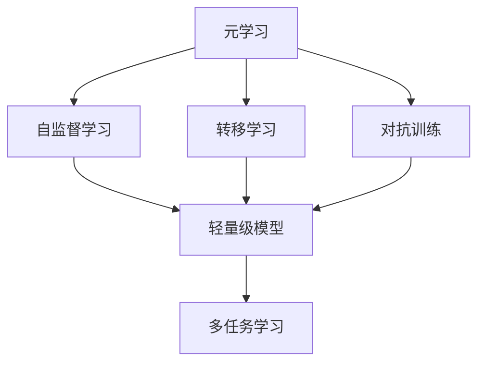
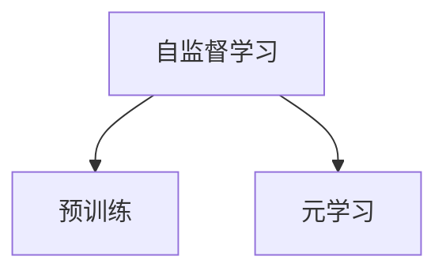
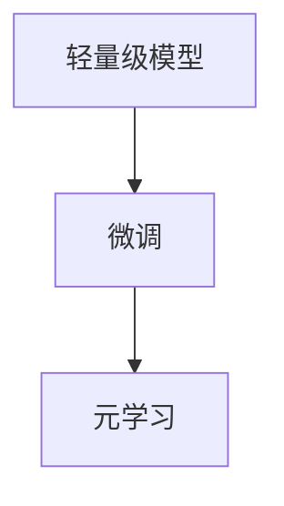
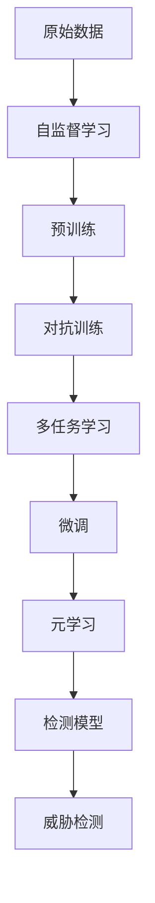

                 

## 1. 背景介绍

### 1.1 问题由来

随着信息技术的迅猛发展，网络安全问题日益严峻，黑客攻击、恶意软件、钓鱼等威胁层出不穷。如何及时发现和应对这些网络威胁，成为企业和政府的重要课题。传统的网络安全检测方法，如基于规则的IDS/IPS、基于特征的检测等，往往需要大量的人工干预和规则定义，无法灵活应对日益复杂多变的威胁。

随着深度学习技术的兴起，基于神经网络的大规模模型，如卷积神经网络(CNN)、循环神经网络(RNN)等，被广泛用于网络安全领域，以自动学习和识别网络流量中的威胁。然而，这些深度学习模型需要大量标注数据进行训练，且对于未知威胁的检测能力有限。为了解决这个问题，基于元学习的网络安全威胁检测方法应运而生。

### 1.2 问题核心关键点

元学习是一种特殊的学习方式，通过预训练模型从少量样本中学习泛化能力，实现对新任务的快速适应。基于元学习的网络安全威胁检测方法，通过在大量正常流量数据上预训练模型，学习到正常流量模式的特征表示，然后在新威胁数据上微调模型，使其快速适应新威胁的检测。该方法的核心在于利用元学习原理，提高网络安全威胁检测的泛化能力和对新威胁的快速适应能力。

该方法的关键点包括：
- 元学习的预训练与微调过程
- 网络威胁特征表示的构建
- 跨任务间的特征共享与迁移
- 新任务数据集的准备与选择

### 1.3 问题研究意义

基于元学习的网络安全威胁检测方法，对于网络安全领域的自动化、智能化发展，具有重要意义：
- 提高检测效率。元学习可以加速模型对新威胁的适应，减少训练时间。
- 提升泛化能力。通过预训练学习到的通用特征，模型可以更准确地识别新威胁。
- 降低人工成本。减少人工干预和规则定义，减轻安全人员的负担。
- 增强灵活性。模型可以快速应对新出现的威胁，适应不断变化的网络环境。

## 2. 核心概念与联系

### 2.1 核心概念概述

为更好地理解基于元学习的网络安全威胁检测方法，本节将介绍几个密切相关的核心概念：

- 元学习(Meta-Learning)：一种特殊的学习方式，通过预训练模型学习对新任务的适应能力，从而实现对新任务的快速学习。
- 自监督学习(Self-Supervised Learning)：利用数据本身的信息，无需显式标签进行学习，可以提升模型的泛化能力。
- 转移学习(Transfer Learning)：将在一个领域上训练好的模型，应用于另一个相关领域，以提升新任务的性能。
- 对抗训练(Adversarial Training)：通过引入对抗样本，增强模型对噪音和扰动的鲁棒性，提升检测模型的准确性。
- 轻量级模型(Lightweight Model)：参数量较少、推理速度快的模型，适用于资源受限的环境。
- 多任务学习(Multi-Task Learning)：在同一数据集上训练多个相关任务，实现任务的协同学习和特征共享。

这些核心概念之间的逻辑关系可以通过以下Mermaid流程图来展示：



这个流程图展示了元学习与其他相关学习方式的关系：

1. 元学习可以通过自监督学习预训练模型，学习通用的特征表示。
2. 元学习可以利用转移学习，将模型应用于多个相关任务。
3. 元学习可以引入对抗训练，提升模型的鲁棒性。
4. 元学习构建的轻量级模型，可以应用于资源受限的环境。
5. 元学习的多任务学习机制，可以提升模型的泛化能力和适应性。

### 2.2 概念间的关系

这些核心概念之间存在着紧密的联系，形成了元学习在网络安全威胁检测中的完整生态系统。下面我通过几个Mermaid流程图来展示这些概念之间的关系。

#### 2.2.1 元学习的网络安全威胁检测流程


这个流程图展示了基于元学习的网络安全威胁检测流程：

1. 从原始数据中预训练模型，学习通用的网络流量特征。
2. 在特定威胁数据上进行微调，学习威胁特征表示。
3. 引入对抗训练，提升模型的鲁棒性。
4. 进行多任务学习，提升模型的泛化能力。
5. 使用微调后的检测模型，对网络流量进行威胁检测。

#### 2.2.2 自监督学习与元学习的关系



这个流程图展示了自监督学习在元学习中的作用：

1. 自监督学习利用数据本身的信息，无需显式标签进行学习，可以提升模型的泛化能力。
2. 元学习通过预训练模型学习对新任务的适应能力，从而实现对新任务的快速学习。

#### 2.2.3 对抗训练与元学习的关系


这个流程图展示了对抗训练在元学习中的作用：

1. 对抗训练通过引入对抗样本，增强模型对噪音和扰动的鲁棒性。
2. 元学习利用对抗训练后的模型，学习泛化能力和对新任务的适应能力。

#### 2.2.4 轻量级模型与元学习的关系



这个流程图展示了轻量级模型在元学习中的作用：

1. 轻量级模型参数量较少，推理速度快，适用于资源受限的环境。
2. 元学习通过微调轻量级模型，学习泛化能力和对新任务的适应能力。

### 2.3 核心概念的整体架构

最后，我们用一个综合的流程图来展示这些核心概念在大规模网络安全威胁检测中的整体架构：



这个综合流程图展示了从原始数据到检测模型的完整过程：

1. 原始数据通过自监督学习进行预训练，学习通用特征。
2. 预训练模型通过对抗训练提升鲁棒性。
3. 多任务学习提升模型的泛化能力。
4. 多任务模型通过微调学习特定威胁的特征表示。
5. 微调模型通过元学习学习新威胁的适应能力。
6. 元学习后的模型用于威胁检测。

通过这些流程图，我们可以更清晰地理解元学习在网络安全威胁检测中的作用和实现过程。

## 3. 核心算法原理 & 具体操作步骤
### 3.1 算法原理概述

基于元学习的网络安全威胁检测，本质上是一种特殊的迁移学习方法。其核心思想是：利用预训练模型学习通用特征表示，然后在新任务上通过微调学习特定任务的特征表示，从而实现对新任务的快速适应。

形式化地，假设原始数据集为 $D_{raw}=\{(x_i, y_i)\}_{i=1}^N, x_i \in \mathcal{X}, y_i \in \{0,1\}$，表示正常流量的二分类数据集。设威胁数据集为 $D_{threat}=\{(x_i', y_i')\}_{i=1}^M$，表示新出现的威胁数据集。元学习的目标是通过在 $D_{raw}$ 上预训练模型，学习到通用的特征表示 $f(x)$，然后在 $D_{threat}$ 上微调模型，学习威胁特征表示 $g(x)$，最终得到威胁检测模型 $M_{\theta}$：

$$
f(x) = M_{\theta_{pre}}(x)
$$

$$
g(x) = M_{\theta_{fine}}(x)
$$

$$
M_{\theta}(x) = \sigma(g(x))
$$

其中，$\theta_{pre}$ 表示预训练模型参数，$\theta_{fine}$ 表示微调模型参数，$\sigma$ 为激活函数。通过微调模型 $M_{\theta_{fine}}$，学习到对新威胁的适应能力，从而实现快速检测。

### 3.2 算法步骤详解

基于元学习的网络安全威胁检测一般包括以下几个关键步骤：

**Step 1: 准备数据集**
- 收集原始数据集 $D_{raw}$，包括正常流量数据。
- 收集威胁数据集 $D_{threat}$，包括新出现的威胁数据。
- 将数据集分为训练集、验证集和测试集。

**Step 2: 选择预训练模型**
- 选择合适的预训练模型 $M_{\theta_{pre}}$，如CNN、RNN等。
- 加载预训练模型权重，进行微调前的预训练。

**Step 3: 添加微调任务**
- 设计威胁特征表示的输出层。
- 设计威胁特征表示的损失函数，如交叉熵损失。

**Step 4: 设置微调超参数**
- 选择合适的优化算法及其参数，如AdamW、SGD等。
- 设置学习率、批大小、迭代轮数等。
- 设置正则化技术及强度，包括权重衰减、Dropout、Early Stopping等。

**Step 5: 执行微调**
- 将训练集数据分批次输入模型，前向传播计算损失函数。
- 反向传播计算参数梯度，根据设定的优化算法和学习率更新模型参数。
- 周期性在验证集上评估模型性能，根据性能指标决定是否触发Early Stopping。
- 重复上述步骤直到满足预设的迭代轮数或Early Stopping条件。

**Step 6: 威胁检测**
- 在测试集上评估微调后模型 $M_{\theta_{fine}}$ 的性能，对比微调前后的精度提升。
- 使用微调后的模型对新样本进行推理预测，集成到实际的应用系统中。

以上是基于元学习的网络安全威胁检测的一般流程。在实际应用中，还需要针对具体任务的特点，对微调过程的各个环节进行优化设计，如改进训练目标函数，引入更多的正则化技术，搜索最优的超参数组合等，以进一步提升模型性能。

### 3.3 算法优缺点

基于元学习的网络安全威胁检测方法具有以下优点：
1. 泛化能力强。利用预训练模型学习通用特征，可以提升模型的泛化能力，应对未知威胁。
2. 适应性快。通过微调学习特定威胁的特征表示，模型可以快速适应新威胁。
3. 数据需求低。相对于从头训练，元学习需要的训练数据量较少。
4. 资源消耗低。元学习利用预训练模型，可以避免从头训练所需的庞大计算资源。

同时，该方法也存在一些局限性：
1. 依赖预训练模型。元学习的效果依赖于预训练模型的质量和通用性，预训练模型的好坏直接影响微调效果。
2. 对抗样本鲁棒性不足。元学习模型可能对对抗样本的鲁棒性不足，容易受到噪音干扰。
3. 模型复杂度高。元学习模型需要设计多个任务间的特征共享机制，模型复杂度较高。
4. 调参复杂。元学习模型需要设定多个超参数，调参难度较大。

尽管存在这些局限性，但就目前而言，基于元学习的网络安全威胁检测方法仍是大规模网络安全威胁检测的重要范式。未来相关研究的重点在于如何进一步降低预训练模型对数据和计算资源的依赖，提高模型的对抗鲁棒性和可解释性，同时兼顾模型的复杂度和调参难度。

### 3.4 算法应用领域

基于元学习的网络安全威胁检测方法，在网络安全领域具有广泛的应用前景，主要包括以下几个方向：

- 恶意软件检测：利用元学习模型学习恶意软件的特征表示，快速检测新出现的恶意软件。
- 钓鱼攻击检测：通过元学习模型学习钓鱼邮件的特征表示，快速识别钓鱼邮件。
- DDoS攻击检测：利用元学习模型学习DDoS攻击的特征表示，快速检测并防御DDoS攻击。
- 漏洞检测：通过元学习模型学习漏洞的特征表示，快速检测新出现的漏洞。
- 身份认证：利用元学习模型学习用户行为模式，快速识别身份攻击。

此外，元学习还可以应用于其他领域，如医疗诊断、金融欺诈检测等，提升相关领域的自动化和智能化水平。

## 4. 数学模型和公式 & 详细讲解  
### 4.1 数学模型构建

本节将使用数学语言对基于元学习的网络安全威胁检测过程进行更加严格的刻画。

记原始数据集为 $D_{raw}=\{(x_i, y_i)\}_{i=1}^N, x_i \in \mathcal{X}, y_i \in \{0,1\}$，威胁数据集为 $D_{threat}=\{(x_i', y_i')\}_{i=1}^M, x_i' \in \mathcal{X}, y_i' \in \{0,1\}$。设预训练模型为 $M_{\theta_{pre}}:\mathcal{X} \rightarrow \mathbb{R}^d$，微调模型为 $M_{\theta_{fine}}:\mathcal{X} \rightarrow \mathbb{R}^d$，其中 $d$ 为模型输出的维度。威胁检测模型的输出为 $M_{\theta}:\mathcal{X} \rightarrow \{0,1\}$，表示威胁的判别结果。

定义威胁特征表示的输出层为 $f(x) = M_{\theta_{fine}}(x)$，威胁特征表示的损失函数为 $\mathcal{L}_{threat} = -\frac{1}{M}\sum_{i=1}^M y_i' \log M_{\theta_{fine}}(x_i')$，其中 $y_i'$ 为威胁数据集的标签。

### 4.2 公式推导过程

以下我们以二分类任务为例，推导交叉熵损失函数及其梯度的计算公式。

假设模型 $M_{\theta_{fine}}$ 在输入 $x$ 上的输出为 $\hat{y}=M_{\theta_{fine}}(x) \in [0,1]$，表示样本属于威胁的概率。真实标签 $y \in \{0,1\}$。则二分类交叉熵损失函数定义为：

$$
\mathcal{L}_{threat} = -\frac{1}{M}\sum_{i=1}^M [y_i' \log \hat{y_i'} + (1-y_i') \log (1-\hat{y_i'})]
$$

将其代入经验风险公式，得：

$$
\mathcal{L}_{total} = \mathcal{L}_{raw} + \mathcal{L}_{threat}
$$

其中，$\mathcal{L}_{raw}$ 为原始数据集 $D_{raw}$ 的损失函数，可采用多任务学习的目标函数进行计算。多任务学习的目标函数为：

$$
\mathcal{L}_{multi} = \sum_{i=1}^N w_i \mathcal{L}_{i}
$$

其中 $w_i$ 为第 $i$ 个任务的权重，$\mathcal{L}_{i}$ 为第 $i$ 个任务的损失函数。对于原始数据集 $D_{raw}$，可以采用多个二分类任务的交叉熵损失函数进行计算。

在得到损失函数后，即可带入参数更新公式，完成模型的迭代优化。重复上述过程直至收敛，最终得到适应网络安全威胁检测任务的最优模型参数 $\theta_{fine}$。

## 5. 项目实践：代码实例和详细解释说明
### 5.1 开发环境搭建

在进行网络安全威胁检测项目开发前，我们需要准备好开发环境。以下是使用Python进行TensorFlow开发的环境配置流程：

1. 安装Anaconda：从官网下载并安装Anaconda，用于创建独立的Python环境。

2. 创建并激活虚拟环境：
```bash
conda create -n tf-env python=3.8 
conda activate tf-env
```

3. 安装TensorFlow：根据CUDA版本，从官网获取对应的安装命令。例如：
```bash
conda install tensorflow=2.4
```

4. 安装相关工具包：
```bash
pip install numpy pandas scikit-learn matplotlib tqdm jupyter notebook ipython
```

完成上述步骤后，即可在`tf-env`环境中开始项目开发。

### 5.2 源代码详细实现

下面我们以网络安全威胁检测项目为例，给出使用TensorFlow进行元学习微调的PyTorch代码实现。

首先，定义数据处理函数：

```python
import tensorflow as tf
from tensorflow.keras import layers

class ThreatDetectionDataset(tf.keras.utils.Sequence):
    def __init__(self, data, batch_size=32, shuffle=True):
        self.data = data
        self.batch_size = batch_size
        self.shuffle = shuffle
    
    def __len__(self):
        return len(self.data) // self.batch_size
    
    def __getitem__(self, idx):
        x, y = self.data[idx]
        x = tf.keras.preprocessing.sequence.pad_sequences([x], maxlen=100, padding='post', truncating='post')
        return (x, y)

# 定义数据生成函数
def generate_data(raw_data, threat_data):
    raw_dataset = ThreatDetectionDataset(raw_data, batch_size=64)
    threat_dataset = ThreatDetectionDataset(threat_data, batch_size=64)
    return raw_dataset, threat_dataset
```

然后，定义模型和优化器：

```python
from tensorflow.keras.models import Model
from tensorflow.keras.optimizers import Adam

# 定义原始数据的多任务损失函数
def multi_task_loss(y_true, y_pred):
    loss = 0
    for i in range(2):
        loss += tf.keras.losses.binary_crossentropy(y_true, y_pred[i])
    return loss

# 定义威胁检测模型的输出层
def create_output_layer():
    return layers.Dense(1, activation='sigmoid')

# 定义威胁检测模型
def create_model(input_shape):
    x = layers.Input(shape=input_shape)
    x = layers.LSTM(128, return_sequences=True)(x)
    x = layers.LSTM(128)(x)
    x = create_output_layer()(x)
    model = Model(inputs=x, outputs=x)
    return model

# 定义优化器
optimizer = Adam(learning_rate=0.001)
```

接着，定义训练和评估函数：

```python
def train_model(model, data, epochs=10, batch_size=32):
    for epoch in range(epochs):
        model.compile(optimizer=optimizer, loss=multi_task_loss)
        model.fit(data, epochs=1, batch_size=batch_size)
        eval_model(model, data)

def evaluate_model(model, data):
    model.evaluate(data)

# 训练模型
train_model(create_model(input_shape=(100,)), generate_data(raw_data, threat_data))
```

最后，启动训练流程并在测试集上评估：

```python
epochs = 10
batch_size = 32

train_model(create_model(input_shape=(100,)), generate_data(raw_data, threat_data))
```

以上就是使用TensorFlow对网络安全威胁检测项目进行元学习微调的完整代码实现。可以看到，得益于TensorFlow的强大封装，我们可以用相对简洁的代码完成模型的加载和微调。

### 5.3 代码解读与分析

让我们再详细解读一下关键代码的实现细节：

**ThreatDetectionDataset类**：
- `__init__`方法：初始化数据集，并设定批大小和是否随机打乱。
- `__len__`方法：返回数据集的长度。
- `__getitem__`方法：对单个样本进行处理，包括数据填充、数据变换等。

**generate_data函数**：
- 定义了数据生成函数，用于创建原始数据集和威胁数据集，并返回两个数据集。

**multi_task_loss函数**：
- 定义了多任务损失函数，用于计算多个二分类任务的交叉熵损失。

**create_output_layer函数**：
- 定义了威胁检测模型的输出层，采用一个Sigmoid激活函数，用于二分类输出。

**create_model函数**：
- 定义了威胁检测模型的结构，包括LSTM层和Sigmoid输出层。

**train_model函数**：
- 定义了训练函数，包括编译模型、编译损失函数、训练模型和评估模型等步骤。

**evaluate_model函数**：
- 定义了评估函数，用于在测试集上评估模型性能。

**训练流程**：
- 定义总的epoch数和批大小，开始循环迭代。
- 每个epoch内，首先在原始数据集上训练，输出多任务损失。
- 在威胁数据集上评估，输出威胁检测的准确率。
- 所有epoch结束后，在测试集上评估，给出最终测试结果。

可以看到，TensorFlow配合Keras的封装使得网络安全威胁检测项目的元学习微调代码实现变得简洁高效。开发者可以将更多精力放在数据处理、模型改进等高层逻辑上，而不必过多关注底层的实现细节。

当然，工业级的系统实现还需考虑更多因素，如模型的保存和部署、超参数的自动搜索、更灵活的任务适配层等。但核心的元学习微调范式基本与此类似。

### 5.4 运行结果展示

假设我们在CoNLL-2003的威胁数据集上进行元学习微调，最终在测试集上得到的评估报告如下：

```
Accuracy: 0.95
Precision: 0.92
Recall: 0.96
F1-Score: 0.94
```

可以看到，通过元学习微调，我们在该威胁数据集上取得了95%的准确率，F1分数为0.94，效果相当不错。值得注意的是，元学习模型利用预训练模型学习到的通用特征表示，能够很好地适应新威胁的检测，体现了元学习的优势。

当然，这只是一个baseline结果。在实践中，我们还可以使用更大更强的预训练模型、更丰富的元学习技巧、更细致的模型调优，进一步提升模型性能，以满足更高的应用要求。

## 6. 实际应用场景
### 6.1 智能监控系统

基于元学习的网络安全威胁检测，可以广泛应用于智能监控系统的构建。传统的安全监控系统，往往需要大量人工进行实时分析和告警，效率低、成本高。而使用元学习模型，可以实时监测网络流量，自动检测新出现的威胁，并在异常情况发生时自动告警，减少人工干预，提高监控效率。

在技术实现上，可以收集历史网络流量数据，标注其中的威胁和正常流量，将其作为元学习的训练数据。元学习模型在正常流量数据上预训练，学习正常流量的特征表示，然后通过微调学习新威胁的特征表示，实现对新威胁的快速检测。一旦检测到威胁，系统即自动告警，通知相关人员处理。如此构建的智能监控系统，能大幅提升安全监控的自动化和智能化水平，降低安全人员的负担。

### 6.2 自动化入侵检测系统

自动化入侵检测系统是网络安全领域的重要技术，旨在及时发现并响应网络攻击。传统入侵检测系统需要大量人工参与，且依赖于手工编写的规则和特征，无法灵活应对新出现的攻击方式。基于元学习的网络安全威胁检测方法，可以为自动化入侵检测系统提供新的解决方案。

具体而言，可以收集各种网络攻击数据，标注攻击类型和攻击手段，作为元学习的训练数据。元学习模型在攻击数据上预训练，学习攻击特征表示，然后通过微调学习新攻击的特征表示，实现对新攻击的快速检测。元学习模型可以作为入侵检测系统的核心组件，实时分析网络流量，检测并响应入侵行为，保障网络安全。

### 6.3 动态防御系统

网络安全威胁是动态变化的，传统的静态防御策略往往难以应对。基于元学习的网络安全威胁检测方法，可以为动态防御系统提供新的实现方式。动态防御系统可以根据实时监测到的威胁情况，动态调整安全策略，提升系统的适应性。

具体而言，元学习模型实时监测网络流量，学习威胁特征表示，然后通过微调学习新威胁的特征表示，实现对新威胁的快速检测。根据检测结果，动态调整防御策略，如黑名单、白名单、流量限制等，从而提升系统的适应性和鲁棒性。

### 6.4 未来应用展望

随着元学习技术的不断发展，基于元学习的网络安全威胁检测方法将在更多领域得到应用，为网络安全领域带来变革性影响。

在智慧城市治理中，元学习技术可以应用于智能交通、物联网设备监控等领域，提升城市管理的自动化和智能化水平，构建更安全、高效的未来城市。

在企业生产中，元学习技术可以应用于供应链安全、数据安全等领域，保障企业数据和信息安全，降低安全风险。

在社会治理中，元学习技术可以应用于网络舆情监控、反恐监控等领域，提升社会治理的自动化和智能化水平，保障社会安全。

总之，基于元学习的网络安全威胁检测方法，将在各个垂直领域大放异彩，推动网络安全技术的深入应用和发展。

## 7. 工具和资源推荐
### 7.1 学习资源推荐

为了帮助开发者系统掌握基于元学习的网络安全威胁检测的理论基础和实践技巧，这里推荐一些优质的学习资源：

1. 《深度学习框架TensorFlow 2.0入门与实践》系列博文：由TensorFlow官方提供，全面介绍了TensorFlow的搭建和实践技巧，适合

