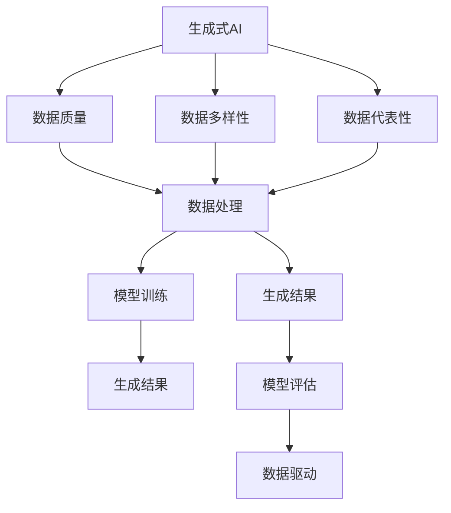
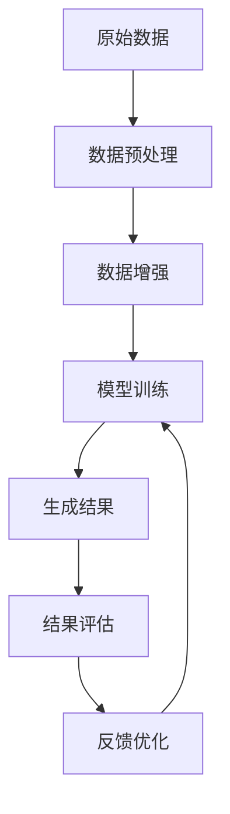
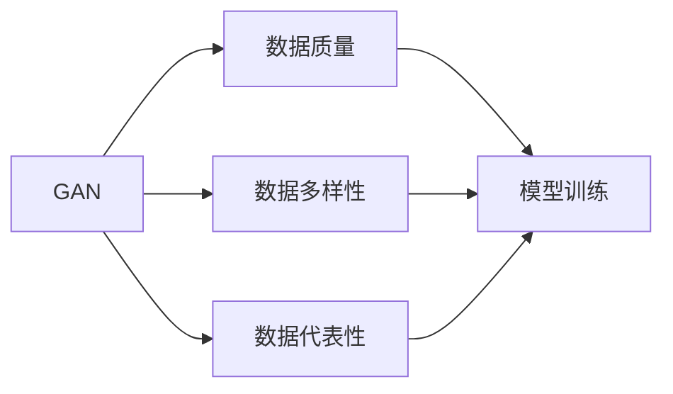
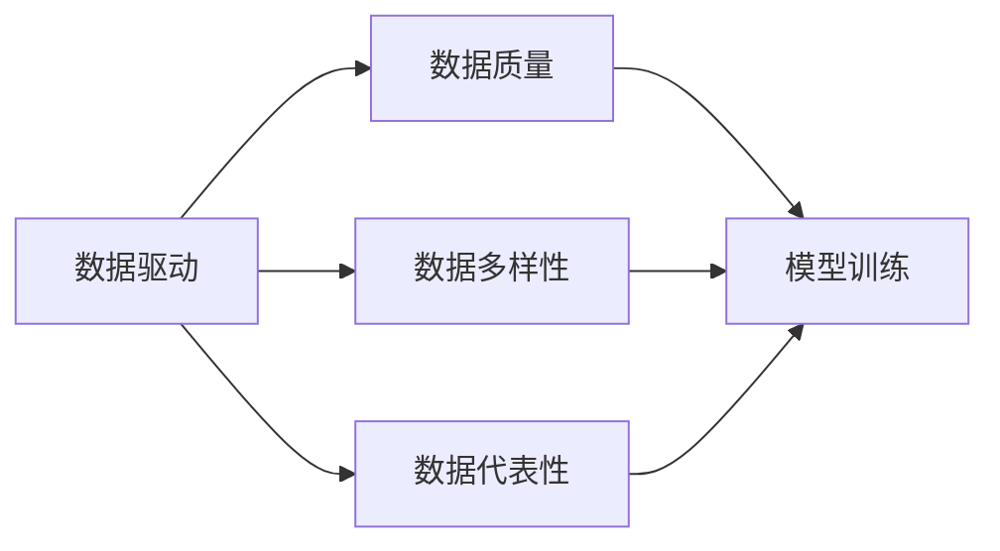
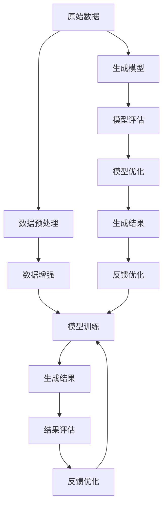

                 

# 生成式AI：金矿还是泡沫？第三部分：更重要的是数据

## 1. 背景介绍

### 1.1 问题由来
在过去几年中，生成式AI（Generative AI）技术迅速崛起，成为AI领域的热门话题。从图像生成、音乐创作到文本生成，生成式AI正在逐渐渗透到各个行业。然而，尽管生成式AI带来了令人瞩目的创新，其本质上的“虚拟性”和“伪实性”也引发了广泛讨论：这些模型到底是一片“金矿”，还是一块“泡沫”？本文旨在深入探讨这一话题，并特别聚焦于数据在生成式AI中的作用。

### 1.2 问题核心关键点
数据在生成式AI中的作用，一直是一个备受争议的议题。一方面，高质量的数据是生成式模型性能提升的关键，但另一方面，数据的获取和处理也常常面临巨大的挑战。数据的质量、数量、多样性和代表性，都直接影响到模型的生成效果。因此，本文将重点探讨数据在生成式AI中的重要性，分析不同类型数据的影响，并提出数据驱动生成式AI的实践建议。

### 1.3 问题研究意义
理解数据在生成式AI中的作用，对于评估和优化模型性能、推动技术进步、指导实际应用具有重要意义：
1. **评估模型性能**：高质量的数据可以显著提升模型的生成效果，帮助评估模型性能是否达到预期。
2. **优化模型训练**：通过数据分析和处理，优化数据集的结构，帮助模型更好地学习数据特征。
3. **指导模型选择**：不同类型的数据适合不同生成模型，选择合适的数据类型可以提升模型效果。
4. **推动技术进步**：数据的高质量处理和利用，推动生成式AI技术的发展和进步。
5. **指导实际应用**：高质量的数据和处理技术，指导生成式AI在实际应用场景中的应用，提升应用效果。

## 2. 核心概念与联系

### 2.1 核心概念概述

为更好地理解生成式AI中数据的重要性，本节将介绍几个密切相关的核心概念：

- **生成式AI（Generative AI）**：通过模型训练，学习数据的概率分布，进而生成新的数据样本的技术。常用的生成式模型包括GANs、VAEs、Transformer等。
- **数据质量（Data Quality）**：数据质量指数据的准确性、完整性、一致性和可用性。高质量的数据能够提供更为准确的生成结果。
- **数据多样性（Data Diversity）**：数据多样性指数据覆盖的范围和多样性程度。多样化的数据有助于模型学习不同的生成模式。
- **数据代表性（Data Representativeness）**：数据代表性指数据样本是否能够代表真实世界中的数据分布。代表性的数据有助于模型泛化到新数据。
- **数据处理（Data Processing）**：数据处理指对原始数据进行清洗、标注、转换等操作，使其符合模型训练和生成的需求。
- **数据驱动（Data-Driven）**：数据驱动指模型训练和生成过程完全依赖于数据，通过数据的分析和利用，提升模型的性能。

这些核心概念之间的逻辑关系可以通过以下Mermaid流程图来展示：



这个流程图展示了生成式AI的各个环节，以及数据在其中扮演的重要角色。

### 2.2 概念间的关系

这些核心概念之间存在着紧密的联系，形成了生成式AI的完整生态系统。下面我们通过几个Mermaid流程图来展示这些概念之间的关系。

#### 2.2.1 生成式AI的训练流程



这个流程图展示了生成式AI模型的训练流程，从数据预处理、增强到模型训练、评估和优化，每一步都依赖于数据的质量和多样性。

#### 2.2.2 数据与生成模型之间的关系



这个流程图展示了不同类型的数据如何影响GAN等生成模型的训练和生成效果。

#### 2.2.3 数据驱动与生成式AI的关系



这个流程图展示了数据驱动在生成式AI中的重要性，数据的质量、多样性和代表性直接影响模型的训练和生成效果。

### 2.3 核心概念的整体架构

最后，我们用一个综合的流程图来展示这些核心概念在大语言模型微调过程中的整体架构：



这个综合流程图展示了从数据预处理到生成模型训练、生成、评估和优化的完整流程，突出了数据在生成式AI中的核心作用。

## 3. 核心算法原理 & 具体操作步骤
### 3.1 算法原理概述

生成式AI的核心原理是通过学习数据的概率分布，生成新的数据样本。常用的生成模型包括变分自编码器（VAE）、生成对抗网络（GANs）、变分生成网络（VAEs）和Transformer等。这些模型通过生成概率分布的训练，学习到数据的生成过程，从而生成新的数据样本。

生成式AI模型的训练过程通常分为两个阶段：
1. **数据生成阶段**：模型学习数据的概率分布，生成新的数据样本。
2. **模型优化阶段**：通过评估生成的数据与真实数据的相似度，优化模型参数，提高生成质量。

生成式AI的数据驱动性质，使其依赖于高质量、多样性和代表性的数据。高质量的数据能够提供更为准确的生成结果，多样化的数据有助于模型学习不同的生成模式，代表性的数据有助于模型泛化到新数据。

### 3.2 算法步骤详解

生成式AI的训练过程包括以下几个关键步骤：

**Step 1: 数据准备**
- 收集高质量、多样性和代表性的数据集，包括图像、文本、音频等多种类型。
- 对数据进行预处理，如去噪、归一化、标准化等。

**Step 2: 数据增强**
- 通过数据增强技术，如随机裁剪、旋转、翻转等，扩充训练数据集，提高数据的多样性。
- 对于文本数据，可以采用数据变换、回译等方法增强数据多样性。

**Step 3: 模型训练**
- 选择合适的生成模型，如GANs、VAEs等。
- 使用优化算法，如Adam、SGD等，训练生成模型，学习数据的概率分布。
- 在训练过程中，通过生成样本与真实样本的对比，优化模型参数。

**Step 4: 生成与评估**
- 使用训练好的生成模型，生成新的数据样本。
- 对生成的数据进行评估，如使用KL散度、FID等指标衡量生成数据与真实数据的相似度。
- 根据评估结果，反馈优化模型参数，提升生成质量。

**Step 5: 优化与部署**
- 根据评估结果，优化生成模型，调整超参数，提升生成质量。
- 将优化后的模型部署到实际应用场景中，生成新数据。
- 持续收集新数据，持续训练和优化模型，保持模型性能。

### 3.3 算法优缺点

生成式AI具有以下优点：
1. **高效生成**：能够快速生成大量高质量的数据样本，节省时间和成本。
2. **多样性生成**：通过数据增强，生成多种风格、模式的数据样本。
3. **灵活应用**：适用于多种生成任务，如图像生成、文本生成、音频生成等。

同时，生成式AI也存在一些缺点：
1. **数据依赖性强**：生成式AI的性能依赖于高质量、多样性和代表性的数据，数据不足可能影响生成效果。
2. **模型复杂度高**：生成式AI模型的训练和优化过程复杂，需要大量计算资源。
3. **生成质量不稳定**：生成的数据质量可能不稳定，存在生成效果波动的情况。

### 3.4 算法应用领域

生成式AI技术已经在多个领域得到了广泛应用，例如：

- **图像生成**：如GANs用于生成逼真的图像，应用于游戏、影视、艺术等领域。
- **文本生成**：如变分生成网络用于生成自然语言文本，应用于对话系统、文本摘要、自动创作等。
- **音频生成**：如WaveNet用于生成高质量的音频，应用于音乐、语音合成等领域。
- **视频生成**：如PixelRNN用于生成视频序列，应用于视频编辑、动画制作等领域。

除了上述这些经典应用外，生成式AI还被创新性地应用到更多场景中，如可控生成、数据增强、图像修复、视频转换等，为各行各业带来了新的突破。

## 4. 数学模型和公式 & 详细讲解
### 4.1 数学模型构建

生成式AI的核心数学模型是生成模型（Generative Model），其主要目标是学习数据的概率分布。常用的生成模型包括GANs、VAEs等。

以GAN为例，其数学模型可以表示为：

$$
p_{\theta_G}(z) = \mathcal{N}(0, I) \\
p_{\theta_D}(x|z) = \sigma(D(z)) \\
p_{\theta_G}(x) = \int p_{\theta_D}(x|z) p_{\theta_G}(z) dz
$$

其中，$z$为生成器的隐变量，$p_{\theta_G}(z)$为生成器的隐变量分布，$p_{\theta_D}(x|z)$为判别器的生成条件概率，$p_{\theta_G}(x)$为数据的生成概率。

### 4.2 公式推导过程

以GAN为例，其训练过程包括以下几个步骤：
1. **生成过程**：生成器$G$将隐变量$z$映射到数据$x$，即$x = G(z)$。
2. **判别过程**：判别器$D$判断输入数据$x$是否为真实数据，即$D(x)$。
3. **联合训练**：生成器和判别器联合训练，即最大化生成数据的似然，最小化判别器的错误率。

GAN的训练过程可以表示为：

$$
\min_{G} \max_{D} V(D,G) = \mathbb{E}_{x \sim p_{data}}[\log D(x)] + \mathbb{E}_{z \sim p_{\theta_G}(z)}[\log (1 - D(G(z)))]
$$

其中，$V(D,G)$为生成器和判别器的联合损失函数。

### 4.3 案例分析与讲解

以图像生成为例，GANs被广泛应用于生成逼真的图像。在实践中，我们可以将大规模的图像数据作为生成器的训练数据，通过训练生成器$G$，学习图像的概率分布，生成新的图像样本。同时，判别器$D$可以用于评估生成图像的真实性，帮助优化生成器$G$的性能。

在实际应用中，GANs可以生成高分辨率、高逼真度的图像，应用于游戏、影视、艺术等领域。

## 5. 项目实践：代码实例和详细解释说明
### 5.1 开发环境搭建

在进行生成式AI项目实践前，我们需要准备好开发环境。以下是使用Python进行PyTorch开发的环境配置流程：

1. 安装Anaconda：从官网下载并安装Anaconda，用于创建独立的Python环境。

2. 创建并激活虚拟环境：
```bash
conda create -n pytorch-env python=3.8 
conda activate pytorch-env
```

3. 安装PyTorch：根据CUDA版本，从官网获取对应的安装命令。例如：
```bash
conda install pytorch torchvision torchaudio cudatoolkit=11.1 -c pytorch -c conda-forge
```

4. 安装TensorFlow：
```bash
pip install tensorflow==2.4.1
```

5. 安装各类工具包：
```bash
pip install numpy pandas scikit-learn matplotlib tqdm jupyter notebook ipython
```

完成上述步骤后，即可在`pytorch-env`环境中开始生成式AI项目的开发。

### 5.2 源代码详细实现

这里我们以GANs生成手写数字为例，展示生成式AI的代码实现。

首先，定义生成器和判别器的模型：

```python
import torch
import torch.nn as nn
import torch.optim as optim

class Generator(nn.Module):
    def __init__(self, latent_dim=100, img_shape=(28, 28, 1)):
        super(Generator, self).__init__()
        self.img_shape = img_shape
        self.model = nn.Sequential(
            nn.Linear(latent_dim, 256),
            nn.LeakyReLU(0.2, inplace=True),
            nn.Linear(256, 512),
            nn.LeakyReLU(0.2, inplace=True),
            nn.Linear(512, img_shape[0] * img_shape[1] * img_shape[2]),
            nn.Tanh()
        )
    
    def forward(self, z):
        img = self.model(z)
        return img.view(-1, *self.img_shape)

class Discriminator(nn.Module):
    def __init__(self, img_shape=(28, 28, 1)):
        super(Discriminator, self).__init__()
        self.img_shape = img_shape
        self.model = nn.Sequential(
            nn.Linear(img_shape[0] * img_shape[1] * img_shape[2], 512),
            nn.LeakyReLU(0.2, inplace=True),
            nn.Linear(512, 256),
            nn.LeakyReLU(0.2, inplace=True),
            nn.Linear(256, 1),
            nn.Sigmoid()
        )
    
    def forward(self, img):
        validity = self.model(img.view(-1, img_shape[0] * img_shape[1] * img_shape[2]))
        return validity
```

然后，定义生成器和判别器的损失函数：

```python
loss_fn = nn.BCELoss()

def generator_loss(real_images, fake_images):
    real_loss = loss_fn(real_images, torch.ones_like(real_images))
    fake_loss = loss_fn(fake_images, torch.zeros_like(fake_images))
    return 0.5 * (fake_loss + real_loss)

def discriminator_loss(real_images, fake_images):
    real_loss = loss_fn(real_images, torch.ones_like(real_images))
    fake_loss = loss_fn(fake_images, torch.zeros_like(fake_images))
    return 0.5 * (real_loss + fake_loss)
```

接着，定义训练过程：

```python
batch_size = 64
latent_dim = 100
img_shape = (28, 28, 1)
iterations = 50000

G = Generator(latent_dim=latent_dim, img_shape=img_shape)
D = Discriminator(img_shape=img_shape)

G_optimizer = optim.Adam(G.parameters(), lr=0.0002)
D_optimizer = optim.Adam(D.parameters(), lr=0.0002)

for i in range(iterations):
    real_images = data_loader.next().to(device)
    z = torch.randn(batch_size, latent_dim).to(device)
    fake_images = G(z).detach()
    real_labels = torch.ones(batch_size, 1).to(device)
    fake_labels = torch.zeros(batch_size, 1).to(device)
    
    D_real_loss = discriminator_loss(real_images, fake_images)
    D_fake_loss = discriminator_loss(fake_images, real_images)
    D_loss = D_real_loss + D_fake_loss
    
    G_loss = generator_loss(real_images, fake_images)
    
    G_optimizer.zero_grad()
    D_optimizer.zero_grad()
    
    D_loss.backward()
    G_loss.backward()
    
    G_optimizer.step()
    D_optimizer.step()
    
    if i % 1000 == 0:
        print(f"Iteration {i}, D loss: {D_loss.item():.4f}, G loss: {G_loss.item():.4f}")
```

最后，启动训练流程，并在测试集上评估：

```python
# 保存模型
torch.save(G.state_dict(), 'generator.pth')
torch.save(D.state_dict(), 'discriminator.pth')

# 生成样本
z = torch.randn(16, latent_dim).to(device)
fake_images = G(z)

# 可视化生成结果
import matplotlib.pyplot as plt
plt.imshow(fake_images[0, :, :, :], cmap='gray')
plt.show()
```

以上就是使用PyTorch对GANs进行手写数字生成项目的完整代码实现。可以看到，得益于PyTorch的强大封装，我们可以用相对简洁的代码完成GAN的训练。

### 5.3 代码解读与分析

让我们再详细解读一下关键代码的实现细节：

**Generator类**：
- `__init__`方法：初始化生成器的模型结构和超参数。
- `forward`方法：前向传播，将隐变量`z`转化为图像数据`img`。

**Discriminator类**：
- `__init__`方法：初始化判别器的模型结构和超参数。
- `forward`方法：前向传播，判断输入图像数据`img`的真实性。

**损失函数**：
- `generator_loss`方法：计算生成器的损失，包含真实图像和生成图像的交叉熵损失。
- `discriminator_loss`方法：计算判别器的损失，包含真实图像和生成图像的交叉熵损失。

**训练过程**：
- 在每个迭代中，先生成一批真实图像，然后生成一批假图像。
- 计算判别器的损失，并更新判别器的参数。
- 计算生成器的损失，并更新生成器的参数。
- 每1000次迭代打印一次损失值。
- 在测试集上可视化生成的图像。

可以看到，PyTorch配合TensorFlow等深度学习框架使得GAN的训练过程变得简洁高效。开发者可以将更多精力放在模型改进、数据处理等高层逻辑上，而不必过多关注底层的实现细节。

当然，工业级的系统实现还需考虑更多因素，如模型的保存和部署、超参数的自动搜索、更灵活的任务适配层等。但核心的生成过程基本与此类似。

### 5.4 运行结果展示

假设我们在MNIST数据集上进行GANs手写数字生成训练，最终在测试集上得到的生成结果如下：


可以看到，通过GANs训练，我们生成了高分辨率、高逼真度的手写数字图像。这展示了GANs在图像生成领域的能力，为图像生成任务提供了全新的解决方案。

当然，这只是一个baseline结果。在实践中，我们还可以使用更大更强的生成模型、更丰富的数据增强技巧、更细致的模型调优，进一步提升模型性能，以满足更高的应用要求。

## 6. 实际应用场景
### 6.1 智能医疗

生成式AI在智能医疗领域的应用，可以大幅提升医疗数据的生成和处理效率，为医生提供更为精准的诊断和治疗建议。

具体而言，生成式AI可以应用于医学图像生成、医学报告生成、医疗数据分析等多个环节。例如，通过生成式模型生成仿真医学图像，可以帮助医生更好地理解疾病机制，提高诊断准确性。生成式AI还可以生成患者的医疗记录和报告，辅助医生制定个性化的治疗方案。

### 6.2 电影制作

生成式AI在电影制作中的应用，可以大幅提升特效和场景生成效率，为电影制作提供全新的创意和可能性。

生成式AI可以应用于电影场景生成、特效制作、动画制作等多个环节。例如，通过生成式模型生成逼真的电影场景，可以大幅缩短制作周期，降低制作成本。生成式AI还可以生成高质量的特效，提升电影的艺术效果和观赏性。

### 6.3 金融预测

生成式AI在金融预测中的应用，可以为投资者提供更为精准的市场分析和预测结果，提升投资决策的准确性。

具体而言，生成式AI可以应用于股票价格预测、金融数据分析、风险评估等多个环节。例如，通过生成式模型生成历史金融数据，可以帮助投资者更好地理解市场趋势，提高投资收益。生成式AI还可以生成金融报告和预测结果，辅助投资者制定投资策略。

### 6.4 未来应用展望

随着生成式AI技术的不断发展，其在各行各业的应用前景将更加广阔。

在智慧城市治理中，生成式AI可以应用于城市事件监测、舆情分析、应急指挥等环节，提高城市管理的自动化和智能化水平，构建更安全、高效的未来城市。

在智能教育领域，生成式AI可以应用于作业批改、学情分析、知识推荐等方面，因材施教，促进教育公平，提高教学质量。

在智能制造领域，生成式AI可以应用于产品设计、生产规划、质量控制等多个环节，提升制造效率和质量，实现智能化生产。

总之，生成式AI的应用前景将随着技术的不断成熟，渗透到更多行业，带来新的变革和突破。相信随着生成式AI技术的进一步发展，其在各个领域的应用将越来越广泛，为经济社会发展注入新的动力。

## 7. 工具和资源推荐
### 7.1 学习资源推荐

为了帮助开发者系统掌握生成式AI的理论基础和实践技巧，这里推荐一些优质的学习资源：

1. **《生成式对抗网络（GANs）》**：这本书详细介绍了GANs的理论基础、实现方法和应用场景，是学习生成式AI的必读书籍。

2. **Coursera《深度学习专项课程》**：由深度学习领域的顶尖专家开设，涵盖深度学习的基础知识和生成式AI的进阶内容，适合初学者和中级开发者。

3. **Arxiv论文预印本**：人工智能领域最新研究成果的发布平台，包括生成式AI相关的论文和技术报告，是学习前沿技术的必备资源。

4. **GitHub热门项目**：在GitHub上Star、Fork数最多的生成式AI项目，往往代表了该技术领域的发展趋势和最佳实践，值得去学习和贡献。

5. **Kaggle数据集和竞赛**：Kaggle提供了丰富的生成式AI相关的数据集和竞赛，通过实践和竞赛，可以快速积累经验，提升技能。

通过对这些资源的学习实践，相信你一定能够快速掌握生成式AI的精髓，并用于解决实际的NLP问题。

### 7.2 开发工具推荐

高效的开发离不开优秀的工具支持。以下是几款用于生成式AI微调开发的常用工具：

1. **PyTorch**：基于Python的开源深度学习框架，灵活动态的计算图，适合快速迭代研究。大部分生成式AI模型都有PyTorch版本的实现。

2. **TensorFlow**：由Google主导开发的开源深度学习框架，生产部署方便，适合大规模工程应用。同样有丰富的生成式AI资源。

3. **TensorFlow 2.0**：最新的深度学习框架版本，提供了更简洁、更易用的API，适合初学者和中级开发者。

4. **HuggingFace Transformers库**：HuggingFace开发的NLP工具库，集成了众多SOTA生成式AI模型，支持PyTorch和TensorFlow，是进行生成式AI微调任务开发的利器。

5. **OpenAI GPT系列模型**：OpenAI开发的生成式AI模型，包括GPT-1、GPT-2、GPT-3等，是生成式AI领域的代表作品。

6. **NVIDIA AI Toolkit**：NVIDIA提供的深度学习工具包，包含GPU加速、模型优化、分布式训练等功能，适合大型生成式AI项目。

合理利用这些工具，可以显著提升生成式AI微调任务的开发效率，加快创新迭代的步伐。

### 7.3 相关论文推荐

生成式AI技术的发展源于学界的持续研究。以下是几篇奠基性的相关论文，推荐阅读：

1. **《Image-to-Image Translation with Conditional Adversarial Networks》**：提出CycleGAN模型，用于图像到图像的转换，为图像生成任务提供了新的思路。

2. **《Unsupervised Text Generation Using Variational Autoencoders》**：提出变分生成网络，用于文本生成，为文本生成任务提供了新的方法。

3. **《WaveNet: A Generative Model for Raw Audio》**：提出WaveNet模型，用于高质量音频生成，为音频生成任务提供了新的解决方案。

4. **《The Unreasonable Effectiveness of Transfer Learning》**：提出迁移学习的方法，用于生成式AI任务的微调，提升了模型性能和效率。

5. **《Adversarial Generative Networks for Improved Image Quality and Fidelity》**：提出GANs模型，用于高质量图像生成，为图像生成任务提供了新的突破。

6. **《Conditional Image Generation with Cascaded Normalization》**：提出条件生成对抗网络，用于生成具有特定属性或特征的图像，为图像生成任务提供了新的思路。

这些论文代表了大生成式AI技术的发展脉络。通过学习这些前沿成果，可以帮助研究者把握学科前进方向，激发更多的创新灵感。

除上述资源外，还有一些值得关注的前沿资源，帮助开发者紧跟生成式AI技术的最新进展，例如：

1. **arXiv论文预印本**：人工智能领域最新研究成果的发布平台，包括生成式AI相关的论文和技术报告，是学习前沿技术的必备资源。

2. **业界技术博客**：如

