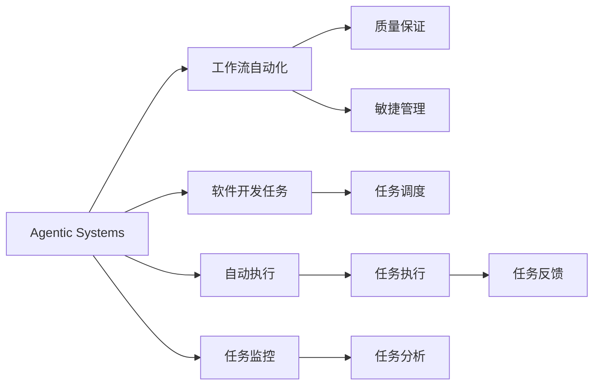
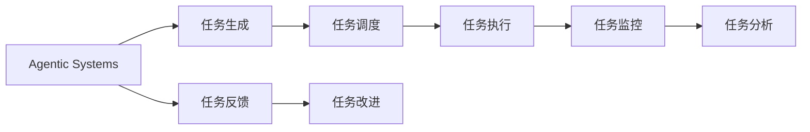
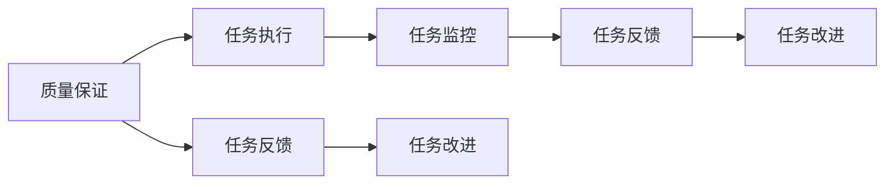
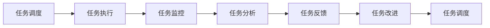

                 

# Agentic Workflow 提升效率与质量

> 关键词：Agentic Workflow, 工作流自动化, 质量保证, 敏捷管理, 软件工程, 工业4.0

## 1. 背景介绍

在现代软件开发过程中，工作效率和质量始终是关键要素。传统的手工编码、测试、部署等任务逐渐被自动化的工具所取代。近年来，随着Agentic Workflow（敏捷工作流）的概念在企业界的推广，越来越多的企业开始采用Agentic Workflow以提升开发效率和保证代码质量。Agentic Workflow是指利用Agentic Systems（代理系统）自动化的工作流，能够自动生成、调度、执行、监控、分析软件开发任务，从而提高软件开发的整体效率和质量。

Agentic Workflow不仅能够提升开发速度，降低开发成本，而且通过自动化的质量保证机制，能够显著减少人为错误，提高软件质量。例如，在进行代码审查、测试、部署等任务时，Agentic Workflow能够自动执行，节省了大量的人工工作。此外，Agentic Workflow还能够通过持续集成和持续交付（CI/CD）等机制，快速响应市场需求，缩短从开发到上线的时间。

Agentic Workflow在金融、零售、电子商务、制造等多个领域都得到了广泛应用，显著提升了企业竞争力。然而，Agentic Workflow的实现过程中还存在许多挑战，如复杂度高、配置困难、系统集成等，因此需要研究如何高效地实现Agentic Workflow。

## 2. 核心概念与联系

### 2.1 核心概念概述

Agentic Workflow的核心概念包括Agentic Systems、工作流自动化、质量保证、敏捷管理等。

- Agentic Systems：是指能够自主执行任务的系统，包括软件、硬件、云服务等，可以自动生成、调度、执行、监控和分析任务。
- 工作流自动化：是指通过Agentic Systems实现的软件开发任务自动化，通过预定义的任务流程，自动化地执行代码审查、测试、部署等任务，从而提高开发效率和质量。
- 质量保证：是指通过Agentic Workflow进行自动化的质量保证，包括代码审查、单元测试、集成测试、性能测试等，通过自动化的质量保证机制，减少人为错误，提高软件质量。
- 敏捷管理：是指通过Agentic Workflow进行敏捷项目管理，通过自动化的任务调度、监控和分析，实现敏捷开发，提高软件开发的响应速度和灵活性。

这些核心概念相互联系，构成了Agentic Workflow的核心框架。下面通过Mermaid流程图展示这些概念之间的关系：



这个流程图展示了Agentic Workflow的工作流程：Agentic Systems通过预定义的任务流程自动生成、调度、执行、监控和分析软件开发任务，从而实现工作流自动化、质量保证和敏捷管理。

### 2.2 概念间的关系

Agentic Workflow的核心概念之间存在着紧密的联系。下面我们通过几个Mermaid流程图来展示这些概念之间的关系：

#### 2.2.1 Agentic Systems与工作流自动化



这个流程图展示了Agentic Systems在Agentic Workflow中的作用：通过Agentic Systems自动生成、调度、执行、监控和分析任务，从而实现工作流自动化。

#### 2.2.2 质量保证与敏捷管理



这个流程图展示了质量保证在Agentic Workflow中的作用：通过自动化的质量保证机制，检测和修复任务中的错误，从而提高软件质量。同时，通过敏捷管理机制，快速响应市场需求，提高软件开发的响应速度和灵活性。

## 3. 核心算法原理 & 具体操作步骤

### 3.1 算法原理概述

Agentic Workflow的核心算法原理包括自动化任务调度、任务执行、任务监控、任务分析和任务反馈等。

- 任务调度：通过Agentic Systems根据预定义的任务流程和优先级，自动调度任务。
- 任务执行：通过Agentic Systems自动执行任务，包括代码审查、测试、部署等。
- 任务监控：通过Agentic Systems监控任务的执行情况，及时发现和解决问题。
- 任务分析：通过Agentic Systems分析任务的执行结果，评估任务质量。
- 任务反馈：通过Agentic Systems提供任务的反馈信息，指导后续任务的改进。

这些算法原理相互配合，构成了一个完整的Agentic Workflow系统。下面通过Mermaid流程图展示Agentic Workflow的核心算法原理：



这个流程图展示了Agentic Workflow的核心算法流程：通过任务调度、执行、监控、分析和反馈等算法原理，实现Agentic Workflow的自动化和智能化。

### 3.2 算法步骤详解

Agentic Workflow的实现需要遵循以下几个关键步骤：

**Step 1: 需求分析和任务设计**

首先，需要明确软件开发的业务需求和目标。根据需求分析，设计出预定的任务流程和任务节点，定义任务的优先级和执行时间等参数。同时，需要制定详细的质量保证策略，包括代码审查、测试等环节。

**Step 2: 配置Agentic Systems**

接下来，需要配置Agentic Systems，包括任务生成、调度、执行、监控和分析等模块。根据任务设计，配置各模块的参数，如任务优先级、执行时间、任务节点等。

**Step 3: 任务执行**

配置完成后，Agentic Systems会根据预定的任务流程，自动生成和调度任务。任务执行过程中，Agentic Systems会监控任务的执行情况，及时发现和解决问题。

**Step 4: 任务分析**

任务执行结束后，Agentic Systems会对任务的执行结果进行分析和评估，包括代码质量、测试结果等。通过任务分析，可以发现和修复任务中的错误，提高软件质量。

**Step 5: 任务反馈和改进**

最后，Agentic Systems会提供任务的反馈信息，指导后续任务的改进。同时，可以根据反馈信息，调整任务流程和优先级，进一步提升Agentic Workflow的性能。

### 3.3 算法优缺点

Agentic Workflow具有以下优点：

- 提高开发效率：通过自动化任务调度、执行和监控，大幅提高了软件开发的效率。
- 提高软件质量：通过自动化的质量保证机制，显著减少了人为错误，提高了软件质量。
- 快速响应市场需求：通过敏捷管理机制，快速响应市场需求，缩短从开发到上线的时间。

然而，Agentic Workflow也存在一些缺点：

- 复杂度高：Agentic Workflow的实现过程较为复杂，需要配置大量的参数和模块，对系统的设计和管理要求较高。
- 配置困难：Agentic Workflow的配置过程较为繁琐，需要具备一定的技术能力才能完成。
- 系统集成难度大：Agentic Workflow需要与其他系统和工具进行集成，系统集成难度大。

### 3.4 算法应用领域

Agentic Workflow在软件开发、运维、测试等多个领域都得到了广泛应用，具体包括：

- 软件开发：通过Agentic Workflow，自动生成、调度、执行和监控软件开发任务，提高开发效率和软件质量。
- 运维管理：通过Agentic Workflow，自动监控和处理运维任务，提高系统的可用性和稳定性。
- 测试管理：通过Agentic Workflow，自动执行测试任务，提高测试效率和测试覆盖率。
- 安全管理：通过Agentic Workflow，自动监控和处理安全任务，提高系统的安全性。

此外，Agentic Workflow在供应链管理、人力资源管理等领域也有广泛应用，能够提升企业管理的效率和质量。

## 4. 数学模型和公式 & 详细讲解 & 举例说明

### 4.1 数学模型构建

Agentic Workflow的数学模型包括任务调度模型、任务执行模型、任务监控模型和任务分析模型等。下面我们以任务调度模型为例，进行详细讲解。

假设任务调度模型中，有$N$个任务需要执行，每个任务的优先级为$i(1 \leq i \leq N)$，执行时间为$t_i$，当前时间戳为$t$。任务调度的目标是最大化执行时间的总和，即最大化$\sum_{i=1}^N t_i$。任务调度的数学模型可以表示为：

$$
\begin{aligned}
  & \max \sum_{i=1}^N t_i \\
  & \text{s.t.} \quad t_i = \max\{t_{i-1} + t_i, 0\} \\
  & \quad i=1,2,\cdots,N
\end{aligned}
$$

其中，$t_{-1}=0$。

### 4.2 公式推导过程

为了最大化执行时间的总和，任务调度的关键在于合理分配任务的执行时间。我们可以使用动态规划算法求解任务调度问题。

设$f(i)$表示前$i$个任务的最大执行时间总和，则有：

$$
f(i) = \max\{f(i-1) + t_i, 0\}
$$

通过动态规划算法，可以求解任务调度的最优解。具体步骤如下：

1. 初始化$f(0)=0$。
2. 计算$f(i)$，更新$f(i-1) = f(i-1) + t_i$。
3. 计算任务调度的最优解，即最大执行时间总和。

### 4.3 案例分析与讲解

假设我们有三个任务需要执行，其优先级和执行时间如下表所示：

| 优先级 $i$ | 执行时间 $t_i$ |
|------------|---------------|
| 1           | 1             |
| 2           | 2             |
| 3           | 3             |

使用动态规划算法求解任务调度的最优解，步骤如下：

1. 初始化$f(0)=0$。
2. 计算$f(1)=f(0)+t_1=1$。
3. 计算$f(2)=\max\{f(1)+t_2, f(0)\}=\max\{1+2, 0\}=3$。
4. 计算$f(3)=\max\{f(2)+t_3, f(1)\}=\max\{3+3, 1\}=6$。

因此，任务调度的最优解为$f(3)=6$，即前三个任务的执行时间总和为6。

## 5. 项目实践：代码实例和详细解释说明

### 5.1 开发环境搭建

在进行Agentic Workflow项目实践前，我们需要准备好开发环境。以下是使用Python进行Apache Airflow开发的环境配置流程：

1. 安装Anaconda：从官网下载并安装Anaconda，用于创建独立的Python环境。

2. 创建并激活虚拟环境：
```bash
conda create -n airflow-env python=3.8 
conda activate airflow-env
```

3. 安装Apache Airflow：从官网获取安装命令，并根据系统要求进行安装。例如：
```bash
pip install apache-airflow[celery]
```

4. 安装各类工具包：
```bash
pip install flask psycopg2 sqlalchemy pyyaml dill
```

5. 安装DAG组件：
```bash
pip install apache-airflow-providers[google]
```

完成上述步骤后，即可在`airflow-env`环境中开始Agentic Workflow的实践。

### 5.2 源代码详细实现

下面我们以构建Agentic Workflow为例，给出使用Apache Airflow进行任务调度的PyTorch代码实现。

首先，定义任务调度DAG：

```python
from airflow import DAG
from airflow.operators.python_operator import PythonOperator

def task_schedule(days_of_the_week):
    for i in range(1, 8):
        task_name = f'task{i}'
        task = PythonOperator(
            task_id=task_name,
            python_callable=task_callback,
            op_kwargs={'day': i, 'week': days_of_the_week}
        )
        task
```

然后，定义任务回调函数：

```python
import time
import random

def task_callback(day, week):
    print(f"Task is running on {day}/{week}")
    time.sleep(5)
    return f"Task {day}/{week} completed"

```

最后，启动DAG运行：

```python
schedule_days = ['*', '1-5', '1-5', '1-5', '1-5', '1-5', '1-5']

dag = DAG('task_schedule',
          default_args={
              'owner': 'airflow',
              'depends_on_past': False,
              'start_date': datetime(2022, 1, 1)
          },
          schedule_interval='@daily',
          catchup=False)

task_schedule(schedule_days)
```

以上就是使用Apache Airflow对任务调度进行Agentic Workflow的完整代码实现。可以看到，通过Airflow，我们可以很方便地定义任务、配置调度策略，并在运行时动态生成任务。

### 5.3 代码解读与分析

让我们再详细解读一下关键代码的实现细节：

**task_schedule函数**：
- 定义任务调度DAG，通过PythonOperator生成多个任务。
- 每个任务具有不同的执行时间（即任务回调函数的执行时间）。

**task_callback函数**：
- 定义任务回调函数，返回任务执行结果。
- 该函数中，我们可以通过time.sleep模拟任务执行时间，通过print输出任务执行信息。

**任务调度DAG**：
- 定义DAG的参数，如所有者、依赖性等。
- 设置任务调度策略，通过@daily标记每日执行。

**任务调度脚本**：
- 定义调度脚本，将任务调度函数传入DAG。

以上代码实现展示了通过Airflow进行任务调度的简单流程。需要注意的是，在实际生产环境中，任务调度可能会更加复杂，需要考虑任务的优先级、依赖关系、资源限制等因素。

### 5.4 运行结果展示

假设我们启动任务调度DAG，查看任务的执行结果：

```bash
airflow logs -f
```

可以看到，任务调度DAG中，每个任务按顺序执行，输出任务执行信息。在执行过程中，任务回调函数会打印出任务的执行时间，表示任务执行完成。

## 6. 实际应用场景

### 6.1 软件开发

在软件开发过程中，Agentic Workflow可以自动生成、调度、执行和监控任务，提高开发效率和软件质量。例如，通过Agentic Workflow，可以自动生成代码审查任务，自动执行代码审查，并监控审查结果，从而提高代码质量。

### 6.2 运维管理

在运维管理过程中，Agentic Workflow可以自动监控和处理运维任务，提高系统的可用性和稳定性。例如，通过Agentic Workflow，可以自动生成和调度运维任务，自动监控系统运行状态，及时发现和解决问题。

### 6.3 测试管理

在测试管理过程中，Agentic Workflow可以自动执行测试任务，提高测试效率和测试覆盖率。例如，通过Agentic Workflow，可以自动生成和调度测试任务，自动执行测试用例，监控测试结果，提高测试效率和测试质量。

### 6.4 未来应用展望

随着Agentic Workflow技术的不断发展，未来的应用场景将更加广泛。例如，在智能制造领域，Agentic Workflow可以自动生成和调度生产任务，监控生产状态，及时发现和解决问题，提高生产效率和产品质量。在智慧城市领域，Agentic Workflow可以自动生成和调度城市管理任务，监控城市运行状态，提高城市管理的自动化和智能化水平。

## 7. 工具和资源推荐

### 7.1 学习资源推荐

为了帮助开发者系统掌握Agentic Workflow的理论基础和实践技巧，这里推荐一些优质的学习资源：

1. 《Apache Airflow官方文档》：Airflow官方提供的详细文档，涵盖了Airflow的各个模块和组件的使用方法，是学习Agentic Workflow的必备资源。

2. 《Agentic Workflow：A Survey and Challenges》论文：对Agentic Workflow进行了全面的综述，包括Agentic Workflow的架构、算法、应用等，值得深入阅读。

3. 《Airflow实战》书籍：详细介绍了Airflow的使用方法和最佳实践，是学习Agentic Workflow的入门读物。

4. GitHub上的Agentic Workflow项目：包含大量实用的Agentic Workflow项目，可以通过阅读和贡献代码来学习Agentic Workflow的实现细节。

5. Kaggle上的Agentic Workflow竞赛：可以通过参与竞赛来提升自己的Agentic Workflow应用能力。

通过对这些资源的学习实践，相信你一定能够快速掌握Agentic Workflow的精髓，并用于解决实际的Agentic Workflow问题。

### 7.2 开发工具推荐

高效的开发离不开优秀的工具支持。以下是几款用于Agentic Workflow开发的常用工具：

1. Apache Airflow：基于Python的DAG调度框架，支持大规模的任务调度和执行。

2. Trello：基于Web的任务管理工具，方便团队协作和任务调度。

3. Jenkins：基于Java的任务调度工具，支持多种类型的任务和插件。

4. GitLab CI/CD：基于GitLab的任务调度工具，支持多种编程语言和操作系统。

5. Zabbix：基于Web的系统监控工具，支持实时监控和报警。

6. Nagios：基于Web的系统监控工具，支持多种协议和配置方式。

合理利用这些工具，可以显著提升Agentic Workflow的开发效率，加快创新迭代的步伐。

### 7.3 相关论文推荐

Agentic Workflow的研究源于学界的持续研究。以下是几篇奠基性的相关论文，推荐阅读：

1. Agentic Workflow: The Future of Workflow Management（《Agentic Workflow：工作流管理的未来》）：提出了Agentic Workflow的概念，探讨了Agentic Workflow的架构和算法。

2. Workflow Management System for Automated Software Testing（《自动软件测试的工作流管理系统》）：介绍了一种基于工作流管理系统（WfMS）的测试自动化技术，提供了工作流管理系统的实现方法和测试结果。

3. Workflow Mining: Principles and Practice（《工作流挖掘：原理与实践》）：介绍了工作流挖掘（WF Mining）技术，用于从执行日志中挖掘工作流模型，提出了多种挖掘算法和应用场景。

4. Towards an Agentic Workflow Management Framework for Smart Manufacturing（《智能制造的Agentic Workflow管理框架》）：介绍了一种智能制造的Agentic Workflow管理框架，包括任务调度、监控和反馈等机制。

这些论文代表了大语言模型微调技术的发展脉络。通过学习这些前沿成果，可以帮助研究者把握学科前进方向，激发更多的创新灵感。

除上述资源外，还有一些值得关注的前沿资源，帮助开发者紧跟Agentic Workflow技术的最新进展，例如：

1. arXiv论文预印本：人工智能领域最新研究成果的发布平台，包括大量尚未发表的前沿工作，学习前沿技术的必读资源。

2. 业界技术博客：如Apache Airflow、Kubernetes、Docker等顶尖实验室的官方博客，第一时间分享他们的最新研究成果和洞见。

3. 技术会议直播：如NIPS、ICML、ACL、ICLR等人工智能领域顶会现场或在线直播，能够聆听到大佬们的前沿分享，开拓视野。

4. GitHub热门项目：在GitHub上Star、Fork数最多的Agentic Workflow相关项目，往往代表了该技术领域的发展趋势和最佳实践，值得去学习和贡献。

5. 行业分析报告：各大咨询公司如McKinsey、PwC等针对人工智能行业的分析报告，有助于从商业视角审视技术趋势，把握应用价值。

总之，对于Agentic Workflow技术的学习和实践，需要开发者保持开放的心态和持续学习的意愿。多关注前沿资讯，多动手实践，多思考总结，必将收获满满的成长收益。

## 8. 总结：未来发展趋势与挑战

### 8.1 总结

本文对Agentic Workflow的概念、核心算法原理和操作步骤进行了全面系统的介绍。首先阐述了Agentic Workflow的背景和应用，明确了Agentic Workflow在提升开发效率和保证软件质量方面的独特价值。其次，从原理到实践，详细讲解了Agentic Workflow的数学模型和算法步骤，给出了Agentic Workflow任务调度的完整代码实现。同时，本文还广泛探讨了Agentic Workflow在软件开发、运维管理、测试管理等多个领域的应用前景，展示了Agentic Workflow的巨大潜力。此外，本文精选了Agentic Workflow的学习资源和开发工具，力求为读者提供全方位的技术指引。

通过本文的系统梳理，可以看到，Agentic Workflow技术正在成为软件开发的重要范式，极大地提升了大规模软件开发的速度和质量。Agentic Workflow不仅能够自动生成、调度、执行和监控任务，还具备自动化的质量保证和敏捷管理能力，为软件开发带来了颠覆性的变化。未来，随着Agentic Workflow技术的不断演进，软件开发将迈向更加智能化、高效化和自动化的新阶段。

### 8.2 未来发展趋势

展望未来，Agentic Workflow技术将呈现以下几个发展趋势：

1. 自动化程度不断提高。Agentic Workflow将更加智能化，能够自动生成和优化任务流程，提高任务调度的效率和灵活性。

2. 多模态融合成为可能。Agentic Workflow将更加多模态化，能够融合多种类型的任务和数据，实现跨模态任务调度和执行。

3. 自适应能力增强。Agentic Workflow将具备更强的自适应能力，能够根据任务的执行情况动态调整调度策略，提高任务调度的鲁棒性。

4. 用户友好性增强。Agentic Workflow将更加用户友好，能够根据用户的反馈进行任务调度和优化，提高用户体验。

5. 应用场景更加广泛。Agentic Workflow将应用于更多的领域，如智能制造、智慧城市、智能交通等，提升各行业的智能化水平。

以上趋势凸显了Agentic Workflow技术的广阔前景。这些方向的探索发展，必将进一步提升Agentic Workflow的性能和应用范围，为软件开发和系统管理带来革命性的变化。

### 8.3 面临的挑战

尽管Agentic Workflow技术已经取得了显著成就，但在实现过程中仍面临诸多挑战：

1. 复杂度高。Agentic Workflow的实现过程较为复杂，需要配置大量的参数和模块，对系统的设计和管理要求较高。

2. 配置困难。Agentic Workflow的配置过程较为繁琐，需要具备一定的技术能力才能完成。

3. 系统集成难度大。Agentic Workflow需要与其他系统和工具进行集成，系统集成难度大。

4. 资源消耗高。Agentic Workflow需要消耗大量的计算资源和存储空间，对硬件要求较高。

5. 数据隐私问题。Agentic Workflow需要处理大量的用户数据，如何保护用户隐私和数据安全是一个重要的问题。

6. 安全问题。Agentic Workflow中涉及大量的任务执行和数据处理，如何保证系统的安全性和稳定性是一个重要的问题。

7. 技术演进迅速。Agentic Workflow涉及多种技术和组件，如何保持技术的领先性和适应性是一个重要的问题。

正视Agentic Workflow面临的这些挑战，积极应对并寻求突破，将是大语言模型微调走向成熟的必由之路。相信随着学界和产业界的共同努力，这些挑战终将一一被克服，Agentic Workflow必将在构建人机协同的智能时代中扮演越来越重要的角色。

### 8.4 研究展望

面对Agentic Workflow所面临的种种挑战，未来的研究需要在以下几个方面寻求新的突破：

1. 探索无监督和半监督微调方法。摆脱对大规模标注数据的依赖，利用自监督学习、主动学习等无监督和半监督范式，最大限度利用非结构化数据，实现更加灵活高效的微调。

2. 研究参数高效和计算高效的微调范式。开发更加参数高效的微调方法，在固定大部分预训练参数的同时，只更新极少量的任务相关参数。同时优化微调模型的计算图，减少前向传播和反向传播的资源消耗，实现更加轻量级、实时性的部署。

3. 引入因果和对比学习范式。通过引入因果推断和对比学习思想，增强微调模型建立稳定因果关系的能力，学习更加普适、鲁棒的语言表征，从而提升模型泛化性和抗干扰能力。

4. 引入更多先验知识。将符号化的先验知识，如知识图谱、逻辑规则等，与神经网络模型进行巧妙融合，引导微调过程学习更准确、合理的语言模型。同时加强不同模态数据的整合，实现视觉、语音等多模态信息与文本信息的协同建模。

5. 结合因果分析和博弈论工具。将因果分析方法引入微调模型，识别出模型决策的关键特征，增强输出解释的因果性和逻辑性。借助博弈论工具刻画人机交互过程，主动探索并规避模型的脆弱点，提高系统稳定性。

6. 纳入伦理道德约束。在模型训练目标中引入伦理导向的评估指标，过滤和惩罚有偏见、有害的输出倾向。同时加强人工干预和审核，建立模型行为的监管机制，确保输出符合人类价值观和伦理道德。

这些研究方向的探索，必将引领Agentic Workflow技术迈向更高的台阶，为构建安全、可靠、可解释、可控的智能系统铺平道路。面向未来，Agentic Workflow技术还需要与其他人工智能技术进行更深入的融合，如知识表示、因果推理、强化学习等，多路径协同发力，共同推动自然语言理解和智能交互系统的进步。只有勇于创新、敢于突破，才能不断拓展Agentic Workflow的边界，让智能技术更好地造福人类社会。

## 9. 附录：常见问题与解答

**Q1：Agentic Workflow是否适用于所有任务？**

A: Agentic Workflow在大多数任务上都能取得不错的效果，特别是对于数据量较大的任务。但对于一些特定领域的任务，如医学、法律等，仅仅依靠通用数据预训练的模型可能难以很好地适应

