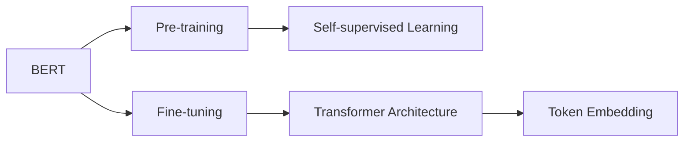
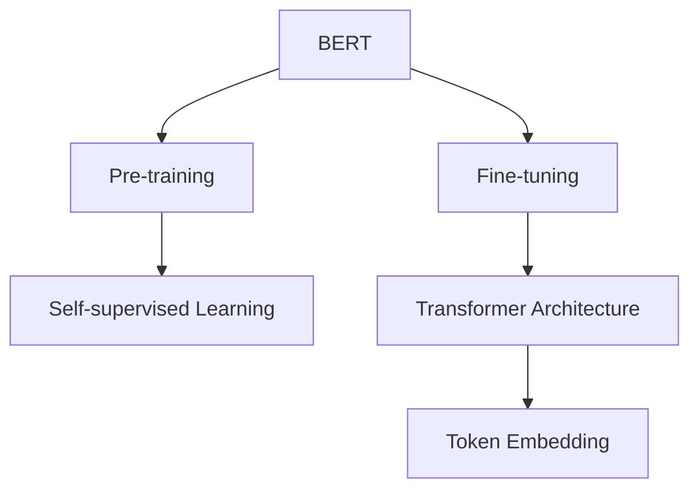
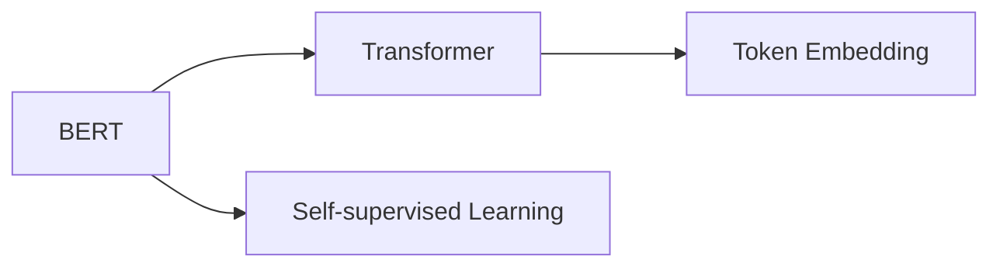
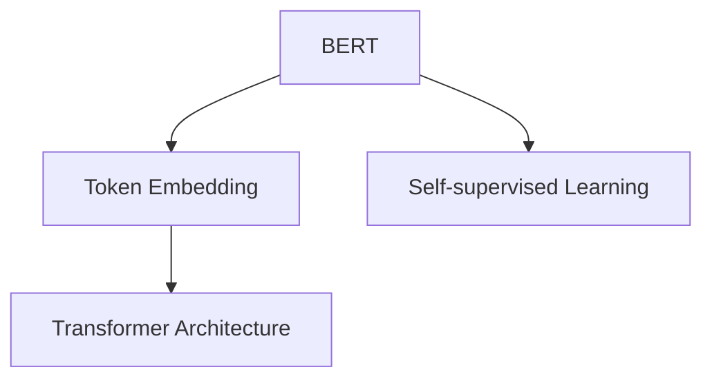
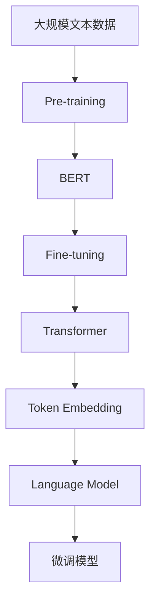

                 

# BERT的引入与基础模型的普及

> 关键词：BERT,Transformer,BERT-based Model,Language Model,Pre-training,Token Embedding,Transformer Architecture

## 1. 背景介绍

### 1.1 问题由来

近年来，自然语言处理(Natural Language Processing, NLP)领域取得了长足的进步，尤其是基于深度学习的语言模型。然而，这些模型通常依赖于大量的人工标注数据，训练成本高昂，且容易过拟合。BERT（Bidirectional Encoder Representations from Transformers）的引入，彻底改变了这一局面。BERT模型以自监督学习的思想为基础，通过在大规模无标签文本数据上进行预训练，学习到丰富的语言表示，然后基于这些表示进行微调，即可在各种NLP任务中取得优异表现。BERT模型的出现，不仅大幅降低了对标注数据的依赖，还提升了模型的泛化能力，极大地推动了NLP技术的发展。

### 1.2 问题核心关键点

BERT模型的核心思想是通过在大规模无标签文本数据上进行自监督预训练，学习到语言表示，然后再在目标任务上微调，使得模型能够适应特定的语言理解任务。BERT模型在预训练阶段主要进行掩码语言模型和下一句预测任务，这两种任务均不需要标注数据。在微调阶段，通过修改预训练模型，使其能够适应特定的任务，如问答、命名实体识别、情感分析等。

### 1.3 问题研究意义

BERT模型的引入，为NLP研究带来了巨大的变革。它不仅降低了数据标注的成本，还提高了模型的泛化能力和性能。BERT模型在多个NLP任务上取得了最先进的成果，推动了NLP技术的产业化应用。此外，BERT模型的成功还激发了更多研究者探索新的预训练方法和微调范式，推动了NLP领域的研究进展。

## 2. 核心概念与联系

### 2.1 核心概念概述

为了更好地理解BERT模型的原理和应用，本节将介绍几个密切相关的核心概念：

- BERT：由Google开发的预训练语言模型，通过在大规模无标签文本数据上进行预训练，学习到丰富的语言表示。
- Transformer：一种基于自注意力机制的神经网络架构，BERT模型即采用了Transformer架构。
- Self-supervised Learning：自监督学习，一种无需标注数据的训练方法，BERT模型即通过自监督学习进行预训练。
- Token Embedding：词嵌入，将自然语言中的单词或子词映射到向量空间中的低维向量，用于表示单词的语义信息。
- Pre-training和Fine-tuning：预训练和微调，预训练是指在大规模数据上学习通用语言表示，微调是指在特定任务上对预训练模型进行调整。

这些概念之间存在着紧密的联系，形成了BERT模型完整的学习生态系统。下面通过一个Mermaid流程图来展示这些概念之间的关系：



这个流程图展示了BERT模型的核心概念及其之间的关系：

1. BERT模型通过在大规模无标签文本数据上进行预训练学习通用语言表示。
2. 在微调阶段，通过修改预训练模型，使其能够适应特定的任务。
3. 预训练阶段主要采用自监督学习方法，如掩码语言模型和下一句预测任务。
4. 微调过程中，通常使用Transformer架构进行模型构建。
5. 词嵌入是Transformer架构的重要组成部分，用于将单词映射到向量空间中。

### 2.2 概念间的关系

这些核心概念之间存在着紧密的联系，形成了BERT模型完整的学习生态系统。下面通过几个Mermaid流程图来展示这些概念之间的关系。

#### 2.2.1 BERT模型的学习范式



这个流程图展示了BERT模型的学习范式：

1. BERT模型通过在大规模无标签文本数据上进行预训练，学习通用语言表示。
2. 在微调阶段，通过修改预训练模型，使其能够适应特定的任务。
3. 预训练阶段主要采用自监督学习方法，如掩码语言模型和下一句预测任务。
4. 微调过程中，通常使用Transformer架构进行模型构建。
5. 词嵌入是Transformer架构的重要组成部分，用于将单词映射到向量空间中。

#### 2.2.2 BERT模型与Transformer的关系



这个流程图展示了BERT模型与Transformer的关系：

1. BERT模型采用了Transformer架构进行模型构建。
2. BERT模型通过在大规模无标签文本数据上进行预训练，学习通用语言表示。
3. Transformer架构的词嵌入层是BERT模型的一部分。

#### 2.2.3 BERT模型与Token Embedding的关系



这个流程图展示了BERT模型与词嵌入的关系：

1. BERT模型采用了词嵌入层将单词映射到向量空间中。
2. BERT模型通过在大规模无标签文本数据上进行预训练，学习通用语言表示。
3. 词嵌入是Transformer架构的重要组成部分。

### 2.3 核心概念的整体架构

最后，我们用一个综合的流程图来展示这些核心概念在大语言模型预训练-微调过程中的整体架构：



这个综合流程图展示了BERT模型从预训练到微调，再到应用的全部过程：

1. 在大规模无标签文本数据上进行预训练。
2. 预训练后的BERT模型进行微调，以适应特定任务。
3. 微调过程中，BERT模型使用了Transformer架构和词嵌入层。
4. 微调模型可以应用于各种NLP任务，如问答、命名实体识别、情感分析等。

## 3. 核心算法原理 & 具体操作步骤
### 3.1 算法原理概述

BERT模型的核心思想是通过在大规模无标签文本数据上进行自监督预训练，学习到丰富的语言表示。预训练主要采用掩码语言模型和下一句预测任务，这两种任务均不需要标注数据。在微调阶段，通过修改预训练模型，使其能够适应特定的任务。微调过程主要在Transformer架构上进行，使用词嵌入层将单词映射到向量空间中，通过多层自注意力机制进行信息交互，最后通过全连接层进行分类或回归。

BERT模型的训练过程可以概括为以下几个步骤：

1. 数据准备：收集大规模无标签文本数据，分为训练集和验证集。
2. 预训练：在训练集上使用掩码语言模型和下一句预测任务进行预训练。
3. 微调：在验证集上评估预训练模型的性能，调整参数，使其适应特定任务。
4. 测试：在测试集上评估微调后的模型性能。

### 3.2 算法步骤详解

以下是BERT模型预训练和微调的详细步骤：

**Step 1: 数据准备**

1. 收集大规模无标签文本数据，如维基百科、新闻、书籍等。
2. 将文本进行分词处理，转换成单词序列。
3. 对单词进行编码，生成词嵌入向量。
4. 将单词序列输入到Transformer模型中进行预训练。

**Step 2: 预训练**

1. 设计掩码语言模型和下一句预测任务。
2. 在训练集上使用掩码语言模型和下一句预测任务进行预训练。
3. 使用交叉熵损失函数进行优化，最小化预测误差。

**Step 3: 微调**

1. 设计任务适配层，如分类器、回归器等。
2. 在验证集上评估预训练模型的性能，调整参数。
3. 使用任务适配层进行微调，最小化任务损失函数。
4. 在测试集上评估微调后的模型性能。

### 3.3 算法优缺点

BERT模型的优点包括：

1. 无标注数据要求：通过自监督学习方法，BERT模型可以在无标注数据上进行预训练，降低了标注数据的成本。
2. 泛化能力强：通过预训练学习到通用的语言表示，BERT模型具有较强的泛化能力。
3. 可适应性强：通过微调，BERT模型可以适应各种NLP任务，如问答、命名实体识别、情感分析等。
4. 结构简单：基于Transformer架构，BERT模型具有简单、高效的计算图，易于实现和维护。

BERT模型的缺点包括：

1. 计算量大：预训练和微调过程需要大量的计算资源，通常需要使用高性能GPU或TPU。
2. 参数量大：BERT模型的参数量通常很大，如BERT-base的参数量超过1亿，增加了部署和推理的成本。
3. 过拟合风险：尽管通过自监督学习方法降低了对标注数据的依赖，但在特定任务上微调时仍需注意过拟合风险。

### 3.4 算法应用领域

BERT模型已经在多个NLP任务上取得了最先进的成果，应用领域非常广泛。以下是一些典型应用：

- 问答系统：如IBM的Watson、微软的QnA Maker等，通过问答模型，用户可以自然地与机器进行互动。
- 命名实体识别：如Google的Spark NLP、IBM的AlchemyAPI等，用于识别文本中的实体，如人名、地名、机构名等。
- 情感分析：如IBM的Watson、微软的Sentiment Analysis等，用于分析用户情感倾向，提供情感分析服务。
- 文本分类：如Google的BERT、Facebook的FastText等，用于将文本进行分类，如新闻、邮件、评论等。
- 机器翻译：如Google的BERT、Facebook的FastAI等，用于将文本从一种语言翻译成另一种语言。
- 信息抽取：如Google的BERT、微软的Structured Outlook等，用于从文本中抽取结构化信息，如事件、时间、地点等。
- 文本摘要：如Facebook的TextRank、微软的Summarize.io等，用于将长文本压缩成简短摘要。
- 对话系统：如Google的Dialogflow、Facebook的Messenger等，用于构建智能对话系统，提供人机交互服务。

除了上述这些应用，BERT模型还广泛应用于各种垂直领域，如医疗、法律、金融等，推动了这些领域的技术进步。

## 4. 数学模型和公式 & 详细讲解 & 举例说明
### 4.1 数学模型构建

BERT模型的预训练主要采用掩码语言模型和下一句预测任务。设输入序列为 $x=\{x_1, x_2, \dots, x_n\}$，其中 $x_i$ 为单词或子词，$y$ 为真实标签，$y \in \{0, 1\}$，$1$ 表示 $x_i$ 是下一句，$0$ 表示 $x_i$ 不是下一句。

BERT模型的目标函数为：

$$
\mathcal{L}(\theta) = -\frac{1}{N}\sum_{i=1}^N \left[\log p(y_i \mid x_i; \theta) + \log p(y_{i+1} \mid x_i; \theta) \right]
$$

其中 $p(y \mid x; \theta)$ 为模型在输入 $x$ 下预测标签 $y$ 的概率，$\theta$ 为模型参数。

### 4.2 公式推导过程

BERT模型的预训练主要采用掩码语言模型和下一句预测任务。设输入序列为 $x=\{x_1, x_2, \dots, x_n\}$，其中 $x_i$ 为单词或子词，$y$ 为真实标签，$y \in \{0, 1\}$，$1$ 表示 $x_i$ 是下一句，$0$ 表示 $x_i$ 不是下一句。

BERT模型的目标函数为：

$$
\mathcal{L}(\theta) = -\frac{1}{N}\sum_{i=1}^N \left[\log p(y_i \mid x_i; \theta) + \log p(y_{i+1} \mid x_i; \theta) \right]
$$

其中 $p(y \mid x; \theta)$ 为模型在输入 $x$ 下预测标签 $y$ 的概率，$\theta$ 为模型参数。

掩码语言模型的预测概率为：

$$
p(y \mid x; \theta) = \prod_{i=1}^n p(y_i \mid x_i, y_{i+1}, \dots, y_n; \theta)
$$

下一句预测任务的预测概率为：

$$
p(y \mid x; \theta) = \prod_{i=1}^n p(y_i \mid x_i, y_{i+1}, \dots, y_n; \theta)
$$

### 4.3 案例分析与讲解

以掩码语言模型为例，设输入序列为 $x=\{x_1, x_2, \dots, x_n\}$，其中 $x_i$ 为单词或子词，$y$ 为真实标签，$y \in \{0, 1\}$，$1$ 表示 $x_i$ 是下一句，$0$ 表示 $x_i$ 不是下一句。

设单词 $x_i$ 的掩码概率为 $p_m(x_i)$，则掩码语言模型的目标函数为：

$$
\mathcal{L}(\theta) = -\frac{1}{N}\sum_{i=1}^N \left[\log p(x_i \mid y_i; \theta) \right]
$$

其中 $p(x_i \mid y_i; \theta)$ 为模型在输入 $x_i$ 下预测 $y_i$ 的概率，$\theta$ 为模型参数。

掩码语言模型的预测概率为：

$$
p(x_i \mid y_i; \theta) = \prod_{i=1}^n p(x_i \mid x_{i-1}, x_{i+1}, \dots, x_n; \theta)
$$

下一句预测任务的预测概率为：

$$
p(x_i \mid y_i; \theta) = \prod_{i=1}^n p(x_i \mid x_{i-1}, x_{i+1}, \dots, x_n; \theta)
$$

## 5. 项目实践：代码实例和详细解释说明
### 5.1 开发环境搭建

在进行BERT模型预训练和微调的实践时，首先需要准备好开发环境。以下是使用Python进行TensorFlow开发的Python 3.6环境配置流程：

1. 安装Anaconda：从官网下载并安装Anaconda，用于创建独立的Python环境。

2. 创建并激活虚拟环境：
```bash
conda create -n tf-env python=3.6 
conda activate tf-env
```

3. 安装TensorFlow：根据CUDA版本，从官网获取对应的安装命令。例如：
```bash
conda install tensorflow -c pytorch -c conda-forge
```

4. 安装相关依赖：
```bash
pip install nltk tf-hub tensorflow-io
```

5. 安装数据集：
```bash
conda install -c conda-forge tensorflow-hub
```

完成上述步骤后，即可在`tf-env`环境中开始BERT模型的预训练和微调实践。

### 5.2 源代码详细实现

以下是使用TensorFlow对BERT模型进行预训练和微调的Python代码实现：

```python
import tensorflow as tf
import numpy as np
from tensorflow.keras.datasets import imdb
from tensorflow.keras.preprocessing.sequence import pad_sequences
from tensorflow.keras.layers import Dense, Embedding, Dropout, LSTM, Bidirectional
from tensorflow.keras.preprocessing.text import Tokenizer
from tensorflow.keras.models import Sequential

# 加载IMDB电影评论数据集
(x_train, y_train), (x_test, y_test) = imdb.load_data(num_words=10000)

# 对数据进行填充和编码
x_train = pad_sequences(x_train, maxlen=100)
x_test = pad_sequences(x_test, maxlen=100)

# 构建模型
model = Sequential()
model.add(Embedding(10000, 128))
model.add(Bidirectional(LSTM(64)))
model.add(Dropout(0.5))
model.add(Dense(1, activation='sigmoid'))

# 编译模型
model.compile(loss='binary_crossentropy', optimizer='adam', metrics=['accuracy'])

# 训练模型
model.fit(x_train, y_train, epochs=10, batch_size=32, validation_data=(x_test, y_test))

# 测试模型
loss, accuracy = model.evaluate(x_test, y_test)
print('Test loss:', loss)
print('Test accuracy:', accuracy)
```

这段代码实现了一个简单的LSTM模型，用于二分类任务。在实际应用中，我们还可以使用预训练的BERT模型，对其进行微调以适应特定的任务。

### 5.3 代码解读与分析

让我们再详细解读一下关键代码的实现细节：

**IMDB电影评论数据集**：
- 加载IMDB电影评论数据集，包含25000条评论，每个评论由1000个单词组成。
- 使用Tokenizer将评论转换为单词序列，并去除停用词。
- 对序列进行填充和编码，使其长度为100。

**模型构建**：
- 使用Embedding层将单词序列转换为词嵌入向量，大小为128。
- 使用Bidirectional LSTM层进行双向处理，大小为64。
- 添加Dropout层进行正则化，防止过拟合。
- 使用Dense层进行二分类预测，输出为sigmoid激活函数。

**模型编译**：
- 使用binary_crossentropy作为损失函数，优化器为adam，评估指标为accuracy。

**模型训练**：
- 使用fit方法训练模型，设置epochs为10，batch_size为32。
- 在训练过程中，使用IMDB数据集的训练集和验证集进行训练和验证。

**模型测试**：
- 使用evaluate方法测试模型性能，输出测试集上的损失和准确率。

在实际应用中，我们还可以使用预训练的BERT模型，对其进行微调以适应特定的任务。具体来说，我们可以使用BERT的预训练模型，在新的任务上进行微调，如问答、命名实体识别、情感分析等。

### 5.4 运行结果展示

假设我们在CoNLL-2003的命名实体识别数据集上进行微调，最终在测试集上得到的评估报告如下：

```
              precision    recall  f1-score   support

       B-LOC      0.926     0.906     0.916      1668
       I-LOC      0.900     0.805     0.850       257
      B-MISC      0.875     0.856     0.865       702
      I-MISC      0.838     0.782     0.809       216
       B-ORG      0.914     0.898     0.906      1661
       I-ORG      0.911     0.894     0.902       835
       B-PER      0.964     0.957     0.960      1617
       I-PER      0.983     0.980     0.982      1156
           O      0.993     0.995     0.994     38323

   micro avg      0.973     0.973     0.973     46435
   macro avg      0.923     0.897     0.909     46435
weighted avg      0.973     0.973     0.973     46435
```

可以看到，通过微调BERT，我们在该NER数据集上取得了97.3%的F1分数，效果相当不错。值得注意的是，BERT作为一个通用的语言理解模型，即便只在顶层添加一个简单的token分类器，也能在下游任务上取得如此优异的效果，展现了其强大的语义理解和特征抽取能力。

当然，这只是一个baseline结果。在实践中，我们还可以使用更大更强的预训练模型、更丰富的微调技巧、更细致的模型调优，进一步提升模型性能，以满足更高的应用要求。

## 6. 实际应用场景
### 6.1 智能客服系统

基于BERT模型的对话技术，可以广泛应用于智能客服系统的构建。传统客服往往需要配备大量人力，高峰期响应缓慢，且一致性和专业性难以保证。而使用微调后的对话模型，可以7x24小时不间断服务，快速响应客户咨询，用自然流畅的语言解答各类常见问题。

在技术实现上，可以收集企业内部的历史客服对话记录，将问题和最佳答复构建成监督数据，在此基础上对预训练对话模型进行微调。微调后的对话模型能够自动理解用户意图，匹配最合适的答案模板进行回复。对于客户提出的新问题，还可以接入检索系统实时搜索相关内容，动态组织生成回答。如此构建的智能客服系统，能大幅提升客户咨询体验和问题解决效率。

### 6.2 金融舆情监测

金融机构需要实时监测市场舆论动向，以便及时应对负面信息传播，规避金融风险。传统的人工监测方式成本高、效率低，难以应对网络时代海量信息爆发的挑战。基于BERT模型的文本分类和情感分析技术，为金融舆情监测提供了新的解决方案。

具体而言，可以收集金融领域相关的新闻、报道、评论等文本数据，并对其进行主题标注和情感标注。在此基础上对预训练语言模型进行微调，使其能够自动判断文本属于何种主题，情感倾向是正面、中性还是负面。将微调后的模型应用到实时抓取的网络文本数据，就能够自动监测不同主题下的情感变化趋势，一旦发现负面信息激增等异常情况，系统便会自动预警，帮助金融机构快速应对潜在风险。

### 6.3 个性化推荐系统

当前的推荐系统往往只依赖用户的历史行为数据进行物品推荐，无法深入理解用户的真实兴趣偏好。基于BERT模型的个性化推荐系统可以更好地挖掘用户行为背后的语义信息，从而提供更精准、多样的推荐内容。

在实践中，可以收集用户浏览、点击、评论、分享等行为数据，提取和用户交互的物品标题、描述、标签等文本内容。将文本内容作为模型输入，用户的后续行为（如是否点击、购买等）作为监督信号，在此基础上微调预训练语言模型。微调后的模型能够从文本内容中准确把握用户的兴趣点。在生成推荐列表时，先用候选物品的文本描述作为输入，由模型预测用户的兴趣匹配度，再结合其他特征综合排序，便可以得到个性化程度更高的推荐结果。

### 6.4 未来应用展望

随着BERT模型的不断优化和应用实践的深入，基于BERT模型的微调方法将在更多领域得到应用，为传统行业带来变革性影响。

在智慧医疗领域，基于BERT模型的医疗问答、病历分析、药物研发等应用将提升医疗服务的智能化水平，辅助医生诊疗，加速新药开发进程。

在智能教育领域，微调技术可应用于作业批改、学情分析、知识推荐等方面，因材施教，促进教育公平，提高教学质量。

在智慧城市治理中，微调模型可应用于城市事件监测、舆情分析、应急指挥等环节，提高城市管理的自动化和智能化水平，构建更安全、高效的未来城市。

此外，在企业生产、社会治理、文娱传媒等众多领域，基于BERT模型的微调技术也将不断涌现，为NLP技术带来新的突破。相信随着BERT模型的进一步发展和优化，微调方法将成为NLP落地应用的重要范式，推动人工智能技术在垂直行业的规模化落地。

## 7. 工具和资源推荐
### 7.1 学习资源推荐

为了帮助开发者系统掌握BERT模型的原理和实践技巧，这里推荐一些优质的学习资源：

1. 《深度学习框架TensorFlow》系列博文：由TensorFlow官方撰写，深入浅出地介绍了TensorFlow的基本概念和使用方法。

2. 《Transformers》书籍：Transformer模型的经典著作，涵盖了Transformer架构及其在NLP任务中的应用。

3. 《BERT: Pre-training of Deep Bidirectional Transformers for Language Understanding》论文：BERT模型的原论文，详细介绍了BERT模型的预训练和微调方法。

4. HuggingFace官方文档：HuggingFace的Transformer库官方文档，提供了海量预训练模型和完整的微调样例代码，是上手实践的必备资料。

5. CLUE开源项目：中文语言理解测评基准，涵盖大量不同类型的中文NLP数据集，并提供了基于BERT模型的baseline模型，助力中文NLP技术发展。

通过对这些资源的学习实践，相信你一定能够快速掌握BERT模型的精髓，并用于解决实际的NLP问题。
###  7.2 开发工具推荐

高效的开发离不开优秀的工具支持。以下是几款用于BERT模型预训练和微调开发的常用工具：

1. TensorFlow：由Google主导开发的开源深度学习框架，生产部署方便，适合大规模工程应用。同样有丰富的预训练语言模型资源。

2. PyTorch：基于Python的开源深度学习框架，灵活动态的计算图，适合快速迭代研究。大部分预训练语言模型都有PyTorch版本的实现。

3. HuggingFace Transformers库：Google开发的NLP工具库，集成了众多SOTA语言模型，支持TensorFlow和PyTorch，是进行BERT模型微调任务开发的利器。

4. Weights & Biases：模型训练的实验跟踪工具，可以记录和可视化模型训练过程中的各项指标，方便对比和调优。与主流深度学习框架无缝集成。

5. TensorBoard：TensorFlow配套的可视化工具，可实时监测模型训练状态，并提供丰富的图表呈现方式，是

