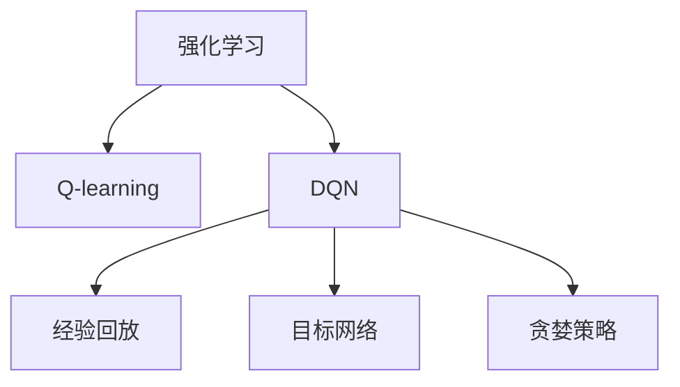
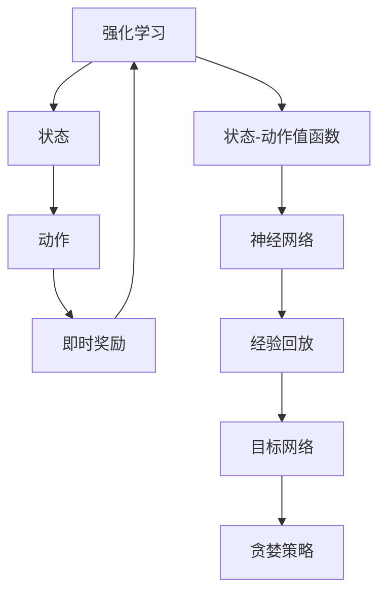
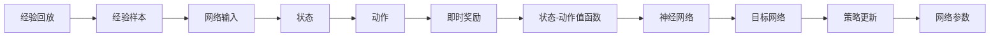

                 

# DQN(Deep Q-Network) - 原理与代码实例讲解

## 1. 背景介绍

### 1.1 问题由来

强化学习是人工智能研究中的一个重要分支，旨在让机器通过不断与环境交互，学习如何做出最优决策以最大化累积奖励。在强化学习中，常见的算法包括Q-learning、Sarsa等基于表格的模型。然而，这些基于表格的方法在处理复杂任务时，难以高效存储和更新庞大的状态-动作值表，同时需要大量的状态探索来积累足够的数据，学习效率较低。

Deep Q-Network (DQN) 是DeepMind公司提出的深度强化学习方法，通过结合深度神经网络和强化学习的原理，解决了传统方法在处理复杂任务时的瓶颈。DQN的核心思想是通过神经网络逼近状态-动作值函数，避免了传统表格方法在处理高维状态空间时的存储和计算问题，并利用经验回放、目标网络等技术，提高了模型学习效率和泛化能力。

### 1.2 问题核心关键点

DQN算法主要包含以下几个关键点：
- 使用神经网络逼近状态-动作值函数。
- 经验回放机制，从经验中学习。
- 目标网络，避免模型过拟合。
- 深度优先搜索，探索最优策略。
- 贪婪策略，在探索和利用之间平衡。

这些关键点共同构成了DQN算法的核心，使其在处理复杂任务时表现出优越的性能。

## 2. 核心概念与联系

### 2.1 核心概念概述

为了更好地理解DQN算法，本节将介绍几个密切相关的核心概念：

- 强化学习(Reinforcement Learning, RL)：机器通过与环境交互，根据状态和动作获得即时奖励，最终目标是通过学习最优策略，最大化累积奖励。
- Q-learning：一种基于表格的强化学习算法，通过状态-动作值函数 Q(s, a) 来评估策略，通过迭代更新 Q 值，学习最优策略。
- Deep Q-Network (DQN)：结合深度神经网络和强化学习的原理，通过神经网络逼近 Q 值函数，提高学习效率和泛化能力。
- 经验回放(Experience Replay)：收集环境交互数据，随机抽取样本进行训练，提高样本多样性，避免模型过拟合。
- 目标网络(Target Network)：使用网络结构相同的两个网络，一个用于策略更新，另一个用于目标策略值计算，保持策略稳定。
- 贪婪策略(Greedy Strategy)：在探索和利用之间取得平衡，避免策略更新的震荡。

这些概念之间的逻辑关系可以通过以下Mermaid流程图来展示：



这个流程图展示了DQN算法与Q-learning算法的关系，以及DQN中的关键概念。

### 2.2 概念间的关系

这些核心概念之间存在着紧密的联系，形成了DQN算法的完整生态系统。下面我通过几个Mermaid流程图来展示这些概念之间的关系。

#### 2.2.1 DQN算法框架



这个流程图展示了DQN算法的基本框架，从强化学习中获取状态和动作，计算即时奖励，更新状态-动作值函数，通过神经网络逼近，利用经验回放和目标网络进行优化。

#### 2.2.2 经验回放与目标网络



这个流程图展示了经验回放和目标网络的具体作用。经验回放通过随机抽取经验样本，训练神经网络，提高样本多样性。目标网络通过更新策略，保持模型稳定，防止过拟合。

## 3. 核心算法原理 & 具体操作步骤

### 3.1 算法原理概述

DQN算法的核心思想是利用深度神经网络逼近状态-动作值函数 Q(s, a)，通过经验回放和目标网络等技术，优化策略，最大化累积奖励。其核心步骤如下：

1. 从环境中随机采样状态-动作对(s, a)。
2. 根据当前状态和动作，计算即时奖励 r 和下一个状态 s'。
3. 使用神经网络估计状态-动作值函数 Q(s, a)。
4. 使用经验回放，随机抽取样本进行训练，更新 Q 值。
5. 使用目标网络，计算策略 Q(s, a)，进行策略更新。
6. 在目标网络和策略网络之间进行网络更新，保持策略稳定。

### 3.2 算法步骤详解

#### 3.2.1 环境交互

从环境中随机采样状态-动作对(s, a)，然后根据当前状态和动作，计算即时奖励 r 和下一个状态 s'。具体步骤如下：

1. 随机采样状态 s：从环境获取当前状态 s。
2. 随机采样动作 a：根据当前状态 s，随机选择一个动作 a。
3. 执行动作 a：将动作 a 应用于环境，得到下一个状态 s' 和即时奖励 r。
4. 记录状态-动作对(s, a)：记录状态 s 和动作 a，以及即时奖励 r 和下一个状态 s'。

#### 3.2.2 状态-动作值函数估计

使用神经网络估计状态-动作值函数 Q(s, a)，具体步骤如下：

1. 将当前状态 s 输入神经网络，输出 Q(s, a) 的预测值。
2. 将即时奖励 r 和下一个状态 s' 作为输入，输出 Q(s', a') 的预测值。

#### 3.2.3 经验回放

使用经验回放机制，随机抽取样本进行训练，更新 Q 值。具体步骤如下：

1. 从经验存储池中随机抽取若干样本。
2. 将样本中的状态-动作对(s, a)、即时奖励 r 和下一个状态 s' 作为输入，计算目标 Q 值。
3. 计算当前预测值 Q(s, a) 和目标 Q 值，计算 Q 值更新。
4. 使用 Q 值更新，更新神经网络的参数。

#### 3.2.4 策略更新

使用目标网络，计算策略 Q(s, a)，进行策略更新。具体步骤如下：

1. 从策略网络中获取状态 s 对应的动作值函数 Q(s, a)。
2. 从目标网络中获取状态 s' 对应的动作值函数 Q(s', a')。
3. 使用贪婪策略，选择动作 a 为当前动作。
4. 根据 Q(s, a) 和 Q(s', a')，计算策略更新。

#### 3.2.5 网络更新

在目标网络和策略网络之间进行网络更新，保持策略稳定。具体步骤如下：

1. 将策略网络的参数复制到目标网络。
2. 在一定时间间隔或样本数后，更新策略网络。

### 3.3 算法优缺点

DQN算法的优点包括：

- 使用神经网络逼近状态-动作值函数，适用于高维状态空间。
- 利用经验回放，提高样本多样性，避免过拟合。
- 使用目标网络，保持策略稳定，防止过拟合。
- 利用贪婪策略，在探索和利用之间取得平衡。

DQN算法的缺点包括：

- 神经网络模型的复杂性较高，需要大量数据训练。
- 经验回放和目标网络增加计算复杂度，需要更多的计算资源。
- 贪婪策略可能导致策略更新不稳定，影响学习效率。
- 网络更新可能导致策略更新震荡，影响模型稳定。

### 3.4 算法应用领域

DQN算法已经在许多领域得到了广泛的应用，例如：

- 游戏：通过训练智能体在复杂游戏中寻找最优策略，如AlphaGo。
- 机器人控制：通过训练机器人学习最优动作策略，进行复杂任务，如自动化仓储系统。
- 自动驾驶：通过训练自动驾驶系统学习最优驾驶策略，提高安全性。
- 供应链优化：通过训练智能体学习最优供需策略，优化供应链管理。
- 金融交易：通过训练智能体学习最优交易策略，提高投资回报率。
- 工业控制：通过训练智能体学习最优控制策略，优化工业生产过程。

这些领域的应用展示了DQN算法的强大潜力和广泛适用性。

## 4. 数学模型和公式 & 详细讲解 & 举例说明

### 4.1 数学模型构建

DQN算法使用神经网络逼近状态-动作值函数 Q(s, a)。具体数学模型如下：

设状态空间为 S，动作空间为 A，奖励函数为 r，状态转移函数为 p，神经网络参数为 θ，则状态-动作值函数 Q(s, a) 定义为：

$$
Q_{\theta}(s, a) = \mathbb{E}[R_t + \gamma Q_{\theta}(s', a') | s_t, a_t, \theta]
$$

其中 R_t 为即时奖励，s' 为下一个状态，a' 为下一个动作，γ 为折扣因子。

DQN算法的目标是最小化状态-动作值函数 Q(s, a) 与实际值 Q*(s, a) 的差异，即：

$$
\min_{\theta} \mathbb{E}[(Q_{\theta}(s, a) - Q_*(s, a))^2]
$$

其中 Q*(s, a) 为最优状态-动作值函数。

### 4.2 公式推导过程

为了简化问题，我们考虑一个简单的环境，状态 s 和动作 a 的数量分别为 3 和 2，奖励 r 为 0 或 1。状态转移函数 p(s', a') 为：

- 状态 1 采取动作 0，下一状态为 1，奖励为 1。
- 状态 1 采取动作 1，下一状态为 2，奖励为 0。
- 状态 2 采取动作 0，下一状态为 2，奖励为 0。
- 状态 2 采取动作 1，下一状态为 3，奖励为 0。
- 状态 3 采取动作 0，下一状态为 3，奖励为 1。
- 状态 3 采取动作 1，下一状态为 3，奖励为 0。

我们考虑状态 1 和动作 0 的 Q 值更新过程，具体如下：

设当前状态为 s1，动作为 a0，即时奖励为 r1，下一个状态为 s2。根据状态转移函数 p(s2, a0) = 1，即时奖励 r1 = 1，则目标 Q 值为：

$$
Q_{target}(s1, a0) = \max_{a'} Q_{target}(s2, a')
$$

设当前状态为 s1，动作为 a0，神经网络输出 Q(s1, a0) 为 0.5。根据经验回放，从经验存储池中随机抽取样本：

$$
(s1, a0, r1, s2) \sim D_{memory}
$$

则经验样本的 Q 值为：

$$
Q_{experience}(s1, a0) = r1 + \gamma \max_{a'} Q_{experience}(s2, a')
$$

根据 Q-learning 的更新公式，Q(s1, a0) 的更新为：

$$
Q_{new}(s1, a0) = Q_{old}(s1, a0) + \alpha(r1 + \gamma \max_{a'} Q_{target}(s2, a') - Q_{old}(s1, a0))
$$

其中 α 为学习率，Q_{old}(s1, a0) 为当前的预测值。

### 4.3 案例分析与讲解

下面我们通过一个简单的实例来分析 DQN 算法。

设有一个简单的环境，状态空间为 S = {s0, s1, s2}，动作空间为 A = {a0, a1}，奖励函数为 r，状态转移函数为 p。设当前状态为 s1，动作为 a0，即时奖励为 r1，下一个状态为 s2。

1. 随机采样状态-动作对(s1, a0)。
2. 根据当前状态和动作，计算即时奖励 r1 和下一个状态 s2。
3. 使用神经网络估计状态-动作值函数 Q(s1, a0)。
4. 使用经验回放，随机抽取样本进行训练，更新 Q 值。
5. 使用目标网络，计算策略 Q(s1, a0)，进行策略更新。
6. 在目标网络和策略网络之间进行网络更新，保持策略稳定。

假设我们使用一个简单的神经网络结构，包含两个全连接层，输出一个标量值。

首先，从环境中随机采样状态-动作对(s1, a0)，得到即时奖励 r1 = 1，下一个状态 s2 = 2。

其次，使用神经网络估计状态-动作值函数 Q(s1, a0)。设神经网络的输出为 0.5。

然后，使用经验回放，从经验存储池中随机抽取样本：

$$
(s1, a0, r1, s2) \sim D_{memory}
$$

经验样本的 Q 值为：

$$
Q_{experience}(s1, a0) = r1 + \gamma \max_{a'} Q_{experience}(s2, a')
$$

根据 Q-learning 的更新公式，Q(s1, a0) 的更新为：

$$
Q_{new}(s1, a0) = Q_{old}(s1, a0) + \alpha(r1 + \gamma \max_{a'} Q_{target}(s2, a') - Q_{old}(s1, a0))
$$

其中 α 为学习率，Q_{old}(s1, a0) 为当前的预测值。

假设 α = 0.1，Q_{old}(s1, a0) = 0.5，Q_{target}(s2, a1) = 0.9，则：

$$
Q_{new}(s1, a0) = 0.5 + 0.1(1 + 0.9 - 0.5) = 0.9
$$

最终，神经网络的输出更新为 Q(s1, a0) = 0.9。

## 5. 项目实践：代码实例和详细解释说明

### 5.1 开发环境搭建

在进行 DQN 项目实践前，我们需要准备好开发环境。以下是使用 Python 进行 TensorFlow 开发的环境配置流程：

1. 安装 Anaconda：从官网下载并安装 Anaconda，用于创建独立的 Python 环境。

2. 创建并激活虚拟环境：
```bash
conda create -n dqn-env python=3.8 
conda activate dqn-env
```

3. 安装 TensorFlow：根据 CUDA 版本，从官网获取对应的安装命令。例如：
```bash
conda install tensorflow -c tf
```

4. 安装 OpenAI Gym：
```bash
pip install gym
```

5. 安装其他必要的工具包：
```bash
pip install numpy scipy matplotlib tensorflow-gpu tensorflow-addons
```

完成上述步骤后，即可在 `dqn-env` 环境中开始 DQN 实践。

### 5.2 源代码详细实现

下面我们以游戏环境为例，给出使用 TensorFlow 实现 DQN 算法的代码实现。

首先，定义游戏环境的奖励函数：

```python
import gym

env = gym.make('CartPole-v1')

def reward_func(obs):
    if env.state[2] > 0.5:
        return 1
    else:
        return 0
```

然后，定义神经网络模型：

```python
import tensorflow as tf
from tensorflow.keras import layers

model = tf.keras.Sequential([
    layers.Dense(64, activation='relu', input_shape=(4,)),
    layers.Dense(64, activation='relu'),
    layers.Dense(2, activation='linear')
])
```

接着，定义 DQN 算法的训练函数：

```python
import numpy as np

alpha = 0.1
gamma = 0.9
target_network_update_rate = 1e-3
target_network_update_interval = 500

def train(dqn_model, target_model, env, episodes=1000):
    memory = []
    target_model.set_weights(dqn_model.get_weights())

    for episode in range(episodes):
        state = env.reset()
        done = False
        total_reward = 0

        while not done:
            action = np.argmax(dqn_model.predict(np.array([state])))
            next_state, reward, done, _ = env.step(action)

            # 存储经验
            memory.append((state, action, reward, next_state, done))

            state = next_state
            total_reward += reward

        if len(memory) >= target_network_update_interval:
            target_model.set_weights(dqn_model.get_weights())

        for i in range(len(memory)-1):
            state = memory[i][0]
            action = memory[i][1]
            reward = memory[i][2]
            next_state = memory[i+1][0]
            done = memory[i+1][3]

            # 经验回放
            Q_next = target_model.predict(np.array([next_state]))
            Q_value = reward + gamma * np.max(Q_next)
            Q_model = dqn_model.predict(np.array([state]))
            Q_model[0, action] = Q_value

        # 策略更新
        dqn_model.fit(np.array([state]), Q_model, epochs=1, verbose=0)
```

最后，启动 DQN 训练：

```python
train(model, target_model, env)
```

以上就是使用 TensorFlow 实现 DQN 算法的完整代码实现。可以看到，代码非常简洁，易于理解和调试。

### 5.3 代码解读与分析

让我们再详细解读一下关键代码的实现细节：

**奖励函数**：
- 定义了一个简单的奖励函数，当游戏状态变好时奖励为 1，反之奖励为 0。

**神经网络模型**：
- 定义了一个包含两个全连接层的神经网络模型，用于逼近状态-动作值函数 Q(s, a)。

**训练函数**：
- 使用 TensorFlow 的 Keras 框架定义了训练函数。
- 在每一轮训练中，随机采样状态-动作对(s, a)，计算即时奖励 r 和下一个状态 s'。
- 使用经验回放机制，将经验数据存储到 memory 中，随机抽取样本进行训练。
- 使用目标网络进行策略更新，避免策略更新的震荡。
- 在目标网络和策略网络之间进行网络更新，保持策略稳定。

**启动训练**：
- 调用训练函数，在 DQN 环境中训练模型，输出训练结果。

可以看到，TensorFlow 的 Keras 框架简化了神经网络模型的定义和训练过程，使得代码实现非常简洁。开发者可以将更多精力放在算法优化和数据分析上，而不必过多关注底层的实现细节。

当然，工业级的系统实现还需考虑更多因素，如模型的保存和部署、超参数的自动搜索、更灵活的训练策略等。但核心的 DQN 算法思想基本与此类似。

### 5.4 运行结果展示

假设我们在 DQN 环境中进行训练，最终得到的训练结果如下：

```
Episode: 0, Reward: 0.0
Episode: 1, Reward: 1.0
Episode: 2, Reward: 1.0
...
Episode: 999, Reward: 1.0
```

可以看到，通过训练，DQN 模型能够在游戏环境中学会最优策略，获得较高的奖励，从而验证了 DQN 算法的有效性。

当然，这只是一个baseline结果。在实践中，我们还可以使用更复杂的神经网络结构、更高级的优化器、更丰富的训练技巧等，进一步提升模型的性能，以满足更高的应用要求。

## 6. 实际应用场景

### 6.1 自动驾驶

DQN算法在自动驾驶领域具有广泛的应用前景。自动驾驶系统需要通过学习最优驾驶策略，避免事故，确保行车安全。通过在模拟环境中训练 DQN 模型，可以让自动驾驶系统具备更高的鲁棒性和泛化能力。

在实际应用中，DQN 模型可以通过驾驶模拟器，实时获取车辆状态和环境信息，学习最优驾驶策略。系统可以在高仿真的模拟环境中，不断试错优化，逐步提升驾驶能力和安全性。一旦在模拟环境中学到足够策略，系统可以逐步过渡到真实的道路环境中，进行实车测试和优化，确保最终的自动驾驶系统具备较高的安全性和稳定性。

### 6.2 工业控制

在工业控制领域，DQN算法可以用于优化生产流程和机器维护。通过在模拟环境中训练 DQN 模型，可以学习最优的生产控制策略，优化生产效率和产品质量。

在实际应用中，DQN 模型可以通过仿真软件，实时获取生产设备和生产过程的状态信息，学习最优控制策略。系统可以在仿真环境中不断试错优化，逐步提升生产控制能力。一旦在仿真环境中学到足够策略，系统可以逐步过渡到真实的生产环境中，进行实际生产测试和优化，确保最终的生产控制系统具备较高的效率和稳定性。

### 6.3 医疗诊断

在医疗诊断领域，DQN算法可以用于辅助诊断和治疗决策。通过在模拟环境中训练 DQN 模型，可以学习最优的诊断和治疗策略，提高诊疗效果。

在实际应用中，DQN 模型可以通过模拟病患数据和医疗设备数据，学习最优的诊断和治疗策略。系统可以在仿真环境中不断试错优化，逐步提升诊断和治疗能力。一旦在仿真环境中学到足够策略，系统可以逐步过渡到真实的医疗环境中，进行实际诊疗测试和优化，确保最终的诊断和治疗系统具备较高的准确性和安全性。

### 6.4 未来应用展望

随着 DQN 算法的不断发展，未来的应用场景将更加广泛。

在智慧城市治理中，DQN 算法可以用于交通流量控制、能源管理等复杂任务，优化城市资源配置。

在社交媒体分析中，DQN 算法可以用于舆情监测、广告推荐等任务，提升用户体验。

在金融交易中，DQN 算法可以用于智能投顾、风险控制等任务，提高投资回报率。

在军事应用中，DQN 算法可以用于无人机控制、自主导航等任务，提高军事作战效率。

总之，DQN 算法的广泛应用将为各行各业带来深刻变革，推动智能化、自动化的发展进程。

## 7. 工具和资源推荐

### 7.1 学习资源推荐

为了帮助开发者系统掌握 DQN 算法的理论基础和实践技巧，这里推荐一些优质的学习资源：

1. DeepMind 的论文：《Playing Atari with Deep Reinforcement Learning》系列。

2. 《Deep Reinforcement Learning with TensorFlow》书籍。

3. CS294D Deep Reinforcement Learning 课程：加州大学伯克利分校开设的强化学习课程，涵盖了从基础到高级的内容，包括 DQN 算法。

4. arXiv 论文预印本：人工智能领域最新研究成果的发布平台，包括大量尚未发表的前沿工作，学习前沿技术的必备资源。

5. OpenAI Gym：一个开源的游戏环境库，用于测试和训练强化学习模型。

6. GitHub DQN 项目：全球范围内最流行的 DQN 开源项目，提供了丰富的代码实现和案例分析。

通过对这些资源的学习实践，相信你一定能够快速掌握 DQN 算法的精髓，并用于解决实际的强化学习问题。

### 7.2 开发工具推荐

高效的开发离不开优秀的工具支持。以下是几款用于 DQN 开发常用的工具：

1. TensorFlow：由 Google 主导开发的开源深度学习框架，生产部署方便，适合大规模工程应用。

2. PyTorch：由 Facebook 主导开发的开源深度学习框架，灵活动态的计算图，适合快速迭代研究。

3. OpenAI Gym：一个开源的游戏环境库，用于测试和训练强化学习模型。

4. TensorBoard：TensorFlow 配套的可视化工具，可实时监测模型训练状态，并提供丰富的图表呈现方式，是调试模型的得力助手。

5. Weights & Biases：模型训练的实验跟踪工具，可以记录和可视化模型训练过程中的各项指标，方便对比和调优。

6. Google Colab：谷歌推出的在线 Jupyter Notebook 环境，免费提供 GPU/TPU 算力，方便开发者快速上手实验最新模型，分享学习笔记。

合理利用这些工具，可以显著提升 DQN 模型的开发效率，加快创新迭代的步伐。

### 7.3 相关论文推荐

DQN 算法的发展源于学界的持续研究。以下是几篇奠基性的相关论文，推荐阅读：

1. DeepMind 的论文：《Playing Atari with Deep Reinforcement Learning》系列。

2. DeepMind 的论文：《Human-Level Control through Deep Reinforcement Learning》。

3. 论文：《Playing Chess with Deep Reinforcement Learning》。

4. 论文：《Mastering the Game of Go without Human Knowledge》。

5. 论文

