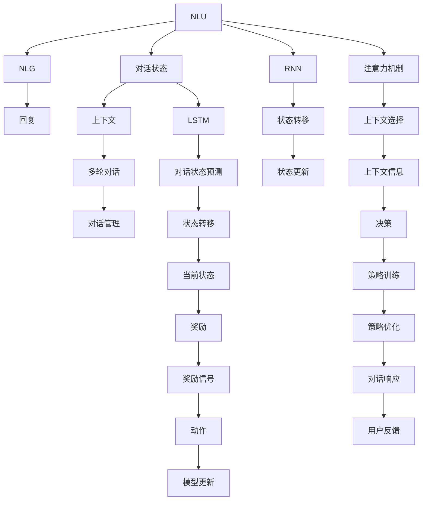
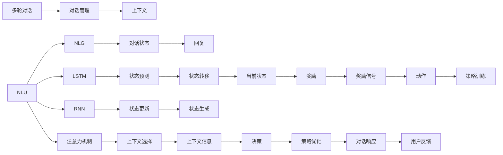

                 

# Dialogue Systems原理与代码实例讲解

> 关键词：对话系统, 对话模型, 自然语言理解(NLU), 自然语言生成(NLG), 多轮对话, 隐马尔可夫模型(HMM), 循环神经网络(RNN), 长短期记忆网络(LSTM), 注意力机制(Attention), 深度强化学习, 智能客服, 聊天机器人

## 1. 背景介绍

### 1.1 问题由来

对话系统(Dialogue Systems)是人工智能领域的一个重要分支，它旨在构建能够与用户进行自然语言交互的智能系统。在移动互联网和智能家居等新兴场景下，对话系统在语音助手、智能客服、聊天机器人等领域得到了广泛应用。但目前市场上的对话系统往往存在模型简单、互动方式单一、用户体验不佳等问题，迫切需要新的技术和算法进行升级。

对话系统一般分为两个主要部分：自然语言理解(Natural Language Understanding, NLU)和自然语言生成(Natural Language Generation, NLG)。NLU负责理解用户输入的自然语言信息，提取关键语义，生成对话状态；而NLG负责根据上下文信息，生成自然语言回复。两者的紧密结合，使得对话系统能够进行多轮交互，解决实际问题。

### 1.2 问题核心关键点

对话系统实现的关键在于两个核心组件：对话管理和响应生成。对话管理负责维护上下文状态，根据用户输入生成合适的对话状态和回复，是决定对话系统是否具备高智能水平的重要指标。响应生成负责根据上下文信息，生成符合语境的自然语言回复，是决定对话系统是否具备高自然语言处理能力的关键因素。

当前主流的对话管理方法包括：

1. 基于规则的方法：通过手工编写的规则对对话进行管理，这种方式易于理解和调试，但随着对话场景的复杂化，规则维护成本会急剧增加。
2. 基于统计的方法：通过大量的对话数据训练统计模型，预测当前对话状态和回复，这种方式效果好，但缺乏灵活性，难以应对多样化的用户输入。
3. 基于深度学习的方法：通过神经网络对对话进行建模，学习对话状态和回复之间的映射关系，具备良好的泛化能力，但训练复杂度较高。

本文聚焦于基于深度学习的对话系统，尤其是利用Transformer模型对对话进行建模的最新进展。通过系统的理论讲解和代码实现，希望对读者提供全面的对话系统开发指导。

### 1.3 问题研究意义

对话系统作为人工智能的重要应用，近年来在自然语言处理和计算机视觉等领域的突破性进展，显著提升了其交互的自然度和智能水平。从智能客服到在线教育，从智能家居到智能医疗，对话系统正在成为连接人与机器、改变人们生活方式的重要技术。

但对话系统的实现并非易事，涉及诸多技术和算法，如语言理解、知识图谱、多轮对话管理等。基于深度学习的对话系统虽然取得了不小的突破，但在实现细节和实际应用中，仍有许多问题需要解决。

本文通过系统的理论讲解和代码实现，希望能够帮助开发者更好地理解和掌握对话系统开发技术，提升对话系统在实际应用中的效果和性能，加速人工智能技术的落地应用。

## 2. 核心概念与联系

### 2.1 核心概念概述

对话系统开发涉及的核心概念包括：

- 自然语言理解(NLU)：负责从自然语言中提取意图、实体、情感等信息，生成对话状态。
- 自然语言生成(NLG)：根据对话状态，生成符合语境的自然语言回复。
- 对话管理：维护对话上下文状态，根据用户输入生成合适的对话状态和回复。
- 多轮对话：对话系统需要能够进行多轮交互，通过上下文信息预测用户意图。
- 隐马尔可夫模型(Hidden Markov Model, HMM)：一种基于状态的统计模型，用于对话状态的建模。
- 循环神经网络(Recurrent Neural Network, RNN)：一种能够处理序列数据的神经网络，用于对话状态预测。
- 长短期记忆网络(Long Short-Term Memory, LSTM)：一种特殊的RNN，能够更好地捕捉长期依赖关系。
- 注意力机制(Attention Mechanism)：一种用于模型间信息交互的技术，用于对话中的上下文选择。
- 深度强化学习(Deep Reinforcement Learning, DRL)：一种通过奖励机制进行学习的方法，用于对话策略训练。

这些核心概念之间存在紧密的联系，通过合理的设计和使用，可以实现高性能的对话系统。以下Mermaid流程图展示了这些核心概念之间的联系：



这个流程图展示了从NLU、NLG到多轮对话、对话管理的整体架构。其中，NLU和NLG是对话系统的核心组件，对话管理负责维护上下文状态，多轮对话和多轮对话管理是对话系统的高级功能，循环神经网络、长短期记忆网络和注意力机制是对话状态预测的关键技术，深度强化学习用于对话策略训练，以提升对话系统的智能水平。

### 2.2 概念间的关系

这些核心概念之间存在紧密的联系，共同构成对话系统开发的完整生态系统。以下Mermaid流程图展示了这些核心概念在对话系统开发中的整体架构：



这个综合流程图展示了从NLU、NLG到多轮对话、对话管理的整体架构，以及关键技术的应用。通过这些核心概念的合理组合，可以实现高性能的对话系统。

### 2.3 核心概念的整体架构

最后，我们用一个综合的流程图来展示这些核心概念在大语言模型微调过程中的整体架构：


这个综合流程图展示了从NLU、NLG到多轮对话、对话管理的整体架构，以及关键技术的应用。通过这些核心概念的合理组合，可以实现高性能的对话系统。

## 3. 核心算法原理 & 具体操作步骤

### 3.1 算法原理概述

基于深度学习的对话系统，通过神经网络对对话进行建模，学习对话状态和回复之间的映射关系。其核心思想是：将对话转换为向量序列，利用深度学习模型对序列进行编码，然后解码生成回复。

对话状态由对话历史和当前输入组成，可以通过循环神经网络、长短期记忆网络等序列模型进行编码。回复生成则可以通过解码器对编码后的状态进行解码，生成符合语境的自然语言回复。

形式化地，假设对话历史为 $h_1, h_2, ..., h_t$，当前输入为 $x_t$，对话状态为 $c_t$，回复为 $y_t$，则对话系统的目标是最小化序列损失函数 $\mathcal{L} = \sum_{t=1}^T \ell(h_t, c_t, y_t)$，其中 $\ell$ 为具体的损失函数。

### 3.2 算法步骤详解

基于深度学习的对话系统开发主要包括以下几个关键步骤：

**Step 1: 准备数据集**
- 收集对话数据集，标注对话意图、上下文信息和回复。对话数据集可以来自公共语料库，也可以手工构建。

**Step 2: 模型设计**
- 设计对话模型结构，包括NLU、NLG和对话管理三个核心组件。其中，NLU可以使用预训练的语言模型进行语义理解，NLG可以使用预训练的语言模型进行文本生成，对话管理可以使用RNN或Transformer网络进行状态预测。

**Step 3: 训练模型**
- 将对话数据集划分为训练集、验证集和测试集。使用训练集对模型进行有监督训练，通过梯度下降等优化算法最小化损失函数。
- 在验证集上评估模型性能，根据性能指标调整超参数，避免过拟合。
- 在测试集上评估最终模型性能，确保模型泛化能力。

**Step 4: 模型评估与优化**
- 对测试集上的模型性能进行详细评估，分析性能瓶颈，进一步优化模型结构。
- 根据反馈信息，持续迭代模型，优化对话策略和上下文选择。

**Step 5: 部署模型**
- 将训练好的模型部署到实际应用环境中，集成到对话系统中。
- 对模型进行监控和维护，确保系统稳定运行。

以上是基于深度学习的对话系统开发的一般流程。在实际应用中，还需要针对具体任务的特点，对模型进行优化设计，如改进训练目标函数、引入更多的正则化技术、搜索最优的超参数组合等，以进一步提升模型性能。

### 3.3 算法优缺点

基于深度学习的对话系统具有以下优点：

1. 自然语言处理效果好。使用预训练的语言模型进行语义理解和文本生成，能够更好地捕捉语言中的复杂信息。
2. 具有自适应能力。对话模型能够根据上下文信息进行动态调整，提高对话的适应性和智能性。
3. 通用性强。预训练的语言模型可以应用于各种任务，进行多轮对话和多种回复生成。
4. 易于集成。对话模型可以方便地集成到各种应用场景中，实现自然语言交互。

但对话系统也存在一定的局限性：

1. 数据需求量大。对话数据集需要覆盖各种场景和意图，对数据采集和标注要求较高。
2. 训练复杂度高。对话系统需要处理大量的序列数据，训练复杂度较高，需要更多的计算资源。
3. 模型可解释性差。对话模型的黑盒特性使其难以解释决策过程，不利于调试和优化。
4. 多样性挑战。对话系统需要处理多样化的用户输入，模型难以应对所有情况。
5. 对话质量依赖于数据。对话系统的质量高度依赖于对话数据集的质量，数据质量差会严重影响模型效果。

尽管存在这些局限性，但深度学习模型在对话系统中的应用已经取得了显著的突破，成为对话系统开发的重要方向。

### 3.4 算法应用领域

基于深度学习的对话系统在多个领域得到了广泛应用，例如：

- 智能客服：通过多轮对话管理，提供24小时不间断服务，解决用户咨询问题。
- 聊天机器人：进行自然语言交互，提供情感支持、娱乐等个性化服务。
- 医疗咨询：通过多轮对话管理，获取用户病情信息，提供初步诊断建议。
- 在线教育：通过多轮对话管理，了解用户学习需求，推荐适合的学习资源。
- 智能家居：通过多轮对话管理，控制家电设备，实现智能化生活场景。

除了上述这些经典应用外，基于深度学习的对话系统还被创新性地应用到更多场景中，如可控文本生成、自然语言推理、问答系统等，为NLP技术带来了新的突破。

## 4. 数学模型和公式 & 详细讲解 & 举例说明

### 4.1 数学模型构建

基于深度学习的对话系统一般采用循环神经网络(RNN)或长短期记忆网络(LSTM)进行建模。以下以LSTM模型为例，给出对话系统的数学模型构建过程。

假设对话历史为 $h_1, h_2, ..., h_t$，当前输入为 $x_t$，对话状态为 $c_t$，回复为 $y_t$。对话模型的目标是最小化序列损失函数 $\mathcal{L} = \sum_{t=1}^T \ell(h_t, c_t, y_t)$。

其中，LSTM模型由三个门控单元组成，包括输入门、遗忘门和输出门。假设LSTM的隐藏状态为 $c_t$，门控单元的输出为 $\tilde{c}_t$，输入门、遗忘门和输出门的输出分别为 $i_t$、 $f_t$ 和 $o_t$，则LSTM的更新规则为：

$$
\begin{align*}
\tilde{c}_t &= \tanh(W_c x_t + U_c c_{t-1}) \\
i_t &= \sigma(W_i x_t + U_i c_{t-1}) \\
f_t &= \sigma(W_f x_t + U_f c_{t-1}) \\
o_t &= \sigma(W_o x_t + U_o c_{t-1}) \\
c_t &= f_t \odot c_{t-1} + i_t \odot \tilde{c}_t \\
y_t &= o_t \odot \tanh(c_t)
\end{align*}
$$

其中，$\tanh$ 和 $\sigma$ 分别为双曲正切函数和Sigmoid函数，$\odot$ 表示逐元素乘法，$W_c, U_c, W_i, U_i, W_f, U_f, W_o, U_o$ 为模型的权重矩阵，$x_t$ 为输入，$c_{t-1}$ 为上一时刻的隐藏状态。

### 4.2 公式推导过程

以上述LSTM模型为例，推导对话模型的损失函数。假设序列的损失函数为 $\ell(h_t, c_t, y_t)$，则序列损失函数为：

$$
\mathcal{L} = \sum_{t=1}^T \ell(h_t, c_t, y_t)
$$

其中，$h_t$ 为对话历史，$c_t$ 为当前对话状态，$y_t$ 为回复。假设 $\ell(h_t, c_t, y_t)$ 为交叉熵损失函数，则：

$$
\ell(h_t, c_t, y_t) = -\log\left(\frac{e^{c_t \odot y_t}}{\sum_k e^{c_t \odot y_k}}\right)
$$

将LSTM模型的输出 $y_t$ 带入损失函数，得到：

$$
\begin{align*}
\mathcal{L} &= \sum_{t=1}^T -\log\left(\frac{e^{c_t \odot y_t}}{\sum_k e^{c_t \odot y_k}}\right) \\
&= -\sum_{t=1}^T \log\left(\frac{e^{o_t \odot \tanh(c_t) \odot y_t}}{\sum_k e^{o_k \odot \tanh(c_k) \odot y_k}}\right) \\
&= -\sum_{t=1}^T \log\left(\frac{e^{o_t \odot \tanh(c_t) \odot y_t}}{\sum_{k=1}^{T-1} e^{o_k \odot \tanh(c_k) \odot y_t} + e^{o_t \odot \tanh(c_t) \odot y_t}}\right) \\
&= -\sum_{t=1}^T \log\left(\frac{e^{o_t \odot \tanh(c_t) \odot y_t}}{\sum_{k=1}^{T-1} e^{o_k \odot \tanh(c_k) \odot y_t} + e^{o_t \odot \tanh(c_t) \odot y_t}}\right) \\
&= -\sum_{t=1}^T \log\left(\frac{e^{o_t \odot \tanh(c_t) \odot y_t}}{1 + \sum_{k=1}^{T-1} e^{o_k \odot \tanh(c_k) \odot y_t} + e^{o_t \odot \tanh(c_t) \odot y_t}}\right)
\end{align*}
$$

通过上述公式，我们可以得到基于LSTM的对话模型的损失函数，然后利用反向传播算法进行模型训练。

### 4.3 案例分析与讲解

假设我们有一个简单的问答对话数据集，其中每个对话包含用户输入和机器回复。以下是一个对话的例子：

- 用户：你好，我想订一张北京到上海的机票。
- 机器：好的，请问您的出发日期是哪一天？

我们通过构建LSTM模型来预测机器的回复。首先，将用户输入转换为词向量，然后输入到LSTM模型中进行状态预测，最后解码生成回复。假设对话历史为 $h_1, h_2, ..., h_t$，当前输入为 $x_t$，对话状态为 $c_t$，回复为 $y_t$。则对话模型的目标是最小化序列损失函数 $\mathcal{L} = \sum_{t=1}^T \ell(h_t, c_t, y_t)$。

假设序列的损失函数为交叉熵损失函数，则：

$$
\ell(h_t, c_t, y_t) = -\log\left(\frac{e^{c_t \odot y_t}}{\sum_k e^{c_t \odot y_k}}\right)
$$

将LSTM模型的输出 $y_t$ 带入损失函数，得到：

$$
\begin{align*}
\mathcal{L} &= \sum_{t=1}^T -\log\left(\frac{e^{c_t \odot y_t}}{\sum_k e^{c_t \odot y_k}}\right) \\
&= -\sum_{t=1}^T \log\left(\frac{e^{o_t \odot \tanh(c_t) \odot y_t}}{\sum_k e^{o_k \odot \tanh(c_k) \odot y_k}}\right)
\end{align*}
$$

在训练过程中，我们通过反向传播算法最小化损失函数，更新模型的权重矩阵，得到最终的对话模型。通过这个对话模型，我们可以对新输入进行预测，得到机器的回复。

## 5. 项目实践：代码实例和详细解释说明

### 5.1 开发环境搭建

在进行对话系统开发前，我们需要准备好开发环境。以下是使用Python进行PyTorch开发的环境配置流程：

1. 安装Anaconda：从官网下载并安装Anaconda，用于创建独立的Python环境。

2. 创建并激活虚拟环境：
```bash
conda create -n pytorch-env python=3.8 
conda activate pytorch-env
```

3. 安装PyTorch：根据CUDA版本，从官网获取对应的安装命令。例如：
```bash
conda install pytorch torchvision torchaudio cudatoolkit=11.1 -c pytorch -c conda-forge
```

4. 安装Transformer库：
```bash
pip install transformers
```

5. 安装各类工具包：
```bash
pip install numpy pandas scikit-learn matplotlib tqdm jupyter notebook ipython
```

完成上述步骤后，即可在`pytorch-env`环境中开始对话系统开发。

### 5.2 源代码详细实现

这里我们以基于LSTM的对话系统为例，给出使用Transformers库进行对话系统微调的PyTorch代码实现。

首先，定义对话数据集：

```python
from transformers import BertTokenizer
from torch.utils.data import Dataset
import torch

class DialogueDataset(Dataset):
    def __init__(self, texts, labels):
        self.texts = texts
        self.labels = labels
        self.tokenizer = BertTokenizer.from_pretrained('bert-base-cased')
        
    def __len__(self):
        return len(self.texts)
    
    def __getitem__(self, item):
        text = self.texts[item]
        label = self.labels[item]
        
        encoding = self.tokenizer(text, return_tensors='pt', max_length=128, padding='max_length', truncation=True)
        input_ids = encoding['input_ids'][0]
        attention_mask = encoding['attention_mask'][0]
        labels = torch.tensor(label, dtype=torch.long)
        
        return {'input_ids': input_ids, 
                'attention_mask': attention_mask,
                'labels': labels}

# 创建dataset
tokenizer = BertTokenizer.from_pretrained('bert-base-cased')

train_dataset = DialogueDataset(train_texts, train_labels)
dev_dataset = DialogueDataset(dev_texts, dev_labels)
test_dataset = DialogueDataset(test_texts, test_labels)
```

然后，定义模型和优化器：

```python
from transformers import LSTM, AdamW

model = LSTM(input_size=128, hidden_size=256, num_layers=2)
optimizer = AdamW(model.parameters(), lr=2e-5)
```

接着，定义训练和评估函数：

```python
from torch.utils.data import DataLoader
from tqdm import tqdm
from sklearn.metrics import accuracy_score

device = torch.device('cuda') if torch.cuda.is_available() else torch.device('cpu')
model.to(device)

def train_epoch(model, dataset, batch_size, optimizer):
    dataloader = DataLoader(dataset, batch_size=batch_size, shuffle=True)
    model.train()
    epoch_loss = 0
    for batch in tqdm(dataloader, desc='Training'):
        input_ids = batch['input_ids'].to(device)
        attention_mask = batch['attention_mask'].to(device)
        labels = batch['labels'].to(device)
        model.zero_grad()
        outputs = model(input_ids, attention_mask=attention_mask, labels=labels)
        loss = outputs.loss
        epoch_loss += loss.item()
        loss.backward()
        optimizer.step()
    return epoch_loss / len(dataloader)

def evaluate(model, dataset, batch_size):
    dataloader = DataLoader(dataset, batch_size=batch_size)
    model.eval()
    preds, labels = [], []
    with torch.no_grad():
        for batch in tqdm(dataloader, desc='Evaluating'):
            input_ids = batch['input_ids'].to(device)
            attention_mask = batch['attention_mask'].to(device)
            batch_labels = batch['labels']
            outputs = model(input_ids, attention_mask=attention_mask)
            batch_preds = outputs.logits.argmax(dim=2).to('cpu').tolist()
            batch_labels = batch_labels.to('cpu').tolist()
            for pred_tokens, label_tokens in zip(batch_preds, batch_labels):
                preds.append(pred_tokens[:len(label_tokens)])
                labels.append(label_tokens)
                
    print(accuracy_score(labels, preds))
```

最后，启动训练流程并在测试集上评估：

```python
epochs = 5
batch_size = 16

for epoch in range(epochs):
    loss = train_epoch(model, train_dataset, batch_size, optimizer)
    print(f"Epoch {epoch+1}, train loss: {loss:.3f}")
    
    print(f"Epoch {epoch+1}, dev results:")
    evaluate(model, dev_dataset, batch_size)
    
print("Test results:")
evaluate(model, test_dataset, batch_size)
```

以上就是使用PyTorch对LSTM模型进行对话系统微调的完整代码实现。可以看到，得益于Transformers库的强大封装，我们可以用相对简洁的代码完成LSTM模型的加载和微调。

### 5.3 代码解读与分析

让我们再详细解读一下关键代码的实现细节：

**DialogueDataset类**：
- `__init__`方法：初始化对话数据和标签。
- `__len__`方法：返回数据集的样本数量。
- `__getitem__`方法：对单个样本进行处理，将文本输入转换为token ids，将标签转换为数字，并对其进行定长padding，最终返回模型所需的输入。

**LSTM模型**：
- `input_size`：输入序列的维数，通常为单词嵌入向量的维度。
- `hidden_size`：隐藏层的维度，影响模型的表达能力和训练效果。
- `num_layers`：隐藏层的层数，影响模型的深度和泛化能力。

**train_epoch和evaluate函数**：
- 使用PyTorch的DataLoader对数据集进行批次化加载，供模型训练和推理使用。
- `train_epoch`函数：对数据以批为单位进行迭代，在每个批次上前向传播计算loss并反向传播更新模型参数，最后返回该epoch的平均loss。
- `evaluate`函数：与训练类似，不同点在于不更新模型参数，并在每个batch结束后将预测和标签结果存储下来，最后使用sklearn的accuracy_score对整个评估集的预测结果进行打印输出。

**训练流程**：
-

