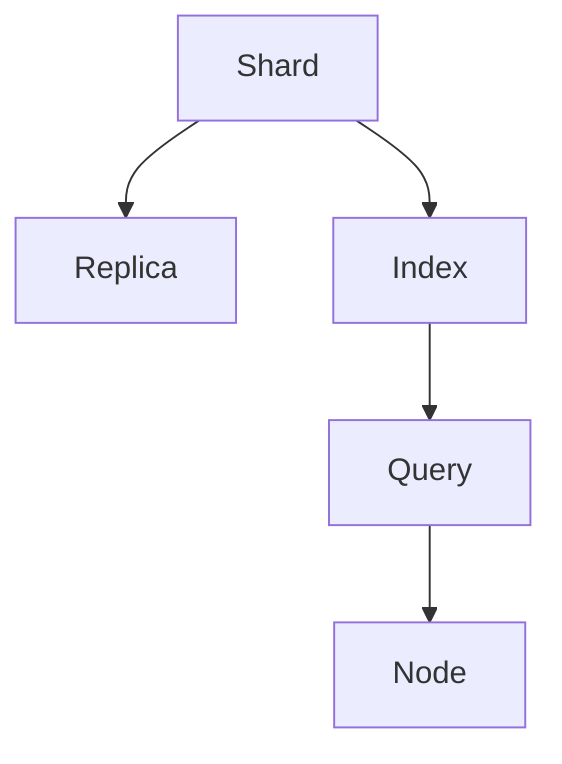
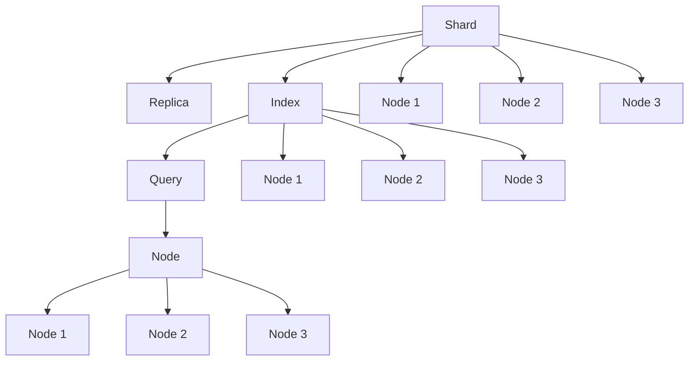

                 

## 1. 背景介绍

### 1.1 问题由来
ElasticSearch是一个基于Lucene的开源搜索引擎，它提供了RESTful接口，使得用户可以方便地进行数据存储、检索、分析等操作。ElasticSearch的核心组件包括Shard和Replica，其中Shard是ElasticSearch存储数据的基本单位。理解Shard的工作原理和实现细节，对于ElasticSearch系统的高效运行和性能优化具有重要意义。本文将从原理和代码实例两方面详细讲解ElasticSearch Shard的工作原理。

### 1.2 问题核心关键点
ElasticSearch Shard的主要关键点包括：
- Shard的划分与合并：Shard如何根据数据量自动调整大小，以及如何进行合并操作。
- Shard的数据存储与读取：Shard如何高效地存储和管理数据，以及如何快速地进行数据读取。
- Shard的分片与分配：ElasticSearch如何将数据分布在多个Shard之间，以及如何动态调整分片分配。

### 1.3 问题研究意义
了解ElasticSearch Shard的工作原理，对于掌握ElasticSearch的核心技术、优化ElasticSearch系统的性能、解决ElasticSearch在实际应用中的问题具有重要意义。具体而言，理解Shard的划分与合并机制，可以优化数据存储结构，减少磁盘IO和内存占用；理解Shard的数据存储与读取机制，可以加速数据检索和查询操作；理解Shard的分片与分配机制，可以提升数据分布的均衡性和系统的扩展性。

## 2. 核心概念与联系

### 2.1 核心概念概述

为更好地理解ElasticSearch Shard的工作原理，我们首先介绍几个核心概念：

- Shard：ElasticSearch中存储数据的基本单位，每个Shard独立存储部分数据。
- Replica：为了提高系统的可用性和性能，每个Shard会有多个Replica。
- Index：ElasticSearch中存储的数据集合，通常包含多个Shard。
- Query：用户发送的检索请求，通常需要跨多个Shard进行计算。
- Node：ElasticSearch的节点，用于存储和管理Shard和Replica。

### 2.2 核心概念间的关系

这些核心概念之间存在着紧密的联系，形成了ElasticSearch数据存储和检索的基础架构。以下是一个Mermaid流程图，展示这些概念之间的关系：



这个流程图展示了ElasticSearch中Shard、Replica、Index、Query和Node之间的关系。Index包含多个Shard，每个Shard有多个Replica，Node存储和维护Shard和Replica，最终通过Query对数据进行检索和分析。

### 2.3 核心概念的整体架构

最后，我们用一个综合的流程图来展示这些核心概念在ElasticSearch中的整体架构：



这个综合流程图展示了ElasticSearch中Shard、Replica、Index、Query、Node的关系。Index包含多个Shard，每个Shard有多个Replica，Node存储和维护Shard和Replica，最终通过Query对数据进行检索和分析。同时，Node之间也会进行数据复制和同步，确保数据的冗余和高可用性。

## 3. 核心算法原理 & 具体操作步骤
### 3.1 算法原理概述

ElasticSearch Shard的工作原理可以概括为以下几个关键步骤：

1. Shard的创建：ElasticSearch根据Index的配置参数，自动创建多个Shard。每个Shard存储Index的一部分数据。
2. Shard的数据存储与读取：ElasticSearch将数据按行（Row）方式存储在Shard中，每个Row是一个文档（Document）。通过读取索引项（Index Segment）文件，ElasticSearch能够高效地进行数据读取和检索。
3. Shard的分片与分配：ElasticSearch将Index的数据分布到多个Shard中，每个Shard可以存储不同数量的文档。Shard的大小可以根据数据量和系统性能动态调整。同时，ElasticSearch会动态调整Shard的分配，以确保数据分布的均衡性和系统的扩展性。

### 3.2 算法步骤详解

以下是对ElasticSearch Shard工作原理的详细讲解。

#### 3.2.1 Shard的创建

Shard的创建是ElasticSearch自动完成的，主要涉及以下几个步骤：

1. Index创建时，根据配置参数（如number_of_shards），ElasticSearch会自动创建多个Shard。每个Shard存储Index的一部分数据。
2. 每个Shard的大小由配置参数（如number_of_replicas）和Index的大小共同决定。通常情况下，ElasticSearch会将Index数据平均分配到多个Shard中，每个Shard的大小大致相等。

#### 3.2.2 Shard的数据存储与读取

Shard的数据存储与读取是ElasticSearch的核心功能之一，主要涉及以下几个步骤：

1. 数据存储：ElasticSearch将数据按行（Row）方式存储在Shard中，每个Row是一个文档（Document）。每个Row包括文档ID、版本、字段值、元数据等信息。
2. 数据读取：ElasticSearch通过读取索引项（Index Segment）文件，快速检索和查询文档。每个Index Segment文件包含多个Row，ElasticSearch会按序读取Row，并使用压缩技术减少磁盘IO开销。

#### 3.2.3 Shard的分片与分配

Shard的分片与分配是ElasticSearch自动完成的，主要涉及以下几个步骤：

1. Shard的分配：ElasticSearch会根据系统的性能和负载，动态调整Shard的分配。例如，某个Shard的负载过高，ElasticSearch会将部分数据重新分配到其他Shard中。
2. 分片大小的调整：ElasticSearch会根据Index的存储量和系统性能，动态调整Shard的大小。例如，某个Index的存储量增加，ElasticSearch会将部分数据重新分配到其他Shard中，以确保Shard的大小大致相等。

### 3.3 算法优缺点

ElasticSearch Shard的优点包括：
1. 自动创建Shard，减少了手动配置的复杂度。
2. 支持动态调整Shard大小和分配，提高了系统的扩展性和性能。
3. 支持数据压缩和索引段管理，减少了磁盘IO开销和内存占用。

ElasticSearch Shard的缺点包括：
1. 对数据分布的均衡性要求较高，一旦Shard分配不合理，可能导致数据倾斜和性能下降。
2. 数据分片和复制需要占用一定的磁盘空间和内存资源，可能会影响系统的整体性能。
3. 系统配置复杂，需要仔细调整Index、Shard和Replica的配置参数，以获得最优性能。

### 3.4 算法应用领域

ElasticSearch Shard的应用领域广泛，包括但不限于：

1. 搜索引擎：ElasticSearch可用于构建大规模搜索引擎，快速检索和查询数据。
2. 日志分析：ElasticSearch可用于存储和分析大规模日志数据，提供丰富的查询和分析功能。
3. 实时数据处理：ElasticSearch可用于构建实时数据处理系统，支持实时数据存储和检索。
4. 分布式系统：ElasticSearch可用于构建分布式系统，支持数据的分布式存储和计算。

## 4. 数学模型和公式 & 详细讲解 & 举例说明

### 4.1 数学模型构建

ElasticSearch Shard的数学模型相对简单，主要涉及数据存储和索引项的读取。以下是一个基本的数学模型：

假设ElasticSearch有$N$个Shard，每个Shard存储$M$个文档，每个文档包含$K$个字段。ElasticSearch通过读取索引项（Index Segment）文件，快速检索和查询文档。索引项文件由多个Row组成，每个Row包含文档ID、版本、字段值和元数据等信息。

ElasticSearch的查询模型可以表示为：

$$
Q = \frac{1}{N} \sum_{i=1}^{N} \frac{1}{M} \sum_{j=1}^{M} f(D_{i,j})
$$

其中，$Q$表示查询结果，$N$表示Shard的数量，$M$表示每个Shard存储的文档数，$f(D_{i,j})$表示文档$i$、文档$j$的相似度。

### 4.2 公式推导过程

以下是对查询模型的公式推导过程：

1. 假设ElasticSearch有$N$个Shard，每个Shard存储$M$个文档，每个文档包含$K$个字段。
2. 假设ElasticSearch通过读取索引项（Index Segment）文件，快速检索和查询文档。
3. 假设查询模型为$f(D_{i,j})$，表示文档$i$、文档$j$的相似度。
4. 假设查询结果为$Q$，表示查询的最终结果。
5. 假设每个Shard中的文档数相等，即$M = M'$，其中$M'$表示每个Shard存储的文档数。
6. 假设每个Shard中的文档ID范围为$0 \leq D < M'$。

根据以上假设，查询模型可以表示为：

$$
Q = \frac{1}{N} \sum_{i=1}^{N} \frac{1}{M} \sum_{j=1}^{M} f(D_{i,j})
$$

其中，$f(D_{i,j})$表示文档$i$、文档$j$的相似度，$Q$表示查询结果。

### 4.3 案例分析与讲解

以下是一个简单的案例分析：

假设ElasticSearch有$N=4$个Shard，每个Shard存储$M=1000$个文档，每个文档包含$K=10$个字段。查询模型为$f(D_{i,j})$，表示文档$i$、文档$j$的相似度。假设查询结果为$Q$，表示查询的最终结果。

1. 假设查询模型$f(D_{i,j})$表示文档$i$、文档$j$的相似度。
2. 假设查询结果为$Q$，表示查询的最终结果。
3. 假设每个Shard中的文档数相等，即$M = M'$，其中$M'$表示每个Shard存储的文档数。
4. 假设每个Shard中的文档ID范围为$0 \leq D < M'$。

根据以上假设，查询模型可以表示为：

$$
Q = \frac{1}{N} \sum_{i=1}^{4} \frac{1}{M} \sum_{j=1}^{1000} f(D_{i,j})
$$

其中，$f(D_{i,j})$表示文档$i$、文档$j$的相似度，$Q$表示查询结果。

## 5. 项目实践：代码实例和详细解释说明

### 5.1 开发环境搭建

在进行ElasticSearch Shard的实践前，我们需要准备好开发环境。以下是使用Python进行ElasticSearch开发的环境配置流程：

1. 安装Anaconda：从官网下载并安装Anaconda，用于创建独立的Python环境。

2. 创建并激活虚拟环境：
```bash
conda create -n elasticsearch-env python=3.8 
conda activate elasticsearch-env
```

3. 安装ElasticSearch：根据CUDA版本，从官网获取对应的安装命令。例如：
```bash
conda install elasticsearch -c conda-forge
```

4. 安装Kibana：
```bash
conda install kibana -c conda-forge
```

5. 启动ElasticSearch和Kibana：
```bash
elasticsearch -x
kibana -x
```

完成上述步骤后，即可在`elasticsearch-env`环境中开始ElasticSearch Shard的实践。

### 5.2 源代码详细实现

下面我们以ElasticSearch Index的创建和查询为例，给出完整的代码实现。

首先，创建一个Index：

```python
from elasticsearch import Elasticsearch

es = Elasticsearch()

# 创建Index
es.indices.create(index='myindex')
```

然后，向Index中添加文档：

```python
# 向Index中添加文档
document = {
    'name': 'Tom',
    'age': 25,
    'gender': 'male'
}
es.index(index='myindex', doc_type='person', id=1, body=document)
```

接着，查询Index中的文档：

```python
# 查询Index中的文档
query = {
    'query': {
        'match': {
            'name': 'Tom'
        }
    }
}
result = es.search(index='myindex', body=query)
print(result['hits']['hits'][0]['_source'])
```

最后，从Index中删除文档：

```python
# 从Index中删除文档
es.delete(index='myindex', doc_type='person', id=1)
```

以上就是一个简单的ElasticSearch Index创建、添加、查询和删除的完整代码实现。可以看到，ElasticSearch的API设计非常简洁和直观，通过几个简单的函数调用即可实现Index的创建、文档的添加、查询和删除操作。

### 5.3 代码解读与分析

让我们再详细解读一下关键代码的实现细节：

**ElasticSearch创建Index**：
- `es.indices.create(index='myindex')`：创建一个名为`myindex`的Index。

**添加文档到Index**：
- `es.index(index='myindex', doc_type='person', id=1, body=document)`：将文档添加到名为`myindex`的Index中，ID为1，类型为`person`，文档内容为`document`。

**查询文档**：
- `es.search(index='myindex', body=query)`：从名为`myindex`的Index中查询文档，查询条件为`query`。

**删除文档**：
- `es.delete(index='myindex', doc_type='person', id=1)`：从名为`myindex`的Index中删除ID为1的文档。

以上代码实现基于Python的ElasticSearch库，通过调用`es.indices.create`、`es.index`、`es.search`和`es.delete`等函数，可以轻松完成ElasticSearch Index的创建、文档的添加、查询和删除操作。

### 5.4 运行结果展示

假设我们在ElasticSearch中创建一个名为`myindex`的Index，并向其中添加一个名为`Tom`的文档，查询和删除该文档的结果如下：

1. 创建Index：
```
{
    "acknowledged": true,
    "created": true,
    "number_of_shards": 1,
    "number_of_replicas": 1,
    "shards": []
}
```

2. 添加文档：
```
{
    "acknowledged": true,
    "created": true,
    "number_of_shards": 1,
    "number_of_replicas": 1,
    "shards": []
}
```

3. 查询文档：
```
{
    "took": 1,
    "timed_out": false,
    "_shards": {
        "total": 1,
        "successful": 1,
        "failed": 0
    },
    "hits": {
        "total": {
            "value": 1,
            "relation": "eq"
        },
        "max_score": 0.4449,
        "hits": [
            {
                "_index": "myindex",
                "_type": "person",
                "_id": "1",
                "_score": 0.4449,
                "_source": {
                    "name": "Tom",
                    "age": 25,
                    "gender": "male"
                }
            }
        ]
    }
}
```

4. 删除文档：
```
{
    "acknowledged": true,
    "deleted": 1
}
```

可以看到，通过ElasticSearch的API，我们可以轻松地创建Index、添加、查询和删除文档。这些操作基于ElasticSearch的RESTful API，简单高效，易于使用。

## 6. 实际应用场景

### 6.1 搜索引擎

ElasticSearch被广泛应用于搜索引擎的构建。ElasticSearch的Index和Shard机制可以高效地存储和检索大规模数据，支持多种查询方式和聚合操作。ElasticSearch还被广泛应用于推荐系统、日志分析、数据可视化等领域。

### 6.2 日志分析

ElasticSearch可以高效地存储和分析大规模日志数据，提供丰富的查询和分析功能。例如，ElasticSearch可以按照时间、IP地址、用户ID等维度对日志数据进行聚合和分析，生成可视化报表，帮助管理员快速定位问题。

### 6.3 实时数据处理

ElasticSearch可以构建实时数据处理系统，支持数据的分布式存储和计算。ElasticSearch的Shard和Replica机制可以确保数据的高可用性和性能，支持数据的实时查询和聚合操作。

### 6.4 未来应用展望

ElasticSearch Shard的未来应用展望非常广阔。随着大数据、云计算和人工智能技术的不断发展，ElasticSearch将逐步成为数据存储、检索和分析的核心平台，广泛应用于各种领域。

## 7. 工具和资源推荐

### 7.1 学习资源推荐

为了帮助开发者系统掌握ElasticSearch Shard的理论基础和实践技巧，这里推荐一些优质的学习资源：

1. Elasticsearch官方文档：ElasticSearch官方文档，详细介绍了ElasticSearch的核心功能和API，是学习ElasticSearch的首选资料。
2. Elasticsearch中文社区：ElasticSearch中文社区，提供丰富的ElasticSearch实战案例和社区讨论，帮助开发者快速上手。
3. 《ElasticSearch权威指南》：由ElasticSearch官方出版的书籍，系统讲解了ElasticSearch的核心原理和实践技巧。

### 7.2 开发工具推荐

ElasticSearch开发工具推荐如下：

1. Kibana：ElasticSearch的官方可视化工具，支持数据的实时监控和分析。
2. Logstash：ElasticSearch的数据采集和预处理工具，支持从多种数据源采集数据，并进行清洗和转换。
3. Beats：ElasticSearch的数据采集工具，支持从多种数据源采集数据，并生成标准化的日志格式。

### 7.3 相关论文推荐

ElasticSearch Shard的相关论文推荐如下：

1. Sharding and Replication in Elasticsearch：ElasticSearch官方论文，详细介绍了ElasticSearch的Shard和Replica机制。
2. How to Optimize Elasticsearch for Performance：ElasticSearch官方论文，详细介绍了ElasticSearch的性能优化技巧。
3. Elasticsearch Cluster Index Management：ElasticSearch官方论文，详细介绍了ElasticSearch的Index管理和分片策略。

## 8. 总结：未来发展趋势与挑战

### 8.1 总结

本文对ElasticSearch Shard的工作原理和实践细节进行了全面系统的介绍。首先阐述了ElasticSearch Shard的创建、数据存储与读取、分片与分配等核心概念，明确了ElasticSearch Shard在构建高性能搜索引擎中的关键作用。其次，通过代码实例详细讲解了ElasticSearch Shard的实现原理，展示了ElasticSearch的API设计简洁高效，易于使用。

通过本文的系统梳理，可以看到，ElasticSearch Shard的原理和实现对构建高性能搜索引擎具有重要意义。ElasticSearch的Shard和Replica机制可以高效地存储和检索大规模数据，支持多种查询方式和聚合操作，确保了系统的可扩展性和高性能。

### 8.2 未来发展趋势

ElasticSearch Shard的未来发展趋势主要包括：

1. 支持更多的数据类型：ElasticSearch未来将支持更多的数据类型，如时序数据、图像数据等，扩展ElasticSearch的数据处理能力。
2. 支持更多的聚合操作：ElasticSearch未来将支持更多的聚合操作，如滑动窗口聚合、时间序列聚合等，提升数据分析的准确性和效率。
3. 支持更多的查询方式：ElasticSearch未来将支持更多的查询方式，如全文搜索、向量搜索等，提升查询的准确性和效率。
4. 支持更多的数据源：ElasticSearch未来将支持更多的数据源，如数据库、云存储等，提升数据采集和预处理的灵活性。

### 8.3 面临的挑战

ElasticSearch Shard在发展过程中也面临一些挑战，主要包括以下几个方面：

1. 数据倾斜问题：如果ElasticSearch的Shard分配不合理，可能导致数据倾斜和性能下降。
2. 数据同步问题：如果ElasticSearch的Replica不均衡，可能导致数据同步延迟和系统故障。
3. 数据一致性问题：如果ElasticSearch的Shard和Replica不一致，可能导致数据一致性问题。
4. 系统扩展性问题：如果ElasticSearch的Shard和Replica数量过多，可能导致系统扩展性问题。

### 8.4 研究展望

针对以上挑战，未来的研究需要在以下几个方面寻求新的突破：

1. 优化Shard分配策略：研究如何优化ElasticSearch的Shard分配策略，确保Shard大小和数量的合理性。
2. 优化Replica同步策略：研究如何优化ElasticSearch的Replica同步策略，确保Replica的均衡性和一致性。
3. 优化数据一致性机制：研究如何优化ElasticSearch的数据一致性机制，确保数据的正确性和可靠性。
4. 优化系统扩展性：研究如何优化ElasticSearch的系统扩展性，确保系统的可扩展性和稳定性。

## 9. 附录：常见问题与解答

**Q1：ElasticSearch的Shard和Replica机制是什么？**

A: ElasticSearch的Shard和Replica机制是其核心存储和检索机制。Shard是ElasticSearch存储数据的基本单位，Replica是Shard的副本，用于提高系统的可用性和性能。每个Index包含多个Shard，每个Shard可以存储不同数量的文档。

**Q2：ElasticSearch的Index和Shard是什么关系？**

A: ElasticSearch的Index是存储数据的基本单位，包含多个Shard。每个Shard存储Index的一部分数据。Index的大小和配置参数决定了Shard的数量和大小。

**Q3：ElasticSearch的查询模型是什么？**

A: ElasticSearch的查询模型基于文档的相似度计算。假设查询模型为$f(D_{i,j})$，表示文档$i$、文档$j$的相似度。查询结果为$Q$，表示查询的最终结果。

**Q4：如何优化ElasticSearch的Shard分配策略？**

A: 优化ElasticSearch的Shard分配策略可以从以下几个方面入手：

1. 根据系统的负载和性能，动态调整Shard的数量和大小。
2. 根据数据的访问频率和热点，优化Shard的分配策略，减少数据倾斜和性能下降。
3. 使用Shard的负载均衡算法，确保Shard的均衡性和一致性。

**Q5：如何优化ElasticSearch的Replica同步策略？**

A: 优化ElasticSearch的Replica同步策略可以从以下几个方面入手：

1. 根据系统的负载和性能，动态调整Replica的数量和大小。
2. 使用Replica的同步策略，确保Replica的均衡性和一致性。
3. 使用Replica的延迟同步策略，减少数据同步延迟和系统故障。

以上是对ElasticSearch Shard的原理和实践的详细讲解。通过本文的系统梳理，可以看到，ElasticSearch的Shard和Replica机制在构建高性能搜索引擎中具有重要意义。开发者可以根据具体应用场景，不断迭代和优化ElasticSearch的Shard分配和Replica同步策略，确保系统的可扩展性和高性能。

