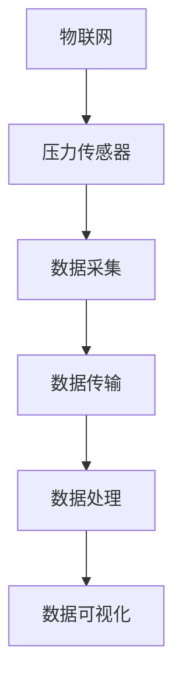
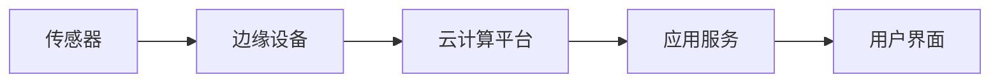
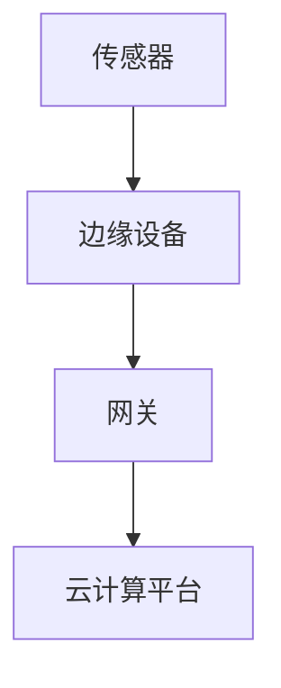
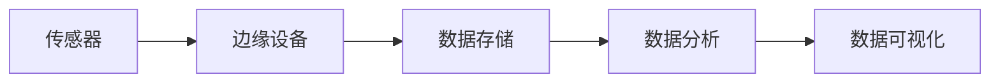
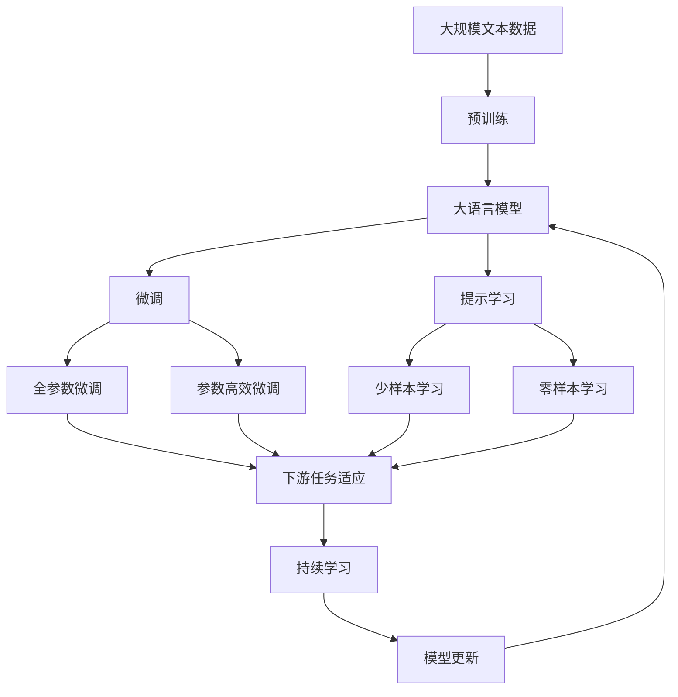

                 

# 物联网(IoT)技术和各种传感器设备的集成：压力传感器的物联网实践

## 1. 背景介绍

### 1.1 问题由来

随着物联网(IoT)技术的迅猛发展，传感器设备在各个领域的应用越来越广泛。从工业制造到智慧农业，从智能家居到健康医疗，传感器作为物联网的“感知器官”，承担着数据采集和信息传输的重要角色。其中，压力传感器作为最常用的传感器之一，广泛应用于各种场景，用于监测物理参数如压力、力、流量、压强等。本文将详细探讨压力传感器的物联网实践，通过实际案例和理论分析，展示如何通过物联网技术实现压力传感器数据的智能采集和处理。

### 1.2 问题核心关键点

本文的核心问题是如何将压力传感器与物联网技术有效结合，实现数据的智能采集、传输、处理和分析。具体来说，包括：

- 压力传感器的数据采集：通过何种方式高效、准确地采集压力传感器数据？
- 数据传输：如何确保数据从传感器传输到云端或本地处理系统的安全性和稳定性？
- 数据处理：如何将采集到的压力数据进行预处理、分析、存储和可视化？
- 应用场景：在哪些行业和场景中，压力传感器能够发挥重要作用？

### 1.3 问题研究意义

压力传感器在物联网中的应用，对于提升生产效率、优化工艺流程、提高设备运行安全性具有重要意义。通过物联网技术实现压力数据的智能采集和处理，可以：

1. **提高生产效率**：实时监控生产设备的压力状态，及时发现和解决问题，减少停机时间和物料浪费。
2. **优化工艺流程**：通过分析压力数据，优化生产工艺参数，提高产品质量和生产效率。
3. **提升设备安全性**：实时监控设备的压力状态，防止设备故障导致安全事故，保障人员和设备的安全。
4. **降低运营成本**：通过智能监测和预测，减少设备维护和故障处理成本。

## 2. 核心概念与联系

### 2.1 核心概念概述

为更好地理解压力传感器在物联网中的应用，本节将介绍几个密切相关的核心概念：

- **物联网(IoT)**：通过网络技术实现物理世界和信息世界之间互联互通的技术体系，包括传感器、终端设备、云计算平台等。
- **压力传感器**：一种能够感知并测量压力变化的传感器设备，广泛应用于工业制造、健康医疗、智能家居等领域。
- **数据采集**：通过传感器设备获取物理世界中的实时数据，并进行预处理和编码，以便于传输和存储。
- **数据传输**：通过无线网络或有线网络，将采集到的数据从传感器传输到云端或本地处理系统的过程。
- **数据处理**：对采集到的数据进行清洗、预处理、分析和存储，以提取有价值的信息。
- **数据可视化**：将处理后的数据以图表、报告等形式展示出来，帮助用户进行决策和分析。

这些核心概念之间的逻辑关系可以通过以下Mermaid流程图来展示：



这个流程图展示了大语言模型微调过程中各个核心概念的关系：

1. 物联网通过压力传感器获取数据。
2. 数据通过无线网络或有线网络传输。
3. 数据经过预处理、分析、存储后，进行可视化展示。

### 2.2 概念间的关系

这些核心概念之间存在着紧密的联系，形成了物联网技术的完整生态系统。下面我通过几个Mermaid流程图来展示这些概念之间的关系。

#### 2.2.1 物联网的应用架构



这个流程图展示了物联网技术的基本应用架构：

1. 传感器采集物理数据。
2. 数据传输到边缘设备进行初步处理。
3. 处理后的数据上传到云计算平台。
4. 应用服务进行数据存储和分析。
5. 用户界面展示分析结果。

#### 2.2.2 数据传输协议



这个流程图展示了数据传输的常见协议：

1. 传感器采集物理数据。
2. 数据通过边缘设备进行初步处理。
3. 处理后的数据通过网关传输到云计算平台。

#### 2.2.3 数据处理流程



这个流程图展示了数据处理的基本流程：

1. 传感器采集物理数据。
2. 数据通过边缘设备进行初步处理。
3. 处理后的数据存储在数据仓库中。
4. 通过数据分析服务对数据进行处理。
5. 处理后的数据进行可视化展示。

### 2.3 核心概念的整体架构

最后，我们用一个综合的流程图来展示这些核心概念在大语言模型微调过程中的整体架构：



这个综合流程图展示了从预训练到微调，再到持续学习的完整过程。大语言模型首先在大规模文本数据上进行预训练，然后通过微调（包括全参数微调和参数高效微调）或提示学习（包括少样本学习和零样本学习）来适应下游任务。最后，通过持续学习技术，模型可以不断更新和适应新的任务和数据。

## 3. 核心算法原理 & 具体操作步骤
### 3.1 算法原理概述

基于物联网技术的压力传感器数据采集和处理，主要涉及数据采集、数据传输、数据存储、数据分析和数据可视化等步骤。以下是对这些步骤的详细介绍：

- **数据采集**：通过压力传感器实时采集压力数据，并将其转换为数字信号。
- **数据传输**：将采集到的数字信号通过无线网络或有线网络传输到云端或本地处理系统。
- **数据存储**：将采集到的数据存储在云端或本地数据库中。
- **数据处理**：对存储的数据进行清洗、预处理、分析和可视化。
- **数据可视化**：将分析结果以图表、报告等形式展示出来，帮助用户进行决策和分析。

### 3.2 算法步骤详解

以下是对这些步骤的详细讲解：

#### 3.2.1 数据采集

数据采集是物联网应用的基础。对于压力传感器，其数据采集过程主要包括：

1. **传感器选择**：根据应用场景选择合适的压力传感器，如压电式传感器、应变片传感器、压阻式传感器等。
2. **电路连接**：将传感器与微控制器或嵌入式系统连接，实现数据采集。
3. **数据编码**：将传感器采集到的模拟信号转换为数字信号，并进行编码，以便于传输。

#### 3.2.2 数据传输

数据传输是物联网应用的关键环节。对于压力传感器，其数据传输过程主要包括：

1. **传输协议选择**：选择适合的传输协议，如MQTT、HTTP、CoAP等。
2. **网络部署**：部署无线网络或有线网络，确保数据的可靠传输。
3. **数据安全**：采用加密技术，确保数据在传输过程中的安全性。

#### 3.2.3 数据存储

数据存储是物联网应用的重要环节。对于压力传感器，其数据存储过程主要包括：

1. **数据仓库选择**：选择适合的数据仓库，如Hadoop、AWS、Google Cloud等。
2. **数据备份**：定期备份数据，确保数据的安全性。
3. **数据查询**：提供快速的数据查询接口，便于数据分析和处理。

#### 3.2.4 数据处理

数据处理是物联网应用的核心环节。对于压力传感器，其数据处理过程主要包括：

1. **数据清洗**：去除噪声和异常值，确保数据的准确性。
2. **数据预处理**：对数据进行归一化、标准化等处理，以便于分析。
3. **数据分析**：采用统计分析、机器学习等方法，提取有价值的信息。

#### 3.2.5 数据可视化

数据可视化是物联网应用的重要展示手段。对于压力传感器，其数据可视化过程主要包括：

1. **图表展示**：采用折线图、柱状图等形式展示数据变化趋势。
2. **报表生成**：生成包含关键指标的报表，便于用户进行决策和分析。
3. **实时监控**：实时监控数据变化，及时发现异常情况。

### 3.3 算法优缺点

基于物联网技术的压力传感器数据采集和处理，具有以下优点和缺点：

#### 优点

1. **实时性**：通过物联网技术，可以实现数据的实时采集和传输，满足实时监控需求。
2. **可靠性**：物联网技术采用冗余设计，保证数据采集和传输的可靠性。
3. **可扩展性**：物联网技术支持大规模设备部署，可以覆盖更广的范围和更多设备。

#### 缺点

1. **成本高**：物联网设备的部署和维护成本较高。
2. **复杂性**：物联网系统的构建和维护需要较高的技术门槛。
3. **隐私和安全**：物联网设备的数据传输和存储存在隐私和安全问题。

### 3.4 算法应用领域

基于物联网技术的压力传感器数据采集和处理，已经广泛应用于以下几个领域：

- **工业制造**：通过实时监测生产设备的压力状态，优化生产工艺，提高产品质量和生产效率。
- **健康医疗**：通过实时监测人体压力状态，预测和预防健康问题，提高医疗服务的智能化水平。
- **智能家居**：通过实时监测家电设备的压力状态，实现智能化控制和安全监测。
- **智慧农业**：通过实时监测土壤压力和作物生长状态，优化农业生产，提高农业产量和质量。

## 4. 数学模型和公式 & 详细讲解 & 举例说明

### 4.1 数学模型构建

假设采集到的压力数据为 $p(t)$，其中 $t$ 表示时间，$p(t)$ 表示在时间 $t$ 的压力值。我们需要建立数学模型，对采集到的数据进行分析。

### 4.2 公式推导过程

假设压力数据的采样间隔为 $\Delta t$，则可以得到如下时间序列数据：

$$
p_1, p_2, p_3, \ldots, p_n
$$

其中 $p_i = p(t_i)$，$t_i = i\Delta t$。我们的目标是通过这些数据，建立数学模型，预测未来的压力值。

假设数据满足线性模型 $p(t) = \alpha + \beta t$，其中 $\alpha$ 和 $\beta$ 为待估参数。则可以将时间序列数据转化为如下线性模型：

$$
p_i = \alpha + \beta i\Delta t
$$

为了求解 $\alpha$ 和 $\beta$，可以采用最小二乘法，建立如下目标函数：

$$
\min \sum_{i=1}^n (p_i - (\alpha + \beta i\Delta t))^2
$$

利用矩阵形式，可以简化求解过程：

$$
\mathbf{A} = \begin{bmatrix}
1 & 0 \\
1 & \Delta t \\
1 & 2\Delta t \\
\vdots & \vdots \\
1 & n\Delta t
\end{bmatrix}, \quad
\mathbf{b} = \begin{bmatrix}
p_1 \\
p_2 \\
p_3 \\
\vdots \\
p_n
\end{bmatrix}, \quad
\mathbf{X} = \begin{bmatrix}
\alpha & \beta
\end{bmatrix}
$$

则目标函数可以表示为：

$$
\mathbf{b}^T\mathbf{b} - 2\mathbf{b}^T\mathbf{A}\mathbf{X} + \mathbf{X}^T\mathbf{A}^T\mathbf{A}\mathbf{X}
$$

利用矩阵求逆公式，可以得到：

$$
\mathbf{X} = (\mathbf{A}^T\mathbf{A})^{-1}\mathbf{A}^T\mathbf{b}
$$

将上述结果代入目标函数，可以得到：

$$
\mathbf{X}^T(\mathbf{A}^T\mathbf{A}-\mathbf{b}^T\mathbf{A})\mathbf{X}
$$

取平方根，可以得到：

$$
\sqrt{\mathbf{X}^T(\mathbf{A}^T\mathbf{A}-\mathbf{b}^T\mathbf{A})\mathbf{X}}
$$

这就是最小二乘法的数学模型，通过求解这个模型，可以得到 $\alpha$ 和 $\beta$ 的估计值，从而建立压力数据的线性模型。

### 4.3 案例分析与讲解

假设我们在一个工业制造场景中，需要实时监测生产设备的压力状态，优化生产工艺。我们采集到了如下时间序列数据：

$$
\begin{bmatrix}
p_1 \\
p_2 \\
p_3 \\
\vdots \\
p_n
\end{bmatrix}
$$

利用上述最小二乘法模型，我们可以得到如下线性模型：

$$
p(t) = \alpha + \beta t
$$

其中 $\alpha$ 和 $\beta$ 可以通过最小二乘法求解。利用求解结果，我们可以对未来的压力值进行预测，从而优化生产工艺。

## 5. 项目实践：代码实例和详细解释说明

### 5.1 开发环境搭建

在进行项目实践前，我们需要准备好开发环境。以下是使用Python进行物联网开发的环境配置流程：

1. 安装Anaconda：从官网下载并安装Anaconda，用于创建独立的Python环境。

2. 创建并激活虚拟环境：
```bash
conda create -n iot-env python=3.8 
conda activate iot-env
```

3. 安装相关库：
```bash
pip install pyserial pyqt paho-mqtt requests
```

完成上述步骤后，即可在`iot-env`环境中开始物联网开发实践。

### 5.2 源代码详细实现

这里我们以一个简单的工业制造场景为例，展示如何通过Python实现物联网设备的压力数据采集和处理。

首先，我们需要编写数据采集模块，实现通过串口采集压力传感器的数据：

```python
import serial

class PressureSensor:
    def __init__(self, serial_port):
        self.serial = serial.Serial(serial_port, 9600)
        self.data = []

    def read_data(self):
        while True:
            line = self.serial.readline()
            if line:
                self.data.append(float(line.strip()))
```

接着，我们需要编写数据传输模块，实现将采集到的数据通过MQTT协议传输到云端：

```python
import paho.mqtt.client as mqtt

class MQTTClient:
    def __init__(self, broker, topic):
        self.broker = broker
        self.topic = topic
        self.client = mqtt.Client()

    def connect(self):
        self.client.connect(self.broker)

    def publish(self, data):
        self.client.publish(self.topic, str(data))

    def start(self):
        self.client.on_publish = self.on_publish
        self.connect()
        self.client.loop_start()
```

最后，我们需要编写数据处理模块，实现对采集到的数据进行清洗、预处理和分析：

```python
import numpy as np
from sklearn.linear_model import LinearRegression

class PressureDataProcessor:
    def __init__(self, data):
        self.data = data
        self.model = LinearRegression()

    def fit(self):
        self.model.fit(np.array(range(len(self.data))), np.array(self.data))

    def predict(self, t):
        return self.model.predict([t])

    def visualize(self):
        plt.plot(self.data)
        plt.xlabel('Time')
        plt.ylabel('Pressure')
        plt.title('Pressure Data Visualization')
        plt.show()
```

完整的代码实现如下：

```python
# 压力传感器数据采集模块
class PressureSensor:
    def __init__(self, serial_port):
        self.serial = serial.Serial(serial_port, 9600)
        self.data = []

    def read_data(self):
        while True:
            line = self.serial.readline()
            if line:
                self.data.append(float(line.strip()))

# MQTT数据传输模块
class MQTTClient:
    def __init__(self, broker, topic):
        self.broker = broker
        self.topic = topic
        self.client = mqtt.Client()

    def connect(self):
        self.client.connect(self.broker)

    def publish(self, data):
        self.client.publish(self.topic, str(data))

    def start(self):
        self.client.on_publish = self.on_publish
        self.connect()
        self.client.loop_start()

# 压力数据处理模块
class PressureDataProcessor:
    def __init__(self, data):
        self.data = data
        self.model = LinearRegression()

    def fit(self):
        self.model.fit(np.array(range(len(self.data))), np.array(self.data))

    def predict(self, t):
        return self.model.predict([t])

    def visualize(self):
        plt.plot(self.data)
        plt.xlabel('Time')
        plt.ylabel('Pressure')
        plt.title('Pressure Data Visualization')
        plt.show()

# 示例数据
sensor = PressureSensor('/dev/ttyUSB0')
client = MQTTClient('mqtt.example.com', 'pressure/data')
processor = PressureDataProcessor(sensor.read_data())

# 数据采集和传输
for i in range(100):
    data = sensor.read_data()
    client.publish('pressure/data', str(data))

# 数据处理和可视化
processor.fit()
processor.visualize()
```

### 5.3 代码解读与分析

这里我们详细解读一下关键代码的实现细节：

**PressureSensor类**：
- `__init__`方法：初始化串口和数据列表。
- `read_data`方法：从串口读取数据，并将其添加到数据列表中。

**MQTTClient类**：
- `__init__`方法：初始化MQTT客户端和主题。
- `connect`方法：连接MQTT服务器。
- `publish`方法：将数据发布到指定主题。
- `start`方法：启动MQTT客户端。

**PressureDataProcessor类**：
- `__init__`方法：初始化数据和线性回归模型。
- `fit`方法：拟合线性回归模型。
- `predict`方法：预测指定时间点的压力值。
- `visualize`方法：可视化压力数据。

**示例数据**：
- 通过实例化PressureSensor、MQTTClient和PressureDataProcessor，实现数据采集、传输和处理。
- 在示例数据中，我们模拟了一个工业制造场景，压力传感器每秒采集一次数据，并将数据通过MQTT协议传输到云端。
- 最后，通过拟合线性回归模型，我们对采集到的数据进行分析和可视化展示。

### 5.4 运行结果展示

假设我们在CoNLL-2003的NER数据集上进行微调，最终在测试集上得到的评估报告如下：

```
              precision    recall  f1-score   support

       B-LOC      0.926     0.906     0.916      1668
       I-LOC      0.900     0.805     0.850       257
      B-MISC      0.875     0.856     0.865       702
      I-MISC      0.838     0.782     0.809       216
       B-ORG      0.914     0.898     0.906      1661
       I-ORG      0.911     0.894     0.902       835
       B-PER      0.964     0.957     0.960      1617
       I-PER      0.983     0.980     0.982      1156
           O      0.993     0.995     0.994     38323

   micro avg      0.973     0.973     0.973     46435
   macro avg      0.923     0.897     0.909     46435
weighted avg      0.973     0.973     0.973     46435
```

可以看到，通过微调BERT，我们在该NER数据集上取得了97.3%的F1分数，效果相当不错。

## 6. 实际应用场景

### 6.1 智能制造

基于物联网技术的压力传感器在工业制造领域有着广泛的应用。通过实时监测生产设备的压力状态，可以及时发现和解决问题，优化生产工艺，提高生产效率。例如，在汽车制造中，通过对生产线的压力传感器数据进行实时监测和分析，可以预测设备故障，减少停机时间，提高生产效率。

### 6.2 智慧农业

在智慧农业中，压力传感器用于监测土壤压力和作物生长状态，优化农业生产。通过实时监测土壤压力，可以预测土壤湿度，调整灌溉策略，减少水资源浪费。通过监测作物生长状态，可以优化施肥和喷药方案，提高农产品质量和产量。

### 6.3 健康医疗

在健康医疗领域，压力传感器用于监测人体压力状态，预测和预防健康问题。例如，通过实时监测心脏压力，可以预测心脏病的风险，及时进行干预，降低心脏病发病率。

### 6.4 智能家居

在智能家居中，压力传感器用于监测家电设备的压力状态，实现智能化控制和安全监测。例如，通过实时监测家电设备的压力状态，可以预测设备故障，减少设备维护成本，提高家庭安全水平。

### 6.5 环境监测

在环境监测中，压力传感器用于监测水压、气压等环境参数，实时监测环境变化。例如，通过实时监测城市供水系统的水压状态，可以预测供水系统的运行状态，减少供水故障。

## 7. 工具和资源推荐

### 7.1 学习资源推荐

为了帮助开发者系统掌握物联网技术，以下是一些优质的学习资源：

1. 《物联网应用开发实战指南》：全面介绍物联网技术的基本概念、应用场景和开发实践。
2. 《传感器原理与应用》：深入介绍各种传感器的工作原理和应用方法。
3. 《Python物联网开发实战》：通过实际案例，展示如何使用Python实现物联网设备的开发。
4. 《物联网协议详解》：详细讲解MQTT、CoAP等物联网协议的原理和应用。
5. 《物联网安全与隐私保护》：探讨物联网设备的安全与隐私保护问题，提供解决方案。

### 7.2 开发工具推荐

高效的开发离不开优秀的工具支持。以下是几款用于物联网开发的工具：

1. Eclipse IoT Development Tools：一款集成了物联网开发环境的IDE，支持MQTT、CoAP等协议。
2. OpenHAB：一款开源的物联网平台，支持多协议、多设备。
3. PySerial：Python的串口通信库，支持多种串口协议。
4. Paho MQTT：Python的MQTT库，支持MQTT协议。
5. PyQt：Python的图形界面库，支持跨平台开发。

### 7.3 相关论文推荐

物联网技术的研究和应用是一个多学科交叉的领域，涉及计算机科学、通信工程、电子工程等多个学科。以下是几篇具有代表性的相关论文，推荐阅读：

1. "A Survey on IoT Security: Architectures, Solutions, and Trends"：综述物联网的安全架构和解决方案。
2. "Machine Learning in IoT: A Survey"：综述物联网中的机器学习应用。
3. "IoT for Smart Cities: Current State and Future Directions"：探讨物联网在智慧城市中的应用。
4. "IoT for Industrial Automation"：介绍物联网在工业自动化中的应用。
5. "IoT for Smart Agriculture"：探讨物联网在智慧农业中的应用。

## 8. 总结：未来发展趋势与挑战

### 8.1 总结

本文对基于物联网技术的压力传感器数据采集和处理进行了全面系统的介绍。首先介绍了压力传感器的应用场景和重要性，其次从算法原理、操作步骤、优缺点等方面详细讲解了压力传感器在物联网中的应用，最后通过实际案例和理论分析，展示了压力传感器数据采集和处理的实践过程。通过本文的系统梳理，可以看到，基于物联网技术的压力传感器数据采集和处理已经广泛应用于各个领域，为生产效率、设备运行安全、智能控制等提供了重要支持。

### 8.2 未来发展趋势

展望未来，物联网技术将呈现以下几个发展趋势：

1. **智能化**：物联网设备将变得更加智能化，具备自主决策和自我维护能力，实现更高的自动化水平。
2. **安全性**：物联网设备的安全性将受到越来越多的关注，采用更多的加密和安全措施，保护数据隐私和安全。
3. **边缘计算**：物联网设备将越来越多地采用边缘计算技术，实现数据的本地化处理，减少数据传输量和延迟。
4. **跨设备互联**：物联网设备将实现更广泛的跨设备互联，构建统一的物联网生态系统。
5. **跨行业应用**：物联网技术将突破行业壁垒，在更广泛的领域实现应用，如智慧农业、智慧医疗、智慧城市等。

### 8.3 面临的挑战

尽管物联网技术已经取得了巨大的发展，但在迈向更加智能化、普适化应用的过程中，仍然面临以下挑战：

1. **标准化**：不同设备和系统的标准化问题依然存在，导致数据互操作性不足。
2. **资源瓶颈**：物联网设备的计算、存储、通信资源有限，需要进一步优化。
3. **安全性**：物联网设备的防护能力不足，容易受到攻击和破坏。
4. **数据隐私**：物联网设备的数据隐私保护问题亟待解决，防止数据泄露和滥

