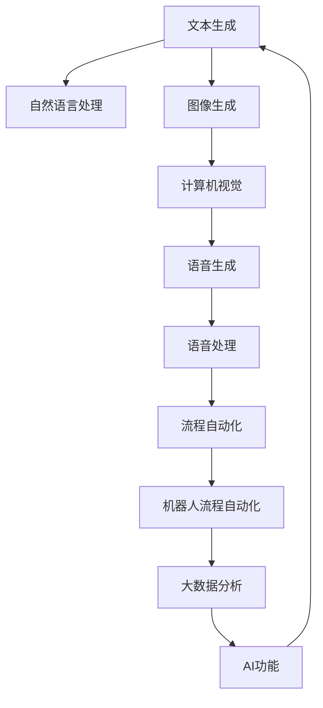
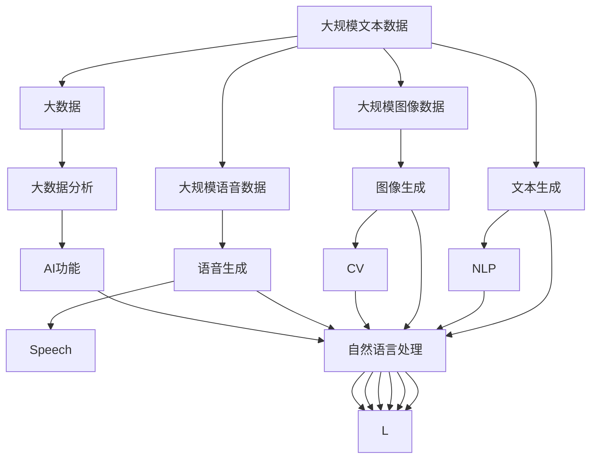
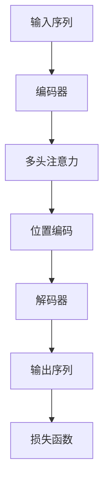

                 

# 生成式AIGC是金矿还是泡沫：垂直行业的软件找到痛点场景加上 AI 功能

> 关键词：生成式AIGC, 人工智能, 自然语言处理, 计算机视觉, 机器人流程自动化, 大数据分析, 行业应用, AI功能的开发痛点

## 1. 背景介绍

### 1.1 问题由来
近年来，人工智能(AI)技术取得了长足进步，生成式人工智能(Generative AI, 简称AIGC)逐渐成为热点。AIGC涵盖了自然语言处理(NLP)、计算机视觉(CV)、语音处理(Speech)等多个领域，涵盖了内容生成、语音合成、图像生成、视频编辑等众多应用场景。在垂直行业的软件开发中，AIGC带来的变革是革命性的。

对于软件开发者而言，AIGC提供了前所未有的能力和工具，使得开发者能够更好地满足用户需求，提高开发效率，降低开发成本。然而，AIGC技术的复杂性、高门槛以及广泛的应用领域，也给开发者带来了新的挑战和困惑。如何找到合适的应用场景，将AIGC与垂直行业需求相结合，成为了当下软件开发者迫切需要解决的问题。

### 1.2 问题核心关键点
要找到合适的应用场景，需要从以下几个方面进行思考：

- **行业痛点**：垂直行业普遍存在哪些核心问题，如效率低下、资源浪费、用户体验差等，这些问题是否能通过AIGC技术得到解决？
- **用户需求**：目标用户群体对AIGC功能有哪些期待和需求，如何通过技术手段满足这些需求？
- **技术匹配**：现有的AIGC技术是否能胜任这些任务，是否需要进一步定制化开发？
- **资源投入**：开发和部署AIGC解决方案需要哪些资源，如数据、计算、人力等？

### 1.3 问题研究意义
找到合适的应用场景，对于推动AIGC技术的落地应用，以及提升软件开发的效率和质量，具有重要意义：

1. **提高效率**：AIGC能够自动生成内容、优化代码、辅助设计等，大幅度提高软件开发和测试的效率。
2. **提升质量**：AIGC能够在自动生成代码、测试、文档等方面提供高质量的输出，减少人为错误。
3. **降低成本**：通过AIGC技术，可以降低开发和维护成本，提高项目成功率。
4. **增强用户体验**：AIGC可以辅助生成用户界面(UI)设计、交互式内容等，提升用户体验。
5. **推动技术进步**：结合AIGC技术与垂直行业需求，能够推动技术创新，拓展AI应用边界。

## 2. 核心概念与联系

### 2.1 核心概念概述

AIGC技术涵盖了多个领域，其核心概念包括：

- **生成式AI**：利用算法生成高质量的文本、图像、视频、音频等内容的AI技术。
- **自然语言处理(NLP)**：实现文本的生成、理解、分析和转换的AI技术。
- **计算机视觉(CV)**：实现图像、视频的生成、理解、分析和转换的AI技术。
- **语音处理(Speech)**：实现语音的生成、理解、分析和转换的AI技术。
- **机器人流程自动化(RPA)**：通过AI技术，自动完成重复性、规则性任务的自动化技术。
- **大数据分析**：利用AI技术处理和分析大规模数据，提取有用信息的技术。

这些核心概念之间存在着紧密的联系，形成了AIGC技术的整体框架：

- **文本生成与自然语言处理**：自然语言处理可以辅助文本生成，文本生成也可以推动自然语言处理的发展。
- **图像生成与计算机视觉**：计算机视觉可以辅助图像生成，图像生成也可以推动计算机视觉的发展。
- **语音生成与语音处理**：语音处理可以辅助语音生成，语音生成也可以推动语音处理的发展。
- **流程自动化与机器人流程自动化**：RPA可以辅助自动化流程，自动化流程也可以推动RPA的发展。
- **大数据分析与AI功能**：大数据分析可以辅助AI功能的开发，AI功能也可以推动大数据分析的发展。

这些核心概念之间的逻辑关系可以通过以下Mermaid流程图来展示：



这个流程图展示了AIGC技术中的核心概念及其之间的联系：

- 文本生成和自然语言处理相辅相成。
- 图像生成和计算机视觉互相促进。
- 语音生成和语音处理相互支持。
- 流程自动化和机器人流程自动化紧密关联。
- 大数据分析和AI功能互相补充。

### 2.2 概念间的关系

这些核心概念之间存在着复杂的互动关系，形成了AIGC技术的生态系统。下面是一些核心概念之间的相互作用：

- **文本生成和NLP**：文本生成技术可以辅助自然语言处理，如自动摘要、自动问答等；自然语言处理可以改进文本生成，如生成风格文本、生成特定领域的文本等。
- **图像生成和CV**：图像生成技术可以辅助计算机视觉，如生成训练样本、生成虚拟场景等；计算机视觉可以改进图像生成，如生成高分辨率图像、生成特定风格的图像等。
- **语音生成和Speech**：语音生成技术可以辅助语音处理，如生成语音助手对话、生成语音指令等；语音处理可以改进语音生成，如生成清晰自然的语音、生成特定口音的语音等。
- **流程自动化和RPA**：流程自动化技术可以辅助机器人流程自动化，如自动化流程监控、自动化流程设计等；机器人流程自动化可以改进流程自动化，如自动化流程优化、自动化流程自动化等。
- **大数据分析和AI功能**：大数据分析可以辅助AI功能的开发，如生成预测模型、生成推荐算法等；AI功能可以改进大数据分析，如自动数据标注、自动数据清洗等。

### 2.3 核心概念的整体架构

最后，我们用一个综合的流程图来展示这些核心概念在大规模AIGC技术应用中的整体架构：



这个综合流程图展示了AIGC技术中各核心概念在大规模应用中的整体架构：

- 文本生成和自然语言处理相辅相成，共同构成NLP的输入和输出。
- 图像生成和计算机视觉相互促进，共同构成CV的输入和输出。
- 语音生成和语音处理相互支持，共同构成Speech的输入和输出。
- 流程自动化和机器人流程自动化紧密关联，共同构成RPA的输入和输出。
- 大数据分析和AI功能互相补充，共同构成AIGC的应用基础。

## 3. 核心算法原理 & 具体操作步骤

### 3.1 算法原理概述

生成式AIGC的原理基于深度学习模型，主要包括生成对抗网络(GAN)、变分自编码器(VAE)、Transformer等架构。以Transformer为例，其核心思想是通过自注意力机制(Aut attention)来处理序列数据，利用多头注意力机制(Multi-head attention)来捕捉序列中的复杂依赖关系。

Transformer模型的主要流程包括：

1. **编码器(Encoder)**：将输入序列转化为高维向量表示。
2. **解码器(Decoder)**：将高维向量转化为输出序列。
3. **多头注意力机制**：通过多头注意力计算，捕捉输入序列的长期依赖关系。
4. **位置编码**：引入位置编码，确保模型对序列位置的敏感性。

Transformer模型的优化目标是通过最小化预测输出与真实标签之间的差距，即损失函数：

$$
\mathcal{L} = -\sum_{i=1}^N \log p(y_i|x_i; \theta)
$$

其中 $y_i$ 为真实标签，$x_i$ 为输入序列，$\theta$ 为模型参数。

### 3.2 算法步骤详解

生成式AIGC的算法步骤主要包括：

1. **数据准备**：准备训练数据集，进行数据清洗和预处理。
2. **模型构建**：选择合适的生成模型，构建模型架构，设置超参数。
3. **模型训练**：使用训练数据集对模型进行训练，调整超参数。
4. **模型评估**：使用验证数据集评估模型性能，调整超参数。
5. **模型微调**：使用目标数据集对模型进行微调，优化模型参数。
6. **模型应用**：将训练好的模型应用于实际场景，进行内容生成、自动设计、自动化流程等任务。

### 3.3 算法优缺点

生成式AIGC的优点包括：

- **高效性**：AIGC可以快速生成高质量内容，提高开发效率。
- **灵活性**：AIGC可以定制化开发，满足不同场景的需求。
- **泛化性**：AIGC可以在大规模数据上训练，具有较好的泛化能力。

生成式AIGC的缺点包括：

- **高门槛**：AIGC技术复杂，开发门槛较高。
- **高成本**：AIGC需要大规模数据和高性能计算，成本较高。
- **可解释性差**：AIGC模型复杂，难以解释其生成过程。
- **安全性问题**：AIGC可能生成有害内容，存在安全隐患。

### 3.4 算法应用领域

生成式AIGC在多个领域得到了广泛应用，主要包括：

- **内容生成**：自动生成新闻、文章、报告、广告等文本内容。
- **图像生成**：自动生成照片、插图、动画、虚拟现实等图像内容。
- **视频生成**：自动生成视频片段、广告、动画等。
- **语音生成**：自动生成语音助手对话、语音指令、配音等。
- **机器人流程自动化**：自动生成自动化流程、自动化任务执行脚本。
- **大数据分析**：自动生成预测模型、推荐算法、数据可视化等。

## 4. 数学模型和公式 & 详细讲解 & 举例说明

### 4.1 数学模型构建

生成式AIGC的数学模型主要基于深度学习架构，以Transformer为例，其模型结构如图示：



其中，编码器和解码器都由多个层组成，每层包含多头注意力机制和位置编码。解码器还包含残差连接和层归一化。

### 4.2 公式推导过程

以Transformer为例，其生成模型的目标函数为：

$$
\mathcal{L} = -\sum_{i=1}^N \log p(y_i|x_i; \theta)
$$

其中 $y_i$ 为真实标签，$x_i$ 为输入序列，$\theta$ 为模型参数。

生成模型的训练过程为：

1. **前向传播**：将输入序列 $x_i$ 送入编码器，生成中间表示 $h_i$。
2. **多头注意力**：通过多头注意力计算，捕捉输入序列的长期依赖关系。
3. **解码器前向传播**：将 $h_i$ 送入解码器，生成中间表示 $h'_i$。
4. **输出预测**：通过解码器生成预测标签 $y_i$。
5. **损失计算**：计算预测标签 $y_i$ 与真实标签 $y_i$ 之间的差距。
6. **反向传播**：通过反向传播更新模型参数 $\theta$。

### 4.3 案例分析与讲解

以自然语言处理(NLP)中的文本生成为例，分析生成式AIGC的应用过程。

1. **数据准备**：准备训练数据集，如新闻文章、技术文档等。
2. **模型构建**：选择合适的生成模型，如Transformer，构建模型架构，设置超参数。
3. **模型训练**：使用训练数据集对模型进行训练，调整超参数。
4. **模型微调**：使用目标数据集对模型进行微调，优化模型参数。
5. **模型应用**：将训练好的模型应用于实际场景，如生成新闻报道、技术文章等。

## 5. 项目实践：代码实例和详细解释说明

### 5.1 开发环境搭建

在进行生成式AIGC的开发实践前，需要准备以下开发环境：

1. **Python**：安装Python 3.x版本，如3.7以上。
2. **深度学习框架**：安装TensorFlow或PyTorch深度学习框架，建议使用最新版本。
3. **AIGC库**：安装GPT-3、DALL-E等AIGC库，如OpenAI的Hugging Face库。

### 5.2 源代码详细实现

以下是使用GPT-3进行文本生成的代码实现：

```python
from transformers import pipeline

# 创建文本生成器
generator = pipeline('text-generation', model='gpt3')

# 生成文本
text = "生成一个关于人工智能的介绍"
generated_text = generator(text, max_length=100)

print(generated_text)
```

### 5.3 代码解读与分析

通过上述代码，我们可以快速生成一段关于人工智能的介绍。代码的核心在于使用了Hugging Face提供的GPT-3文本生成器，通过设置最大生成长度，生成了一段描述人工智能的文本。

### 5.4 运行结果展示

假设我们生成了一篇关于人工智能的介绍：

```
人工智能是一种通过模拟人类智能行为的技术，包括语音识别、图像识别、自然语言处理等。在医疗领域，人工智能可以辅助医生进行疾病诊断和治疗方案制定；在金融领域，人工智能可以进行风险评估和投资建议；在教育领域，人工智能可以辅助教师进行个性化教学和学生学习评估。未来，随着技术的不断进步，人工智能将在更多领域发挥重要作用。
```

可以看到，通过生成式AIGC技术，我们能够快速生成高质量的文本内容，帮助开发人员快速完成内容生成任务。

## 6. 实际应用场景

### 6.1 智能客服系统

生成式AIGC在智能客服系统中得到了广泛应用。通过生成自然语言对话，智能客服可以自动回答用户问题，提升用户满意度。

### 6.2 金融分析

生成式AIGC在金融分析中也有着重要应用。通过生成金融报告、市场分析等，AIGC可以辅助金融分析师进行数据分析和决策。

### 6.3 医疗健康

生成式AIGC在医疗健康领域也有着重要应用。通过生成医疗报告、健康咨询等，AIGC可以辅助医生进行诊断和治疗。

### 6.4 未来应用展望

未来，生成式AIGC将在更多领域得到广泛应用，如虚拟现实、娱乐、游戏等。通过生成高质量的内容，AIGC将推动这些领域的创新和发展。

## 7. 工具和资源推荐

### 7.1 学习资源推荐

为了帮助开发者系统掌握生成式AIGC的理论基础和实践技巧，以下是一些优质的学习资源：

1. **《深度学习》课程**：斯坦福大学开设的深度学习课程，涵盖深度学习基础知识和应用。
2. **《自然语言处理》课程**：MIT OpenCourseWare的自然语言处理课程，深入讲解自然语言处理的基本概念和算法。
3. **《计算机视觉》课程**：斯坦福大学开设的计算机视觉课程，涵盖计算机视觉的基本概念和算法。
4. **《生成式AI》课程**：Coursera的生成式AI课程，讲解生成式AI的基本概念和算法。
5. **《机器人流程自动化》课程**：Udemy的机器人流程自动化课程，讲解机器人流程自动化的基本概念和应用。

### 7.2 开发工具推荐

为了提高生成式AIGC的开发效率，以下是一些常用的开发工具：

1. **Jupyter Notebook**：Python的交互式开发环境，支持代码执行、数据可视化等。
2. **TensorBoard**：TensorFlow的可视化工具，支持模型训练和调优。
3. **PyTorch Lightning**：PyTorch的快速实验框架，支持模型训练和调优。
4. **Hugging Face Transformers**：自然语言处理库，提供多种预训练模型和工具。
5. **OpenAI GPT-3**：开源的自然语言生成模型，支持生成高质量的文本内容。

### 7.3 相关论文推荐

以下是几篇生成式AIGC领域的经典论文，推荐阅读：

1. **Attention is All You Need**：提出Transformer模型，开启深度学习新纪元。
2. **BERT: Pre-training of Deep Bidirectional Transformers for Language Understanding**：提出BERT模型，引领自然语言处理新方向。
3. **Generative Pre-trained Transformer**：提出GPT-2模型，展现生成式AIGC的强大能力。
4. **DALL-E: A Visual Foundation for the Generation of Natural Language Descriptions**：提出DALL-E模型，推动图像生成技术的突破。
5. **GPT-3: Language Models are Unsupervised Multitask Learners**：提出GPT-3模型，展现生成式AIGC的多样性。

这些论文代表了生成式AIGC技术的最新进展，帮助开发者理解AIGC的基本原理和应用场景。

## 8. 总结：未来发展趋势与挑战

### 8.1 研究成果总结

生成式AIGC技术在多个领域得到了广泛应用，展示了其强大的生成能力和应用潜力。通过不断优化算法和模型，AIGC技术在未来将有更大的发展空间。

### 8.2 未来发展趋势

生成式AIGC的未来发展趋势包括：

1. **模型规模增大**：生成式AIGC的模型规模将进一步增大，支持更复杂的生成任务。
2. **多模态融合**：生成式AIGC将实现多模态融合，支持生成更丰富的内容形式。
3. **实时生成**：生成式AIGC将支持实时生成，提高应用效率。
4. **隐私保护**：生成式AIGC将加强隐私保护，确保用户数据安全。
5. **跨领域应用**：生成式AIGC将在更多领域得到应用，推动技术创新。

### 8.3 面临的挑战

生成式AIGC面临的挑战包括：

1. **技术门槛高**：生成式AIGC技术复杂，开发门槛较高。
2. **数据需求大**：生成式AIGC需要大规模数据支持，数据获取成本较高。
3. **模型泛化差**：生成式AIGC的模型泛化能力有限，需要大量标注数据。
4. **伦理问题**：生成式AIGC可能生成有害内容，存在伦理问题。
5. **部署成本高**：生成式AIGC的部署需要高性能计算资源，成本较高。

### 8.4 研究展望

未来，生成式AIGC的研究方向包括：

1. **参数高效**：研究生成式AIGC的参数高效优化方法，提高生成效率。
2. **数据增强**：研究生成式AIGC的数据增强方法，提高模型泛化能力。
3. **隐私保护**：研究生成式AIGC的隐私保护方法，确保数据安全。
4. **跨领域应用**：研究生成式AIGC的跨领域应用方法，推动技术创新。
5. **伦理问题**：研究生成式AIGC的伦理问题，确保生成内容的合理性和安全性。

这些研究方向将推动生成式AIGC技术的发展，拓展其应用边界，提升其应用效果。

## 9. 附录：常见问题与解答

**Q1：生成式AIGC技术是否适用于所有领域？**

A: 生成式AIGC技术具有广泛的应用潜力，但并不适用于所有领域。对于某些需要深度专业知识和经验的领域，生成式AIGC可能无法满足需求。例如，医学诊断和治疗需要医生多年的临床经验，生成式AIGC无法替代医生的专业判断。

**Q2：如何评估生成式AIGC的生成效果？**

A: 评估生成式AIGC的生成效果可以从以下几个方面进行：

1. **BLEU值**：使用BLEU算法评估文本生成的质量。
2. **ROUGE值**：使用ROUGE算法评估文本的相似度。
3. **人工评估**：邀请专家对生成的文本进行人工评估，判断其质量。
4. **应用效果**：通过实际应用效果评估生成式AIGC的性能，如智能客服的用户满意度等。

**Q3：生成式AIGC的生成效果与输入数据有关吗？**

A: 生成式AIGC的生成效果与输入数据密切相关。输入数据的质量、数量和多样性会直接影响生成效果的优劣。例如，输入数据包含噪声、不完整或错误信息，会导致生成的内容质量低下。

**Q4：生成式AIGC的生成效果是否可以优化？**

A: 生成式AIGC的生成效果可以通过以下方法进行优化：

1. **数据预处理**：对输入数据进行清洗和预处理，提高数据质量。
2. **模型训练**：通过增加训练数据、调整模型参数等方法，提高模型性能。
3. **后处理**：对生成的文本进行后处理，如自动校对、语法优化等。

**Q5：生成式AIGC的生成效果是否可以进一步提高？**

A: 生成式AIGC的生成效果可以通过以下方法进一步提高：

1. **模型优化**：通过使用更加先进的深度学习模型，如BERT、GPT-3等，提高生成效果。
2. **数据增强**：通过数据增强技术，增加数据的多样性和覆盖面，提高生成效果。
3. **任务适配**：根据具体任务需求，对生成式AIGC进行任务适配，提高生成效果。

总之，生成式AIGC技术的应用需要综合考虑数据质量、模型优化和任务适配等多个方面，通过不断优化，才能达到理想的生成效果。

---

作者：禅与计算机程序设计艺术 / Zen and the Art of Computer Programming

