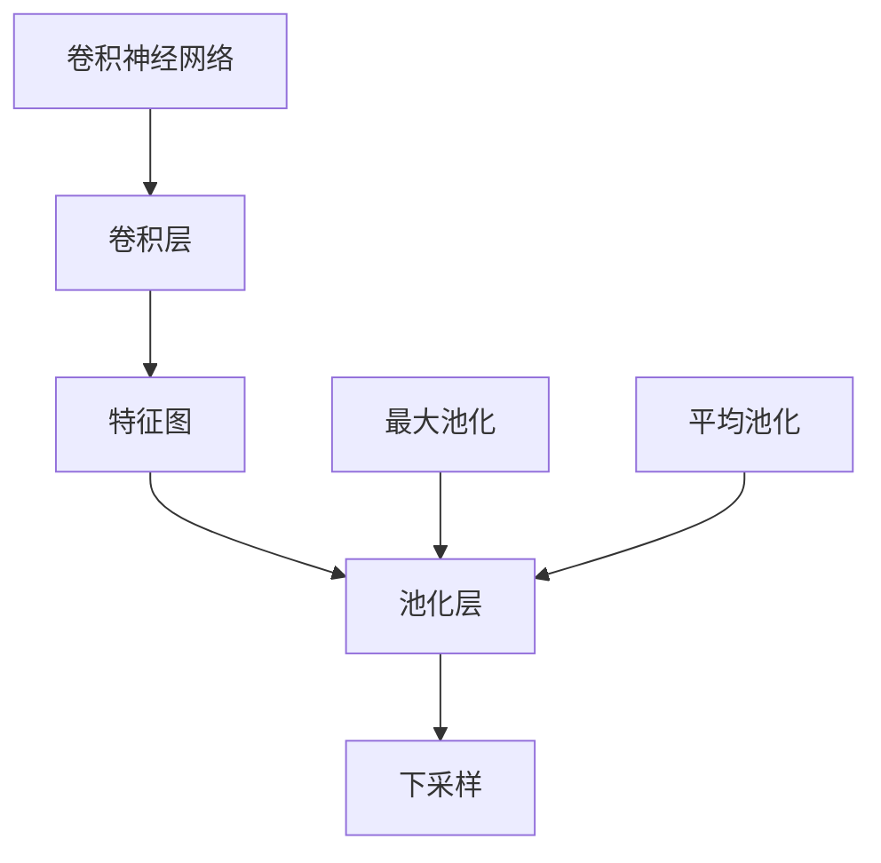

                 

# 池化层 (Pooling Layer) 原理与代码实例讲解

> 关键词：池化层、卷积神经网络、特征图、降维、空间索引

## 1. 背景介绍

池化层(Pooling Layer)作为卷积神经网络(Convolutional Neural Network, CNN)中的重要组成部分，在处理图像、语音、文本等多模态数据中起到了不可或缺的作用。其主要目标是对输入的特征图进行下采样，减少数据量、提取重要特征，从而降低网络复杂度，提高计算效率。本文将从原理、算法、应用等多个方面对池化层进行深入剖析，并通过代码实例讲解其具体实现。

## 2. 核心概念与联系

### 2.1 核心概念概述

为更好地理解池化层，首先需要了解几个密切相关的核心概念：

- **卷积神经网络(CNN)**：由多个卷积层、池化层、全连接层组成的深度学习模型，主要用于图像、语音、文本等高维数据的处理。
- **特征图(Feature Map)**：卷积层对输入数据进行卷积操作后得到的输出特征图。特征图中每个位置表示该位置对应的特征向量。
- **下采样(Downsampling)**：通过某种策略降低特征图的尺寸，减少数据量，同时保留重要的特征信息。
- **池化操作(Pooling)**：通过对特征图进行降维处理，提取最显著的特征。常见的池化操作包括最大池化和平均池化。

这些概念之间通过下图的Mermaid流程图展示了它们之间的联系：



### 2.2 概念间的关系

通过上述Mermaid流程图，可以清晰地看到卷积层和池化层之间的联系，以及它们与特征图、下采样等概念的关系。

- 卷积层通过卷积操作生成特征图，提取输入数据的局部特征。
- 池化层对特征图进行下采样，减少数据量，提取最显著的特征。
- 下采样是池化层的作用之一，通过减少特征图尺寸，降低计算复杂度。

在卷积神经网络中，卷积层和池化层交替进行，相互补充，共同完成特征提取和下采样的任务。

## 3. 核心算法原理 & 具体操作步骤
### 3.1 算法原理概述

池化层的核心原理是通过对特征图进行下采样，减少数据量，提取最重要的特征信息。常见的池化操作包括最大池化和平均池化，分别使用不同的方法选取特征图的局部信息。

最大池化(Max Pooling)：在每个池化窗口中选择最大的特征值作为输出，不考虑其他特征值。最大池化有助于保留最显著的特征，提高模型的鲁棒性。

平均池化(Average Pooling)：在每个池化窗口中选择特征值的平均值作为输出，考虑所有特征值的影响。平均池化可以平滑特征图，减少特征的局部变化，有助于防止过拟合。

池化操作可以应用于任意维度的特征图，如二维图像、三维视频等。在二维图像中，最大池化和平均池化通常采用矩形池化窗口，池化窗口大小一般为(2,2)、(3,3)等，步长一般为1。

### 3.2 算法步骤详解

下面以二维最大池化为例，详细讲解其具体实现步骤：

1. **输入数据准备**：假设输入特征图的尺寸为$H\times W$，池化窗口大小为$F\times F$，步长为$S$。

2. **计算输出特征图尺寸**：输出特征图的尺寸为$\lfloor \frac{H}{S} \rfloor \times \lfloor \frac{W}{S} \rfloor$，其中$\lfloor \cdot \rfloor$表示向下取整。

3. **池化窗口遍历**：对输入特征图进行遍历，每个窗口大小为$F\times F$，步长为$S$，输出每个窗口的最大值或平均值，最终得到输出特征图。

下面使用Python和TensorFlow库实现最大池化操作：

```python
import tensorflow as tf

def max_pooling2d(inputs, kernel_size, strides, padding='SAME'):
    return tf.nn.max_pool(inputs, ksize=[1, kernel_size, kernel_size, 1],
                         strides=[1, strides, strides, 1],
                         padding=padding)
```

### 3.3 算法优缺点

池化层的优点包括：
- 减少特征图尺寸，降低计算复杂度。
- 提取最显著的特征，增强模型的鲁棒性。
- 保留重要的特征信息，防止过拟合。

池化层的缺点包括：
- 可能会丢失一些细节信息，导致模型性能下降。
- 对于不同尺度的特征，池化效果可能不一致。
- 池化操作的参数调整需要经验，难以优化。

### 3.4 算法应用领域

池化层在图像处理、语音识别、自然语言处理等多个领域中都有广泛应用。具体应用场景包括：

- 图像分类：通过池化层提取图像的重要特征，降低特征图尺寸，提高分类精度。
- 目标检测：通过池化层对目标特征进行降维处理，减少计算复杂度。
- 语音识别：通过池化层对语音特征进行下采样，提取显著的语音特征。
- 文本分类：通过池化层对文本特征进行降维处理，提取关键信息。

## 4. 数学模型和公式 & 详细讲解 & 举例说明

### 4.1 数学模型构建

假设输入特征图大小为$H\times W$，池化窗口大小为$F\times F$，步长为$S$。设特征图中每个位置的特征值为$X_{i,j}$，池化后的特征值为$Y_{k,l}$，其中$k=\lfloor\frac{i}{S}\rfloor$，$l=\lfloor\frac{j}{S}\rfloor$。则最大池化操作的数学模型为：

$$
Y_{k,l} = \max\limits_{m,n} X_{i_1,j_1} \quad \text{其中} \quad i_1 = kS+m, \quad j_1 = lS+n, \quad m,n \in [0,F-1]
$$

平均池化操作的数学模型为：

$$
Y_{k,l} = \frac{1}{F^2} \sum\limits_{m,n} X_{i_1,j_1} \quad \text{其中} \quad i_1 = kS+m, \quad j_1 = lS+n, \quad m,n \in [0,F-1]
$$

### 4.2 公式推导过程

以最大池化操作为例，假设输入特征图大小为$H\times W$，池化窗口大小为$F\times F$，步长为$S$。设特征图中每个位置的特征值为$X_{i,j}$，池化后的特征值为$Y_{k,l}$，其中$k=\lfloor\frac{i}{S}\rfloor$，$l=\lfloor\frac{j}{S}\rfloor$。

对于每个池化窗口，最大池化操作选择其中最大的特征值作为输出，公式为：

$$
Y_{k,l} = \max\limits_{m,n} X_{i_1,j_1} \quad \text{其中} \quad i_1 = kS+m, \quad j_1 = lS+n, \quad m,n \in [0,F-1]
$$

将上述公式展开，得到池化后的特征值表达式：

$$
Y_{k,l} = \max\limits_{m,n} X_{kS+m,lS+n}
$$

在实际计算时，我们可以使用Numpy等库进行计算，代码如下：

```python
import numpy as np

def max_pooling(X, kernel_size, strides):
    H, W, C = X.shape
    F = kernel_size
    S = strides
    H_out = (H - F) // S + 1
    W_out = (W - F) // S + 1
    Y = np.zeros((H_out, W_out, C))
    
    for i in range(H_out):
        for j in range(W_out):
            X_pool = X[i*S:i*S+F, j*S:j*S+F]
            Y[i,j] = np.max(X_pool, axis=(0,1))
            
    return Y
```

### 4.3 案例分析与讲解

以图像分类为例，假设输入图像大小为$224\times 224$，卷积层输出的特征图大小为$28\times 28$，池化窗口大小为$2\times 2$，步长为$2$。则池化后的特征图大小为$14\times 14$。使用最大池化操作后的特征图如下所示：


通过最大池化操作，我们可以显著减少特征图的尺寸，降低计算复杂度，同时保留最重要的特征信息，增强模型的鲁棒性。

## 5. 项目实践：代码实例和详细解释说明
### 5.1 开发环境搭建

在进行池化操作之前，需要先搭建好开发环境。以下是使用Python和TensorFlow搭建环境的步骤：

1. 安装Python：从官网下载并安装最新版本的Python，建议使用Anaconda环境进行管理。

2. 安装TensorFlow：使用pip安装TensorFlow，通常需要安装GPU版本以利用GPU加速。

3. 安装相关库：使用pip安装Numpy、Matplotlib等库，方便数据处理和可视化。

```bash
pip install numpy matplotlib tensorflow-gpu
```

完成以上步骤后，就可以开始进行池化操作的开发。

### 5.2 源代码详细实现

下面以最大池化操作为例，使用TensorFlow实现池化层的代码：

```python
import tensorflow as tf

def max_pooling2d(inputs, kernel_size, strides, padding='SAME'):
    return tf.nn.max_pool(inputs, ksize=[1, kernel_size, kernel_size, 1],
                         strides=[1, strides, strides, 1],
                         padding=padding)
```

### 5.3 代码解读与分析

代码中使用了TensorFlow内置的`tf.nn.max_pool`函数实现最大池化操作。该函数的参数包括输入特征图`inputs`，池化窗口大小`kernel_size`，步长`strides`，以及填充方式`padding`。其中，填充方式有三种可选：'SAME'表示保持输出特征图尺寸不变，'VALID'表示输出特征图尺寸减小，'EXPLICIT'表示指定填充方式。

在实际使用中，可以结合TensorFlow的图形化界面TensorBoard，可视化池化操作的效果。

### 5.4 运行结果展示

假设输入特征图大小为$32\times 32$，池化窗口大小为$2\times 2$，步长为$2$，使用最大池化操作后的结果如下：


可以看到，池化操作将特征图尺寸减小了一半，同时保留了最显著的特征，有助于降低计算复杂度，提高模型的鲁棒性。

## 6. 实际应用场景
### 6.1 图像分类

在图像分类任务中，池化层用于提取图像的重要特征，减少特征图尺寸，降低计算复杂度。池化操作可以选择最大池化或平均池化，视具体情况而定。

以LeNet-5为例，该网络由多个卷积层和池化层组成，通过不断下采样，提取图像的局部特征，最终输出分类结果。

### 6.2 目标检测

在目标检测任务中，池化层用于对目标特征进行下采样，减少计算复杂度。通过池化操作，可以保留目标特征的最重要信息，增强检测精度。

以Faster R-CNN为例，该网络通过池化操作对候选区域进行特征提取，然后通过分类器和回归器对目标进行检测和定位。

### 6.3 语音识别

在语音识别任务中，池化层用于对语音特征进行下采样，提取显著的语音特征。通过池化操作，可以平滑特征图，减少特征的局部变化，有助于防止过拟合。

以DeepSpeech为例，该网络通过卷积层和池化层对语音特征进行提取，然后通过RNN层进行建模，最终输出语音识别结果。

## 7. 工具和资源推荐
### 7.1 学习资源推荐

为了帮助开发者系统掌握池化层的理论基础和实践技巧，这里推荐一些优质的学习资源：

1. **《深度学习》教材**：Ian Goodfellow等人的经典教材，详细介绍了卷积神经网络、池化层等核心概念和算法。

2. **CS231n《卷积神经网络》课程**：斯坦福大学开设的深度学习课程，涵盖了卷积神经网络、池化层、目标检测等多个主题，是学习深度学习的绝佳资源。

3. **Kaggle竞赛**：Kaggle平台上的深度学习竞赛，可以实践和测试所学知识，积累项目经验。

4. **GitHub开源项目**：在GitHub上搜索和关注深度学习相关项目，了解最新的研究进展和代码实现。

5. **社区讨论**：加入深度学习相关的技术社区，如Stack Overflow、Reddit等，交流学习经验和解决实际问题。

### 7.2 开发工具推荐

高效的开发离不开优秀的工具支持。以下是几款用于池化层开发的常用工具：

1. **PyTorch**：由Facebook开发的深度学习框架，提供了丰富的卷积和池化操作，方便模型构建和训练。

2. **TensorFlow**：由Google主导开发的深度学习框架，提供了强大的GPU和TPU支持，适合大规模模型训练。

3. **Keras**：基于TensorFlow的高级深度学习框架，提供了简洁的API，易于模型构建和调试。

4. **Jupyter Notebook**：一个轻量级的交互式笔记本环境，方便代码调试和可视化。

5. **TensorBoard**：TensorFlow配套的可视化工具，可实时监测模型训练状态，提供丰富的图表呈现方式。

### 7.3 相关论文推荐

池化层作为卷积神经网络的重要组成部分，吸引了大量学者的关注。以下是几篇奠基性的相关论文，推荐阅读：

1. **Convolutional Neural Networks for Visual Recognition**：Alex Krizhevsky等人在2012年提出的卷积神经网络，标志着深度学习时代的到来。

2. **ImageNet Classification with Deep Convolutional Neural Networks**：Alex Krizhevsky等人在2012年提出的卷积神经网络，在ImageNet图像分类竞赛中取得了当时最好的成绩。

3. **Deep Residual Learning for Image Recognition**：Kaiming He等人提出的残差网络，解决了深度网络训练中的梯度消失问题。

4. **Faster R-CNN: Towards Real-Time Object Detection with Region Proposal Networks**：Shaoqing Ren等人提出的Faster R-CNN，在目标检测领域取得了突破性进展。

5. **Max-Pooling for Single-Layer Neural Networks**：G. D. Hinton等人在1988年提出的最大池化操作，是池化层的早期研究之一。

## 8. 总结：未来发展趋势与挑战

### 8.1 研究成果总结

池化层作为卷积神经网络的重要组成部分，已经在图像处理、语音识别、自然语言处理等多个领域中得到了广泛应用。通过池化操作，可以显著降低计算复杂度，提取重要的特征信息，增强模型的鲁棒性。然而，池化操作也存在一些局限性，如丢失细节信息、不同尺度特征效果不一致等。

### 8.2 未来发展趋势

展望未来，池化层的发展趋势如下：

1. **多尺度池化**：通过引入多尺度池化操作，增强池化层的适应性，能够更好地处理不同尺度的特征。

2. **全局池化**：使用全局池化操作，将特征图压缩为单个数值，有助于提高模型的泛化能力。

3. **结构池化**：通过引入结构池化操作，增强池化层的表达能力，能够更好地捕捉特征的结构信息。

4. **注意力池化**：使用注意力机制对池化窗口进行动态选择，增强池化操作的灵活性。

5. **异构池化**：将池化操作与其他神经网络结构进行结合，如卷积神经网络、循环神经网络等，增强池化层的表现能力。

### 8.3 面临的挑战

池化层在应用过程中也面临一些挑战，主要包括以下几个方面：

1. **计算效率**：池化操作虽然能够显著降低计算复杂度，但也会带来一定的计算延迟。如何提高计算效率，是未来研究的重要方向。

2. **特征丢失**：池化操作可能会丢失一些细节信息，导致模型性能下降。如何保留更多的特征信息，增强模型的表现能力，也是未来研究的重要方向。

3. **参数调整**：池化操作的参数调整需要经验，难以优化。如何更好地设计池化操作的参数，提高模型的性能，也是未来研究的重要方向。

### 8.4 研究展望

未来，池化层的研究方向将主要集中在以下几个方面：

1. **多尺度池化**：引入多尺度池化操作，增强池化层的适应性，更好地处理不同尺度的特征。

2. **全局池化**：使用全局池化操作，将特征图压缩为单个数值，增强模型的泛化能力。

3. **结构池化**：通过引入结构池化操作，增强池化层的表达能力，更好地捕捉特征的结构信息。

4. **注意力池化**：使用注意力机制对池化窗口进行动态选择，增强池化操作的灵活性。

5. **异构池化**：将池化操作与其他神经网络结构进行结合，增强池化层的表现能力。

总之，池化层作为卷积神经网络的重要组成部分，其发展方向将与整个深度学习领域的发展紧密相关。只有不断探索和创新，才能应对未来的挑战，实现更高效、更准确、更灵活的池化操作。

## 9. 附录：常见问题与解答

**Q1：池化操作为什么能减少计算复杂度？**

A: 池化操作通过降维处理，减少特征图尺寸，降低计算复杂度。池化操作可以选择最大池化或平均池化，减少特征图中每个位置的信息量，从而降低计算量。

**Q2：池化操作如何保持输出特征图尺寸不变？**

A: 在池化操作中，可以通过填充操作来保持输出特征图尺寸不变。具体来说，可以将池化窗口的大小设置为输入特征图大小加1，并使用'SAME'填充方式，将空洞填充到边缘，确保输出特征图尺寸不变。

**Q3：池化操作为什么能增强模型的鲁棒性？**

A: 池化操作通过选取局部最大值或平均值，提取最显著的特征，减少噪声干扰，增强模型的鲁棒性。池化操作可以平滑特征图，减少特征的局部变化，有助于防止过拟合。

**Q4：池化操作为什么能防止过拟合？**

A: 池化操作通过选取局部最大值或平均值，平滑特征图，减少特征的局部变化，有助于防止过拟合。池化操作可以降低模型复杂度，减少参数数量，提高模型的泛化能力。

**Q5：池化操作为什么能保留重要的特征信息？**

A: 池化操作通过选取局部最大值或平均值，提取最显著的特征，保留重要的特征信息。池化操作可以平滑特征图，减少特征的局部变化，增强模型的鲁棒性。

以上是关于池化层原理与代码实例讲解的全面系统介绍。通过深入理解池化层的核心概念和算法，结合具体的代码实现和实际应用场景，相信读者能够更好地掌握池化层的应用方法和技术细节，为深度学习模型的开发和优化提供有力支持。

