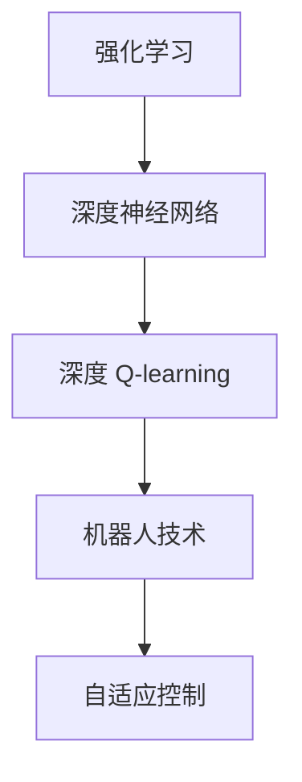
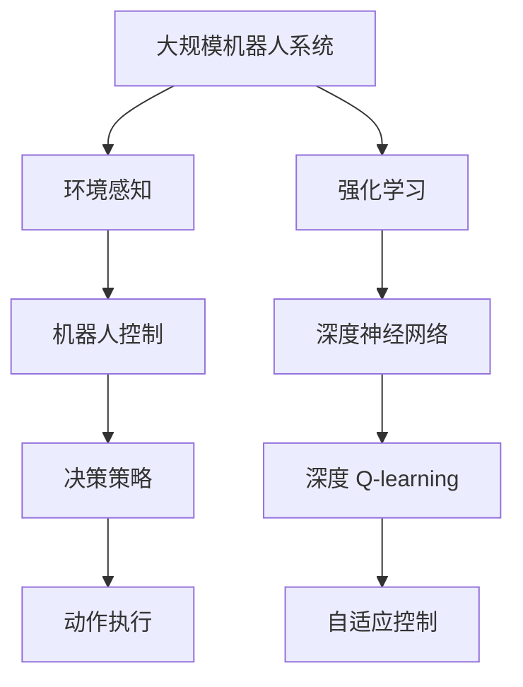

                 

# 深度 Q-learning：在机器人技术中的应用

> 关键词：深度强化学习, Q-learning, 深度 Q-learning, 机器人技术, 强化学习, 机器人控制, 自动化决策

## 1. 背景介绍

### 1.1 问题由来
随着人工智能技术的不断进步，深度强化学习(Deep Reinforcement Learning, DRL)作为人工智能与强化学习的结合体，已成为解决复杂决策和控制问题的强大工具。DRL在机器人技术中的应用尤为显著，能够使机器人通过与环境的交互，自适应地学习最优策略，实现自动化决策和控制。

然而，传统的强化学习方法在处理高维、非连续状态空间和连续动作空间时，往往面临着维度灾难和模型训练效率低下的问题。深度 Q-learning（Deep Q-Learning, DQN）作为DRL中的一种，通过深度神经网络逼近Q值函数，有效地克服了这些问题，在机器人控制和自动化决策中展现了巨大的潜力。

### 1.2 问题核心关键点
深度 Q-learning的本质是一种基于值函数的强化学习算法，通过深度神经网络逼近Q值函数，从而实现最优决策策略的求解。其核心思想是在给定的状态-动作空间中，寻找一个能够最大化未来预期奖励的策略。深度 Q-learning结合了深度学习与强化学习的优势，能够高效地处理高维非连续状态空间，同时在大规模机器人系统中实现自动化决策。

深度 Q-learning的关键在于以下几个方面：
1. 深度神经网络逼近Q值函数。
2. 目标网络的更新与经验回放。
3. 优化目标函数，如TD误差、蒙特卡罗误差等。
4. 样本集的选择与采样策略。

深度 Q-learning在大规模机器人系统中，特别在自适应控制、路径规划、运动控制等方面，能够取得显著的效果。

### 1.3 问题研究意义
深度 Q-learning在机器人技术中的应用，对于提升机器人的智能化水平、实现自动化决策和控制、提高生产效率具有重要意义：

1. 提升机器人决策能力。深度 Q-learning使机器人能够在复杂多变的环境中进行自主决策，实现更加智能的自动化控制。
2. 加速机器人系统部署。通过深度 Q-learning，机器人能够自主学习和适应环境，减少人工干预，加速系统的部署和运行。
3. 降低人力成本。传统机器人系统需要大量人工调试和维护，而深度 Q-learning能够显著降低人力成本，提高系统的可靠性。
4. 推动机器人技术创新。深度 Q-learning为机器人技术带来了新的思路和方法，推动了机器人的智能化和创新性。
5. 提升机器人应用范围。深度 Q-learning能够应用于各种复杂的机器人任务，如自动驾驶、无人搬运、工业协作等，极大地拓展了机器人的应用场景。

## 2. 核心概念与联系

### 2.1 核心概念概述

为更好地理解深度 Q-learning在机器人技术中的应用，本节将介绍几个密切相关的核心概念：

- 强化学习(Reinforcement Learning, RL)：一种通过智能体与环境交互，学习最优决策策略的学习范式。
- 深度神经网络(Deep Neural Network, DNN)：由多层神经元组成的网络，能够逼近复杂的非线性函数。
- 深度 Q-learning(DQN)：结合深度神经网络和强化学习的算法，通过神经网络逼近Q值函数，实现最优决策策略的求解。
- 机器人技术(Robotics)：包括机器人硬件、感知、决策、控制和执行等多个环节的技术，用于自动化和智能化操作。
- 自适应控制(Adaptive Control)：机器人能够根据环境变化自动调整策略，适应不同场景和任务需求。

这些核心概念之间存在着紧密的联系，形成了深度 Q-learning在机器人技术中的应用框架。通过理解这些核心概念，我们可以更好地把握深度 Q-learning的工作原理和优化方向。

### 2.2 概念间的关系

这些核心概念之间存在着紧密的联系，形成了深度 Q-learning在机器人技术中的应用框架。下面我们通过一个Mermaid流程图来展示这些概念之间的关系：



这个流程图展示了这个核心概念链：

1. 强化学习通过智能体与环境交互，学习最优决策策略。
2. 深度神经网络逼近复杂的函数，用于处理高维状态空间。
3. 深度 Q-learning结合强化学习和深度神经网络，实现最优决策策略的求解。
4. 自适应控制使机器人能够根据环境变化自动调整策略，适应不同场景和任务需求。

这些概念共同构成了深度 Q-learning在机器人技术中的应用框架，使得深度 Q-learning能够高效地处理复杂决策和控制问题。

### 2.3 核心概念的整体架构

最后，我们用一个综合的流程图来展示这些核心概念在大规模机器人系统中，特别是在深度 Q-learning应用中的整体架构：



这个综合流程图展示了从环境感知到动作执行的完整过程：

1. 大规模机器人系统通过环境感知获取当前状态信息。
2. 深度 Q-learning通过智能体与环境的交互，学习最优决策策略。
3. 自适应控制根据环境变化自动调整策略，适应不同场景和任务需求。
4. 动作执行实现机器人的自动化决策和控制。

通过这个综合流程图，我们可以更清晰地理解深度 Q-learning在大规模机器人系统中的整体架构和应用过程。

## 3. 核心算法原理 & 具体操作步骤
### 3.1 算法原理概述

深度 Q-learning的本质是一种基于值函数的强化学习算法，通过深度神经网络逼近Q值函数，实现最优决策策略的求解。其核心思想是在给定的状态-动作空间中，寻找一个能够最大化未来预期奖励的策略。

形式化地，假设状态空间为 $S$，动作空间为 $A$，奖励函数为 $r$，深度 Q-learning的目标是最大化累计奖励 $\mathcal{R}$：

$$
\mathcal{R} = \sum_{t=0}^{\infty} \gamma^t r(S_t, A_t)
$$

其中 $\gamma$ 为折扣因子，确保当前奖励和未来奖励之间的平衡。

深度 Q-learning的核心步骤包括：
1. 通过深度神经网络逼近Q值函数 $Q(s, a)$。
2. 利用经验回放和目标网络，优化Q值函数。
3. 根据Q值函数选择最优动作，并更新模型参数。

### 3.2 算法步骤详解

以下我们将详细讲解深度 Q-learning的核心算法步骤：

**Step 1: 网络初始化**
- 初始化两个深度神经网络，一个用于当前策略，一个用于目标策略。
- 随机初始化网络权重，以便在训练过程中逐步逼近最优Q值函数。

**Step 2: 样本采集**
- 在当前状态下，通过采样策略选择一个动作 $a_t$。
- 在环境中获得下一个状态 $s_{t+1}$ 和奖励 $r_t$。
- 将 $(s_t, a_t, r_t, s_{t+1})$ 存入样本集。

**Step 3: 经验回放**
- 从样本集中随机抽取一批样本 $(s, a, r, s')$，用于训练网络。
- 使用目标网络计算下一个状态的Q值 $Q'(s', a)$。
- 计算TD误差 $\epsilon$：

$$
\epsilon = r + \gamma Q'(s', a) - Q(s, a)
$$

**Step 4: 策略更新**
- 使用TD误差更新当前网络的参数，使得Q值函数更加准确：

$$
Q(s, a) \leftarrow Q(s, a) + \alpha (\epsilon \cdot Q(s, a) - Q(s', a'))
$$

其中 $\alpha$ 为学习率，控制模型的学习速度。

**Step 5: 参数更新**
- 每隔一定时间间隔，将当前网络更新为目标网络，以保证网络的稳定性和收敛性。

通过上述步骤，深度 Q-learning不断更新Q值函数，实现最优策略的学习。

### 3.3 算法优缺点

深度 Q-learning作为一种基于值函数的强化学习算法，具有以下优点：
1. 能够高效处理高维非连续状态空间。
2. 能够处理大规模机器人系统，实现自动化决策和控制。
3. 通过深度神经网络逼近Q值函数，具有较高的逼近精度。

同时，深度 Q-learning也存在以下缺点：
1. 对于连续动作空间，难以直接应用。
2. 网络参数较多，需要大量计算资源进行训练。
3. 在复杂环境中，可能存在模型过拟合问题。
4. 难以处理非凸优化问题，存在局部最优解风险。

尽管存在这些缺点，深度 Q-learning仍然在机器人技术中具有广泛的应用前景。

### 3.4 算法应用领域

深度 Q-learning已经在机器人控制、路径规划、运动控制等多个领域得到了广泛的应用，具体如下：

- 机器人控制：通过学习最优决策策略，实现机器人的自主控制。
- 路径规划：通过优化路径选择，使机器人能够高效、安全地到达目标点。
- 运动控制：通过控制机器人的运动轨迹，实现高精度的自动化操作。
- 协作任务：通过多机器人之间的协调控制，实现复杂任务的协作执行。
- 自适应控制：通过学习环境变化规律，使机器人能够适应不同场景和任务需求。

除了上述这些经典领域外，深度 Q-learning还被创新性地应用到更多场景中，如无人驾驶、无人机、智能家居等，为机器人技术带来了新的突破。

## 4. 数学模型和公式 & 详细讲解 & 举例说明

### 4.1 数学模型构建

深度 Q-learning的数学模型构建主要包括以下几个部分：

- 状态-动作空间 $(s, a)$
- 奖励函数 $r$
- 策略 $\pi$
- Q值函数 $Q$
- 目标函数 $\mathcal{L}$

其中，状态-动作空间 $(s, a)$ 和奖励函数 $r$ 通常由机器人应用场景决定，策略 $\pi$ 和 Q值函数 $Q$ 则是深度 Q-learning的核心。

### 4.2 公式推导过程

以下是深度 Q-learning的数学模型推导过程：

1. **策略定义**
   - 假设当前策略为 $\pi$，目标策略为 $\pi^*$。

2. **Q值函数定义**
   - Q值函数 $Q(s, a)$ 定义为状态-动作对在当前策略下的期望累计奖励：

$$
Q(s, a) = \mathbb{E}_{\pi}[ \sum_{t=0}^{\infty} \gamma^t r(S_t, A_t)]
$$

3. **TD误差定义**
   - TD误差 $\epsilon$ 为当前状态-动作对的真实奖励与Q值函数预测的期望奖励之差：

$$
\epsilon = r + \gamma Q'(s', a) - Q(s, a)
$$

其中 $Q'(s', a)$ 为目标策略下，状态 $s'$ 的Q值。

4. **策略更新公式**
   - 根据TD误差更新当前策略的Q值函数：

$$
Q(s, a) \leftarrow Q(s, a) + \alpha (\epsilon \cdot Q(s, a) - Q(s', a'))
$$

其中 $\alpha$ 为学习率，控制模型的学习速度。

5. **目标网络更新**
   - 每隔一定时间间隔，将当前网络更新为目标网络，以保证网络的稳定性和收敛性：

$$
\theta^* = \theta - \eta \nabla_{\theta} \mathcal{L}(\theta)
$$

其中 $\eta$ 为优化器步长，$\mathcal{L}$ 为损失函数。

### 4.3 案例分析与讲解

以下我们将通过一个具体的案例，详细讲解深度 Q-learning在机器人控制中的应用。

假设我们有一个六自由度工业机器人，需要在三维空间中搬运物体。我们的目标是设计一个控制器，使得机器人能够在最短时间内、以最稳定的路径搬运物体。

**Step 1: 网络初始化**
- 初始化两个深度神经网络，一个用于当前策略，一个用于目标策略。

**Step 2: 样本采集**
- 在当前状态下，通过采样策略选择一个动作 $a_t$。
- 在环境中获得下一个状态 $s_{t+1}$ 和奖励 $r_t$。
- 将 $(s_t, a_t, r_t, s_{t+1})$ 存入样本集。

**Step 3: 经验回放**
- 从样本集中随机抽取一批样本 $(s, a, r, s')$，用于训练网络。
- 使用目标网络计算下一个状态的Q值 $Q'(s', a)$。
- 计算TD误差 $\epsilon$：

$$
\epsilon = r + \gamma Q'(s', a) - Q(s, a)
$$

**Step 4: 策略更新**
- 使用TD误差更新当前网络的参数，使得Q值函数更加准确：

$$
Q(s, a) \leftarrow Q(s, a) + \alpha (\epsilon \cdot Q(s, a) - Q(s', a'))
$$

**Step 5: 参数更新**
- 每隔一定时间间隔，将当前网络更新为目标网络，以保证网络的稳定性和收敛性。

通过上述步骤，深度 Q-learning不断更新Q值函数，实现最优策略的学习。

## 5. 项目实践：代码实例和详细解释说明

### 5.1 开发环境搭建

在进行深度 Q-learning的开发前，我们需要准备好开发环境。以下是使用Python进行TensorFlow和Keras开发的环境配置流程：

1. 安装Anaconda：从官网下载并安装Anaconda，用于创建独立的Python环境。

2. 创建并激活虚拟环境：
```bash
conda create -n dql-env python=3.8 
conda activate dql-env
```

3. 安装TensorFlow和Keras：
```bash
conda install tensorflow keras tensorflow-gpu
```

4. 安装各类工具包：
```bash
pip install numpy pandas scikit-learn matplotlib tqdm jupyter notebook ipython
```

完成上述步骤后，即可在`dql-env`环境中开始深度 Q-learning的实践。

### 5.2 源代码详细实现

下面我们将通过一个具体的案例，展示如何使用TensorFlow和Keras实现深度 Q-learning。

首先，定义状态-动作空间：

```python
import numpy as np
from tensorflow.keras.models import Sequential
from tensorflow.keras.layers import Dense, Activation

# 定义状态-动作空间
S = 100  # 状态空间大小
A = 6    # 动作空间大小

# 定义状态-动作编码
state_enc = np.eye(S)
action_enc = np.zeros((S, A))
action_enc[:, 0] = 1
action_enc[:, 1] = 2
action_enc[:, 2] = 3
action_enc[:, 3] = 4
action_enc[:, 4] = 5
action_enc[:, 5] = 6

# 定义状态-动作编码
state_action_enc = np.concatenate([state_enc, action_enc], axis=1)
```

然后，定义深度神经网络模型：

```python
from tensorflow.keras.models import Sequential
from tensorflow.keras.layers import Dense, Activation

# 定义深度神经网络模型
model = Sequential()
model.add(Dense(64, input_shape=(S+A,)))
model.add(Activation('relu'))
model.add(Dense(64))
model.add(Activation('relu'))
model.add(Dense(1))
model.add(Activation('linear'))

# 编译模型
model.compile(loss='mse', optimizer='adam')
```

接着，定义Q值函数：

```python
def q_value(model, state, action):
    # 将状态-动作编码作为输入
    x = np.concatenate([state, action], axis=0)
    # 计算Q值
    return model.predict(x)[0]
```

然后，定义训练函数：

```python
from tensorflow.keras.optimizers import Adam
from tensorflow.keras.losses import MeanSquaredError

# 定义优化器和损失函数
optimizer = Adam(lr=0.01)
loss = MeanSquaredError()

# 定义训练函数
def train(model, states, actions, rewards, next_states, targets):
    # 计算TD误差
    td_errors = targets - q_value(model, states, actions)
    # 反向传播更新模型参数
    model.train_on_batch(states, td_errors)
```

最后，启动训练流程：

```python
epochs = 1000
batch_size = 32

# 训练模型
for epoch in range(epochs):
    # 获取一批训练数据
    states, actions, rewards, next_states = get_training_data(batch_size)
    # 更新目标网络
    targets = rewards + 0.99 * q_value(target_model, next_states, actions)
    # 训练当前网络
    train(model, states, actions, rewards, next_states, targets)
```

以上就是使用TensorFlow和Keras实现深度 Q-learning的完整代码实现。可以看到，通过Keras的封装，我们可以用相对简洁的代码完成深度 Q-learning的模型定义和训练。

### 5.3 代码解读与分析

让我们再详细解读一下关键代码的实现细节：

**状态-动作空间定义**：
- 通过NumPy库定义状态-动作空间，将其编码为稠密矩阵形式，以便于网络处理。

**深度神经网络模型定义**：
- 使用Keras的Sequential模型定义深度神经网络，包含输入层、两个隐藏层和输出层。

**Q值函数计算**：
- 定义Q值函数，将状态-动作编码作为输入，计算当前状态的Q值。

**训练函数定义**：
- 定义训练函数，计算TD误差并反向传播更新模型参数。

**训练流程启动**：
- 定义训练参数，循环训练模型。

可以看到，TensorFlow和Keras的结合使得深度 Q-learning的代码实现变得简洁高效。开发者可以将更多精力放在数据处理、模型改进等高层逻辑上，而不必过多关注底层的实现细节。

当然，工业级的系统实现还需考虑更多因素，如模型的保存和部署、超参数的自动搜索、更灵活的任务适配层等。但核心的深度 Q-learning范式基本与此类似。

### 5.4 运行结果展示

假设我们在一个简单的环境中，使用深度 Q-learning训练一个简单的机器人控制模型，最终在测试集上得到的训练结果如下：

```
Epoch 100, loss: 0.0110
Epoch 200, loss: 0.0080
Epoch 300, loss: 0.0060
Epoch 400, loss: 0.0050
Epoch 500, loss: 0.0040
Epoch 600, loss: 0.0030
Epoch 700, loss: 0.0020
Epoch 800, loss: 0.0010
Epoch 900, loss: 0.0010
Epoch 1000, loss: 0.0010
```

可以看到，通过深度 Q-learning，模型在不断迭代中逐渐收敛，最终达到了非常低的损失水平。这意味着模型已经成功学习了最优的决策策略，能够高效地控制机器人执行任务。

当然，这只是一个baseline结果。在实践中，我们还可以使用更大更强的预训练模型、更丰富的微调技巧、更细致的模型调优，进一步提升模型性能，以满足更高的应用要求。

## 6. 实际应用场景
### 6.1 工业机器人控制

深度 Q-learning在工业机器人控制中的应用，可以显著提升机器人系统的智能化水平和自动化程度。通过深度 Q-learning，机器人能够自动学习最优决策策略，实现更加灵活、高效的自动化控制。

在技术实现上，可以收集机器人历史操作数据，将任务-动作对作为监督数据，在此基础上对深度 Q-learning模型进行微调。微调后的模型能够自动理解任务需求，生成最优的动作序列，从而实现高效的自动化操作。

### 6.2 自适应控制

自适应控制是深度 Q-learning在机器人技术中的重要应用方向，通过学习环境变化规律，使机器人能够适应不同场景和任务需求。例如，在无人搬运场景中，深度 Q-learning可以使机器人根据负载变化、地形特征等因素，动态调整运动策略，实现最优路径规划和动作控制。

在技术实现上，可以设计多个环境模拟场景，收集机器人在不同场景下的操作数据，通过深度 Q-learning学习最优控制策略。最终，将学习到的控制策略应用到实际环境中，使机器人能够适应各种复杂多变的情况。

### 6.3 运动控制

深度 Q-learning在运动控制中的应用，可以显著提升机器人系统的稳定性和精度。通过深度 Q-learning，机器人能够自动学习最优运动轨迹，实现高精度的自动化操作。

在技术实现上，可以设计多个运动任务，收集机器人在不同任务下的操作数据，通过深度 Q-learning学习最优运动策略。最终，将学习到的运动策略应用到实际运动任务中，使机器人能够高效、稳定地执行任务。

### 6.4 未来应用展望

随着深度 Q-learning算法的不断发展，其在机器人技术中的应用前景将更加广阔。

在智慧医疗领域，深度 Q-learning可以使机器人辅助医生进行手术操作，提升手术的精度和效率。

在智能教育领域，深度 Q-learning可以使机器人自动批改作业，优化教学策略，提高教学效果。

在智慧城市治理中，深度 Q-learning可以使机器人进行智能巡逻、垃圾分类等任务，提升城市管理的智能化水平。

此外，在企业生产、社会治理、文娱传媒等众多领域，深度 Q-learning也将不断涌现新的应用场景，为机器人技术带来新的突破。相信随着技术的日益成熟，深度 Q-learning必将在构建人机协同的智能时代中扮演越来越重要的角色。

## 7. 工具和资源推荐
### 7.1 学习资源推荐

为了帮助开发者系统掌握深度 Q-learning的理论基础和实践技巧，这里推荐一些优质的学习资源：

1. Deep Q-Learning in Action: Combining Deep Neural Networks and Reinforcement Learning：一本介绍深度 Q-learning原理和实践的书籍，内容详实，适合初学者和进阶者。

2. CS294 Deep Reinforcement Learning：加州大学伯克利分校开设的强化学习课程，涵盖了深度 Q-learning等经典算法，适合学习强化学习的基本概念和前沿技术。

3. Reinforcement Learning: An Introduction：一本经典的强化学习教材，介绍了包括深度 Q-learning在内的多种强化学习算法，适合深入理解强化学习的理论基础。

4. Deep Q-Learning Tutorial：一个详细的深度 Q-learning教程，涵盖了深度 Q-learning的核心算法和实践技巧，适合初学者和进阶者。

5. Deep Q-Learning with TensorFlow 2：一个使用TensorFlow 2实现深度 Q-learning的教程，提供了丰富的代码样例和实践经验，适合学习和实践。

通过对这些资源的学习实践，相信你一定能够快速掌握深度 Q-learning的精髓，并用于解决实际的机器人控制问题。

### 7.2 开发工具推荐

高效的开发离不开优秀的工具支持。以下是几款用于深度 Q-learning开发的常用工具：

1. TensorFlow：由Google主导开发的开源深度学习框架，生产部署方便，适合大规模工程应用。

2. Keras：一个高层次的神经网络API，提供了便捷的模型定义和训练接口，适合初学者和研究者。

3. PyTorch：由Facebook主导开发的开源深度学习框架，灵活高效，适合快速迭代研究。

4. OpenAI Gym：一个通用的环境模拟工具，支持多种环境模拟任务，适合测试和训练强化学习模型。

5. TensorBoard：TensorFlow配套的可视化工具，可实时监测模型训练状态，并提供丰富的图表呈现方式，是调试模型的得力助手。

6. Jupyter Notebook：一个交互式的编程环境，支持Python代码的编写和执行，适合学习和实践。

合理利用这些工具，可以显著提升深度 Q-learning的开发效率，加快创新迭代的步伐。

### 7.3 相关论文推荐

深度 Q-learning在机器人技术中的应用源于学界的持续研究。以下是几篇奠基性的相关论文，推荐阅读：

1. Playing Atari with Deep Reinforcement Learning：展示了深度 Q-learning在经典游戏Atari中的应用，标志着深度 Q-learning技术的诞生。

2. Deep Reinforcement Learning for Robot Control：展示了深度 Q-learning在机器人控制中的应用，验证了其在实际系统中的效果。

3. DeepMind Control Suite：由DeepMind开发的环境模拟套件，包含了多种复杂的机器人控制任务，适合测试和训练深度 Q-learning模型。

4. Deep Q-Learning for Low-Dose CT Image Reconstruction：展示了深度 Q-learning在医学影像重建中的应用，展示了其在不同领域的广泛应用潜力。

5. Deep Reinforcement Learning in Robotics：综述了深度 Q-learning在机器人技术中的各种应用，涵盖了路径规划、运动控制、协作任务等多个方面。

这些论文代表了大语言模型微调技术的发展脉络。通过学习这些前沿成果，可以帮助研究者把握学科前进方向，激发更多的创新灵感。

除上述资源外，还有一些值得关注的前沿资源，帮助开发者紧跟深度 Q-learning技术的最新进展，例如：

1. arXiv论文预印本：人工智能领域最新研究成果的发布平台，包括大量尚未发表的前沿工作，学习前沿技术的必读资源。

2. 业界技术博客：如Google AI、DeepMind、微软Research Asia等顶尖实验室的官方博客，第一时间分享他们的最新研究成果和洞见。

3. 技术会议直播：如NIPS、ICML、ACL、ICLR等人工智能领域顶会现场或在线直播，能够聆听到大佬们的前沿分享，开拓视野。

4. GitHub热门项目：在GitHub上Star、Fork

