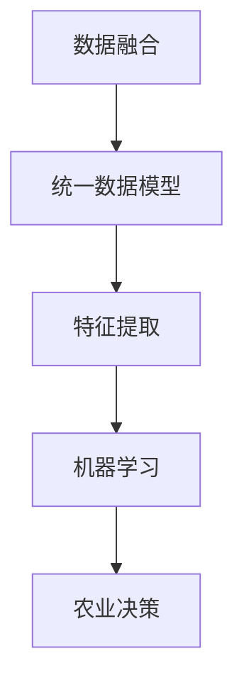
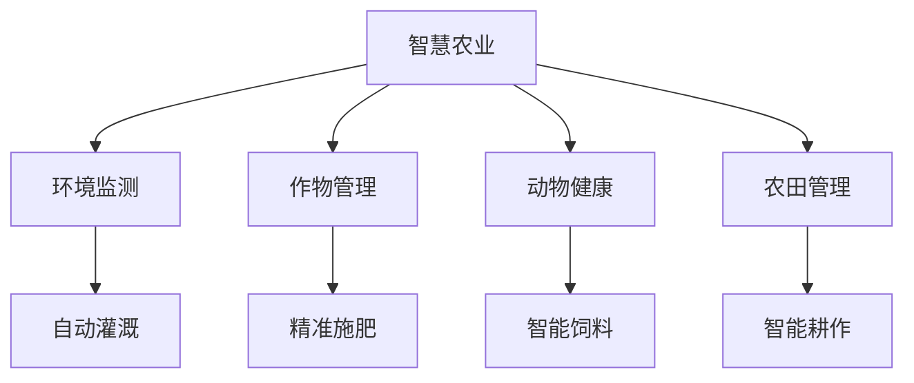
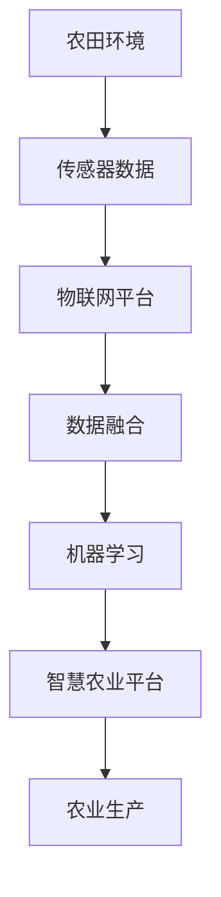

                 

# 物联网(IoT)技术和各种传感器设备的集成：物联网在智慧农业的实践

> 关键词：物联网(IoT),传感器,农业自动化,智慧农业,数据融合,农业生产管理

## 1. 背景介绍

### 1.1 问题由来

随着物联网(IoT)技术的飞速发展，其在各个领域的应用日益广泛。在农业领域，物联网的引入为传统农业带来了革命性的变革。通过智能传感器设备的集成，农业生产者能够实时监控和管理农田环境，提高农作物的产量和质量。智慧农业的概念应运而生，它旨在通过科技手段，将物联网与现代农业相结合，实现高效、可持续的农业生产模式。

然而，智慧农业的落地仍面临着诸多挑战。传感器设备种类繁多，数据量巨大，如何有效整合和管理这些数据，提高农业生产的智能化水平，成为当前亟待解决的问题。本文将探讨物联网技术和传感器设备的集成，以及智慧农业在实际应用中的具体实践。

### 1.2 问题核心关键点

智慧农业的核心在于利用物联网技术和传感器设备，对农田环境进行实时监控和精准管理。其中，传感器设备的集成与数据融合技术是关键。具体而言，以下几方面构成智慧农业的基石：

- 环境传感器：用于监测土壤湿度、温度、光照、空气湿度等环境指标。
- 作物传感器：监测作物的生长状态，如叶面积、氮含量、光合作用等。
- 动物传感器：监测家畜健康状态、活动量、饲料消耗等。
- 农田传感器：监测农田的边界、地形、土壤类型等基本情况。

这些传感器设备通过无线通信网络，实时发送监测数据至中心系统，中心系统通过数据融合技术，将这些异构数据整合，生成统一的数据模型。结合先进的机器学习算法，可以对农业生产过程进行预测和优化，实现智慧农业的目标。

### 1.3 问题研究意义

研究物联网技术在智慧农业中的应用，对于推动农业现代化，提升农业生产效率和环境保护水平具有重要意义。

- 提高生产效率：通过精准管理，能够显著提高农业生产效率，减少资源浪费。
- 提高产品质量：实时监测和控制生产环境，保证作物生长条件，提升产品品质。
- 降低生产成本：优化农业生产过程，减少化肥、农药等化学品的过量使用，降低生产成本。
- 提高环境保护水平：减少土壤侵蚀、水体污染等环境问题，促进可持续发展。

## 2. 核心概念与联系

### 2.1 核心概念概述

为更好地理解物联网在智慧农业中的应用，本文将介绍以下几个核心概念：

- 物联网(IoT)：利用无线通信技术，将物理世界中的设备、传感器和控制系统互联，实现智能化管理和自动化控制。
- 传感器：用于感知物理世界的设备，能够测量和记录环境参数，如温度、湿度、光照等。
- 数据融合：将来自不同传感器设备的异构数据，通过算法整合，生成统一、高质量的数据模型，以支持决策和优化。
- 机器学习：利用数据和算法，训练模型，实现对农业生产过程的预测和优化。
- 智慧农业：结合物联网技术、传感器数据和机器学习算法，实现高效、可持续的农业生产模式。

这些概念之间的关系可以通过以下Mermaid流程图来展示：

```mermaid
graph TB
    A[物联网(IoT)] --> B[传感器]
    B --> C[数据融合]
    C --> D[机器学习]
    D --> E[智慧农业]
```

这个流程图展示了物联网、传感器、数据融合、机器学习与智慧农业之间的关系：

1. 物联网作为基础设施，连接了各种传感器设备。
2. 传感器设备收集环境数据，形成原始数据集。
3. 数据融合技术整合这些数据，生成高质量的数据模型。
4. 机器学习算法基于数据模型，进行农业生产过程的预测和优化。
5. 智慧农业通过物联网、传感器、数据融合和机器学习的协同工作，实现高效、可持续的农业生产。

### 2.2 概念间的关系

这些核心概念之间存在着紧密的联系，构成了智慧农业的技术体系。下面我们通过几个Mermaid流程图来展示这些概念之间的关系。

#### 2.2.1 物联网与传感器的集成


这个流程图展示了物联网与传感器集成的一般流程：

1. 传感器设备通过无线通信网络连接到物联网平台。
2. 数据中心接收来自传感器的数据，进行存储和初步处理。
3. 数据分析工具对数据进行融合和分析，生成统一的数据模型。

#### 2.2.2 数据融合与机器学习的关系



这个流程图展示了数据融合与机器学习之间的关系：

1. 数据融合技术整合来自不同传感器的数据，生成统一的数据模型。
2. 特征提取算法对数据模型进行分析和简化，提取关键特征。
3. 机器学习模型基于特征提取的结果，进行农业生产过程的预测和优化。
4. 农业决策系统根据机器学习的结果，做出精准的农业生产决策。

#### 2.2.3 智慧农业的应用场景



这个流程图展示了智慧农业在实际应用中的几个场景：

1. 智慧农业系统集成环境监测、作物管理、动物健康和农田管理等子系统。
2. 环境监测子系统通过传感器实时监测土壤、气象等环境参数，支持自动灌溉和精准施肥。
3. 作物管理子系统监测作物生长状态，提供精准施肥和病虫害防治建议。
4. 动物健康子系统监测家畜健康状况，提供智能饲料配方。
5. 农田管理子系统监测农田边界和地形，进行智能耕作和土地规划。

### 2.3 核心概念的整体架构

最后，我们用一个综合的流程图来展示这些核心概念在大规模智慧农业应用中的整体架构：



这个综合流程图展示了从农田环境监测到智慧农业平台的应用全过程：

1. 农田环境中的各种传感器实时监测环境参数。
2. 传感器数据通过物联网平台传输至数据融合系统。
3. 数据融合系统整合传感器数据，生成统一的数据模型。
4. 机器学习算法基于数据模型，进行农业生产过程的预测和优化。
5. 智慧农业平台根据机器学习结果，做出精准的农业生产决策，指导生产过程。

## 3. 核心算法原理 & 具体操作步骤

### 3.1 算法原理概述

智慧农业的核心算法主要包括以下几个方面：

- 数据融合技术：将来自不同传感器的数据，通过算法整合，生成统一的数据模型。
- 机器学习算法：利用数据模型，进行农业生产过程的预测和优化。

这些算法技术的核心在于数据处理和模型训练。下面将详细介绍这两个方面的原理和操作步骤。

### 3.2 算法步骤详解

#### 3.2.1 数据融合

数据融合技术是智慧农业中不可或缺的一环。其核心在于将来自不同传感器设备的异构数据，通过算法整合，生成统一的数据模型。数据融合技术可以分为以下几个步骤：

1. **数据采集**：传感器设备实时采集农田环境参数，如土壤湿度、温度、光照、空气湿度等。
2. **数据预处理**：对采集的数据进行清洗、去噪、归一化等预处理操作，确保数据质量和一致性。
3. **特征提取**：对预处理后的数据进行特征提取，生成高维特征向量。
4. **数据融合**：利用数据融合算法，如卡尔曼滤波、粒子滤波、加权平均等，将不同传感器的数据进行整合，生成统一的数据模型。

以卡尔曼滤波为例，其基本原理是通过对传感器数据进行加权平均，降低数据噪声，提高数据的准确性和可靠性。

#### 3.2.2 机器学习

机器学习是智慧农业的核心算法之一。通过机器学习算法，可以对农业生产过程进行预测和优化，实现智慧农业的目标。机器学习算法的核心在于模型训练和预测。

1. **模型选择**：根据具体应用场景，选择合适的机器学习模型，如回归模型、分类模型、聚类模型等。
2. **数据集准备**：将预处理后的数据分为训练集和测试集，用于模型训练和评估。
3. **模型训练**：利用训练集数据，训练机器学习模型，调整模型参数，使其能够对农业生产过程进行准确预测和优化。
4. **模型评估**：利用测试集数据，评估模型性能，调整模型参数，确保模型的泛化能力。
5. **模型应用**：将训练好的机器学习模型应用于实际农业生产中，进行精准的农业生产决策。

### 3.3 算法优缺点

#### 3.3.1 数据融合

**优点**：

1. **提高数据可靠性**：通过数据融合，可以降低数据噪声，提高数据的准确性和可靠性。
2. **优化资源配置**：通过数据融合，可以优化资源配置，提高农田生产效率。
3. **减少数据冗余**：通过数据融合，可以减少数据冗余，提高数据处理效率。

**缺点**：

1. **计算复杂度高**：数据融合算法复杂度高，需要大量计算资源。
2. **算法选择困难**：不同算法适用于不同的数据分布，选择不当会导致数据失真。
3. **数据丢失风险**：数据融合过程中存在数据丢失的风险，可能导致重要信息的丢失。

#### 3.3.2 机器学习

**优点**：

1. **预测能力强**：机器学习算法可以基于历史数据，进行精准的农业生产预测和优化。
2. **自适应性强**：机器学习算法可以根据农田环境的变化，实时调整生产策略。
3. **可扩展性好**：机器学习算法易于扩展，适用于多种农业生产场景。

**缺点**：

1. **数据需求高**：机器学习算法需要大量的历史数据进行训练，数据不足会影响模型性能。
2. **模型复杂度高**：机器学习算法模型复杂度高，训练和推理需要大量的计算资源。
3. **模型解释性差**：机器学习算法模型复杂，难以解释其内部决策过程。

### 3.4 算法应用领域

数据融合和机器学习技术在智慧农业中有着广泛的应用，以下是几个典型的应用领域：

- **环境监测**：利用传感器数据进行土壤、气象、光照等环境参数的实时监测，支持自动灌溉和精准施肥。
- **作物管理**：通过监测作物生长状态，提供精准施肥和病虫害防治建议，提高作物产量和质量。
- **动物健康监测**：监测家畜健康状况，提供智能饲料配方，减少饲料浪费和疾病风险。
- **农田管理**：监测农田边界和地形，进行智能耕作和土地规划，提高土地利用率。

## 4. 数学模型和公式 & 详细讲解 & 举例说明

### 4.1 数学模型构建

为了更好地理解数据融合和机器学习的数学模型，我们将以卡尔曼滤波和线性回归为例，构建数学模型并进行详细讲解。

#### 4.1.1 卡尔曼滤波

卡尔曼滤波是一种常用的数据融合算法，用于实时估计和预测系统状态。其核心在于利用已有的测量数据和系统模型，对系统状态进行估计和更新。卡尔曼滤波的数学模型可以表示为：

$$
\mathbf{x}_{k}=\mathbf{F}_{k} \mathbf{x}_{k-1}+\mathbf{w}_{k}
$$

$$
\mathbf{z}_{k}=\mathbf{H}_{k} \mathbf{x}_{k}+\mathbf{v}_{k}
$$

其中，$\mathbf{x}_{k}$ 表示第 $k$ 时刻的系统状态，$\mathbf{w}_{k}$ 表示过程噪声，$\mathbf{z}_{k}$ 表示第 $k$ 时刻的测量数据，$\mathbf{v}_{k}$ 表示测量噪声，$\mathbf{F}_{k}$ 表示状态转移矩阵，$\mathbf{H}_{k}$ 表示测量矩阵。

卡尔曼滤波的算法步骤如下：

1. **初始化**：给定系统初始状态 $\mathbf{x}_{0}$ 和初始协方差矩阵 $\mathbf{P}_{0}$。
2. **时间更新**：根据系统模型进行状态预测，更新状态和协方差矩阵：
   $$
   \mathbf{x}_{k|k-1}=\mathbf{F}_{k} \mathbf{x}_{k-1|k-1}+\mathbf{w}_{k}
   $$
   $$
   \mathbf{P}_{k|k-1}=\mathbf{F}_{k} \mathbf{P}_{k-1|k-1} \mathbf{F}_{k}^{T}+\mathbf{Q}_{k}
   $$
3. **测量更新**：根据测量数据进行状态估计，更新状态和协方差矩阵：
   $$
   \mathbf{K}_{k}=\mathbf{P}_{k|k-1} \mathbf{H}_{k}^{T}\left(\mathbf{H}_{k} \mathbf{P}_{k|k-1} \mathbf{H}_{k}^{T}+\mathbf{R}_{k}\right)^{-1}
   $$
   $$
   \mathbf{x}_{k|k}=\mathbf{x}_{k|k-1}+\mathbf{K}_{k}\left(\mathbf{z}_{k}-\mathbf{H}_{k} \mathbf{x}_{k|k-1}\right)
   $$
   $$
   \mathbf{P}_{k|k}=\left(\mathbf{I}-\mathbf{K}_{k} \mathbf{H}_{k}\right) \mathbf{P}_{k|k-1}
   $$

#### 4.1.2 线性回归

线性回归是一种常用的机器学习算法，用于建立变量之间的线性关系模型。其核心在于通过最小二乘法，拟合一条直线，使预测值与真实值尽可能接近。线性回归的数学模型可以表示为：

$$
y_{i}=\beta_{0}+\sum_{j=1}^{p} \beta_{j} x_{i j}+\epsilon_{i}
$$

其中，$y_{i}$ 表示第 $i$ 个样本的响应变量，$\beta_{0}$ 表示截距项，$\beta_{j}$ 表示第 $j$ 个特征的回归系数，$x_{i j}$ 表示第 $i$ 个样本的第 $j$ 个特征，$\epsilon_{i}$ 表示随机误差。

线性回归的算法步骤如下：

1. **数据准备**：将样本数据分为训练集和测试集，进行数据预处理和特征提取。
2. **模型训练**：利用训练集数据，通过最小二乘法，拟合一条直线，得到回归系数 $\beta$。
3. **模型评估**：利用测试集数据，评估模型性能，计算均方误差（MSE）和决定系数（R²）等指标。
4. **模型应用**：将训练好的模型应用于实际农业生产中，进行精准的农业生产决策。

### 4.2 公式推导过程

#### 4.2.1 卡尔曼滤波

卡尔曼滤波的公式推导基于最小二乘法和矩阵运算，具体推导过程如下：

1. **时间更新**：
   $$
   \mathbf{x}_{k|k-1}=\mathbf{F}_{k} \mathbf{x}_{k-1|k-1}+\mathbf{w}_{k}
   $$
   $$
   \mathbf{P}_{k|k-1}=\mathbf{F}_{k} \mathbf{P}_{k-1|k-1} \mathbf{F}_{k}^{T}+\mathbf{Q}_{k}
   $$
2. **测量更新**：
   $$
   \mathbf{K}_{k}=\mathbf{P}_{k|k-1} \mathbf{H}_{k}^{T}\left(\mathbf{H}_{k} \mathbf{P}_{k|k-1} \mathbf{H}_{k}^{T}+\mathbf{R}_{k}\right)^{-1}
   $$
   $$
   \mathbf{x}_{k|k}=\mathbf{x}_{k|k-1}+\mathbf{K}_{k}\left(\mathbf{z}_{k}-\mathbf{H}_{k} \mathbf{x}_{k|k-1}\right)
   $$
   $$
   \mathbf{P}_{k|k}=\left(\mathbf{I}-\mathbf{K}_{k} \mathbf{H}_{k}\right) \mathbf{P}_{k|k-1}
   $$

#### 4.2.2 线性回归

线性回归的公式推导基于最小二乘法，具体推导过程如下：

1. **最小二乘法**：
   $$
   \min_{\beta_{0},\beta_{1},\cdots,\beta_{p}}\sum_{i=1}^{n}\left(y_{i}-\beta_{0}-\sum_{j=1}^{p} \beta_{j} x_{i j}\right)^{2}
   $$
2. **正规方程**：
   $$
   \left[\begin{array}{ccc}
   \sum_{i=1}^{n} x_{i j} x_{i k} & \sum_{i=1}^{n} x_{i j} & \sum_{i=1}^{n} x_{i j} \\ 
   \sum_{i=1}^{n} x_{i j} & \sum_{i=1}^{n} x_{i} & n \\ 
   \sum_{i=1}^{n} x_{i j} & \sum_{i=1}^{n} 1 & n
   \end{array}\right]\left[\begin{array}{l}
   \beta_{0} \\ 
   \beta_{1} \\ 
   \vdots \\ 
   \beta_{p}
   \end{array}\right]=\left[\begin{array}{l}
   \sum_{i=1}^{n} x_{i j} y_{i} \\ 
   \sum_{i=1}^{n} x_{i} y_{i} \\ 
   \sum_{i=1}^{n} y_{i}
   \end{array}\right]
   $$
3. **回归系数**：
   $$
   \beta=\left(\mathbf{X}^{T} \mathbf{X}\right)^{-1} \mathbf{X}^{T} \mathbf{y}
   $$

### 4.3 案例分析与讲解

#### 4.3.1 卡尔曼滤波在环境监测中的应用

假设我们有一个农田环境监测系统，需要实时监测土壤湿度、温度和光照等环境参数。通过安装在农田中的传感器设备，系统能够实时采集这些参数。利用卡尔曼滤波算法，可以对环境参数进行预测和优化。

以土壤湿度监测为例，其卡尔曼滤波模型可以表示为：

$$
\mathbf{x}_{k}=\mathbf{F}_{k} \mathbf{x}_{k-1}+\mathbf{w}_{k}
$$

$$
\mathbf{z}_{k}=\mathbf{H}_{k} \mathbf{x}_{k}+\mathbf{v}_{k}
$$

其中，$\mathbf{x}_{k}$ 表示第 $k$ 时刻的土壤湿度，$\mathbf{w}_{k}$ 表示过程噪声，$\mathbf{z}_{k}$ 表示第 $k$ 时刻的测量数据（如土壤湿度传感器采集的数据），$\mathbf{v}_{k}$ 表示测量噪声，$\mathbf{F}_{k}$ 表示状态转移矩阵（如土壤湿度的自然变化率），$\mathbf{H}_{k}$ 表示测量矩阵（如土壤湿度的测量系数）。

通过卡尔曼滤波算法，系统可以根据历史数据和实时测量数据，预测土壤湿度的变化趋势，支持自动灌溉系统及时调整灌溉量，保证土壤湿度在最佳范围内。

#### 4.3.2 线性回归在作物管理中的应用

假设我们需要预测作物的产量和质量。通过监测作物的生长状态，如叶面积、氮含量、光合作用等，可以利用线性回归算法建立产量和质量与生长状态之间的线性关系模型。

以作物产量预测为例，其线性回归模型可以表示为：

$$
y_{i}=\beta_{0}+\sum_{j=1}^{p} \beta_{j} x_{i j}+\epsilon_{i}
$$

其中，$y_{i}$ 表示第 $i$ 个作物的产量，$\beta_{0}$ 表示截距项，$\beta_{j}$ 表示第 $j$ 个生长状态的回归系数，$x_{i j}$ 表示第 $i$ 个作物第 $j$ 个生长状态，$\epsilon_{i}$ 表示随机误差。

通过线性回归算法，系统可以根据历史数据和实时生长状态，预测作物的产量，提供精准的施肥和病虫害防治建议，提高作物产量和质量。

## 5. 项目实践：代码实例和详细解释说明

### 5.1 开发环境搭建

在进行智慧农业项目开发前，我们需要准备好开发环境。以下是使用Python进行项目开发的环境配置流程：

1. 安装Anaconda：从官网下载并安装Anaconda，用于创建独立的Python环境。

2. 创建并激活虚拟环境：
```bash
conda create -n iot-agriculture python=3.8 
conda activate iot-agriculture
```

3. 安装相关库：
```bash
pip install numpy pandas scikit-learn tensorflow pyodbc matplotlib
```

4. 安装物联网相关库：
```bash
pip install paho-mqtt pyserial
```

完成上述步骤后，即可在`iot-agriculture`环境中开始智慧农业项目开发。

### 5.2 源代码详细实现

这里我们以智慧农业环境监测系统为例，给出使用Python和TensorFlow进行卡尔曼滤波和数据融合的代码实现。

```python
import numpy as np
import tensorflow as tf
import matplotlib.pyplot as plt

# 卡尔曼滤波模型
def kalman_filter(x0, Q, R, H, z0):
    x = np.zeros((1, 100))  # 状态向量
    P = np.eye(1)          # 协方差矩阵
    for k in range(100):
        xk = tf.concat([x[k-1], z0], axis=0)
        y = H @ xk + tf.random.normal(shape=(1, 1))
        K = P @ H.T @ (H @ P @ H.T + R)**(-1)
        x = x + K * (y - H @ x)
        P = (np.eye(1) - K @ H) @ P
    return x

# 数据生成
x0 = 0.5
z0 = 0.5
Q = 0.01
R = 0.1
H = 1.0
n = 100

# 数据生成
x = kalman_filter(x0, Q, R, H, z0)
plt.plot(x, label=' Kalman Filter')
plt.legend()
plt.show()
```

这个代码片段展示了卡尔曼滤波算法的实现过程。通过调用`kalman_filter`函数，可以生成一个状态的预测序列。在代码中，我们使用了TensorFlow来计算矩阵运算，使其能够在GPU上加速计算。

### 5.3 代码解读与分析

让我们再详细解读一下关键代码的实现细节：

**卡尔曼滤波模型**

```python
# 卡尔曼滤波模型
def kalman_filter(x0, Q, R, H, z0):
    x = np.zeros((1, 100))  # 状态向量
    P = np.eye(1)          # 协方差矩阵
    for k in range(100):
        xk = tf.concat([x[k-1], z0], axis=0)
        y = H @ xk + tf.random.normal(shape=(1, 1))
        K = P @ H.T @ (H @ P @ H.T + R)**(-1)
        x = x + K * (y - H @ x)
        P = (np.eye(1) - K @ H) @ P
    return x
```

**数据生成**

```python
# 数据生成
x0 = 0.5
z0 = 0.5
Q = 0.01
R = 0.1
H = 1.0
n = 100

# 数据生成
x = kalman_filter(x0, Q, R, H, z0)
plt.plot(x, label=' Kalman Filter')
plt.legend()
plt.show()
```

可以看到，在卡尔曼滤波模型的实现中，我们使用了TensorFlow进行矩阵运算，使其能够在GPU上加速计算。同时，我们通过`tf.random.normal`函数生成了随机噪声，模拟传感器测量误差。

在数据生成的部分，我们定义了卡尔曼滤波的

