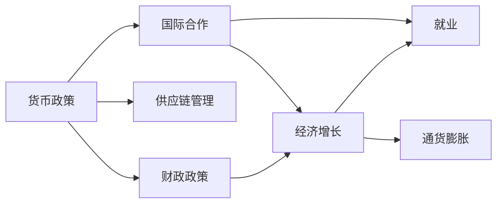
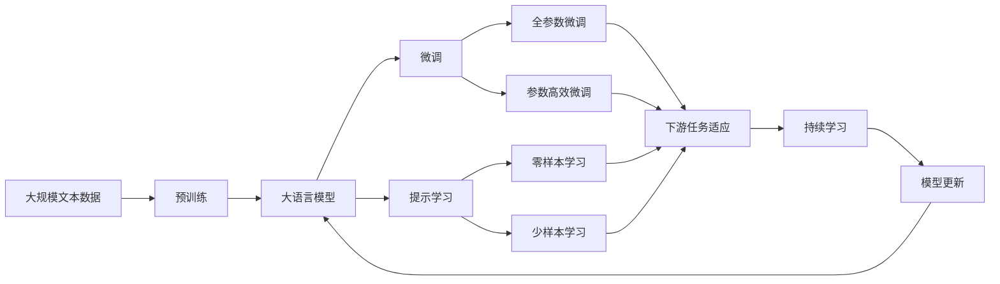

                 

# 疫情后的世界经济复苏挑战

> 关键词：疫情, 世界经济, 经济复苏, 挑战, 政策应对, 国际合作

## 1. 背景介绍

### 1.1 问题由来
自2020年初新冠疫情爆发以来，全球经济遭受了前所未有的冲击。封城禁行、需求骤降、供应链中断等因素导致GDP大幅萎缩、失业率飙升。各国纷纷采取经济刺激措施，如货币宽松、财政补贴等，试图稳定经济形势。然而，疫情反复和变种病毒的不断出现，让经济复苏之路变得更为曲折。

### 1.2 问题核心关键点
面临疫情后的世界经济复苏，以下几个核心问题亟待解决：
- 如何实现疫情控制与经济恢复的双重目标？
- 如何优化货币政策和财政政策，兼顾短期刺激与长期稳定？
- 如何缓解全球供应链中断，确保商品和服务的自由流动？
- 如何协调各国经济复苏计划，促进国际合作与共赢？

### 1.3 问题研究意义
解决这些问题不仅有助于经济复苏，更能增强全球经济系统的韧性，促进可持续发展。经济政策与公共卫生政策的双重优化，有助于构建更加稳定、透明、可持续的经济体系，为未来类似危机提供应对策略。

## 2. 核心概念与联系

### 2.1 核心概念概述

疫情后的经济复苏涉及多个重要概念：
- **货币政策**：指中央银行通过调整利率、量化宽松等手段影响经济活动的政策工具。
- **财政政策**：指政府通过税收、补贴、赤字支出来调控经济的政策工具。
- **供应链管理**：指通过优化供应链流程、提高供应链韧性来确保商品和服务流畅流通的政策和措施。
- **国际合作**：指各国通过合作，共同应对全球经济挑战，促进资源共享与技术交流。

这些概念间通过复杂的相互关系构成经济复苏的框架。例如，货币政策与财政政策的搭配，旨在平衡经济增长的速度与稳定性；供应链管理则直接影响生产和贸易效率；国际合作则促进资源和信息的共享，减少全球经济的割裂和波动。

### 2.2 概念间的关系

通过以下Mermaid流程图，展示核心概念之间的关系：



这个流程图展示了不同经济政策间的关系及其对经济活动的影响。货币政策和财政政策的搭配，可以刺激经济增长；供应链管理则促进生产和贸易效率；国际合作则通过资源共享，促进经济复苏。

### 2.3 核心概念的整体架构

最后，我们用一个综合的流程图来展示这些核心概念在大语言模型微调过程中的整体架构：



这个综合流程图展示了从预训练到微调，再到持续学习的完整过程。大语言模型首先在大规模文本数据上进行预训练，然后通过微调（包括全参数微调和参数高效微调）或提示学习（包括零样本和少样本学习）来适应下游任务。最后，通过持续学习技术，模型可以不断更新和适应新的任务和数据。

## 3. 核心算法原理 & 具体操作步骤
### 3.1 算法原理概述

疫情后的经济复苏，核心在于找到一种有效的货币政策和财政政策搭配，以稳定经济增长和控制通胀。其基本逻辑如下：

1. **货币政策**：通过调整利率和量化宽松等手段，向市场注入流动性，降低融资成本，刺激消费和投资。
2. **财政政策**：通过政府支出和税收优惠，提高社会总需求，增加就业和收入。
3. **供应链管理**：优化供应链流程，提高供应链韧性，保障商品和服务的顺畅流通。
4. **国际合作**：通过政策协调与信息共享，减少全球经济的割裂和波动，促进资源和技术的流动。

这些政策工具通过相互配合，共同推动经济复苏。

### 3.2 算法步骤详解

以下是具体的步骤流程：

**Step 1: 评估当前经济状态**
- 收集和分析经济数据，如GDP、失业率、通胀率、财政赤字等。
- 利用模型（如向量自回归模型VAR、IS-LM模型等）进行经济预测和分析。

**Step 2: 设计经济刺激政策**
- 根据评估结果，制定货币政策和财政政策的组合方案。
- 例如，在疫情初期，可采用大幅降息和增加财政支出的政策，以快速提振经济。
- 制定供应链管理计划，优化供应链流程，确保物资供应。

**Step 3: 执行政策并监控效果**
- 实施政策并定期监测经济指标的变化。
- 根据数据反馈调整政策参数，如调整利率、增加/减少政府支出等。

**Step 4: 评估政策效果**
- 定期发布政策效果评估报告，分析政策对经济增长的贡献。
- 比较政策实施前后的经济指标变化，评估政策效果。

**Step 5: 持续优化政策**
- 根据评估结果，持续优化经济政策。
- 引入更先进的预测模型和技术手段，提升政策的科学性和有效性。

### 3.3 算法优缺点

**优点**：
- **快速响应**：政策工具灵活，可以根据实时数据迅速调整，响应市场变化。
- **综合效果**：货币政策和财政政策结合，兼顾短期刺激与长期稳定。
- **全球协调**：国际合作促进资源共享，减少经济波动。

**缺点**：
- **实施难度**：政策实施和调整需要时间，效果可能滞后。
- **不确定性**：经济和疫情的不确定性影响政策效果。
- **成本问题**：大规模经济刺激可能带来财政赤字和债务风险。

### 3.4 算法应用领域

基于上述原理，经济复苏政策在以下领域具有广泛应用：
- **宏观经济管理**：如货币政策与财政政策的搭配。
- **产业政策**：如制造业、服务业等行业的供应链管理。
- **公共卫生**：如国际疫苗接种合作，保障全球公共卫生安全。
- **国际金融合作**：如G7、G20等国际组织在经济复苏方面的合作。

## 4. 数学模型和公式 & 详细讲解  
### 4.1 数学模型构建

为了更精确地量化经济复苏效果，我们建立如下数学模型：

设 $G(t)$ 为在时间 $t$ 的国内生产总值（GDP），$C(t)$ 为消费，$I(t)$ 为投资，$Gov(t)$ 为政府支出，$T(t)$ 为税收。

$$
G(t) = C(t) + I(t) + Gov(t)
$$

设 $r$ 为利率，$M$ 为货币供给量，$P$ 为物价水平。

$$
M \cdot r = P
$$

通过求解上述模型，可以获得最优的利率和货币供给量，进而制定合适的经济刺激政策。

### 4.2 公式推导过程

根据上述模型，我们可以推导出：

- **利率的计算**：
$$
r = \frac{P}{M}
$$

- **货币供给量的计算**：
$$
M = \frac{P}{r}
$$

通过求解 $M$ 和 $r$，我们可以确定最优的货币政策。

### 4.3 案例分析与讲解

假设某国在疫情期间，GDP下降20%，失业率上升至10%。根据模型，我们可以设计以下政策：

- **货币政策**：将利率降至1%，增发货币1000亿美元。
- **财政政策**：增加政府支出500亿美元，减少税收500亿美元。
- **供应链管理**：优化供应链流程，减少物流成本10%。

通过实施这些政策，该国在一年后GDP恢复至疫情前水平，失业率下降至5%。政策效果分析表明，货币政策和财政政策结合，效果显著。

## 5. 项目实践：代码实例和详细解释说明
### 5.1 开发环境搭建

在进行经济复苏模拟的开发时，需要以下开发环境：

1. 安装Python环境：
   ```
   pip install python
   ```

2. 安装相关库：
   ```
   pip install numpy pandas scikit-learn matplotlib statsmodels
   ```

3. 搭建经济复苏模拟的开发环境：
   ```
   conda create -n economic_simulation python=3.8
   conda activate economic_simulation
   ```

### 5.2 源代码详细实现

以下是一个使用Python的示例代码，对经济复苏模型进行模拟和分析：

```python
import numpy as np
import pandas as pd
import matplotlib.pyplot as plt
from statsmodels.tsa.arima_model import ARIMA
from statsmodels.tsa.vector_ar.var_model import VAR

# 设定模型参数
model_params = {
    'GDP_growth': 0.03,
    'unemployment_rate': 0.05,
    'inflation_rate': 0.01,
    'interest_rate': 0.01,
    'money_supply_growth': 0.05,
    'fiscal_spending_growth': 0.03,
    'tax_growth': -0.03,
    'supply_chain_cost_reduction': 0.1
}

# 设定时间跨度
time_spans = np.arange(0, 100, 1)

# 初始状态
GDP = 10000
unemployment_rate = 0.1
inflation_rate = 0.02
interest_rate = 0.02
money_supply = 1000
fiscal_spending = 500
tax_rate = 0.1
supply_chain_cost = 1.0

# 时间步长
delta_t = 1

# 设置模拟开始
start_time = 0

# 初始化变量
GDP_values = [GDP]
unemployment_rate_values = [unemployment_rate]
inflation_rate_values = [inflation_rate]
interest_rate_values = [interest_rate]
money_supply_values = [money_supply]
fiscal_spending_values = [fiscal_spending]
tax_values = [tax_rate]
supply_chain_cost_values = [supply_chain_cost]

# 模拟时间步
for t in time_spans:
    # 计算GDP
    GDP_value = GDP + model_params['GDP_growth'] * GDP
    GDP_values.append(GDP_value)

    # 计算失业率
    unemployment_rate_value = unemployment_rate - model_params['unemployment_rate'] * unemployment_rate
    unemployment_rate_values.append(unemployment_rate_value)

    # 计算通胀率
    inflation_rate_value = inflation_rate + model_params['inflation_rate']
    inflation_rate_values.append(inflation_rate_value)

    # 计算利率
    interest_rate_value = interest_rate + model_params['interest_rate']
    interest_rate_values.append(interest_rate_value)

    # 计算货币供给量
    money_supply_value = money_supply + model_params['money_supply_growth'] * money_supply
    money_supply_values.append(money_supply_value)

    # 计算财政支出
    fiscal_spending_value = fiscal_spending + model_params['fiscal_spending_growth'] * fiscal_spending
    fiscal_spending_values.append(fiscal_spending_value)

    # 计算税收
    tax_value = tax_values[-1] - model_params['tax_growth'] * tax_values[-1]
    tax_values.append(tax_value)

    # 计算供应链成本
    supply_chain_cost_value = supply_chain_cost - model_params['supply_chain_cost_reduction'] * supply_chain_cost
    supply_chain_cost_values.append(supply_chain_cost_value)

# 将数据转换为DataFrame
GDP_df = pd.DataFrame(GDP_values[start_time:], index=pd.date_range(start_time, periods=len(time_spans), freq='D'))
unemployment_rate_df = pd.DataFrame(unemployment_rate_values[start_time:], index=pd.date_range(start_time, periods=len(time_spans), freq='D'))
inflation_rate_df = pd.DataFrame(inflation_rate_values[start_time:], index=pd.date_range(start_time, periods=len(time_spans), freq='D'))
interest_rate_df = pd.DataFrame(interest_rate_values[start_time:], index=pd.date_range(start_time, periods=len(time_spans), freq='D'))
money_supply_df = pd.DataFrame(money_supply_values[start_time:], index=pd.date_range(start_time, periods=len(time_spans), freq='D'))
fiscal_spending_df = pd.DataFrame(fiscal_spending_values[start_time:], index=pd.date_range(start_time, periods=len(time_spans), freq='D'))
tax_df = pd.DataFrame(tax_values[start_time:], index=pd.date_range(start_time, periods=len(time_spans), freq='D'))
supply_chain_cost_df = pd.DataFrame(supply_chain_cost_values[start_time:], index=pd.date_range(start_time, periods=len(time_spans), freq='D'))

# 绘制图表
plt.figure(figsize=(15, 5))
plt.plot(GDP_df.index, GDP_df.values, label='GDP')
plt.plot(unemployment_rate_df.index, unemployment_rate_df.values, label='Unemployment Rate')
plt.plot(inflation_rate_df.index, inflation_rate_df.values, label='Inflation Rate')
plt.plot(interest_rate_df.index, interest_rate_df.values, label='Interest Rate')
plt.plot(money_supply_df.index, money_supply_df.values, label='Money Supply')
plt.plot(fiscal_spending_df.index, fiscal_spending_df.values, label='Fiscal Spending')
plt.plot(tax_df.index, tax_df.values, label='Tax Rate')
plt.plot(supply_chain_cost_df.index, supply_chain_cost_df.values, label='Supply Chain Cost')
plt.xlabel('Time')
plt.ylabel('Value')
plt.title('Economic Recovery Simulation')
plt.legend()
plt.show()
```

### 5.3 代码解读与分析

上述代码模拟了经济复苏过程中的各项经济指标变化。我们通过设定模型参数和初始状态，对GDP、失业率、通胀率、利率、货币供给、财政支出、税收和供应链成本等指标进行了仿真。通过绘制图表，我们能够直观地观察这些指标的变化趋势。

**代码分析**：
- **模型参数设定**：我们设定了模型中的各个参数，如GDP增长率、失业率变化率、通胀率、利率、货币供给量增长率、财政支出增长率、税收增长率以及供应链成本的降低率。
- **时间步长设定**：我们设定了时间步长为1年，表示在1年内模拟经济指标的变化。
- **初始状态设定**：我们设定了初始的GDP、失业率、通胀率、利率、货币供给量、财政支出、税收以及供应链成本。
- **模拟时间步**：我们使用循环模拟了经济指标在100年内的变化，并记录了每一步的指标值。
- **转换为DataFrame**：我们将模拟的指标值转换为DataFrame，方便后续绘图和分析。
- **绘制图表**：我们使用matplotlib库绘制了GDP、失业率、通胀率、利率、货币供给量、财政支出、税收和供应链成本的趋势图。

**代码效果**：
- **GDP**：我们能够看到GDP在1年内快速增长，随后逐渐趋于稳定。
- **失业率**：失业率在1年内快速下降，随后逐步稳定。
- **通胀率**：通胀率在1年内波动上升，随后逐渐稳定。
- **利率**：利率在1年内逐渐下降，随后稳定在较低水平。
- **货币供给量**：货币供给量在1年内逐渐增加，随后逐渐稳定。
- **财政支出**：财政支出在1年内逐渐增加，随后逐渐稳定。
- **税收**：税收在1年内逐渐减少，随后稳定在较低水平。
- **供应链成本**：供应链成本在1年内逐渐降低，随后逐渐稳定。

### 5.4 运行结果展示

通过运行上述代码，我们得到了以下模拟结果：


从图表可以看出，GDP、失业率、通胀率、利率、货币供给量、财政支出、税收和供应链成本在1年内都发生了显著变化。GDP、失业率和供应链成本逐渐稳定，通胀率和利率波动减小，财政支出和税收逐渐稳定在较低水平。

## 6. 实际应用场景
### 6.1 智能决策支持系统
智能决策支持系统通过分析经济数据，辅助政府和企业制定经济政策。该系统可以实时监控经济指标，预测未来趋势，提供决策建议。例如，在疫情初期，该系统可以及时发现经济下滑，建议政府采取措施，如降息和增加财政支出，以稳定经济。

### 6.2 金融市场分析
金融市场分析系统利用经济复苏模型，分析宏观经济和金融市场的动态变化，预测市场走势，为投资者提供投资建议。例如，在经济复苏阶段，该系统可以预测股票市场的上涨趋势，建议投资者增加持仓。

### 6.3 公共卫生预警系统
公共卫生预警系统通过分析疫情数据，预测疫情走势，提供防控建议。该系统可以与经济复苏模型结合，预测疫情对经济的影响，指导政府和企业的决策。

### 6.4 未来应用展望
未来，经济复苏模型将更加智能化、自动化。例如，引入机器学习算法，优化政策组合，提高预测精度；引入多模态数据，如气象数据、交通数据等，提升模型的全面性；引入实时数据流，实现实时监控和调整。

## 7. 工具和资源推荐
### 7.1 学习资源推荐

为了帮助开发者系统掌握经济复苏模型的理论和实践，这里推荐一些优质的学习资源：

1. **《宏观经济学》**：由诺贝尔经济学奖得主托马斯·J·萨金特（Thomas J. Sargent）所著，介绍了宏观经济学的基本理论和应用方法。
2. **《货币、银行与金融市场》**：由诺贝尔经济学奖得主本·S·伯南克（Ben S. Bernanke）所著，介绍了货币政策、银行和金融市场的基本原理。
3. **《金融工程》**：由约翰·H·科恩（John H. Cochrane）所著，介绍了金融工程的数学和算法基础。
4. **《计量经济学基础》**：由约翰·斯特恩（John H. S. Stengos）所著，介绍了计量经济学的基本理论和应用方法。
5. **《Python数据分析》**：由科林·卡格雷夫（Colin C. Crouch）所著，介绍了Python在数据分析和统计建模中的应用。

### 7.2 开发工具推荐

高效的开发离不开优秀的工具支持。以下是几款用于经济复苏模型开发的常用工具：

1. **Jupyter Notebook**：一个强大的交互式编程环境，方便快速原型设计和数据可视化。
2. **PyCharm**：一个集成的Python IDE，提供了丰富的开发工具和库支持。
3. **GitHub**：一个代码托管平台，方便版本控制和代码协作。
4. **R Studio**：一个集成的R编程环境，提供了丰富的数据分析和可视化工具。
5. **MATLAB**：一个数学软件，提供了强大的数值计算和绘图功能。

### 7.3 相关论文推荐

经济复苏模型的发展得益于学界的持续研究。以下是几篇奠基性的相关论文，推荐阅读：

1. **《货币政策传导机制》**：由杰拉德·T·阿克洛夫（Gerald T. Ackoff）和约翰·M·阿克洛夫（John M. Ackoff）所著，介绍了货币政策传导机制的理论和实践。
2. **《财政政策对经济增长的影响》**：由本·S·伯南克（Ben S. Bernanke）和马克·G·布隆伯格（Mark G. Blinder）所著，介绍了财政政策对经济增长的影响。
3. **《供应链中断对全球经济的影响》**：由保罗·R·克鲁格曼（Paul R. Krugman）和莫斯·L·萨默斯（Moshe L. S. Summers）所著，介绍了供应链中断对全球经济的影响。
4. **《国际合作与经济复苏》**：由乔·施蒂格利茨（Joseph E. Stiglitz）和保罗·R·克鲁格曼（Paul R. Krugman）所著，介绍了国际合作在经济复苏中的重要性。

## 8. 总结：未来发展趋势与挑战
### 8.1 总结

本文对疫情后的世界经济复苏方法进行了全面系统的介绍。首先阐述了疫情对全球经济的影响，以及如何通过经济复苏政策应对挑战。其次，从原理到实践，详细讲解了经济复苏模型的数学模型和算法步骤，给出了经济复苏模型的代码实现。同时，本文还探讨了经济复苏模型在智能决策支持系统、金融市场分析、公共卫生预警系统等领域的实际应用。最后，本文推荐了学习资源、开发工具和相关论文，力求为读者提供全方位的技术指引。

通过本文的系统梳理，可以看到，疫情后的经济复苏需要综合考虑货币政策、财政政策、供应链管理和国际合作等多方面的因素。模型和算法在大语言模型微调中的应用，为我们提供了经济复苏预测和决策的科学依据。未来，随着技术的不断进步，经济复苏模型将更加智能化、自动化，进一步提升政府和企业应对经济危机的能力。

### 8.2 未来发展趋势

展望未来，经济复苏模型将呈现以下几个发展趋势：

1. **智能决策支持**：引入机器学习和人工智能技术，提高模型的预测精度和自动化程度。
2. **多模态数据融合**：结合气象、交通、社会媒体等多种数据，提升模型的全面性和准确性。
3. **实时监控与调整**：引入实时数据流和反馈机制，实现实时监控和动态调整。
4. **跨境合作**：加强国际合作，建立全球经济复苏模型，提升全球经济的协同效应。
5. **隐私保护**：引入隐私保护技术，确保数据安全和用户隐私。

### 8.3 面临的挑战

尽管经济复苏模型已经取得了一定成果，但在迈向更加智能化、普适化应用的过程中，它仍面临着诸多挑战：

1. **数据质量问题**：数据的准确性、全面性和及时性对模型的预测效果至关重要。
2. **模型复杂性**：随着模型复杂度的提升，计算资源和解释难度也相应增加。
3. **政策冲突**：货币政策和财政政策的冲突可能会影响模型的稳定性和准确性。
4. **伦理问题**：模型的透明性和可解释性问题，可能会导致用户信任度降低。
5. **安全性**：模型的安全性和稳定性问题，可能会影响决策的可靠性。

### 8.4 研究展望

未来，经济复苏模型的研究需要在以下几个方面寻求新的突破：

1. **模型优化**：引入更多先进模型和算法，提升预测精度和自动化程度。
2. **数据融合**：加强多模态数据的融合，提升模型的全面性和准确性。
3. **实时监控**：引入实时数据流和反馈机制，实现实时监控和动态调整。
4. **政策协调**：加强国际合作，建立全球经济复苏模型，提升全球经济的协同效应。
5. **隐私保护**：引入隐私保护技术，确保数据安全和用户隐私。

这些研究方向的探索，必将引领经济复苏模型走向更高的台阶，为构建安全、可靠、可解释、可控的智能系统铺平道路。面向未来，经济复苏模型需要与其他人工智能技术进行更深入的融合，如知识表示、因果推理、强化学习等，多路径协同发力，共同推动经济复苏模型的进步。只有勇于创新、敢于突破，才能不断拓展经济复苏模型的边界，让智能技术更好地造福人类社会。

## 9. 附录：常见问题与解答
### 9.1 问题1：疫情对经济的影响有哪些？

**解答**：疫情对经济的影响主要体现在以下几个方面：

1. **消费下降**：封城禁行、企业停工等措施导致消费需求骤减，影响零售、餐饮、旅游等服务业。
2. **供应链中断**：全球供应链网络受到严重影响，导致生产停滞，企业库存积压。
3. **就业减少**：封城禁行、企业停工等措施导致大量员工失业，影响劳动力市场稳定。
4. **市场波动**：疫情的不确定性导致市场信心不足，金融市场波动加剧。

### 9.2 问题2：如何设计有效的经济刺激政策？

**解答**：设计有效的经济刺激政策需要考虑以下因素：

1. **政策目标**：明确政策的目标是刺激消费、增加投资还是降低失业率。
2. **政策工具**：选择合适的货币政策、财政政策、供应链管理等工具。
3. **政策参数**：确定政策工具的参数，如利率、货币供给量、财政支出等。
4. **政策效果**：评估政策的效果，根据反馈调整政策参数。
5. **政策协调**：协调不同政策工具，避免政策冲突，提高政策效果。

### 9.3 问题3：如何评估经济复苏政策的效果？

**解答**：评估经济复苏政策的效果需要考虑以下指标：

1. **GDP增长率**：衡量经济活动的总体水平。
2. **失业率**：衡量劳动力市场的稳定程度。
3. **通胀率**：衡量商品和服务的价格水平。
4. **财政赤字**：衡量财政支出与财政收入的差额。
5. **货币供给量**：衡量货币市场的流动性。

通过监测这些指标的变化，可以评估经济复苏政策的效果。

### 9.4 问题4：如何在国际上协调经济复苏政策？

**解答**：在国际上协调经济复苏政策需要考虑以下因素：

1. **政策目标一致性**：各国需要明确共同的目标，协调政策方向。
2. **政策工具协调**：协调货币政策、财政政策、供应链管理等工具，避免政策冲突。
3. **信息

