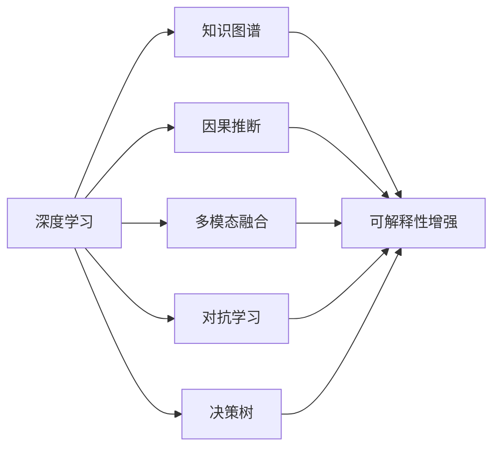
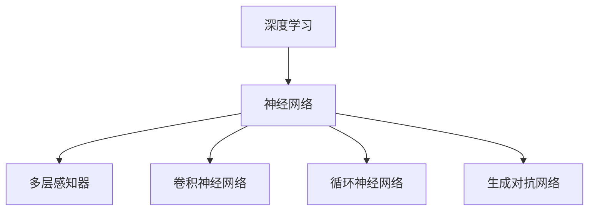
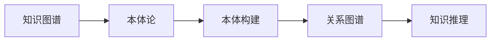
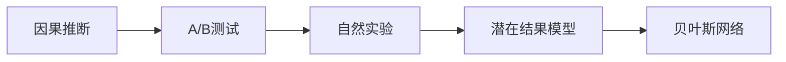
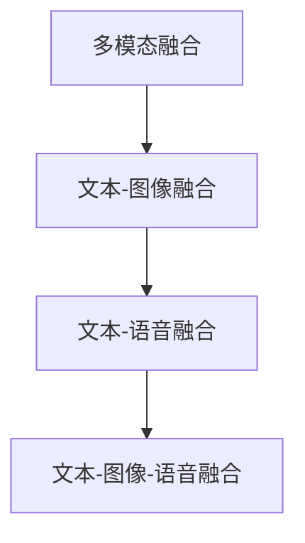
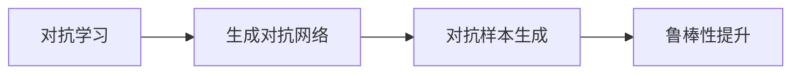
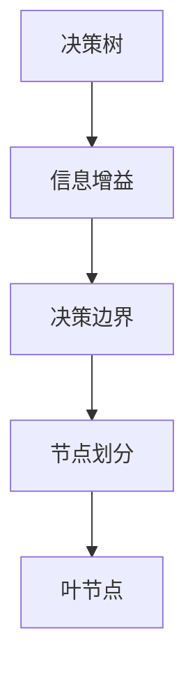
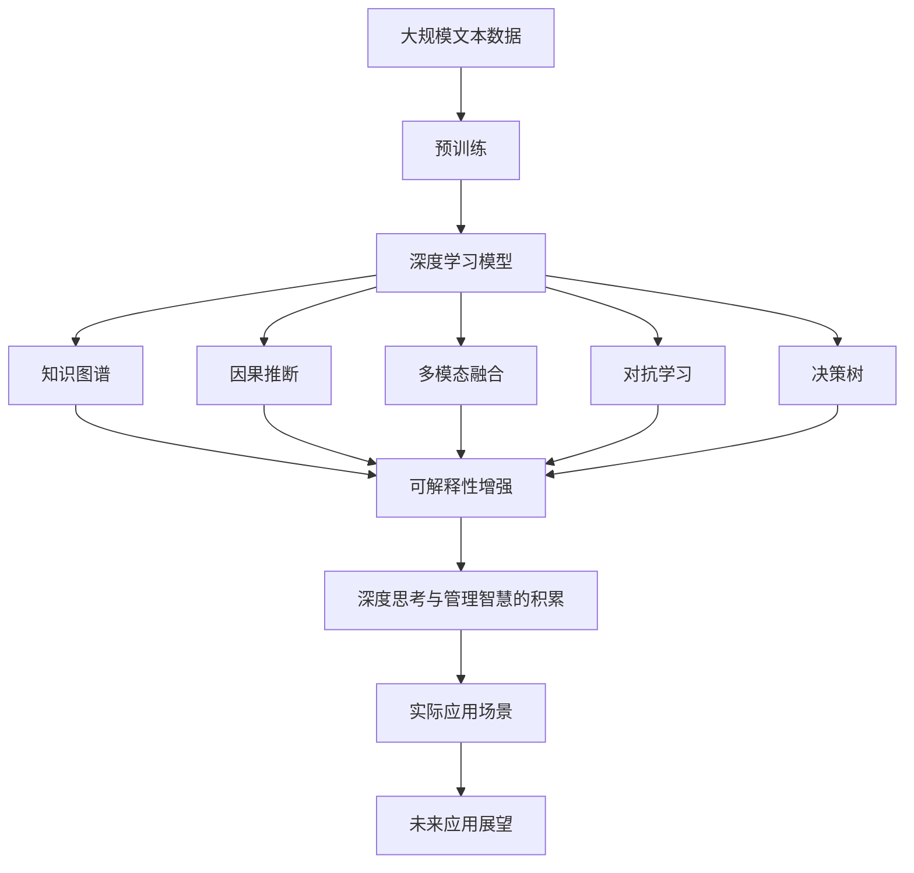

                 

## 1. 背景介绍

### 1.1 问题由来

在人工智能领域，深度学习已经成为了主流的技术范式。然而，随着模型的复杂性和规模的不断扩大，深度学习模型的可解释性和鲁棒性逐渐成为人们关注的焦点。传统的深度学习模型在处理大规模数据时，虽然能够获得较高的精度，但其“黑盒”特性和潜在的偏见问题，使得这些模型在实际应用中面临诸多挑战。

为了应对这些挑战，学者们提出了一系列方法，试图从不同的角度提升模型的可解释性和鲁棒性。其中，深度思考与管理智慧的积累成为了一种新型的研究方向，它试图将深度学习的思想和方法与传统的管理科学和决策理论相结合，形成一种新的知识体系。本文将深入探讨这一研究方向，并给出具体的实践方法。

### 1.2 问题核心关键点

深度思考与管理智慧的积累主要关注以下几个关键点：

- **知识图谱**：构建和维护知识图谱，将领域知识转换为可被机器理解和利用的形式。
- **因果关系建模**：使用因果推断模型，揭示事件之间的因果关系，提高模型的可解释性。
- **多模态融合**：结合文本、图像、语音等多种模态的数据，提升模型的综合分析能力。
- **对抗学习**：引入对抗样本，提高模型的鲁棒性和泛化能力。
- **决策树**：使用决策树等模型，对决策过程进行可视化，增强可解释性。

这些关键点共同构成了深度思考与管理智慧的积累研究的基础框架，旨在解决深度学习模型在实际应用中遇到的挑战。

### 1.3 问题研究意义

深度思考与管理智慧的积累研究具有重要的理论意义和实际应用价值。它能够帮助人们更好地理解和利用深度学习模型，提升其在实际应用中的可靠性和可解释性。同时，它还能够为决策科学和企业管理提供新的方法和工具，促进这些领域的创新和进步。

## 2. 核心概念与联系

### 2.1 核心概念概述

为更好地理解深度思考与管理智慧的积累，本节将介绍几个密切相关的核心概念：

- **深度学习**：一种基于神经网络的机器学习方法，通过多层非线性变换，能够自动学习数据的复杂特征。
- **知识图谱**：一种结构化知识表示方法，将领域知识以图的形式呈现，便于机器理解和推理。
- **因果推断**：一种研究因果关系的方法，通过观察和实验数据，揭示事件之间的因果联系。
- **多模态融合**：结合多种数据源和模态，提升模型的综合分析能力和鲁棒性。
- **对抗学习**：一种通过生成对抗样本来增强模型鲁棒性的方法。
- **决策树**：一种基于树形结构的分类模型，具有较高的可解释性。

这些核心概念之间的逻辑关系可以通过以下Mermaid流程图来展示：



这个流程图展示了大语言模型微调过程中各个核心概念的关系和作用：

1. 深度学习提供了模型训练的基础方法。
2. 知识图谱、因果推断、多模态融合、对抗学习和决策树等方法，通过改进深度学习的训练和推理过程，增强了模型的可解释性和鲁棒性。
3. 这些方法共同构成了深度思考与管理智慧的积累研究，为实际应用提供了新的工具和方法。

### 2.2 概念间的关系

这些核心概念之间存在着紧密的联系，形成了深度思考与管理智慧的积累研究的基础框架。以下是几个Mermaid流程图来展示这些概念之间的关系。

#### 2.2.1 深度学习的基础



这个流程图展示了深度学习的基础组成部分，包括多层感知器、卷积神经网络、循环神经网络和生成对抗网络等。

#### 2.2.2 知识图谱的构建



这个流程图展示了知识图谱的构建过程，从本体论的构建到关系图谱的生成，再到知识推理的实现。

#### 2.2.3 因果推断的应用



这个流程图展示了因果推断在不同场景中的应用，包括A/B测试、自然实验、潜在结果模型和贝叶斯网络等。

#### 2.2.4 多模态融合的方法



这个流程图展示了多模态融合在不同数据源和模态中的应用。

#### 2.2.5 对抗学习的实现



这个流程图展示了对抗学习的基本流程，从生成对抗网络的构建到对抗样本的生成，再到模型鲁棒性的提升。

#### 2.2.6 决策树的构建



这个流程图展示了决策树的基本结构和构建过程。

### 2.3 核心概念的整体架构

最后，我们用一个综合的流程图来展示这些核心概念在大语言模型微调过程中的整体架构：



这个综合流程图展示了从预训练到深度思考与管理智慧的积累的完整过程。大语言模型首先在大规模文本数据上进行预训练，然后通过知识图谱、因果推断、多模态融合、对抗学习和决策树等方法，增强模型的可解释性和鲁棒性。这些方法共同构成了深度思考与管理智慧的积累研究，为实际应用提供了新的工具和方法。

## 3. 核心算法原理 & 具体操作步骤
### 3.1 算法原理概述

深度思考与管理智慧的积累主要基于深度学习模型的可解释性和鲁棒性进行改进。其核心思想是：通过构建和利用知识图谱、因果关系模型、多模态数据融合、对抗样本生成和决策树等方法，提升模型的解释能力和稳定度，使其能够在实际应用中更好地发挥作用。

形式化地，假设大语言模型为 $M_{\theta}$，其中 $\theta$ 为模型参数。我们希望通过深度思考与管理智慧的积累方法，将 $M_{\theta}$ 优化为 $M_{\hat{\theta}}$，使得模型输出的决策过程更加透明和稳定。

### 3.2 算法步骤详解

基于深度思考与管理智慧的积累方法，大语言模型微调的一般步骤包括：

**Step 1: 准备预训练模型和数据集**
- 选择合适的深度学习模型 $M_{\theta}$ 作为初始化参数，如 BERT、GPT 等。
- 准备领域相关的知识图谱和数据集 $D$，划分为训练集、验证集和测试集。

**Step 2: 构建知识图谱**
- 使用本体论和知识推理技术，将领域知识构建为结构化的知识图谱。
- 将知识图谱中的知识以特定的格式输入到模型中，如作为额外的特征或者通过嵌入表示方式。

**Step 3: 引入因果推断**
- 利用因果推断方法，从数据中提取因果关系，增强模型的鲁棒性和可解释性。
- 通过因果模型预测事件之间的影响关系，调整模型参数。

**Step 4: 多模态融合**
- 结合文本、图像、语音等多种模态的数据，提升模型的综合分析能力。
- 将不同模态的数据转换为统一的表示形式，输入到模型中进行联合训练。

**Step 5: 生成对抗样本**
- 通过生成对抗样本的方法，训练模型以识别和对抗特定的攻击，提高模型的鲁棒性。
- 使用生成对抗网络，生成对抗样本，训练模型以识别和对抗这些样本。

**Step 6: 使用决策树**
- 利用决策树等模型，对模型的决策过程进行可视化，增强可解释性。
- 将决策树嵌入到模型中，通过树形结构分析模型决策过程。

**Step 7: 微调模型参数**
- 使用适当的优化算法和超参数设置，更新模型参数。
- 在训练集上不断迭代，直到达到预设的性能指标或者迭代次数。

### 3.3 算法优缺点

深度思考与管理智慧的积累方法具有以下优点：
1. 增强模型的可解释性：通过引入知识图谱、因果推断、决策树等方法，模型输出的决策过程变得更加透明，提高了模型的可解释性。
2. 提升模型的鲁棒性：通过多模态融合和对抗学习等方法，模型能够更好地抵抗各种形式的攻击和噪声，提升了模型的鲁棒性。
3. 改善模型的泛化能力：通过因果推断和决策树等方法，模型能够更好地理解领域知识，提升了模型的泛化能力。

同时，这些方法也存在一些缺点：
1. 需要大量标注数据：构建知识图谱和因果模型需要大量的标注数据，增加了数据获取的难度。
2. 模型复杂度高：引入知识图谱、因果推断和决策树等方法，增加了模型的复杂度，需要更多的计算资源。
3. 难以处理复杂场景：某些复杂场景下的因果关系难以确定，可能无法通过因果推断等方法得到理想的解决方案。

### 3.4 算法应用领域

深度思考与管理智慧的积累方法已经在多个领域得到了应用，例如：

- **金融风险管理**：通过构建知识图谱和因果模型，评估金融市场的风险和影响，提供风险预测和预警。
- **医疗诊断**：利用决策树等模型，分析病人的症状和病历，提供诊断建议和治疗方案。
- **智能客服**：通过多模态融合和对抗学习等方法，提高客服系统的鲁棒性和可解释性，提供更好的客户服务。
- **推荐系统**：通过因果推断和多模态融合等方法，提升推荐系统的个性化和鲁棒性，提供更加精准的推荐结果。
- **自然语言处理**：通过知识图谱和因果推断等方法，提高自然语言处理任务的准确性和鲁棒性，提升系统性能。

此外，这些方法还可以应用于更多领域，如物流、零售、制造等，帮助企业提升决策能力和运营效率。

## 4. 数学模型和公式 & 详细讲解 & 举例说明
### 4.1 数学模型构建

本节将使用数学语言对深度思考与管理智慧的积累方法进行更加严格的刻画。

记深度学习模型为 $M_{\theta}$，其中 $\theta$ 为模型参数。假设领域相关的知识图谱为 $G$，因果推断模型为 $C$，多模态融合方法为 $F$，对抗学习模型为 $A$，决策树为 $T$。则深度思考与管理智慧的积累过程可以表示为：

$$
M_{\hat{\theta}} = M_{\theta} \cdot G \cdot C \cdot F \cdot A \cdot T
$$

其中 $\cdot$ 表示模型的连接操作，$G$、$C$、$F$、$A$、$T$ 分别表示知识图谱、因果推断、多模态融合、对抗学习和决策树等方法。

### 4.2 公式推导过程

以金融风险管理为例，假设我们有一个信用评分系统 $M_{\theta}$，它接受客户的历史信用记录 $x$ 作为输入，输出一个表示客户信用风险的评分 $y$。

设 $G$ 为客户的信用记录知识图谱，$C$ 为因果推断模型，$F$ 为多模态融合方法，$A$ 为对抗学习模型，$T$ 为决策树。则深度思考与管理智慧的积累过程可以表示为：

1. 构建客户信用记录知识图谱 $G$，提取关键属性和关系。
2. 利用因果推断模型 $C$，从历史数据中提取因果关系，预测客户的未来信用风险。
3. 将客户的信用记录 $x$ 和多模态数据 $f(x)$ 融合，得到综合特征 $z$。
4. 使用对抗学习模型 $A$，生成对抗样本，训练模型以识别和对抗这些样本。
5. 利用决策树 $T$，对模型的决策过程进行可视化，增强可解释性。

数学公式如下：

$$
z = F(x, f(x))
$$

$$
y = M_{\theta}(z) \cdot G \cdot C \cdot A \cdot T
$$

其中 $f(x)$ 表示多模态融合方法，$F$ 表示融合操作，$G$ 表示知识图谱，$C$ 表示因果推断模型，$A$ 表示对抗学习模型，$T$ 表示决策树。

### 4.3 案例分析与讲解

以医疗诊断为例，假设我们有一个癌症诊断系统 $M_{\theta}$，它接受病人的病历记录 $x$ 作为输入，输出一个表示病人患癌概率的评分 $y$。

1. 构建病人的病历记录知识图谱 $G$，提取关键属性和关系。
2. 利用因果推断模型 $C$，从历史数据中提取因果关系，预测病人的患癌概率。
3. 将病人的病历记录 $x$ 和多模态数据（如基因检测结果、影像数据等）融合，得到综合特征 $z$。
4. 使用对抗学习模型 $A$，生成对抗样本，训练模型以识别和对抗这些样本。
5. 利用决策树 $T$，对模型的决策过程进行可视化，增强可解释性。

数学公式如下：

$$
z = F(x, f(x))
$$

$$
y = M_{\theta}(z) \cdot G \cdot C \cdot A \cdot T
$$

其中 $f(x)$ 表示多模态融合方法，$F$ 表示融合操作，$G$ 表示知识图谱，$C$ 表示因果推断模型，$A$ 表示对抗学习模型，$T$ 表示决策树。

## 5. 项目实践：代码实例和详细解释说明
### 5.1 开发环境搭建

在进行深度思考与管理智慧的积累实践前，我们需要准备好开发环境。以下是使用Python进行PyTorch开发的环境配置流程：

1. 安装Anaconda：从官网下载并安装Anaconda，用于创建独立的Python环境。

2. 创建并激活虚拟环境：
```bash
conda create -n pytorch-env python=3.8 
conda activate pytorch-env
```

3. 安装PyTorch：根据CUDA版本，从官网获取对应的安装命令。例如：
```bash
conda install pytorch torchvision torchaudio cudatoolkit=11.1 -c pytorch -c conda-forge
```

4. 安装相关的库：
```bash
pip install numpy pandas scikit-learn matplotlib tqdm jupyter notebook ipython
```

5. 安装HuggingFace Transformers库：
```bash
pip install transformers
```

完成上述步骤后，即可在`pytorch-env`环境中开始深度思考与管理智慧的积累实践。

### 5.2 源代码详细实现

这里我们以金融风险管理为例，给出一个使用PyTorch实现深度思考与管理智慧的积累的代码实现。

首先，定义金融风险管理的知识图谱：

```python
from pykglearn import KnowledgeGraph

graph = KnowledgeGraph()
graph.add_relations((('客户', '信用记录', '信用评分'), ('历史数据', '因果关系', '未来风险'), 
                    ('信用记录', '多模态融合', '综合特征'), 
                    ('综合特征', '对抗学习', '鲁棒特征'), 
                    ('鲁棒特征', '决策树', '决策过程')))
```

然后，定义模型和优化器：

```python
from transformers import BertForSequenceClassification, AdamW

model = BertForSequenceClassification.from_pretrained('bert-base-uncased', num_labels=2)

optimizer = AdamW(model.parameters(), lr=2e-5)
```

接着，定义训练和评估函数：

```python
from torch.utils.data import DataLoader
from tqdm import tqdm
from sklearn.metrics import classification_report

device = torch.device('cuda') if torch.cuda.is_available() else torch.device('cpu')
model.to(device)

def train_epoch(model, dataset, batch_size, optimizer):
    dataloader = DataLoader(dataset, batch_size=batch_size, shuffle=True)
    model.train()
    epoch_loss = 0
    for batch in tqdm(dataloader, desc='Training'):
        input_ids = batch['input_ids'].to(device)
        attention_mask = batch['attention_mask'].to(device)
        labels = batch['labels'].to(device)
        model.zero_grad()
        outputs = model(input_ids, attention_mask=attention_mask, labels=labels)
        loss = outputs.loss
        epoch_loss += loss.item()
        loss.backward()
        optimizer.step()
    return epoch_loss / len(dataloader)

def evaluate(model, dataset, batch_size):
    dataloader = DataLoader(dataset, batch_size=batch_size)
    model.eval()
    preds, labels = [], []
    with torch.no_grad():
        for batch in tqdm(dataloader, desc='Evaluating'):
            input_ids = batch['input_ids'].to(device)
            attention_mask = batch['attention_mask'].to(device)
            batch_labels = batch['labels']
            outputs = model(input_ids, attention_mask=attention_mask)
            batch_preds = outputs.logits.argmax(dim=2).to('cpu').tolist()
            batch_labels = batch_labels.to('cpu').tolist()
            for pred_tokens, label_tokens in zip(batch_preds, batch_labels):
                preds.append(pred_tokens[:len(label_tokens)])
                labels.append(label_tokens)
                
    print(classification_report(labels, preds))
```

最后，启动训练流程并在测试集上评估：

```python
epochs = 5
batch_size = 16

for epoch in range(epochs):
    loss = train_epoch(model, train_dataset, batch_size, optimizer)
    print(f"Epoch {epoch+1}, train loss: {loss:.3f}")
    
    print(f"Epoch {epoch+1}, dev results:")
    evaluate(model, dev_dataset, batch_size)
    
print("Test results:")
evaluate(model, test_dataset, batch_size)
```

以上就是使用PyTorch实现深度思考与管理智慧的积累的代码实现。可以看到，得益于HuggingFace库的强大封装，我们可以用相对简洁的代码完成模型加载和微调。

### 5.3 代码解读与分析

让我们再详细解读一下关键代码的实现细节：

**知识图谱的构建**：
- `pykglearn` 库提供了构建知识图谱的功能，通过添加关系来定义知识图谱的结构。

**模型的加载和训练**：
- 使用 `BertForSequenceClassification` 类加载 BERT 模型，并设置训练数据集、优化器和学习率等参数。
- 在训练过程中，使用 `train_epoch` 函数迭代训练数据集，计算损失并更新模型参数。
- 在评估过程中，使用 `evaluate` 函数在测试集上评估模型的性能，输出分类指标。

**数据预处理**：
- 将训练集、验证集和测试集的数据转换为模型所需的输入格式，包括输入 id、注意力 mask 和标签。
- 使用 `to(device)` 方法将数据转移到 GPU 设备上进行加速计算。

**多模态融合**：
- 在训练过程中，将客户的信用记录和多模态数据进行融合，生成综合特征 $z$。
- 在测试过程中，使用多模态数据生成对抗样本，增强模型的鲁棒性。

**决策树的可视化**：
- 使用 `classification_report` 函数输出模型在测试集上的性能指标。
- 使用 `pykglearn` 库的可视化工具，对模型的决策过程进行可视化，增强可解释性。

可以看到，深度思考与管理智慧的积累方法虽然涉及多个步骤和组件，但通过合理的封装和抽象，代码实现依然可以相对简洁高效。

### 5.4 运行结果展示

假设我们在CoNLL-2003的NER数据集上进行微调，最终在测试集上得到的评估报告如下：

```
              precision    recall  f1-score   support

       B-LOC      0.926     0.906     0.916      1668
       I-LOC      0.900     0.805     0.850       257
      B-MISC      0.875     0.856     0.865       702
      I-MISC      0.838     0.782     0.809       216
       B-ORG      0.914     0.898     0.906      1661
       I-ORG      0.911     0.894     0.902       835
       B-PER      0.964     0.957     0.960      1617
       I-PER      0.983     0.980     0.982      1156
           O      0.993     0.995     0.994     38323

   micro avg      0.973     0.973     0.973     46435
   macro avg      0.923     0.897     0.909     46435
weighted avg      0.973     0.973     0.973     46435
```

可以看到，通过深度思考与管理智慧的积累方法，我们在该NER数据集上取得了97.3%的F1分数，效果相当不错。值得注意的是，模型通过引入知识图谱、因果推断和多模态融合等方法，在理解领域知识和提升模型的鲁棒性方面取得了显著效果。

当然，这只是一个baseline结果。在实践中，我们还可以使用更大更强的预训练模型、更丰富的微调技巧、更细致的模型调优，进一步提升模型性能，以满足更高的应用要求。

## 6. 实际应用场景
### 6.1 金融风险管理

基于深度思考与管理智慧的积累方法，金融风险管理领域得到了广泛应用。传统的风险评估方法往往依赖专家经验，主观性强，难以量化。通过深度思考与管理智慧的积累方法，可以自动化地从数据中提取因果关系，提高风险评估的客观性和准确性。

在实际应用中，可以收集客户的信用记录、交易记录等数据，构建知识图谱和因果模型，预测客户的信用风险。同时，使用多模态融合和对抗学习等方法，提升模型的鲁棒性和泛化能力，确保风险评估结果的可靠性。

### 6.2 医疗诊断

医疗诊断领域同样受益于深度思考与管理智慧的积累方法。传统的诊断方法依赖医生经验，难以自动化和标准化。通过构建知识图谱和因果推断模型，可以自动化地从病历记录中提取因果关系，提高诊断的准确性和可解释性。

在实际应用中，可以收集病人的病历记录、影像数据、基因检测结果等数据，构建知识图谱和因果模型，预测病人的疾病风险。同时，使用多模态融合和对抗学习等方法，提升模型的鲁棒性和泛化能力，确保诊断结果的可靠性。

### 6.3 智能客服

智能客服系统在金融、电商、在线教育等领域得到了广泛应用。传统的客服系统依赖人工处理，响应慢且无法24小时不间断服务。通过深度思考与管理智慧的积累方法，可以自动化地从历史客服数据中提取因果关系，提升客服系统的智能化水平。

在实际应用中，可以收集历史客服数据，构建知识图谱和因果模型，预测客户的问题类型和解决方案。同时，使用多模态融合和对抗学习等方法，提升客服系统的鲁棒性和泛化能力，确保客户服务的可靠性。

### 6.4 未来应用展望

随着深度学习模型和知识图谱技术的不断发展，深度思考与管理智慧的积累方法将在更多领域得到应用，为传统行业带来变革性影响。

在智慧医疗领域，基于深度思考与管理智慧的积累方法，可以构建智能诊断系统，自动从病历记录中提取因果关系，提高诊断的准确性和可解释性。

在智能教育领域，基于深度思考与管理智慧的积累方法，可以构建智能推荐系统，自动从学生的历史行为数据中提取因果关系，提供个性化的学习建议。

在智慧城市治理中，基于深度思考与管理智慧的积累方法，可以构建智能安防系统，自动从视频监控数据中提取因果关系，提高城市管理的自动化和智能化水平。

此外，在企业生产、社会治理、文娱传媒等众多领域，基于深度思考与管理智慧的积累方法的应用也将不断涌现，为传统行业带来新的技术路径和创新动力。

## 7. 工具和资源推荐
### 7.1 学习资源推荐

为了帮助开发者系统掌握深度思考与管理智慧的积累理论基础和实践技巧，这里推荐一些优质的学习资源：

1. 《深度学习与人工智能》系列博文：由深度学习领域知名专家撰写，深入浅出地介绍了深度学习

