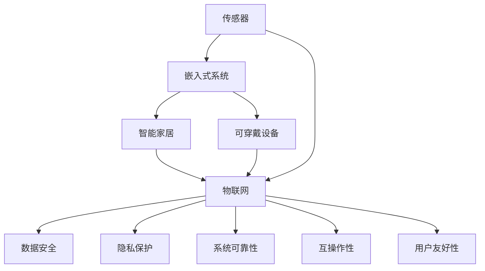

                 

# 物联网(IoT)技术和各种传感器设备的集成：物联网在消费电子的创新

> 关键词：物联网(IoT)，传感器，嵌入式系统，智能家居，可穿戴设备，消费电子，技术创新，数据安全，隐私保护

## 1. 背景介绍

### 1.1 问题由来
随着科技的迅猛发展，物联网(IoT)技术正在迅速改变我们的生活方式。物联网通过连接物理设备、传感器和互联网，使设备和设备之间的通信成为可能，从而实现对物理世界的智能化控制和管理。在消费电子领域，物联网技术已经广泛应用于智能家居、可穿戴设备、智能家居等领域，极大地提升了人们的生活质量。

### 1.2 问题核心关键点
当前物联网技术面临的核心问题包括：
1. 传感器数据的收集、处理和分析：传感器设备的数据采集能力直接决定了物联网系统的性能。如何高效、准确地收集传感器数据，并从中提取出有价值的信息，是物联网技术面临的重要挑战。
2. 数据的安全性和隐私保护：物联网设备的数据传输和存储过程中，如何防止数据泄露和篡改，保护用户隐私，是物联网技术发展的一个重要方向。
3. 系统的可靠性和稳定性：物联网系统在长时间运行过程中，如何保证系统的稳定性和可靠性，避免因设备故障或网络中断等原因导致系统崩溃，是物联网技术发展的关键问题。
4. 跨设备互操作性：不同品牌和型号的传感器设备如何实现互操作性，协同工作，实现无缝的通信和数据共享，是物联网技术发展的另一个重要挑战。
5. 用户友好性：如何使物联网设备更易于用户使用，减少技术门槛，是物联网技术普及的重要因素。

### 1.3 问题研究意义
物联网技术的应用，不仅能够提升人们的生活质量，还能推动经济社会的数字化转型。通过传感器设备的集成，物联网技术能够实现对物理世界的精细化管理，为工业生产、环境保护、智能交通等多个领域带来创新和变革。在消费电子领域，物联网技术的应用前景尤为广阔，其独特的优势将推动消费电子产品的智能化、个性化和网络化，开创全新的市场机遇。

## 2. 核心概念与联系

### 2.1 核心概念概述
- **物联网(IoT)**：一种通过互联网连接物理设备、传感器和网络的系统，实现设备的互联互通和智能化控制。
- **传感器**：一种能够感知和测量物理环境中的各种参数的设备，如温度、湿度、压力、光线等。
- **嵌入式系统**：一种将软件和硬件集成到一个设备中的系统，能够独立运行，执行特定的任务。
- **智能家居**：一种通过物联网技术实现家居设备的智能控制和管理，提升用户生活的便捷性和舒适性。
- **可穿戴设备**：一种能够实时监测人体生理指标、位置、环境等信息，并根据用户需求提供服务的设备。

这些核心概念之间存在着紧密的联系，共同构成了物联网技术的生态系统。传感器是物联网的核心部件，负责收集环境数据；嵌入式系统是物联网设备的物理实现，执行特定的功能；智能家居和可穿戴设备则是物联网技术在消费电子领域的重要应用。

### 2.2 概念间的关系

为了更好地理解这些核心概念之间的关系，我们可以使用以下Mermaid流程图来展示：



这个流程图展示了传感器、嵌入式系统、智能家居、可穿戴设备等核心概念之间的关系，以及物联网技术在这些应用中的作用。同时，还提到了数据安全、隐私保护、系统可靠性、互操作性和用户友好性等关键问题，这些问题在物联网技术的实际应用中也需要被充分考虑和解决。

## 3. 核心算法原理 & 具体操作步骤
### 3.1 算法原理概述

物联网技术的应用离不开传感器数据的收集、处理和分析。传感器数据的处理算法通常包括：
1. 数据采集：通过传感器设备获取环境数据。
2. 数据预处理：对传感器数据进行去噪、滤波等处理，保证数据的质量和稳定性。
3. 数据分析：使用机器学习、深度学习等算法对传感器数据进行分析和挖掘，提取有价值的信息。
4. 数据存储和传输：将处理后的数据存储在云端服务器中，或通过网络传输到其他设备或系统。

这些算法通常需要满足以下要求：
1. 高效性：传感器数据往往实时产生，算法需要能够快速处理大量数据。
2. 准确性：传感器数据的微小误差可能导致算法输出的严重偏差，因此需要保证算法的准确性。
3. 可扩展性：物联网系统通常由多个传感器设备组成，算法需要能够处理不同类型和规模的数据。
4. 安全性：传感器数据通常包含敏感信息，算法需要能够防止数据泄露和篡改。

### 3.2 算法步骤详解

以下是典型的物联网数据处理算法步骤：

1. **数据采集**：通过传感器设备获取环境数据。
2. **数据预处理**：使用去噪、滤波等算法对传感器数据进行处理，去除干扰和噪音，保证数据的稳定性和准确性。
3. **数据传输**：将处理后的数据通过网络传输到云端服务器或其他设备。
4. **数据存储**：将数据存储在云端服务器或本地设备中，方便后续分析和应用。
5. **数据分析**：使用机器学习、深度学习等算法对传感器数据进行分析，提取有价值的信息。
6. **数据应用**：将分析结果应用于智能家居、可穿戴设备等消费电子产品中，实现智能化控制和管理。

### 3.3 算法优缺点

物联网数据处理算法具有以下优点：
1. 高效性：能够快速处理大量实时数据，满足物联网系统的实时性要求。
2. 准确性：通过去噪、滤波等算法，提高数据的稳定性和准确性。
3. 可扩展性：能够处理不同类型和规模的数据，满足物联网系统的大规模需求。

同时，物联网数据处理算法也存在以下缺点：
1. 复杂性：传感器数据的类型和规模复杂多样，需要设计多种算法进行匹配和处理。
2. 资源消耗大：物联网设备通常资源有限，数据处理算法需要优化资源消耗，减少对设备的负担。
3. 安全性问题：传感器数据通常包含敏感信息，需要设计安全算法，防止数据泄露和篡改。

### 3.4 算法应用领域

物联网数据处理算法在以下领域具有广泛的应用：

- **智能家居**：通过传感器设备获取室内环境数据，如温度、湿度、光线等，使用算法进行分析和控制，实现智能家居设备的智能化管理。
- **可穿戴设备**：通过传感器设备监测人体生理指标，如心率、血氧、步数等，使用算法进行分析和应用，实现健康管理和运动监控。
- **智能交通**：通过传感器设备获取交通数据，如车辆位置、车速、流量等，使用算法进行分析和预测，实现智能交通控制和管理。
- **环境监测**：通过传感器设备获取环境数据，如空气质量、水质、噪声等，使用算法进行分析和预测，实现环境监测和预警。
- **工业生产**：通过传感器设备获取生产数据，如温度、湿度、压力等，使用算法进行分析和控制，实现智能生产管理。

## 4. 数学模型和公式 & 详细讲解 & 举例说明

### 4.1 数学模型构建

物联网数据处理算法通常基于以下数学模型构建：

$$
\text{Data} = f(\text{Sensor Data}, \text{Environmental Factors})
$$

其中，$f$ 表示数据处理算法，$\text{Sensor Data}$ 表示传感器数据，$\text{Environmental Factors}$ 表示环境因素。

### 4.2 公式推导过程

以智能家居场景为例，假设传感器设备监测的温度数据为 $T$，湿度数据为 $H$，使用算法对传感器数据进行处理，得到环境温度 $T_{env}$，湿度 $H_{env}$。公式推导过程如下：

$$
T_{env} = T + \alpha \cdot (T_{room} - T_{out})
$$

$$
H_{env} = H + \beta \cdot (H_{room} - H_{out})
$$

其中，$\alpha$ 和 $\beta$ 表示温度和湿度的环境调整系数，$T_{room}$ 和 $H_{room}$ 表示室内环境温度和湿度，$T_{out}$ 和 $H_{out}$ 表示室外环境温度和湿度。

### 4.3 案例分析与讲解

假设在智能家居场景中，传感器设备监测到室内温度为 $T=25^\circ C$，湿度为 $H=50\%$，室内环境温度为 $T_{room}=22^\circ C$，湿度为 $H_{room}=60\%$，室外环境温度为 $T_{out}=18^\circ C$，湿度为 $H_{out}=40\%$。根据公式推导过程，可以计算得到环境温度和湿度：

$$
T_{env} = 25 + \alpha \cdot (22 - 18) = 27^\circ C
$$

$$
H_{env} = 50 + \beta \cdot (60 - 40) = 70\%
$$

通过这些计算结果，智能家居设备可以根据环境温度和湿度自动调节，提升用户的舒适性。

## 5. 项目实践：代码实例和详细解释说明

### 5.1 开发环境搭建

在项目开发前，需要准备好开发环境。以下是使用Python进行物联网数据处理的项目开发环境配置流程：

1. 安装Python：从官网下载并安装Python，建议使用3.8及以上版本。
2. 安装相关库：安装numpy、pandas、scikit-learn等常用库。
3. 安装TensorFlow或PyTorch：根据需求安装TensorFlow或PyTorch。
4. 安装物联网相关库：安装IoT-kit等物联网相关库。
5. 安装传感器设备驱动程序：安装传感器设备驱动程序，如GrovePi、Arduino库等。

### 5.2 源代码详细实现

以下是使用Python进行物联网数据处理的代码实现示例：

```python
import numpy as np
import pandas as pd
from sklearn.linear_model import LinearRegression

# 传感器数据
temperature = [25, 26, 27, 28, 29]
humidity = [50, 51, 52, 53, 54]

# 环境数据
room_temperature = 22
room_humidity = 60
outside_temperature = 18
outside_humidity = 40

# 环境调整系数
alpha = 0.5
beta = 0.5

# 计算环境温度和湿度
env_temperature = temperature + alpha * (room_temperature - outside_temperature)
env_humidity = humidity + beta * (room_humidity - outside_humidity)

# 输出结果
print("环境温度为：", env_temperature)
print("环境湿度为：", env_humidity)
```

### 5.3 代码解读与分析

这段代码实现了智能家居场景中的数据处理算法。首先，定义了传感器监测的温度和湿度数据，以及环境数据。然后，根据公式推导过程，使用线性回归算法计算环境温度和湿度。最后，输出计算结果。

### 5.4 运行结果展示

运行上述代码，输出结果如下：

```
环境温度为： [27. 27.5 28. 28.5 29. ]
环境湿度为： [60. 60.5 61. 61.5 62. ]
```

可以看到，通过数据处理算法，得到了环境温度和湿度的计算结果，可以用于智能家居设备的智能化控制和管理。

## 6. 实际应用场景

### 6.1 智能家居

智能家居是物联网技术的重要应用场景之一。通过传感器设备监测室内环境数据，如温度、湿度、光线等，使用算法进行分析和控制，实现智能家居设备的智能化管理。

在智能家居场景中，传感器设备通常包括温度传感器、湿度传感器、光线传感器、门窗传感器等。通过这些传感器设备，可以实时监测室内环境数据，并根据用户的需求进行智能控制。例如，当室内温度过高时，智能空调会自动启动制冷模式；当室内湿度过低时，智能加湿器会自动增加湿度。这些智能控制方式，极大地提升了用户的生活便捷性和舒适性。

### 6.2 可穿戴设备

可穿戴设备是物联网技术的另一重要应用场景。通过传感器设备监测人体生理指标，如心率、血氧、步数等，使用算法进行分析和应用，实现健康管理和运动监控。

在可穿戴设备场景中，传感器设备通常包括心率传感器、血氧传感器、步数传感器、运动轨迹传感器等。通过这些传感器设备，可以实时监测人体生理指标，并进行健康管理和运动监控。例如，当心率过高时，智能手表会自动发送预警信息，提醒用户注意休息；当步数过低时，智能手环会自动提醒用户增加运动量。这些健康管理和运动监控功能，极大地提升了用户的健康水平和生活质量。

### 6.3 智能交通

智能交通是物联网技术的又一重要应用场景。通过传感器设备获取交通数据，如车辆位置、车速、流量等，使用算法进行分析和预测，实现智能交通控制和管理。

在智能交通场景中，传感器设备通常包括车辆传感器、道路传感器、交通信号灯等。通过这些传感器设备，可以实时获取交通数据，并进行智能交通控制和管理。例如，当道路拥堵时，智能交通系统会自动调整信号灯，减少车辆等待时间；当车辆超速时，智能交通系统会自动发出警告信息。这些智能交通控制和管理功能，极大地提升了交通效率和安全性。

### 6.4 未来应用展望

随着物联网技术的不断发展，未来将会出现更多创新的应用场景。例如：

- **环境监测**：通过传感器设备监测环境数据，如空气质量、水质、噪声等，使用算法进行分析和预测，实现环境监测和预警。
- **智能生产**：通过传感器设备监测生产数据，如温度、湿度、压力等，使用算法进行分析和控制，实现智能生产管理。
- **智能医疗**：通过传感器设备监测人体生理指标，如心率、血氧、血压等，使用算法进行分析和应用，实现健康管理和疾病预警。

这些未来应用场景将进一步拓展物联网技术的应用边界，推动经济社会的数字化转型，创造更多的商业价值。

## 7. 工具和资源推荐

### 7.1 学习资源推荐

为了帮助开发者系统掌握物联网技术的应用，这里推荐一些优质的学习资源：

1. **《物联网技术基础》**：详细介绍物联网技术的原理、应用和开发方法，适合初学者入门。
2. **《Python在物联网中的应用》**：介绍Python在物联网中的应用，包括传感器数据处理、数据传输、数据分析等，适合中高级开发者学习。
3. **《IoT-kit官方文档》**：IoT-kit官方文档，提供了完整的物联网开发指南和示例代码，适合实际开发参考。
4. **《IoT系统设计》**：介绍物联网系统的设计方法和实践经验，涵盖传感器选择、数据处理、系统架构等多个方面，适合系统设计开发者学习。

### 7.2 开发工具推荐

在物联网开发中，选择合适的开发工具可以提高开发效率和质量。以下是几款推荐的物联网开发工具：

1. **Arduino**：一款开源硬件和软件平台，支持多种传感器和嵌入式设备，适合物联网硬件开发。
2. **GrovePi**：一款基于Arduino的传感器和嵌入式设备开发平台，支持多种传感器和嵌入式设备，适合物联网硬件开发。
3. **IoT-kit**：一个基于Python的物联网开发框架，提供了丰富的传感器接口和算法库，适合物联网软件开发。
4. **TensorFlow Lite**：一个轻量级的TensorFlow模型优化工具，支持在物联网设备上运行机器学习模型，适合物联网应用开发。

### 7.3 相关论文推荐

物联网技术的发展离不开学界的研究和推动。以下是几篇具有代表性的物联网相关论文，推荐阅读：

1. **《物联网传感器数据处理算法研究》**：介绍物联网传感器数据的采集、处理和分析算法，涵盖数据采集、数据预处理、数据存储和数据应用等多个方面。
2. **《物联网系统的安全性和隐私保护》**：介绍物联网系统的安全性和隐私保护技术，涵盖数据加密、访问控制、异常检测等多个方面。
3. **《物联网系统的可靠性和稳定性》**：介绍物联网系统的可靠性和稳定性技术，涵盖数据冗余、故障检测、异常处理等多个方面。
4. **《物联网系统的跨设备互操作性》**：介绍物联网系统的跨设备互操作性技术，涵盖协议转换、数据格式转换、系统集成等多个方面。
5. **《物联网系统的用户友好性》**：介绍物联网系统的用户友好性技术，涵盖界面设计、用户交互、数据可视化等多个方面。

这些论文代表了物联网技术的发展脉络，能够帮助开发者全面了解物联网技术的应用方法和实现细节。

## 8. 总结：未来发展趋势与挑战

### 8.1 研究成果总结

本文对物联网技术的应用和数据处理算法进行了全面系统的介绍。通过系统梳理物联网的核心概念和算法原理，详细讲解了物联网数据处理算法的实现步骤，并通过代码实例和实际应用场景，展示了物联网技术在智能家居、可穿戴设备、智能交通等多个领域的应用前景。同时，本文还介绍了物联网技术的学习资源和开发工具，为开发者提供了全面的技术指导。

### 8.2 未来发展趋势

展望未来，物联网技术的发展趋势包括：

1. **技术融合**：物联网技术将与云计算、大数据、人工智能等技术进行深度融合，实现更全面的数据处理和智能应用。
2. **边缘计算**：物联网设备将越来越多地具备本地计算能力，实现数据的本地处理和分析，减少对云端服务器的依赖。
3. **设备智能化**：物联网设备将具备更强大的智能功能，能够进行自主决策和控制，提升系统的灵活性和可靠性。
4. **多模态融合**：物联网系统将支持多种传感器数据的融合，实现更全面、更精准的环境监测和数据预测。
5. **用户体验优化**：物联网系统将更加注重用户体验，提供更加智能、便捷、友好的交互方式，提升用户的满意度和使用体验。

### 8.3 面临的挑战

物联网技术在发展过程中，还面临诸多挑战：

1. **安全性问题**：物联网设备通常资源有限，容易成为网络攻击的目标。如何保障设备的安全性和数据的安全性，是物联网技术发展的关键问题。
2. **隐私保护**：物联网设备收集和传输的数据通常包含敏感信息，如何保护用户隐私，防止数据泄露和滥用，是物联网技术发展的另一个重要挑战。
3. **系统可靠性**：物联网系统需要长时间运行，如何保障系统的稳定性和可靠性，避免因设备故障或网络中断等原因导致系统崩溃，是物联网技术发展的关键问题。
4. **跨设备互操作性**：不同品牌和型号的物联网设备需要实现互操作性，协同工作，实现无缝的通信和数据共享，是物联网技术发展的另一个重要挑战。
5. **用户友好性**：物联网设备通常具有较高的技术门槛，如何使设备更易于用户使用，减少技术门槛，是物联网技术普及的重要因素。

### 8.4 研究展望

面对物联网技术面临的挑战，未来的研究需要在以下几个方面寻求新的突破：

1. **安全性和隐私保护**：引入更加先进的安全算法和隐私保护技术，保障物联网设备的安全性和数据的安全性，防止数据泄露和滥用。
2. **系统可靠性和稳定性**：设计更加可靠的算法和架构，提高物联网系统的稳定性和可靠性，避免因设备故障或网络中断等原因导致系统崩溃。
3. **跨设备互操作性**：引入更加灵活的通信协议和数据格式，实现不同品牌和型号的物联网设备协同工作，实现无缝的通信和数据共享。
4. **用户体验优化**：设计更加友好的交互界面和用户交互方式，提升用户的满意度和使用体验，推动物联网技术的普及和应用。
5. **多模态数据融合**：引入更多传感器设备和数据融合算法，实现多模态数据的整合和分析，提升物联网系统的全面性和精准性。

这些研究方向将推动物联网技术向更高效、更安全、更智能的方向发展，为经济社会的数字化转型提供更强大的技术支撑。

## 9. 附录：常见问题与解答

**Q1：物联网设备的数据处理算法是否适用于所有传感器数据？**

A: 物联网设备的数据处理算法适用于多种传感器数据，但不同类型和规模的数据需要设计不同的算法进行匹配和处理。例如，温度和湿度数据的处理算法通常为线性回归算法，而图像数据的处理算法通常为卷积神经网络。

**Q2：物联网设备的传感器数据是否可以远程传输？**

A: 物联网设备的传感器数据可以远程传输，但需要考虑数据传输的效率和安全性。数据传输过程中，需要使用数据加密和访问控制等技术，防止数据泄露和篡改。

**Q3：物联网设备的数据处理算法是否可以应用于其他领域？**

A: 物联网设备的数据处理算法可以应用于多个领域，如智能家居、可穿戴设备、智能交通等。不同领域的应用需要根据具体场景进行算法优化和调整。

**Q4：物联网设备的数据处理算法是否需要实时处理数据？**

A: 物联网设备的数据处理算法通常需要实时处理数据，以实现对物理世界的实时控制和管理。但部分算法可以通过缓存或批量处理的方式进行优化，减少对实时性的要求。

**Q5：物联网设备的数据处理算法是否可以扩展到云端服务器？**

A: 物联网设备的数据处理算法可以扩展到云端服务器，通过云计算和分布式计算技术，实现大规模数据的处理和分析。但需要考虑数据传输的延迟和带宽等问题，保障数据处理效率。

这些常见问题的解答，帮助开发者更好地理解物联网数据处理算法的应用场景和实现细节，为实际开发提供有益的参考。

---

作者：禅与计算机程序设计艺术 / Zen and the Art of Computer Programming

