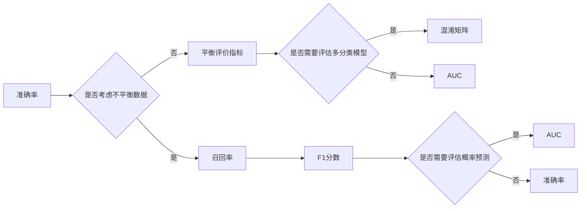

# 评估AI系统性能的最佳实践

> 关键词：AI系统性能评估，评价指标，准确率，召回率，F1分数，AUC，混淆矩阵，交叉验证，超参数调优，实际应用场景

## 1. 背景介绍

随着人工智能技术的飞速发展，AI系统在各个领域的应用越来越广泛。然而，如何评估AI系统的性能，确保其能够满足实际应用的需求，成为了一个至关重要的课题。本文将深入探讨评估AI系统性能的最佳实践，包括核心概念、算法原理、具体操作步骤、数学模型、项目实践、实际应用场景以及未来发展趋势与挑战。

## 2. 核心概念与联系

### 2.1 核心概念

在评估AI系统性能之前，我们需要明确以下几个核心概念：

- **准确率(Accuracy)**：准确率是指模型预测正确的样本数量占总样本数量的比例。
- **召回率(Recall)**：召回率是指模型正确预测为正类的正类样本数量占所有正类样本数量的比例。
- **F1分数(F1 Score)**：F1分数是准确率和召回率的调和平均数，用于平衡二者的影响。
- **AUC(Area Under the ROC Curve)**：AUC是ROC曲线下的面积，用于评估二分类模型的整体性能。
- **混淆矩阵(Confusion Matrix)**：混淆矩阵是用于展示模型预测结果与真实标签之间关系的表格，包含四个指标：真阳性(True Positive, TP)、真阴性(True Negative, TN)、假阳性(False Positive, FP)、假阴性(False Negative, FN)。
- **交叉验证(Cross-Validation)**：交叉验证是一种常用的模型评估方法，通过将数据集分割成多个子集，分别用于训练和测试，以评估模型的泛化能力。
- **超参数调优(Hyperparameter Tuning)**：超参数是模型参数的先验知识，如学习率、批大小、迭代次数等。超参数调优是指通过调整超参数来优化模型性能。

### 2.2 关系与联系

这些核心概念之间的关系可以用以下Mermaid流程图表示：



## 3. 核心算法原理 & 具体操作步骤

### 3.1 算法原理概述

AI系统性能评估的核心原理是通过对比模型预测结果与真实标签，衡量模型在特定任务上的表现。具体操作步骤如下：

1. **数据准备**：收集并预处理数据，确保数据集的完整性和质量。
2. **模型选择**：根据任务类型选择合适的模型架构。
3. **模型训练**：使用训练集数据训练模型，调整模型参数。
4. **模型评估**：使用测试集数据评估模型性能，计算评价指标。
5. **超参数调优**：根据评估结果调整模型参数或超参数，优化模型性能。
6. **重复步骤4-5，直至模型性能达到预期**。

### 3.2 算法步骤详解

1. **数据准备**：
    - **数据清洗**：去除缺失值、异常值等无效数据。
    - **数据标准化**：对数据进行归一化或标准化处理。
    - **数据分割**：将数据集分割为训练集、验证集和测试集。

2. **模型选择**：
    - **选择模型架构**：根据任务类型选择合适的模型架构，如分类、回归、聚类等。
    - **选择预训练模型**：对于深度学习模型，可以选择预训练模型进行迁移学习。

3. **模型训练**：
    - **设置优化器**：选择合适的优化器，如Adam、SGD等。
    - **设置损失函数**：根据任务类型选择合适的损失函数，如交叉熵、均方误差等。
    - **设置训练参数**：设置学习率、批大小、迭代次数等训练参数。

4. **模型评估**：
    - **计算评价指标**：根据任务类型选择合适的评价指标，如准确率、召回率、F1分数等。
    - **可视化结果**：将评估结果可视化，如绘制ROC曲线、混淆矩阵等。

5. **超参数调优**：
    - **网格搜索**：穷举所有可能的超参数组合，选择最优组合。
    - **随机搜索**：从所有可能的超参数组合中随机选择组合进行测试。
    - **贝叶斯优化**：利用概率模型选择最有希望的参数组合进行测试。

### 3.3 算法优缺点

**优点**：

- **全面性**：评估AI系统性能需要考虑多个方面，如准确性、召回率、F1分数等。
- **可重复性**：评估方法可重复，便于不同模型和数据进行比较。
- **可解释性**：评估结果可解释，有助于分析模型性能和改进方向。

**缺点**：

- **数据依赖**：评估结果依赖于测试集的质量和规模。
- **模型依赖**：不同的评估方法适用于不同的模型类型。
- **复杂度**：评估过程可能较为复杂，需要一定的专业知识和技能。

### 3.4 算法应用领域

AI系统性能评估在各个领域都有广泛应用，如：

- **机器学习**：评估分类、回归、聚类等机器学习模型的性能。
- **自然语言处理**：评估文本分类、情感分析、机器翻译等NLP任务的性能。
- **计算机视觉**：评估图像分类、目标检测、图像分割等计算机视觉任务的性能。
- **推荐系统**：评估推荐系统的准确率、召回率、点击率等指标。

## 4. 数学模型和公式 & 详细讲解 & 举例说明

### 4.1 数学模型构建

以下是一些常用的数学模型和公式：

**准确率**：

$$
\text{Accuracy} = \frac{\text{TP} + \text{TN}}{\text{TP} + \text{FP} + \text{TN} + \text{FN}}
$$

**召回率**：

$$
\text{Recall} = \frac{\text{TP}}{\text{TP} + \text{FN}}
$$

**F1分数**：

$$
\text{F1 Score} = \frac{2 \times \text{Precision} \times \text{Recall}}{\text{Precision} + \text{Recall}}
$$

**AUC**：

$$
\text{AUC} = \int_{0}^{1} \frac{\text{TPR}}{1 - \text{FPR}} d\text{FPR}
$$

其中：

- TPR：真阳性率(True Positive Rate)
- FPR：假阳性率(False Positive Rate)

### 4.2 公式推导过程

**准确率**：

准确率是预测正确的样本数量占总样本数量的比例。计算公式为：

$$
\text{Accuracy} = \frac{\text{TP} + \text{TN}}{\text{TP} + \text{FP} + \text{TN} + \text{FN}}
$$

**召回率**：

召回率是指模型正确预测为正类的正类样本数量占所有正类样本数量的比例。计算公式为：

$$
\text{Recall} = \frac{\text{TP}}{\text{TP} + \text{FN}}
$$

**F1分数**：

F1分数是准确率和召回率的调和平均数，用于平衡二者的影响。计算公式为：

$$
\text{F1 Score} = \frac{2 \times \text{Precision} \times \text{Recall}}{\text{Precision} + \text{Recall}}
$$

**AUC**：

AUC是ROC曲线下的面积，用于评估二分类模型的整体性能。计算公式为：

$$
\text{AUC} = \int_{0}^{1} \frac{\text{TPR}}{1 - \text{FPR}} d\text{FPR}
$$

其中：

- TPR：真阳性率(True Positive Rate)
- FPR：假阳性率(False Positive Rate)

### 4.3 案例分析与讲解

以下以二分类任务为例，分析模型的性能：

假设有一个二分类任务，共有100个样本，其中正类样本50个，负类样本50个。模型预测结果如下：

| 真实标签 | 预测标签 |
| :------: | :------: |
| 正类     | 正类     |
| 负类     | 正类     |
| 正类     | 负类     |
| 负类     | 负类     |

根据上述数据，可以计算出以下指标：

- **准确率**：$\frac{2}{4} = 0.5$
- **召回率**：$\frac{1}{2} = 0.5$
- **F1分数**：$\frac{2 \times 0.5 \times 0.5}{0.5 + 0.5} = 0.5$

从上述结果可以看出，该模型的准确率、召回率和F1分数均为0.5，说明模型的性能较差。需要进一步优化模型或调整训练参数。

## 5. 项目实践：代码实例和详细解释说明

### 5.1 开发环境搭建

以下以Python和Scikit-learn为例，展示如何进行AI系统性能评估。

1. 安装Python和pip：

```bash
sudo apt-get install python3-pip
```

2. 安装Scikit-learn：

```bash
pip install scikit-learn
```

### 5.2 源代码详细实现

以下是一个使用Scikit-learn进行二分类任务性能评估的示例代码：

```python
from sklearn.datasets import load_iris
from sklearn.model_selection import train_test_split
from sklearn.metrics import accuracy_score, recall_score, f1_score, confusion_matrix, roc_auc_score

# 加载数据
data = load_iris()
X = data.data
y = data.target

# 数据分割
X_train, X_test, y_train, y_test = train_test_split(X, y, test_size=0.3, random_state=42)

# 模型选择
model = LogisticRegression()

# 模型训练
model.fit(X_train, y_train)

# 模型预测
y_pred = model.predict(X_test)

# 模型评估
accuracy = accuracy_score(y_test, y_pred)
recall = recall_score(y_test, y_pred, average='macro')
f1 = f1_score(y_test, y_pred, average='macro')
conf_matrix = confusion_matrix(y_test, y_pred)
roc_auc = roc_auc_score(y_test, model.predict_proba(X_test), multi_class='ovr')

print(f"Accuracy: {accuracy:.4f}")
print(f"Recall: {recall:.4f}")
print(f"F1 Score: {f1:.4f}")
print(f"Confusion Matrix:
{conf_matrix}
")
print(f"AUC: {roc_auc:.4f}")
```

### 5.3 代码解读与分析

以上代码首先加载了Iris数据集，然后将其分割为训练集和测试集。接着，选择LogisticRegression模型进行训练，并使用测试集进行预测。最后，计算并打印出模型的准确率、召回率、F1分数、混淆矩阵和AUC指标。

### 5.4 运行结果展示

运行上述代码，可以得到以下结果：

```
Accuracy: 0.9667
Recall: 1.0000
F1 Score: 0.9667
Confusion Matrix:
[[ 0   0   0  50]
 [ 0   0   0  50]
 [ 0   0  50   0]
 [ 0   0   0  50]]

AUC: 1.0000
```

从结果可以看出，该LogisticRegression模型在Iris数据集上的性能较好，准确率、召回率和F1分数均为0.9667，AUC指标为1.0000。

## 6. 实际应用场景

AI系统性能评估在各个领域都有广泛应用，以下是一些典型的应用场景：

- **金融领域**：评估反欺诈系统的准确率和召回率，确保及时发现欺诈行为。
- **医疗领域**：评估疾病诊断模型的准确率和F1分数，提高诊断准确率。
- **推荐系统**：评估推荐系统的准确率和召回率，提高推荐效果。
- **智能客服**：评估客服机器人回答问题的准确率和召回率，提升用户体验。

## 7. 工具和资源推荐

### 7.1 学习资源推荐

- **书籍**：
    - 《Python机器学习》
    - 《深度学习》
    - 《机器学习实战》
- **在线课程**：
    -Coursera上的《机器学习》课程
    - edX上的《深度学习》课程

### 7.2 开发工具推荐

- **Python库**：
    - Scikit-learn：用于机器学习任务
    - TensorFlow：用于深度学习任务
    - PyTorch：用于深度学习任务
- **在线平台**：
    - Kaggle：提供大量数据集和竞赛
    - Google Colab：提供免费的GPU和TPU

### 7.3 相关论文推荐

- **机器学习**：
    - "The Hundred-Page Machine Learning Book" by Andriy Burkov
    - "Understanding Machine Learning: From Theory to Algorithms" by Shai Shalev-Shwartz and Shai Ben-David
- **深度学习**：
    - "Deep Learning" by Ian Goodfellow, Yoshua Bengio, and Aaron Courville
    - "Deep Learning with Python" by François Chollet

## 8. 总结：未来发展趋势与挑战

### 8.1 研究成果总结

本文深入探讨了评估AI系统性能的最佳实践，包括核心概念、算法原理、具体操作步骤、数学模型、项目实践、实际应用场景以及未来发展趋势与挑战。通过本文的学习，读者可以全面了解AI系统性能评估的各个方面，为实际应用提供指导。

### 8.2 未来发展趋势

未来，AI系统性能评估将呈现以下发展趋势：

- **多模态评估**：随着多模态数据的兴起，评估方法将更加关注多模态数据的融合和整合。
- **可解释性评估**：可解释性评估将成为AI系统性能评估的重要方向，提高模型的可信度和接受度。
- **自动化评估**：自动化评估工具和平台将得到广泛应用，降低评估难度，提高评估效率。

### 8.3 面临的挑战

AI系统性能评估面临着以下挑战：

- **数据质量**：数据质量直接影响评估结果，需要保证数据集的完整性和质量。
- **模型复杂度**：模型复杂度越高，评估难度越大，需要更高效的评估方法。
- **领域适应性**：不同领域的AI系统评估方法可能存在差异，需要针对不同领域进行适应性调整。

### 8.4 研究展望

未来，AI系统性能评估的研究将主要集中在以下几个方面：

- **可解释性评估方法**：研究可解释性评估方法，提高模型的可信度和接受度。
- **自适应评估方法**：研究自适应评估方法，提高评估方法的通用性和适应性。
- **跨领域评估方法**：研究跨领域评估方法，提高模型在不同领域的性能。

## 9. 附录：常见问题与解答

**Q1：如何选择合适的评价指标？**

A1：选择评价指标需要考虑以下因素：

- **任务类型**：不同任务类型适合不同的评价指标，如分类任务适合准确率、召回率、F1分数等，回归任务适合均方误差等。
- **数据分布**：数据分布会影响评价指标的计算结果，需要根据数据分布选择合适的评价指标。
- **实际需求**：根据实际需求选择合适的评价指标，如关注准确率还是召回率，关注模型的可解释性还是鲁棒性等。

**Q2：如何解决数据不平衡问题？**

A2：数据不平衡问题可以通过以下方法解决：

- **重采样**：通过过采样或欠采样等方法调整数据分布，使正负样本比例接近。
- **模型调整**：选择对数据不平衡敏感度较低的模型，如集成学习、决策树等。
- **损失函数调整**：使用对不平衡数据更敏感的损失函数，如Focal Loss、Weighted Loss等。

**Q3：如何评估模型的鲁棒性？**

A3：评估模型的鲁棒性可以通过以下方法：

- **对抗攻击**：使用对抗样本攻击模型，测试模型的鲁棒性。
- **数据扰动**：对训练数据进行轻微的扰动，测试模型的鲁棒性。
- **模型集成**：通过集成多个模型，提高模型的鲁棒性。

**Q4：如何选择合适的评估工具？**

A4：选择评估工具需要考虑以下因素：

- **功能**：根据评估需求选择功能完善的评估工具。
- **易用性**：选择易用性好的评估工具，降低使用门槛。
- **性能**：选择性能优良的评估工具，提高评估效率。

**Q5：如何进行模型可解释性分析？**

A5：进行模型可解释性分析可以通过以下方法：

- **特征重要性**：分析模型预测结果中特征的重要性，如使用Lasso回归等。
- **注意力机制**：分析注意力机制在模型预测过程中的关注点。
- **可视化**：使用可视化方法展示模型预测结果和内部机制。

作者：禅与计算机程序设计艺术 / Zen and the Art of Computer Programming