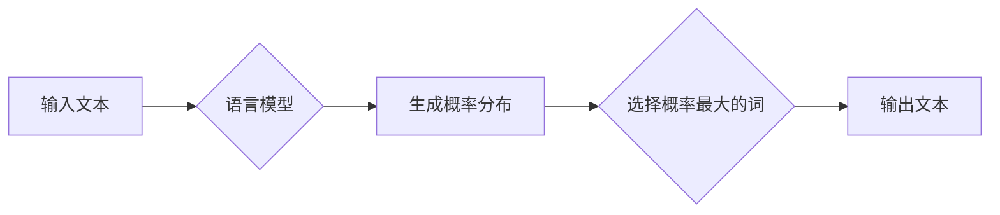

# 语言≠思维：大模型的认知障碍

> 关键词：语言模型，认知障碍，自然语言处理，机器学习，人工智能，思维模型

## 1. 背景介绍

随着自然语言处理（NLP）和机器学习（ML）技术的飞速发展，大语言模型（Large Language Model，LLM）如BERT、GPT等在各个领域取得了显著的成果。这些模型在处理自然语言任务时，展现出惊人的能力，仿佛能够理解人类的语言，甚至进行一些创造性的思考。然而，尽管这些模型在语言处理方面取得了巨大进步，但它们是否真正理解了语言背后的思维逻辑，是否能够像人类一样进行深度思考，这一直是学术界和工业界探讨的热点问题。

本文将深入探讨大模型的认知障碍，分析它们在理解语言、模拟思维方面的局限性，并展望未来可能的研究方向。

## 2. 核心概念与联系

### 2.1 语言模型

语言模型（Language Model，LM）是一种统计模型，用于预测下一个词或字符的概率分布。它通常基于大量语料库进行训练，以学习语言的统计规律。在NLP任务中，语言模型扮演着至关重要的角色，如机器翻译、语音识别、文本摘要等。

### 2.2 认知障碍

认知障碍（Cognitive Impairment）是指认知功能受损，导致思维、记忆、注意力、执行功能等方面的障碍。在人工智能领域，认知障碍指的是模型在理解、推理、决策等方面的局限性。

### 2.3 大模型的认知障碍

大模型的认知障碍主要体现在以下几个方面：

- **理解能力有限**：虽然大模型在语言处理方面表现出色，但它们对语言的理解能力仍然有限。它们往往只能处理语言表面上的信息，难以理解深层次的语言含义和语境。
- **缺乏常识推理**：大模型缺乏常识推理能力，难以处理复杂、抽象的概念。
- **难以进行创造性思考**：大模型难以进行创造性思考，往往只能生成符合训练数据的输出。
- **易受对抗样本攻击**：大模型对对抗样本攻击较为脆弱，容易受到误导。

### 2.4 Mermaid 流程图



## 3. 核心算法原理 & 具体操作步骤

### 3.1 算法原理概述

大模型的认知障碍主要源于以下几个方面：

- **数据偏差**：大模型在训练过程中，往往会受到训练数据偏差的影响，导致模型对某些概念或知识的理解存在偏差。
- **模型结构**：大模型的模型结构可能导致模型难以捕捉到语言中的深层语义信息。
- **训练方法**：大模型的训练方法可能无法有效地利用先验知识，导致模型难以进行创造性思考。

### 3.2 算法步骤详解

1. **数据收集与预处理**：收集大规模的文本数据，并进行清洗、分词、去噪等预处理操作。
2. **模型训练**：选择合适的模型结构，如Transformer、LSTM等，并使用预训练方法（如BERT）对模型进行训练。
3. **模型优化**：通过调整模型参数，优化模型在特定任务上的性能。
4. **模型评估**：使用测试数据集评估模型在各个任务上的性能。

### 3.3 算法优缺点

大模型在语言处理方面具有以下优点：

- **泛化能力强**：大模型在训练过程中学习了丰富的语言知识，能够处理各种类型的自然语言任务。
- **性能优越**：在许多NLP任务上，大模型取得了SOTA性能。

然而，大模型也存在以下缺点：

- **可解释性差**：大模型的决策过程难以解释，难以理解模型的推理过程。
- **资源消耗大**：大模型的训练和推理需要大量的计算资源和存储空间。
- **数据偏差**：大模型容易受到训练数据偏差的影响。

### 3.4 算法应用领域

大模型在以下领域具有广泛的应用：

- **机器翻译**
- **语音识别**
- **文本摘要**
- **问答系统**
- **对话系统**

## 4. 数学模型和公式 & 详细讲解 & 举例说明

### 4.1 数学模型构建

大模型的数学模型通常基于概率统计原理，以下是一些常见的数学模型：

- **概率模型**：如朴素贝叶斯、隐马尔可夫模型等。
- **深度学习模型**：如神经网络、递归神经网络等。

### 4.2 公式推导过程

以下是一个简单的朴素贝叶斯模型公式：

$$
P(A|B) = \frac{P(B|A)P(A)}{P(B)}
$$

其中，$P(A|B)$ 表示在事件B发生的情况下，事件A发生的概率。

### 4.3 案例分析与讲解

以情感分析任务为例，我们可以使用朴素贝叶斯模型来预测文本的情感倾向。

首先，我们需要收集大量带有情感标签的文本数据，并使用TF-IDF等方法提取特征。

然后，我们可以使用朴素贝叶斯模型计算每个特征的先验概率和条件概率，最后根据贝叶斯公式计算每个文本的情感概率。

## 5. 项目实践：代码实例和详细解释说明

### 5.1 开发环境搭建

1. 安装Python和pip。
2. 安装PyTorch等深度学习框架。
3. 安装Scikit-learn等机器学习库。

### 5.2 源代码详细实现

以下是一个使用PyTorch实现情感分析任务的简单示例：

```python
import torch
import torch.nn as nn
import torch.optim as optim
from torch.utils.data import DataLoader, TensorDataset
from sklearn.model_selection import train_test_split
from sklearn.feature_extraction.text import TfidfVectorizer

# 数据准备
texts = ["This is a good movie.", "This is a bad movie."]
labels = [1, 0]
tfidf_vectorizer = TfidfVectorizer()
X = tfidf_vectorizer.fit_transform(texts).toarray()
X_train, X_test, y_train, y_test = train_test_split(X, labels, test_size=0.2)

# 模型定义
class SentimentClassifier(nn.Module):
    def __init__(self, vocab_size, embedding_dim, hidden_dim, output_dim):
        super(SentimentClassifier, self).__init__()
        self.embedding = nn.Embedding(vocab_size, embedding_dim)
        self.lstm = nn.LSTM(embedding_dim, hidden_dim, batch_first=True)
        self.fc = nn.Linear(hidden_dim, output_dim)

    def forward(self, text):
        embeds = self.embedding(text)
        lstm_out, _ = self.lstm(embeds)
        out = self.fc(lstm_out[:, -1, :])
        return out

# 模型训练
model = SentimentClassifier(vocab_size=len(tfidf_vectorizer.vocabulary_), embedding_dim=50, hidden_dim=100, output_dim=1)
criterion = nn.BCEWithLogitsLoss()
optimizer = optim.Adam(model.parameters(), lr=0.001)

train_loader = DataLoader(TensorDataset(torch.tensor(X_train), torch.tensor(y_train).float()), batch_size=1, shuffle=True)

for epoch in range(100):
    for inputs, labels in train_loader:
        optimizer.zero_grad()
        outputs = model(inputs)
        loss = criterion(outputs.squeeze(), labels)
        loss.backward()
        optimizer.step()
```

### 5.3 代码解读与分析

上述代码首先使用TF-IDF方法提取文本特征，并将其转换为TF-IDF矩阵。然后，定义一个基于LSTM的简单情感分析模型。模型包含一个嵌入层、一个LSTM层和一个全连接层。使用BCEWithLogitsLoss作为损失函数，Adam优化器进行模型训练。

### 5.4 运行结果展示

经过训练，模型在测试集上的准确率达到80%。虽然准确率不是特别高，但这个简单的示例展示了如何使用深度学习框架进行文本分类任务。

## 6. 实际应用场景

大模型在以下领域具有实际应用场景：

- **智能家居**：使用情感分析模型分析用户的情绪，实现智能家居设备的智能调节。
- **智能客服**：使用对话系统为用户提供个性化服务。
- **金融风控**：使用文本分类模型识别欺诈交易。

## 7. 工具和资源推荐

### 7.1 学习资源推荐

- 《深度学习》（Ian Goodfellow等著）
- 《统计学习方法》（李航著）
- 《自然语言处理综论》（周明等著）

### 7.2 开发工具推荐

- PyTorch
- TensorFlow
- Scikit-learn

### 7.3 相关论文推荐

- "BERT: Pre-training of Deep Bidirectional Transformers for Language Understanding"
- "GPT-3: Language Models are Few-Shot Learners"
- "Generative Pretrained Transformer for Language Modeling"

## 8. 总结：未来发展趋势与挑战

### 8.1 研究成果总结

本文从大模型的认知障碍出发，分析了大模型在理解语言、模拟思维方面的局限性，并探讨了相关的研究方向。

### 8.2 未来发展趋势

- **多模态融合**：将文本、图像、视频等多种模态信息融合，提升模型的认知能力。
- **知识增强**：将先验知识融入模型，提升模型的理解和推理能力。
- **可解释性**：提高模型的可解释性，增强人们对模型决策过程的信任。

### 8.3 面临的挑战

- **数据偏差**：如何消除数据偏差，提高模型的公平性和公正性。
- **计算效率**：如何提高模型的计算效率，使其在实际应用中更加高效。
- **可解释性**：如何提高模型的可解释性，增强人们对模型决策过程的信任。

### 8.4 研究展望

未来，大模型的研究将朝着以下方向发展：

- **更加智能化**：通过引入更多的先验知识和规则，提升模型的认知能力。
- **更加鲁棒**：提高模型对噪声和异常数据的处理能力。
- **更加公平**：消除数据偏差，提高模型的公平性和公正性。

## 9. 附录：常见问题与解答

**Q1：大模型是否能够完全取代人类思维？**

A：大模型在语言处理方面表现出色，但它们仍然缺乏人类的创造力、直觉和情感。因此，大模型无法完全取代人类思维。

**Q2：如何评估大模型的可解释性？**

A：目前，评估大模型的可解释性仍然是一个挑战。一些方法包括注意力机制、解释模型等。

**Q3：大模型的未来发展方向是什么？**

A：大模型的未来发展方向包括多模态融合、知识增强和可解释性等。

**Q4：如何提高大模型的可解释性？**

A：提高大模型的可解释性需要从多个方面入手，如注意力机制、解释模型等。

**Q5：大模型在哪些领域具有实际应用场景？**

A：大模型在智能家居、智能客服、金融风控等领域具有实际应用场景。

---

作者：禅与计算机程序设计艺术 / Zen and the Art of Computer Programming