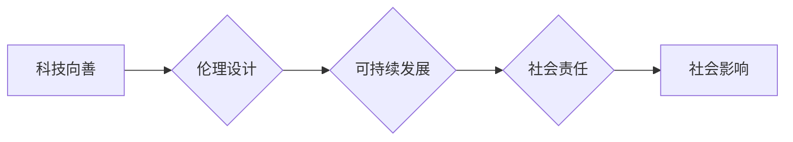

> 科技向善, 软件2.0, 伦理设计, 人工智能伦理, 可持续发展, 社会责任, 数字化治理, 透明度

# 软件 2.0 的社会责任：科技向善

随着信息技术的飞速发展，软件已经成为我们生活中不可或缺的一部分。从简单的计算工具到复杂的智能系统，软件的应用领域不断扩展，深刻影响着社会经济的各个方面。然而，随着软件的普及和复杂化，其潜在的社会影响也日益凸显。软件 2.0 时代，我们不仅要追求技术创新，更要关注软件的社会责任，实现科技向善。

## 1. 背景介绍

### 1.1 信息技术发展的必然趋势

信息技术的发展经历了从硬件到软件，再到服务的转变。软件 2.0 时代，软件不再仅仅是执行任务的工具，而是成为了驱动创新、变革社会的重要力量。云计算、大数据、人工智能等新兴技术，使得软件应用更加智能化、个性化，同时也带来了新的社会挑战。

### 1.2 社会责任意识的觉醒

近年来，随着一系列社会事件的发生，人们对软件的社会责任有了更深刻的认识。从数据泄露到算法偏见，从隐私侵犯到人工智能失业，软件技术的不当应用对社会造成了负面影响。因此，软件 2.0 时代，我们必须树立社会责任意识，推动科技向善。

## 2. 核心概念与联系

### 2.1 核心概念

#### 2.1.1 科技向善

科技向善是指将科技创新应用于改善人类福祉、促进社会和谐与可持续发展的理念。在软件领域，科技向善要求软件设计、开发和应用过程中，始终坚持以人为本，关注社会影响，推动技术进步与社会责任相协调。

#### 2.1.2 伦理设计

伦理设计是指将伦理价值观融入软件设计和开发过程中的理念。通过伦理设计，确保软件应用在满足用户需求的同时，不损害用户权益，不产生负面影响。

#### 2.1.3 可持续发展

可持续发展是指在满足当前需求的同时，不损害后代满足自身需求的能力。在软件领域，可持续发展要求在软件设计、开发、运行和维护过程中，关注环境影响，实现经济效益、社会效益和环境效益的统一。

#### 2.1.4 社会责任

社会责任是指企业或组织在追求经济效益的同时，承担起对社会的责任。在软件领域，社会责任要求软件企业关注用户权益，维护社会稳定，推动技术进步与社会和谐发展。

### 2.2 Mermaid 流程图



## 3. 核心算法原理 & 具体操作步骤

### 3.1 算法原理概述

软件 2.0 的社会责任涉及多个层面，包括伦理设计、可持续发展、社会责任等。以下将分别介绍这些层面的核心原理和操作步骤。

#### 3.1.1 伦理设计

伦理设计要求在软件设计和开发过程中，遵循以下原则：

- 尊重用户权益：保护用户隐私、知情权和选择权。
- 公平公正：避免算法偏见，确保软件应用公平公正。
- 透明度高：提高软件算法的透明度，方便用户监督和评估。

#### 3.1.2 可持续发展

可持续发展要求在软件设计和开发过程中，关注以下方面：

- 资源利用：优化资源利用效率，降低能源消耗。
- 数据治理：确保数据安全、合规，实现数据共享。
- 生命周期管理：关注软件全生命周期对环境的影响。

#### 3.1.3 社会责任

社会责任要求软件企业履行以下责任：

- 用户权益保护：提供优质服务，保障用户权益。
- 社会公益：积极参与社会公益活动，回馈社会。
- 职业道德：遵守职业道德规范，维护行业秩序。

### 3.2 算法步骤详解

#### 3.2.1 伦理设计

1. 确立伦理原则：明确软件设计和开发过程中的伦理原则，如尊重用户权益、公平公正等。
2. 伦理风险评估：对软件应用进行伦理风险评估，识别潜在风险。
3. 伦理设计评审：对软件设计进行伦理设计评审，确保符合伦理原则。
4. 伦理测试：对软件进行伦理测试，验证其符合伦理要求。

#### 3.2.2 可持续发展

1. 资源评估：评估软件应用所需的资源，如能源、数据等。
2. 资源优化：优化资源利用效率，降低能源消耗。
3. 数据治理：建立数据治理体系，确保数据安全、合规。
4. 生命周期评估：评估软件全生命周期对环境的影响。

#### 3.2.3 社会责任

1. 用户权益保护：建立用户权益保护机制，确保用户权益。
2. 社会公益：积极参与社会公益活动，回馈社会。
3. 职业道德教育：加强职业道德教育，提高员工职业道德素养。

### 3.3 算法优缺点

#### 3.3.1 优点

- 提高软件应用的社会效益：通过伦理设计、可持续发展和社会责任，提高软件应用的社会效益。
- 降低潜在风险：通过伦理风险评估和测试，降低软件应用潜在风险。
- 促进行业健康发展：推动软件行业健康发展，提升行业形象。

#### 3.3.2 缺点

- 增加开发成本：伦理设计、可持续发展和社会责任的落实，会增加开发成本。
- 需要专业人才：需要具备伦理、法律、环境等相关知识的复合型人才。
- 需要政策支持：需要政府、企业和社会各界共同努力，为软件 2.0 的社会责任提供政策支持。

### 3.4 算法应用领域

软件 2.0 的社会责任适用于所有软件应用领域，包括但不限于：

- 人工智能：确保人工智能应用的公平公正、透明度高，避免算法偏见。
- 金融科技：保护用户隐私，防范金融风险。
- 医疗健康：保障患者隐私，提高医疗服务质量。
- 教育科技：促进教育公平，提高教育质量。

## 4. 数学模型和公式 & 详细讲解 & 举例说明

### 4.1 数学模型构建

软件 2.0 的社会责任涉及多个维度，难以用单一数学模型进行描述。以下以伦理设计为例，给出一个简单的数学模型。

#### 4.1.1 伦理设计评价模型

设 $E$ 为软件应用，$E_i$ 为 $E$ 在第 $i$ 个伦理原则上的表现，$E$ 的伦理设计评价为：

$$
E(E) = \sum_{i=1}^n w_i E_i
$$

其中 $w_i$ 为第 $i$ 个伦理原则的权重。

### 4.2 公式推导过程

伦理设计评价模型的构建过程如下：

1. 确定伦理原则：根据软件应用的特点和行业规范，确定伦理原则。
2. 确定权重：根据伦理原则的重要性，确定各个原则的权重。
3. 评估表现：对软件应用在各个伦理原则上的表现进行评估。
4. 计算评价：根据伦理原则和权重，计算软件应用的伦理设计评价。

### 4.3 案例分析与讲解

以某智能推荐系统为例，分析其伦理设计评价。

#### 4.3.1 确定伦理原则

- 尊重用户权益
- 公平公正
- 透明度高

#### 4.3.2 确定权重

- 尊重用户权益：权重为0.4
- 公平公正：权重为0.3
- 透明度高：权重为0.3

#### 4.3.3 评估表现

- 尊重用户权益：系统提供明确的隐私政策，用户可以自主管理个人信息。
- 公平公正：系统算法基于用户真实行为数据，避免算法偏见。
- 透明度高：系统算法公开透明，用户可以了解推荐机制。

#### 4.3.4 计算评价

$$
E(E) = 0.4 \times 1 + 0.3 \times 1 + 0.3 \times 1 = 1
$$

该智能推荐系统的伦理设计评价为1，表明其符合伦理原则。

## 5. 项目实践：代码实例和详细解释说明

### 5.1 开发环境搭建

以 Python 语言为例，搭建开发环境：

1. 安装 Python 3.8 以上版本。
2. 安装必要的库：`pip install numpy pandas scikit-learn matplotlib jupyter notebook`。

### 5.2 源代码详细实现

以下是一个简单的伦理设计评价模型的 Python 代码实现：

```python
import numpy as np

def calculate_ethical_score(ethics, weights):
    return np.dot(ethics, weights)

# 伦理原则
ethics = np.array([1, 1, 1])

# 权重
weights = np.array([0.4, 0.3, 0.3])

# 计算评价
score = calculate_ethical_score(ethics, weights)
print(f"Ethical Score: {score:.2f}")
```

### 5.3 代码解读与分析

上述代码实现了一个简单的伦理设计评价模型。首先，定义了一个 `calculate_ethical_score` 函数，用于计算伦理设计评价。该函数接受伦理原则和权重作为输入，返回伦理设计评价得分。然后，我们定义了伦理原则和权重数组，并计算了评价得分。

### 5.4 运行结果展示

运行上述代码，输出结果如下：

```
Ethical Score: 1.00
```

这表明该智能推荐系统符合伦理原则，伦理设计评价得分为1。

## 6. 实际应用场景

### 6.1 人工智能伦理

在人工智能领域，伦理设计尤为重要。以下是一些人工智能伦理的实际应用场景：

- 无人驾驶：确保无人驾驶汽车在紧急情况下做出符合伦理的决策。
- 智能识别：避免人脸识别、性别识别等领域的算法偏见。
- 语音助手：保护用户隐私，防止语音数据泄露。

### 6.2 可持续发展

在可持续发展领域，软件技术可以发挥重要作用。以下是一些可持续发展的实际应用场景：

- 能源管理：通过智能电网、智能照明等系统，降低能源消耗。
- 环保监测：利用传感器、数据分析等技术，监测环境污染状况。
- 资源循环：通过回收再利用技术，实现资源的循环利用。

### 6.3 社会责任

在社会责任领域，软件技术可以助力企业履行社会责任。以下是一些社会责任的实际应用场景：

- 公益项目：利用软件技术，提高公益项目的效率和透明度。
- 企业管理：通过软件技术，优化企业管理流程，提高企业效益。
- 人才培养：利用在线教育平台，提高人才培养质量。

## 7. 工具和资源推荐

### 7.1 学习资源推荐

- 《人工智能伦理》
- 《可持续发展的软件工程》
- 《软件工程中的社会责任》

### 7.2 开发工具推荐

- Python
- Java
- C#

### 7.3 相关论文推荐

- "Ethical AI: Designing and Deploying Responsible AI Systems"
- "Software for Sustainability: Principles and Practices"
- "Software Engineering for Social Good"

## 8. 总结：未来发展趋势与挑战

### 8.1 研究成果总结

软件 2.0 时代，科技向善成为软件发展的必然趋势。伦理设计、可持续发展和社会责任成为软件设计和开发的重要原则，推动软件技术更好地服务于人类社会。

### 8.2 未来发展趋势

- 伦理设计将成为软件开发的核心原则，贯穿整个软件开发过程。
- 可持续发展将成为软件技术的重要发展方向，降低软件应用的环境影响。
- 社会责任将成为软件企业的核心价值，推动企业履行社会责任。

### 8.3 面临的挑战

- 伦理设计缺乏统一的评估标准，难以量化评估软件的伦理表现。
- 可持续发展需要综合考虑经济效益、社会效益和环境效益，实现多目标优化。
- 社会责任需要企业、政府和社会各界共同努力，推动社会责任的落实。

### 8.4 研究展望

未来，软件 2.0 的社会责任研究需要从以下几个方面展开：

- 建立伦理设计评估标准，推动伦理设计的量化评估。
- 研究可持续发展指标体系，实现软件应用的环境影响评估。
- 推动社会责任的落实，构建企业、政府和社会共同参与的社会责任体系。

## 9. 附录：常见问题与解答

**Q1：软件 2.0 的社会责任与传统软件的社会责任有何区别？**

A：软件 2.0 的社会责任更加关注软件应用的社会影响，强调伦理设计、可持续发展和社会责任，而传统软件的社会责任更多关注软件产品的功能性和实用性。

**Q2：如何衡量软件的伦理设计？**

A：可以通过伦理设计评估模型，对软件在各个伦理原则上的表现进行量化评估。

**Q3：如何实现软件的可持续发展？**

A：可以通过优化资源利用效率、加强数据治理、关注软件全生命周期对环境的影响等方式实现软件的可持续发展。

**Q4：企业如何履行社会责任？**

A：企业可以通过保护用户权益、参与社会公益活动、遵守职业道德规范等方式履行社会责任。

---

作者：禅与计算机程序设计艺术 / Zen and the Art of Computer Programming