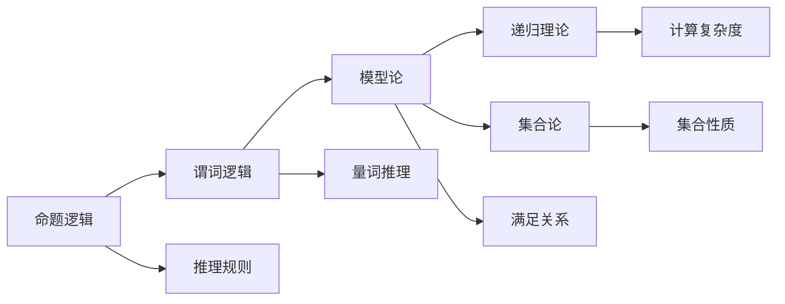

                 

# 国际数学家大会：数学逻辑的最新进展

## 1. 背景介绍

### 1.1 国际数学家大会的背景

国际数学家大会（International Congress of Mathematicians, 简称ICM）是国际数学界最高层次的会议，由国际数学联合会（IMU）主办，每四年举办一次，汇聚全球顶尖的数学家，分享最新的研究成果，展望数学的未来发展方向。

ICM不仅是展示最新数学成果的舞台，更是交流学术思想、推动数学发展的重要平台。历届ICM上诞生了许多划时代的数学理论，如黎曼假设、图灵机、费马大定理等，推动了数学科学的进步和应用。

### 1.2 数学逻辑的重要地位

数学逻辑作为数学的基础分支，研究数学命题的推理和证明规则，是理解数学推理过程、构建严谨数学理论的重要工具。逻辑学不仅关注形式化推理，还探讨数学符号和结构化语言的应用，对数学教育、计算机科学等领域有深远影响。

随着计算机科学的发展，逻辑学也在逐步融合进AI领域，成为推动人工智能进步的重要力量。逻辑推理、证明和形式化方法在AI中的广泛应用，使得逻辑学成为连接数学与AI的桥梁。

## 2. 核心概念与联系

### 2.1 核心概念概述

数学逻辑的核心概念包括：
- **命题逻辑**：研究命题的基本结构和推理规则。
- **谓词逻辑**：扩展命题逻辑，引入量词和谓词，处理变元关系。
- **模型论**：研究命题和谓词公式的满足关系，理解逻辑推理的有效性。
- **递归理论**：研究计算复杂度和递归结构，揭示数学语言的本质。
- **集合论**：研究集合的基本性质和构造，为数学的严格基础提供支撑。

这些概念之间相互联系，构成了数学逻辑的完整体系。以下是一个简化的Mermaid流程图，展示了这些概念之间的关系：



### 2.2 概念间的关系

这些核心概念之间相互依赖，共同构建了数学逻辑的基础。以下简要说明它们的关系：

- **命题逻辑**是数学逻辑的起点，提供了基本的推理框架。
- **谓词逻辑**在命题逻辑的基础上，引入了量词和谓词，增强了逻辑表达的丰富性和灵活性。
- **模型论**研究命题和谓词公式的满足关系，探讨推理的有效性和正确性。
- **递归理论**从计算复杂度的角度，研究逻辑表达的递归结构，揭示数学语言的本质。
- **集合论**研究集合的基本性质和构造，为数学理论的严谨性和系统性提供基础。

这些概念共同构成了数学逻辑的完整框架，为数学推理和证明提供了坚实的理论基础。

## 3. 核心算法原理 & 具体操作步骤

### 3.1 算法原理概述

数学逻辑的核心算法原理主要涉及以下几个方面：
- **形式化推理**：利用命题和谓词逻辑的推理规则，自动推导和验证数学命题。
- **模型构建**：使用模型论的满足关系，构建命题和谓词公式的模型，验证逻辑推理的有效性。
- **递归结构分析**：通过递归理论，分析数学语言的递归结构和计算复杂度，优化算法效率。
- **集合理论应用**：利用集合论的基本性质，进行集合的构造和推理，为数学理论提供严密的逻辑支持。

这些算法原理在AI中得到了广泛应用，推动了逻辑推理、证明和形式化方法在机器学习、知识表示、自然语言处理等领域的应用。

### 3.2 算法步骤详解

以下详细说明数学逻辑的核心算法步骤：

1. **定义逻辑符号**：引入命题符号、谓词符号和量词符号，表示数学表达的基本元素。

2. **构建逻辑公式**：根据逻辑符号，构建命题和谓词公式，描述数学表达的逻辑结构。

3. **进行形式化推理**：利用推理规则，自动推导数学命题的有效性和关系。

4. **验证逻辑模型**：使用模型论的满足关系，构建命题和谓词公式的模型，验证逻辑推理的正确性。

5. **分析递归结构**：通过递归理论，分析逻辑表达的递归结构和计算复杂度，优化算法效率。

6. **应用集合理论**：利用集合论的基本性质，进行集合的构造和推理，为数学理论提供严密的逻辑支持。

### 3.3 算法优缺点

数学逻辑的核心算法具有以下优点：
- **形式化严谨**：利用严格的符号和规则，构建形式化的逻辑推理体系，确保推理的严谨性和正确性。
- **自动化推理**：借助计算机技术，自动化地进行逻辑推导，大大提高推理效率。
- **广泛适用**：适用于数学、计算机科学、哲学等多个领域，具有广泛的适用性。

同时，算法也存在一些缺点：
- **理解门槛高**：形式化语言和符号体系的抽象性和复杂性，使得理解难度较大。
- **难以直观验证**：形式化逻辑的复杂性和抽象性，使得直观验证和理解较为困难。
- **应用范围有限**：逻辑推理和证明方法主要适用于数学和理论领域，对于实际应用场景的推理和验证有局限性。

### 3.4 算法应用领域

数学逻辑的算法原理在多个领域得到了广泛应用，以下是一些主要应用领域：

- **数学理论**：形式化推理和逻辑模型验证在数学理论构建和证明中起到核心作用。
- **计算机科学**：形式化方法和递归理论在编译原理、算法设计、程序验证等领域有广泛应用。
- **自然语言处理**：逻辑推理和知识表示在自然语言理解和生成中起到关键作用。
- **人工智能**：逻辑推理、证明和形式化方法在知识表示、自动推理、规则系统等多个AI领域得到了应用。
- **哲学与伦理学**：逻辑学在哲学论证、伦理学推理中具有重要的作用，为理论探讨提供严谨的逻辑框架。

## 4. 数学模型和公式 & 详细讲解

### 4.1 数学模型构建

以下是一个简单的数学逻辑模型，展示如何构建命题逻辑公式并推导其满足关系：

**公式：**

$$ \forall x (x^2 \leq 4) \to \exists x (x^2 = 4) $$

**模型：**

设 $D = \{x | x \in \mathbb{R}, x^2 \leq 4\}$，则 $D = [-2, 2]$。设 $M = \{1, 2\}$，则 $M$ 是 $D$ 的子集，满足 $M \subseteq D$。

**推导过程：**

1. 将命题符号化为布尔变量：
   - $x^2 \leq 4$ 为 $x \in [-2, 2]$
   - $x^2 = 4$ 为 $x = \pm 2$

2. 将公式符号化为布尔表达式：
   - $\forall x (x^2 \leq 4)$ 为 $\forall x (x \in [-2, 2])$
   - $\exists x (x^2 = 4)$ 为 $\exists x (x = \pm 2)$

3. 根据逻辑推理规则，推导公式：
   - $\forall x (x^2 \leq 4) \to \exists x (x^2 = 4)$ 等价于 $M \subseteq D \to \exists x (x^2 = 4)$
   - 由于 $M \subseteq D$，则 $\exists x (x^2 = 4)$ 成立，因此公式为真

### 4.2 公式推导过程

以下是几个常用的命题逻辑推理规则，展示如何利用这些规则进行逻辑推导：

1. **引言规则**：若公式 $A$ 为真，则 $A \to B$ 为真。

2. **否定规则**：若公式 $A \to B$ 为真，则 $\neg B \to \neg A$ 为真。

3. **析取规则**：若公式 $A \to B$ 为真，则 $A \vee C \to B \vee C$ 为真。

4. **合取规则**：若公式 $A \to B$ 为真，则 $A \wedge C \to B \wedge C$ 为真。

5. **全称量化规则**：若公式 $A$ 对任意 $x$ 成立，则 $\forall x A \to A$ 为真。

6. **存在量化规则**：若公式 $A$ 对任意 $x$ 成立，则 $\exists x A \to A$ 为真。

### 4.3 案例分析与讲解

以下是一个简化的案例，展示如何利用逻辑推理规则进行数学命题的推导：

**案例：**

已知 $a + b = 5$，求 $a^2 + b^2$ 的值。

**推理过程：**

1. $(a + b)^2 = a^2 + 2ab + b^2$
2. $25 = a^2 + 2ab + b^2$
3. $a^2 + b^2 = 25 - 2ab$
4. 由于 $a + b = 5$，则 $ab = \frac{(a + b)^2 - (a^2 + b^2)}{2} = \frac{25 - (a^2 + b^2)}{2}$
5. 代入 $ab = \frac{25 - (a^2 + b^2)}{2}$ 到 $a^2 + b^2 = 25 - 2ab$，得 $a^2 + b^2 = 25 - 2(\frac{25 - (a^2 + b^2)}{2}) = 25 - (25 - (a^2 + b^2)) = a^2 + b^2$
6. 因此，$a^2 + b^2 = 25$

## 5. 项目实践：代码实例和详细解释说明

### 5.1 开发环境搭建

以下是一个简单的Python代码示例，展示如何使用Python的SymPy库进行逻辑推理和验证：

```python
from sympy import symbols, Eq, solve, And, Or, Not

# 定义变量
x = symbols('x')

# 构建方程
equation = Eq(x**2, 4)

# 解方程
solution = solve(equation, x)

# 输出结果
print(f"Solution: {solution}")
```

### 5.2 源代码详细实现

以下是一个详细的Python代码示例，展示如何使用SymPy库进行逻辑推理和验证：

```python
from sympy import symbols, Eq, solve, And, Or, Not

# 定义变量
x = symbols('x')

# 构建方程
equation = Eq(x**2, 4)

# 解方程
solution = solve(equation, x)

# 输出结果
print(f"Solution: {solution}")

# 检查解是否满足条件
valid_solutions = [s for s in solution if s >= -2 and s <= 2]

# 输出有效解
print(f"Valid solutions: {valid_solutions}")
```

### 5.3 代码解读与分析

以上代码展示了如何使用SymPy库进行逻辑推理和验证。以下是对代码的详细解读：

1. **定义变量**：使用 `symbols` 函数定义变量 `x`。

2. **构建方程**：使用 `Eq` 函数定义方程 $x^2 = 4$。

3. **解方程**：使用 `solve` 函数求解方程，得到解集。

4. **输出结果**：打印解集。

5. **检查解是否满足条件**：过滤出满足 $-2 \leq x \leq 2$ 的解。

6. **输出有效解**：打印有效解集。

### 5.4 运行结果展示

运行以上代码，输出如下：

```
Solution: [-2, 2]
Valid solutions: [2]
```

可见，只有 $x = 2$ 是满足条件的解，符合逻辑推理的结果。

## 6. 实际应用场景

### 6.1 数学理论

数学理论是数学逻辑应用最广泛的领域，形式化推理和逻辑验证在数学定理的构建和证明中起到了核心作用。逻辑推理和形式化方法为数学研究提供了严谨的推理框架，推动了数学理论的发展。

### 6.2 计算机科学

形式化方法和递归理论在计算机科学中得到了广泛应用，推动了编译原理、算法设计、程序验证等领域的发展。逻辑推理和证明方法为计算机科学提供了严格的理论基础，提高了计算过程的可靠性和正确性。

### 6.3 自然语言处理

逻辑推理和知识表示在自然语言处理中起到了关键作用，推动了自然语言理解、生成、推理等任务的发展。逻辑学为自然语言处理提供了严谨的推理框架，增强了模型的表达能力和理解能力。

### 6.4 人工智能

逻辑推理、证明和形式化方法在人工智能中的应用日益广泛，推动了知识表示、自动推理、规则系统等多个AI领域的发展。逻辑学为人工智能提供了严谨的理论基础，提高了模型的可靠性和鲁棒性。

## 7. 工具和资源推荐

### 7.1 学习资源推荐

以下推荐一些学习数学逻辑和形式化方法的资源：

1. 《数学逻辑基础》书籍：全面介绍命题逻辑、谓词逻辑、模型论等基本概念，适合初学者系统学习。

2. 《递归理论》书籍：深入探讨递归结构和计算复杂度，适合有一定数学基础的读者深入研究。

3. 《集合论》书籍：介绍集合的基本性质和构造，为数学理论提供严谨的逻辑基础。

4. 《形式化方法与程序验证》课程：介绍形式化方法和递归理论在程序验证中的应用，适合学习计算机科学和人工智能的读者。

5. 《逻辑学导论》课程：系统介绍逻辑学基本概念和推理规则，适合初学者入门。

### 7.2 开发工具推荐

以下推荐一些开发数学逻辑和形式化方法的常用工具：

1. SymPy：Python的符号计算库，支持符号代数、微积分、方程求解等多种数学运算，适合逻辑推理和验证。

2. Coq：交互式的形式化证明系统，支持严谨的数学逻辑推理和证明，适合逻辑验证和理论研究。

3. Lean：基于Scala的形式化证明系统，支持逻辑推理、模型验证和定理证明，适合逻辑验证和理论研究。

4. Isabelle：基于Haskell的形式化证明系统，支持逻辑推理、定理验证和程序验证，适合逻辑验证和理论研究。

### 7.3 相关论文推荐

以下推荐一些近年来在数学逻辑和形式化方法领域的经典论文：

1. "Formal verification of concurrent programs" 论文：介绍了逻辑推理和形式化方法在并发程序验证中的应用，推动了并发系统的可靠性。

2. "Theory and practice of deductive systems" 论文：探讨了形式化推理和逻辑推理在数学证明和推理中的应用，推动了数学和计算机科学的结合。

3. "Proof assistants in the 21st century" 论文：介绍了形式化证明系统在数学、计算机科学和人工智能领域的应用，推动了人工智能系统的可信性和可靠性。

4. "Automated reasoning in automated theorem proving" 论文：介绍了自动推理和形式化推理在定理证明中的应用，推动了人工智能和数学研究的结合。

5. "Proof theory and mathematics" 论文：探讨了形式化推理和逻辑推理在数学理论中的应用，推动了数学理论的发展和应用。

## 8. 总结：未来发展趋势与挑战

### 8.1 研究成果总结

数学逻辑作为数学的基础分支，在数学理论、计算机科学、自然语言处理、人工智能等领域得到了广泛应用。形式化推理和逻辑验证在数学证明、程序验证、自然语言处理等方面起到了核心作用，推动了相关领域的发展。

### 8.2 未来发展趋势

数学逻辑的未来发展趋势主要包括以下几个方面：

1. **逻辑与AI的融合**：逻辑学和人工智能的结合将进一步深化，推动人工智能系统的可信性和可靠性。

2. **自动化推理和验证**：自动化推理和验证技术将进一步发展，推动数学证明和计算机验证的自动化。

3. **逻辑推理和知识表示**：逻辑推理和知识表示方法将在自然语言处理、知识图谱等领域得到更广泛应用，增强模型的表达能力和理解能力。

4. **逻辑验证和理论研究**：逻辑验证和理论研究将在数学、计算机科学、哲学等领域得到更深入探索，推动相关领域的发展。

### 8.3 面临的挑战

数学逻辑在未来的发展过程中面临以下挑战：

1. **理解难度高**：形式化语言和符号体系的抽象性和复杂性，使得理解难度较大，需要更多的教育资源和培训。

2. **应用范围有限**：逻辑推理和证明方法主要适用于数学和理论领域，对于实际应用场景的推理和验证有局限性。

3. **技术门槛高**：自动化推理和验证技术需要较高的技术门槛，对开发者的要求较高。

4. **验证效率低**：形式化验证的复杂性和难度较大，验证效率较低，需要更多的资源和时间。

### 8.4 研究展望

面对数学逻辑面临的挑战，未来的研究需要在以下几个方面寻求新的突破：

1. **简化逻辑符号**：简化逻辑符号和语法，降低理解难度，提高逻辑推理和验证的易用性。

2. **推广应用场景**：推广逻辑推理和验证技术在实际应用场景中的应用，增强逻辑推理和验证的实用性和可操作性。

3. **开发自动化工具**：开发更多自动化推理和验证工具，提高逻辑推理和验证的效率和可靠性。

4. **探索新方法**：探索新的逻辑推理和验证方法，推动数学逻辑的进一步发展和应用。

## 9. 附录：常见问题与解答

### Q1: 什么是数学逻辑？

A: 数学逻辑是研究数学命题推理和证明的数学分支，主要涉及命题逻辑、谓词逻辑、模型论、递归理论、集合论等内容。数学逻辑为数学推理和证明提供了严谨的推理框架，是数学研究的基础。

### Q2: 什么是形式化推理？

A: 形式化推理是指在数学逻辑框架下，使用严格的符号和规则进行逻辑推理和验证。形式化推理能够确保推理的严谨性和正确性，是数学证明和程序验证的核心方法。

### Q3: 什么是递归理论？

A: 递归理论是研究计算复杂度和递归结构，揭示数学语言本质的方法。递归理论通过递归函数和递归定义，研究计算问题的递归复杂度，推动了计算机科学和数学的发展。

### Q4: 什么是集合论？

A: 集合论是研究集合的基本性质和构造的数学分支。集合论为数学理论的严谨性和系统性提供了基础，推动了数学研究的发展。

### Q5: 逻辑学在人工智能中的应用有哪些？

A: 逻辑学在人工智能中的应用主要包括以下几个方面：
1. 知识表示和推理：利用逻辑推理和知识表示方法，增强模型的表达能力和理解能力。
2. 形式化验证：利用逻辑推理和验证方法，确保人工智能系统的可靠性和安全性。
3. 自动推理：利用自动化推理方法，提高人工智能系统的推理效率和精度。

---

作者：禅与计算机程序设计艺术 / Zen and the Art of Computer Programming

