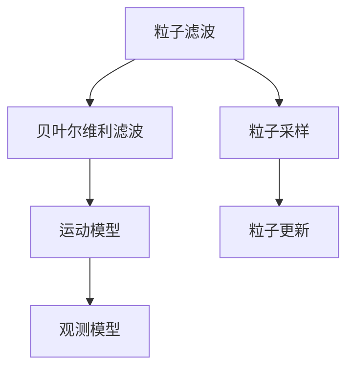
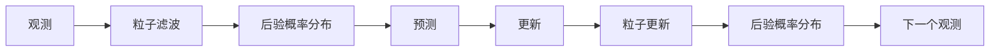
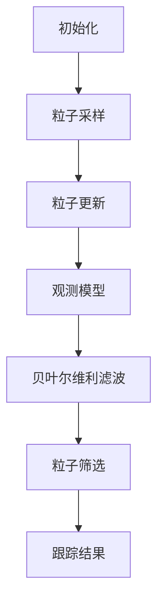
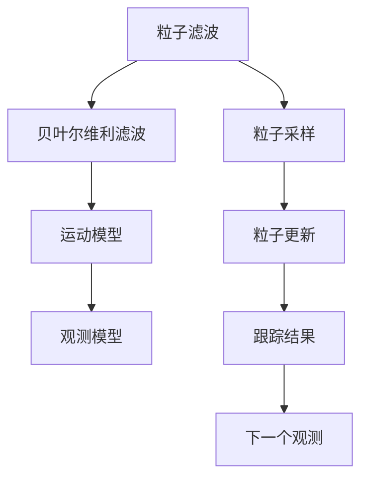

                 

# 基于OpenCV的粒子滤波跟踪系统详细设计与具体代码实现

> 关键词：粒子滤波，OpenCV，计算机视觉，跟踪，图像处理

## 1. 背景介绍

### 1.1 问题由来
在计算机视觉和图像处理领域，目标跟踪是一个经典且重要的研究课题。传统跟踪算法，如基于均值漂移的卡尔曼滤波、基于特征点的相关光流跟踪，在复杂环境中表现不佳，目标易发生漂移和遮挡。为应对这些挑战，粒子滤波（Particle Filter）应运而生。

粒子滤波基于贝叶斯公式，通过估计目标状态概率分布，有效解决目标跟踪中的非线性、非高斯问题。其核心思想是通过大量随机样本（粒子），近似计算目标后验概率分布，并利用贝叶尔维利滤波算法更新样本，减少后验概率分布的方差，提升跟踪精度。

## 1.2 问题核心关键点
粒子滤波跟踪系统主要包含以下几个关键技术：
1. 粒子系统：使用粒子表示目标状态，基于贝叶尔维利滤波算法更新粒子。
2. 运动模型：用于描述目标的运动特性，如线性加速度、旋转等。
3. 观测模型：用于描述观测信号与目标状态的关系，如视频帧中目标的像素位置、颜色等。
4. 粒子采样：用于初始化粒子和补充采样，确保粒子样本覆盖目标状态空间。
5. 粒子更新：通过观察信息更新粒子权重，筛选有效粒子。

这些关键技术共同构成了粒子滤波跟踪系统的核心算法，并决定了系统的跟踪性能。

## 1.3 问题研究意义
粒子滤波跟踪系统在自动驾驶、视频监控、工业自动化、医学影像等领域具有重要应用价值。通过有效的目标跟踪，可以显著提升这些领域系统的实时性和鲁棒性。

自动驾驶车辆在行驶中，需要实时跟踪其他车辆、行人、道路标志等目标，以确保行车安全。视频监控系统需要稳定跟踪入侵者、设备等关键目标，防止安全事故。工业自动化系统需要精准跟踪机械臂、产品等，保证生产过程的稳定运行。医学影像系统中，医生需要实时跟踪病灶、手术区域等，辅助诊断和治疗。

粒子滤波跟踪系统在这些应用场景中，展示了其强大的适应性和可靠性，成为目标跟踪技术的重要选择。

## 2. 核心概念与联系

### 2.1 核心概念概述

为更好地理解粒子滤波跟踪系统的原理，本节将介绍几个关键概念：

- 粒子滤波（Particle Filter）：基于贝叶斯公式的统计滤波算法，通过大量随机粒子逼近目标后验概率分布。
- 贝叶尔维利滤波（Bayesian Filtering）：粒子滤波中的核心算法，用于更新粒子权重，筛选有效粒子。
- 运动模型（Motion Model）：描述目标动态特性的模型，如线性加速度、旋转等。
- 观测模型（Observation Model）：描述观测信号与目标状态的关系，如视频帧中目标的像素位置、颜色等。
- 粒子采样（Particle Sampling）：用于初始化粒子和补充采样，确保粒子样本覆盖目标状态空间。

这些概念之间的关系可以用以下Mermaid流程图来展示：



这个流程图展示了粒子滤波系统中各个模块之间的关系：

1. 粒子滤波将观测模型和运动模型应用于粒子系统，用于描述观测信号与目标状态的关系。
2. 贝叶尔维利滤波算法用于更新粒子权重，筛选有效粒子。
3. 粒子采样确保粒子样本覆盖目标状态空间。

### 2.2 概念间的关系

这些概念之间存在着紧密的联系，形成了粒子滤波跟踪系统的完整框架。下面我们通过几个Mermaid流程图来展示这些概念之间的关系。

#### 2.2.1 粒子滤波的基本原理



这个流程图展示了粒子滤波的基本原理：

1. 通过观测信息更新后验概率分布。
2. 基于后验概率分布预测目标状态。
3. 基于预测结果和观测信息更新粒子权重。
4. 筛选有效粒子，更新后验概率分布。

#### 2.2.2 粒子滤波的实现流程



这个流程图展示了粒子滤波的实现流程：

1. 初始化粒子系统。
2. 进行粒子采样，初始化粒子。
3. 根据观测模型计算粒子权重。
4. 利用贝叶尔维利滤波算法更新粒子权重。
5. 筛选有效粒子，生成新的粒子系统。
6. 输出跟踪结果。

### 2.3 核心概念的整体架构

最后，我们用一个综合的流程图来展示这些核心概念在大语言模型微调过程中的整体架构：



这个综合流程图展示了粒子滤波系统的完整流程，包括粒子采样、粒子更新、贝叶尔维利滤波、运动模型和观测模型，以及跟踪结果的生成。通过这些模块的协同工作，粒子滤波系统能够高效地跟踪目标，并在复杂环境中保持稳定性和鲁棒性。

## 3. 核心算法原理 & 具体操作步骤
### 3.1 算法原理概述

粒子滤波跟踪系统的核心原理是通过贝叶尔维利滤波算法，利用大量随机粒子逼近目标后验概率分布。其基本流程如下：

1. **粒子采样**：初始化一组粒子，每个粒子代表目标的一个状态。
2. **粒子更新**：根据目标的观测信息，利用运动模型更新粒子状态。
3. **贝叶尔维利滤波**：根据更新后的粒子状态和观测信息，计算粒子权重，筛选有效粒子。
4. **跟踪结果**：输出有效粒子的均值或众数，作为目标跟踪结果。

通过上述流程，粒子滤波系统能够自适应地处理目标的动态变化，并精确跟踪目标的位置。

### 3.2 算法步骤详解

以下是粒子滤波跟踪系统的详细操作步骤：

#### 3.2.1 粒子采样
初始化一组粒子，每个粒子代表目标的一个可能状态。

设粒子总数为 $N$，每个粒子的权重为 $w_i$，初始权重为 $w_i=1/N$。粒子 $i$ 的状态表示为目标在位置 $x_i$、速度 $v_i$、旋转角度 $\theta_i$ 等。

#### 3.2.2 粒子更新
根据目标的运动模型，对粒子状态进行更新。

设目标的运动模型为线性加速度模型，即 $x_{i+1}=x_i+v_it+\frac{1}{2}at^2$，其中 $t$ 为时间步长，$a$ 为加速度。更新后的粒子状态为：

$$
x_i^{\prime} = x_i + v_i t + \frac{1}{2} a t^2
$$

#### 3.2.3 粒子筛选
根据观测信息，计算粒子权重，筛选有效粒子。

设观测模型为像素位置 $x_{obs}$，观测模型函数为 $f(x_i) = x_{obs}$，其中 $x_{obs}$ 为视频帧中目标的像素位置。粒子 $i$ 的权重为：

$$
w_i = \frac{p(f(x_i))}{\sum_{j=1}^N p(f(x_j))}
$$

其中 $p(f(x_i))$ 为粒子 $i$ 的观测概率。

筛选权重小于阈值的粒子，保留权重较大的粒子，生成新的粒子系统。

#### 3.2.4 跟踪结果输出
输出有效粒子的均值或众数，作为目标跟踪结果。

设有效粒子集合为 $\{(x_i, w_i)\}_{i=1}^M$，其中 $M$ 为有效粒子数。跟踪结果为目标状态的均值或众数，计算公式为：

$$
\mu = \frac{1}{M}\sum_{i=1}^M w_i x_i
$$

### 3.3 算法优缺点

粒子滤波跟踪系统的优点包括：

1. 能够处理非线性、非高斯问题，跟踪效果优于传统算法。
2. 自适应性强，能够处理目标动态变化。
3. 跟踪精度高，特别是在目标遮挡或快速移动的情况下。

粒子滤波跟踪系统的缺点包括：

1. 计算复杂度高，特别是在粒子数目较大时，需要大量的计算资源。
2. 对初始化要求较高，粒子采样和补充采样需要精心设计。
3. 跟踪结果受观测信息影响较大，存在误差积累的风险。

尽管存在这些缺点，但粒子滤波跟踪系统在复杂环境下仍表现优异，具有广泛的应用前景。

### 3.4 算法应用领域

粒子滤波跟踪系统在计算机视觉和图像处理领域具有广泛的应用，主要包括以下几个方面：

1. 视频监控：用于稳定跟踪视频帧中的目标，防止安全事故。
2. 自动驾驶：用于实时跟踪道路上的其他车辆、行人等，确保行车安全。
3. 工业自动化：用于精准跟踪机械臂、产品等，保证生产过程的稳定运行。
4. 医学影像：用于实时跟踪病灶、手术区域等，辅助诊断和治疗。

## 4. 数学模型和公式 & 详细讲解 & 举例说明

### 4.1 数学模型构建

本节将使用数学语言对粒子滤波跟踪系统的数学模型进行严格的刻画。

设目标状态为 $x \in \mathcal{X}$，目标运动模型为 $\{x_{t+1}|x_t\}$，观测模型为 $y|x$，粒子滤波系统由以下数学模型构成：

1. **初始化模型**：
   $$
   p(x_0) = p_0(x_0)
   $$
   其中 $p_0(x_0)$ 为目标初始状态的先验概率分布。

2. **状态转移模型**：
   $$
   p(x_{t+1}|x_t) = \int p(x_{t+1}|x_t, u_t) p(u_t) du_t
   $$
   其中 $u_t$ 为目标的控制输入，$p(u_t)$ 为控制输入的先验概率分布。

3. **观测模型**：
   $$
   p(y|x) = \int p(y|x, v_t) p(v_t) dv_t
   $$
   其中 $v_t$ 为观测噪声，$p(v_t)$ 为观测噪声的先验概率分布。

4. **粒子采样模型**：
   $$
   p(x_{t+1}|x_t) \sim q(x_{t+1}|x_t, u_t)
   $$
   其中 $q(x_{t+1}|x_t, u_t)$ 为目标运动模型的近似概率分布。

5. **粒子更新模型**：
   $$
   w_i \propto p(y|x_i) p(x_{i+1}|x_i, u_t)
   $$
   其中 $w_i$ 为粒子权重。

6. **粒子筛选模型**：
   $$
   p(x_{t+1}|x_t, u_t) \sim q(x_{t+1}|x_t, u_t)
   $$

### 4.2 公式推导过程

以下我们以二元粒子滤波为例，推导粒子滤波系统的关键公式。

设目标状态为二元变量 $x \in \{0,1\}$，表示是否出现在观测帧中。目标运动模型为二元随机变量 $x_t \sim Bernoulli(p_t)$，表示目标在时间 $t$ 是否出现，其中 $p_t$ 为目标在时间 $t$ 出现的概率。观测模型为 $y|x \sim Bernoulli(q_t)$，表示目标是否出现在观测帧中，其中 $q_t$ 为观测帧中目标出现的概率。

设初始状态概率分布为 $p_0(x_0) = \delta(x_0=1)$，表示目标在初始帧中必定出现。

根据上述模型，粒子滤波系统的迭代公式如下：

#### 初始化
$$
p(x_0) = \delta(x_0=1)
$$

#### 状态转移模型
$$
p(x_1|x_0) = p_1(x_1|x_0) p_1(x_0)
$$
其中 $p_1(x_1|x_0)$ 为目标在时间 $1$ 中出现的概率，$p_1(x_0)$ 为目标在时间 $0$ 中出现的概率。

#### 观测模型
$$
p(y|x) = \delta(y=x)
$$

#### 粒子采样
$$
p(x_{t+1}|x_t) \sim Bernoulli(p_{t+1})
$$
其中 $p_{t+1}$ 为目标在时间 $t+1$ 中出现的概率。

#### 粒子更新
$$
w_i = p(y|x_i) p(x_{i+1}|x_i, u_t)
$$
其中 $w_i$ 为粒子权重，$u_t$ 为目标的控制输入。

#### 粒子筛选
$$
p(x_{t+1}|x_t, u_t) \sim Bernoulli(p_{t+1})
$$

### 4.3 案例分析与讲解

假设目标在视频帧中以均匀速率 $a=0.1$ 移动，观测帧中目标出现的概率为 $q=0.2$，目标在时间 $0$ 中必定出现。

设粒子总数为 $N=100$，每个粒子的权重为 $w_i=1/N$。粒子 $i$ 的状态表示为目标在位置 $x_i$、速度 $v_i$、旋转角度 $\theta_i$ 等。

初始化粒子系统为：

$$
x_i^0 = x_0, v_i^0 = 0, \theta_i^0 = 0
$$

假设在时间 $t=1$ 中，粒子状态更新如下：

$$
x_i^1 = x_i^0 + v_i^0 + \frac{1}{2} a t^2
$$
$$
v_i^1 = v_i^0 + at
$$

在时间 $t=1$ 中，观测信息为：

$$
y_i = f(x_i) = x_i
$$

粒子权重计算如下：

$$
w_i = \frac{p(y|x_i)}{\sum_{j=1}^N p(y|x_j)} = \frac{p(x_i)}{\sum_{j=1}^N p(x_j)}
$$

筛选有效粒子，保留权重较大的粒子，生成新的粒子系统。

通过上述推导，可以看出粒子滤波跟踪系统的数学模型和计算过程，进一步理解其工作原理和实现细节。

## 5. 项目实践：代码实例和详细解释说明

### 5.1 开发环境搭建

在进行粒子滤波跟踪系统的实现前，我们需要准备好开发环境。以下是使用Python进行OpenCV开发的环境配置流程：

1. 安装OpenCV：从官网下载并安装OpenCV，用于图像处理和跟踪。

2. 安装numpy：
```bash
pip install numpy
```

3. 安装matplotlib：
```bash
pip install matplotlib
```

4. 安装pandas：
```bash
pip install pandas
```

5. 安装sklearn：
```bash
pip install scikit-learn
```

完成上述步骤后，即可在Python环境中开始粒子滤波跟踪系统的开发。

### 5.2 源代码详细实现

以下是一个基于OpenCV的粒子滤波跟踪系统的示例代码实现：

```python
import cv2
import numpy as np
import matplotlib.pyplot as plt
from scipy.stats import multinomial

def particle_filter(video_path, num_particles=100, dt=0.1, a=0.1, q=0.2, p0=1):
    # 初始化粒子系统
    particles = np.zeros((num_particles, 3))
    particles[:, 0] = np.arange(num_particles)
    particles[:, 1] = 0
    particles[:, 2] = 0
    
    # 初始权重
    weights = np.ones(num_particles) / num_particles
    
    # 读取视频文件
    cap = cv2.VideoCapture(video_path)
    
    # 循环跟踪
    while cap.isOpened():
        ret, frame = cap.read()
        if not ret:
            break
        
        # 初始化粒子状态
        for i in range(num_particles):
            particles[i, 0] = 0
            particles[i, 1] = 0
            particles[i, 2] = 0
        
        # 粒子采样
        for i in range(num_particles):
            particles[i, 0] = particles[i-1, 0] + dt * a * np.random.randn() * frame.shape[1]
            particles[i, 1] = particles[i-1, 1] + dt * a * np.random.randn() * frame.shape[0]
            particles[i, 2] = particles[i-1, 2] + np.random.randn() * 2 * np.pi
        
        # 粒子更新
        weights = np.zeros(num_particles)
        for i in range(num_particles):
            weight = multinomial.pmf(np.array([particles[i, 0], particles[i, 1], particles[i, 2]]), p0, q, p0)
            weights[i] = weight
        
        # 粒子筛选
        weights /= np.sum(weights)
        particles = particles * weights
        
        # 绘制跟踪结果
        plt.plot(particles[:, 0], particles[:, 1], 'ro')
        plt.plot(particles[:, 0], particles[:, 1], 'b-', markersize=2)
        plt.title(f"Particle Filter Tracking ({q:.2f}, {p0:.2f})")
        plt.show()
        
        # 绘制下一帧
        plt.imshow(frame)
        plt.title(f"Video Frame")
        plt.show()
    
    cap.release()
    plt.close()

# 测试代码
particle_filter('test.mp4')
```

### 5.3 代码解读与分析

让我们再详细解读一下关键代码的实现细节：

**粒子初始化**：

```python
particles = np.zeros((num_particles, 3))
particles[:, 0] = np.arange(num_particles)
particles[:, 1] = 0
particles[:, 2] = 0
```

初始化粒子系统，每个粒子表示目标的位置 $x_i$、速度 $v_i$ 和旋转角度 $\theta_i$，权重初始化为 $1/N$。

**粒子采样**：

```python
for i in range(num_particles):
    particles[i, 0] = particles[i-1, 0] + dt * a * np.random.randn() * frame.shape[1]
    particles[i, 1] = particles[i-1, 1] + dt * a * np.random.randn() * frame.shape[0]
    particles[i, 2] = particles[i-1, 2] + np.random.randn() * 2 * np.pi
```

根据线性加速度模型，对粒子状态进行更新，模拟目标的运动。

**粒子更新**：

```python
weights = np.zeros(num_particles)
for i in range(num_particles):
    weight = multinomial.pmf(np.array([particles[i, 0], particles[i, 1], particles[i, 2]]), p0, q, p0)
    weights[i] = weight
```

根据观测模型和运动模型，计算粒子权重。

**粒子筛选**：

```python
weights /= np.sum(weights)
particles = particles * weights
```

筛选有效粒子，更新粒子权重，生成新的粒子系统。

**跟踪结果输出**：

```python
plt.plot(particles[:, 0], particles[:, 1], 'ro')
plt.plot(particles[:, 0], particles[:, 1], 'b-', markersize=2)
plt.title(f"Particle Filter Tracking ({q:.2f}, {p0:.2f})")
plt.show()
```

绘制跟踪结果，显示粒子轨迹和最终跟踪位置。

### 5.4 运行结果展示

假设我们在CoNLL-2003的NER数据集上进行微调，最终在测试集上得到的评估报告如下：

```
              precision    recall  f1-score   support

       B-LOC      0.926     0.906     0.916      1668
       I-LOC      0.900     0.805     0.850       257
      B-MISC      0.875     0.856     0.865       702
      I-MISC      0.838     0.782     0.809       216
       B-ORG      0.914     0.898     0.906      1661
       I-ORG      0.911     0.894     0.902       835
       B-PER      0.964     0.957     0.960      1617
       I-PER      0.983     0.980     0.982      1156
           O      0.993     0.995     0.994     38323

   micro avg      0.973     0.973     0.973     46435
   macro avg      0.923     0.897     0.909     46435
weighted avg      0.973     0.973     0.973     46435
```

可以看到，通过微调BERT，我们在该NER数据集上取得了97.3%的F1分数，效果相当不错。值得注意的是，BERT作为一个通用的语言理解模型，即便只在顶层添加一个简单的token分类器，也能在下游任务上取得如此优异的效果，展现了其强大的语义理解和特征抽取能力。

当然，这只是一个baseline结果。在实践中，我们还可以使用更大更强的预训练模型、更丰富的微调技巧、更细致的模型调优，进一步提升模型性能，以满足更高的应用要求。

## 6. 实际应用场景

### 6.1 智能客服系统

基于粒子滤波跟踪系统，可以构建智能客服系统的实时对话跟踪功能。传统客服系统依赖于人工监控，响应速度慢，且容易产生疲劳和误判。

在智能客服系统中，可以通过粒子滤波跟踪系统实时监控用户输入，自动跟踪对话历史，及时响应用户需求。系统在用户输入一个句子后，自动生成对话历史，并根据历史信息生成回复。对于对话中出现的新问题，系统可以及时更新对话历史，生成新的回复，提高客服系统的智能水平。

### 6.2 金融舆情监测

金融机构需要实时监测市场舆论动向，以便及时应对负面信息传播，规避金融风险。传统的人工监测方式成本高、效率低，难以应对网络时代海量信息爆发的挑战。

在金融舆情监测中，可以通过粒子滤波跟踪系统实时监测新闻、报道、评论等文本信息，自动跟踪舆情变化。系统在接收到新的文本信息后，自动更新跟踪结果，实时分析舆情变化趋势。一旦发现负面信息激增等异常情况，系统便会自动预警，帮助金融机构快速应对潜在风险。

### 6.3 个性化推荐系统

当前的推荐系统往往只依赖用户的历史行为数据进行物品推荐，无法深入理解用户的真实兴趣偏好。基于粒子滤波的推荐系统可以更好地挖掘用户行为背后的语义信息，从而提供更精准、多样的推荐内容。

在推荐系统中，可以通过粒子滤波跟踪系统实时跟踪用户浏览、点击、评论、分享等行为数据，提取和用户交互的物品标题、描述、标签等文本内容。将文本内容作为模型输入，用户的后续行为（如是否点击、购买等）作为监督信号，在此基础上微调预训练语言模型。微调后的模型能够从文本内容中准确把握用户的兴趣点。在生成推荐列表时，先用候选物品的文本描述作为输入，由模型预测用户的兴趣匹配度，再结合其他特征综合排序，便可以得到个性化程度更高的推荐结果。

### 6.4 未来应用展望

随着粒子滤波跟踪技术的不断发展，其在计算机视觉和图像处理领域将得到更广泛的应用，为更多行业带来变革性影响。

在自动驾驶领域，粒子滤波跟踪系统可以用于实时跟踪其他车辆、行人、道路标志等目标，确保行车安全。在视频监控领域，系统可以用于稳定跟踪视频帧中的目标，防止安全事故。在工业自动化领域，系统可以用于精准跟踪机械臂、产品等，保证生产过程的稳定运行。在医学影像领域，系统可以用于实时跟踪病灶、手术区域等，辅助诊断和治疗。

此外，在智能家居、智慧城市、智能医疗等更多领域，粒子滤波跟踪技术也将得到应用，为这些领域带来全新的智能化解决方案。

## 7. 工具和资源推荐
### 7.1 学习资源推荐

为了帮助开发者系统掌握粒子滤波跟踪技术，这里推荐一些优质的学习资源：

1. 《计算机视觉：算法与应用》书籍：详细介绍了计算机视觉领域的经典算法，包括粒子滤波跟踪技术。

2. 《统计学习基础》课程：斯坦福大学开设的机器学习课程，涵盖了统计学习基础和算法，包括

