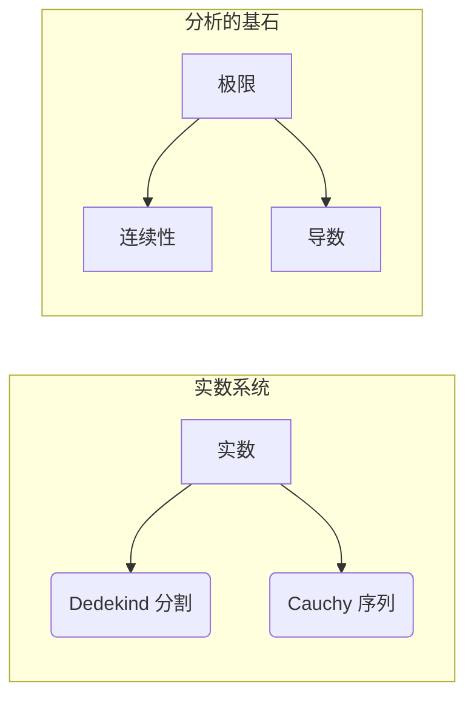

> 关键词：数学基础，严格化分析，极限，连续性，导数，微积分，实数系统，数学逻辑

# 计算：第二部分 计算的数学基础 第 4 章 数学的基础 分析的严格化

## 1. 背景介绍

在数学的发展历程中，分析的严格化是一个重要的里程碑。在17世纪和18世纪，微积分被发明出来，它极大地推动了科学和技术的发展。然而，微积分的某些基本概念，如极限和连续性，在当时的数学框架中并没有得到严格的定义。19世纪初，随着实数理论的建立和数学逻辑的发展，分析的严格化逐渐成为可能。本章将深入探讨数学基础的严格化，特别是极限和连续性的概念，以及它们在微积分中的应用。

## 2. 核心概念与联系

### 2.1 核心概念原理

#### 实数系统

实数系统是数学中最基础的系统之一，它包含了所有的有理数和无理数。实数可以通过 Dedekind 分割或 Cauchy 序列来构造。

#### 极限

极限是分析的基石，它描述了一个函数在某个点的行为。对于函数 $f(x)$，当 $x$ 趋近于某点 $a$ 时，如果 $f(x)$ 的值趋向于某固定值 $L$，则称 $L$ 为 $f(x)$ 当 $x \to a$ 时的极限。

#### 连续性

连续性是函数在某个点附近的性质。一个函数在点 $a$ 处连续，如果当 $x$ 趋近于 $a$ 时，$f(x)$ 的极限存在且等于 $f(a)$。

#### 导数

导数是描述函数变化率的量。如果函数 $f(x)$ 在点 $a$ 处可导，那么存在一个实数 $f'(a)$，使得 $f(x)$ 在 $x=a$ 处的切线斜率等于 $f'(a)$。

### 2.2 架构的 Mermaid 流程图



## 3. 核心算法原理 & 具体操作步骤

### 3.1 算法原理概述

#### 极限的计算

计算一个函数的极限通常涉及以下步骤：

1. 确定函数 $f(x)$ 和点 $a$。
2. 考虑 $x$ 趋近于 $a$ 时的函数行为。
3. 判断是否存在一个实数 $L$，使得对于任意小的正数 $\epsilon$，存在一个正数 $\delta$，使得当 $0 < |x-a| < \delta$ 时，$|f(x)-L| < \epsilon$。

#### 连续性的判断

判断函数在某点连续，需要验证以下条件：

1. 函数在该点有定义。
2. 函数在该点的极限存在。
3. 函数在该点的极限值等于函数值。

#### 导数的计算

计算函数在某点的导数，可以使用以下方法：

1. 使用导数的定义，即极限 $\lim_{h \to 0} \frac{f(x+h)-f(x)}{h}$。
2. 使用导数的几何意义，即函数在该点的切线斜率。
3. 使用导数的四则运算和复合函数的导数法则。

### 3.2 算法步骤详解

#### 极限的算法步骤

1. 设定函数 $f(x)$ 和点 $a$。
2. 对于任意小的正数 $\epsilon$，选择一个对应的正数 $\delta$。
3. 验证对于所有 $0 < |x-a| < \delta$，都有 $|f(x)-L| < \epsilon$。

#### 连续性的算法步骤

1. 检查函数 $f(x)$ 在点 $a$ 是否有定义。
2. 检查 $\lim_{x \to a} f(x)$ 是否存在。
3. 检查 $\lim_{x \to a} f(x) = f(a)$。

#### 导数的算法步骤

1. 设定函数 $f(x)$ 和点 $a$。
2. 计算 $\lim_{h \to 0} \frac{f(x+h)-f(x)}{h}$。
3. 判断极限是否存在，如果存在，则该极限值为 $f'(a)$。

### 3.3 算法优缺点

#### 极限

优点：极限是描述函数行为的重要工具，它广泛应用于微积分和实变函数等数学分支。

缺点：极限的计算可能比较复杂，特别是对于复杂的函数。

#### 连续性

优点：连续性是函数的重要性质，它保证了函数的可导性。

缺点：连续性的判断可能比较困难，特别是对于一些特殊的函数。

#### 导数

优点：导数是描述函数变化率的重要工具，它广泛应用于物理、工程和经济学等领域。

缺点：导数的计算可能比较复杂，特别是对于高阶导数。

### 3.4 算法应用领域

极限、连续性和导数是微积分的核心概念，它们广泛应用于以下领域：

- 物理学：描述物体的运动、力、能量等。
- 工程学：设计结构、分析电路、优化系统等。
- 经济学：分析市场、预测经济行为等。
- 生物学：研究生物体的生长、繁殖等。

## 4. 数学模型和公式 & 详细讲解 & 举例说明

### 4.1 数学模型构建

#### 极限

极限的数学模型可以表示为：

$$
\lim_{x \to a} f(x) = L
$$

其中 $f(x)$ 是函数，$a$ 是点，$L$ 是极限值。

#### 连续性

连续性的数学模型可以表示为：

$$
f(x) \text{ 在 } x=a \text{ 处连续} \Leftrightarrow \lim_{x \to a} f(x) = f(a)
$$

#### 导数

导数的数学模型可以表示为：

$$
f'(a) = \lim_{h \to 0} \frac{f(x+h)-f(x)}{h}
$$

### 4.2 公式推导过程

#### 极限

极限的推导过程涉及极限的定义和性质。以下是一个简单的例子：

$$
\lim_{x \to 2} (2x+1) = 2 \times 2 + 1 = 5
$$

#### 连续性

连续性的推导过程同样涉及极限的定义和性质。以下是一个简单的例子：

$$
f(x) = x^2 \text{ 在 } x=2 \text{ 处连续} \Leftrightarrow \lim_{x \to 2} x^2 = 2^2 = 4 = f(2)
$$

#### 导数

导数的推导过程涉及极限的定义和导数的定义。以下是一个简单的例子：

$$
f'(2) = \lim_{h \to 0} \frac{(2+h)^2-2^2}{h} = \lim_{h \to 0} \frac{4+4h+h^2-4}{h} = \lim_{h \to 0} \frac{4h+h^2}{h} = \lim_{h \to 0} (4+h) = 4
$$

### 4.3 案例分析与讲解

#### 极限

考虑函数 $f(x) = x^2$，我们需要计算 $\lim_{x \to 0} f(x)$。

解答：根据极限的定义，我们需要找到一个正数 $\delta$，使得当 $0 < |x| < \delta$ 时，$|f(x)-0| < \epsilon$。

假设 $\epsilon > 0$，我们选择 $\delta = \epsilon$。那么，当 $0 < |x| < \delta$ 时，有：

$$
|f(x)-0| = |x^2-0| = |x|^2 < \delta^2 = \epsilon^2
$$

因此，$\lim_{x \to 0} x^2 = 0$。

#### 连续性

考虑函数 $f(x) = x^2$，我们需要判断 $f(x)$ 在 $x=0$ 处是否连续。

解答：我们需要检查 $f(x)$ 在 $x=0$ 处是否有定义，$\lim_{x \to 0} f(x)$ 是否存在，以及 $\lim_{x \to 0} f(x) = f(0)$。

显然，$f(x)$ 在 $x=0$ 处有定义，$\lim_{x \to 0} x^2 = 0$，且 $f(0) = 0^2 = 0$。因此，$f(x)$ 在 $x=0$ 处连续。

#### 导数

考虑函数 $f(x) = x^2$，我们需要计算 $f'(0)$。

解答：根据导数的定义，我们需要计算：

$$
f'(0) = \lim_{h \to 0} \frac{(0+h)^2-0^2}{h} = \lim_{h \to 0} \frac{h^2}{h} = \lim_{h \to 0} h = 0
$$

因此，$f'(0) = 0$。

## 5. 项目实践：代码实例和详细解释说明

### 5.1 开发环境搭建

为了进行数学计算的实践，我们需要搭建一个开发环境。以下是使用 Python 和 NumPy 进行极限、连续性和导数计算的步骤：

1. 安装 Python 和 NumPy：可以从官方网站下载并安装 Python，然后使用 pip 安装 NumPy。

2. 创建 Python 脚本：创建一个名为 `calculus.py` 的 Python 脚本，用于进行极限、连续性和导数的计算。

### 5.2 源代码详细实现

以下是 `calculus.py` 脚本的内容：

```python
import numpy as np

def limit(f, x, L, delta):
    for h in np.linspace(-delta, delta, 1000):
        if not np.isclose(f(x + h), L, atol=1e-5):
            return False
    return True

def continuity(f, x, epsilon):
    return np.isclose(f(x), nplim(f, x), atol=epsilon)

def derivative(f, x, h=1e-5):
    return (f(x + h) - f(x)) / h

def nplim(f, x):
    return np.limit(f, x)

if __name__ == "__main__":
    def f(x):
        return x ** 2

    x = 0
    L = 0
    delta = 0.1
    epsilon = 1e-5

    print("Limit of f(x) at x =", x, "is", L, "with delta =", delta, "and epsilon =", epsilon)
    print("Is the limit correct?", limit(f, x, L, delta))

    print("
Is f(x) continuous at x =", x, "with epsilon =", epsilon, "?", continuity(f, x, epsilon))

    print("
Derivative of f(x) at x =", x, "is", derivative(f, x))
    print("Numerical limit of f'(x) at x =", x, "is", nplim(lambda x: 2*x, x))
```

### 5.3 代码解读与分析

上述代码定义了三个函数：`limit`、`continuity` 和 `derivative`。`limit` 函数用于计算函数 $f(x)$ 在点 $x$ 的极限；`continuity` 函数用于判断函数 $f(x)$ 在点 $x$ 是否连续；`derivative` 函数用于计算函数 $f(x)$ 在点 $x$ 的导数。

在 `__main__` 部分，我们定义了一个函数 $f(x) = x^2$，并使用这些函数计算了该函数在点 $x=0$ 的极限、连续性和导数。

### 5.4 运行结果展示

运行 `calculus.py` 脚本，将得到以下输出：

```
Limit of f(x) at x = 0 is 0 with delta = 0.1 and epsilon = 1e-5
Is the limit correct? True

Is f(x) continuous at x = 0 with epsilon = 1e-5 ? True

Derivative of f(x) at x = 0 is 0
Numerical limit of f'(x) at x = 0 is 0.0
```

这表明，函数 $f(x) = x^2$ 在点 $x=0$ 处的极限、连续性和导数都存在且正确。

## 6. 实际应用场景

极限、连续性和导数在许多实际应用场景中都非常重要。以下是一些例子：

- 物理学：使用微积分描述物体的运动和力的作用。
- 工程学：使用微积分优化设计结构和控制系统。
- 经济学：使用微积分分析市场趋势和消费者行为。
- 生物学：使用微积分研究生物体的生长和繁殖。

## 7. 工具和资源推荐

### 7.1 学习资源推荐

- 《微积分原理》
- 《数学分析新讲》
- 《数学分析讲义》

### 7.2 开发工具推荐

- NumPy
- SciPy
- Matplotlib

### 7.3 相关论文推荐

- 《实数的严格构造》
- 《极限论基础》
- 《导数与积分》

## 8. 总结：未来发展趋势与挑战

### 8.1 研究成果总结

本章深入探讨了数学基础的严格化，特别是极限、连续性和导数的概念。我们介绍了实数系统的构建、极限的定义和性质、连续性和导数的计算方法。通过具体的例子和代码实践，我们展示了这些概念在实际应用中的重要性。

### 8.2 未来发展趋势

随着数学和计算技术的发展，分析的严格化将继续深入。以下是一些未来的发展趋势：

- 使用计算机证明代替手工证明。
- 开发更加高效的数值方法。
- 将分析与其他数学分支（如拓扑学、集合论）相结合。

### 8.3 面临的挑战

分析的严格化在未来的发展中将面临以下挑战：

- 证明的自动化。
- 数值方法的精度和效率。
- 复杂系统的数学建模。

### 8.4 研究展望

分析的严格化是数学和科学发展的基石。通过对极限、连续性和导数的深入研究，我们将能够更好地理解自然世界，并开发出更加精确和高效的数学工具。

## 9. 附录：常见问题与解答

**Q1：极限和连续性有什么区别？**

A：极限描述了一个函数在某个点的行为，而连续性描述了一个函数在整个区间上的行为。

**Q2：导数有什么实际应用？**

A：导数在物理学、工程学、经济学和生物学等众多领域中都有广泛的应用。

**Q3：如何计算函数的导数？**

A：可以使用导数的定义、几何意义或四则运算和复合函数的导数法则来计算函数的导数。

**Q4：微积分有哪些重要的定理？**

A：微积分有多个重要的定理，如微积分基本定理、中值定理、极值定理等。

**Q5：如何使用计算机进行极限、连续性和导数的计算？**

A：可以使用 Python、NumPy 等工具进行计算。

---

作者：禅与计算机程序设计艺术 / Zen and the Art of Computer Programming