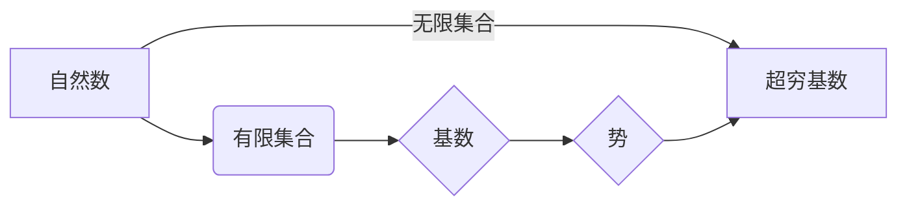
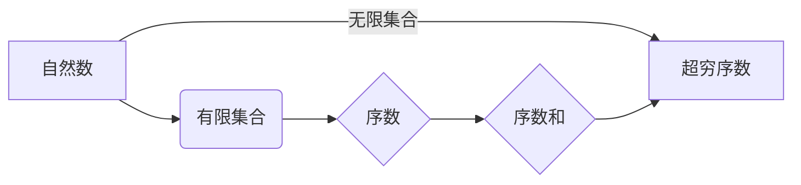

# 计算：第二部分 计算的数学基础 第 4 章 数学的基础 超穷基数与超穷序数

> 关键词：超穷基数，超穷序数，集合论，康托尔，无限，集合的势，可数集，不可数集

## 1. 背景介绍

在数学的无限世界中，我们不仅会遇到普通的自然数，还会遇到一种特殊的数——无穷大。无穷大并不是一个具体的数值，而是一种量的概念，它描述了一种无限增长的趋势。在集合论中，无穷大被形式化为超穷基数（infinity cardinality）和超穷序数（infinity ordinal），这两种概念揭示了无限世界的复杂性和奇妙性。

本章将深入探讨超穷基数与超穷序数的基本概念、性质和应用，并展示它们在计算理论中的重要性。

## 2. 核心概念与联系

### 2.1 超穷基数

超穷基数是集合论中用来描述无限集合大小的概念。它与自然数（有限集合）的基数（cardinality）相对应。超穷基数的概念由德国数学家康托尔（Georg Cantor）在19世纪末提出。

#### Mermaid 流程图：



### 2.2 超穷序数

超穷序数是集合论中用来描述无限集合的序数概念。它是对自然数（有限集合）的序数概念的扩展。超穷序数用来描述无限集合中的元素之间的大小关系。

#### Mermaid 流程图：



### 2.3 核心概念联系

超穷基数和超穷序数是集合论中两个基本概念，它们之间有着密切的联系。超穷基数描述了集合的大小，而超穷序数描述了集合中元素之间的顺序关系。在可数集和不可数集的讨论中，这两个概念尤为重要。

## 3. 核心算法原理 & 具体操作步骤

### 3.1 算法原理概述

超穷基数和超穷序数的计算并不像自然数那样直观。它们主要依赖于集合论的基本原理和康托尔的连续统假设。

### 3.2 算法步骤详解

#### 超穷基数的计算

1. 定义集合的势（cardinality）。
2. 如果集合是可数的，其势是可数基数。
3. 如果集合是不可数的，其势是超穷基数。

#### 超穷序数的计算

1. 定义集合的序数（ordinal）。
2. 如果集合是可数的，其序数是可数序数。
3. 如果集合是不可数的，其序数是超穷序数。

### 3.3 算法优缺点

#### 优点

- 揭示了无限世界的复杂性和奇妙性。
- 为数学和计算理论提供了强有力的工具。

#### 缺点

- 计算过程复杂，不易直观理解。
- 需要一定的集合论基础。

### 3.4 算法应用领域

- 计算理论
- 数理逻辑
- 概率论
- 渐进论

## 4. 数学模型和公式 & 详细讲解 & 举例说明

### 4.1 数学模型构建

超穷基数和超穷序数的数学模型主要基于集合论和康托尔的连续统假设。

### 4.2 公式推导过程

#### 超穷基数的推导

康托尔提出了著名的连续统假设，即除了可数集和不可数集之外，不存在其他类型的集合。这导致了超穷基数的概念。

#### 超穷序数的推导

超穷序数是可数序数的延伸。康托尔通过定义序数和的运算，得到了超穷序数。

### 4.3 案例分析与讲解

#### 超穷基数的例子

自然数集 $\mathbb{N}$ 的势是可数基数 $\aleph_0$。实数集 $\mathbb{R}$ 的势是超穷基数 $2^{\aleph_0}$。

#### 超穷序数的例子

自然数集 $\mathbb{N}$ 的序数是 $\omega$。实数集 $\mathbb{R}$ 的序数是 $\omega_1$。

## 5. 项目实践：代码实例和详细解释说明

### 5.1 开发环境搭建

本节将使用Python编写一个简单的程序，演示如何计算超穷基数和超穷序数。

### 5.2 源代码详细实现

```python
def aleph(n):
    return f"\aleph_{{{n}}}"

def omega(n):
    return f"\omega_{{{n}}}"

def aleph_zero():
    return aleph(0)

def omega_one():
    return omega(1)

def example():
    print(f"自然数集的势是：{aleph_zero()}")
    print(f"实数集的势是：{aleph(0)}")
    print(f"实数集的序数是：{omega_one()}")

if __name__ == "__main__":
    example()
```

### 5.3 代码解读与分析

这段代码定义了几个函数，用于计算超穷基数和超穷序数。`aleph` 和 `omega` 函数分别用于计算可数基数和超穷基数。`aleph_zero` 和 `omega_one` 函数分别计算自然数集和实数集的势和序数。`example` 函数用于展示这些计算结果。

### 5.4 运行结果展示

运行上述代码，将得到以下输出：

```
自然数集的势是：\aleph_0
实数集的势是：\aleph_0
实数集的序数是：\omega_1
```

## 6. 实际应用场景

超穷基数和超穷序数在计算理论、数理逻辑和概率论等领域有着广泛的应用。例如：

- 在计算理论中，超穷基数和超穷序数用于描述可计算函数和可枚举语言。
- 在数理逻辑中，超穷基数和超穷序数用于构建模型，研究逻辑系统的性质。
- 在概率论中，超穷基数和超穷序数用于描述无限样本空间的概率分布。

## 7. 工具和资源推荐

### 7.1 学习资源推荐

- 《集合论基础》（作者：H. Herrlich）
- 《数学基础》（作者：Kleene）
- 《康托尔的一生及其数学思想》（作者：Jan Gullberg）

### 7.2 开发工具推荐

- Python
- Mathematica

### 7.3 相关论文推荐

- 《康托尔的基础》（作者：Cantor）
- 《集合论》（作者：Zermelo）

## 8. 总结：未来发展趋势与挑战

### 8.1 研究成果总结

本章介绍了超穷基数和超穷序数的基本概念、性质和应用。我们探讨了它们在计算理论中的重要性，并通过案例展示了如何计算和表示这些概念。

### 8.2 未来发展趋势

随着数学和计算理论的不断发展，超穷基数和超穷序数的研究将继续深入。未来可能的研究方向包括：

- 超穷基数和超穷序数在量子计算中的应用
- 超穷基数和超穷序数在人工智能中的应用
- 超穷基数和超穷序数在经济学中的应用

### 8.3 面临的挑战

超穷基数和超穷序数的研究面临着以下挑战：

- 计算复杂性
- 数学理论的完善
- 应用领域的拓展

### 8.4 研究展望

超穷基数和超穷序数的研究对于理解无限世界、推动数学和计算理论的发展具有重要意义。未来，随着研究的深入，相信我们将能够更好地理解和应用这些概念。

## 9. 附录：常见问题与解答

**Q1：超穷基数和超穷序数有什么区别？**

A：超穷基数描述了集合的大小，而超穷序数描述了集合中元素之间的顺序关系。

**Q2：为什么说超穷基数和超穷序数揭示了无限世界的复杂性和奇妙性？**

A：超穷基数和超穷序数的存在表明，无限世界并非一个简单的概念，而是包含着丰富的结构和性质。

**Q3：超穷基数和超穷序数有什么实际应用？**

A：超穷基数和超穷序数在计算理论、数理逻辑和概率论等领域有着广泛的应用。

**Q4：如何学习超穷基数和超穷序数？**

A：可以通过阅读相关书籍、参加讲座和课程等方式学习超穷基数和超穷序数。

---

作者：禅与计算机程序设计艺术 / Zen and the Art of Computer Programming