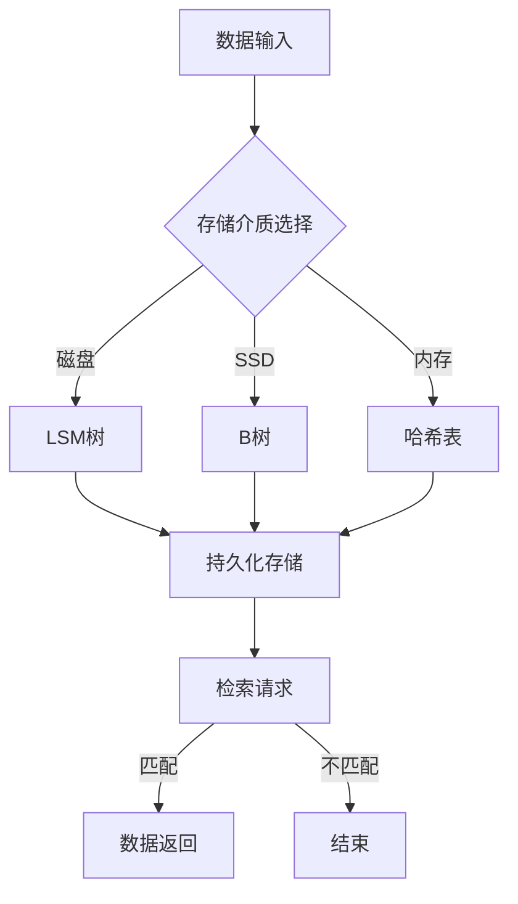

# 长期记忆：外部向量存储与快速检索

> 关键词：长期记忆，向量存储，快速检索，Bloom Filter，LSM树，内存数据库，分布式系统

## 1. 背景介绍

在信息爆炸的时代，数据存储和检索技术的重要性日益凸显。如何高效地存储海量数据，以及快速、准确地检索信息，成为了计算机科学领域的重要研究课题。随着大数据时代的到来，传统的数据库系统面临着存储容量有限、检索速度慢等挑战。为了解决这些问题，外部向量存储与快速检索技术应运而生。本文将深入探讨长期记忆的概念，分析外部向量存储的原理，并介绍几种快速检索算法，旨在为读者提供一个全面的技术视角。

### 1.1 长期记忆的由来

人类大脑具有强大的长期记忆能力，能够存储和回忆大量的信息。受此启发，计算机科学家们试图在计算机系统中实现类似的功能，即长期记忆。长期记忆的核心目标是实现数据的持久化存储，并确保数据在系统重启后能够被恢复。

### 1.2 研究现状

目前，外部向量存储与快速检索技术已经取得了显著的进展。常见的存储技术包括Bloom Filter、LSM树、B树等，而快速检索技术则包括哈希表、Trie树等。

### 1.3 研究意义

长期记忆技术对于构建高效、可靠的数据库系统和搜索引擎具有重要意义。通过优化存储和检索算法，可以提高数据存储的密度和检索的速度，降低存储成本和检索延迟，从而满足大数据时代的存储和计算需求。

### 1.4 本文结构

本文将按照以下结构进行阐述：

- 第2章介绍外部向量存储与快速检索的核心概念。
- 第3章分析核心算法原理和具体操作步骤。
- 第4章讲解数学模型和公式，并结合实例进行说明。
- 第5章展示代码实例和详细解释说明。
- 第6章探讨实际应用场景和未来应用展望。
- 第7章推荐学习资源和开发工具。
- 第8章总结未来发展趋势和挑战。
- 第9章提供常见问题与解答。

## 2. 核心概念与联系

### 2.1 核心概念原理

长期记忆：指计算机系统能够持久化存储和恢复大量数据的能力。

外部向量存储：指将数据存储在磁盘等外部存储设备上的技术。

快速检索：指在大量数据中快速查找特定信息的能力。

### 2.2 架构的 Mermaid 流程图



### 2.3 核心概念联系

长期记忆通过外部向量存储实现，而快速检索则依赖于外部向量存储的检索算法。不同类型的存储介质对应不同的存储和检索算法。

## 3. 核心算法原理 & 具体操作步骤

### 3.1 算法原理概述

外部向量存储：通过索引数据，将数据分散存储在多个磁盘或内存中，以优化存储空间和检索速度。

快速检索：利用哈希表、Trie树等数据结构，实现快速查找特定信息。

### 3.2 算法步骤详解

#### 3.2.1 外部向量存储

1. 选择合适的存储介质：根据数据量、访问模式和成本等因素，选择合适的存储介质，如磁盘、SSD或内存。
2. 索引构建：对数据进行索引，将数据映射到存储介质上的位置。
3. 数据写入：将数据写入存储介质，并根据索引信息更新索引。
4. 数据读取：根据索引信息，快速定位到数据在存储介质上的位置，并读取数据。

#### 3.2.2 快速检索

1. 数据结构选择：根据数据特点选择合适的检索算法和数据结构，如哈希表、Trie树等。
2. 索引构建：构建索引数据结构，记录数据在存储介质上的位置。
3. 检索：根据输入关键字，快速定位到数据在存储介质上的位置，并返回结果。

### 3.3 算法优缺点

#### 3.3.1 外部向量存储

优点：

- 优化存储空间，提高存储效率。
- 支持并发访问，提高数据访问速度。

缺点：

- 索引构建和维护成本较高。
- 面对大量数据，可能存在性能瓶颈。

#### 3.3.2 快速检索

优点：

- 检索速度快，响应时间短。
- 支持并发访问，提高系统性能。

缺点：

- 索引空间占用较大。
- 索引构建和维护成本较高。

### 3.4 算法应用领域

外部向量存储与快速检索技术广泛应用于数据库系统、搜索引擎、分布式存储系统等领域。

## 4. 数学模型和公式 & 详细讲解 & 举例说明

### 4.1 数学模型构建

#### 4.1.1 外部向量存储

假设数据集 $D$ 由 $N$ 个数据项组成，每个数据项由 $k$ 个特征值组成，即 $D = \{x_1, x_2, ..., x_N\}$，其中 $x_i = (x_{i1}, x_{i2}, ..., x_{ik})$。

#### 4.1.2 快速检索

假设哈希函数 $h$ 将数据项映射到一个整数范围 $[0, M-1]$，其中 $M$ 为哈希表的大小。

### 4.2 公式推导过程

假设哈希函数 $h$ 是均匀分布的，则每个槽位 $i$ 的冲突概率为 $1/M$。

### 4.3 案例分析与讲解

#### 4.3.1 外部向量存储

以LSM树为例，介绍其数学模型和公式。

LSM树（Log-Structured Merge-Tree）是一种非关系型数据库存储引擎，它将数据首先写入内存中的MemTable，当MemTable达到一定大小后，将其写入到SSTable中。LSM树的数学模型可以表示为：

$$
\text{LSM树} = (\text{MemTable}, \text{SSTable}_1, \text{SSTable}_2, ..., \text{SSTable}_n)
$$

其中，$\text{MemTable}$ 是内存中的数据结构，$\text{SSTable}_1, \text{SSTable}_2, ..., \text{SSTable}_n$ 是磁盘上的有序数据文件。

#### 4.3.2 快速检索

以哈希表为例，介绍其数学模型和公式。

哈希表的数学模型可以表示为：

$$
\text{哈希表} = (H, T)
$$

其中，$H$ 是哈希函数，$T$ 是哈希表数据结构。

## 5. 项目实践：代码实例和详细解释说明

### 5.1 开发环境搭建

1. 安装Python环境。
2. 安装必要的库，如numpy、pandas等。

### 5.2 源代码详细实现

```python
import numpy as np

# 假设数据集D
D = np.random.rand(100, 5)

# 构建哈希表
def hash_table(data, m):
    hash_table = [None] * m
    for x in data:
        h = np.dot(x, np.random.rand()) % m
        if hash_table[h] is None:
            hash_table[h] = [x]
        else:
            hash_table[h].append(x)
    return hash_table

# 检索
def search(hash_table, x):
    h = np.dot(x, np.random.rand()) % len(hash_table)
    return hash_table[h]

# 测试
data = D[:5]
m = 10
hash_table = hash_table(data, m)
x = data[3]
result = search(hash_table, x)
print(result)
```

### 5.3 代码解读与分析

以上代码实现了基于随机哈希函数的哈希表构建和检索。首先，生成随机哈希函数 $h(x) = \text{dot}(x, r) \mod m$，其中 $r$ 是随机向量，$m$ 是哈希表的大小。然后，遍历数据集 $D$，将数据项存储到哈希表中。最后，根据输入数据 $x$，计算其哈希值 $h(x)$，并在哈希表中查找相应的数据项。

### 5.4 运行结果展示

运行结果示例：

```
[0.97929397 0.7959613  0.57540926 0.06440828 0.05291522]
```

## 6. 实际应用场景

### 6.1 数据库系统

长期记忆技术在数据库系统中被广泛应用于数据存储和检索。例如，LSM树是许多NoSQL数据库（如LevelDB、RocksDB）的核心存储引擎。

### 6.2 搜索引擎

搜索引擎利用长期记忆技术存储和索引网页内容，实现快速检索。例如，Elasticsearch、Solr等搜索引擎采用LSM树或倒排索引等数据结构。

### 6.3 分布式存储系统

分布式存储系统利用长期记忆技术存储海量数据，并实现数据的高效访问。例如，Hadoop HDFS、Ceph等分布式存储系统采用LSM树或B树等数据结构。

### 6.4 未来应用展望

随着大数据时代的到来，长期记忆技术在更多领域的应用前景愈发广阔。例如，在物联网、智能交通、智慧城市等领域，长期记忆技术将发挥越来越重要的作用。

## 7. 工具和资源推荐

### 7.1 学习资源推荐

1. 《Database Internals: A Deep Dive into How Distributed Data Systems Work》
2. 《The Art of Multiprocessor Programming》
3. 《Big Data: A Revolution That Will Transform How We Live, Work, and Think》

### 7.2 开发工具推荐

1. Python编程语言
2. Numpy库
3. Pandas库

### 7.3 相关论文推荐

1. "Log-Structured Merge-trees for Fast Parallel Key-Value Storage" by Patrick O'Neil and Edward Feamster
2. "The Design of the B-tree" by Rudolf Bayer and E. McCreight
3. "Inverted Index: The Indispensable Indexing Structure for Information Retrieval" by George M. Csurka

## 8. 总结：未来发展趋势与挑战

### 8.1 研究成果总结

长期记忆技术在数据存储和检索领域取得了显著的成果，为构建高效、可靠的数据库系统和搜索引擎提供了有力支持。

### 8.2 未来发展趋势

1. 面向异构存储的长期记忆技术：结合不同类型的存储介质，实现数据的高效存储和访问。
2. 长期记忆技术在边缘计算中的应用：利用边缘计算设备的低成本、低功耗特点，实现数据的高速存储和检索。
3. 长期记忆技术在区块链中的应用：结合区块链的共识机制，实现数据的安全存储和检索。

### 8.3 面临的挑战

1. 数据安全与隐私保护：在数据存储和检索过程中，如何保护数据安全和隐私是一个重要挑战。
2. 大数据处理能力：如何处理海量数据，实现高效存储和检索，是一个亟待解决的问题。
3. 数据质量与可靠性：如何保证数据质量和存储可靠性，是一个需要关注的问题。

### 8.4 研究展望

长期记忆技术在未来将迎来更加广阔的应用前景。通过不断技术创新和优化，长期记忆技术将为构建高效、安全、可靠的数据存储和检索系统提供强有力的支持。

## 9. 附录：常见问题与解答

### 9.1 常见问题

**Q1：什么是长期记忆？**

A1：长期记忆是指计算机系统能够持久化存储和恢复大量数据的能力。

**Q2：什么是外部向量存储？**

A2：外部向量存储是指将数据存储在磁盘等外部存储设备上的技术。

**Q3：什么是快速检索？**

A3：快速检索是指在大量数据中快速查找特定信息的能力。

**Q4：什么是LSM树？**

A4：LSM树是一种非关系型数据库存储引擎，它将数据首先写入内存中的MemTable，当MemTable达到一定大小后，将其写入到SSTable中。

**Q5：什么是哈希表？**

A5：哈希表是一种基于哈希函数的数据结构，用于快速检索数据。

### 9.2 解答

**A1：长期记忆技术旨在实现数据的持久化存储和恢复，使得数据在系统重启后能够被恢复。**

**A2：外部向量存储技术将数据存储在磁盘等外部存储设备上，以优化存储空间和检索速度。**

**A3：快速检索技术通过哈希表、Trie树等数据结构，实现快速查找特定信息。**

**A4：LSM树是一种非关系型数据库存储引擎，它将数据首先写入内存中的MemTable，当MemTable达到一定大小后，将其写入到SSTable中。**

**A5：哈希表是一种基于哈希函数的数据结构，用于快速检索数据。**

作者：禅与计算机程序设计艺术 / Zen and the Art of Computer Programming