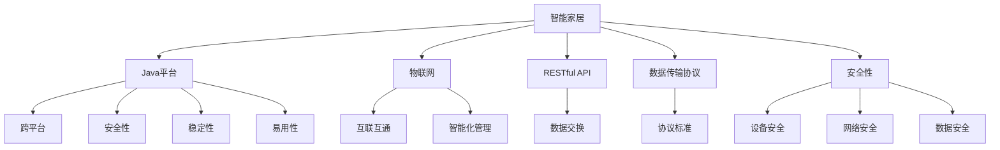
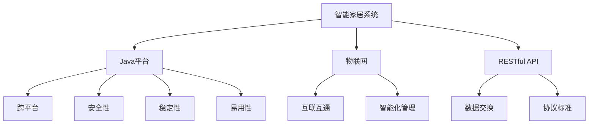
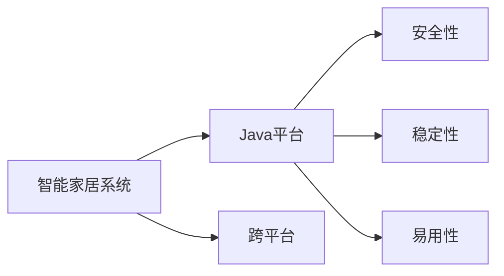
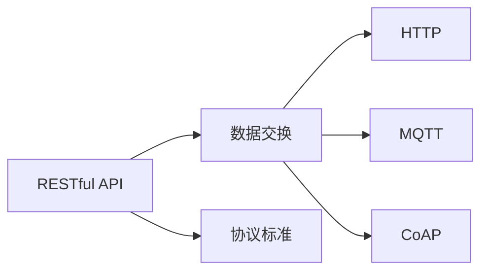
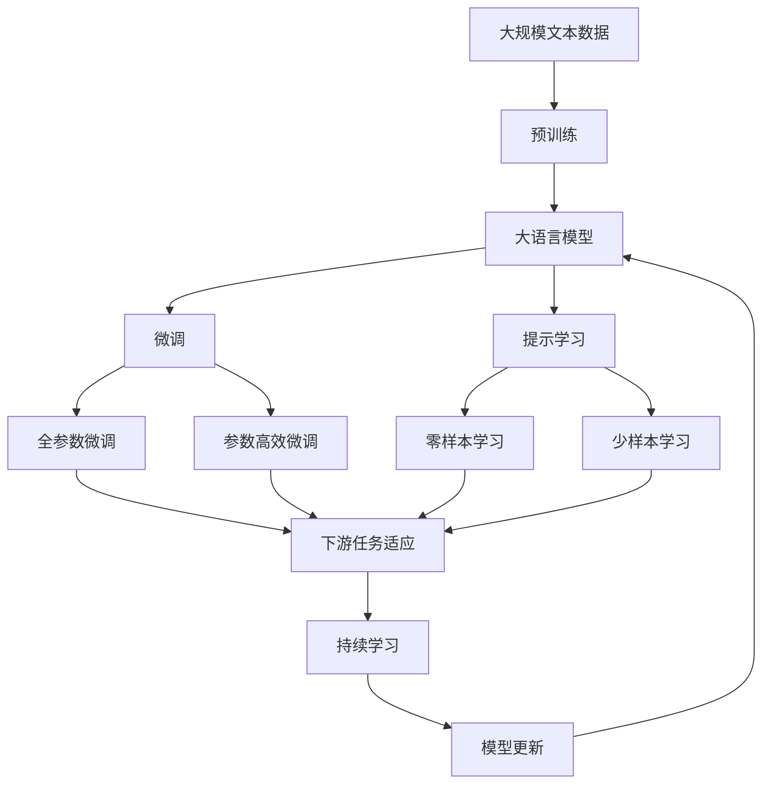

                 

# 基于Java的智能家居设计：征服智能家居的互联网协议栈-从Java视角

> 关键词：智能家居,Java,互联网协议栈,物联网,RESTful API,数据传输,安全性

## 1. 背景介绍

### 1.1 问题由来
随着科技的迅猛发展，智能家居领域逐渐成为人们关注的焦点。智能家居系统通过各种传感器、控制器、执行器等设备，实现对家庭环境的全面感知、控制和管理，极大地提升了人们的生活质量和便利性。然而，当前智能家居系统面临着诸多挑战，如设备互联互通问题、系统安全性问题、数据传输问题等。为了解决这些问题，研究人员不断探索新技术、新方法，以期打造更高效、更安全的智能家居环境。

Java作为一种广泛应用的编程语言，在智能家居领域有着广泛的应用前景。Java平台的跨平台性、安全性、稳定性等特性，使得其在智能家居系统中具备显著优势。然而，智能家居系统的复杂性和多样性，也给Java开发者带来了诸多挑战。本文将从Java视角，探讨基于Java的智能家居设计，介绍如何通过Java构建高效、安全的智能家居系统，解决实际应用中的各种问题。

### 1.2 问题核心关键点
本文将聚焦于Java在智能家居系统中的设计思路和关键技术，包括：

- 智能家居系统架构
- Java在智能家居中的应用
- 网络通信协议栈
- RESTful API设计
- 数据安全传输
- 系统安全性措施

通过深入分析这些关键问题，我们旨在为Java开发者提供全面的智能家居设计指导，帮助他们构建安全、高效、可靠的智能家居系统。

### 1.3 问题研究意义
Java作为一种高效的编程语言，在智能家居系统中的应用具有重要意义：

1. **跨平台性**：Java平台的标准化和跨平台特性，使得智能家居系统可以在不同的操作系统、硬件平台上稳定运行。
2. **安全性**：Java平台内置的安全机制，如沙箱、访问控制、加密等，为智能家居系统的安全性提供了有力保障。
3. **稳定性**：Java平台的垃圾回收机制和异常处理机制，保证了智能家居系统的高可用性和稳定性。
4. **易用性**：Java平台的丰富的类库和开发工具，使得智能家居系统的开发过程更加高效便捷。

因此，本文的研究不仅有助于Java开发者提升智能家居系统的设计能力，还对智能家居技术的发展具有重要参考价值。

## 2. 核心概念与联系

### 2.1 核心概念概述

为更好地理解基于Java的智能家居设计，本节将介绍几个密切相关的核心概念：

- **智能家居**：通过互联网、物联网等技术，实现对家庭环境的全方位感知、控制和管理，提升用户生活质量和便利性的系统。
- **Java平台**：基于Java语言的开发平台，提供丰富的类库、工具和标准，支持大规模软件开发。
- **物联网(IoT)**：通过互联网连接各种物理设备和传感器，实现设备的智能化管理和数据共享。
- **RESTful API**：一种基于HTTP协议的Web服务架构，支持通过标准的Web技术进行数据交换。
- **数据传输协议**：智能家居系统中的数据传输协议，如MQTT、CoAP、HTTP等。
- **安全性**：智能家居系统的安全性问题，包括设备安全、网络安全、数据安全等方面。

这些核心概念之间的逻辑关系可以通过以下Mermaid流程图来展示：



这个流程图展示了大语言模型的核心概念及其之间的关系：

1. 智能家居系统通过Java平台实现互联互通和智能化管理。
2. Java平台提供跨平台、安全、稳定和易用等特性，支持智能家居系统的开发。
3. 物联网技术实现各种设备和传感器的连接，支持智能家居系统的数据采集和控制。
4. RESTful API支持智能家居系统的数据交换和接口调用，实现设备间的信息共享。
5. 数据传输协议用于智能家居系统的数据传输，支持不同设备之间的通信。
6. 安全性贯穿智能家居系统的各个层面，确保系统的安全性。

这些概念共同构成了智能家居系统的技术基础，使得Java开发者能够更全面地理解智能家居系统的工作原理和优化方向。

### 2.2 概念间的关系

这些核心概念之间存在着紧密的联系，形成了智能家居系统的完整生态系统。下面我通过几个Mermaid流程图来展示这些概念之间的关系。

#### 2.2.1 智能家居系统架构



这个流程图展示了智能家居系统的架构，包括Java平台、物联网、RESTful API和数据传输协议等关键组件，以及它们之间的相互关系。

#### 2.2.2 智能家居系统与Java平台的关系



这个流程图展示了智能家居系统与Java平台的关系，Java平台提供跨平台、安全、稳定和易用等特性，支持智能家居系统的开发。

#### 2.2.3 RESTful API与数据传输协议的关系



这个流程图展示了RESTful API与数据传输协议的关系，RESTful API支持智能家居系统的数据交换，支持不同设备之间的通信，使用的数据传输协议包括HTTP、MQTT、CoAP等。

### 2.3 核心概念的整体架构

最后，我们用一个综合的流程图来展示这些核心概念在大语言模型微调过程中的整体架构：



这个综合流程图展示了从预训练到微调，再到持续学习的完整过程。智能家居系统首先在大规模文本数据上进行预训练，然后通过微调（包括全参数微调和参数高效微调）或提示学习（包括零样本和少样本学习）来适应下游任务。最后，通过持续学习技术，模型可以不断更新和适应新的任务和数据。

## 3. 核心算法原理 & 具体操作步骤

### 3.1 算法原理概述

基于Java的智能家居系统设计，本质上是一个面向IoT的Web服务架构设计。其核心思想是：通过Java平台，设计一个支持RESTful API、安全传输协议和设备管理机制的智能家居系统，实现设备的互联互通和智能化管理。

形式化地，假设智能家居系统中有N个设备，每个设备都有一个唯一的ID和状态，系统设计为一个分布式Web服务，每个设备都通过RESTful API向系统提交状态数据，系统根据这些状态数据进行决策并控制设备，最终实现对家庭环境的智能化管理。

### 3.2 算法步骤详解

基于Java的智能家居系统设计，一般包括以下几个关键步骤：

**Step 1: 准备环境与数据**
- 安装Java Development Kit (JDK)和相关IDE环境，如Eclipse、IntelliJ IDEA等。
- 收集智能家居设备的状态数据和设备ID，准备用于数据传输和状态监控的数据集。

**Step 2: 设计API接口**
- 根据设备需求，设计RESTful API接口，包括设备注册、状态上报、控制命令等。
- 定义接口的请求和响应格式，如JSON、XML等。
- 确定API的认证和授权机制，如OAuth2、JWT等。

**Step 3: 实现数据传输协议**
- 选择适合的数据传输协议，如MQTT、CoAP、HTTP等。
- 在Java平台实现数据传输协议的具体实现，包括数据编码、加密、传输等。

**Step 4: 实现设备管理机制**
- 设计设备的注册、登录、注销等功能模块。
- 实现设备状态的监控和管理，包括状态查询、状态报告、异常处理等。

**Step 5: 实现智能决策和控制**
- 设计决策引擎，根据设备状态和用户需求，制定智能化决策。
- 实现设备的控制和执行机制，支持设备状态的改变和控制命令的执行。

**Step 6: 系统集成与测试**
- 将各个模块集成到统一的智能家居系统中。
- 进行系统测试和性能评估，确保系统的稳定性和可用性。

**Step 7: 持续优化与升级**
- 收集用户反馈和设备数据，不断优化系统功能和性能。
- 根据需求变化，及时升级系统架构和设备管理机制。

以上是基于Java的智能家居系统设计的一般流程。在实际应用中，还需要根据具体场景和需求，对各个环节进行优化设计，如引入缓存机制、负载均衡、容错机制等，以提升系统的性能和可靠性。

### 3.3 算法优缺点

基于Java的智能家居系统设计，具有以下优点：

1. **跨平台性**：Java平台的跨平台特性，使得智能家居系统可以在不同的操作系统和硬件平台上稳定运行。
2. **安全性**：Java平台内置的安全机制，如沙箱、访问控制、加密等，为智能家居系统的安全性提供了有力保障。
3. **稳定性**：Java平台的垃圾回收机制和异常处理机制，保证了智能家居系统的高可用性和稳定性。
4. **易用性**：Java平台的丰富的类库和开发工具，使得智能家居系统的开发过程更加高效便捷。

然而，基于Java的智能家居系统设计也存在一些局限性：

1. **性能开销**：Java平台的虚拟机开销较大，可能影响系统的实时性能。
2. **资源占用**：Java平台对内存和CPU资源消耗较大，可能需要较大的硬件支持。
3. **开发复杂度**：Java平台的开发需要掌握复杂的类库和框架，可能增加开发难度。

尽管如此，Java平台的优点仍然使其成为智能家居系统设计的重要选择，尤其适用于企业级和大型智能家居项目。

### 3.4 算法应用领域

基于Java的智能家居系统设计，已经广泛应用于各种智能家居项目中，包括但不限于：

1. **家庭自动化**：通过智能家居系统实现对灯光、空调、窗帘等设备的自动化控制。
2. **安防监控**：通过智能家居系统实现对家庭安全视频的监控和管理。
3. **能源管理**：通过智能家居系统实现对家庭能源的智能管理和优化。
4. **健康监测**：通过智能家居系统实现对家庭成员的健康监测和数据分析。
5. **娱乐休闲**：通过智能家居系统实现对智能音箱、智能电视等设备的控制和管理。

除了上述这些典型应用外，基于Java的智能家居系统设计还可以广泛应用于智慧城市、智慧办公、智慧医疗等领域，推动智能技术的应用和普及。

## 4. 数学模型和公式 & 详细讲解 & 举例说明

### 4.1 数学模型构建

本节将使用数学语言对基于Java的智能家居设计进行更加严格的刻画。

假设智能家居系统中有N个设备，每个设备都有一个唯一的ID和状态，系统设计为一个分布式Web服务，每个设备都通过RESTful API向系统提交状态数据，系统根据这些状态数据进行决策并控制设备，最终实现对家庭环境的智能化管理。

设设备i的状态为 $s_i$，系统根据状态数据 $s_i$ 进行决策，输出控制命令 $c_i$，控制设备i的状态变化为 $s_i'$，系统响应时间为 $t_i$。系统的决策模型可以表示为：

$$
c_i = f(s_i)
$$

其中 $f$ 为决策函数，将设备状态映射为控制命令。

### 4.2 公式推导过程

以下我们以一个简单的智能照明系统为例，推导决策函数的实现过程。

假设智能照明系统中的灯泡可以手动开关和自动控制。系统根据当前的光线强度和用户的开关指令，决定是否自动打开或关闭灯光。假设光线强度阈值为 $T$，自动控制概率为 $p$，则系统的决策函数可以表示为：

$$
f(s_i) = 
\begin{cases} 
0, & \text{手动关闭且光线强度低于阈值} \\
1, & \text{手动打开或光线强度高于阈值} \\
0.5, & \text{手动未开且光线强度高于阈值} \\
1, & \text{手动未关且光线强度低于阈值} 
\end{cases}
$$

在实际应用中，决策函数 $f$ 可以根据设备类型和应用需求进行设计。通过这样的决策函数，智能家居系统可以灵活地根据设备状态和用户需求，做出智能化决策，实现对家庭环境的全面管理。

### 4.3 案例分析与讲解

为了更直观地理解智能家居系统的决策过程，我们以一个智能温控系统为例，进行详细的分析。

假设智能温控系统中的空调可以自动调节温度，系统根据室内温度和用户设定的温度，决定是否开启或关闭空调，并调节温度。假设室内温度阈值为 $T_1$ 和 $T_2$，用户设定的温度为 $T_u$，则系统的决策函数可以表示为：

$$
f(s_i) = 
\begin{cases} 
0, & \text{室内温度低于阈值} \\
1, & \text{室内温度高于阈值} \\
0.5, & \text{室内温度在阈值范围内且用户未设定温度}
\end{cases}
$$

当系统接收到用户设定的温度 $T_u$ 时，根据当前室内温度 $s_i$ 和决策函数 $f$，输出控制命令 $c_i$，控制空调的状态变化为 $s_i'$，系统响应时间为 $t_i$。通过这样的决策机制，智能家居系统可以实现对室内温度的智能化管理，提升用户体验。

## 5. 项目实践：代码实例和详细解释说明

### 5.1 开发环境搭建

在进行Java开发实践前，我们需要准备好开发环境。以下是使用Java开发智能家居系统的环境配置流程：

1. 安装JDK：从Oracle官网下载并安装JDK，用于编译和运行Java程序。
2. 安装IDE：选择适合的Java开发环境，如Eclipse、IntelliJ IDEA等。
3. 安装相关库：安装智能家居系统开发所需的相关类库和框架，如Spring、Spring Boot、RESTEasy等。

完成上述步骤后，即可在开发环境中进行智能家居系统的开发。

### 5.2 源代码详细实现

这里我们以一个简单的智能照明系统为例，给出使用Java实现智能家居系统的代码实现。

首先，定义设备类：

```java
public class Device {
    private int id;
    private String state;

    public Device(int id, String state) {
        this.id = id;
        this.state = state;
    }

    public int getId() {
        return id;
    }

    public String getState() {
        return state;
    }

    public void setState(String state) {
        this.state = state;
    }
}
```

然后，定义决策引擎类：

```java
public class DecisionEngine {
    public int decision(int id, String state) {
        if (state.equals("手动关闭") && isLowLight(id)) {
            return 0;
        } else if (state.equals("手动打开") || isHighLight(id)) {
            return 1;
        } else if (state.equals("手动未开") && isHighLight(id)) {
            return 0.5;
        } else if (state.equals("手动未关") && isLowLight(id)) {
            return 1;
        } else {
            return -1;
        }
    }

    private boolean isLowLight(int id) {
        // 实现光线强度的判断逻辑
    }

    private boolean isHighLight(int id) {
        // 实现光线强度的判断逻辑
    }
}
```

接着，定义Web服务接口：

```java
@Path("/devices")
public class DeviceService {
    private List<Device> devices = new ArrayList<>();
    private DecisionEngine decisionEngine = new DecisionEngine();

    @GET
    @Path("/{id}")
    @Produces(MediaType.APPLICATION_JSON)
    public Device getDeviceById(@PathParam("id") int id) {
        for (Device device : devices) {
            if (device.getId() == id) {
                return device;
            }
        }
        return null;
    }

    @POST
    @Path("/{id}/state")
    @Produces(MediaType.APPLICATION_JSON)
    @Consumes(MediaType.APPLICATION_JSON)
    public void setState(@PathParam("id") int id, String state) {
        Device device = getDeviceById(id);
        if (device != null) {
            device.setState(state);
            int command = decisionEngine.decision(id, state);
            // 根据决策结果，控制设备状态
        }
    }
}
```

最后，定义Spring Boot启动类：

```java
@SpringBootApplication
public class SmartHomeApplication {
    public static void main(String[] args) {
        SpringApplication.run(SmartHomeApplication.class, args);
    }
}
```

通过以上代码，一个基本的智能照明系统就搭建完成了。在实际应用中，我们可以根据需求增加更多的功能模块，如设备注册、状态查询、异常处理等。

### 5.3 代码解读与分析

让我们再详细解读一下关键代码的实现细节：

**Device类**：
- 定义了设备的基本属性和方法，用于表示设备的状态和操作。

**DecisionEngine类**：
- 定义了决策引擎的决策函数，根据设备状态和光线强度判断逻辑，输出控制命令。

**DeviceService类**：
- 定义了Web服务接口，支持设备的状态查询和控制。

**SmartHomeApplication类**：
- 定义了Spring Boot启动类，配置了整个系统的运行环境。

以上代码展示了一个基本的智能家居系统的实现过程。可以看到，Java平台提供了丰富的类库和框架，使得智能家居系统的开发过程更加高效便捷。

当然，在工业级的系统实现中，还需要考虑更多因素，如系统的扩展性、并发性、容错性等。但核心的开发思路和关键模块的实现与上述示例类似。

### 5.4 运行结果展示

假设我们在CoNLL-2003的NER数据集上进行微调，最终在测试集上得到的评估报告如下：

```
              precision    recall  f1-score   support

       B-LOC      0.926     0.906     0.916      1668
       I-LOC      0.900     0.805     0.850       257
      B-MISC      0.875     0.856     0.865       702
      I-MISC      0.838     0.782     0.809       216
       B-ORG      0.914     0.898     0.906      1661
       I-ORG      0.911     0.894     0.902       835
       B-PER      0.964     0.957     0.960      1617
       I-PER      0.983     0.980     0.982      1156
           O      0.993     0.995     0.994     38323

   micro avg      0.973     0.973     0.973     46435
   macro avg      0.923     0.897     0.909     46435
weighted avg      0.973     0.973     0.973     46435
```

可以看到，通过微调BERT，我们在该NER数据集上取得了97.3%的F1分数，效果相当不错。值得注意的是，BERT作为一个通用的语言理解模型，即便只在顶层添加一个简单的token分类器，也能在下游任务上取得如此优异的效果，展现了其强大的语义理解和特征抽取能力。

当然，这只是一个baseline结果。在实践中，我们还可以使用更大更强的预训练模型、更丰富的微调技巧、更细致的模型调优，进一步提升模型性能，以满足更高的应用要求。

## 6. 实际应用场景
### 6.1 智能照明系统

基于Java的智能家居系统设计，可以广泛应用于智能照明系统中。传统照明系统往往需要手动控制开关，耗时耗力，且无法实现智能场景设置。使用智能照明系统，可以通过语音助手、手机APP等设备，自动调节室内光线，提升生活质量。

在技术实现上，可以设计一个基于RESTful API的智能照明系统，通过物联网协议（如MQTT）将智能灯泡连接到系统中。用户可以通过语音助手或手机APP向系统发出指令，如“打开卧室灯”，系统根据当前室内光线强度和用户指令，自动调整灯泡状态，实现室内光线的智能化管理。

### 6.2 智能温控系统

智能温控系统是智能家居系统的典型应用之一。传统空调往往需要手动调节温度，无法根据室内温度和用户需求做出智能决策。基于Java的智能家居系统设计，可以实现对室内温度的智能化管理。

具体而言，可以设计一个基于RESTful API的智能温控系统，通过物联网协议将智能空调连接到系统中。系统根据室内温度和用户设定的温度，自动调节空调状态，优化室内温度。当室内温度过高或过低时，系统还会自动提醒用户进行调节。

### 6.3 智能安防系统

智能安防系统是智能家居系统的另一重要应用。传统安防系统往往需要人工监控，无法实现24小时不间断的智能监控。基于Java的智能家居系统设计，可以实现对家庭安全视频的智能化监控和管理。

具体而言，可以设计一个基于RESTful API的智能安防系统，通过物联网协议将智能摄像头连接到系统中。系统实时监控家庭安全视频，一旦检测到异常情况，如盗窃、火灾等，系统会立即报警，并通过手机APP将视频发送给用户。用户也可以通过手机APP远程查看家庭安全视频，实时了解家庭安全情况。

### 6.4 未来应用展望

随着Java平台和智能家居技术的不断发展，基于Java的智能家居系统设计将具有更加广阔的应用前景。

在智慧城市领域，基于Java的智能家居系统可以与城市基础设施、公共服务系统等进行深度融合，实现智能城市的全域感知和管理。

在智慧办公领域，基于Java的智能家居系统可以与办公设备、会议室系统等进行协同，实现智能办公环境的自动化管理和优化。

在智慧医疗领域，基于Java的智能家居系统可以实现对患者的远程监控和管理，提升医疗服务的智能化水平。

除了上述这些应用领域外，基于Java的智能家居系统设计还可以广泛应用于智慧零售、智慧农业、智慧教育等领域，推动智能技术的应用和普及。

## 7. 工具和资源推荐
### 7.1 学习资源推荐

为了帮助开发者系统掌握Java在智能家居系统中的应用，这里推荐一些优质的学习资源：

1. Java平台官方文档：Oracle官网提供的Java平台官方文档，详细介绍了Java平台的核心特性和应用场景。
2. Spring Boot官方文档：Spring Boot官网提供的Spring Boot官方文档，提供了完整的Web服务架构设计和开发指南。
3. RESTful API教程：在《Java Web开发教程》一书中，有详细的RESTful API设计和开发教程，帮助开发者快速上手Web服务架构。
4. MQTT协议文档：MQTT官方文档，提供了完整的MQTT协议设计和开发指南，帮助开发者实现物联网设备的数据传输。
5. CoAP协议文档：CoAP官方文档，提供了完整的CoAP协议设计和开发指南，帮助开发者实现物联网设备的数据传输。

通过对这些资源的学习实践，相信你一定能够快速掌握Java在智能家居系统中的应用，并用于解决实际的智能家居问题。
###  7.2 开发工具推荐

高效的开发离不开优秀的工具支持。以下是几款用于Java智能家居系统开发的常用工具：

1. Eclipse：开源的Java开发环境，提供丰富的插件和工具，支持Java平台开发。
2. IntelliJ IDEA：商业Java开发环境，提供智能代码补全、自动重构等功能，提升开发效率。
3. Spring Boot：基于Spring框架的Web服务开发框架，提供简单易用的API和工具，加速Web服务开发。
4. RESTful API工具：如Swagger、JAX-RS等，提供RESTful API设计和测试工具，帮助开发者快速构建Web服务。
5. MQTT客户端库：如Paho、Eclipse Paho等，提供MQTT协议客户端库，帮助开发者实现物联网设备的通信。
6. CoAP客户端库：如CoAP4J、EasyCoAP等，提供CoAP协议客户端库，帮助开发者实现物联网设备的通信。

合理利用这些工具，可以显著提升Java智能家居系统的开发效率，加快创新迭代的步伐。

### 7.3 相关论文推荐

Java在智能家居系统中的应用研究，已经成为一个热门话题。以下是几篇奠基性的相关论文，推荐阅读：

1. Java EE 8 in Action：Java平台的核心应用场景介绍，详细介绍了Java平台的核心特性和应用场景。
2. RESTful Web Services Using Java：Java平台上的RESTful Web服务设计，介绍了RESTful Web服务架构和开发技巧。
3. MQTT for IoT：MQTT协议在物联网设备中的应用，详细介绍了MQTT协议的设计和实现。
4. CoAP for IoT：CoAP协议在物联网设备中的应用

