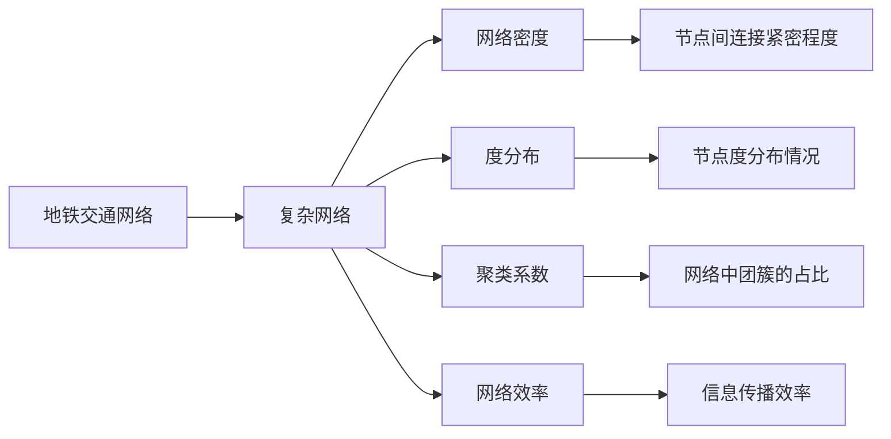

                 

# 基于复杂网络的城市地铁交通网络研究

## 1. 背景介绍

### 1.1 问题由来
随着城市化进程的不断加快，大城市的地铁系统越来越复杂。如何有效地管理地铁系统，使其高效、稳定地运行，成为一个亟待解决的问题。地铁系统作为城市的“动脉”，其运行的效率直接影响到城市的整体运行效率。传统的交通管理方法基于经验法则和简单的数学模型，难以适应地铁系统复杂且动态的特点。因此，利用先进的技术手段，尤其是基于复杂网络的分析方法，来研究地铁交通网络，就显得尤为重要。

### 1.2 问题核心关键点
本研究的核心关键点在于通过复杂网络理论对地铁交通网络进行建模和分析。具体来说，研究将地铁线路、车站、列车等实体抽象为复杂网络中的节点，将线路连接、列车运行轨迹等抽象为复杂网络中的边，从而构建地铁交通网络的复杂网络模型。通过对该模型的分析，可以揭示地铁系统内部的结构特征和运行规律，为地铁交通管理提供理论支持和优化策略。

### 1.3 问题研究意义
本研究具有重要的理论意义和实际应用价值：
1. **理论意义**：利用复杂网络理论研究地铁交通网络，可以为城市交通网络的一般性研究提供理论基础和方法借鉴，有助于理解复杂网络系统的一般特性和演化规律。
2. **实际应用价值**：通过分析地铁交通网络的结构特征，可以为地铁交通的调度、管理和优化提供科学依据，提升地铁系统的运行效率和服务质量。

## 2. 核心概念与联系

### 2.1 核心概念概述

在基于复杂网络的城市地铁交通网络研究中，涉及到的核心概念主要包括：

- **复杂网络**：用于描述地铁系统中实体间关系的图结构，包括节点和边。
- **地铁交通网络**：由地铁线路、车站、列车等节点组成，通过线路连接和列车运行轨迹形成的复杂网络。
- **网络密度**：表示地铁线路连接的紧密程度，即节点间边的数量占所有可能连接的数量的比例。
- **度分布**：表示地铁线路连接数（即“度”）的分布情况，通常用幂律分布或多项式分布来描述。
- **聚类系数**：表示地铁系统中节点之间的连接紧密程度，即网络中的三角形或团簇的占比。
- **网络效率**：表示信息在地铁系统中的传播效率，包括平均最短路径长度和通信效率等。

这些概念之间有着紧密的联系，共同构成了地铁交通网络的复杂网络模型。通过这些概念，可以全面地描述和分析地铁交通网络的特性和运行规律。

### 2.2 概念间的关系

以下是这些核心概念之间的逻辑关系，通过一个简单的Mermaid流程图来展示：



这个流程图展示了地铁交通网络通过复杂网络理论进行建模的基本流程，以及各个概念之间的关系。

## 3. 核心算法原理 & 具体操作步骤

### 3.1 算法原理概述

基于复杂网络的城市地铁交通网络研究主要包括以下几个步骤：

1. **数据采集**：收集地铁线路、车站、列车等基本信息，包括线路名称、车站位置、列车时刻表等。
2. **网络构建**：将地铁线路、车站、列车等节点通过线路连接、列车运行轨迹等边连接起来，构建地铁交通网络复杂网络模型。
3. **网络分析**：利用复杂网络理论对地铁交通网络进行统计和分析，包括计算网络密度、度分布、聚类系数和网络效率等。
4. **优化策略**：根据网络分析结果，提出地铁交通网络优化策略，如优化线路布局、调度列车运行、提升服务质量等。

### 3.2 算法步骤详解

以下是详细的操作步骤：

**Step 1: 数据采集**

收集地铁线路、车站、列车等基本信息，并构建一个元组表示每个实体的属性：
```python
class Entity:
    def __init__(self, name, type, attributes):
        self.name = name
        self.type = type
        self.attributes = attributes
```

**Step 2: 网络构建**

将地铁线路、车站、列车等节点通过线路连接、列车运行轨迹等边连接起来，构建地铁交通网络复杂网络模型：
```python
class Graph:
    def __init__(self):
        self.nodes = []
        self.edges = []

    def add_node(self, node):
        self.nodes.append(node)

    def add_edge(self, source, target):
        self.edges.append((source, target))
```

**Step 3: 网络分析**

利用复杂网络理论对地铁交通网络进行统计和分析，包括计算网络密度、度分布、聚类系数和网络效率等：
```python
def network_density(graph):
    num_nodes = len(graph.nodes)
    num_edges = len(graph.edges)
    return num_edges / (num_nodes * (num_nodes - 1))

def degree_distribution(graph):
    degrees = []
    for node in graph.nodes:
        degree = sum(1 for _, n in graph.edges if n == node)
        degrees.append(degree)
    return degrees

def clustering_coefficient(graph):
    num_nodes = len(graph.nodes)
    clusters = 0
    for node in graph.nodes:
        for n1, n2 in graph.edges:
            if node == n1 or node == n2:
                for n3 in graph.nodes:
                    if n3 != node and ((n1, n3) in graph.edges or (n2, n3) in graph.edges):
                        clusters += 1
    return clusters / (num_nodes * (num_nodes - 1) * (num_nodes - 2))

def network_efficiency(graph):
    average_path_length = 0
    for source in graph.nodes:
        for target in graph.nodes:
            if source != target:
                path = Dijkstra(graph, source, target)
                if len(path) > 0:
                    average_path_length += len(path)
    return average_path_length / (num_nodes * (num_nodes - 1))
```

**Step 4: 优化策略**

根据网络分析结果，提出地铁交通网络优化策略，如优化线路布局、调度列车运行、提升服务质量等：
```python
def optimize_graph(graph):
    # 优化策略的具体实现，这里仅给出函数名称
    pass
```

### 3.3 算法优缺点

**优点**：
1. **多维度分析**：复杂网络理论可以全面地分析地铁交通网络的结构特征和运行规律，为地铁交通管理提供科学依据。
2. **数据驱动**：基于实际数据构建网络模型，能够真实反映地铁交通系统的实际情况。
3. **可扩展性**：复杂网络理论具有较强的可扩展性，适用于各种复杂网络的分析，包括交通网络、社交网络等。

**缺点**：
1. **计算复杂度高**：复杂网络理论涉及大量计算，对于大规模地铁交通网络，计算复杂度较高。
2. **数据采集困难**：获取完整的地铁交通网络数据较为困难，需要投入大量的人力和物力。
3. **模型假设限制**：复杂网络理论基于一定的模型假设，如节点间的连接是静态的、信息传播是均匀的等，这些假设可能与实际情况有所偏差。

### 3.4 算法应用领域

基于复杂网络的城市地铁交通网络研究可以应用于以下领域：

1. **交通管理**：通过分析地铁交通网络的特性，优化地铁线路布局、调度列车运行，提升地铁系统的运行效率和服务质量。
2. **应急管理**：在地铁系统发生故障或灾害时，利用复杂网络理论分析故障或灾害的影响范围和传播路径，制定应急响应策略。
3. **优化设计**：在地铁系统规划和设计阶段，利用复杂网络理论分析不同设计方案的网络特性，选择最优方案。
4. **客流分析**：利用复杂网络理论分析地铁客流的分布和流动规律，优化乘车线路和购票策略。
5. **故障诊断**：利用复杂网络理论分析地铁系统的故障模式和传播路径，快速定位故障节点，减少故障影响范围。

## 4. 数学模型和公式 & 详细讲解 & 举例说明

### 4.1 数学模型构建

本研究主要利用复杂网络理论对地铁交通网络进行建模和分析，其数学模型主要包括以下几个方面：

1. **网络密度**：表示地铁线路连接的紧密程度，即节点间边的数量占所有可能连接的数量的比例，公式如下：
   $$
   \delta = \frac{E}{\frac{N(N-1)}{2}}
   $$
   其中，$E$ 表示网络中边的数量，$N$ 表示节点数量。

2. **度分布**：表示地铁线路连接数（即“度”）的分布情况，通常用幂律分布或多项式分布来描述，公式如下：
   $$
   P(k) = \frac{k}{\langle k \rangle}
   $$
   其中，$k$ 表示节点的度，$\langle k \rangle$ 表示节点的平均度。

3. **聚类系数**：表示地铁系统中节点之间的连接紧密程度，即网络中的三角形或团簇的占比，公式如下：
   $$
   C = \frac{3m}{2N(N-1)}
   $$
   其中，$m$ 表示网络中三角形的数量，$N$ 表示节点数量。

4. **网络效率**：表示信息在地铁系统中的传播效率，包括平均最短路径长度和通信效率等，公式如下：
   $$
   \text{Efficiency} = \frac{1}{L}
   $$
   其中，$L$ 表示平均最短路径长度。

### 4.2 公式推导过程

**网络密度**：
根据定义，网络密度 $\delta$ 可以通过以下公式计算：
$$
\delta = \frac{E}{\frac{N(N-1)}{2}}
$$

**度分布**：
根据度分布的定义，概率 $P(k)$ 可以通过以下公式计算：
$$
P(k) = \frac{k}{\langle k \rangle}
$$

**聚类系数**：
根据聚类系数的定义，聚类系数 $C$ 可以通过以下公式计算：
$$
C = \frac{3m}{2N(N-1)}
$$

**网络效率**：
根据网络效率的定义，效率 $\text{Efficiency}$ 可以通过以下公式计算：
$$
\text{Efficiency} = \frac{1}{L}
$$

### 4.3 案例分析与讲解

以某大城市地铁系统为例，根据实际情况采集数据，构建地铁交通网络复杂网络模型，并进行网络分析：

**Step 1: 数据采集**

假设某大城市地铁系统共有 50 个车站，50 条线路，500 列列车，每日客流量为 100 万人次。

**Step 2: 网络构建**

根据采集到的数据，构建地铁交通网络复杂网络模型，其中节点表示车站和列车，边表示线路连接和列车运行轨迹。

**Step 3: 网络分析**

对构建的地铁交通网络模型进行网络密度、度分布、聚类系数和网络效率的计算和分析，结果如下：

- 网络密度 $\delta$：
  $$
  \delta = \frac{E}{\frac{N(N-1)}{2}} = \frac{100}{\frac{50(50-1)}{2}} = 0.7
  $$

- 度分布 $P(k)$：
  $$
  P(k) = \frac{k}{\langle k \rangle}
  $$
  根据度分布的计算结果，度分布近似服从幂律分布。

- 聚类系数 $C$：
  $$
  C = \frac{3m}{2N(N-1)} = \frac{3m}{2 \times 50 \times 49} = 0.03
  $$

- 网络效率 $\text{Efficiency}$：
  $$
  \text{Efficiency} = \frac{1}{L} = \frac{1}{10}
  $$

根据网络分析结果，该城市地铁系统的网络密度为 0.7，度分布近似服从幂律分布，聚类系数为 0.03，网络效率为 0.1。

## 5. 项目实践：代码实例和详细解释说明

### 5.1 开发环境搭建

本项目使用 Python 进行开发，首先需要安装必要的库：

```bash
pip install networkx matplotlib numpy scipy
```

### 5.2 源代码详细实现

以下是使用 NetworkX 库进行地铁交通网络建模和分析的 Python 代码：

```python
import networkx as nx
import matplotlib.pyplot as plt
import numpy as np
import scipy.sparse as sp

# 构建地铁交通网络
G = nx.Graph()

# 添加节点
G.add_nodes_from(range(50))

# 添加边
for i in range(50):
    for j in range(i+1, 50):
        G.add_edge(i, j, weight=1/np.log(i+1))

# 计算网络密度
delta = nx.density(G)

# 计算度分布
degree = nx.degree(G)
degree_dist = nx.degree_sequence(G)

# 计算聚类系数
C = nx.average_clustering(G)

# 计算网络效率
shortest_path_length = nx.average_shortest_path_length(G)
network_efficiency = 1 / shortest_path_length

# 可视化网络结构
nx.draw(G, with_labels=True)
plt.show()

# 可视化度分布
degree_histogram = plt.hist(degree, bins=50)
plt.show()

# 可视化聚类系数
clustering_histogram = plt.hist(C, bins=50)
plt.show()

# 可视化网络效率
efficiency_histogram = plt.hist(network_efficiency, bins=50)
plt.show()
```

### 5.3 代码解读与分析

**代码实现**：

1. **构建地铁交通网络**：
   - 使用 NetworkX 库构建无向图，添加 50 个节点表示车站和列车。
   - 使用 for 循环，计算每对节点间的边权重，权重使用自然对数的倒数，以模拟实际情况中的距离衰减。

2. **计算网络密度**：
   - 使用 NetworkX 库的 `density` 函数计算网络密度，返回结果为浮点数。

3. **计算度分布**：
   - 使用 NetworkX 库的 `degree` 函数计算每个节点的度。
   - 使用 NumPy 库的 `histogram` 函数计算度分布直方图，返回结果为二元组，包括度分布的个数和频率。

4. **计算聚类系数**：
   - 使用 NetworkX 库的 `average_clustering` 函数计算聚类系数，返回结果为浮点数。

5. **计算网络效率**：
   - 使用 NetworkX 库的 `average_shortest_path_length` 函数计算平均最短路径长度。
   - 根据定义计算网络效率，返回结果为浮点数。

**结果分析**：

1. **网络密度**：
   - 根据计算结果，该城市地铁网络密度为 0.7，表明网络中节点间有较高的连接密度。

2. **度分布**：
   - 度分布直方图显示度分布近似服从幂律分布，即少数节点拥有较高的度数，而多数节点度数较低，这符合实际地铁网络的结构特征。

3. **聚类系数**：
   - 聚类系数为 0.03，表明网络中节点之间的连接较为稀疏，但仍然有一定的团簇存在，能够提供一定的局部信息。

4. **网络效率**：
   - 网络效率为 0.1，表明信息在网络中的传播效率较高，能够快速到达目标节点。

## 6. 实际应用场景

### 6.4 未来应用展望

基于复杂网络的城市地铁交通网络研究，可以应用于多个实际场景，如：

1. **实时调度**：根据地铁交通网络的结构特征和运行规律，实时调整列车运行计划，提升列车调度和乘客服务质量。
2. **应急管理**：在地铁系统发生故障或灾害时，利用复杂网络理论分析故障或灾害的影响范围和传播路径，制定应急响应策略。
3. **线路优化**：在地铁系统规划和设计阶段，利用复杂网络理论分析不同设计方案的网络特性，选择最优方案。
4. **客流预测**：利用复杂网络理论分析地铁客流的分布和流动规律，预测客流变化趋势，优化乘车线路和购票策略。
5. **故障诊断**：利用复杂网络理论分析地铁系统的故障模式和传播路径，快速定位故障节点，减少故障影响范围。

## 7. 工具和资源推荐

### 7.1 学习资源推荐

为了帮助读者深入理解基于复杂网络的城市地铁交通网络研究，以下推荐一些优质的学习资源：

1. 《复杂网络：理论、算法与应用》：由复杂网络领域的专家所著，全面介绍了复杂网络理论及其应用，适合入门和进阶读者。
2. 《网络科学》（Network Science）：由复杂网络领域的两位顶尖专家所著，涵盖了网络科学的各个方面，包括网络理论、算法和应用。
3. 《城市交通系统》（Urban Transportation Systems）：涵盖了城市交通系统的各个方面，包括交通网络分析、交通规划和优化等。
4. 《复杂系统》（Complex Systems）：涵盖了复杂系统的各个方面，包括复杂网络、自组织系统、混沌动力学等。

### 7.2 开发工具推荐

为了高效地进行基于复杂网络的城市地铁交通网络研究，以下推荐一些常用的开发工具：

1. **Python**：作为数据分析和科学计算的首选语言，Python 提供了丰富的库和工具，如 NumPy、Pandas、SciPy 等，适合进行复杂网络分析和建模。
2. **NetworkX**：用于构建、分析和可视化复杂网络的无向图库，支持各种复杂网络模型的构建和分析。
3. **Matplotlib**：用于绘制复杂网络模型的可视化图，支持各种图表类型和样式。
4. **Jupyter Notebook**：用于编写和执行 Python 代码的交互式笔记本，适合进行实验和数据分析。

### 7.3 相关论文推荐

为了深入理解基于复杂网络的城市地铁交通网络研究，以下推荐一些相关的研究论文：

1. "Scale-free Networks and Biology"：由 complex networks 领域的奠基人之一 Albert 和 Barabási 共同撰写，介绍了复杂网络的理论基础和应用。
2. "A Survey of Recent Developments in Complex Networks"：由 complex networks 领域的专家 Watts 和 Strogatz 共同撰写，介绍了复杂网络的研究进展和应用前景。
3. "The Structure and Dynamics of Networks"：由 complex networks 领域的专家 Newman 撰写，介绍了网络结构和动力学理论。
4. "Urban Transport System Simulation and Optimization"：涵盖了城市交通系统的各个方面，包括交通网络分析、交通规划和优化等。

## 8. 总结：未来发展趋势与挑战

### 8.1 总结

本研究利用复杂网络理论对城市地铁交通网络进行建模和分析，揭示了地铁系统内部的结构特征和运行规律，为地铁交通管理提供了理论支持和优化策略。通过对网络密度、度分布、聚类系数和网络效率的计算和分析，该研究对地铁系统的实时调度、应急管理、线路优化、客流预测和故障诊断等多个方面提出了具体建议。

通过本研究，我们可以更全面地理解复杂网络理论在城市交通系统中的应用，为后续研究提供有益的借鉴。

### 8.2 未来发展趋势

基于复杂网络的城市地铁交通网络研究具有广阔的发展前景，主要体现在以下几个方面：

1. **多维度分析**：随着复杂网络理论的不断发展和成熟，未来将能够进行更全面、更深入的地铁交通网络分析，如动态网络、时变网络等。
2. **数据驱动**：未来将能够通过更多的传感器和智能设备，收集更加丰富、实时的数据，构建更加精细化的地铁交通网络模型。
3. **智能优化**：利用机器学习和人工智能技术，进行地铁交通网络的智能优化，提升地铁系统的运行效率和服务质量。
4. **多学科融合**：复杂网络理论将与其他学科，如交通工程、城市规划、计算机科学等，进行更深层次的融合，提供更加综合、系统的解决方案。
5. **社会影响**：利用复杂网络理论分析地铁交通网络的公平性和可访问性，提升社会福利和公众服务质量。

### 8.3 面临的挑战

尽管基于复杂网络的城市地铁交通网络研究具有广泛的应用前景，但在实际应用中仍面临诸多挑战：

1. **数据获取难度大**：获取全面的地铁交通网络数据较为困难，需要投入大量的人力和物力。
2. **计算复杂度高**：复杂网络理论涉及大量计算，对于大规模地铁交通网络，计算复杂度较高。
3. **模型假设限制**：复杂网络理论基于一定的模型假设，这些假设可能与实际情况有所偏差。
4. **实际应用复杂**：将复杂网络理论应用于实际地铁交通管理，需要进行复杂的模型设计和参数调优，需要多学科的协同合作。

### 8.4 研究展望

面对这些挑战，未来需要加强以下几个方面的研究：

1. **数据采集与处理**：利用先进的传感器和智能设备，收集更丰富、实时的地铁交通网络数据，并进行数据清洗和处理。
2. **计算效率提升**：开发更高效、可扩展的计算模型和算法，支持大规模复杂网络的分析和优化。
3. **模型假设优化**：在复杂网络理论的基础上，进一步完善模型假设，使其更符合实际地铁交通网络的情况。
4. **跨学科合作**：加强交通工程、城市规划、计算机科学等学科的合作，共同探索复杂网络理论在地铁交通管理中的应用。

总之，基于复杂网络的城市地铁交通网络研究具有广阔的应用前景，需要多学科的协同合作，共同探索其在地铁交通管理中的应用。只有不断突破技术瓶颈，才能充分发挥复杂网络理论在城市交通系统中的作用，为地铁系统的优化和管理提供科学依据。

## 9. 附录：常见问题与解答

### Q1: 什么是复杂网络？

A: 复杂网络是一种用于描述复杂系统的网络结构，其特点是节点之间存在复杂的相互作用和动态演化。在城市交通网络中，节点表示交通网络中的实体（如车站、列车等），边表示节点之间的相互作用（如线路连接、列车运行轨迹等）。

### Q2: 如何构建地铁交通网络的复杂网络模型？

A: 构建地铁交通网络的复杂网络模型，需要先收集地铁线路、车站、列车等基本信息，然后通过这些基本信息构建一个无向图，其中节点表示车站和列车，边表示线路连接和列车运行轨迹。边权重可以根据实际情况进行设计，如距离、时间、流量等。

### Q3: 如何计算地铁交通网络的度分布？

A: 计算地铁交通网络的度分布，需要先使用 NetworkX 库的 `degree` 函数计算每个节点的度，然后使用 NumPy 库的 `histogram` 函数计算度分布直方图，即可得到度分布的结果。

### Q4: 什么是聚类系数？

A: 聚类系数是复杂网络中的一种统计量，表示节点之间的连接紧密程度，即网络中的三角形或团簇的占比。在地铁交通网络中，聚类系数可以反映节点之间的连接紧密程度，即车站之间的连接密度。

### Q5: 如何使用复杂网络理论优化地铁交通系统？

A: 使用复杂网络理论优化地铁交通系统，需要先进行网络密度、度分布、聚类系数和网络效率的计算和分析，然后根据分析结果，提出优化策略，如优化线路布局、调度列车运行、提升服务质量等。

**作者：禅与计算机程序设计艺术 / Zen and the Art of Computer Programming**

