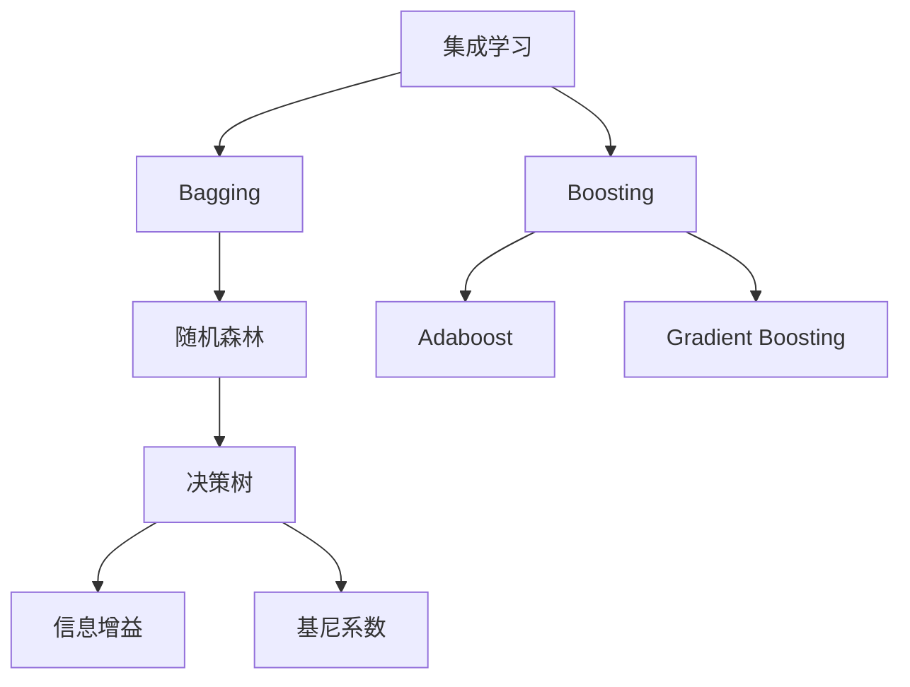

以下是根据您的要求撰写的技术博客文章《随机森林原理与代码实例讲解》:

# 随机森林原理与代码实例讲解

## 1. 背景介绍

### 1.1 问题的由来

在现实世界中,我们经常会遇到需要对未知数据进行分类或预测的情况。传统的单一决策树模型虽然简单直观,但存在过拟合的风险,且对数据的微小变化较为敏感。为了提高模型的准确性和鲁棒性,集成学习方法应运而生。

### 1.2 研究现状

随机森林(Random Forest)作为一种典型的集成学习方法,由Leo Breiman于2001年提出,并在其著作《Random Forests》一书中进行了详细阐述。随机森林通过构建多个决策树,并将它们的预测结果进行组合,从而形成一个更加强大和稳健的模型。

### 1.3 研究意义

相较于单一决策树,随机森林具有以下优势:

1. 降低过拟合风险
2. 提高模型的泛化能力
3. 增强对噪声和异常值的鲁棒性
4. 无需进行特征选择
5. 可以处理高维数据
6. 可解释性较好

由于这些优点,随机森林在许多领域得到了广泛应用,如计算机视觉、自然语言处理、生物信息学等。

### 1.4 本文结构

本文将从以下几个方面对随机森林进行全面阐述:

1. 核心概念与联系
2. 核心算法原理与具体操作步骤
3. 数学模型和公式详细讲解与案例分析
4. 项目实践:代码实例和详细解释说明
5. 实际应用场景
6. 工具和资源推荐
7. 未来发展趋势与挑战
8. 常见问题与解答

## 2. 核心概念与联系



随机森林属于集成学习(Ensemble Learning)的一种,集成学习的核心思想是通过构建并结合多个学习器来完成学习任务,以期获得比单个学习器更有效的模型。

集成学习方法主要分为两大类:Bagging(Bootstrap Aggregating,有放回的采样)和Boosting(提升方法,无放回的采样)。

- Bagging通过从原始数据集中反复有放回地抽取随机子样本,构建多个独立的模型,然后将这些模型的预测结果进行平均,以获得最终的集成模型。随机森林就是基于Bagging思想的一种集成决策树算法。

- Boosting则是通过在训练过程中不断调整训练样本的权重分布,构建一系列弱学习器,并将它们线性组合成一个强学习器。常见的Boosting算法包括AdaBoost、Gradient Boosting等。

在随机森林中,每个决策树都是通过对训练数据的随机子集进行训练而构建的。同时,在每个节点分裂时,算法会从特征的随机子集中选择最优特征进行分裂,而不是从所有特征中选择。这种随机性不仅可以减少树与树之间的相关性,还能提高模型的泛化能力。

决策树的构建过程中需要考虑特征选择的准则,常用的有信息增益(Information Gain)和基尼系数(Gini Index)。信息增益反映了使用某个特征进行分裂后,数据不确定性的减少程度。基尼系数则衡量了数据集的不纯度,值越小表示数据集越纯。

## 3. 核心算法原理 & 具体操作步骤

### 3.1 算法原理概述

随机森林算法的核心思想是通过集成多个决策树的预测结果来提高整体模型的性能。具体来说,它包括以下几个关键步骤:

1. 从原始数据集中有放回地抽取多个随机子样本(Bootstrap Samples)
2. 对每个子样本,构建一个决策树(CART树),并在构建过程中引入随机性
3. 对每个测试样本,将其输入到所有已构建的决策树中,收集每棵树的预测结果
4. 对于分类任务,采用投票法(majority voting)确定最终的类别预测
5. 对于回归任务,采用平均值作为最终的数值预测

通过这种方式,随机森林能够有效降低单个决策树的过拟合风险,提高模型的泛化能力。

### 3.2 算法步骤详解

1. **数据准备**

   - 对原始数据进行预处理,包括缺失值处理、特征缩放等
   - 将数据划分为训练集和测试集

2. **构建决策树集成**

   - 对于每棵决策树:
     - 从训练集中有放回地抽取N个样本(N通常等于训练集大小),构成一个Bootstrap Sample
     - 在构建决策树时,对于每个节点的分裂:
       - 从所有特征中随机选择m个特征(m小于总特征数M)
       - 在这m个特征中,选择最优特征用于分裂节点
       - 将该节点分裂为两个子节点
     - 重复上述过程,直至满足停止条件(如最大深度、最小样本数等)
     - 得到一棵决策树

3. **集成预测**

   - 对于每个测试样本:
     - 将其输入到所有已构建的决策树中
     - 对于分类任务,收集每棵树的类别预测结果,选择投票数最多的类别作为最终预测
     - 对于回归任务,计算所有树的平均预测值作为最终预测

4. **评估模型性能**

   - 使用测试集评估模型在新数据上的性能,如准确率、F1分数(分类)、均方根误差(回归)等

### 3.3 算法优缺点

**优点:**

1. 降低过拟合风险
2. 提高模型的泛化能力
3. 对噪声和异常值具有良好的鲁棒性
4. 无需进行特征选择,可以处理高维数据
5. 可以估计特征重要性
6. 可解释性较好

**缺点:**

1. 训练时间较长,尤其是在大数据集或高维特征时
2. 对于具有高维特征但实际只有少数特征对预测结果有影响时,效果可能不佳
3. 随机性导致结果在不同时间略有不同
4. 对于有些数据集,单一模型可能表现更好

### 3.4 算法应用领域

随机森林由于其优秀的性能和适用性,在诸多领域都有广泛的应用:

- 计算机视觉:图像分类、目标检测、语义分割等
- 自然语言处理:文本分类、情感分析、机器翻译等
- 生物信息学:基因表达分析、蛋白质结构预测等
- 金融:信用评分、欺诈检测、风险管理等
- 推荐系统:个性化推荐、用户行为分析等
- 其他:异常检测、时间序列预测、特征选择等

## 4. 数学模型和公式 & 详细讲解 & 举例说明

### 4.1 数学模型构建

在随机森林中,我们需要构建多个决策树,每棵决策树都是根据一个Bootstrap Sample训练得到的。对于第$b$棵决策树,我们可以将其表示为:

$$
f_b(x) = \sum_{m=1}^{M} c_{bm} I(x \in R_{bm})
$$

其中:

- $x$表示输入样本
- $M$表示决策树的叶子节点数
- $c_{bm}$表示第$m$个叶子节点的预测值(对于分类任务是类别概率,对于回归任务是数值预测)
- $R_{bm}$表示第$m$个叶子节点对应的特征空间区域
- $I(\cdot)$是指示函数,当$x$落在$R_{bm}$区域内时取值为1,否则为0

在构建决策树时,我们需要选择最优特征用于节点分裂。常用的特征选择准则包括信息增益(Information Gain)和基尼系数(Gini Index)。

对于一个节点$t$,设其包含$N_t$个样本,属于第$k$类的样本数为$N_{tk}$,则该节点的基尼系数定义为:

$$
\text{Gini}(t) = 1 - \sum_{k=1}^{K} \left( \frac{N_{tk}}{N_t} \right)^2
$$

基尼系数越小,表示数据集越纯。在分裂时,我们选择能使加权平均基尼系数最小的特征作为最优特征。

信息增益定义为:

$$
\text{Gain}(t) = -\sum_{k=1}^{K} \frac{N_{tk}}{N_t} \log_2 \frac{N_{tk}}{N_t} + \sum_{c=1}^{C} \frac{N_{tc}}{N_t} \left( -\sum_{k=1}^{K} \frac{N_{tck}}{N_{tc}} \log_2 \frac{N_{tck}}{N_{tc}} \right)
$$

其中第一项表示当前节点的熵,第二项表示按特征$c$分裂后子节点的加权平均熵。我们选择能使信息增益最大的特征作为最优特征。

在随机森林中,由于每棵树都是基于一个Bootstrap Sample训练得到的,因此整个集成模型的输出可以表示为:

$$
f(x) = \frac{1}{B} \sum_{b=1}^{B} f_b(x)
$$

其中$B$表示决策树的总数。对于分类任务,我们采用投票法(majority voting)确定最终的类别预测;对于回归任务,则采用所有树的平均预测值作为最终预测。

### 4.2 公式推导过程

我们以基尼系数为例,推导一下它的计算过程。

假设一个节点$t$包含$N_t$个样本,其中有$K$个不同的类别,第$k$类的样本数为$N_{tk}$。我们定义该节点的不纯度(impurity)为:

$$
I(t) = \sum_{k=1}^{K} p_{tk}(1 - p_{tk})
$$

其中$p_{tk} = \frac{N_{tk}}{N_t}$表示第$k$类样本的概率。

我们可以将上式展开:

$$
\begin{aligned}
I(t) &= \sum_{k=1}^{K} p_{tk}(1 - p_{tk}) \
     &= \sum_{k=1}^{K} p_{tk} - \sum_{k=1}^{K} p_{tk}^2 \
     &= 1 - \sum_{k=1}^{K} p_{tk}^2
\end{aligned}
$$

最后一步是由于$\sum_{k=1}^{K} p_{tk} = 1$。

因此,我们可以将基尼系数定义为:

$$
\text{Gini}(t) = 1 - \sum_{k=1}^{K} \left( \frac{N_{tk}}{N_t} \right)^2
$$

基尼系数越小,表示数据集越纯。在分裂时,我们选择能使加权平均基尼系数最小的特征作为最优特征。

### 4.3 案例分析与讲解

现在我们来看一个具体的例子,说明如何使用随机森林进行分类。

假设我们有一个鸢尾花数据集,包含150个样本,每个样本有4个特征:花萼长度、花萼宽度、花瓣长度和花瓣宽度,以及3个类别:setosa、versicolor和virginica。我们的目标是根据这4个特征预测鸢尾花的种类。

```python
from sklearn.datasets import load_iris
from sklearn.model_selection import train_test_split
from sklearn.ensemble import RandomForestClassifier
from sklearn.metrics import accuracy_score

# 加载数据集
iris = load_iris()
X, y = iris.data, iris.target

# 划分训练集和测试集
X_train, X_test, y_train, y_test = train_test_split(X, y, test_size=0.2, random_state=42)

# 创建随机森林分类器
rf = RandomForestClassifier(n_estimators=100, random_state=42)

# 训练模型
rf.fit(X_train, y_train)

# 在测试集上进行预测
y_pred = rf.predict(X_test)

# 计算准确率
accuracy = accuracy_score(y_test, y_pred)
print(f"Random Forest