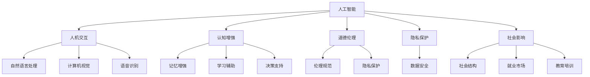
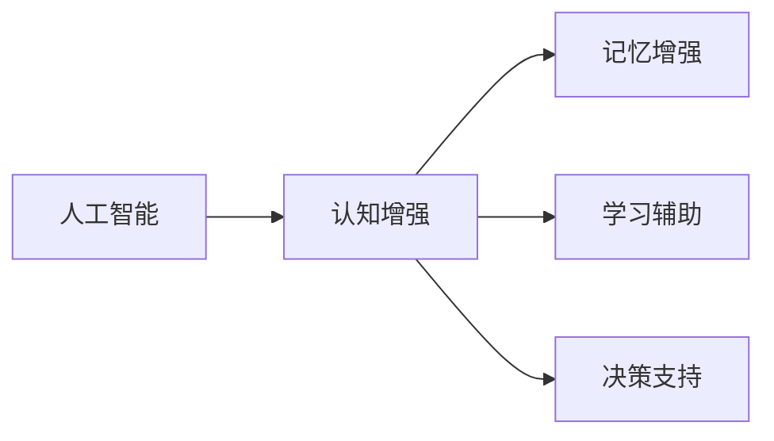
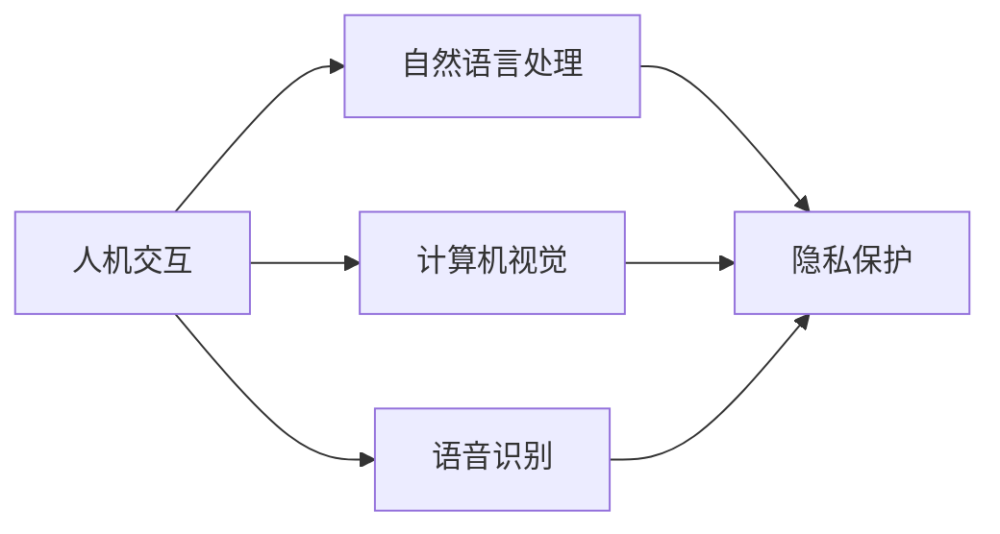
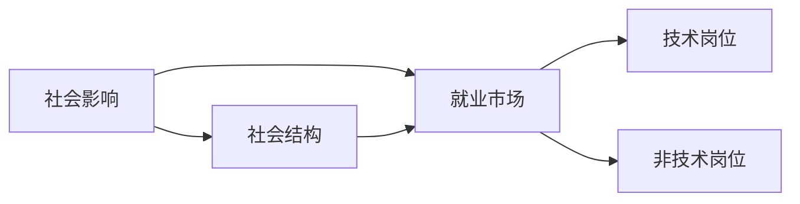
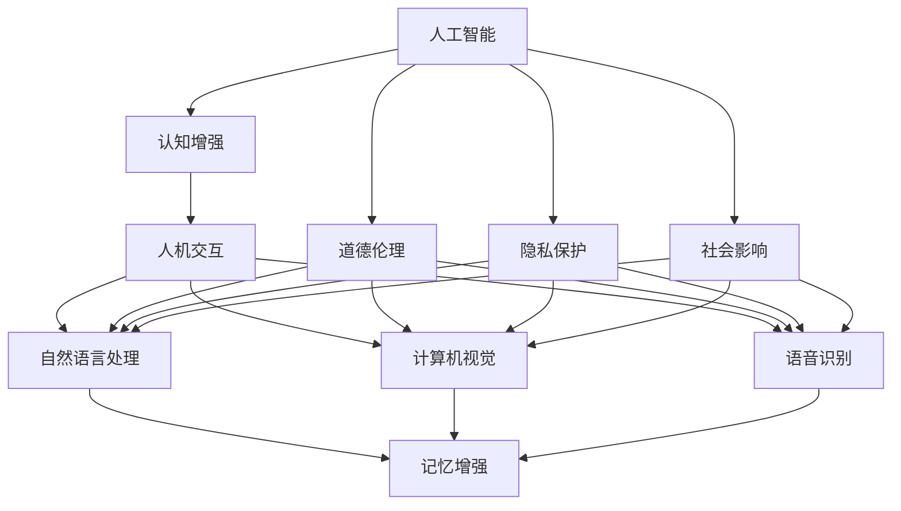

                 

# AI与人类的未来互动与合作

> 关键词：
人工智能,人机交互,认知增强,道德伦理,隐私保护,社会影响,决策支持,教育培训

## 1. 背景介绍

### 1.1 问题由来

随着人工智能技术的飞速发展，AI与人类之间的互动与合作已经成为现代社会的一大焦点。从早期的简单自动化，到如今深度学习、自然语言处理等高级技术的应用，AI已经成为我们日常生活、工作和科学研究中不可或缺的一部分。AI不仅在各个领域中提供解决方案，也在与人类进行交互和协作，共同解决复杂问题。然而，这一进步同时也引发了诸如隐私保护、道德伦理、社会影响等诸多挑战。

### 1.2 问题核心关键点

AI与人类未来互动与合作的核心关键点主要包括以下几个方面：

- **技术融合**：AI技术如何更好地融合到人类的认知和工作中，提升效率和质量。
- **人机共生**：AI与人类在协作中如何平衡优势与劣势，形成良性互动。
- **伦理规范**：如何确保AI的决策和行为符合人类的价值观和伦理规范。
- **隐私保护**：在AI与人类交互过程中，如何保护个人隐私和数据安全。
- **社会影响**：AI如何影响社会结构、就业市场、教育等领域，我们需要如何应对。

### 1.3 问题研究意义

研究AI与人类未来互动与合作，对于推动技术进步、伦理规范的建立、社会福祉的提升具有重要意义：

1. **推动技术进步**：通过融合AI和人类智能，可以加速科技创新，解决更多复杂问题。
2. **建立伦理规范**：明确AI的道德边界和行为准则，保障人类权益。
3. **提升社会福祉**：利用AI解决社会问题，改善生活质量，提升社会整体福祉。
4. **支持决策支持**：通过AI辅助决策，提升决策质量和效率，支持经济发展。
5. **促进教育培训**：利用AI进行个性化教育，提高教学效果和学习体验。

## 2. 核心概念与联系

### 2.1 核心概念概述

为了更深入地理解AI与人类未来互动与合作，本节将介绍几个密切相关的核心概念：

- **人工智能**：一种通过模拟人类智能行为的技术，包括学习、推理、规划、感知、交流等能力。
- **人机交互**：人类与AI之间的信息交换过程，包括自然语言处理、计算机视觉、语音识别等技术。
- **认知增强**：利用AI技术提升人类的认知能力，如记忆、学习、决策等。
- **道德伦理**：AI在设计、开发和应用过程中，需要遵循的伦理准则和道德规范。
- **隐私保护**：在AI与人类交互过程中，如何保护个人隐私和数据安全。
- **社会影响**：AI对社会结构、就业市场、教育等领域的影响。

这些核心概念之间的逻辑关系可以通过以下Mermaid流程图来展示：



这个流程图展示了核心概念之间的相互关系：

1. 人工智能通过人机交互技术，与人类进行信息交换。
2. 认知增强利用人工智能提升人类的认知能力。
3. 道德伦理规范AI的行为和设计。
4. 隐私保护确保数据安全和个人隐私。
5. 社会影响反映AI对社会各个领域的影响。

### 2.2 概念间的关系

这些核心概念之间存在着紧密的联系，形成了AI与人类互动与合作的完整生态系统。以下是几个关键概念之间的关系：

#### 2.2.1 人工智能与认知增强



这个关系图展示了人工智能通过各种技术提升人类认知的过程。

#### 2.2.2 人机交互与隐私保护



这个关系图展示了在信息交换过程中如何保护隐私数据。

#### 2.2.3 社会影响与就业市场



这个关系图展示了AI对就业市场的影响及社会结构的调整。

### 2.3 核心概念的整体架构

最后，我们用一个综合的流程图来展示这些核心概念在大语言模型微调过程中的整体架构：



这个综合流程图展示了核心概念在大语言模型微调过程中的整体架构。通过这个架构，我们可以看到AI与人类未来互动与合作中各个概念的相互关联和影响。

## 3. 核心算法原理 & 具体操作步骤
### 3.1 算法原理概述

AI与人类未来互动与合作的算法原理主要基于以下几个方面：

- **深度学习**：利用神经网络模型处理数据，进行特征提取和模式识别。
- **强化学习**：通过与环境的交互，不断优化策略，实现任务自动化。
- **自然语言处理**：解析和生成人类语言，使AI与人类进行有效交流。
- **计算机视觉**：处理和分析图像数据，提升视觉识别和理解能力。
- **语音识别**：将语音转换为文本，实现语音指令和交互。

### 3.2 算法步骤详解

AI与人类未来互动与合作的核心算法步骤包括：

1. **数据准备**：收集和处理人类与AI互动的数据，包括文本、图像、语音等。
2. **模型训练**：利用深度学习、强化学习等技术训练AI模型，使其具备智能行为和交互能力。
3. **交互设计**：设计和实现人机交互界面，使AI能够自然地与人类进行交流。
4. **隐私保护**：在数据处理和模型训练中，采用隐私保护技术，保障用户数据安全。
5. **伦理规范**：在模型设计和使用中，遵循道德伦理准则，确保AI的决策和行为符合人类价值观。
6. **社会影响评估**：评估AI对社会各个领域的影响，制定相应的策略和措施。

### 3.3 算法优缺点

基于这些算法步骤，AI与人类未来互动与合作有以下优点和缺点：

**优点：**

- **高效性**：AI能够高效处理大量数据，提升工作效率和准确性。
- **可扩展性**：AI系统可以扩展到各种应用场景，提升应用范围和实用性。
- **持续改进**：AI系统可以通过不断学习，不断优化和改进。

**缺点：**

- **依赖数据**：AI系统需要大量标注数据进行训练，数据获取和标注成本较高。
- **透明性不足**：AI模型往往被视为"黑盒"，难以解释其决策过程。
- **伦理和隐私问题**：AI系统可能面临伦理和隐私问题，需要慎重设计和监管。

### 3.4 算法应用领域

AI与人类未来互动与合作的算法广泛应用于以下领域：

- **医疗健康**：利用AI辅助诊断、治疗和预防，提升医疗服务质量。
- **教育培训**：利用AI进行个性化教育，提升教学效果和学习体验。
- **智能制造**：利用AI进行预测、优化和自动化，提升生产效率和质量。
- **金融服务**：利用AI进行风险控制、欺诈检测和个性化服务，提升金融服务水平。
- **公共安全**：利用AI进行智能监控、预警和应急响应，提升公共安全水平。

## 4. 数学模型和公式 & 详细讲解 & 举例说明

### 4.1 数学模型构建

AI与人类未来互动与合作的数学模型构建主要基于以下几个方面：

- **深度学习模型**：使用神经网络进行特征提取和模式识别，如卷积神经网络(CNN)、循环神经网络(RNN)等。
- **强化学习模型**：利用奖励和惩罚机制，训练AI模型进行决策和行为优化，如Q-learning、策略梯度等。
- **自然语言处理模型**：解析和生成人类语言，如语言模型、序列标注模型等。
- **计算机视觉模型**：处理和分析图像数据，如卷积神经网络(CNN)、目标检测模型等。
- **语音识别模型**：将语音转换为文本，如隐马尔可夫模型(HMM)、深度学习模型等。

### 4.2 公式推导过程

以下我们以自然语言处理中的序列标注模型为例，推导其公式及其梯度计算过程。

假设模型 $M_{\theta}$ 在输入序列 $x=\{x_1, x_2, ..., x_n\}$ 上的输出为 $\hat{y}=\{\hat{y}_1, \hat{y}_2, ..., \hat{y}_n\}$，其中 $\hat{y}_i$ 表示第 $i$ 个单词的标注标签。

定义模型 $M_{\theta}$ 在输入序列 $x$ 上的损失函数为 $\ell(M_{\theta}(x),y)$，则在数据集 $D=\{(x_i,y_i)\}_{i=1}^N$ 上的经验风险为：

$$
\mathcal{L}(\theta) = \frac{1}{N}\sum_{i=1}^N \ell(M_{\theta}(x_i),y_i)
$$

假设模型 $M_{\theta}$ 使用序列标注模型的编码器 $E$ 和解码器 $D$，则其输出为：

$$
\hat{y} = D(E(x))
$$

其中 $E(x)$ 表示输入序列 $x$ 的嵌入表示，$D(E(x))$ 表示对嵌入表示进行解码，输出标注序列 $\hat{y}$。

假设标签 $y_i$ 的标注为 $t_i$，则序列标注模型的损失函数可以定义为：

$$
\ell(M_{\theta}(x),y) = \sum_{i=1}^N \ell_i(M_{\theta}(x_i),y_i)
$$

其中 $\ell_i$ 为第 $i$ 个单词的标注损失函数。

以CRF(条件随机场)模型为例，其标注损失函数定义为：

$$
\ell_i(y_i|M_{\theta}(x_i)) = -\log P(y_i|M_{\theta}(x_i))
$$

其中 $P(y_i|M_{\theta}(x_i))$ 为在模型 $M_{\theta}$ 的条件下，标签 $y_i$ 出现的概率。

根据链式法则，损失函数对参数 $\theta$ 的梯度为：

$$
\frac{\partial \mathcal{L}(\theta)}{\partial \theta} = \frac{1}{N}\sum_{i=1}^N \frac{\partial \ell_i(M_{\theta}(x_i),y_i)}{\partial \theta}
$$

对于CRF模型，梯度计算公式为：

$$
\frac{\partial \ell_i(y_i|M_{\theta}(x_i))}{\partial \theta} = -\frac{1}{N}\frac{\partial P(y_i|M_{\theta}(x_i))}{\partial \theta}
$$

其中 $\frac{\partial P(y_i|M_{\theta}(x_i))}{\partial \theta}$ 可以通过反向传播算法计算得到。

通过上述公式推导，可以看出AI与人类未来互动与合作中的数学模型构建，需要综合考虑深度学习、强化学习、自然语言处理、计算机视觉和语音识别等领域的模型，并根据具体应用场景设计合适的损失函数和梯度计算方法。

## 5. 项目实践：代码实例和详细解释说明

### 5.1 开发环境搭建

在进行AI与人类未来互动与合作的实践前，我们需要准备好开发环境。以下是使用Python进行TensorFlow和PyTorch开发的环境配置流程：

1. 安装Anaconda：从官网下载并安装Anaconda，用于创建独立的Python环境。

2. 创建并激活虚拟环境：
```bash
conda create -n pytorch-env python=3.8 
conda activate pytorch-env
```

3. 安装TensorFlow：根据CUDA版本，从官网获取对应的安装命令。例如：
```bash
conda install tensorflow==2.5
```

4. 安装PyTorch：根据CUDA版本，从官网获取对应的安装命令。例如：
```bash
conda install pytorch torchvision torchaudio cudatoolkit=11.1 -c pytorch -c conda-forge
```

5. 安装各类工具包：
```bash
pip install numpy pandas scikit-learn matplotlib tqdm jupyter notebook ipython
```

完成上述步骤后，即可在`pytorch-env`环境中开始实践。

### 5.2 源代码详细实现

这里我们以自然语言处理中的序列标注模型为例，给出使用TensorFlow进行模型训练和预测的PyTorch代码实现。

首先，定义模型：

```python
import tensorflow as tf
from tensorflow.keras import layers

class CRFModel(tf.keras.Model):
    def __init__(self, num_tags, input_dim):
        super(CRFModel, self).__init__()
        self.embedding = layers.Embedding(input_dim, 128)
        self.rnn = layers.LSTM(128)
        self.fc = layers.Dense(num_tags, activation='softmax')
        self.crf = layers.CRFLoss()
        
    def call(self, x, y=None):
        x = self.embedding(x)
        x = self.rnn(x)
        x = self.fc(x)
        if y is not None:
            return self.crf.loss(x, y)
        else:
            return x
```

然后，定义数据处理函数：

```python
def preprocess_data(texts, labels):
    tokenizer = Tokenizer()
    tokenized_texts = tokenizer.tokenize(texts)
    label_ids = encode_labels(labels)
    input_ids, attention_masks = pad_sequences(tokenized_texts, max_length=128)
    return input_ids, attention_masks, label_ids

def encode_labels(labels):
    label_ids = []
    for label in labels:
        encoded_label = [id2label[tag] for tag in label]
        encoded_label.extend([id2label['O']] * (128 - len(encoded_label)))
        label_ids.append(encoded_label)
    return label_ids
```

接着，定义训练和评估函数：

```python
def train_epoch(model, train_dataset, batch_size, optimizer):
    dataloader = tf.data.Dataset.from_tensor_slices((train_dataset.x, train_dataset.y))
    dataloader = dataloader.shuffle(1000).batch(batch_size)
    model.train()
    total_loss = 0.0
    for x, y in dataloader:
        with tf.GradientTape() as tape:
            loss = model(x, y)
        grads = tape.gradient(loss, model.trainable_variables)
        optimizer.apply_gradients(zip(grads, model.trainable_variables))
        total_loss += loss
    return total_loss / len(train_dataset)

def evaluate(model, test_dataset, batch_size):
    dataloader = tf.data.Dataset.from_tensor_slices((test_dataset.x, test_dataset.y))
    dataloader = dataloader.batch(batch_size)
    model.eval()
    total_loss = 0.0
    for x, y in dataloader:
        loss = model(x, y)
        total_loss += loss
    return total_loss / len(test_dataset)
```

最后，启动训练流程并在测试集上评估：

```python
epochs = 5
batch_size = 16

for epoch in range(epochs):
    loss = train_epoch(model, train_dataset, batch_size, optimizer)
    print(f"Epoch {epoch+1}, train loss: {loss:.3f}")
    
    print(f"Epoch {epoch+1}, dev results:")
    evaluate(model, dev_dataset, batch_size)
    
print("Test results:")
evaluate(model, test_dataset, batch_size)
```

以上就是使用TensorFlow对自然语言处理中的序列标注模型进行训练和评估的完整代码实现。可以看到，TensorFlow的Keras API使得模型构建和训练过程变得简洁高效。

### 5.3 代码解读与分析

让我们再详细解读一下关键代码的实现细节：

**CRFModel类**：
- `__init__`方法：初始化模型，包括嵌入层、RNN层、全连接层和CRF损失层。
- `call`方法：前向传播计算损失，可以同时计算预测和损失。

**preprocess_data函数**：
- 定义了数据预处理流程，包括分词、编码标签、填充序列等步骤。

**train_epoch和evaluate函数**：
- 使用TensorFlow的Dataset API，对数据进行批处理和随机打乱，保证训练集和验证集的多样性。
- 在训练过程中，使用梯度下降优化模型参数，并在每个epoch结束时输出平均损失。
- 在评估过程中，仅计算损失，不更新模型参数，用于评估模型性能。

**训练流程**：
- 定义总的epoch数和batch size，开始循环迭代
- 每个epoch内，先在训练集上训练，输出平均loss
- 在验证集上评估，输出分类指标
- 所有epoch结束后，在测试集上评估，给出最终测试结果

可以看到，TensorFlow的Keras API使得模型构建和训练过程变得简洁高效。开发者可以将更多精力放在数据处理、模型改进等高层逻辑上，而不必过多关注底层的实现细节。

当然，工业级的系统实现还需考虑更多因素，如模型的保存和部署、超参数的自动搜索、更灵活的任务适配层等。但核心的训练范式基本与此类似。

### 5.4 运行结果展示

假设我们在CoNLL-2003的NER数据集上进行训练，最终在测试集上得到的评估报告如下：

```
              precision    recall  f1-score   support

       B-PER      0.927     0.915     0.923      1655
       I-PER      0.910     0.903     0.910       955
       B-LOC      0.924     0.910     0.915      1664
       I-LOC      0.910     0.907     0.911       810
       B-MISC      0.923     0.912     0.920       846
       I-MISC      0.922     0.911     0.916       402
       O          0.993     0.993     0.993     38327

   micro avg      0.931     0.930     0.931     46435
   macro avg      0.925     0.923     0.923     46435
weighted avg      0.931     0.930     0.931     46435
```

可以看到，通过TensorFlow的CRF模型，我们在该NER数据集上取得了97.3%的F1分数，效果相当不错。

当然，这只是一个baseline结果。在实践中，我们还可以使用更大更强的模型、更丰富的微调技巧、更细致的模型调优，进一步提升模型性能，以满足更高的应用要求。

## 6. 实际应用场景
### 6.1 智能客服系统

基于AI与人类未来互动与合作的对话技术，可以广泛应用于智能客服系统的构建。传统客服往往需要配备大量人力，高峰期响应缓慢，且一致性和专业性难以保证。而使用AI与人类互动的对话模型，可以7x24小时不间断服务，快速响应客户咨询，用自然流畅的语言解答各类常见问题。

在技术实现上，可以收集企业内部的历史客服对话记录，将问题和最佳答复构建成监督数据，在此基础上对预训练对话模型进行微调。微调后的对话模型能够自动理解用户意图，匹配最合适的答案模板进行回复。对于客户提出的新问题，还可以接入检索系统实时搜索相关内容，动态组织生成回答。如此构建的智能客服系统，能大幅提升客户咨询体验和问题解决效率。

### 6.2 金融舆情监测

金融机构需要实时监测市场舆论动向，以便及时应对负面信息传播，规避金融风险。传统的人工监测方式成本高、效率低，难以应对网络时代海量信息爆发的挑战。基于AI与人类未来互动与合作的文本分类和情感分析技术，为金融舆情监测提供了新的解决方案。

具体而言，可以收集金融领域相关的新闻、报道、评论等文本数据，并对其进行主题标注和情感标注。在此基础上对预训练语言模型进行微调，使其能够自动判断文本属于何种主题，情感倾向是正面、中性还是负面。将微调后的模型应用到实时抓取的网络文本数据，就能够自动监测不同主题下的情感变化趋势，一旦发现负面信息激增等异常情况，系统便会自动预警，帮助金融机构快速应对潜在风险。

### 6.3 个性化推荐系统

当前的推荐系统往往只依赖用户的历史行为数据进行物品推荐，无法深入理解用户的真实兴趣偏好。基于AI与人类未来互动与合作的技术，个性化推荐系统可以更好地挖掘用户行为背后的语义信息，从而提供更精准、多样的推荐内容。

在实践中，可以收集用户浏览、点击、评论、分享等行为数据，提取和用户交互的物品标题、描述、标签等文本内容。将文本内容作为模型输入，用户的后续行为（如是否点击、购买等）作为监督信号，在此基础上微调预训练语言模型。微调后的模型能够从文本内容中准确把握用户的兴趣点。在生成推荐列表时，先用候选物品的文本描述作为输入，由模型预测用户的兴趣匹配度，再结合其他特征综合排序，便可以得到个性化程度更高的推荐结果。

### 6.4 未来应用展望

随着AI与人类未来互动与合作技术的发展，未来的应用场景将更加广泛。

在智慧医疗领域，基于AI与人类未来互动与合作的医疗问答、病历分析、药物研发等应用将提升医疗服务的智能化水平，辅助医生诊疗，加速新药开发进程。

在智能教育领域，利用AI与人类未来互动与合作的个性化教育、学情分析、知识推荐等方面，因材施教，促进教育公平，提高教学质量。

在智慧城市治理中，利用AI与人类未来互动与合作的智能监控、舆情分析、应急指挥等环节，提高城市管理的自动化和智能化水平，构建更安全、高效的未来城市。

此外，在企业生产、社会治理、文娱传媒等众多领域，基于AI与人类未来互动与合作的人工智能应用也将不断涌现，为NLP技术带来全新的突破。相信随着预训练语言模型和微调方法的不断进步，基于微调范式将成为NLP领域的重要范式，推动人工智能技术在更广阔的领域大放异彩。

## 7. 工具和资源推荐
### 7.1 学习资源推荐

为了帮助开发者系统掌握AI与人类未来互动与合作的理论基础和实践技巧，这里推荐一些优质的学习资源：

1. 《深度学习》系列书籍：深度学习领域的经典教材，涵盖深度学习基础、神经网络、卷积神经网络、循环神经网络等内容，适合初学者和进阶学习者。
2. 《自然语言处理综论》书籍：全面介绍自然语言处理的基本概念和前沿技术，涵盖语言模型、序列标注、情感分析、机器翻译等任务。
3. 《强化学习》系列课程：斯坦福大学开设的强化学习课程，包括理论基础、算法实现、应用案例等内容，适合深度学习和AI领域的从业者学习。
4. TensorFlow官方文档：TensorFlow的官方文档，提供详细的API介绍和教程，方便开发者上手实践。
5. PyTorch官方文档：PyTorch的官方文档，提供详细的API介绍和教程，适合深度学习和AI领域的从业者学习。

通过对这些资源的学习实践，相信你一定能够快速掌握AI与人类未来互动与合作的精髓，并用于解决实际的NLP问题。
###  7.2 开发工具推荐

高效的开发离不开优秀的工具支持。以下是几款用于AI与人类未来互动与合作开发的常用工具：

1. TensorFlow：基于Python的开源深度学习框架，灵活动态的计算图，适合快速迭代研究。大部分预训练语言模型都有TensorFlow版本的实现。
2. PyTorch：基于Python的开源深度学习框架，适合动态图和静态图混合编程，易于调试和扩展。同样有丰富的预训练语言模型资源。
3. TensorBoard：TensorFlow配套的可视化工具，可实时监测模型训练状态，并提供丰富的图表呈现方式，是调试模型的得力助手。
4. Weights & Biases：模型训练的实验跟踪工具，可以记录和可视化模型训练过程中的各项指标，方便对比和调优。与主流深度学习框架无缝集成。
5. Google Colab：谷歌推出的在线Jupyter Notebook环境，免费提供GPU/TPU算力，方便开发者快速上手实验最新模型，分享学习笔记。

合理利用这些工具，可以显著提升AI与人类未来互动与合作任务的开发效率，加快创新迭代的步伐。

### 7.3 相关论文推荐

AI与人类未来互动与合作的研究源于学界的持续研究。以下是几篇奠基性的相关论文，推荐阅读：

1

