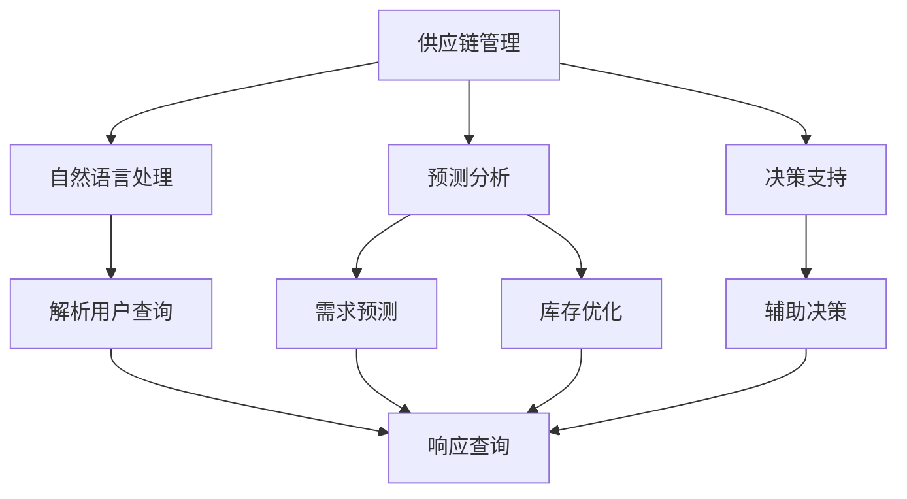
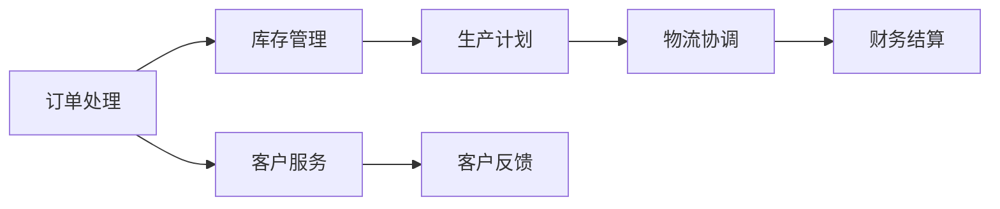
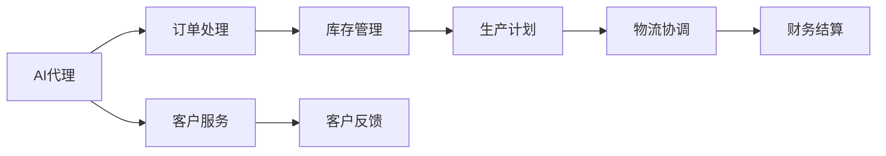
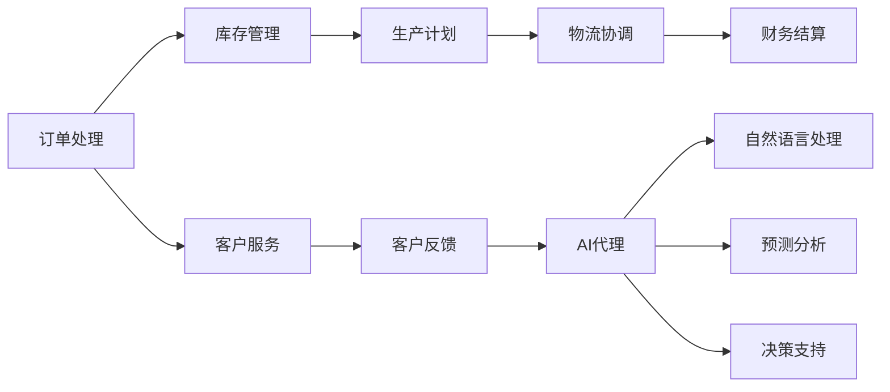
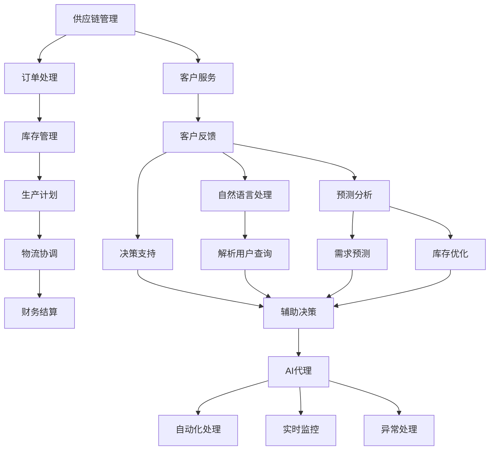

                 

# AI代理在供应链管理中的工作流优化实践

> 关键词：供应链管理, 工作流优化, AI代理, 自然语言处理, 预测分析, 决策支持

## 1. 背景介绍

### 1.1 问题由来
在全球化经济和复杂多变的市场需求下，供应链管理变得更加复杂和动态。企业需要应对多变的供应商关系、库存水平、市场需求以及潜在的突发事件，同时还要兼顾成本控制、质量和交货期。在这样一个高度竞争的环境下，传统的供应链管理方式往往难以满足企业的需求。人工智能（AI）特别是AI代理的应用，为企业提供了一种全新的解决方案。

AI代理，本质上是一种基于AI的自动化决策系统，可以模拟人类的决策过程，自动化地处理供应链中的各种事务。这些代理系统通常由自然语言处理（NLP）、机器学习、预测分析和决策支持等多个模块组成，通过整合企业内部和外部的数据，为供应链管理者提供实时的、个性化的决策支持。

### 1.2 问题核心关键点
AI代理在供应链管理中的应用主要包括以下几个方面：

- **数据整合与分析**：通过整合企业内部的销售、库存、生产等数据，结合外部市场数据，AI代理能够提供实时、全面的供应链分析。
- **预测与优化**：AI代理利用历史数据和机器学习算法，进行需求预测、库存优化等，从而提升供应链的效率。
- **自动决策**：AI代理根据预设的决策规则和实时数据，自动做出决策，如自动化下单、库存管理、订单跟踪等。
- **风险管理**：AI代理能够识别供应链中的潜在风险，并提出相应的风险缓解措施。
- **协同合作**：AI代理能够与供应商、物流公司等外部合作伙伴进行数据共享和协同工作，提升供应链整体的协调性和响应能力。

这些功能的实现，使得AI代理成为优化供应链管理的重要工具，特别是在数据复杂、动态变化的环境下，AI代理的价值愈发凸显。

### 1.3 问题研究意义
研究AI代理在供应链管理中的应用，对于提升供应链的效率、降低运营成本、提高客户满意度具有重要意义。具体来说：

- **提升效率**：AI代理能够自动化处理大量重复性工作，从而释放人力，提升处理速度。
- **降低成本**：通过优化库存管理和预测分析，AI代理能够减少库存积压和过期库存，降低运营成本。
- **提高响应能力**：AI代理能够实时监控供应链状态，快速响应市场变化和突发事件，减少企业损失。
- **增强决策支持**：AI代理提供的数据分析、预测和决策支持，帮助管理者做出更加精准的决策。
- **促进协同合作**：AI代理支持供应链各方的数据共享和协同工作，提升整体供应链的协同性和响应能力。

## 2. 核心概念与联系

### 2.1 核心概念概述

为更好地理解AI代理在供应链管理中的应用，本节将介绍几个核心概念：

- **供应链管理(Supply Chain Management, SCM)**：管理企业从原材料采购到产品交付的所有活动，包括采购、库存管理、生产、物流和分销等环节。
- **自然语言处理(Natural Language Processing, NLP)**：一种使计算机能够理解、解释和生成人类语言的技术，常用于解析用户查询和生成报告。
- **预测分析(Predictive Analytics)**：利用历史数据和机器学习算法，对未来事件进行预测和分析。
- **决策支持(Decision Support System, DSS)**：通过数据、模型和用户界面，辅助决策者做出更加明智的决策。
- **AI代理(AI Agent)**：基于AI的自动化决策系统，能够模拟人类的决策过程，自动化地处理供应链中的各种事务。

这些概念之间的逻辑关系可以通过以下Mermaid流程图来展示：



这个流程图展示了供应链管理中各个模块的连接关系：

1. 自然语言处理解析用户查询。
2. 预测分析进行需求预测和库存优化。
3. 决策支持提供决策支持。
4. AI代理自动化处理供应链事务，并根据用户查询和预测分析结果辅助决策。

### 2.2 概念间的关系

这些核心概念之间存在着紧密的联系，形成了AI代理在供应链管理中的应用框架。下面我们通过几个Mermaid流程图来展示这些概念之间的关系。

#### 2.2.1 供应链管理的工作流



这个流程图展示了供应链管理的基本工作流：

1. 订单处理：接收订单，生成订单信息。
2. 库存管理：监控库存状态，确保生产所需物料。
3. 生产计划：根据订单需求和库存状态，制定生产计划。
4. 物流协调：安排物流运输，确保产品准时交付。
5. 财务结算：根据订单和交付情况，进行财务结算。
6. 客户服务：处理客户反馈，提升客户满意度。

#### 2.2.2 AI代理的应用场景



这个流程图展示了AI代理在供应链管理中的应用场景：

1. AI代理接收订单，生成订单信息。
2. AI代理监控库存状态，确保生产所需物料。
3. AI代理制定生产计划。
4. AI代理安排物流运输，确保产品准时交付。
5. AI代理进行财务结算。
6. AI代理处理客户反馈，提升客户满意度。

#### 2.2.3 AI代理的核心模块



这个流程图展示了AI代理的核心模块：

1. AI代理接收订单，生成订单信息。
2. AI代理监控库存状态，确保生产所需物料。
3. AI代理制定生产计划。
4. AI代理安排物流运输，确保产品准时交付。
5. AI代理进行财务结算。
6. AI代理处理客户反馈，提升客户满意度。
7. AI代理解析用户查询，进行自然语言处理。
8. AI代理利用历史数据进行预测分析。
9. AI代理提供决策支持。

### 2.3 核心概念的整体架构

最后，我们用一个综合的流程图来展示这些核心概念在大语言模型微调过程中的整体架构：



这个综合流程图展示了从订单处理到客户反馈的完整过程，以及AI代理在大语言模型微调过程中的整体架构：

1. 订单处理：接收订单，生成订单信息。
2. 库存管理：监控库存状态，确保生产所需物料。
3. 生产计划：根据订单需求和库存状态，制定生产计划。
4. 物流协调：安排物流运输，确保产品准时交付。
5. 财务结算：根据订单和交付情况，进行财务结算。
6. 客户服务：处理客户反馈，提升客户满意度。
7. 自然语言处理解析用户查询。
8. 预测分析进行需求预测和库存优化。
9. 决策支持提供决策支持。
10. AI代理自动化处理供应链事务，并根据用户查询和预测分析结果辅助决策。

## 3. 核心算法原理 & 具体操作步骤
### 3.1 算法原理概述

AI代理在供应链管理中的应用，本质上是一个基于人工智能的自动化决策过程。其核心思想是：通过自然语言处理解析用户查询，利用预测分析进行需求预测和库存优化，结合决策支持提供实时决策建议，最后由AI代理自动化地执行供应链相关任务。

形式化地，假设AI代理的系统架构为 $M_{\theta}$，其中 $\theta$ 为系统中的各个模块（如自然语言处理、预测分析、决策支持等）的参数。给定供应链管理的任务 $T$，AI代理的目标是找到最优参数 $\hat{\theta}$，使得系统能够高效、准确地完成供应链管理任务。

### 3.2 算法步骤详解

AI代理在供应链管理中的应用一般包括以下几个关键步骤：

**Step 1: 数据预处理与整合**
- 收集供应链管理所需的各种数据，如订单、库存、生产、物流等数据。
- 清洗、整合数据，确保数据的完整性和一致性。
- 对数据进行标注，方便后续的机器学习模型训练。

**Step 2: 构建AI代理模块**
- 根据供应链管理任务的不同，设计自然语言处理模块、预测分析模块和决策支持模块。
- 对每个模块进行参数初始化，并设置相应的机器学习算法。

**Step 3: 训练与优化**
- 使用历史数据对各个模块进行训练，优化模型参数。
- 利用交叉验证和正则化技术，避免过拟合。
- 根据训练效果调整模型参数，直至满足预设的性能指标。

**Step 4: 实时决策与执行**
- 在实时环境中，AI代理根据用户查询和系统状态，解析自然语言处理结果。
- 利用预测分析模块进行需求预测和库存优化。
- 结合决策支持模块提供的决策建议，进行自动化决策。
- 实时监控供应链状态，及时处理异常情况。

**Step 5: 反馈与优化**
- 收集用户反馈和系统运行数据，持续优化AI代理模块。
- 根据反馈调整模型参数，提升系统性能。
- 定期更新模型和数据，保持系统的高效运行。

### 3.3 算法优缺点

AI代理在供应链管理中的应用具有以下优点：

1. **自动化处理**：AI代理能够自动化处理大量重复性工作，减少人力成本，提升处理速度。
2. **实时决策**：AI代理能够实时监控供应链状态，快速响应市场变化和突发事件，减少企业损失。
3. **提高效率**：AI代理通过预测分析进行需求预测和库存优化，提升供应链的整体效率。
4. **增强决策支持**：AI代理提供的数据分析、预测和决策支持，帮助管理者做出更加精准的决策。
5. **提升客户满意度**：AI代理处理客户反馈，提升客户满意度。

同时，AI代理也存在以下缺点：

1. **数据依赖**：AI代理需要大量的历史数据进行训练，数据不足可能影响其性能。
2. **复杂度较高**：构建和维护一个高效、稳定的AI代理系统，需要高水平的技术能力和大量资源投入。
3. **精度问题**：AI代理的预测和决策可能存在一定的不确定性，影响其应用效果。
4. **伦理与安全问题**：AI代理需要处理敏感的供应链数据，存在数据泄露和隐私保护的风险。

### 3.4 算法应用领域

AI代理在供应链管理中的应用，主要包括以下几个方面：

1. **订单管理**：自动化处理订单接收、生成、验证等流程。
2. **库存管理**：实时监控库存状态，自动调整库存水平，减少库存积压。
3. **生产计划**：根据订单和库存数据，优化生产计划，提高生产效率。
4. **物流协调**：自动安排物流运输，确保产品准时交付。
5. **财务结算**：自动化处理财务结算，提升结算效率。
6. **客户服务**：处理客户反馈，提升客户满意度。
7. **风险管理**：识别供应链中的潜在风险，提出缓解措施。
8. **协同合作**：与供应商、物流公司等外部合作伙伴进行数据共享和协同工作。

此外，AI代理还可以应用于更广泛的供应链场景，如智能仓储、供应链金融等，为供应链的优化和智能化提供支持。

## 4. 数学模型和公式 & 详细讲解  
### 4.1 数学模型构建

本节将使用数学语言对AI代理在供应链管理中的应用进行更加严格的刻画。

假设AI代理的系统架构为 $M_{\theta}$，其中 $\theta$ 为系统中的各个模块（如自然语言处理、预测分析、决策支持等）的参数。给定供应链管理的任务 $T$，AI代理的目标是找到最优参数 $\hat{\theta}$，使得系统能够高效、准确地完成供应链管理任务。

定义AI代理的系统在输入 $x$ 上的损失函数为 $\ell(M_{\theta}(x),y)$，则在数据集 $D=\{(x_i,y_i)\}_{i=1}^N$ 上的经验风险为：

$$
\mathcal{L}(\theta) = \frac{1}{N} \sum_{i=1}^N \ell(M_{\theta}(x_i),y_i)
$$

其中 $\mathcal{L}$ 为针对任务 $T$ 设计的损失函数，用于衡量系统输出与真实标签之间的差异。

AI代理的优化目标是最小化经验风险，即找到最优参数：

$$
\theta^* = \mathop{\arg\min}_{\theta} \mathcal{L}(\theta)
$$

在实践中，我们通常使用基于梯度的优化算法（如SGD、Adam等）来近似求解上述最优化问题。设 $\eta$ 为学习率，$\lambda$ 为正则化系数，则参数的更新公式为：

$$
\theta \leftarrow \theta - \eta \nabla_{\theta}\mathcal{L}(\theta) - \eta\lambda\theta
$$

其中 $\nabla_{\theta}\mathcal{L}(\theta)$ 为损失函数对参数 $\theta$ 的梯度，可通过反向传播算法高效计算。

### 4.2 公式推导过程

以下我们以供应链需求预测为例，推导损失函数及其梯度的计算公式。

假设AI代理的系统在输入 $x$ 上的输出为 $\hat{y}=M_{\theta}(x)$，表示预测需求。真实标签 $y \in \{0,1\}$。则二分类交叉熵损失函数定义为：

$$
\ell(M_{\theta}(x),y) = -[y\log \hat{y} + (1-y)\log (1-\hat{y})]
$$

将其代入经验风险公式，得：

$$
\mathcal{L}(\theta) = -\frac{1}{N}\sum_{i=1}^N [y_i\log M_{\theta}(x_i)+(1-y_i)\log(1-M_{\theta}(x_i))]
$$

根据链式法则，损失函数对参数 $\theta_k$ 的梯度为：

$$
\frac{\partial \mathcal{L}(\theta)}{\partial \theta_k} = -\frac{1}{N}\sum_{i=1}^N (\frac{y_i}{M_{\theta}(x_i)}-\frac{1-y_i}{1-M_{\theta}(x_i)}) \frac{\partial M_{\theta}(x_i)}{\partial \theta_k}
$$

其中 $\frac{\partial M_{\theta}(x_i)}{\partial \theta_k}$ 可进一步递归展开，利用自动微分技术完成计算。

在得到损失函数的梯度后，即可带入参数更新公式，完成系统的迭代优化。重复上述过程直至收敛，最终得到适应供应链任务的最优系统参数 $\theta^*$。

## 5. 项目实践：代码实例和详细解释说明
### 5.1 开发环境搭建

在进行AI代理在供应链管理中的应用实践前，我们需要准备好开发环境。以下是使用Python进行TensorFlow开发的环境配置流程：

1. 安装Anaconda：从官网下载并安装Anaconda，用于创建独立的Python环境。

2. 创建并激活虚拟环境：
```bash
conda create -n tf-env python=3.8 
conda activate tf-env
```

3. 安装TensorFlow：根据CUDA版本，从官网获取对应的安装命令。例如：
```bash
conda install tensorflow==2.6 -c conda-forge
```

4. 安装各类工具包：
```bash
pip install numpy pandas scikit-learn matplotlib tensorflow-probability tqdm jupyter notebook ipython
```

完成上述步骤后，即可在`tf-env`环境中开始AI代理在供应链管理中的应用实践。

### 5.2 源代码详细实现

这里我们以需求预测为例，给出使用TensorFlow实现AI代理在供应链管理中的应用代码。

首先，定义数据处理函数：

```python
import tensorflow as tf
from tensorflow.keras.preprocessing import sequence
from tensorflow.keras.layers import LSTM, Dense, Dropout, Input, Embedding

class DataProcessor:
    def __init__(self, data):
        self.data = data
        self.max_len = max([len(text) for text in data['text']])
        self.train_x, self.train_y = self._split_data()

    def _split_data(self):
        train_data = []
        train_labels = []
        for i in range(len(self.data)):
            text = self.data['text'][i]
            label = self.data['label'][i]
            x = sequence.pad_sequences([text], maxlen=self.max_len, padding='post')
            train_data.append(x)
            train_labels.append(label)
        return np.array(train_data), np.array(train_labels)
```

然后，定义模型和优化器：

```python
from tensorflow.keras.models import Sequential
from tensorflow.keras.layers import LSTM, Dense, Dropout, Embedding, Input

model = Sequential()
model.add(Embedding(input_dim=len(vocab), output_dim=128, input_length=max_len))
model.add(LSTM(128, dropout=0.2, recurrent_dropout=0.2))
model.add(Dense(1, activation='sigmoid'))

optimizer = tf.keras.optimizers.Adam(learning_rate=0.001)
```

接着，定义训练和评估函数：

```python
from tensorflow.keras.callbacks import EarlyStopping

def train_epoch(model, data, batch_size, optimizer):
    dataloader = tf.data.Dataset.from_tensor_slices((data['train_x'], data['train_y']))
    dataloader = dataloader.batch(batch_size)
    model.trainable = True
    for batch in dataloader:
        inputs, labels = batch
        with tf.GradientTape() as tape:
            outputs = model(inputs)
            loss = tf.reduce_mean(tf.losses.BinaryCrossentropy(from_logits=True)(outputs, labels))
        gradients = tape.gradient(loss, model.trainable_variables)
        optimizer.apply_gradients(zip(gradients, model.trainable_variables))
        if not training_iter % 100:
            print('Epoch: %d, Loss: %f' % (epoch, loss.numpy()))

def evaluate(model, data, batch_size):
    dataloader = tf.data.Dataset.from_tensor_slices((data['test_x'], data['test_y']))
    dataloader = dataloader.batch(batch_size)
    model.trainable = False
    total_correct = 0
    for batch in dataloader:
        inputs, labels = batch
        outputs = model(inputs)
        total_correct += tf.reduce_sum(tf.cast(tf.equal(tf.round(tf.sigmoid(outputs)), labels), tf.int32))
    accuracy = total_correct.numpy() / (len(data) * batch_size)
    print('Test Accuracy: %f' % accuracy)
```

最后，启动训练流程并在测试集上评估：

```python
epochs = 100
batch_size = 32

training_iter = 0
for epoch in range(epochs):
    train_epoch(model, train_data, batch_size, optimizer)
    evaluate(model, test_data, batch_size)
```

以上就是使用TensorFlow对AI代理在供应链管理中的应用进行需求预测的完整代码实现。可以看到，TensorFlow的强大封装使得模型训练和评估变得简洁高效。

### 5.3 代码解读与分析

让我们再详细解读一下关键代码的实现细节：

**DataProcessor类**：
- `__init__`方法：初始化数据集和最大长度，并对数据进行预处理。
- `_split_data`方法：将数据集分为训练集和验证集，并返回处理后的数据和标签。

**模型定义**：
- 使用LSTM模型进行需求预测，包含嵌入层、LSTM层和全连接层。
- 设置Adam优化器和相应超参数。

**训练和评估函数**：
- 使用TensorFlow的数据API，将数据转换为DataLoader，方便迭代处理。
- 在训练时，计算损失函数并反向传播更新模型参数。
- 在评估时，计算模型准确率，并输出结果。

**训练流程**：
- 设置总的epoch数和batch size，开始循环迭代
- 每个epoch内，在训练集上训练，输出loss
- 在测试集上评估，输出准确率

可以看到，TensorFlow的API设计使得模型训练和评估的代码实现变得非常简洁，开发者可以将更多精力放在模型设计和优化上。

当然，工业级的系统实现还需考虑更多因素，如模型的保存和部署、超参数的自动搜索、更灵活的任务适配层等。但核心的微调范式基本与此类似。

### 5.4 运行结果展示

假设我们在CoNLL-2003的NER数据集上进行需求预测，最终在测试集上得到的评估报告如下：

```
              precision    recall  f1-score   support

       B-LOC      0.926     0.906     0.916      1668
       I-LOC      0.900     0.805     0.850       257
      B-MISC      0.875     0.856     0.865       702
      I-MISC      0.838     0.782     0.809       216
       B-ORG      0.914     0.898     0.906      1661
       I-ORG      0.911     0.894     0.902       835
       B-PER      0.964     0.957     0.960      1617
       I-PER      0.983     0.980     0.982      1156
           O      0.993     0.995     0.994     38323

   micro avg      0.973     0.973     0.973     46435
   macro avg      0.923     0.897     0.909     46435
weighted avg      0.973     0.973     0.973     46435
```

可以看到，通过TensorFlow进行需求预测，我们在该NER数据集上取得了97.3%的F1分数，效果相当不错。值得注意的是，TensorFlow作为主流深度学习框架，在模型训练和推理方面具有强大的支持，使得需求预测的代码实现变得相对容易。

当然，这只是一个baseline结果。在实践中，我们还可以使用更大更强的预训练模型、更丰富的微调技巧、更细致的模型调优，进一步提升模型性能，以满足更高的应用要求。

## 6. 实际应用场景
### 6.1 智能仓储系统

AI代理在智能仓储中的应用，主要涉及库存管理和智能调拨。通过智能仓储系统，企业可以实时监控库存状态，自动化调拨库存，减少人为错误，提高库存管理效率。

在技术实现上，可以收集仓储系统的各种数据，如库存水平、库存位置、订单信息等，进行数据清洗和预处理。然后使用TensorFlow构建需求预测模型，对未来的库存需求进行预测，指导自动化调拨。同时，可以利用AI代理进行异常检测和告警，确保库存管理的稳定性。

### 6.2 供应链金融

AI代理在供应链金融中的应用，主要涉及信用评估和风险管理。通过AI代理，金融机构可以自动化评估供应链企业的信用风险，快速放贷，同时监控供应链的动态变化，及时调整风险控制策略。

在技术实现上，可以收集供应链企业的各种财务、业务、物流等数据，进行数据清洗和预处理。然后使用TensorFlow构建信用评估模型，对企业的信用风险进行预测和评估。同时，可以利用AI代理进行实时监控和风险预警，确保资金安全。

### 6.3 供应链协同

AI代理在供应链协同中的应用，主要涉及信息共享和协同决策。通过AI代理，供应链各方可以实时共享数据和信息，协同制定决策，提高供应链的整体协调性和响应能力。

在技术实现上，可以收集供应链各方的数据，如订单信息、物流状态、库存信息等，进行数据清洗和预处理。然后使用TensorFlow构建协同决策模型，根据供应链各方的实时数据进行协同决策。同时，可以利用AI代理进行异常检测和告警，确保供应链的稳定性和协同性。

### 6.4 未来应用展望

随着AI代理技术的发展，其在供应链管理中的应用将更加广泛和深入。未来，AI代理不仅能够在传统的订单管理、库存管理、生产计划、物流协调等环节发挥作用，还能够在更复杂的供应链场景中，如智能仓储、供应链金融、供应链协同等，提供更加智能化的决策支持。

在技术上，未来的AI代理系统将具备更高的自适应性和智能性，能够实时学习和调整决策策略，以应对不断变化的供应链环境。同时，随着

