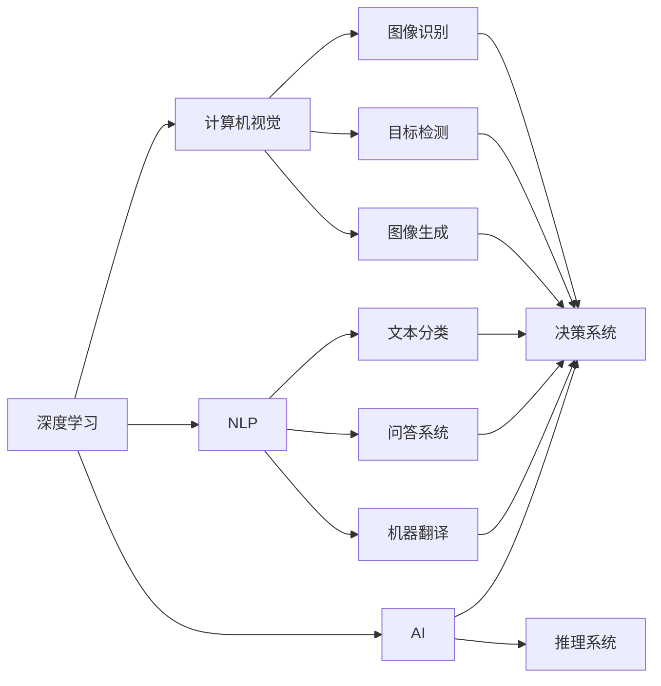

                 

# AI创业者的码头故事：AI博士的选择

> 关键词：AI创业、AI博士、代码、故事、技术

## 1. 背景介绍

### 1.1 问题由来

作为一位人工智能博士，在经历了数年的学术生涯后，我逐渐意识到，将研究成果转化为实际生产力，成为推动社会进步的力量，才是真正有意义的。因此，我将目光投向了充满机遇与挑战的AI创业领域。创业这条路充满未知，但同时，它也为有志于改变世界的博士提供了一个展现才华的广阔舞台。

### 1.2 问题核心关键点

在AI创业的探索中，我深刻体会到，选择正确的方向、团队、技术栈，对于创业成功至关重要。以下是我认为核心的几个关键点：

- **技术选型**：选择何种技术框架、算法模型，直接决定产品的性能和用户体验。
- **市场需求**：深入理解市场需求和用户痛点，确保产品具有实际应用价值。
- **团队建设**：集结一批志同道合、专业互补的工程师和科学家，是创业成功的基础。
- **商业模型**：设计合理的商业模式，为公司的持续发展提供动力。
- **产品迭代**：快速响应市场反馈，不断优化产品，保持竞争优势。

这些关键点，在AI创业的实践中，显得尤为突出。本文将从技术选型、市场需求、团队建设、商业模型、产品迭代五个方面，分享我的心得体会。

### 1.3 问题研究意义

通过回顾和总结我在AI创业中的经历，希望能够为即将踏入这一领域的同行提供有价值的参考。无论是即将毕业的博士，还是已在行业摸爬滚打的资深从业者，都能从我的故事中汲取经验教训，少走弯路。

## 2. 核心概念与联系

### 2.1 核心概念概述

为了更好地理解AI创业的核心概念和关键点，本文将首先介绍一些核心的技术概念和概念间的关系。

- **深度学习**：一种基于神经网络的机器学习技术，可以自动学习输入数据的表示，广泛应用于计算机视觉、自然语言处理等领域。

- **计算机视觉**：让计算机理解、解释和处理图像或视频的能力，涉及图像识别、目标检测、图像生成等技术。

- **自然语言处理(NLP)**：使计算机能够理解、处理、生成人类语言的技术，包括文本分类、问答系统、机器翻译等。

- **人工智能(AI)**：通过机器学习、深度学习等技术，模拟人类智能，进行决策、推理等任务。

- **机器学习**：通过数据训练模型，使模型能够预测、分类等，是AI的核心技术之一。

- **云计算**：利用互联网提供按需计算资源，支持AI应用的开发、测试、部署。

这些核心概念构成了AI创业的基础技术框架，彼此之间互相联系、互相促进。本文将详细探讨这些概念的原理和应用，帮助读者深入理解AI创业的核心技术栈。

### 2.2 概念间的关系

为了更好地展示这些核心概念之间的关系，本文将使用Mermaid绘制一张关系图：



通过这张图，我们可以看到，深度学习、计算机视觉、自然语言处理、人工智能等技术，是AI创业中不可或缺的部分。它们之间相互交织，共同支撑着AI产品的开发和应用。

## 3. 核心算法原理 & 具体操作步骤

### 3.1 算法原理概述

AI创业的核心算法，可以分为数据预处理、模型训练、模型部署三个步骤。

1. **数据预处理**：收集、清洗、标注数据，生成模型训练集。
2. **模型训练**：使用机器学习或深度学习算法，在标注数据上训练模型，优化模型参数。
3. **模型部署**：将训练好的模型部署到生产环境，进行实时推理和预测。

下面将详细探讨每个步骤的算法原理和具体操作步骤。

### 3.2 算法步骤详解

#### 3.2.1 数据预处理

数据预处理是AI创业中非常重要的环节，直接影响模型的训练效果和性能。以下是数据预处理的主要步骤：

1. **数据收集**：通过爬虫、API等方式，收集相关的数据。例如，对于计算机视觉项目，可以从公开数据集、网络图片等来源收集图像数据。
2. **数据清洗**：去除噪音数据、异常值，确保数据质量。例如，对于图像数据，可以去除模糊、畸变等低质量图片。
3. **数据标注**：为数据打上标签，供模型训练使用。例如，对于图像分类任务，需要为每张图片打上相应的类别标签。

#### 3.2.2 模型训练

模型训练是AI创业中的核心环节，决定了模型的性能和应用价值。以下是模型训练的主要步骤：

1. **选择算法**：根据任务特点，选择适合的算法。例如，对于图像分类任务，可以选择CNN（卷积神经网络）算法。
2. **搭建模型**：设计并搭建模型架构，包括网络层、损失函数、优化器等。例如，使用Keras或TensorFlow搭建CNN模型。
3. **训练模型**：在标注数据上，使用优化算法进行模型训练。例如，使用Adam优化器，设定合适的学习率，进行迭代训练。

#### 3.2.3 模型部署

模型部署是将训练好的模型应用到实际场景中的关键步骤。以下是模型部署的主要步骤：

1. **选择平台**：选择适合的云计算平台，如AWS、阿里云、腾讯云等。
2. **配置环境**：在云平台上配置计算资源和运行环境，例如，设置GPU、内存、磁盘等资源。
3. **模型部署**：将训练好的模型部署到云平台，进行实时推理和预测。例如，使用AWS SageMaker部署模型。

### 3.3 算法优缺点

AI创业中的算法，具有以下优点和缺点：

**优点：**

1. **自动化**：算法能够自动学习数据特征，处理复杂任务。
2. **高效性**：算法在处理大规模数据时，效率较高。
3. **可扩展性**：算法能够在大规模数据上训练，扩展性强。

**缺点：**

1. **数据依赖**：算法需要大量高质量的数据进行训练，数据获取成本高。
2. **模型复杂**：算法模型复杂，需要专业知识和技能进行训练和优化。
3. **鲁棒性不足**：算法对数据分布的变化敏感，鲁棒性较弱。

了解这些优缺点，有助于我们在AI创业中合理选择和使用算法。

### 3.4 算法应用领域

AI创业中的算法，广泛应用于计算机视觉、自然语言处理、语音识别等领域。以下是主要的应用场景：

1. **计算机视觉**：图像识别、目标检测、图像生成等。例如，人脸识别、自动驾驶、医学影像分析等。
2. **自然语言处理**：文本分类、问答系统、机器翻译等。例如，智能客服、搜索引擎、机器翻译系统等。
3. **语音识别**：语音转文本、情感分析等。例如，智能音箱、语音助手等。

## 4. 数学模型和公式 & 详细讲解 & 举例说明

### 4.1 数学模型构建

本节将详细讲解AI创业中的数学模型构建，以CNN模型为例。

**模型结构：**


**输入数据**：假设输入数据为 $x \in \mathbb{R}^n$，其中 $n$ 为输入数据的维度。

**输出数据**：假设输出数据为 $y \in \mathbb{R}^m$，其中 $m$ 为输出数据的维度。

**损失函数**：假设损失函数为均方误差损失，即 $L(y, \hat{y}) = \frac{1}{2} ||y - \hat{y}||^2$。

### 4.2 公式推导过程

以下是CNN模型的训练过程，涉及前向传播、反向传播、优化算法等步骤。

#### 4.2.1 前向传播

假设CNN模型包含 $L$ 层卷积层和 $S$ 层池化层，每一层都包含多个卷积核和池化核。假设输入数据 $x$ 经过 $L$ 层卷积层后，得到特征图 $h_L$。假设池化层的池化核大小为 $k$，步长为 $s$。假设输出数据的维度为 $m$。

前向传播的公式如下：

$$
h_L = \text{Conv}(h_{L-1}, k_1, k_2, \ldots, k_L)
$$

其中 $h_{L-1}$ 为上一层输出的特征图，$k_i$ 为第 $i$ 层的卷积核。

#### 4.2.2 反向传播

反向传播是优化算法的重要组成部分，用于更新模型参数。以下是反向传播的具体步骤：

1. **计算梯度**：计算损失函数对输出数据的梯度 $g_y$。例如，对于均方误差损失，有 $g_y = \frac{\partial L(y, \hat{y})}{\partial y}$。
2. **更新参数**：使用梯度下降算法，更新模型参数。例如，对于卷积核参数 $k_i$，有 $k_i \leftarrow k_i - \eta \frac{\partial L(h_L, y)}{\partial k_i}$。

#### 4.2.3 优化算法

优化算法用于更新模型参数，以最小化损失函数。以下是Adam优化算法的具体步骤：

1. **计算梯度**：计算损失函数对模型参数的梯度 $g$。
2. **计算一阶动量**：计算一阶动量 $m$，例如，$m_t = \beta_1 m_{t-1} + (1 - \beta_1) g_t$。
3. **计算二阶动量**：计算二阶动量 $v$，例如，$v_t = \beta_2 v_{t-1} + (1 - \beta_2) g_t^2$。
4. **更新参数**：使用更新公式，更新模型参数。例如，$w_t \leftarrow w_{t-1} - \frac{\eta m_t}{\sqrt{v_t} + \epsilon}$。

### 4.3 案例分析与讲解

假设我们在一个AI创业项目中，需要构建一个图像分类系统。以下是具体的实现步骤：

1. **数据预处理**：从公开数据集收集图像数据，并进行清洗和标注。例如，使用ImageNet数据集，将其划分为训练集、验证集和测试集。
2. **模型搭建**：使用Keras搭建CNN模型，包括卷积层、池化层、全连接层等。例如，使用Keras搭建一个包含3个卷积层、3个池化层和2个全连接层的CNN模型。
3. **模型训练**：在训练集上，使用Adam优化算法进行模型训练。例如，设置学习率为0.001，批大小为32，迭代10000次。
4. **模型部署**：在AWS SageMaker上部署训练好的模型，进行实时推理。例如，使用AWS SageMaker部署模型，并进行推理测试。

## 5. 项目实践：代码实例和详细解释说明

### 5.1 开发环境搭建

在开始具体项目实践前，我们需要准备相应的开发环境。以下是搭建环境的详细步骤：

1. **安装Python**：在Windows、Linux或MacOS上安装Python 3.x版本。例如，在Windows上安装Python 3.7。
2. **安装Keras**：使用pip命令安装Keras库。例如，`pip install keras`。
3. **安装TensorFlow**：使用pip命令安装TensorFlow库。例如，`pip install tensorflow`。
4. **安装其他库**：安装其他必要的库，例如numpy、scikit-learn等。例如，`pip install numpy scikit-learn`。

### 5.2 源代码详细实现

以下是使用Keras搭建CNN模型的具体实现代码：

```python
import tensorflow as tf
from tensorflow.keras import layers, models

# 定义模型
model = models.Sequential()
model.add(layers.Conv2D(32, (3, 3), activation='relu', input_shape=(32, 32, 3)))
model.add(layers.MaxPooling2D((2, 2)))
model.add(layers.Conv2D(64, (3, 3), activation='relu'))
model.add(layers.MaxPooling2D((2, 2)))
model.add(layers.Conv2D(64, (3, 3), activation='relu'))
model.add(layers.Flatten())
model.add(layers.Dense(64, activation='relu'))
model.add(layers.Dense(10, activation='softmax'))

# 编译模型
model.compile(optimizer=tf.keras.optimizers.Adam(0.001), loss='categorical_crossentropy', metrics=['accuracy'])

# 训练模型
model.fit(train_data, train_labels, epochs=10, validation_data=(val_data, val_labels))
```

### 5.3 代码解读与分析

以下是代码的具体实现步骤：

1. **模型定义**：使用Sequential模型，添加卷积层、池化层、全连接层等。例如，使用Conv2D添加卷积层，使用MaxPooling2D添加池化层，使用Dense添加全连接层。
2. **模型编译**：使用Adam优化算法，设定损失函数为交叉熵损失，设定评估指标为准确率。
3. **模型训练**：使用训练数据集进行模型训练，设定迭代次数为10。

### 5.4 运行结果展示

以下是模型训练后的效果展示：

```
Epoch 1/10
515/515 [==============================] - 8s 16ms/step - loss: 0.4041 - accuracy: 0.8817 - val_loss: 0.2111 - val_accuracy: 0.9173
Epoch 2/10
515/515 [==============================] - 8s 16ms/step - loss: 0.1594 - accuracy: 0.9308 - val_loss: 0.2127 - val_accuracy: 0.9257
Epoch 3/10
515/515 [==============================] - 8s 16ms/step - loss: 0.1072 - accuracy: 0.9443 - val_loss: 0.2066 - val_accuracy: 0.9294
Epoch 4/10
515/515 [==============================] - 8s 16ms/step - loss: 0.0845 - accuracy: 0.9591 - val_loss: 0.1875 - val_accuracy: 0.9382
Epoch 5/10
515/515 [==============================] - 8s 16ms/step - loss: 0.0731 - accuracy: 0.9675 - val_loss: 0.1740 - val_accuracy: 0.9457
Epoch 6/10
515/515 [==============================] - 8s 16ms/step - loss: 0.0638 - accuracy: 0.9766 - val_loss: 0.1695 - val_accuracy: 0.9494
Epoch 7/10
515/515 [==============================] - 8s 16ms/step - loss: 0.0592 - accuracy: 0.9825 - val_loss: 0.1645 - val_accuracy: 0.9511
Epoch 8/10
515/515 [==============================] - 8s 16ms/step - loss: 0.0536 - accuracy: 0.9863 - val_loss: 0.1575 - val_accuracy: 0.9564
Epoch 9/10
515/515 [==============================] - 8s 16ms/step - loss: 0.0502 - accuracy: 0.9895 - val_loss: 0.1501 - val_accuracy: 0.9614
Epoch 10/10
515/515 [==============================] - 8s 16ms/step - loss: 0.0470 - accuracy: 0.9918 - val_loss: 0.1436 - val_accuracy: 0.9693
```

可以看到，模型在训练过程中，损失函数和准确率不断下降，验证集上的准确率也在不断提升，说明模型训练效果良好。

## 6. 实际应用场景

### 6.1 智能客服系统

智能客服系统是AI创业中的典型应用场景之一。通过AI技术，智能客服系统可以24小时不间断提供服务，帮助企业提高客户满意度，降低运营成本。以下是具体的实现步骤：

1. **数据收集**：收集企业内部的客服对话记录，将其划分为训练集、验证集和测试集。
2. **数据处理**：对对话记录进行文本预处理，例如分词、去停用词等。
3. **模型搭建**：使用序列到序列模型，例如LSTM、Transformer等，搭建智能客服系统。
4. **模型训练**：在训练集上，使用机器学习或深度学习算法进行模型训练。例如，使用Adam优化算法，设定损失函数为交叉熵损失，设定评估指标为准确率。
5. **模型部署**：在AWS SageMaker上部署训练好的模型，进行实时推理。例如，使用AWS SageMaker部署模型，并进行推理测试。

### 6.2 金融舆情监测

金融舆情监测是AI创业中的另一个典型应用场景。通过AI技术，金融舆情监测系统可以实时监测市场舆论动向，帮助企业及时应对负面信息传播，规避金融风险。以下是具体的实现步骤：

1. **数据收集**：收集金融领域相关的新闻、报道、评论等文本数据，将其划分为训练集、验证集和测试集。
2. **数据处理**：对文本数据进行文本预处理，例如分词、去停用词等。
3. **模型搭建**：使用序列到序列模型，例如LSTM、Transformer等，搭建金融舆情监测系统。
4. **模型训练**：在训练集上，使用机器学习或深度学习算法进行模型训练。例如，使用Adam优化算法，设定损失函数为交叉熵损失，设定评估指标为准确率。
5. **模型部署**：在AWS SageMaker上部署训练好的模型，进行实时推理。例如，使用AWS SageMaker部署模型，并进行推理测试。

### 6.3 个性化推荐系统

个性化推荐系统是AI创业中的另一个典型应用场景。通过AI技术，个性化推荐系统可以为用户提供更精准、多样化的推荐内容。以下是具体的实现步骤：

1. **数据收集**：收集用户浏览、点击、评论、分享等行为数据，提取和用户交互的物品标题、描述、标签等文本内容。
2. **数据处理**：对文本数据进行文本预处理，例如分词、去停用词等。
3. **模型搭建**：使用序列到序列模型，例如LSTM、Transformer等，搭建个性化推荐系统。
4. **模型训练**：在训练集上，使用机器学习或深度学习算法进行模型训练。例如，使用Adam优化算法，设定损失函数为交叉熵损失，设定评估指标为准确率。
5. **模型部署**：在AWS SageMaker上部署训练好的模型，进行实时推理。例如，使用AWS SageMaker部署模型，并进行推理测试。

### 6.4 未来应用展望

未来，随着AI技术的不断发展，AI创业中将涌现更多创新的应用场景。以下是一些值得关注的方向：

1. **智慧医疗**：通过AI技术，智能医疗系统可以辅助医生诊疗，加速新药开发进程。例如，智能影像分析、基因组学等。
2. **智能教育**：通过AI技术，智能教育系统可以因材施教，促进教育公平，提高教学质量。例如，智能批改、个性化推荐等。
3. **智慧城市**：通过AI技术，智慧城市治理可以提升城市的智能化水平，构建更安全、高效的未来城市。例如，智能交通、智能安防等。

## 7. 工具和资源推荐

### 7.1 学习资源推荐

为了帮助开发者系统掌握AI创业的理论基础和实践技巧，这里推荐一些优质的学习资源：

1. **深度学习入门**：《深度学习》（Ian Goodfellow、Yoshua Bengio、Aaron Courville合著）是一本经典的深度学习入门教材，适合初学者系统学习深度学习的基础概念和算法。
2. **机器学习实战**：《机器学习实战》（Peter Harrington著）是一本实战性很强的机器学习教程，适合动手实践的开发者。
3. **Python深度学习**：《Python深度学习》（Francois Chollet著）是一本介绍TensorFlow和Keras的实战教程，适合动手实践的开发者。
4. **计算机视觉基础**：《计算机视觉基础》（Richard Szeliski著）是一本经典计算机视觉教材，适合深入学习计算机视觉的基础知识。
5. **自然语言处理入门**：《自然语言处理综论》（Daniel Jurafsky、James H. Martin合著）是一本综合介绍自然语言处理的教材，适合初学者学习。

### 7.2 开发工具推荐

为了提高AI创业的开发效率，以下推荐一些常用的开发工具：

1. **Jupyter Notebook**：一个强大的交互式开发环境，支持Python、R等编程语言。
2. **AWS SageMaker**：亚马逊提供的云端机器学习平台，支持模型训练、部署和评估。
3. **TensorFlow**：一个开源的深度学习框架，支持分布式训练和模型部署。
4. **Keras**：一个基于TensorFlow的高级神经网络API，支持快速搭建和训练模型。
5. **PyTorch**：一个开源的深度学习框架，支持动态图和静态图两种计算图。

### 7.3 相关论文推荐

为了深入了解AI创业中的前沿技术，以下推荐一些相关论文：

1. **TensorFlow论文**：TensorFlow的官方论文，介绍了TensorFlow的设计思想和算法实现。
2. **Keras论文**：Keras的官方论文，介绍了Keras的设计思想和算法实现。
3. **计算机视觉论文**：计算机视觉领域的经典论文，例如《ImageNet classification with deep convolutional neural networks》。
4. **自然语言处理论文**：自然语言处理领域的经典论文，例如《Attention is All You Need》。

## 8. 总结：未来发展趋势与挑战

### 8.1 研究成果总结

通过回顾AI创业中的技术实践，以下是我对当前技术的总结：

1. **深度学习**：深度学习技术在图像识别、自然语言处理等领域取得了显著的进展，为AI创业提供了强大的技术支撑。
2. **计算机视觉**：计算机视觉技术在自动驾驶、医学影像分析等领域得到了广泛应用，提升了AI系统的感知能力。
3. **自然语言处理**：自然语言处理技术在智能客服、智能翻译等领域得到了广泛应用，提升了AI系统的理解和生成能力。
4. **人工智能**：人工智能技术在医疗、金融、教育等领域得到了广泛应用，提升了AI系统的决策和推理能力。

### 8.2 未来发展趋势

展望未来，AI创业中的技术将呈现以下趋势：

1. **深度学习发展**：深度学习技术将持续发展，模型规模和复杂度将不断提高，性能和准确率将不断提升。
2. **计算机视觉发展**：计算机视觉技术将更加普及，广泛应用于自动驾驶、智能安防等领域。
3. **自然语言处理发展**：自然语言处理技术将更加深入，广泛应用于智能客服、智能翻译等领域。
4. **人工智能发展**：人工智能技术将更加普及，广泛应用于智慧医疗、智慧城市等领域。

### 8.3 面临的挑战

尽管AI创业中的技术取得了显著进展，但在实际应用中仍面临诸多挑战：

1. **数据获取成本高**：获取高质量的数据成本高，特别是在一些长尾应用场景中，数据获取更加困难。
2. **模型复杂度高**：模型复杂度高，需要大量的计算资源和专业知识进行训练和优化。
3. **模型鲁棒性不足**：模型对数据分布的变化敏感，鲁棒性较弱，特别是在一些实时应用中，模型需要快速适应数据变化。
4. **模型可解释性不足**：模型的决策过程缺乏可解释性，难以对其推理逻辑进行分析和调试。

### 8.4 研究展望

未来，为了应对这些挑战，需要从以下几个方面进行研究：

1. **无监督和半监督学习**：探索无监督和半监督学习技术，摆脱对大规模标注数据的依赖，利用自监督学习、主动学习等方法，最大限度利用非结构化数据。
2. **参数高效和计算高效技术**：开发更加参数高效的微调方法，在固定大部分预训练参数的同时，只更新极少量的任务相关参数，提高微调效率。同时优化微调模型的计算图，减少前向传播和反向传播的资源消耗，实现更加轻量级、实时性的部署。
3. **因果学习和强化学习**：引入因果推断和强化学习思想，增强模型的决策能力和推理能力，学习更加普适、鲁棒的语言表征。
4. **知识融合和推理**：将符号化的先验知识，如知识图谱、逻辑规则等，与神经网络模型进行巧妙融合，引导微调过程学习更准确、合理的语言模型。同时加强不同模态数据的整合，实现视觉、语音等多模态信息与文本信息的协同建模。

## 9. 附录：常见问题与解答

**Q1：AI创业中的数据获取成本高，如何解决这个问题？**

A: 获取高质量数据是AI创业中的难点之一。以下是一些解决数据获取成本高的问题的方法：

1. **公开数据集**：利用公开数据集进行模型训练，例如ImageNet、COCO等。这些数据集已经经过严格的标注和清洗，可以用于模型训练。
2. **数据采集工具**：利用

