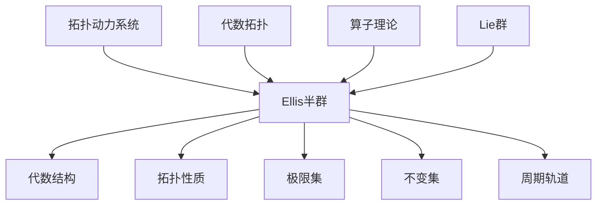

# 拓扑动力系统概论：Ellis半群

## 1. 背景介绍

### 1.1 问题的由来

在研究动力系统的过程中,人们发现许多动力系统存在着一些共性,这些共性可以用拓扑动力系统的概念来刻画和研究。拓扑动力系统是动力系统理论和拓扑学的交叉领域,它将动力系统的概念与拓扑学的概念相结合,形成了一个新的研究领域。

拓扑动力系统的研究对象是一个拓扑空间X上的一个连续变换群,即一个由连续变换组成的群。这个群作用于拓扑空间X上,从而在X上诱导出一个动力系统。拓扑动力系统的研究重点在于研究这个动力系统的性质,特别是它的不变集、极限集、周期轨道等。

在拓扑动力系统的研究中,Ellis半群扮演着非常重要的角色。Ellis半群是一个代数结构,它描述了一个拓扑动力系统中所有可能的运动轨迹。通过研究Ellis半群的结构,我们可以深入了解拓扑动力系统的动态行为。

### 1.2 研究现状

Ellis半群的概念最早由Robert Ellis在20世纪60年代提出,他将它应用于研究拓扑动力系统的极限集。自从Ellis半群被引入以来,它在拓扑动力系统的研究中扮演着越来越重要的角色。

许多著名的数学家,如Joseph Auslander、Jon Aaronson、Ethan Akin等,都对Ellis半群进行了深入的研究。他们探索了Ellis半群的代数结构、拓扑性质,以及它与拓扑动力系统之间的联系。

近年来,Ellis半群的研究也扩展到了其他领域,如代数拓扑、算子理论、Lie群等。Ellis半群不仅在纯数学领域有重要应用,在物理学、生物学等其他科学领域也有一些应用。

### 1.3 研究意义

研究Ellis半群对于深入理解拓扑动力系统的动态行为具有重要意义。通过Ellis半群,我们可以刻画一个拓扑动力系统中所有可能的运动轨迹,从而更好地理解系统的不变集、极限集、周期轨道等重要概念。

此外,Ellis半群本身也是一个丰富的数学结构,它与其他数学领域(如代数、拓扑学、算子理论等)存在着密切联系。研究Ellis半群不仅可以促进拓扑动力系统理论的发展,也有助于拓展其他数学领域的研究。

### 1.4 本文结构

本文将从以下几个方面对Ellis半群进行全面介绍:

1. 核心概念与联系
2. 核心算法原理与具体操作步骤
3. 数学模型和公式详细讲解与举例说明
4. 项目实践:代码实例和详细解释说明
5. 实际应用场景
6. 工具和资源推荐
7. 总结:未来发展趋势与挑战
8. 附录:常见问题与解答

## 2. 核心概念与联系

Ellis半群是拓扑动力系统理论中的一个核心概念。它描述了一个拓扑动力系统中所有可能的运动轨迹,因此对于理解系统的动态行为至关重要。

Ellis半群本身是一个代数结构,具有丰富的代数性质。它不仅与拓扑动力系统的其他概念(如极限集、不变集、周期轨道等)密切相关,而且还与其他数学领域(如代数拓扑、算子理论、Lie群等)存在联系。

通过研究Ellis半群的代数结构和拓扑性质,我们可以深入了解拓扑动力系统的动态行为。同时,Ellis半群也为其他数学领域的研究提供了新的视角和工具。

## 3. 核心算法原理与具体操作步骤

### 3.1 算法原理概述

Ellis半群的构造过程可以概括为以下几个步骤:

1. 给定一个拓扑动力系统$(X, T)$,其中$X$是一个拓扑空间,而$T$是作用于$X$上的一个连续变换群。

2. 定义$X$上的等价关系$\sim$,对于任意$x, y \in X$,如果它们的正半轨道$\{T^n(x) | n \geq 0\}$和$\{T^n(y) | n \geq 0\}$在$X$中有相同的闭包,则称$x \sim y$。

3. 在$X$的等价类空间$X/\sim$上引入一个新的拓扑,使得投射映射$\pi: X \rightarrow X/\sim$成为连续映射。

4. 在$X/\sim$上定义一个新的变换$\hat{T}$,对于任意$[x] \in X/\sim$,有$\hat{T}([x]) = [T(x)]$。可以证明$\hat{T}$是$X/\sim$上的一个连续变换。

5. 集合$E(X, T) = \overline{\{\hat{T}^n | n \in \mathbb{Z}_+\}}$被称为$(X, T)$的Ellis半群,其中$\overline{(\cdot)}$表示闭包运算。

Ellis半群$E(X, T)$是$X/\sim$上的一个半群,它描述了$(X, T)$中所有可能的运动轨迹。Ellis半群的代数结构和拓扑性质对于研究拓扑动力系统的动态行为至关重要。

### 3.2 算法步骤详解

1. **确定拓扑动力系统$(X, T)$**

给定一个拓扑空间$X$和一个作用于$X$上的连续变换群$T$,它们共同构成了一个拓扑动力系统$(X, T)$。

2. **定义等价关系$\sim$**

对于任意$x, y \in X$,如果它们的正半轨道$\{T^n(x) | n \geq 0\}$和$\{T^n(y) | n \geq 0\}$在$X$中有相同的闭包,则称$x \sim y$。形式上,我们有:

$$
x \sim y \Leftrightarrow \overline{\{T^n(x) | n \geq 0\}} = \overline{\{T^n(y) | n \geq 0\}}
$$

可以验证$\sim$确实是$X$上的一个等价关系。

3. **构造等价类空间$X/\sim$**

令$[x] = \{y \in X | y \sim x\}$表示$x$的等价类,则$X/\sim = \{[x] | x \in X\}$是$X$的等价类空间。在$X/\sim$上引入一个新的拓扑,使得投射映射$\pi: X \rightarrow X/\sim$成为连续映射。

4. **定义变换$\hat{T}$**

在$X/\sim$上定义一个新的变换$\hat{T}$,对于任意$[x] \in X/\sim$,有$\hat{T}([x]) = [T(x)]$。可以证明$\hat{T}$是$X/\sim$上的一个连续变换。

5. **构造Ellis半群$E(X, T)$**

集合$E(X, T) = \overline{\{\hat{T}^n | n \in \mathbb{Z}_+\}}$被称为$(X, T)$的Ellis半群,其中$\overline{(\cdot)}$表示闭包运算。Ellis半群$E(X, T)$是$X/\sim$上的一个半群,它描述了$(X, T)$中所有可能的运动轨迹。

### 3.3 算法优缺点

**优点:**

- Ellis半群提供了一种代数化的方法来研究拓扑动力系统的动态行为,使得问题的研究更加简洁和紧凑。
- Ellis半群的构造过程具有一定的普遍性,可以应用于广泛的拓扑动力系统。
- Ellis半群的代数结构和拓扑性质为深入理解拓扑动力系统提供了有力的工具。

**缺点:**

- Ellis半群的构造过程相对复杂,需要一定的数学基础知识。
- Ellis半群的计算通常比较困难,特别是对于一些复杂的拓扑动力系统。
- Ellis半群只能描述正半轨道的行为,对于负半轨道的行为可能无法很好地刻画。

### 3.4 算法应用领域

Ellis半群的概念和理论不仅在拓扑动力系统领域有重要应用,也被广泛应用于其他数学领域,如:

- **代数拓扑:** Ellis半群为研究代数拓扑中的一些问题提供了新的视角和工具。
- **算子理论:** Ellis半群在研究算子半群的极限行为中发挥着重要作用。
- **Lie群:** Ellis半群被用于研究Lie群上的动力系统。
- **编码理论:** Ellis半群在研究符号动力系统和编码理论中有一些应用。
- **物理学:** Ellis半群在研究某些物理系统的动力学行为中有应用。
- **生物学:** Ellis半群在研究一些生物系统的动力学模型中也有应用。

总的来说,Ellis半群是一个富有挑战性和应用前景的研究领域,它不仅在纯数学领域有重要意义,也为其他科学领域的研究提供了新的思路和方法。

## 4. 数学模型和公式详细讲解与举例说明

### 4.1 数学模型构建

为了构建Ellis半群的数学模型,我们需要引入一些基本概念和符号:

- 设$(X, T)$是一个拓扑动力系统,其中$X$是一个拓扑空间,而$T$是作用于$X$上的一个连续变换群。
- 对于任意$x \in X$,定义$x$的正半轨道为$\mathrm{Orb}^+(x) = \{T^n(x) | n \geq 0\}$。
- 定义$X$上的等价关系$\sim$,对于任意$x, y \in X$,如果$\overline{\mathrm{Orb}^+(x)} = \overline{\mathrm{Orb}^+(y)}$,则称$x \sim y$。
- 令$[x] = \{y \in X | y \sim x\}$表示$x$的等价类,则$X/\sim = \{[x] | x \in X\}$是$X$的等价类空间。
- 在$X/\sim$上定义一个新的变换$\hat{T}$,对于任意$[x] \in X/\sim$,有$\hat{T}([x]) = [T(x)]$。
- Ellis半群$E(X, T)$被定义为$E(X, T) = \overline{\{\hat{T}^n | n \in \mathbb{Z}_+\}}$,其中$\overline{(\cdot)}$表示闭包运算。

Ellis半群$E(X, T)$是$X/\sim$上的一个半群,它描述了$(X, T)$中所有可能的运动轨迹。Ellis半群的代数结构和拓扑性质对于研究拓扑动力系统的动态行为至关重要。

### 4.2 公式推导过程

为了更好地理解Ellis半群的构造过程,我们来推导一些重要的公式和性质。

**引理1:** 对于任意$x, y \in X$,如果$x \sim y$,则对于任意$n \in \mathbb{Z}_+$,有$T^n(x) \sim T^n(y)$。

**证明:** 假设$x \sim y$,则$\overline{\mathrm{Orb}^+(x)} = \overline{\mathrm{Orb}^+(y)}$。对于任意$n \in \mathbb{Z}_+$,我们有:

$$
\begin{aligned}
\overline{\mathrm{Orb}^+(T^n(x))} &= \overline{\{T^m(T^n(x)) | m \geq 0\}} \
&= \overline{\{T^{m+n}(x) | m \geq 0\}} \
&= \overline{\mathrm{Orb}^+(x)} \
&= \overline{\mathrm{Orb}^+(y)} \
&= \overline{\{T^{m+n}(y) | m \geq 0\}} \
&= \overline{\{T^m(T^n(y)) | m \geq 0\}} \
&= \overline{\mathrm{Orb}^+(T^n(y))}
\end{aligned}
$$

因此,我们有$\overline{\mathrm{Orb}^+(T^n(