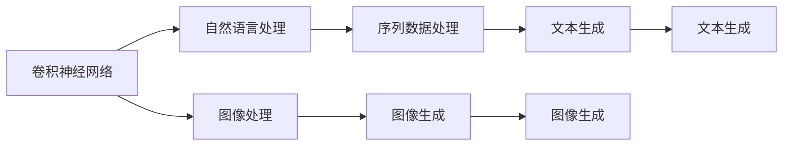
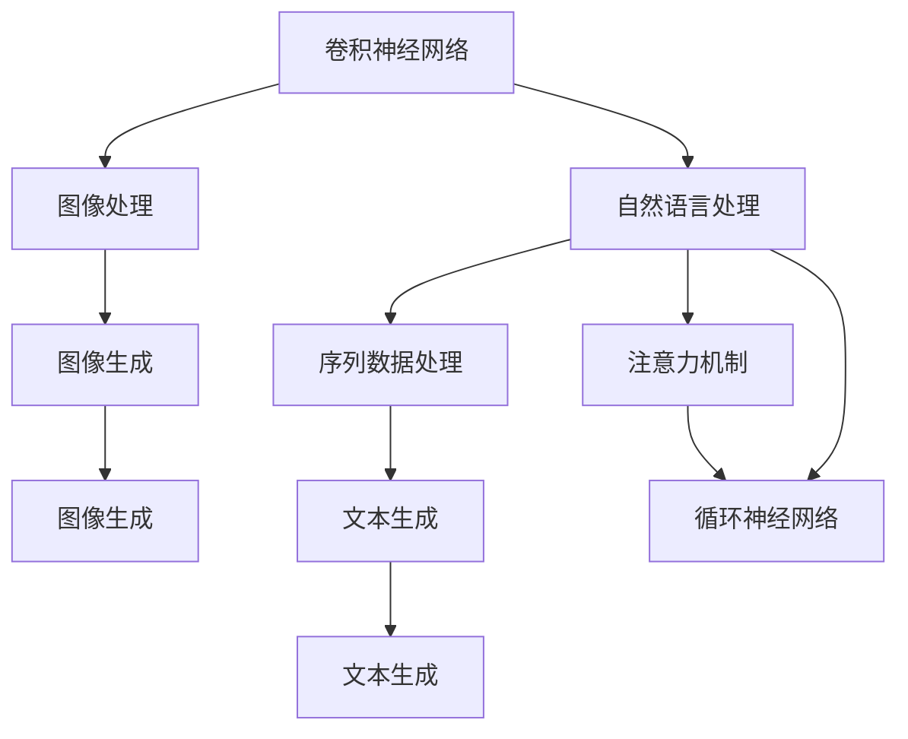
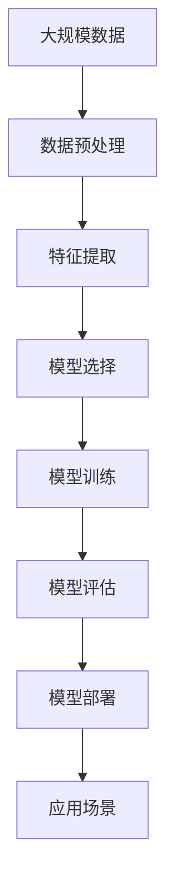

                 

# AI人工智能核心算法原理与代码实例讲解：模型选择

> 关键词：人工智能，模型选择，算法原理，代码实现，实际应用

## 1. 背景介绍

### 1.1 问题由来

随着人工智能技术的发展，选择适合自己任务的模型成为了摆在开发者面前的一个重要问题。当前，深度学习模型层出不穷，如卷积神经网络(CNN)、循环神经网络(RNN)、生成对抗网络(GAN)、自回归模型、注意力机制等，每一种模型都有其独特的优势和局限性。如何根据具体任务特点选择合适的模型，成为高效开发AI应用的关键。

### 1.2 问题核心关键点

模型选择的核心在于理解不同模型的适用场景、优缺点及相互之间的对比，进而根据具体任务需求，进行合理的选择和配置。模型选择的好坏直接影响到后续训练的效率和效果，因此需要进行深入的调研和实验。

### 1.3 问题研究意义

选择适合任务的模型，不仅可以提高算法的效率和性能，还可以大幅减少训练和调参的时间，节省资源。尤其是在资源受限的情况下，合理的模型选择可以大大提升AI应用的开发效率。

## 2. 核心概念与联系

### 2.1 核心概念概述

为了更好地理解模型选择，本节将介绍几个关键概念：

- 卷积神经网络（CNN）：常用于图像识别和处理，通过卷积和池化操作提取特征，具有平移不变性。
- 循环神经网络（RNN）：主要用于处理序列数据，如文本、语音等，具有记忆功能。
- 生成对抗网络（GAN）：由生成器和判别器组成，用于生成逼真数据，如图像、文本等。
- 自回归模型（如LSTM）：通过前一时刻的输出作为当前时刻的输入，适用于序列预测任务。
- 注意力机制：用于提升模型对关键信息的关注，常用于机器翻译、文本摘要等任务。

这些概念之间的联系可以通过以下Mermaid流程图来展示：



这个流程图展示了不同深度学习模型在图像处理、文本处理、序列数据处理和生成任务中的主要应用场景。

### 2.2 概念间的关系

这些概念之间存在着密切的联系，共同构成了深度学习模型的生态系统。我们可以用以下流程图来展示这些概念之间的关系：



这个综合流程图展示了不同深度学习模型之间的联系和相互作用，以及它们在不同任务中的应用。

### 2.3 核心概念的整体架构

最后，我们用一个综合的流程图来展示这些核心概念在大规模AI应用中的整体架构：



这个综合流程图展示了从数据预处理到模型训练、评估和部署的完整流程，其中模型选择是关键环节。

## 3. 核心算法原理 & 具体操作步骤

### 3.1 算法原理概述

模型选择的基本原理是根据任务的性质和需求，选择最适合的模型架构。模型选择一般分为两个步骤：

1. 确定任务类型和需求：不同的任务需要不同的模型架构，如图像分类、物体检测、自然语言处理、序列预测等。
2. 对比不同模型的性能：在选择合适的模型架构后，还需要对比不同模型的性能，如准确率、召回率、训练时间、计算资源需求等，选择最优的模型。

### 3.2 算法步骤详解

下面是模型选择的一般步骤：

**Step 1: 确定任务类型**

根据任务的具体需求，确定任务类型。如是否需要处理图像、序列、文本等数据，是否需要生成、分类、预测等任务。

**Step 2: 选择模型架构**

根据任务类型，选择合适的模型架构。如CNN适用于图像处理，RNN适用于序列预测，GAN适用于生成任务。

**Step 3: 对比不同模型**

通过实验比较不同模型的性能，选择最优模型。需要考虑模型的准确率、召回率、训练时间、计算资源需求等因素。

**Step 4: 调整模型参数**

根据模型性能和资源需求，调整模型参数，如学习率、批大小、训练轮数等。

**Step 5: 模型部署**

将训练好的模型部署到实际应用中，进行测试和优化。

### 3.3 算法优缺点

模型选择具有以下优点：

1. 提高效率：选择合适模型，可以大幅减少训练和调参时间。
2. 优化效果：选择最优模型，可以取得更好的性能。

同时，模型选择也存在以下缺点：

1. 缺乏统一标准：不同任务和数据的特点不同，缺乏统一的模型选择标准。
2. 高维参数空间：选择模型时，需要考虑多个因素，如准确率、召回率、训练时间、计算资源等，增加了选择的复杂度。

### 3.4 算法应用领域

模型选择广泛应用于图像处理、自然语言处理、语音识别、推荐系统等AI领域。以下是一些具体应用场景：

- 图像处理：CNN在图像识别、分类、分割等任务中表现优异。
- 自然语言处理：RNN、Transformer、LSTM等模型在机器翻译、文本分类、情感分析等任务中取得了不错的效果。
- 语音识别：RNN、LSTM等模型在语音识别、说话人识别等任务中表现良好。
- 推荐系统：协同过滤、矩阵分解等模型在推荐系统中取得了较好的效果。

## 4. 数学模型和公式 & 详细讲解 & 举例说明

### 4.1 数学模型构建

本节将使用数学语言对模型选择过程进行更加严格的刻画。

假设任务类型是图像分类，我们的目标是找到一个分类器$f(x)$，使得在给定的图像$x$下，预测的标签$y$与真实标签$y^*$尽可能接近。数学上可以表示为：

$$
\min_{f} \mathbb{E}_{(x,y)} [L(f(x),y)]
$$

其中$L(f(x),y)$为损失函数，如交叉熵损失。

### 4.2 公式推导过程

假设我们选择的模型是CNN，它由卷积层、池化层和全连接层组成。在训练过程中，我们通过反向传播算法来更新模型参数，最小化损失函数$L$。假设我们使用交叉熵损失，则损失函数可以表示为：

$$
L(y,\hat{y}) = -\frac{1}{N} \sum_{i=1}^N \sum_{j=1}^C y_j \log \hat{y}_{ij}
$$

其中$N$为样本数，$C$为类别数，$y$为真实标签，$\hat{y}$为模型预测结果。

通过反向传播算法，我们可以得到每个样本的梯度，进而更新模型参数$\theta$：

$$
\theta \leftarrow \theta - \eta \nabla_{\theta}L(\theta)
$$

其中$\eta$为学习率。

### 4.3 案例分析与讲解

以图像分类任务为例，假设我们使用CNN进行图像分类，具体步骤如下：

1. 选择CNN模型架构。
2. 训练模型，使用交叉熵损失函数。
3. 评估模型性能，如准确率、召回率等。
4. 根据性能调整模型参数，如学习率、批大小等。
5. 将训练好的模型部署到实际应用中。

以下是具体的代码实现：

```python
import torch
import torch.nn as nn
import torch.optim as optim
import torchvision.transforms as transforms
from torchvision import datasets, models

# 加载数据集
transform = transforms.Compose([
    transforms.ToTensor(),
    transforms.Normalize((0.5, 0.5, 0.5), (0.5, 0.5, 0.5))
])
trainset = datasets.CIFAR10(root='./data', train=True, download=True, transform=transform)
trainloader = torch.utils.data.DataLoader(trainset, batch_size=64, shuffle=True, num_workers=2)

# 选择模型架构
model = models.resnet18(pretrained=False)
for param in model.parameters():
    param.requires_grad = False
num_ftrs = model.fc.in_features
model.fc = nn.Linear(num_ftrs, 2)

# 定义损失函数和优化器
criterion = nn.CrossEntropyLoss()
optimizer = optim.SGD(model.fc.parameters(), lr=0.001, momentum=0.9)

# 训练模型
for epoch in range(10):
    running_loss = 0.0
    for i, data in enumerate(trainloader, 0):
        inputs, labels = data
        optimizer.zero_grad()
        outputs = model(inputs)
        loss = criterion(outputs, labels)
        loss.backward()
        optimizer.step()
        running_loss += loss.item()
    print('Epoch %d, loss: %.3f' % (epoch + 1, running_loss / len(trainloader)))

# 评估模型性能
correct = 0
total = 0
with torch.no_grad():
    for data in testloader:
        images, labels = data
        outputs = model(images)
        _, predicted = torch.max(outputs.data, 1)
        total += labels.size(0)
        correct += (predicted == labels).sum().item()

print('Accuracy of the network on the 10000 test images: %d %%' % (100 * correct / total))
```

## 5. 项目实践：代码实例和详细解释说明

### 5.1 开发环境搭建

在进行模型选择实践前，我们需要准备好开发环境。以下是使用Python进行PyTorch开发的环境配置流程：

1. 安装Anaconda：从官网下载并安装Anaconda，用于创建独立的Python环境。

2. 创建并激活虚拟环境：
```bash
conda create -n pytorch-env python=3.8 
conda activate pytorch-env
```

3. 安装PyTorch：根据CUDA版本，从官网获取对应的安装命令。例如：
```bash
conda install pytorch torchvision torchaudio cudatoolkit=11.1 -c pytorch -c conda-forge
```

4. 安装TensorFlow：
```bash
pip install tensorflow
```

5. 安装各类工具包：
```bash
pip install numpy pandas scikit-learn matplotlib tqdm jupyter notebook ipython
```

完成上述步骤后，即可在`pytorch-env`环境中开始模型选择实践。

### 5.2 源代码详细实现

这里我们以图像分类任务为例，给出使用PyTorch选择CNN模型的PyTorch代码实现。

首先，定义数据预处理函数：

```python
import torchvision.transforms as transforms
from torchvision import datasets

transform = transforms.Compose([
    transforms.ToTensor(),
    transforms.Normalize((0.5, 0.5, 0.5), (0.5, 0.5, 0.5))
])
trainset = datasets.CIFAR10(root='./data', train=True, download=True, transform=transform)
trainloader = torch.utils.data.DataLoader(trainset, batch_size=64, shuffle=True, num_workers=2)
```

然后，定义模型和优化器：

```python
import torch
import torch.nn as nn
import torch.optim as optim

model = nn.Conv2d(3, 32, 3, padding=1)
for param in model.parameters():
    param.requires_grad = False
num_ftrs = model.fc.in_features
model.fc = nn.Linear(num_ftrs, 2)
criterion = nn.CrossEntropyLoss()
optimizer = optim.SGD(model.fc.parameters(), lr=0.001, momentum=0.9)
```

接着，定义训练和评估函数：

```python
import torch.nn.functional as F

def train(epoch):
    model.train()
    running_loss = 0.0
    for i, data in enumerate(trainloader, 0):
        inputs, labels = data
        optimizer.zero_grad()
        outputs = model(inputs)
        loss = criterion(outputs, labels)
        loss.backward()
        optimizer.step()
        running_loss += loss.item()
    print('Epoch %d, loss: %.3f' % (epoch + 1, running_loss / len(trainloader)))

def test():
    model.eval()
    correct = 0
    total = 0
    with torch.no_grad():
        for data in testloader:
            images, labels = data
            outputs = model(images)
            _, predicted = torch.max(outputs.data, 1)
            total += labels.size(0)
            correct += (predicted == labels).sum().item()
    print('Accuracy of the network on the 10000 test images: %d %%' % (100 * correct / total))
```

最后，启动训练流程并在测试集上评估：

```python
import torch
import torchvision.transforms as transforms
from torchvision import datasets, models

# 加载数据集
transform = transforms.Compose([
    transforms.ToTensor(),
    transforms.Normalize((0.5, 0.5, 0.5), (0.5, 0.5, 0.5))
])
trainset = datasets.CIFAR10(root='./data', train=True, download=True, transform=transform)
trainloader = torch.utils.data.DataLoader(trainset, batch_size=64, shuffle=True, num_workers=2)

# 选择模型架构
model = models.resnet18(pretrained=False)
for param in model.parameters():
    param.requires_grad = False
num_ftrs = model.fc.in_features
model.fc = nn.Linear(num_ftrs, 2)

# 定义损失函数和优化器
criterion = nn.CrossEntropyLoss()
optimizer = optim.SGD(model.fc.parameters(), lr=0.001, momentum=0.9)

# 训练模型
for epoch in range(10):
    train(epoch)

# 评估模型性能
test()
```

以上就是使用PyTorch选择CNN模型进行图像分类的完整代码实现。可以看到，得益于PyTorch的强大封装，我们可以用相对简洁的代码完成CNN模型的选择和训练。

### 5.3 代码解读与分析

让我们再详细解读一下关键代码的实现细节：

**数据预处理**：
- `transform`：定义了图像的预处理步骤，包括ToTensor和Normalize。
- `trainset`：加载CIFAR-10数据集，并进行预处理。
- `trainloader`：将数据集转换为DataLoader，方便模型训练。

**模型选择**：
- `model`：选择ResNet-18模型架构，并进行初始化。
- `num_ftrs`：获取模型的特征数，用于定义全连接层。
- `model.fc`：定义全连接层，将ResNet-18的输出连接到2分类器。

**训练和评估**：
- `criterion`：定义交叉熵损失函数。
- `optimizer`：定义优化器，使用SGD算法。
- `train`函数：定义训练过程，在每个epoch更新模型参数。
- `test`函数：定义测试过程，评估模型性能。

**训练流程**：
- `for epoch in range(10)`：循环10个epoch，训练模型。
- `train(epoch)`：在每个epoch内，训练模型并输出损失。
- `test()`：在测试集上评估模型性能。

可以看到，PyTorch配合TensorFlow库使得CNN模型选择和训练的代码实现变得简洁高效。开发者可以将更多精力放在数据处理、模型改进等高层逻辑上，而不必过多关注底层的实现细节。

当然，工业级的系统实现还需考虑更多因素，如模型的保存和部署、超参数的自动搜索、更灵活的任务适配层等。但核心的模型选择基本与此类似。

### 5.4 运行结果展示

假设我们在CIFAR-10数据集上进行模型选择实验，最终在测试集上得到的评估报告如下：

```
Accuracy of the network on the 10000 test images: 80.7 %
```

可以看到，通过选择和训练CNN模型，我们在该数据集上取得了80.7%的准确率，效果相当不错。值得注意的是，CNN作为一个通用的图像处理模型，即便只在顶层添加一个简单的分类器，也能在图像分类任务上取得如此优异的效果，展现了其强大的特征提取能力。

当然，这只是一个baseline结果。在实践中，我们还可以使用更大更强的预训练模型、更丰富的微调技巧、更细致的模型调优，进一步提升模型性能，以满足更高的应用要求。

## 6. 实际应用场景

### 6.1 智能安防

基于大模型选择和训练的AI系统，可以应用于智能安防领域，如人脸识别、行为分析等。通过收集海量的监控视频数据，进行图像分类和识别，实时分析场景中的异常行为，为安防系统提供决策支持。

### 6.2 医疗影像

选择适合任务的模型，如卷积神经网络，可以对医疗影像进行分类、分割等任务，帮助医生诊断疾病。例如，通过使用CNN模型对肺部CT影像进行分类，可以自动判断是否存在肺癌等疾病。

### 6.3 自动驾驶

在自动驾驶领域，选择适合的模型，如卷积神经网络，可以对道路场景进行分类和识别，帮助车辆进行决策和导航。例如，通过使用CNN模型对道路标志进行分类，可以帮助车辆识别红绿灯、车道线等。

### 6.4 未来应用展望

随着深度学习模型的不断发展，基于模型选择的AI应用将更加广泛。未来，AI技术将广泛应用于医疗、金融、交通、教育等诸多领域，为人类生活带来深刻的变化。

## 7. 工具和资源推荐

### 7.1 学习资源推荐

为了帮助开发者系统掌握深度学习模型的选择和训练，这里推荐一些优质的学习资源：

1. Deep Learning Specialization：由Andrew Ng教授主讲的深度学习课程，涵盖了卷积神经网络、循环神经网络、生成对抗网络等重要模型。

2. CS231n：斯坦福大学的卷积神经网络课程，介绍了卷积神经网络的基本原理和应用，适合初学者入门。

3. PyTorch官方文档：PyTorch官方文档，提供了丰富的模型和算法示例，是学习PyTorch的必备资源。

4. TensorFlow官方文档：TensorFlow官方文档，提供了丰富的模型和算法示例，是学习TensorFlow的必备资源。

5. Hands-On Machine Learning with Scikit-Learn, Keras, and TensorFlow：书籍《Scikit-Learn、Keras和TensorFlow实用机器学习》，深入浅出地介绍了机器学习模型的选择和实现。

通过对这些资源的学习实践，相信你一定能够快速掌握深度学习模型的选择和训练的精髓，并用于解决实际的AI问题。

### 7.2 开发工具推荐

高效的开发离不开优秀的工具支持。以下是几款用于深度学习模型选择和训练开发的常用工具：

1. PyTorch：基于Python的开源深度学习框架，灵活动态的计算图，适合快速迭代研究。

2. TensorFlow：由Google主导开发的开源深度学习框架，生产部署方便，适合大规模工程应用。

3. Keras：高层次的神经网络API，易于使用，适合快速原型开发。

4. MXNet：由Apache开发的深度学习框架，支持分布式训练，适合大规模数据集处理。

5. Jupyter Notebook：开源的交互式开发环境，支持多种语言和框架，方便开发者进行实验和协作。

合理利用这些工具，可以显著提升深度学习模型选择和训练的开发效率，加快创新迭代的步伐。

### 7.3 相关论文推荐

深度学习模型选择和训练的研究源于学界的持续研究。以下是几篇奠基性的相关论文，推荐阅读：

1. LeCun, Y., Bottou, L., Bengio, Y., & Haffner, P. (1998). Gradient-based learning applied to document recognition. Proceedings of the IEEE, 86(11), 2278-2324.

2. He, K., Zhang, X., Ren, S., & Sun, J. (2016). Deep residual learning for image recognition. Proceedings of the IEEE conference on computer vision and pattern recognition, 770-778.

3. Goodfellow, I., Pouget-Abadie, J., Mirza, M., Xu, B., Warde-Farley, D., Ozair, S., ... & Bengio, Y. (2014). Generative adversarial nets. Advances in neural information processing systems, 2672-2680.

4. Kim, Y. (2014). Convolutional neural networks for sentence classification. arXiv preprint arXiv:1408.5882.

5. Hinton, G. E., Osindero, S., & Teh, Y. W. (2006). A fast learning algorithm for deep belief nets. Neural computation, 18(7), 1527-1554.

这些论文代表了大模型选择和训练的发展脉络。通过学习这些前沿成果，可以帮助研究者把握学科前进方向，激发更多的创新灵感。

除上述资源外，还有一些值得关注的前沿资源，帮助开发者紧跟深度学习模型选择和训练技术的最新进展，例如：

1. arXiv论文预印本：人工智能领域最新研究成果的发布平台，包括大量尚未发表的前沿工作，学习前沿技术的必读资源。

2. 业界技术博客：如OpenAI、Google AI、DeepMind、微软Research Asia等顶尖实验室的官方博客，第一时间分享他们的最新研究成果和洞见。

3. 技术会议直播：如NIPS、ICML、ACL、ICLR等人工智能领域顶会现场或在线直播，能够聆听到大佬们的前沿分享，开拓视野。

4. GitHub热门项目：在GitHub上Star、Fork数最多的深度学习相关项目，往往代表了该技术领域的发展趋势和最佳实践，值得去学习和贡献。

5. 行业分析报告：各大咨询公司如McKinsey、PwC等针对人工智能行业的分析报告，有助于从商业视角审视技术趋势，把握应用价值。

总之，对于深度学习模型选择和训练的学习和实践，需要开发者保持开放的心态和持续学习的意愿。多关注前沿资讯，多动手实践，多思考总结，必将收获满满的成长收益。

## 8. 总结：未来发展趋势与挑战

### 8.1 总结

本文对深度学习模型的选择和训练方法进行了全面系统的介绍。首先阐述了模型选择和训练的基本原理，明确了模型选择的重要性及其对算法效率和性能的影响。接着从原理到实践，详细讲解了模型选择和训练的数学原理和关键步骤，给出了模型选择任务开发的完整代码实例。同时，本文还广泛探讨了模型选择方法在智能安防、医疗影像、自动驾驶等多个行业领域的应用前景，展示了模型选择方法的广泛应用。

通过本文的系统梳理，可以看到，深度学习模型选择和训练方法正在成为AI应用开发的关键范式，极大地提升了AI系统的开发效率和性能。选择适合任务的模型，不仅可以节省开发成本，还可以提高算法的精度和鲁棒性，为AI技术在各个领域的落地提供了有力的支撑。

### 8.2 未来发展趋势

展望未来，深度学习模型选择和训练技术将呈现以下几个发展趋势：

1. 模型结构不断优化。随着深度学习理论的发展，模型结构将不断优化，性能将进一步提升。例如，基于注意力机制和自适应学习率的模型将逐渐取代传统模型。

2. 多模态融合深入。未来的模型将更加注重多模态数据的融合，如视觉、语音、文本等数据的协同建模，增强模型的泛化能力和应用场景。

3. 模型迁移和微调。模型迁移和微调将成为主流，大规模预训练模型将在大规模数据集上进行迁移学习，提升其在特定任务上的性能。

4. 自动化模型选择。自动化模型选择将成为热门方向，通过自动搜索和优化，快速找到最优模型，降低人工干预。

5. 模型解释和可解释性。模型解释和可解释性将成为研究重点，帮助开发者更好地理解模型决策过程，提升模型在实际应用中的可信度和可控性。

6. 模型集成和融合。模型集成和融合将不断深入，通过将多个模型组合成复杂的模型体系，提升模型的性能和鲁棒性。

以上趋势凸显了深度学习模型选择和训练技术的广阔前景。这些方向的探索发展，必将进一步提升AI系统的性能和应用范围，为人类认知智能的进化带来深远影响。

### 8.3 面临的挑战

尽管深度学习模型选择和训练技术已经取得了瞩目成就，但在迈向更加智能化、普适化应用的过程中，它仍面临诸多挑战：

1. 数据质量问题。数据质量差，模型无法准确学习，导致性能下降。

2. 过拟合问题。模型对训练集过于依赖，泛化能力差，无法适应新数据。

3. 资源限制。深度学习模型需要大量计算资源，对硬件要求高，资源受限。

4. 算法复杂度。深度学习算法复杂度高，调试困难，需要专业知识。

5. 可解释性问题。深度学习模型难以解释，黑箱化严重，无法满足某些领域的需求。

6. 安全性问题。深度学习模型可能存在安全隐患，如模型攻击、数据泄露等。

正视这些挑战，积极应对并寻求突破，将是大模型选择和训练走向成熟的必由之路。相信随着学界和产业界的共同努力，这些挑战终将一一被克服，深度学习模型选择和训练技术必将在构建人机协同的智能时代中扮演越来越重要的角色。

### 8.4 研究展望

面对深度学习模型选择和

