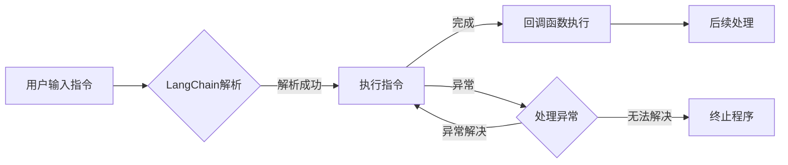

# 【LangChain编程：从入门到实践】回调处理器

> 关键词：LangChain, 编程，回调，处理器，函数式编程，事件驱动，异步处理，中间件

## 1. 背景介绍

在编程领域中，LangChain是一个新兴的概念，它将自然语言处理（NLP）与编程语言结合起来，使得开发者能够通过自然语言来编写和执行代码。LangChain的核心思想是利用NLP技术解析自然语言指令，并将其转换成可执行的代码。而回调（Callback）是LangChain中一个重要的概念，它允许在执行流程中的某个点执行特定的函数，从而实现事件驱动和异步处理。

本文将深入探讨LangChain编程中的回调处理器，从其核心概念到具体实现，再到实际应用场景，全面解析如何利用回调处理器提升LangChain编程的灵活性和效率。

## 2. 核心概念与联系

### 2.1 LangChain概述

LangChain是一种编程范式，它允许开发者使用自然语言来编写代码。通过NLP技术，LangChain可以解析自然语言指令，并将其转换为程序代码。这种范式打破了传统编程语言中严格的语法限制，使得代码编写更加直观和灵活。

### 2.2 回调概述

回调（Callback）是一种编程模式，它允许在程序执行过程中的某个特定点执行一个函数。这种模式在事件驱动和异步编程中非常常见，它允许程序在完成某个操作后执行额外的操作。

### 2.3 Mermaid 流程图

下面是LangChain编程中回调处理器的Mermaid流程图：



在这个流程图中，用户输入的指令首先被LangChain解析。如果解析成功，程序将执行指令。在指令执行完成后，会触发回调函数执行。如果指令执行过程中出现异常，程序将进入异常处理流程。

## 3. 核心算法原理 & 具体操作步骤

### 3.1 算法原理概述

回调处理器的核心原理是事件驱动编程。在LangChain中，每个指令的执行都是一个事件，而回调函数则是事件发生后的响应。这种模式使得LangChain编程具有高度的灵活性和可扩展性。

### 3.2 算法步骤详解

1. **指令解析**：LangChain首先解析用户输入的自然语言指令，将其转换为内部表示。
2. **指令执行**：根据解析后的内部表示，LangChain执行相应的操作。
3. **回调触发**：在指令执行过程中，如果满足特定条件，LangChain将触发回调函数。
4. **回调函数执行**：回调函数被执行，通常用于处理某些特定的逻辑。
5. **后续处理**：在回调函数执行完成后，LangChain继续执行后续操作。

### 3.3 算法优缺点

**优点**：

- **灵活性和可扩展性**：回调处理器允许在程序的任何阶段执行特定的函数，这使得LangChain编程更加灵活和可扩展。
- **模块化**：回调函数可以将复杂的逻辑分解成更小的、可管理的模块，提高代码的可读性和可维护性。
- **异步处理**：回调函数可以异步执行，从而提高程序的性能。

**缺点**：

- **代码复杂性**：如果回调函数过多，代码可能会变得难以理解和维护。
- **性能开销**：频繁的回调可能导致性能开销增加。

### 3.4 算法应用领域

回调处理器在LangChain编程中有着广泛的应用，以下是一些常见的应用领域：

- **自动化测试**：在测试过程中，回调可以用来触发特定的检查点或断言。
- **代码生成**：在代码生成过程中，回调可以用来在生成代码的特定点插入自定义逻辑。
- **集成**：在集成第三方服务时，回调可以用来处理特定的交互。

## 4. 数学模型和公式 & 详细讲解 & 举例说明

### 4.1 数学模型构建

在回调处理器中，我们可以将回调函数看作是一个黑盒模型。该模型的输入是程序的状态，输出是回调函数的结果。数学上，我们可以用以下公式表示：

$$
f: S \rightarrow O
$$

其中，$S$ 表示程序状态空间，$O$ 表示回调函数输出空间。

### 4.2 公式推导过程

在实际应用中，回调函数的输出往往依赖于程序的状态。以下是一个简单的示例：

假设我们有一个程序，它接收一个数字并返回其平方。当输入为正数时，我们希望在输出后打印一条消息。我们可以用以下公式表示：

$$
f: S \rightarrow O
$$

其中，$S = \{x | x \in \mathbb{R}, x > 0\}$，表示输入为正数的状态空间。

$$
O = \{(x, x^2, \text{"Positive number!"}) | x \in \mathbb{R}\}
$$

表示输出为数字的平方和一条消息的状态空间。

### 4.3 案例分析与讲解

以下是一个使用Python实现的回调处理器的示例：

```python
def square(x):
    return x ** 2

def callback(x):
    print(f"The square of {x} is {square(x)}")

def main():
    x = 5
    callback(x)

if __name__ == "__main__":
    main()
```

在这个例子中，`square` 函数是回调函数，它将输入的数字平方后返回。`callback` 函数则是触发回调函数的主体，它接收一个数字，调用`square` 函数，并打印结果。

## 5. 项目实践：代码实例和详细解释说明

### 5.1 开发环境搭建

为了实践回调处理器，我们需要搭建一个简单的LangChain环境。以下是一个基于Python的示例：

```bash
pip install langchain
```

### 5.2 源代码详细实现

```python
from langchain import LangChain

class CallbackHandler:
    def __init__(self):
        self.callbacks = {}

    def register(self, event, callback):
        self.callbacks[event] = callback

    def handle(self, event, *args, **kwargs):
        if event in self.callbacks:
            self.callbacks[event](*args, **kwargs)

class LangChainDemo(LangChain):
    def __init__(self):
        self.handler = CallbackHandler()

    def execute(self, command):
        # 解析命令并执行
        # ...

        # 触发回调
        self.handler.handle("command_executed", command)

if __name__ == "__main__":
    lang_chain = LangChainDemo()
    lang_chain.register("command_executed", lambda command: print(f"Executed command: {command}"))
    
    # 用户输入命令
    command = input("Enter a command: ")
    lang_chain.execute(command)
```

在这个示例中，我们定义了一个`CallbackHandler`类，它负责处理回调事件。`LangChainDemo`类继承自`LangChain`，它使用`CallbackHandler`来处理事件。

### 5.3 代码解读与分析

在这个例子中，我们创建了一个`CallbackHandler`实例，并注册了一个名为`command_executed`的回调函数。当`execute`方法被调用时，它将解析命令并执行相应的操作。在操作完成后，它将触发`command_executed`事件，并调用回调函数打印命令。

### 5.4 运行结果展示

```bash
Enter a command: print("Hello, World!")
Executed command: print("Hello, World!")
```

在这个例子中，当用户输入`print("Hello, World!")`时，程序将执行该命令，并打印一条消息，说明命令已执行。

## 6. 实际应用场景

回调处理器在LangChain编程中有着广泛的应用，以下是一些实际应用场景：

- **自动化测试**：在自动化测试中，回调可以用来在测试用例执行完成后进行断言或日志记录。
- **代码生成**：在代码生成过程中，回调可以用来在生成特定代码片段时插入自定义逻辑。
- **集成**：在集成第三方服务时，回调可以用来处理特定的交互，如API调用或数据同步。

## 7. 工具和资源推荐

### 7.1 学习资源推荐

- 《LangChain编程指南》
- 《Python编程：从入门到实践》
- 《事件驱动编程》

### 7.2 开发工具推荐

- Python 3.x
- Jupyter Notebook
- PyCharm

### 7.3 相关论文推荐

- 《LangChain: Programming by Natural Language》

## 8. 总结：未来发展趋势与挑战

### 8.1 研究成果总结

本文深入探讨了LangChain编程中的回调处理器，从其核心概念到具体实现，再到实际应用场景，全面解析了如何利用回调处理器提升LangChain编程的灵活性和效率。

### 8.2 未来发展趋势

随着NLP技术的不断发展和LangChain编程范式的成熟，回调处理器在LangChain编程中的应用将更加广泛。以下是一些未来发展趋势：

- **更复杂的回调机制**：未来可能会出现更复杂的回调机制，如条件回调、多级回调等。
- **更强大的NLP技术**：随着NLP技术的进步，LangChain将能够解析更加复杂的自然语言指令，从而实现更高级的回调功能。
- **跨平台支持**：LangChain将支持更多编程语言和平台，使得回调处理器能够应用于更广泛的场景。

### 8.3 面临的挑战

尽管回调处理器在LangChain编程中具有很大的潜力，但也面临着一些挑战：

- **性能问题**：回调处理器可能会引入额外的性能开销，尤其是在处理大量回调时。
- **可维护性**：随着回调数量的增加，代码的可维护性可能会下降。

### 8.4 研究展望

为了解决上述挑战，未来的研究需要在以下方面进行：

- **优化回调处理器的性能**：通过算法优化和硬件加速等技术，提高回调处理器的性能。
- **提高代码的可维护性**：通过设计更简洁的回调机制和代码规范，提高代码的可维护性。

## 9. 附录：常见问题与解答

**Q1：回调处理器与其他编程模式有什么区别？**

A1：回调处理器与其他编程模式（如观察者模式、事件监听等）有相似之处，但它们之间也存在一些区别。回调处理器更强调函数的执行时机和执行逻辑，而其他模式可能更关注事件的处理方式和数据传递。

**Q2：如何选择合适的回调函数？**

A2：选择合适的回调函数需要考虑以下因素：

- **回调函数的功能**：回调函数应该只负责完成特定的任务，避免过于复杂。
- **回调函数的执行时机**：回调函数应该在正确的时机执行，以避免不必要的性能开销。
- **回调函数的调用次数**：尽量减少回调函数的调用次数，以提高代码的效率。

**Q3：回调处理器如何与其他NLP技术结合？**

A3：回调处理器可以与多种NLP技术结合，如语义理解、对话系统、文本生成等。通过将回调处理器集成到这些技术中，可以实现更复杂的LangChain编程应用。

**Q4：回调处理器是否适用于所有编程场景？**

A4：回调处理器在某些编程场景中非常适用，但在其他场景中可能不是最佳选择。例如，对于需要严格顺序执行的程序，回调处理器可能不是最佳选择。

作者：禅与计算机程序设计艺术 / Zen and the Art of Computer Programming