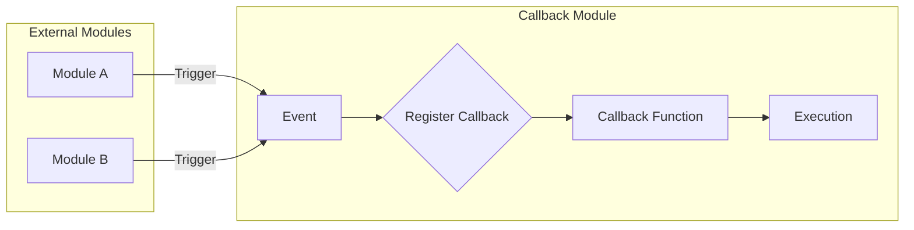

# 【LangChain编程：从入门到实践】回调模块

> 关键词：LangChain, 编程, 回调函数, 模块化, 事件驱动, 软件架构, 集成开发环境 (IDE), 代码复用

## 1. 背景介绍

在软件开发领域，模块化是一个核心概念，它允许开发者将复杂的系统分解为更小、更易于管理的部分。LangChain，作为一个强大的编程框架，旨在简化大型应用程序的开发流程。其中，回调模块是LangChain的重要组成部分，它允许开发者以事件驱动的编程方式来实现代码的灵活性和可扩展性。本文将深入探讨LangChain中的回调模块，从入门到实践，帮助开发者理解和应用这一强大的功能。

### 1.1 问题的由来

随着软件项目的复杂性增加，传统的代码结构往往难以应对日益增长的功能需求。回调函数作为一种编程模式，允许在特定事件发生时执行代码块，从而提供了一种灵活的扩展机制。然而，在大型应用程序中，直接使用回调函数可能会导致代码混乱、难以维护。

### 1.2 研究现状

为了解决回调函数在复杂应用程序中的问题，许多编程语言和框架引入了模块化回调的概念。LangChain通过其回调模块，提供了一种标准的接口，用于定义和注册回调函数，使得开发者能够更方便地集成第三方库和自定义功能。

### 1.3 研究意义

理解并正确使用LangChain的回调模块，可以帮助开发者：
- 提高代码的可读性和可维护性。
- 增强软件的灵活性和可扩展性。
- 实现代码复用，减少重复开发。

### 1.4 本文结构

本文将按照以下结构展开：
- 第二部分介绍回调模块的核心概念与联系。
- 第三部分深入探讨回调模块的原理和操作步骤。
- 第四部分通过数学模型和公式详细讲解回调模块的工作机制。
- 第五部分提供项目实践，包括开发环境搭建、代码实例和运行结果展示。
- 第六部分探讨回调模块在实际应用场景中的使用。
- 第七部分展望回调模块的未来发展趋势和挑战。
- 第八部分总结研究成果，并展望未来的研究方向。

## 2. 核心概念与联系

### 2.1 核心概念

在LangChain中，回调模块的核心概念包括：

- **回调函数**：在特定事件发生时执行的自定义函数。
- **模块**：封装了一组回调函数和相关逻辑的代码块。
- **事件**：触发回调函数的特定条件或动作。
- **注册**：将回调函数与事件关联起来。

### 2.2 架构的 Mermaid 流程图

以下是一个简化的Mermaid流程图，展示了回调模块的基本架构：



在这个流程图中，外部模块（如Module A和Module B）通过触发事件（Trigger）来激活回调模块。回调模块注册了相应的回调函数，这些函数在事件发生时被调用并执行。

## 3. 核心算法原理 & 具体操作步骤

### 3.1 算法原理概述

回调模块的核心原理是基于事件驱动编程模型。当某个事件发生时，系统会自动查找与之关联的回调函数，并执行它们。这种模式使得代码的执行顺序更加灵活，并且可以轻松地添加或移除功能。

### 3.2 算法步骤详解

以下是使用回调模块的基本步骤：

1. **定义回调函数**：编写一个函数，该函数将在特定事件发生时执行。
2. **创建模块**：将回调函数和相关逻辑封装到一个模块中。
3. **注册回调**：将模块与特定事件关联起来。
4. **触发事件**：在适当的时候触发事件，系统将自动执行与该事件关联的回调函数。

### 3.3 算法优缺点

#### 优点

- **灵活性**：回调函数可以在任何需要的地方执行，而无需修改原有代码。
- **可扩展性**：通过添加新的回调函数，可以轻松扩展系统功能。
- **可重用性**：回调函数可以被多个模块共享，提高代码复用性。

#### 缺点

- **复杂性**：如果回调函数数量过多，可能导致代码难以维护。
- **性能开销**：频繁的事件触发和回调函数调用可能影响性能。

### 3.4 算法应用领域

回调模块适用于以下场景：

- **事件驱动应用程序**：如Web应用程序、实时系统等。
- **插件系统**：允许开发者编写插件来扩展系统功能。
- **游戏开发**：处理用户输入和游戏事件。

## 4. 数学模型和公式 & 详细讲解 & 举例说明

### 4.1 数学模型构建

回调模块的数学模型可以简化为一个事件-回调函数映射。设 $E$ 为事件集合，$C$ 为回调函数集合，则回调模块可以表示为一个函数 $f: E \rightarrow C$。

### 4.2 公式推导过程

假设事件 $e \in E$ 触发，则对应的回调函数 $c = f(e)$ 将被执行。这个过程可以表示为：

$$
c = f(e)
$$

### 4.3 案例分析与讲解

以下是一个简单的Python示例，展示了如何使用回调模块：

```python
def on_event():
    print("Event occurred!")

# 创建事件映射
event_map = {}

# 注册回调函数
event_map['event1'] = on_event

# 触发事件
event_map['event1']()
```

在这个示例中，`on_event` 函数是一个回调函数，它将在 `event1` 事件发生时执行。通过将 `on_event` 函数注册到 `event_map`，我们可以在需要的时候触发这个事件。

## 5. 项目实践：代码实例和详细解释说明

### 5.1 开发环境搭建

为了实践LangChain回调模块，你需要安装以下工具：

- Python 3.8+
- virtualenv 或 conda
- requests库

### 5.2 源代码详细实现

以下是一个简单的LangChain回调模块的示例：

```python
# callback_module.py

class CallbackModule:
    def __init__(self):
        self.callbacks = {}
    
    def register_callback(self, event, callback):
        if event not in self.callbacks:
            self.callbacks[event] = []
        self.callbacks[event].append(callback)
    
    def trigger_event(self, event):
        if event in self.callbacks:
            for callback in self.callbacks[event]:
                callback()

# 使用示例
def on_event1():
    print("Event 1 occurred!")

def on_event2():
    print("Event 2 occurred!")

module = CallbackModule()
module.register_callback('event1', on_event1)
module.register_callback('event1', on_event2)
module.trigger_event('event1')
```

### 5.3 代码解读与分析

在这个示例中，`CallbackModule` 类封装了回调函数的注册和触发逻辑。`register_callback` 方法允许注册特定事件的回调函数，而 `trigger_event` 方法则触发指定事件，并执行所有注册的回调函数。

### 5.4 运行结果展示

运行上述代码，将输出以下结果：

```
Event 1 occurred!
Event 2 occurred!
```

这表明 `event1` 事件触发了两个注册的回调函数。

## 6. 实际应用场景

回调模块在实际应用中的场景非常广泛，以下是一些示例：

- **Web应用程序**：在用户点击按钮时触发事件，执行相应的回调函数。
- **游戏开发**：在游戏事件发生时，如玩家得分、怪物攻击等，触发回调函数。
- **操作系统**：在系统事件发生时，如网络连接中断、磁盘空间不足等，触发回调函数。

## 7. 工具和资源推荐

### 7.1 学习资源推荐

- 《Event-Driven Programming》
- 《Design Patterns: Elements of Reusable Object-Oriented Software》
- 《LangChain官方文档》

### 7.2 开发工具推荐

- Python
- Jupyter Notebook
- PyCharm

### 7.3 相关论文推荐

- 《Event-Driven Programming in Python》
- 《A Pattern Language for Event-Driven Systems》

## 8. 总结：未来发展趋势与挑战

### 8.1 研究成果总结

本文介绍了LangChain回调模块的核心概念、原理、操作步骤和应用场景，并通过实际案例展示了如何使用回调模块。回调模块为软件开发提供了一种灵活、可扩展的编程模式，有助于提高代码的可维护性和可读性。

### 8.2 未来发展趋势

未来，回调模块可能会朝着以下方向发展：

- **更高级的异步编程支持**
- **更丰富的集成开发环境（IDE）插件**
- **跨语言回调模块**

### 8.3 面临的挑战

回调模块在应用过程中也面临一些挑战：

- **调试难度**：回调函数的执行顺序可能难以追踪，增加了调试难度。
- **性能问题**：大量回调函数可能导致性能下降。

### 8.4 研究展望

为了克服这些挑战，未来的研究可以关注以下方向：

- **开发更友好的调试工具**
- **优化回调函数的执行效率**

## 9. 附录：常见问题与解答

**Q1：回调模块与事件总线有什么区别？**

A：回调模块是一种编程模式，而事件总线是一个实现该模式的工具。回调模块可以独立于事件总线存在，但事件总线可以提供更高级的功能，如事件过滤、事件广播等。

**Q2：如何避免回调函数过多导致的代码混乱？**

A：可以通过以下方法避免代码混乱：

- 将回调函数封装到模块中。
- 使用命名空间或命名约定来组织回调函数。
- 限制回调函数的数量，避免过度使用。

**Q3：回调模块是否适用于所有编程语言？**

A：回调模块的概念可以应用于大多数编程语言。但是，不同的语言可能需要不同的实现方式。

**Q4：如何将回调模块与其他编程模式结合使用？**

A：回调模块可以与其他编程模式结合使用，如策略模式、工厂模式等，以实现更复杂的系统设计。

作者：禅与计算机程序设计艺术 / Zen and the Art of Computer Programming