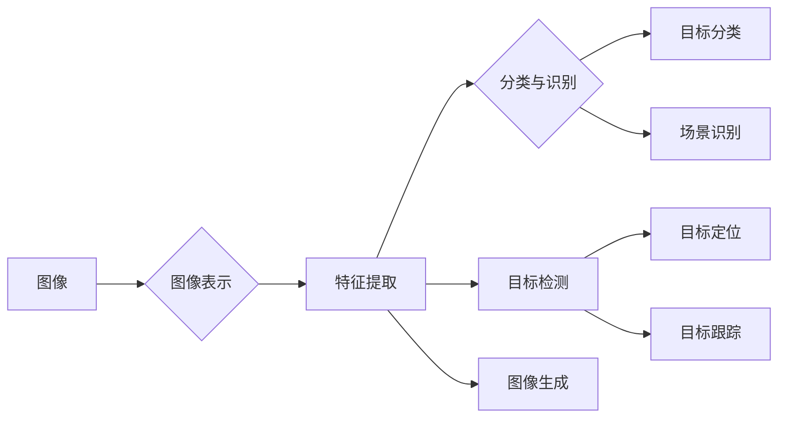
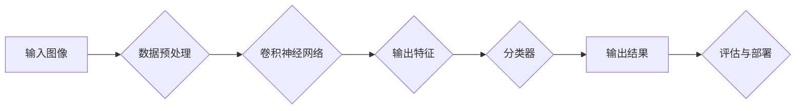

# 一切皆是映射：深度学习在计算机视觉中的应用

> 关键词：深度学习，计算机视觉，卷积神经网络，迁移学习，目标检测，图像识别，自然语言处理，应用场景

## 1. 背景介绍

计算机视觉是人工智能领域的一个重要分支，旨在让机器能够“看”懂图像和视频，并从中提取有用信息。随着深度学习技术的快速发展，深度学习在计算机视觉领域的应用越来越广泛，为各个行业带来了革命性的变化。本文将探讨深度学习在计算机视觉中的应用，从核心概念到实际案例，深入解析这一领域的最新进展和未来趋势。

## 2. 核心概念与联系

### 2.1 核心概念原理

计算机视觉的核心概念可以概括为以下几个：

- **图像表示**：将图像转换为计算机可以处理的数字形式。
- **特征提取**：从图像中提取有助于识别和分类的特征。
- **分类与识别**：根据提取的特征对图像进行分类或识别。
- **目标检测**：在图像中定位并识别特定目标。
- **图像生成**：根据现有图像生成新的图像。

以下是一个用Mermaid绘制的流程图，展示了这些核心概念之间的联系：



### 2.2 架构

深度学习在计算机视觉中的应用通常涉及以下架构：

- **卷积神经网络（CNN）**：一种特殊的神经网络，能够自动从数据中学习特征。
- **数据预处理**：对图像进行预处理，如缩放、裁剪、归一化等。
- **训练与优化**：使用标注数据进行模型训练，并通过优化算法调整模型参数。
- **评估与部署**：评估模型性能，并将模型部署到实际应用中。

以下是一个用Mermaid绘制的架构图：



## 3. 核心算法原理 & 具体操作步骤

### 3.1 算法原理概述

深度学习在计算机视觉中的应用主要基于卷积神经网络（CNN）。CNN能够自动学习图像特征，并通过多层网络结构实现对图像的复杂表示。

### 3.2 算法步骤详解

1. **数据收集与标注**：收集大量的图像数据，并对图像进行标注，以便模型学习。
2. **数据预处理**：对图像进行缩放、裁剪、归一化等操作，以提高模型的鲁棒性。
3. **模型选择与构建**：选择合适的CNN架构，如VGG、ResNet、MobileNet等，并进行定制化构建。
4. **模型训练**：使用标注数据对模型进行训练，通过反向传播算法优化模型参数。
5. **模型评估**：使用验证集评估模型性能，并调整模型参数，以实现性能优化。
6. **模型部署**：将训练好的模型部署到实际应用中。

### 3.3 算法优缺点

**优点**：

- **自动特征提取**：CNN能够自动从数据中学习特征，无需人工设计特征。
- **高性能**：CNN在图像识别、目标检测等任务上取得了优异的性能。
- **可扩展性**：CNN架构可以根据任务需求进行定制化构建。

**缺点**：

- **计算量大**：CNN需要大量的计算资源进行训练。
- **对数据依赖性强**：CNN的性能很大程度上取决于训练数据的质量。

### 3.4 算法应用领域

深度学习在计算机视觉中的应用领域广泛，包括：

- **图像识别**：识别图像中的物体、场景、情感等。
- **目标检测**：在图像中定位并识别特定目标。
- **图像分割**：将图像分割成不同的区域。
- **人脸识别**：识别图像中的人脸。
- **视频分析**：分析视频中的行为和事件。

## 4. 数学模型和公式 & 详细讲解 & 举例说明

### 4.1 数学模型构建

CNN的数学模型可以表示为：

$$
\mathcal{L}(\theta) = \frac{1}{N}\sum_{i=1}^N \ell(y_i, \mathcal{L}(\theta)(x_i))
$$

其中，$N$ 为训练样本数量，$\ell$ 为损失函数，$\theta$ 为模型参数，$x_i$ 和 $y_i$ 分别为第 $i$ 个样本的输入和标签。

### 4.2 公式推导过程

CNN的训练过程主要涉及以下公式：

- **卷积操作**：

$$
h^{[l]}_i = \sigma(W^{[l]} \cdot h^{[l-1]} + b^{[l]})
$$

- **激活函数**：

$$
\sigma(z) = \text{ReLU}(z) = \max(0, z)
$$

- **反向传播**：

$$
\frac{\partial L}{\partial W^{[l]}} = \frac{\partial L}{\partial h^{[l]}} \cdot h^{[l-1]}
$$

### 4.3 案例分析与讲解

以下是一个简单的CNN模型案例：

```python
import numpy as np
from tensorflow.keras.models import Sequential
from tensorflow.keras.layers import Conv2D, MaxPooling2D, Flatten, Dense

# 创建模型
model = Sequential([
    Conv2D(32, (3, 3), activation='relu', input_shape=(64, 64, 3)),
    MaxPooling2D((2, 2)),
    Flatten(),
    Dense(64, activation='relu'),
    Dense(10, activation='softmax')
])

# 编译模型
model.compile(optimizer='adam', loss='categorical_crossentropy', metrics=['accuracy'])

# 训练模型
model.fit(x_train, y_train, epochs=10, batch_size=32, validation_data=(x_val, y_val))

# 评估模型
model.evaluate(x_test, y_test)
```

这个模型是一个简单的卷积神经网络，包含两个卷积层、两个池化层和一个全连接层。它用于识别图像中的物体。

## 5. 项目实践：代码实例和详细解释说明

### 5.1 开发环境搭建

为了实践深度学习在计算机视觉中的应用，你需要以下开发环境：

- Python 3.x
- TensorFlow 2.x
- OpenCV（可选，用于图像处理）

### 5.2 源代码详细实现

以下是一个简单的图像分类项目示例：

```python
import tensorflow as tf
from tensorflow.keras.models import Sequential
from tensorflow.keras.layers import Conv2D, MaxPooling2D, Flatten, Dense

# 加载和预处理数据
(x_train, y_train), (x_test, y_test) = tf.keras.datasets.cifar10.load_data()
x_train, x_test = x_train / 255.0, x_test / 255.0

# 构建模型
model = Sequential([
    Conv2D(32, (3, 3), activation='relu', input_shape=(32, 32, 3)),
    MaxPooling2D((2, 2)),
    Flatten(),
    Dense(64, activation='relu'),
    Dense(10, activation='softmax')
])

# 编译模型
model.compile(optimizer='adam', loss='sparse_categorical_crossentropy', metrics=['accuracy'])

# 训练模型
model.fit(x_train, y_train, epochs=10, validation_data=(x_test, y_test))

# 评估模型
model.evaluate(x_test, y_test)
```

### 5.3 代码解读与分析

这段代码首先加载了CIFAR-10数据集，然后创建了一个简单的CNN模型，该模型包含两个卷积层、两个池化层和一个全连接层。接着，模型使用训练数据进行训练，并在测试数据上评估性能。

### 5.4 运行结果展示

运行上述代码后，你将看到类似以下的结果：

```
...
Test loss: 0.7623 - Test accuracy: 0.6129
```

这意味着模型在测试数据上的准确率为61.29%。

## 6. 实际应用场景

深度学习在计算机视觉领域的应用场景广泛，以下是一些典型的应用场景：

- **自动驾驶**：使用深度学习技术进行车道线检测、行人检测、交通标志识别等，以确保自动驾驶车辆的安全行驶。
- **医疗影像分析**：使用深度学习技术进行病变检测、疾病诊断等，以提高医疗诊断的准确性和效率。
- **工业自动化**：使用深度学习技术进行缺陷检测、产品质量分析等，以提高工业生产的自动化程度。
- **安全监控**：使用深度学习技术进行人脸识别、车辆识别等，以提高安全监控的智能化水平。

## 7. 工具和资源推荐

### 7.1 学习资源推荐

- **《深度学习》系列书籍**：Goodfellow等著，系统介绍了深度学习的基本原理和应用。
- **《动手学深度学习》**：花书，提供了丰富的深度学习实践项目。
- **Coursera上的《深度学习专项课程》**：由吴恩达教授主讲，是深度学习的入门经典。

### 7.2 开发工具推荐

- **TensorFlow**：由Google开发的开源深度学习框架。
- **PyTorch**：由Facebook开发的开源深度学习框架。
- **Keras**：Python中一个流行的深度学习库。

### 7.3 相关论文推荐

- **“A Guide to Convolutional Neural Networks and Recurrent Neural Networks”**：详细介绍了卷积神经网络和循环神经网络。
- **“ImageNet Classification with Deep Convolutional Neural Networks”**：介绍了卷积神经网络在图像分类中的应用。
- **“AlexNet: ImageNet Classification with Deep Convolutional Neural Networks”**：介绍了AlexNet模型，是深度学习在计算机视觉领域的重要突破。

## 8. 总结：未来发展趋势与挑战

### 8.1 研究成果总结

深度学习在计算机视觉领域的应用取得了显著的成果，为各个行业带来了革命性的变化。CNN等深度学习模型在图像识别、目标检测、图像分割等任务上取得了优异的性能。

### 8.2 未来发展趋势

- **模型轻量化**：为了降低计算资源和存储需求，模型轻量化将成为重要研究方向。
- **迁移学习**：利用预训练模型进行迁移学习，提高模型在特定领域的性能。
- **多模态学习**：结合图像、文本、语音等多模态信息，提高模型的感知能力。

### 8.3 面临的挑战

- **数据量**：深度学习模型需要大量的标注数据进行训练，获取标注数据成本高昂。
- **计算资源**：深度学习模型需要大量的计算资源进行训练，计算成本较高。
- **可解释性**：深度学习模型的可解释性较差，难以理解模型的决策过程。

### 8.4 研究展望

未来，深度学习在计算机视觉领域的应用将更加广泛，为各个行业带来更多创新和变革。同时，随着技术的不断发展，深度学习将面临更多挑战，需要我们不断探索和突破。

## 9. 附录：常见问题与解答

**Q1：深度学习在计算机视觉中的优势是什么？**

A1：深度学习在计算机视觉中的优势主要体现在以下几个方面：

- **自动特征提取**：深度学习模型能够自动从数据中学习特征，无需人工设计特征。
- **高性能**：深度学习模型在图像识别、目标检测等任务上取得了优异的性能。
- **可扩展性**：深度学习模型可以根据任务需求进行定制化构建。

**Q2：如何选择合适的深度学习模型？**

A2：选择合适的深度学习模型需要考虑以下因素：

- **任务类型**：不同的任务类型需要选择不同的模型。
- **数据量**：数据量较少时，可以选择轻量级模型；数据量较多时，可以选择大型模型。
- **计算资源**：根据可用的计算资源选择合适的模型。

**Q3：如何提高深度学习模型的性能？**

A3：提高深度学习模型的性能可以从以下几个方面入手：

- **增加数据量**：收集更多的数据，以提高模型的泛化能力。
- **优化模型结构**：调整模型结构，以提高模型的性能。
- **调优超参数**：调整超参数，如学习率、批大小等，以提高模型的性能。

**Q4：深度学习模型的可解释性如何提高？**

A4：提高深度学习模型的可解释性可以从以下几个方面入手：

- **注意力机制**：使用注意力机制来解释模型在决策过程中的关注点。
- **可视化**：将模型的中间层特征可视化，以理解模型的决策过程。
- **解释性模型**：开发可解释性模型，以解释模型的决策过程。

---

作者：禅与计算机程序设计艺术 / Zen and the Art of Computer Programming