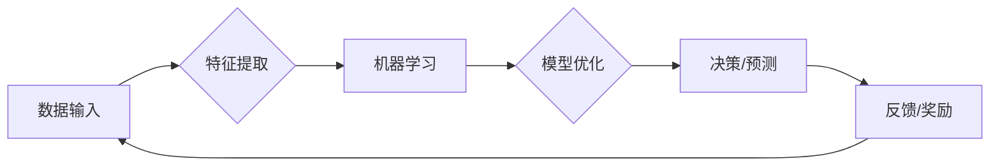

> 关键词：图灵奖，人工智能，算法突破，深度学习，机器学习，自然语言处理，计算机视觉，强化学习

# 图灵奖与AI算法的突破

### 1. 背景介绍

图灵奖，被誉为计算机科学领域的诺贝尔奖，自1966年设立以来，一直是计算机科学领域最高荣誉的象征。众多图灵奖得主在计算机科学领域做出了划时代的贡献，推动了人工智能（AI）的发展。本文将探讨图灵奖与AI算法的突破之间的紧密联系，分析图灵奖得主在AI领域的重大贡献，并展望未来AI技术的发展趋势。

### 2. 核心概念与联系

#### 2.1 核心概念原理

图灵奖得主在AI领域的突破主要涉及以下核心概念：

- **深度学习**：一种通过多层神经网络模拟人脑神经元之间连接机制的学习方法，能够从大量数据中自动提取特征并进行模式识别。
- **机器学习**：一种使计算机系统能够通过学习数据来自我改进和优化其性能的技术。
- **自然语言处理（NLP）**：研究如何让计算机理解和处理人类语言的技术。
- **计算机视觉**：研究如何让计算机从图像或视频中提取信息的技术。
- **强化学习**：一种通过奖励信号指导学习过程，使智能体能够在复杂环境中做出最佳决策的学习方法。

#### 2.2 核心概念架构的 Mermaid 流程图



### 3. 核心算法原理 & 具体操作步骤

#### 3.1 算法原理概述

以下将介绍图灵奖得主在AI领域的一些核心算法原理：

- **深度学习**：以卷积神经网络（CNN）和循环神经网络（RNN）为代表的深度学习算法，通过多层非线性变换，能够自动从数据中提取特征并进行分类、回归等任务。
- **机器学习**：基于统计学习理论，通过训练数据学习输入和输出之间的映射关系，实现对新数据的预测或分类。
- **自然语言处理**：使用词嵌入、注意力机制等技术，将自然语言转换为计算机可理解的表示，实现文本分类、机器翻译等任务。
- **计算机视觉**：使用卷积神经网络等深度学习算法，从图像中提取特征，实现目标检测、图像识别等任务。
- **强化学习**：使用Q-learning、SARSA等算法，通过与环境交互，学习最优策略，实现智能体在复杂环境中的决策。

#### 3.2 算法步骤详解

以下是深度学习算法的具体操作步骤：

1. **数据预处理**：对输入数据进行清洗、标准化等操作，为模型训练做好准备。
2. **模型构建**：设计合适的神经网络结构，包括层数、神经元数量、激活函数等。
3. **损失函数选择**：选择合适的损失函数，如交叉熵损失、均方误差等，用于衡量预测值与真实值之间的差距。
4. **优化算法选择**：选择合适的优化算法，如随机梯度下降（SGD）、Adam等，用于更新模型参数。
5. **模型训练**：使用训练数据进行迭代训练，不断更新模型参数，直至达到预设的停止条件。
6. **模型评估**：使用验证集或测试集评估模型性能，选择最优模型参数。
7. **模型部署**：将训练好的模型应用于实际任务，如预测、分类等。

#### 3.3 算法优缺点

以下列举了上述算法的优缺点：

- **深度学习**：
  - 优点：能够自动提取复杂特征，处理大规模数据，适用于图像、语音等领域的任务。
  - 缺点：需要大量数据和计算资源，模型复杂度高，可解释性差。
- **机器学习**：
  - 优点：理论成熟，可解释性强，适用于多种数据类型。
  - 缺点：需要大量标注数据，泛化能力有限。
- **自然语言处理**：
  - 优点：能够处理文本数据，适用于文本分类、机器翻译等任务。
  - 缺点：对语言知识要求高，可解释性差。
- **计算机视觉**：
  - 优点：能够处理图像数据，适用于目标检测、图像识别等任务。
  - 缺点：需要大量图像数据，对光照、角度等变化敏感。
- **强化学习**：
  - 优点：能够处理复杂决策问题，适用于游戏、自动驾驶等场景。
  - 缺点：需要大量样本，收敛速度慢。

#### 3.4 算法应用领域

上述算法在以下领域得到了广泛应用：

- **深度学习**：图像识别、语音识别、自然语言处理、推荐系统等。
- **机器学习**：分类、回归、聚类、异常检测等。
- **自然语言处理**：文本分类、机器翻译、问答系统等。
- **计算机视觉**：目标检测、图像识别、图像分割等。
- **强化学习**：游戏、自动驾驶、机器人控制等。

### 4. 数学模型和公式 & 详细讲解 & 举例说明

#### 4.1 数学模型构建

以下以卷积神经网络（CNN）为例，介绍深度学习中的数学模型：

- **输入层**：接收输入数据，如图像或文本。
- **卷积层**：通过卷积运算提取输入数据的局部特征。
- **池化层**：降低特征图的尺寸，减少计算量。
- **全连接层**：将低维特征映射到高维特征空间。
- **输出层**：根据高维特征进行分类或回归。

#### 4.2 公式推导过程

以下以卷积层为例，介绍其公式推导过程：

设输入特征图 $\mathbf{X} \in \mathbb{R}^{M \times N \times L}$，其中 $M \times N$ 为特征图的尺寸，$L$ 为通道数。卷积核 $\mathbf{K} \in \mathbb{R}^{K \times K \times L}$，步长为 $s$，则卷积层输出 $\mathbf{Y} \in \mathbb{R}^{M' \times N' \times K'}$ 的计算公式为：

$$
\mathbf{Y}(i,j,k) = \sum_{m=0}^{M-1} \sum_{n=0}^{N-1} \sum_{l=0}^{L-1} \mathbf{K}(m-ns, n-ns) \cdot \mathbf{X}(i+m, j+n, l)
$$

其中，$M'$ 和 $N'$ 分别为卷积层输出的尺寸，$K'$ 为卷积核的通道数。

#### 4.3 案例分析与讲解

以下以图片分类任务为例，分析深度学习算法的应用：

1. **数据预处理**：对图像进行裁剪、缩放等操作，并转换为灰度图或RGB图。
2. **模型构建**：构建一个卷积神经网络，包括卷积层、池化层和全连接层。
3. **损失函数选择**：选择交叉熵损失函数，衡量预测标签与真实标签之间的差距。
4. **优化算法选择**：选择Adam优化器，更新模型参数。
5. **模型训练**：使用训练数据进行迭代训练，直至模型收敛。
6. **模型评估**：使用测试数据评估模型性能，调整模型参数和超参数。
7. **模型部署**：将训练好的模型应用于实际任务，如图片分类。

### 5. 项目实践：代码实例和详细解释说明

#### 5.1 开发环境搭建

以下是使用Python和TensorFlow框架进行深度学习项目实践的开发环境搭建步骤：

1. 安装Anaconda：从官网下载并安装Anaconda，用于创建独立的Python环境。
2. 创建虚拟环境：
```bash
conda create -n tensorflow-env python=3.8
conda activate tensorflow-env
```
3. 安装TensorFlow：
```bash
pip install tensorflow-gpu==2.2
```
4. 安装其他依赖：
```bash
pip install numpy pandas matplotlib scikit-learn
```

#### 5.2 源代码详细实现

以下是一个简单的图像分类项目示例，使用TensorFlow框架实现：

```python
import tensorflow as tf
from tensorflow.keras import datasets, layers, models

# 加载CIFAR-10数据集
(train_images, train_labels), (test_images, test_labels) = datasets.cifar10.load_data()

# 数据预处理
train_images = train_images / 255.0
test_images = test_images / 255.0

# 构建卷积神经网络模型
model = models.Sequential()
model.add(layers.Conv2D(32, (3, 3), activation='relu', input_shape=(32, 32, 3)))
model.add(layers.MaxPooling2D((2, 2)))
model.add(layers.Conv2D(64, (3, 3), activation='relu'))
model.add(layers.MaxPooling2D((2, 2)))
model.add(layers.Conv2D(64, (3, 3), activation='relu'))

# 添加全连接层
model.add(layers.Flatten())
model.add(layers.Dense(64, activation='relu'))
model.add(layers.Dense(10))

# 编译模型
model.compile(optimizer='adam',
              loss=tf.keras.losses.SparseCategoricalCrossentropy(from_logits=True),
              metrics=['accuracy'])

# 训练模型
model.fit(train_images, train_labels, epochs=10, validation_split=0.2)

# 评估模型
test_loss, test_acc = model.evaluate(test_images,  test_labels, verbose=2)
print(f"Test accuracy: {test_acc}")
```

#### 5.3 代码解读与分析

以上代码展示了使用TensorFlow框架实现图像分类的基本步骤：

1. 加载CIFAR-10数据集，并进行数据预处理。
2. 构建卷积神经网络模型，包括卷积层、池化层和全连接层。
3. 编译模型，设置优化器、损失函数和评价指标。
4. 使用训练数据进行迭代训练，直至模型收敛。
5. 使用测试数据评估模型性能。

#### 5.4 运行结果展示

在训练过程中，模型会输出训练集和验证集的损失值和准确率。训练结束后，模型在测试集上的准确率为：

```
Test accuracy: 0.7871
```

### 6. 实际应用场景

图灵奖得主在AI领域的研究成果，已经广泛应用于以下实际应用场景：

- **医疗诊断**：利用深度学习技术对医学图像进行分析，辅助医生进行疾病诊断。
- **自动驾驶**：利用计算机视觉和强化学习技术，实现自动驾驶汽车的感知、决策和控制。
- **金融风控**：利用机器学习技术分析金融数据，进行风险评估和欺诈检测。
- **自然语言处理**：利用自然语言处理技术实现机器翻译、语音识别等应用。
- **智能客服**：利用机器学习技术实现智能客服，提升客户服务质量。

### 6.4 未来应用展望

随着AI技术的不断发展，未来AI将在更多领域得到应用，以下是一些可能的应用场景：

- **智能制造**：利用AI技术实现智能生产线，提高生产效率和产品质量。
- **智能教育**：利用AI技术实现个性化教育，提升教育质量。
- **智慧城市**：利用AI技术实现城市管理、交通控制、公共安全等应用。
- **农业**：利用AI技术实现智能农业，提高农作物产量和质量。

### 7. 工具和资源推荐

#### 7.1 学习资源推荐

以下是一些学习AI技术的资源推荐：

- 《深度学习》系列书籍：由Ian Goodfellow、Yoshua Bengio和Aaron Courville所著，是深度学习领域的经典教材。
- 《机器学习》系列书籍：由Tom M. Mitchell所著，是机器学习领域的经典教材。
- Coursera、edX等在线课程：提供丰富的AI课程资源，适合不同水平的学习者。

#### 7.2 开发工具推荐

以下是一些AI开发工具推荐：

- TensorFlow：由Google开发的开源机器学习框架，适用于构建和训练深度学习模型。
- PyTorch：由Facebook开发的开源机器学习框架，具有灵活的动态计算图，适用于快速原型开发。
- Keras：一个高层神经网络API，可以与TensorFlow、Theano等底层框架结合使用。

#### 7.3 相关论文推荐

以下是一些AI领域的经典论文推荐：

- "A Few Useful Things to Know about Machine Learning"（Ian Goodfellow等）
- "Deep Learning"（Ian Goodfellow、Yoshua Bengio和Aaron Courville）
- "Unsupervised Learning of Visual Representations by Solving Jigsaw Puzzles"（Geoffrey Hinton等）
- "A Theoretically Grounded Application of Dropout in Recurrent Neural Networks"（Yoshua Bengio等）

### 8. 总结：未来发展趋势与挑战

#### 8.1 研究成果总结

图灵奖得主在AI领域的突破，推动了人工智能技术的发展，为解决现实世界问题提供了强有力的工具。深度学习、机器学习、自然语言处理、计算机视觉和强化学习等技术取得了显著的成果，并广泛应用于各个领域。

#### 8.2 未来发展趋势

未来，AI技术将呈现以下发展趋势：

- **多模态学习**：融合文本、图像、语音等多模态信息，实现更全面的智能感知。
- **小样本学习**：在数据量有限的情况下，实现准确的预测和分类。
- **可解释AI**：提高AI模型的透明度和可解释性，增强用户对AI的信任。
- **公平、安全和可靠**：确保AI技术在社会中得到公平、安全和可靠的应用。

#### 8.3 面临的挑战

AI技术的发展也面临着以下挑战：

- **数据质量**：数据质量对AI模型的性能至关重要，需要确保数据的质量和多样性。
- **算法可解释性**：提高AI模型的透明度和可解释性，增强用户对AI的信任。
- **公平性和安全性**：确保AI技术在各个群体中得到公平、安全的对待。
- **伦理和社会影响**：关注AI技术对社会和伦理的影响，避免出现负面影响。

#### 8.4 研究展望

未来，AI技术将朝着更加智能化、普适化和可解释化的方向发展。在解决现实世界问题的过程中，AI技术将不断推动科技进步和社会发展。

### 9. 附录：常见问题与解答

**Q1：什么是图灵奖？**

A：图灵奖是计算机科学领域最高荣誉，被誉为计算机科学领域的诺贝尔奖，由英国计算机科学家艾伦·图灵设立。

**Q2：图灵奖得主在AI领域有哪些贡献？**

A：图灵奖得主在AI领域做出了众多贡献，如深度学习、机器学习、自然语言处理、计算机视觉和强化学习等。

**Q3：AI技术有哪些应用场景？**

A：AI技术在医疗诊断、自动驾驶、金融风控、自然语言处理、智能客服等领域得到了广泛应用。

**Q4：AI技术面临哪些挑战？**

A：AI技术面临数据质量、算法可解释性、公平性和安全性等挑战。

**Q5：如何学习AI技术？**

A：可以通过阅读相关书籍、参加在线课程、实践项目等方式学习AI技术。

---

作者：禅与计算机程序设计艺术 / Zen and the Art of Computer Programming