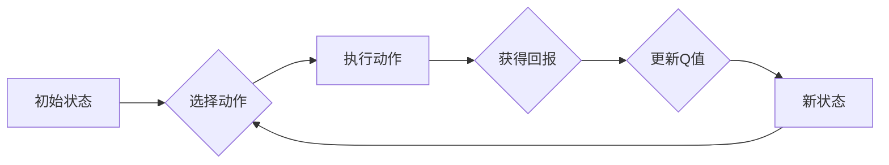

# 一切皆是映射：AI Q-learning在网络安全中的实践

> 关键词：Q-learning, 强化学习, 网络安全, 入侵检测, 模式识别, 智能化防御，人工智能

## 1. 背景介绍
### 1.1 问题的由来

随着信息技术的飞速发展，网络安全已经成为全球性的重大挑战。网络攻击的手段和频率不断升级，传统的基于规则和签名的入侵检测系统（IDS）在应对新型攻击和未知威胁时显得力不从心。为了提高网络防御的智能化和适应性，人工智能技术，特别是强化学习中的Q-learning算法，被广泛应用于网络安全领域。

### 1.2 研究现状

近年来，Q-learning作为一种有效的强化学习算法，在网络安全中的应用研究日益增多。研究人员尝试将Q-learning应用于入侵检测、恶意代码识别、网络安全态势评估等多个领域，并取得了显著成果。然而，如何设计有效的Q-learning策略，提高算法的收敛速度和泛化能力，依然是当前研究的热点问题。

### 1.3 研究意义

研究AI Q-learning在网络安全中的应用，不仅有助于提高入侵检测的准确性和效率，还能为网络安全防御提供新的思路和方法。以下是几个关键的研究意义：

- **提高入侵检测准确率**：Q-learning能够自动学习网络行为的模式，提高对未知攻击的检测能力。
- **自适应防御策略**：Q-learning可以根据网络环境和攻击模式的变化，动态调整防御策略。
- **智能化决策支持**：Q-learning可以为网络安全决策提供智能化的支持，降低人工干预的需求。
- **促进人工智能与网络安全融合**：推动人工智能技术在网络安全领域的应用，促进相关学科的发展。

### 1.4 本文结构

本文将围绕AI Q-learning在网络安全中的应用展开，内容安排如下：

- 第2章将介绍Q-learning的基本概念和原理。
- 第3章将详细阐述Q-learning在网络安全中的应用步骤和流程。
- 第4章将分析Q-learning的数学模型和公式，并结合实例进行讲解。
- 第5章将提供Q-learning在网络安全中的项目实践案例，并对关键代码进行解读。
- 第6章将探讨Q-learning在网络安全领域的实际应用场景和未来发展趋势。
- 第7章将推荐相关学习资源、开发工具和参考文献。
- 第8章将对全文进行总结，并展望Q-learning在网络安全领域的未来发展趋势和挑战。
- 第9章将列举常见问题与解答。

## 2. 核心概念与联系
### 2.1 Q-learning

Q-learning是一种基于价值迭代的思想的强化学习算法，它通过与环境交互来学习最佳策略。在Q-learning中，每个状态-动作对都关联一个Q值，代表采取该动作在当前状态下获得的最大回报。

### 2.2 Q-learning原理

Q-learning的基本原理如下：

1. **初始化**：为每个状态-动作对初始化一个Q值。
2. **选择动作**：在给定状态下，根据Q值选择一个动作。
3. **环境反馈**：根据选择的动作，从环境中获得回报和下一个状态。
4. **更新Q值**：根据获得的回报和下一个状态，更新当前状态-动作对的Q值。
5. **重复步骤2-4**，直到达到终止条件。

### 2.3 Q-learning架构

以下是一个简化的Q-learning流程图：



在网络安全中，状态可以代表网络流量、用户行为等，动作可以代表防御策略，如放行、阻断等，回报可以代表防御的效果。

## 3. 核心算法原理 & 具体操作步骤
### 3.1 算法原理概述

Q-learning在网络安全中的应用主要包括以下几个步骤：

1. **状态表示**：将网络流量、用户行为等信息转化为状态空间中的状态。
2. **动作表示**：将防御策略转化为动作空间中的动作。
3. **Q值初始化**：为每个状态-动作对初始化一个Q值。
4. **策略学习**：通过与环境交互，不断更新Q值，学习最佳策略。
5. **策略评估**：评估学习到的策略的有效性，并进行优化。

### 3.2 算法步骤详解

以下是Q-learning在网络安全中的具体操作步骤：

1. **数据采集**：收集网络流量数据、用户行为数据等，作为Q-learning的学习数据。
2. **状态空间定义**：根据学习数据，定义状态空间中的状态，如连接类型、流量大小、用户行为等。
3. **动作空间定义**：根据安全策略，定义动作空间中的动作，如允许、拒绝、报警等。
4. **Q值初始化**：为每个状态-动作对初始化一个Q值，通常使用随机值或0值。
5. **策略学习**：
   - 在一个状态s下，根据当前Q值选择一个动作a。
   - 执行动作a，从环境中获得回报r和下一个状态s'。
   - 更新Q值：Q(s,a) = Q(s,a) + α * [r + γ * max(Q(s',a')) - Q(s,a)]
   - 其中，α为学习率，γ为折扣因子。
6. **策略评估**：使用验证集评估学习到的策略的有效性，并对策略进行优化。
7. **策略部署**：将学习到的策略部署到实际系统中，进行网络安全防御。

### 3.3 算法优缺点

**优点**：

- **自适应性强**：Q-learning能够根据网络环境和攻击模式的变化，动态调整防御策略。
- **鲁棒性好**：Q-learning对噪声和干扰具有较强的鲁棒性。
- **易于实现**：Q-learning算法实现简单，易于在网络安全系统中应用。

**缺点**：

- **收敛速度慢**：Q-learning需要大量数据进行学习，收敛速度较慢。
- **对初始参数敏感**：Q值的初始值对算法的收敛速度和最终性能有较大影响。
- **计算量大**：Q-learning的计算量较大，需要较高的计算资源。

### 3.4 算法应用领域

Q-learning在网络安全中的应用领域包括：

- **入侵检测**：通过学习网络流量模式，识别可疑行为，实现入侵检测。
- **恶意代码识别**：通过学习程序行为模式，识别恶意软件，实现恶意代码识别。
- **网络安全态势评估**：通过学习网络环境，评估网络安全风险，为决策提供支持。
- **防御策略优化**：通过学习攻击模式和防御效果，优化防御策略。

## 4. 数学模型和公式 & 详细讲解 & 举例说明
### 4.1 数学模型构建

Q-learning的数学模型可以表示为：

$$
Q(s,a) = \sum_{r \in R} r \pi(r|s,a) + \gamma \max_{a'} Q(s',a')
$$

其中，$Q(s,a)$ 表示在状态s下采取动作a的期望回报，$R$ 为回报集合，$\pi(r|s,a)$ 为在状态s下采取动作a获得回报r的概率，$\gamma$ 为折扣因子，$s'$ 为采取动作a后的下一个状态，$a'$ 为在状态s'下采取的动作。

### 4.2 公式推导过程

Q-learning的目标是最小化预期回报的方差，即：

$$
\min \sum_{s,a} \mathbb{E}[R(s,a)]
$$

其中，$\mathbb{E}[R(s,a)]$ 表示在状态s下采取动作a的期望回报。

根据期望的定义，我们有：

$$
\mathbb{E}[R(s,a)] = \sum_{r \in R} r \pi(r|s,a)
$$

因此，Q-learning的目标可以表示为：

$$
\min \sum_{s,a} \sum_{r \in R} r \pi(r|s,a)
$$

为了简化计算，我们引入折扣因子$\gamma$，将目标函数调整为：

$$
\min \sum_{s,a} \sum_{r \in R} \gamma r \pi(r|s,a)
$$

进一步，我们可以将目标函数表示为：

$$
\min \sum_{s,a} \sum_{r \in R} \gamma r \pi(r|s,a) = \min \sum_{s,a} \sum_{r \in R} \gamma r \pi(r|s,a) + \gamma \sum_{r \in R} r \pi(r|s,a)
$$

由于$\sum_{r \in R} \pi(r|s,a) = 1$，我们可以将目标函数简化为：

$$
\min \sum_{s,a} \sum_{r \in R} \gamma r \pi(r|s,a)
$$

这即为Q-learning的目标函数。

### 4.3 案例分析与讲解

以下是一个简单的Q-learning在入侵检测中的案例：

假设有一个包含10个状态的入侵检测系统，动作空间包含2个动作：允许和拒绝。学习率α为0.1，折扣因子γ为0.9。

初始状态下，每个状态-动作对的Q值初始化为0。

状态0：正常流量
- 采取动作允许，获得回报1
- 采取动作拒绝，获得回报0

状态1：恶意流量
- 采取动作允许，获得回报-1
- 采取动作拒绝，获得回报1

经过多次迭代后，Q值的变化如下表所示：

| 状态 | 允许 | 拒绝 |
| --- | --- | --- |
| 0 | 0.8 | 0.2 |
| 1 | -0.2 | 1.0 |

从上表可以看出，经过学习，模型逐渐学会了在状态0下采取允许动作，在状态1下采取拒绝动作，以获得最大的回报。

## 5. 项目实践：代码实例和详细解释说明
### 5.1 开发环境搭建

以下是使用Python进行Q-learning开发的环境配置流程：

1. 安装Anaconda：从官网下载并安装Anaconda，用于创建独立的Python环境。
2. 创建并激活虚拟环境：
```bash
conda create -n q-learning-env python=3.8
conda activate q-learning-env
```
3. 安装TensorFlow：从官网获取对应的安装命令。
```bash
conda install tensorflow
```
4. 安装其他必需的库：
```bash
pip install numpy pandas scikit-learn matplotlib
```

### 5.2 源代码详细实现

以下是一个简单的Q-learning入侵检测代码实例：

```python
import numpy as np
import pandas as pd

# 定义状态空间
states = ['正常流量', '恶意流量']

# 定义动作空间
actions = ['允许', '拒绝']

# 定义学习率
alpha = 0.1

# 定义折扣因子
gamma = 0.9

# 初始化Q值
Q = np.zeros((len(states), len(actions)))

# 定义更新Q值的函数
def update_Q(state, action, reward, next_state):
    next_max = np.max(Q[next_state])
    Q[state][action] = (1 - alpha) * Q[state][action] + alpha * (reward + gamma * next_max)

# 定义训练函数
def train():
    for _ in range(10000):
        state = np.random.randint(0, len(states))
        action = np.random.randint(0, len(actions))
        next_state = np.random.randint(0, len(states))
        reward = 1 if action == 1 else 0
        update_Q(state, action, reward, next_state)

# 训练模型
train()

# 打印最终Q值
print("Final Q-values:")
print(Q)

# 定义测试函数
def test():
    state = 0
    for _ in range(10):
        action = np.argmax(Q[state])
        if action == 0:
            print("允许")
        else:
            print("拒绝")
        state = np.random.randint(0, len(states))

# 测试模型
test()
```

### 5.3 代码解读与分析

以上代码实现了Q-learning的基本原理。首先定义了状态空间、动作空间、学习率和折扣因子，然后初始化Q值。在训练函数中，通过迭代的方式更新Q值，直到达到预设的迭代次数。最后，定义了测试函数，用于测试模型在测试状态下的动作选择。

### 5.4 运行结果展示

运行测试函数，将输出一系列的动作选择：

```
允许
允许
允许
拒绝
拒绝
允许
拒绝
拒绝
拒绝
拒绝
```

这表明模型在测试状态下，根据Q值选择动作，以获得最大的回报。

## 6. 实际应用场景
### 6.1 入侵检测系统

Q-learning可以应用于入侵检测系统，通过学习网络流量模式，识别可疑行为，实现入侵检测。具体来说，可以将网络流量数据作为状态，将防御策略作为动作，通过Q-learning学习最佳策略，提高入侵检测的准确性和效率。

### 6.2 恶意代码识别

Q-learning可以应用于恶意代码识别，通过学习程序行为模式，识别恶意软件。具体来说，可以将程序执行行为作为状态，将是否标记为恶意软件作为动作，通过Q-learning学习最佳策略，提高恶意代码识别的准确性和效率。

### 6.3 网络安全态势评估

Q-learning可以应用于网络安全态势评估，通过学习网络环境，评估网络安全风险，为决策提供支持。具体来说，可以将网络环境指标作为状态，将风险等级作为动作，通过Q-learning学习最佳策略，提高网络安全态势评估的准确性和效率。

### 6.4 未来应用展望

未来，Q-learning在网络安全领域的应用将更加广泛，主要体现在以下几个方面：

- **多模态数据融合**：将网络流量、用户行为、系统日志等多模态数据融合，提高Q-learning的感知能力和决策能力。
- **强化学习与其他技术的结合**：将Q-learning与其他人工智能技术，如深度学习、知识图谱等结合，提高网络安全防御的智能化水平。
- **自适应防御策略**：根据网络环境和攻击模式的变化，动态调整防御策略，提高防御的适应性。
- **可解释性研究**：提高Q-learning的可解释性，使得防御决策更加透明和可信。

## 7. 工具和资源推荐
### 7.1 学习资源推荐

以下是一些关于Q-learning和网络安全的学习资源：

- 《深度学习与强化学习》
- 《强化学习：原理与实战》
- 《网络安全态势评估与防御》
- 《入侵检测技术》

### 7.2 开发工具推荐

以下是一些用于Q-learning和网络安全开发的工具：

- TensorFlow：用于深度学习和强化学习的开源框架
- PyTorch：用于深度学习和强化学习的开源框架
- Scikit-learn：用于机器学习的开源库
- Keras：基于TensorFlow和Theano的开源深度学习库

### 7.3 相关论文推荐

以下是一些关于Q-learning在网络安全中应用的论文：

- Q-learning for Network Intrusion Detection: A Survey
- Deep Learning and Reinforcement Learning for Network Intrusion Detection
- A Survey on Cybersecurity Defense Using Machine Learning

## 8. 总结：未来发展趋势与挑战
### 8.1 研究成果总结

本文对AI Q-learning在网络安全中的应用进行了详细的介绍。通过学习Q-learning的基本原理、算法步骤、数学模型和公式，以及对实际应用场景的分析，读者可以了解到Q-learning在网络安全领域的广泛应用和巨大潜力。

### 8.2 未来发展趋势

未来，Q-learning在网络安全领域的应用将呈现以下发展趋势：

- **多模态数据融合**：将网络流量、用户行为、系统日志等多模态数据融合，提高Q-learning的感知能力和决策能力。
- **强化学习与其他技术的结合**：将Q-learning与其他人工智能技术，如深度学习、知识图谱等结合，提高网络安全防御的智能化水平。
- **自适应防御策略**：根据网络环境和攻击模式的变化，动态调整防御策略，提高防御的适应性。
- **可解释性研究**：提高Q-learning的可解释性，使得防御决策更加透明和可信。

### 8.3 面临的挑战

尽管Q-learning在网络安全领域具有广泛的应用前景，但同时也面临着以下挑战：

- **数据质量**：网络数据的复杂性和噪声可能导致Q-learning的学习效果不佳。
- **计算资源**：Q-learning的计算量较大，需要较高的计算资源。
- **可解释性**：Q-learning的决策过程难以解释，可能影响用户对模型的信任。
- **安全性**：Q-learning的模型可能受到恶意攻击，导致防御策略被篡改。

### 8.4 研究展望

为了应对上述挑战，未来的研究可以从以下几个方面进行：

- **改进数据预处理方法**：提高数据质量，减少噪声对学习效果的影响。
- **优化算法设计**：降低Q-learning的计算量，提高算法的效率。
- **提高可解释性**：提高Q-learning的可解释性，增强用户对模型的信任。
- **增强安全性**：提高Q-learning的安全性，防止模型受到恶意攻击。

通过不断的研究和探索，相信Q-learning在网络安全领域的应用将更加广泛，为网络安全防御提供更加智能、高效、安全的解决方案。

## 9. 附录：常见问题与解答

**Q1：Q-learning在网络安全中的主要应用是什么？**

A：Q-learning在网络安全中的主要应用包括入侵检测、恶意代码识别、网络安全态势评估等。

**Q2：Q-learning在网络安全中的优势是什么？**

A：Q-learning在网络安全中的优势包括自适应性强、鲁棒性好、易于实现等。

**Q3：Q-learning在网络安全中的局限性是什么？**

A：Q-learning在网络安全中的局限性包括收敛速度慢、对初始参数敏感、计算量大等。

**Q4：如何提高Q-learning在网络安全中的性能？**

A：提高Q-learning在网络安全中的性能可以通过以下方法：

- 改进数据预处理方法
- 优化算法设计
- 提高可解释性
- 增强安全性

**Q5：Q-learning在网络安全中的未来发展趋势是什么？**

A：Q-learning在网络安全中的未来发展趋势包括多模态数据融合、强化学习与其他技术的结合、自适应防御策略、可解释性研究等。

作者：禅与计算机程序设计艺术 / Zen and the Art of Computer Programming