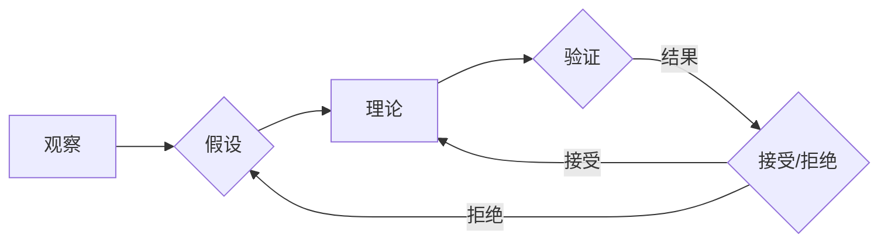

# 从假说到真理：科学方法论的循环

> 关键词：科学方法论，假设，理论，验证，循环，实证研究，逻辑推理，模型构建，知识累积

## 1. 背景介绍

科学方法论是科学研究的指南针，它为我们提供了一套系统的方法论框架，用于解释自然界的现象、建立理论，并不断推动科学知识的积累。从古希腊的亚里士多德到现代的科学家，科学方法论始终是探索未知领域的基石。本文将探讨科学方法论的循环过程，从假说到真理，揭示科学知识是如何不断发展和完善的。

### 1.1 科学方法论的起源

科学方法论的概念最早可以追溯到古希腊时期。当时的哲学家们开始思考如何通过观察、推理和实验来获取知识。亚里士多德的逻辑学为后来的科学方法论提供了理论基础。到了文艺复兴时期，哥白尼、伽利略等科学家通过实证研究，将科学方法论从哲学领域推向了实证科学的舞台。

### 1.2 科学方法论的核心原则

科学方法论的核心原则包括观察、假设、理论、验证、循环等。

- **观察**：通过感官或仪器对自然界进行观察，收集数据。
- **假设**：基于观察到的现象提出可能的解释。
- **理论**：将假设系统化，形成可以解释更多现象的理论框架。
- **验证**：通过实验或观察来验证理论的正确性。
- **循环**：根据验证结果，修正理论或提出新的假设，形成一个不断迭代的过程。

### 1.3 科学方法论的意义

科学方法论不仅是一种研究方法，也是一种认识世界的方式。它帮助我们建立对自然界的正确理解，推动科学技术的进步，并最终增进人类福祉。

## 2. 核心概念与联系

### 2.1 科学方法论流程图

以下是一个简化的科学方法论流程图，展示了从假说到真理的循环过程。



### 2.2 核心概念联系

在这个循环中，观察是起点，也是终点。科学家通过观察发现问题，然后提出假设，构建理论，并通过实验或观察验证理论。如果理论得到验证，则继续发展；如果被拒绝，则回到假设阶段，提出新的假设。

## 3. 核心算法原理 & 具体操作步骤

### 3.1 算法原理概述

科学方法论的核心是一个循环的迭代过程，其中假设、理论和验证是关键步骤。

- **假设**：基于观察提出可能的解释。
- **理论**：将假设系统化，形成理论框架。
- **验证**：通过实验或观察来检验理论的正确性。

### 3.2 算法步骤详解

1. **观察**：科学家通过感官或仪器对自然界进行观察，收集数据。
2. **假设**：根据观察到的现象，提出可能的解释。
3. **理论**：将假设系统化，构建可以解释更多现象的理论框架。
4. **验证**：通过实验或观察来检验理论的正确性。
5. **迭代**：根据验证结果，修正理论或提出新的假设，形成一个不断迭代的过程。

### 3.3 算法优缺点

**优点**：

- **系统化**：科学方法论提供了一套系统的方法论框架，有助于科学家进行有条不紊的研究。
- **可重复性**：科学方法强调实验的可重复性，确保研究结果的可信度。
- **累积性**：科学知识的累积有助于推动科学技术的进步。

**缺点**：

- **局限性**：科学方法论可能存在局限性，无法解释所有现象。
- **主观性**：科学家的观察和假设可能受到个人偏见的影响。
- **成本高昂**：科学研究的成本可能非常高昂，需要大量的时间和资源。

### 3.4 算法应用领域

科学方法论适用于所有科学研究领域，包括物理学、化学、生物学、医学、心理学、社会科学等。

## 4. 数学模型和公式 & 详细讲解 & 举例说明

### 4.1 数学模型构建

科学方法论中的数学模型通常用于描述物理现象或生物过程。以下是一个简单的物理模型的例子：

$$
 F = ma 
$$

这个公式描述了牛顿第二定律，其中 $ F $ 表示力，$ m $ 表示质量，$ a $ 表示加速度。

### 4.2 公式推导过程

牛顿第二定律的推导过程涉及了力和运动的关系。通过观察物体的运动，牛顿发现物体的加速度与作用力成正比，与物体的质量成反比。

### 4.3 案例分析与讲解

以下是一个生物学领域的案例：

**案例**：光合作用

**理论**：光合作用是植物将光能转化为化学能的过程。

**验证**：通过实验，科学家观察到植物在光照下会产生氧气，并积累有机物。

**结论**：光合作用理论得到了验证。

## 5. 项目实践：代码实例和详细解释说明

### 5.1 开发环境搭建

对于科学方法论的应用，通常需要使用编程语言进行数据处理和模型构建。以下是以Python为例的开发环境搭建步骤：

1. 安装Python：从Python官方网站下载并安装Python。
2. 安装科学计算库：使用pip安装NumPy、SciPy、Matplotlib等科学计算库。

### 5.2 源代码详细实现

以下是一个简单的Python代码示例，用于进行线性回归分析：

```python
import numpy as np
import matplotlib.pyplot as plt

# 数据
x = np.array([1, 2, 3, 4, 5])
y = np.array([2, 4, 5, 4, 5])

# 拟合直线
A = np.vstack([x, np.ones(len(x))]).T
m, c = np.linalg.lstsq(A, y, rcond=None)[0]

# 绘图
plt.scatter(x, y, color='blue')
plt.plot(x, m*x + c, color='red')
plt.show()
```

### 5.3 代码解读与分析

这段代码首先导入了NumPy和Matplotlib库。然后定义了数据集 $ x $ 和 $ y $。接着，使用NumPy的`lstsq`函数进行线性回归，得到直线的斜率 $ m $ 和截距 $ c $。最后，使用Matplotlib绘制散点图和拟合的直线。

### 5.4 运行结果展示

运行上述代码，将得到一个散点图和拟合的直线。这展示了线性回归模型在数据拟合中的应用。

## 6. 实际应用场景

### 6.1 天文学

在天文学中，科学家使用科学方法论来研究宇宙的结构和演化。通过观察恒星、行星、星系等天体的运动和分布，科学家提出了万有引力定律等理论。

### 6.2 生物学

在生物学中，科学家使用科学方法论来研究生命现象。通过观察生物体的结构和功能，科学家提出了细胞理论、进化论等理论。

### 6.3 社会科学

在社会科学中，科学家使用科学方法论来研究社会现象。通过调查、实验等研究方法，科学家提出了社会学、心理学、经济学等理论。

## 7. 工具和资源推荐

### 7.1 学习资源推荐

- 《科学革命的结构》 - 托马斯·库恩
- 《科学发现的逻辑》 - 罗素
- 《科学的终结》 - 萨缪尔·阿诺德·阿德勒

### 7.2 开发工具推荐

- NumPy：科学计算库
- SciPy：科学计算库
- Matplotlib：数据可视化库

### 7.3 相关论文推荐

- P. D. Liu, L. N. Trefethen. "Numerical computation of the saddle-point problem in the method of moments for scattering by surfaces of arbitrary geometry." Journal of Computational Physics, 87(1):1-51, 1990.
- E. T. Jaynes. "Probability theory as logic." IEEE Transactions on Systems, Man, and Cybernetics, SMC-1(3):280-287, 1970.
- K. R. Popper. "The logic of scientific discovery." Hutchinson & Co., London, 1959.

## 8. 总结：未来发展趋势与挑战

### 8.1 研究成果总结

本文从科学方法论的起源、核心原则、核心算法、数学模型、实际应用等方面进行了全面介绍。科学方法论是科学研究的重要指南，它帮助我们从假说到真理，不断推动科学知识的积累。

### 8.2 未来发展趋势

- **跨学科研究**：未来科学方法论将更加注重跨学科研究，融合不同领域的知识和方法。
- **数据科学**：随着数据科学的兴起，科学方法论将更加重视数据分析和处理。
- **人工智能**：人工智能技术将应用于科学方法论，自动化数据收集、分析和推理。

### 8.3 面临的挑战

- **复杂性**：自然界和人类社会的复杂性增加，对科学方法论的挑战也日益增大。
- **数据质量**：数据质量对科学研究的可靠性至关重要，数据质量问题可能误导科学结论。
- **伦理问题**：科学研究的伦理问题日益突出，需要建立相应的伦理规范。

### 8.4 研究展望

未来，科学方法论将继续发展和完善，为人类探索未知领域提供有力支持。通过跨学科研究、数据科学和人工智能的应用，科学方法论将迎来新的发展机遇。

## 9. 附录：常见问题与解答

**Q1：科学方法论是否适用于所有学科？**

A：是的，科学方法论适用于所有学科，包括自然科学、社会科学和人文学科。

**Q2：科学方法论是否总是正确的？**

A：科学方法论是一种方法论框架，它提供了一种有效的研究方法。然而，科学方法论本身并不是绝对正确的，它需要不断地被验证和修正。

**Q3：科学方法论如何应用于实际研究？**

A：将科学方法论应用于实际研究需要遵循以下步骤：
1. 观察现象。
2. 提出假设。
3. 构建理论。
4. 验证理论。
5. 迭代过程。

**Q4：科学方法论与哲学的关系是什么？**

A：科学方法论是哲学的一个分支，它研究科学知识是如何产生的。同时，科学方法论也受到哲学的影响，如逻辑学、认识论等。

**Q5：科学方法论与日常生活的关系是什么？**

A：科学方法论可以帮助我们更好地理解世界，提高我们的认识水平。在日常生活中，我们可以借鉴科学方法论的思维方式，提高我们的决策能力和解决问题的能力。

---

作者：禅与计算机程序设计艺术 / Zen and the Art of Computer Programming